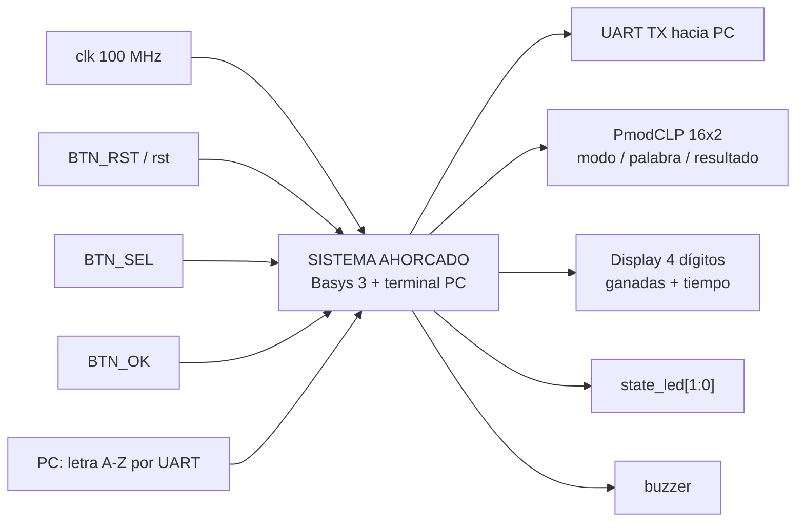
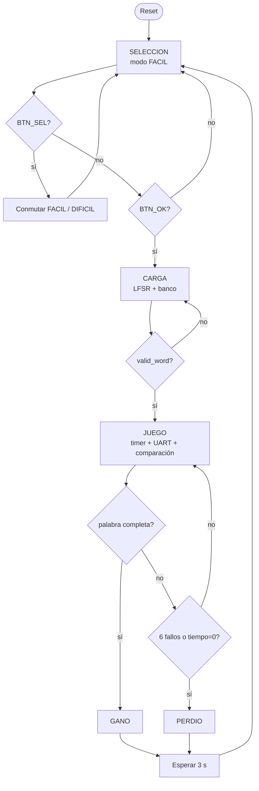

# Nivel 1

## Diagrama de primer nivel

## Objetivo

El sistema implementa el juego de ahorcado con la **lógica de juego dentro de la FPGA**. La PC
funciona como terminal: envía letras A-Z y presenta el estado que la FPGA reporta por UART.

## Entradas externas

- `clk`: reloj de 100 MHz de la Basys 3.
- `rst`: reinicio global.
- `btn_sel`: cambia entre modo fácil y difícil mientras el sistema está en selección.
- `btn_ok`: confirma el modo y comienza una partida.
- `rx_i`: línea UART desde la PC; transporta letras ASCII A-Z.

## Salidas externas

- `tx_o`: UART hacia la PC.
- `lcd_rs_o`, `lcd_rw_o`, `lcd_e_o`, `lcd_data_o[7:0]`: interfaz del PmodCLP.
- `seg[6:0]`, `an[3:0]`, `dp`: display multiplexado de cuatro dígitos.
- `state_led[1:0]`: codificación visual del estado global.
- `buzzer`: onda cuadrada de realimentación sonora.

## Explicación general

Después del reset el sistema queda en `SELECCION` y arranca en modo fácil. `BTN_SEL` conmuta la
dificultad y `BTN_OK` pasa a `CARGA`. En `CARGA`, el LFSR y el banco interno seleccionan una palabra.
Cuando `valid_word` se activa, la FSM entra a `JUEGO`.

Durante `JUEGO`, el receptor UART solo acepta letras ASCII entre `A` y `Z`. El comparador revela
todas las posiciones de una letra acertada, detecta repeticiones y genera un pulso de fallo para el
contador de intentos. La partida termina al completar la palabra, al llegar a seis fallos o al
agotarse el tiempo.

La FSM usa un único estado `PERDIO`, por lo que la causa concreta de la derrota no forma parte de
`state`. El transmisor UART determina si la derrota fue por intentos o por tiempo al construir el
mensaje final.

El resultado se mantiene aproximadamente tres segundos y luego la FSM vuelve a `SELECCION`.

## Diagrama de flujo de una partida

