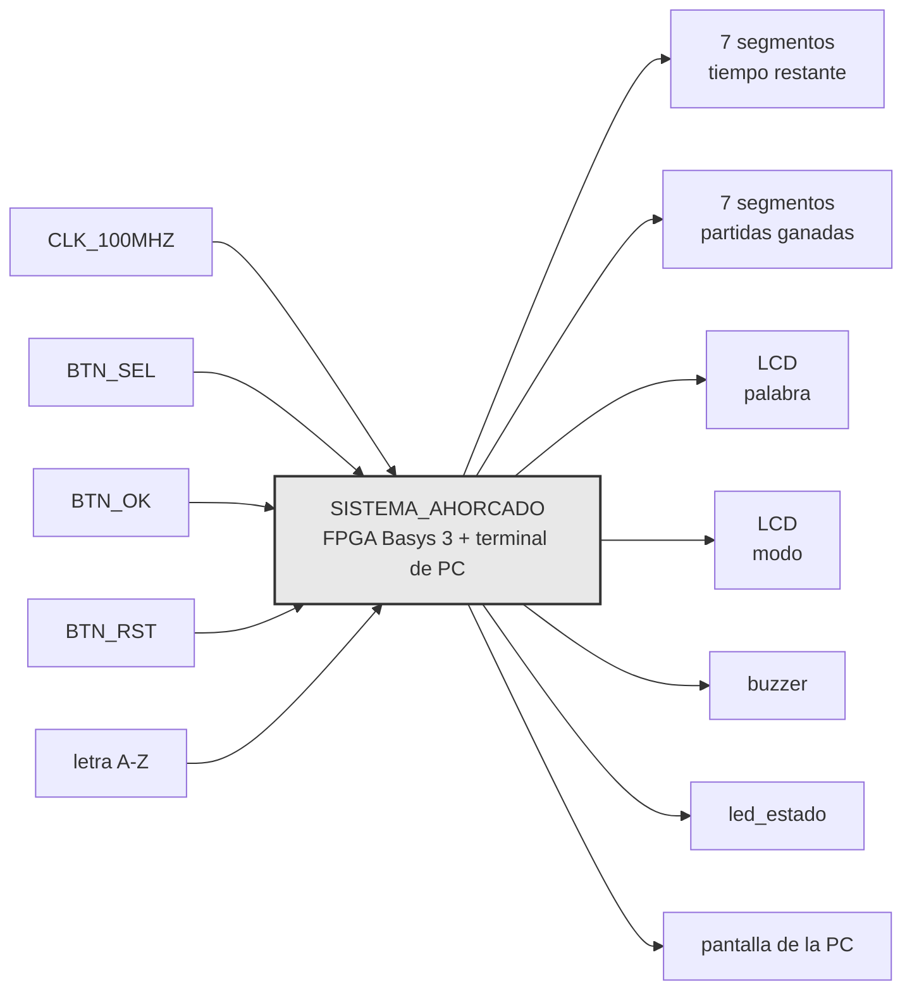
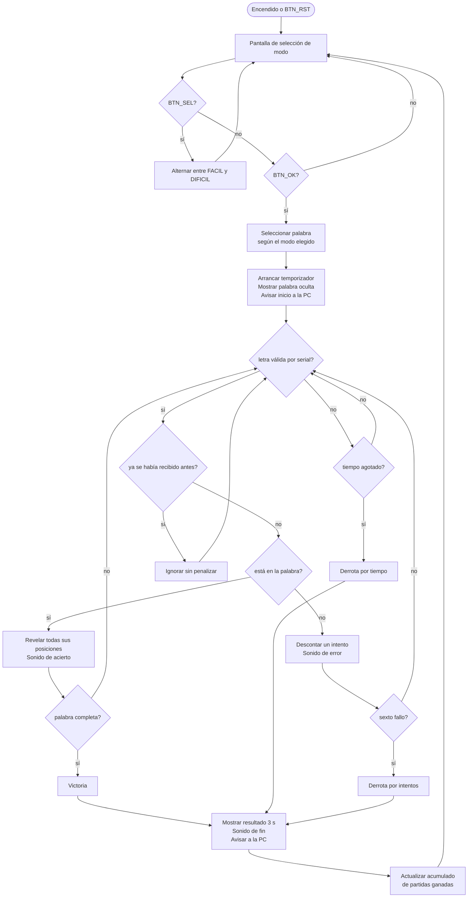

# Nivel 1

## Diagrama de primer nivel

## Objetivo

Toda la inteligencia de la partida vive en la FPGA, la PC es solo terminal. La FPGA escoge la
palabra de forma pseudoaleatoria, valida cada letra contra ella, lleva tiempo e intentos
fallidos, decide el resultado, y refleja ese estado local y remotamente.

## Entradas

- `CLK_100MHZ`, oscilador de la Basys 3. Único reloj de entrada, toda referencia de tiempo del
  sistema se deriva de él.
- `BTN_SEL`, pulsador de la tarjeta. Alterna el modo mostrado en la pantalla de selección entre
  FACIL y DIFICIL.
- `BTN_OK`, pulsador de la tarjeta. Confirma el modo mostrado y arranca la partida.
- `BTN_RST`, pulsador central. Reinicia el sistema completo en cualquier momento, incluido el
  contador de partidas ganadas.
- UNICAMENTE letras A-Z, tecleada en la app de la PC. Viaja por el enlace serial hacia la FPGA.

## Salidas

- Tiempo restante, 2 dígitos de 7 segmentos. Cuenta regresiva en segundos de la partida en
  curso.
- Partidas ganadas, 2 dígitos de 7 segmentos. Acumulado de 00 a 99 desde el último `BTN_RST`.
- Palabra, LCD 16x2 PmodCLP. Patrón con posiciones reveladas y ocultas, más intentos fallidos
  disponibles.
- Modo, LCD 16x2 PmodCLP. Dificultad mostrada en la pantalla de selección.
- Sonido, buzzer piezoeléctrico pasivo. Tono distinto para acierto, error, y fin de partida.
- Estado del sistema, LED de la tarjeta. Distingue selección de modo, partida activa, y
  resultado final.
- Estado de la partida, pantalla de la PC. Patrón de la palabra, longitud, modo, intentos
  restantes, resultado de la última letra, y resultado final.

## Explicación general

El modo se elige desde la tarjeta, no desde la PC, con `BTN_SEL` para recorrer las opciones y
`BTN_OK` para confirmar. Al confirmar, la FPGA selecciona una palabra del banco interno acorde
al modo elegido, arranca la cuenta regresiva, y muestra la palabra oculta en el LCD.

De ahí en adelante cada letra tecleada en la PC llega por el enlace serial y se valida en la
FPGA contra la palabra secreta. Un acierto revela todas las posiciones de esa letra a la vez, un
fallo descuenta un intento, y una letra repetida se ignora sin penalizar ni reiniciar el
temporizador. El LCD y los displays reflejan el mismo estado en la tarjeta, y el buzzer da
realimentación sonora inmediata en cada uno de los tres casos.

La partida termina por palabra completa, sexto fallo, o tiempo agotado, sin distinción de
prioridad entre las dos últimas más allá de cuál ocurra primero en el tiempo. El resultado se
sostiene en el LCD por al menos tres segundos, se actualiza el acumulado de partidas ganadas si
corresponde, y el sistema regresa solo a la pantalla de selección.

El enlace serial es invisible desde afuera del sistema. Es decir, quien juega solo ve que escribe en un
lado y el estado aparece en los dos.

## Diagrama de flujo general de una partida

