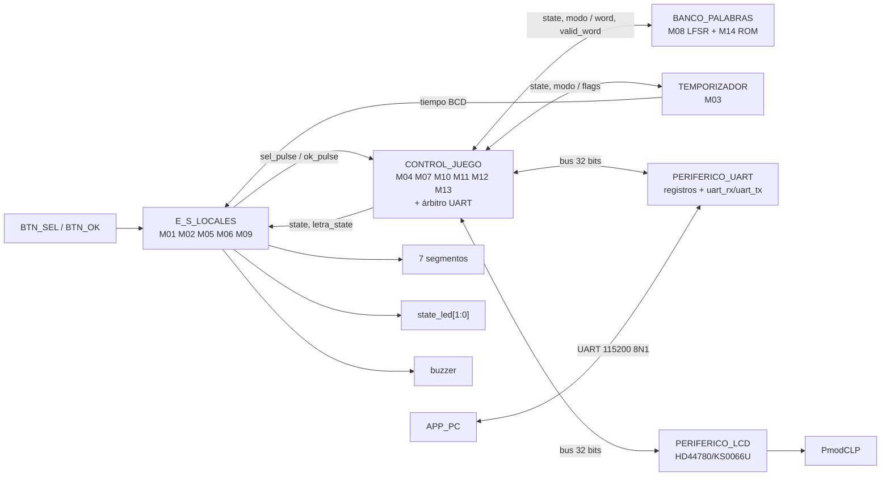

# Nivel 2

## Diagrama de segundo nivel

## CONTROL_JUEGO

Agrupa la lógica que interpreta los eventos de la partida y las transacciones hacia los periféricos.
Incluye la FSM principal, comparación de letras, contador de fallos, manejadores de LCD y UART, y el
árbitro del bus UART.

A diferencia del diseño inicial, **la FSM no genera órdenes puntuales para cada módulo**. Publica
`state` y `modo`; cada bloque reconoce el estado que le interesa.

## BANCO_PALABRAS

Está formado por:

- `banco_palabras.sv`: ROM combinacional de 50 palabras.
- `lfsr.sv`: generador pseudoaleatorio y selector de dirección.

La interfaz interna principal es:

`LFSR.o_bank_addr -> banco_palabras.i_bank_addr -> banco_palabras.o_bank_word -> LFSR.i_bank_word`.

El LFSR entrega finalmente `word[63:0]` y `valid_word`.

## TEMPORIZADOR

`temporizador.sv` recibe `state` y `modo`. Detecta por sí mismo la entrada a `JUEGO`, carga 60 s en
modo fácil o 45 s en modo difícil y produce el tiempo en BCD. También cuenta los tres segundos de
permanencia en los estados de resultado.

## PERIFERICO_UART

Es un periférico de bus de 32 bits con tres direcciones:

- `00`: dato TX.
- `01`: dato RX.
- `10`: control (`send` en bit 0 y `new_rx` en bit 1).

Internamente usa `uart_tx.sv` y `uart_rx.sv` a 115200 baudios.

El receptor y el transmisor de juego son dos maestros lógicos del mismo periférico; por eso
`arbitro_uart.sv` multiplexa sus solicitudes y da prioridad al receptor.

## PERIFERICO_LCD

Recibe comandos por un bus de 32 bits y encapsula la temporización física del HD44780/KS0066U.
`mostrar_lcd.sv` no controla directamente los pines: escribe registros de alto nivel y espera
`busy` / `done`.

## E_S_LOCALES

Agrupa las interfaces físicas que no necesitan el bus de 32 bits:

- M01 Marcador.
- M02 Generador de tono.
- M05 Estado.
- M06 Ganadas.
- M09 Botones y `debounce`.

## APP_PC

La PC envía letras y decodifica mensajes UART. No decide aciertos, fallos, fin de partida ni tiempo;
esas decisiones pertenecen a la FPGA.
