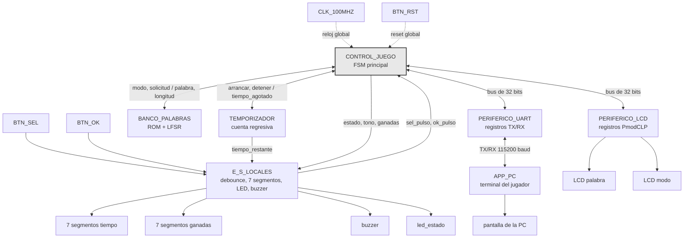

# Nivel 2

## Diagrama de segundo nivel

CLK_100MHZ y BTN_RST en realidad entran a los siete bloques, no solo a CONTROL_JUEGO. Se
dibujan una sola vez para no saturar el diagrama, igual que en nivel 1. BTN_RST no pasa por
CONTROL_JUEGO como pulso decodificado, es un reset físico que llega sincronizado a cada
bloque por igual, por eso reinicia el contador de partidas ganadas junto con todo lo demás.

## CONTROL_JUEGO (FSM principal)

### Objetivo

Coordinar el flujo completo de una partida. Es el único bloque con permiso de escribir en los
periféricos de bus, y el que concentra la lógica de negocio que el enunciado exige mantener
adentro de la FPGA.

### Entradas

- `sel_pulso`, `ok_pulso`, pulsos ya filtrados de rebote desde E_S_LOCALES.
- `palabra_secreta`, `longitud`, desde BANCO_PALABRAS.
- `tiempo_agotado`, bandera desde TEMPORIZADOR.
- `rdata_o` del bus, compartido entre PERIFERICO_LCD y PERIFERICO_UART.

### Salidas

- `modo`, pulso de solicitud hacia BANCO_PALABRAS.
- `arrancar`, `detener`, hacia TEMPORIZADOR.
- Señales de control hacia E_S_LOCALES, estado para el LED, tono a sonar en el buzzer, valor
  del contador de partidas ganadas.
- `write_enable_i`, `addr_i`, `wdata_i` del bus, hacia PERIFERICO_LCD y PERIFERICO_UART.

### Explicación general

Es el bloque que más pesa en la nota y el que más se va a preguntar en la defensa, porque ahí
vive la máquina de estados que atraviesa selección de modo, partida activa, y resultado. Tiene
que arbitrar el mismo bus de 32 bits entre los dos periféricos, decidir cuándo una letra ya se
recibió antes, y descartar cualquier byte que llegue por UART mientras no hay partida activa.
Ese último comportamiento todavía está pendiente de redactar en detalle, pero la decisión de
diseño es que este bloque es el único responsable de tomarla, ningún otro bloque filtra letras
por su cuenta.

## BANCO_PALABRAS (ROM + LFSR)

### Objetivo

Guardar el banco de al menos 50 palabras y entregar una selección pseudoaleatoria acorde al
modo pedido.

### Entradas

- `modo`, FACIL o DIFICIL, desde CONTROL_JUEGO.
- pulso de solicitud, desde CONTROL_JUEGO.

### Salidas

- `palabra_secreta`, los caracteres de la palabra elegida.
- `longitud`, cuántos de esos caracteres son válidos.

### Explicación general

Adentro conviven la ROM con las 50 y tantas palabras y el LFSR que la recorre. Para el modo
difícil conviene una segunda tabla, solo con los índices de las palabras de 6 letras o más, en
vez de filtrar la ROM completa en tiempo de ejecución cada vez que se pide una palabra nueva.
El LFSR corre libre de fondo todo el tiempo y este bloque solo lo muestrea cuando llega el
pulso de solicitud, así la palabra elegida no depende de un seed fijo ni del instante exacto en
que arrancó el sistema.

## TEMPORIZADOR

### Objetivo

Llevar la cuenta regresiva de la partida en curso y avisar cuando se agota el tiempo.

### Entradas

- `arrancar`, `detener`, desde CONTROL_JUEGO, junto con el tiempo inicial según el modo.

### Salidas

- `tiempo_restante`, valor a mostrar, hacia E_S_LOCALES.
- `tiempo_agotado`, bandera, hacia CONTROL_JUEGO.

### Explicación general

Es la única fuente de tiempo real del sistema, ahí vive el prescalador que baja el reloj de
100 MHz hasta segundos. El valor de tiempo restante va directo a E_S_LOCALES sin pasar por
CONTROL_JUEGO, no hay razón para que la FSM principal repita un dato que ya tiene dueño. El
enunciado es explícito en que este valor no se transmite por UART, la PC nunca se entera del
tiempo restante de la partida.
