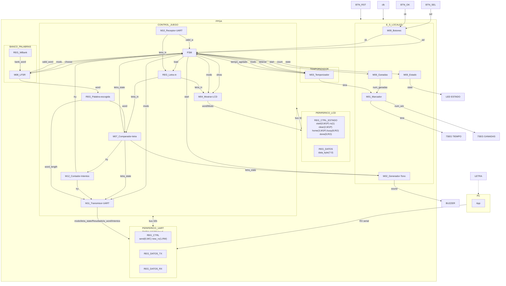
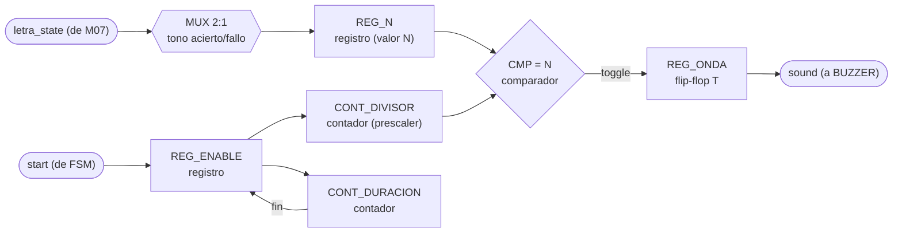
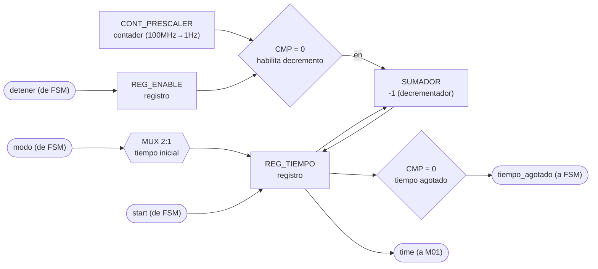
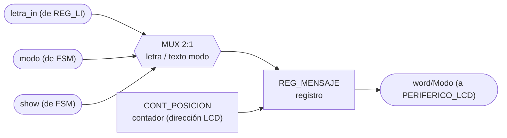
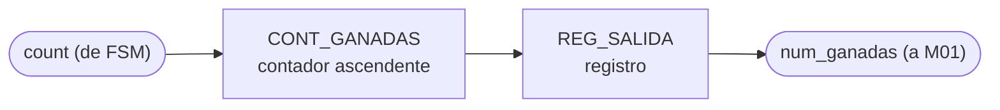
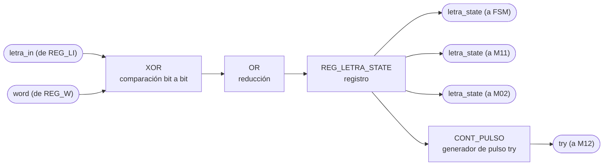
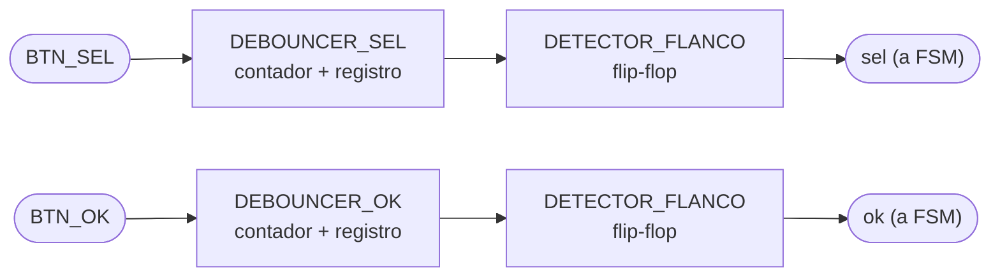
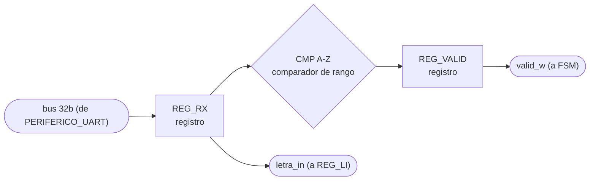
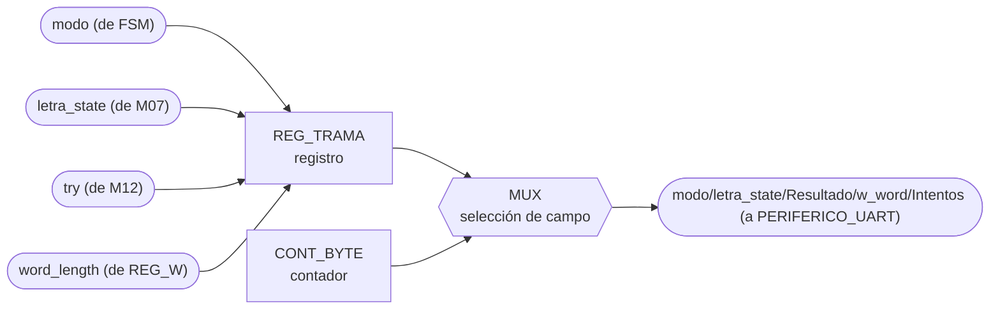
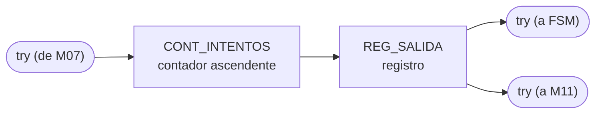

# Nivel 3

En este documento se detallan los diagramas de diseño de tercer nivel. Además, se detallan las entradas y salidas de estos módulos y como se buscan conectar entre ellos.

## Diagrama de tercer nivel

### Leyenda de los diagramas modulares

Para facilitar la creación de los diagramas, utilizando mermaid, utilizaremos la siguiente notación:

- **Óvalo**: puerto externo del módulo (entrada o salida hacia otro módulo/bloque).
- **Rectángulo**: registro o contador.
- **Hexágono**: multiplexor.
- **Rombo**: comparador o lógica de decisión.
- **Rectángulos etiquetados** `XOR`, `OR`, `SUMADOR`, `DECOD_...`: compuertas o bloques combinacionales
  puntuales (comparación bit a bit, decremento, decodificación).

`clk` y `rst` entran a todo registro/contador de cada módulo aunque no se dibujen en cada elemento,
por el mismo criterio usado en los niveles 1 y 2.

## M01: Marcador

### b) Diagrama modular

### c) Objetivo del módulo

Manejar los displays de 7 segmentos del marcador: recibe el tiempo restante desde
M03_Temporizador y el número de partidas ganadas desde M06_Ganadas, y los muestra en 7SEG1 y
7SEG2 respectivamente.

### d) Entradas

- `clk`, `rst`.
- `time`, tiempo restante de la partida, desde M03_Temporizador.
- `num_ganadas`, número de partidas ganadas, desde M06_Ganadas.

### e) Salidas

- `deco_time`, patrón de segmentos/ánodos del display de tiempo, hacia 7SEG1.
- `deco_num_win`, patrón de segmentos/ánodos del display de ganadas, hacia 7SEG2.

## M02: Generador-Tono

### b) Diagrama modular

### c) Objetivo del módulo

Generar el tono del buzzer cuando la FSM lo dispara (`start`), usando `letra_state` de
M07_Comparador-letra para elegir un tono distinto según si la última letra fue acierto o fallo.

### d) Entradas

- `clk`, `rst`.
- `start`, pulso que dispara el tono, desde la FSM.
- `letra_state`, resultado de la última letra evaluada, desde M07_Comparador-letra.

### e) Salidas

- `sound`, onda cuadrada de audio, hacia BUZZER.

## M03: Temporizador

### b) Diagrama modular

### c) Objetivo del módulo

Llevar la cuenta regresiva de tiempo de la partida activa. La FSM la arranca (`start`) y la
puede detener (`detener`); la duración inicial depende del `modo` recibido de la FSM. Entrega el
tiempo restante a M01_Marcador y avisa a la FSM cuando el tiempo se agota (`tiempo_agotado`).

### d) Entradas

- `clk`, `rst`.
- `start`, `detener`, control de arranque/paro de la cuenta, desde la FSM.
- `modo`, fácil o difícil, desde la FSM (define el tiempo inicial a cargar).

### e) Salidas

- `tiempo_agotado`, bandera de fin de tiempo, hacia la FSM.
- `time`, tiempo restante de la partida, hacia M01_Marcador.

## M04: Mostrar-LCD

### b) Diagrama modular

### c) Objetivo del módulo

Controlar lo que se muestra en el LCD: cuando la FSM lo ordena (`show`), compone el mensaje a
partir de la última letra recibida (REG_Letra-in) y del modo actual, y lo envía como
`word/Modo` al periférico LCD.

### d) Entradas

- `clk`, `rst`.
- `show`, pulso de la FSM que ordena refrescar el LCD.
- `modo`, desde la FSM.
- `letra_in`, última letra recibida, desde REG_Letra-in.

### e) Salidas

- `word/Modo`, mensaje compuesto, hacia PERIFERICO_LCD.

## M05: Estado

### b) Diagrama modular

### c) Objetivo del módulo

Reflejar el estado actual de la FSM en el LED de estado, traduciendo la señal `state` que
recibe de la FSM a la salida física que enciende LED_S.

### d) Entradas

- `clk`, `rst`.
- `state`, código de estado actual, desde la FSM.

### e) Salidas

- `state_led`, señal física del LED de estado, hacia LED_S.

## M06: Ganadas

### b) Diagrama modular

### c) Objetivo del módulo

Contar el número de partidas ganadas: incrementa cuando la FSM lo indica (`count`) y entrega el
total acumulado a M01_Marcador para su despliegue.

### d) Entradas

- `clk`, `rst`.
- `count`, pulso de incremento (partida ganada), desde la FSM.

### e) Salidas

- `num_ganadas`, número acumulado de partidas ganadas, hacia M01_Marcador.

## M07: Comparador-letra

### b) Diagrama modular

### c) Objetivo del módulo

Comparar la letra recibida (REG_Letra-in, `letra_in`) contra la palabra secreta
(REG_Palabra-escogida, `word`) para determinar acierto o fallo, informando el resultado
(`letra_state`) a la FSM, a M11_Transmisor-UART y a M02_Generador-Tono, y avisando a
M12_Contador-Intentos (`try`) que se evaluó un intento.

### d) Entradas

- `clk`, `rst`.
- `letra_in`, letra recibida, desde REG_Letra-in.
- `word`, palabra secreta, desde REG_Palabra-escogida.

### e) Salidas

- `letra_state`, resultado de la comparación, hacia la FSM, M11_Transmisor-UART y
  M02_Generador-Tono.
- `try`, pulso de intento evaluado, hacia M12_Contador-Intentos.

## M08: LFSR

### b) Diagrama modular

### c) Objetivo del módulo

Escoger de forma pseudoaleatoria la palabra secreta de la partida usando un LFSR: cuando la FSM
lo pide (`choose`), muestrea el banco de palabras (REG_WBank) según el `modo` recibido
directamente de la FSM, entrega la palabra elegida a REG_Palabra-escogida y confirma su validez
a la FSM (`valid_word`).

### d) Entradas

- `clk`, `rst`.
- `choose`, pulso de solicitud de nueva palabra, desde la FSM.
- `modo`, fácil o difícil, desde la FSM (acota el rango de palabras válidas).
- `bank_word`, palabra leída del banco, desde REG_WBank.

### e) Salidas

- `word`, palabra escogida, hacia REG_Palabra-escogida.
- `valid_word`, bandera de índice/palabra válida, hacia la FSM.

## M09: Botones

### b) Diagrama modular

### c) Objetivo del módulo

Capturar y filtrar (debounce) las pulsaciones físicas de BTN_SEL y BTN_OK, entregando los
pulsos limpios `sel` y `ok` directamente a la FSM.

### d) Entradas

- `clk`, `rst`.
- `BTN_SEL`, señal cruda del botón de selección.
- `BTN_OK`, señal cruda del botón de confirmación.

### e) Salidas

- `sel`, pulso de selección filtrado, hacia la FSM.
- `ok`, pulso de confirmación filtrado, hacia la FSM.

## M10: Receptor-UART

### b) Diagrama modular

### c) Objetivo del módulo

Recibir la letra enviada por la PC a través de UART, cargarla en REG_Letra-in (`letra_in`) y
avisar a la FSM que llegó un dato válido (`valid_w`).

### d) Entradas

- `clk`, `rst`.
- Bus de 32 bits compartido con PERIFERICO_UART (lee `REG_DATOS_RX`).

Nota: el diagrama de tercer nivel no dibuja una flecha individual de entrada hacia M10; el dato
le llega a través del bus de 32 bits que todo CONTROL_JUEGO comparte con PERIFERICO_UART.

### e) Salidas

- `letra_in`, letra recibida, hacia REG_Letra-in.
- `valid_w`, bandera de dato válido recibido, hacia la FSM.

## M11: Transmisor-UART

### b) Diagrama modular

### c) Objetivo del módulo

Ensamblar y transmitir hacia la PC, por UART, la trama de estado del juego: modo, estado de la
última letra, resultado, longitud de la palabra e intentos usados
(`modo/letra_state/Resultado/w_word/Intentos`).

### d) Entradas

- `clk`, `rst`.
- `modo`, desde la FSM.
- `letra_state`, desde M07_Comparador-letra.
- `try`, número de intentos, desde M12_Contador-Intentos.
- `word_length`, longitud de la palabra escogida, desde REG_Palabra-escogida.

### e) Salidas

- `modo/letra_state/Resultado/w_word/Intentos`, trama de estado del juego, hacia
  PERIFERICO_UART.

## M12: Contador-Intentos

### b) Diagrama modular

### c) Objetivo del módulo

Contar los intentos (letras evaluadas) de la partida en curso: se incrementa con cada pulso
`try` de M07_Comparador-letra y reporta el total tanto a la FSM como a M11_Transmisor-UART.

### d) Entradas

- `clk`, `rst`.
- `try`, pulso de intento evaluado, desde M07_Comparador-letra.

### e) Salidas

- `try`, número acumulado de intentos, hacia la FSM y hacia M11_Transmisor-UART.
