# Nivel 3

En este documento se detallan los diagramas de diseño de tercer nivel. Además, se detallan las entradas y salidas de estos módulos y como se buscan conectar entre ellos.

## Diagrama de tercer nivel

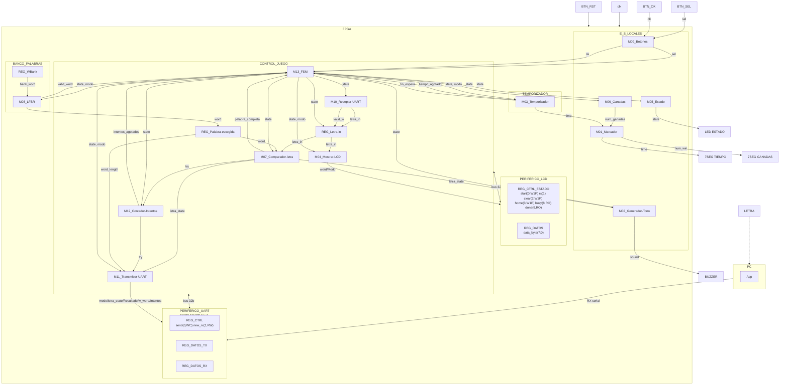

### Leyenda de los diagramas modulares

Para facilitar la creación de los diagramas, utilizando mermaid, utilizaremos la siguiente notación:

- **Óvalo**: puerto externo del módulo (entrada o salida hacia otro módulo/bloque).
- **Rectángulo**: registro o contador.
- **Hexágono**: multiplexor.
- **Rombo**: comparador o lógica de decisión.
- **Rectángulos etiquetados** `XOR`, `OR`, `SUMADOR`, `DECOD_...`: compuertas o bloques combinacionales
  puntuales (comparación bit a bit, decremento, decodificación).

`clk` y `rst` entran a todo registro/contador de cada módulo aunque no se dibujen en cada elemento,
por el mismo criterio usado en los niveles 1 y 2.

## M01: Marcador

### b) Diagrama modular

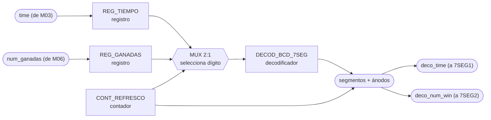

### c) Objetivo del módulo

Manejar los displays de 7 segmentos del marcador: recibe el tiempo restante desde
M03_Temporizador y el número de partidas ganadas desde M06_Ganadas, y los muestra en 7SEG1 y
7SEG2 respectivamente.

### d) Entradas

- `clk`, `rst`.
- `time`, tiempo restante de la partida, desde M03_Temporizador.
- `num_ganadas`, número de partidas ganadas, desde M06_Ganadas.

### e) Salidas

- `deco_time`, patrón de segmentos/ánodos del display de tiempo, hacia 7SEG1.
- `deco_num_win`, patrón de segmentos/ánodos del display de ganadas, hacia 7SEG2.

## M02: Generador-Tono

### b) Diagrama modular

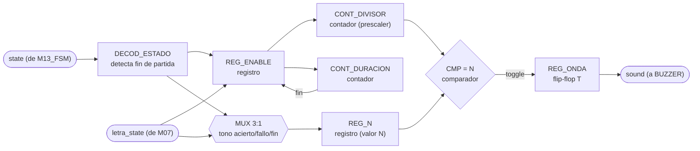

### c) Objetivo del módulo

Generar el tono del buzzer. Se dispara solo, con `letra_state` de M07_Comparador-letra para
distinguir acierto de fallo, y decodificando `state` para el tono de fin de partida cuando el
sistema entra a GANO, PERDIO_INTENTOS o PERDIO_TIEMPO. Son los tres sonidos distintos que pide el
enunciado.

### d) Entradas

- `clk`, `rst`.
- `state`, estado actual, desde M13_FSM, de ahí saca el fin de partida.
- `letra_state`, resultado de la última letra evaluada, desde M07_Comparador-letra.

### e) Salidas

- `sound`, onda cuadrada de audio, hacia BUZZER.

## M03: Temporizador

### b) Diagrama modular

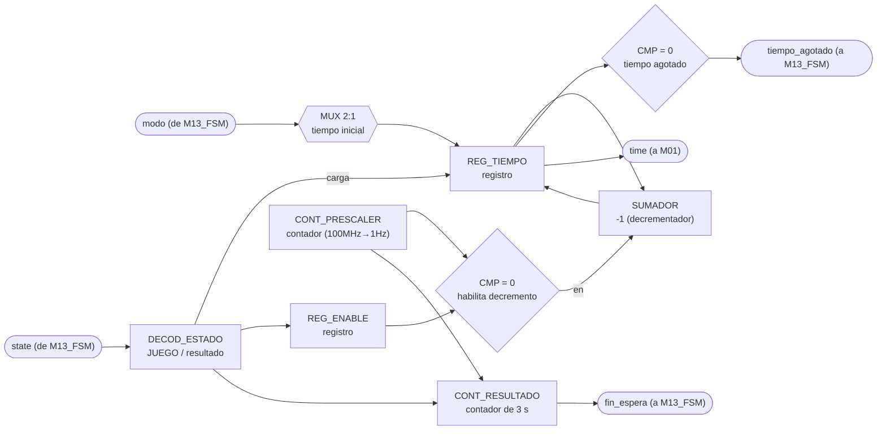

### c) Objetivo del módulo

Llevar la cuenta regresiva de la partida activa. Arranca sola al ver que `state` entró a JUEGO y
se detiene al salir, con la duración inicial que le dice `modo`. Entrega el tiempo restante a
M01_Marcador y avisa a M13_FSM cuando el tiempo se agota (`tiempo_agotado`).

Es además la única fuente de tiempo real del sistema, así que también le toca contar los 3 s
mínimos que el resultado tiene que quedarse en pantalla, y avisar con `fin_espera`. Se hace acá y
no en la FSM para no duplicar un prescalador de 100 MHz a 1 Hz que ya vive en este módulo.

### d) Entradas

- `clk`, `rst`.
- `state`, estado actual, desde M13_FSM, de ahí saca cuándo contar la partida y cuándo los 3 s.
- `modo`, fácil o difícil, desde M13_FSM, define el tiempo inicial a cargar.

### e) Salidas

- `tiempo_agotado`, bandera de fin de tiempo de partida, hacia M13_FSM.
- `fin_espera`, bandera de 3 s cumplidos mostrando resultado, hacia M13_FSM.
- `time`, tiempo restante de la partida, hacia M01_Marcador.

## M04: Mostrar-LCD

### b) Diagrama modular

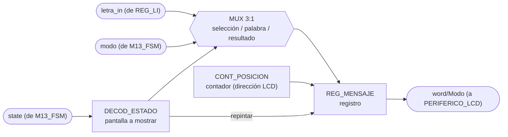

### c) Objetivo del módulo

Controlar lo que se muestra en el LCD. Decodifica `state` para saber cuál de las tres pantallas
toca, selección de modo, palabra en juego, o resultado final, compone el mensaje con la última
letra recibida (REG_Letra-in) y el modo actual, y lo manda como `word/Modo` al periférico LCD.

Repinta la pantalla del estado que ve, no una pantalla por cada transición, así que si un estado
corto pasa antes de que el LCD alcance a refrescar no queda un mensaje a medias, simplemente
pinta el que sigue.

### d) Entradas

- `clk`, `rst`.
- `state`, estado actual, desde M13_FSM, decide cuál pantalla se pinta.
- `modo`, desde M13_FSM.
- `letra_in`, última letra recibida, desde REG_Letra-in.

### e) Salidas

- `word/Modo`, mensaje compuesto, hacia PERIFERICO_LCD.

## M05: Estado

### b) Diagrama modular

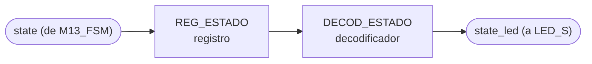

### c) Objetivo del módulo

Reflejar el estado actual del sistema en el LED de estado, traduciendo la señal `state` que
recibe de M13_FSM a la salida física que enciende LED_S. Distingue selección de modo, partida
activa y resultado final, que es lo que pide el enunciado.

### d) Entradas

- `clk`, `rst`.
- `state`, código de estado actual, desde M13_FSM.

### e) Salidas

- `state_led`, señal física del LED de estado, hacia LED_S.

## M06: Ganadas

### b) Diagrama modular

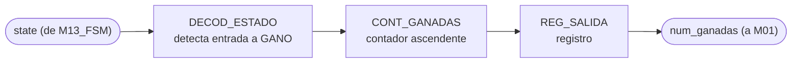

### c) Objetivo del módulo

Contar el número de partidas ganadas. Incrementa por su cuenta al detectar que `state` entró a
GANO y entrega el total acumulado a M01_Marcador para su despliegue. `rst` lo devuelve a cero,
que es lo que hace que BTN_RST reinicie el marcador acumulado como pide el enunciado.

### d) Entradas

- `clk`, `rst`.
- `state`, estado actual, desde M13_FSM, incrementa al entrar a GANO.

### e) Salidas

- `num_ganadas`, número acumulado de partidas ganadas, hacia M01_Marcador.

## M07: Comparador-letra

### b) Diagrama modular

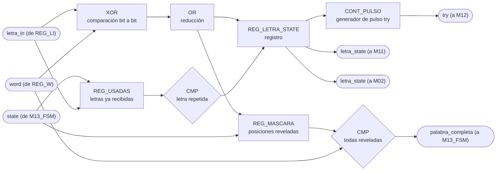

### c) Objetivo del módulo

Comparar la letra recibida (REG_Letra-in, `letra_in`) contra la palabra secreta
(REG_Palabra-escogida, `word`) para determinar acierto, fallo o letra repetida, informando el
resultado (`letra_state`) a M11_Transmisor-UART y a M02_Generador-Tono, y avisando a
M12_Contador-Intentos (`try`) que se evaluó un intento que sí cuenta.

Guarda además la máscara de posiciones ya reveladas y el registro de letras ya recibidas. La
máscara es la que permite avisarle a M13_FSM que la palabra quedó completa, y el registro de
usadas es el que hace que una letra repetida no gaste intento ni vuelva a sonar como fallo.
Ambos se limpian al ver que `state` entró a CARGA, o sea al empezar cada partida nueva.

### d) Entradas

- `clk`, `rst`.
- `letra_in`, letra recibida, desde REG_Letra-in.
- `word`, palabra secreta, desde REG_Palabra-escogida.
- `state`, estado actual, desde M13_FSM, limpia máscara y letras usadas al entrar a CARGA.

### e) Salidas

- `letra_state`, resultado de la comparación (acierto, fallo o repetida), hacia
  M11_Transmisor-UART y M02_Generador-Tono.
- `palabra_completa`, todas las posiciones reveladas, hacia M13_FSM.
- `try`, pulso de intento evaluado, hacia M12_Contador-Intentos.

## M08: LFSR

### b) Diagrama modular

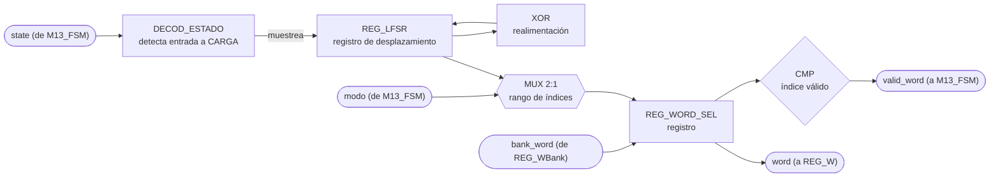

### c) Objetivo del módulo

Escoger de forma pseudoaleatoria la palabra secreta de la partida usando un LFSR. El LFSR corre
libre todo el tiempo y este módulo lo muestrea al ver que `state` entró a CARGA, saca del banco
(REG_WBank) una palabra acorde al `modo`, la entrega a REG_Palabra-escogida y confirma con
`valid_word` que ya está lista, que es justo lo que M13_FSM está esperando para pasar a JUEGO.

### d) Entradas

- `clk`, `rst`.
- `state`, estado actual, desde M13_FSM, muestrea el LFSR al entrar a CARGA.
- `modo`, fácil o difícil, desde M13_FSM, acota el rango de palabras válidas.
- `bank_word`, palabra leída del banco, desde REG_WBank.

### e) Salidas

- `word`, palabra escogida, hacia REG_Palabra-escogida.
- `valid_word`, bandera de índice/palabra válida, hacia M13_FSM.

## M09: Botones

### b) Diagrama modular

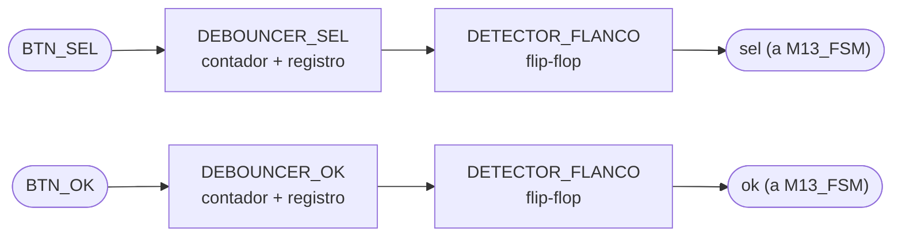

### c) Objetivo del módulo

Capturar y filtrar (debounce) las pulsaciones físicas de BTN_SEL y BTN_OK, entregando los
pulsos limpios `sel` y `ok` directamente a M13_FSM.

### d) Entradas

- `clk`, `rst`.
- `BTN_SEL`, señal cruda del botón de selección.
- `BTN_OK`, señal cruda del botón de confirmación.

### e) Salidas

- `sel`, pulso de selección filtrado, hacia M13_FSM.
- `ok`, pulso de confirmación filtrado, hacia M13_FSM.

## M10: Receptor-UART

### b) Diagrama modular

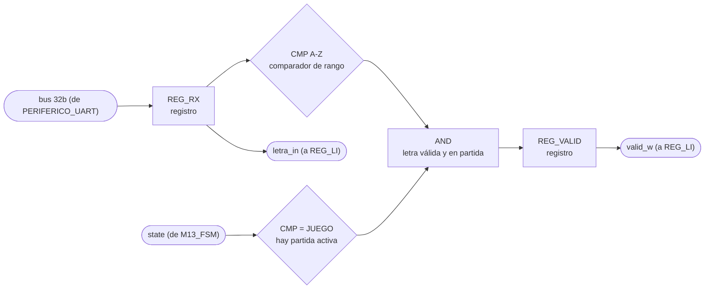

### c) Objetivo del módulo

Recibir la letra enviada por la PC a través de UART, cargarla en REG_Letra-in (`letra_in`) y
habilitar esa carga con `valid_w` solo si el byte es A-Z y además hay partida activa.

Acá es donde se resuelve lo que el enunciado exige documentar, la letra que llega mientras el
sistema está en selección de modo o mostrando resultado se descarta en este punto, no llega a
REG_Letra-in ni a M07_Comparador-letra, así que no gasta intento ni toca el temporizador. Se
filtra por `state` en vez de preguntarle a M13_FSM, que es lo mismo que hacen los demás módulos.

### d) Entradas

- `clk`, `rst`.
- Bus de 32 bits compartido con PERIFERICO_UART (lee `REG_DATOS_RX`).
- `state`, estado actual, desde M13_FSM, solo deja pasar letras durante JUEGO.

Nota: el diagrama de tercer nivel no dibuja una flecha individual de entrada hacia M10; el dato
le llega a través del bus de 32 bits que todo CONTROL_JUEGO comparte con PERIFERICO_UART.

### e) Salidas

- `letra_in`, letra recibida, hacia REG_Letra-in.
- `valid_w`, habilitación de carga de la letra, hacia REG_Letra-in.

## M11: Transmisor-UART

### b) Diagrama modular

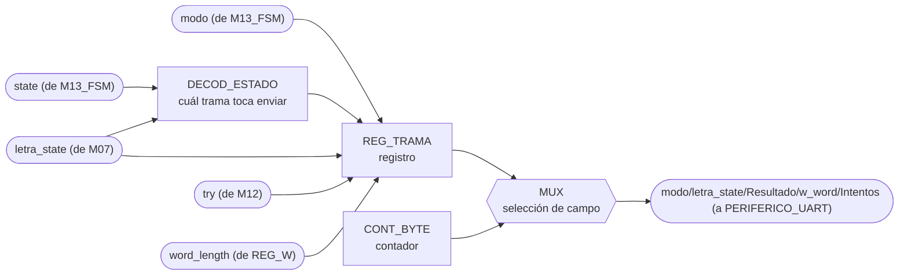

### c) Objetivo del módulo

Ensamblar y transmitir hacia la PC, por UART, la trama de estado del juego, con modo, estado de
la última letra, resultado, longitud de la palabra e intentos usados
(`modo/letra_state/Resultado/w_word/Intentos`).

Decide solo cuándo transmitir. Al ver que `state` entró a JUEGO manda la trama de inicio de
partida con longitud y modo, con cada `letra_state` nuevo manda el resultado de la letra y los
intentos restantes, y al entrar a GANO, PERDIO_INTENTOS o PERDIO_TIEMPO manda el resultado final.
Como los tres estados de fin son distintos, la causa de la derrota sale directo del `state`, sin
necesidad de una señal aparte.

### d) Entradas

- `clk`, `rst`.
- `state`, estado actual, desde M13_FSM, decide cuál trama toca enviar.
- `modo`, desde M13_FSM.
- `letra_state`, desde M07_Comparador-letra.
- `try`, número de intentos, desde M12_Contador-Intentos.
- `word_length`, longitud de la palabra escogida, desde REG_Palabra-escogida.

### e) Salidas

- `modo/letra_state/Resultado/w_word/Intentos`, trama de estado del juego, hacia
  PERIFERICO_UART.

## M12: Contador-Intentos

### b) Diagrama modular

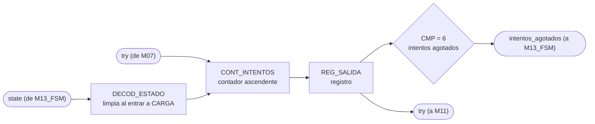

### c) Objetivo del módulo

Contar los intentos fallidos de la partida en curso. Se incrementa con cada pulso `try` de
M07_Comparador-letra, reporta el total a M11_Transmisor-UART y le avisa a M13_FSM con
`intentos_agotados` cuando llega a seis, que es la condición de derrota por intentos. Se limpia
solo al ver que `state` entró a CARGA.

### d) Entradas

- `clk`, `rst`.
- `try`, pulso de intento evaluado, desde M07_Comparador-letra.
- `state`, estado actual, desde M13_FSM, limpia la cuenta al entrar a CARGA.

### e) Salidas

- `intentos_agotados`, bandera de seis letras incorrectas alcanzadas, hacia M13_FSM.
- `try`, número acumulado de intentos, hacia M11_Transmisor-UART.

## M13: FSM

### b) Diagrama de estados

Para este módulo el diagrama de estados ocupa el lugar del diagrama modular de los demás. Una FSM
se escribe directamente desde su diagrama de estados, no desde un arreglo de registros y
compuertas, así que ese es el diagrama que de verdad sirve para implementarla.

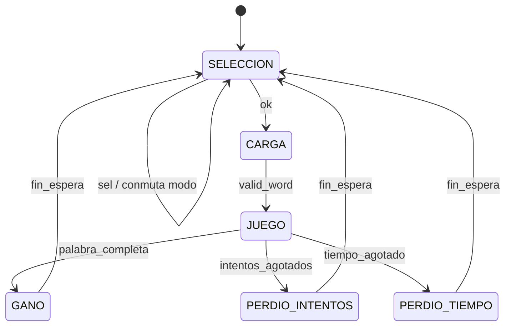

Codificación de `state`, tres bits. Es el contrato que decodifican los demás módulos, así que el
valor de cada estado queda fijo:

- `000` SELECCION, pantalla de selección de modo.
- `001` CARGA, se le pide palabra al banco y se espera `valid_word`.
- `010` JUEGO, partida activa.
- `011` GANO, la palabra quedó completa.
- `100` PERDIO_INTENTOS, se alcanzaron las seis letras incorrectas.
- `101` PERDIO_TIEMPO, la cuenta regresiva llegó a cero.

`BTN_RST` devuelve la FSM a SELECCION desde cualquier estado, igual que reinicia al resto de los
módulos, por eso no se dibuja como una transición más del diagrama.

### c) Objetivo del módulo

Llevar el estado global de la partida y publicarlo para que cada módulo decida por su cuenta qué
le toca hacer. La FSM no le da órdenes puntuales a nadie, no manda pulsos de `start`, `show`,
`choose` ni `count`. Solo dice en cuál de los seis estados está el sistema y cuál modo está
seleccionado.

Esa es la decisión de diseño central del módulo. Con la FSM mandando, cada módulo nuevo obligaba a
agregarle una salida y a meterle mano a su lógica interna. Con los módulos decodificando `state`
la FSM queda fija, y un módulo nuevo solo se cuelga del estado que ya se difunde. Se nota en el
diagrama de tercer nivel, todas las flechas que salen de la FSM llevan lo mismo, `state` y en
algunos casos `modo`, en vez de once señales de control distintas.

El otro efecto es que la FSM nunca se queda esperando a nadie. No sondea el `busy` del LCD ni
espera confirmación de M11 para cambiar de estado, porque no les está ordenando nada. M04 repinta
el estado que ve en el momento en que puede, y si CARGA pasa demasiado rápido para el LCD,
simplemente pinta el siguiente estado sin que quede nada a medias.

De aquí sale también la respuesta a lo que el enunciado exige documentar, qué pasa con una letra
que llega por UART fuera de partida. REG_Letra-in solo carga cuando `state` es JUEGO, así que la
letra se descarta ahí mismo, sin llegar a M07 ni gastar intento. La FSM ni se entera.

### d) Entradas

- `clk`, `rst`.
- `sel`, pulso de cambio de modo, desde M09_Botones.
- `ok`, pulso de confirmación, desde M09_Botones.
- `valid_word`, palabra lista en REG_Palabra-escogida, desde M08_LFSR.
- `palabra_completa`, todas las posiciones de la palabra reveladas, desde M07_Comparador-letra.
- `intentos_agotados`, seis letras incorrectas alcanzadas, desde M12_Contador-Intentos.
- `tiempo_agotado`, cuenta regresiva en cero, desde M03_Temporizador.
- `fin_espera`, se cumplieron los 3 s de resultado en pantalla, desde M03_Temporizador.

### e) Salidas

- `state`, estado actual en tres bits, hacia M02_Generador-Tono, M03_Temporizador,
  M04_Mostrar-LCD, M05_Estado, M06_Ganadas, M07_Comparador-letra, M08_LFSR, M10_Receptor-UART,
  M11_Transmisor-UART, M12_Contador-Intentos y REG_Letra-in.
- `modo`, FACIL o DIFICIL, hacia M03_Temporizador, M04_Mostrar-LCD, M08_LFSR y
  M11_Transmisor-UART.
