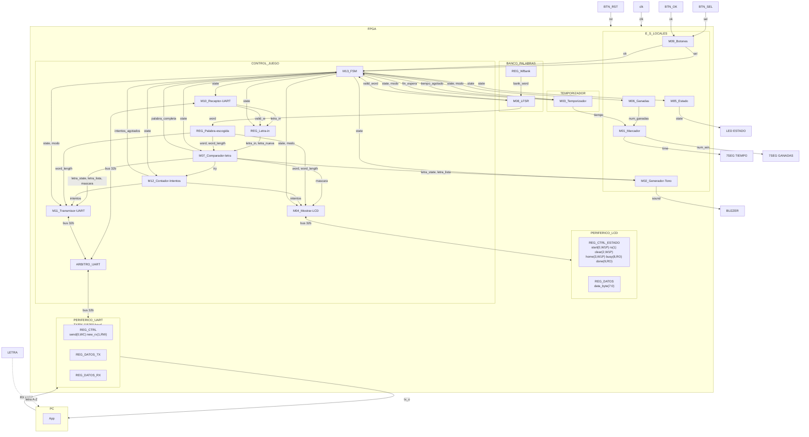
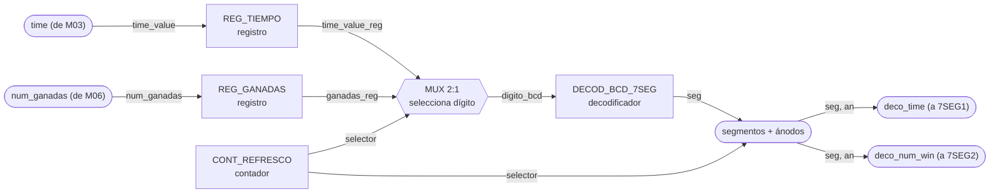
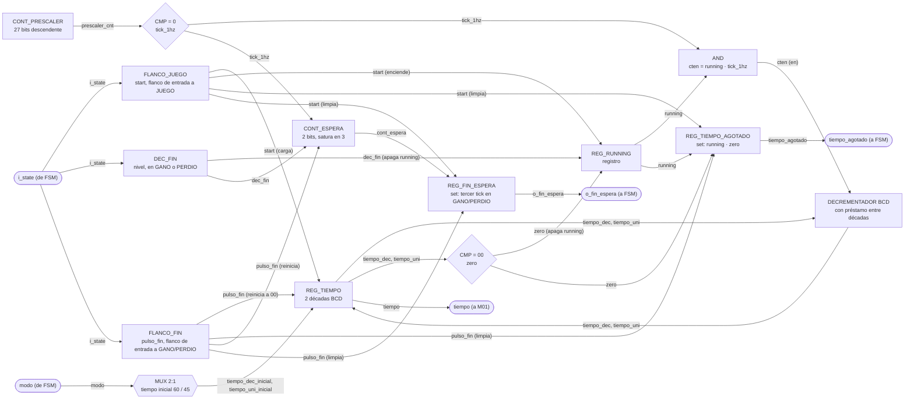
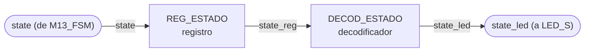

# Nivel 3

Este nivel refleja las conexiones **presentes en `src/design/top.sv` de la rama `develop`**.

## Diagrama de tercer nivel

### Leyenda de los diagramas modulares

Para facilitar la creación de los diagramas, utilizando mermaid, utilizaremos la siguiente notación:

- **Óvalo**: puerto externo del módulo (entrada o salida hacia otro módulo/bloque).
- **Rectángulo**: registro o contador.
- **Hexágono**: multiplexor.
- **Rombo**: comparador o lógica de decisión.
- **Rectángulos etiquetados** `XOR`, `OR`, `SUMADOR`, `DECOD_...`: compuertas o bloques combinacionales
  puntuales (comparación bit a bit, decremento, decodificación).

`clk` y `rst` entran a todo registro/contador de cada módulo aunque no se dibujen en cada elemento,
por el mismo criterio usado en los niveles 1 y 2.

## M01: Marcador

### b) Diagrama modular

### c) Objetivo del módulo

Manejar los displays de 7 segmentos del marcador: recibe el tiempo restante desde
M03_Temporizador y el número de partidas ganadas desde M06_Ganadas, y los muestra en 7SEG1 y
7SEG2 respectivamente.

### d) Entradas

- `clk`, `rst`.
- `time`, tiempo restante de la partida, desde M03_Temporizador.
- `num_ganadas`, número de partidas ganadas, desde M06_Ganadas.

### e) Salidas

- `deco_time`, patrón de segmentos/ánodos del display de tiempo, hacia 7SEG1.
- `deco_num_win`, patrón de segmentos/ánodos del display de ganadas, hacia 7SEG2.

## M02: Generador-Tono

### b) Diagrama modular

### c) Objetivo del módulo

Generar el tono del buzzer. Se dispara solo, con `letra_state` de M07_Comparador-letra para
distinguir acierto de fallo, y decodificando `state` para el tono de fin de partida cuando el
sistema entra a GANO, PERDIO_INTENTOS o PERDIO_TIEMPO. Son los tres sonidos distintos que pide el
enunciado.

### d) Entradas

- `clk`, `rst`.
- `state`, estado actual, desde M13_FSM, de ahí saca el fin de partida.
- `letra_state`, resultado de la última letra evaluada, desde M07_Comparador-letra.
- `letra_lista`, estrobo que marca cuándo `letra_state` es nuevo, desde M07_Comparador-letra.

### e) Salidas

- `sound`, onda cuadrada de audio, hacia BUZZER.

## M03: Temporizador

### b) Diagrama modular

### c) Objetivo del módulo

Llevar la cuenta regresiva de la partida activa. Arranca sola al ver que `state` entró a JUEGO,
con la duración inicial que le dice `modo`, y se detiene al llegar a cero o al entrar a GANO o
PERDIO. Entrega el tiempo restante en BCD a M01_Marcador y avisa a M13_FSM cuando el tiempo se
agota (`tiempo_agotado`).

Es además la única fuente de tiempo real del sistema, así que también le toca contar la espera
del resultado en pantalla, tres pulsos de su `tick_1hz` en GANO o PERDIO, y avisar con
`o_fin_espera`. Se hace acá y no en la FSM para no duplicar un prescalador de 100 MHz a 1 Hz que
ya vive en este módulo.

### d) Entradas

- `clk`, `rst`.
- `i_state`, estado actual, desde M13_FSM, de ahí saca cuándo contar la partida y cuándo la
  espera del resultado.
- `modo`, fácil o difícil, desde M13_FSM, define el tiempo inicial a cargar (60 s o 45 s).

### e) Salidas

- `tiempo_agotado`, bandera de fin de tiempo de partida, hacia M13_FSM.
- `o_fin_espera`, bandera de espera de resultado cumplida, hacia M13_FSM.
- `tiempo[7:0]`, tiempo restante de la partida en BCD, hacia M01_Marcador.

## M04: Mostrar-LCD

### b) Diagrama modular

### c) Objetivo del módulo

Controlar lo que se muestra en el LCD. Decodifica `state` para saber cuál pantalla toca,
selección de modo, palabra en juego, ganó o perdió. Compone el mensaje con `modo`, la palabra
escogida, `mascara` e `intentos`, y lo escribe carácter por carácter en PERIFERICO_LCD por el bus.

Repinta la pantalla del estado que ve, no una pantalla por cada transición, así que si un estado
corto pasa antes de que el LCD alcance a refrescar no queda un mensaje a medias, simplemente
pinta el que sigue.

### d) Entradas

- `clk`, `rst`.
- `i_state`, estado actual, desde M13_FSM, decide cuál pantalla se pinta.
- `i_modo`, desde M13_FSM.
- `i_word`, `i_word_length`, palabra escogida y su longitud, desde REG_Palabra-escogida. La
  palabra llega convertida a ASCII por un adaptador en `top.sv`.
- `i_mascara`, posiciones ya reveladas de la palabra, desde M07_Comparador-letra. Es lo que decide
  cuáles letras se pintan y cuáles quedan como guion bajo.
- `i_intentos`, fallos acumulados de la partida, desde M12_Contador-Intentos. Se muestran como
  intentos restantes al final de la pantalla de juego.
- `i_rdata`, lectura del bus de PERIFERICO_LCD, de donde saca `busy` y `done`.

### e) Salidas

- `o_addr`, `o_write_enable`, `o_wdata`, escrituras de bus hacia PERIFERICO_LCD.

## M05: Estado

### b) Diagrama modular

### c) Objetivo del módulo

Reflejar el estado actual del sistema en el LED de estado, traduciendo la señal `state` que
recibe de M13_FSM a la salida física que enciende LED_S. Distingue selección de modo, partida
activa y resultado final, que es lo que pide el enunciado.

### d) Entradas

- `clk`, `rst`.
- `state`, código de estado actual, desde M13_FSM.

### e) Salidas

- `state_led`, señal física del LED de estado, hacia LED_S.

## M06: Ganadas

### b) Diagrama modular

## Observaciones de integración

- La FSM tiene cinco estados útiles y no envía `start`, `show`, `choose`, `count`, `load` ni
  `detener`.
- `banco_palabras` es un módulo separado del LFSR.
- No existe un registro `REG_Palabra-escogida` instanciado en el `top` actual. `word[63:0]` sale
  directamente de `lfsr.sv`.
- `palabra_escogida.sv` existe en el repositorio, pero **no está instanciado**. El `top` hace
  directamente el slicing de la palabra y la conversión de los códigos de 5 bits a ASCII.
- El receptor y transmisor UART no se conectan directamente al periférico: pasan por
  `arbitro_uart.sv`.
- `mostrar_lcd.sv` escribe al periférico LCD por bus; no genera directamente `RS`, `RW`, `E` ni
  `lcd_data`.
- El display de 7 segmentos es uno de cuatro dígitos: AN0/AN1 muestran ganadas y AN2/AN3 tiempo.

## Codificación de estado compartida

| Código | Estado |
|---|---|
| `000` | SELECCION |
| `001` | CARGA |
| `010` | JUEGO |
| `011` | GANO |
| `100` | PERDIO |
| `101` | no usado |
| `110` | no usado |
| `111` | no usado |

La codificación es un contrato entre la FSM y los módulos que decodifican `state`.
