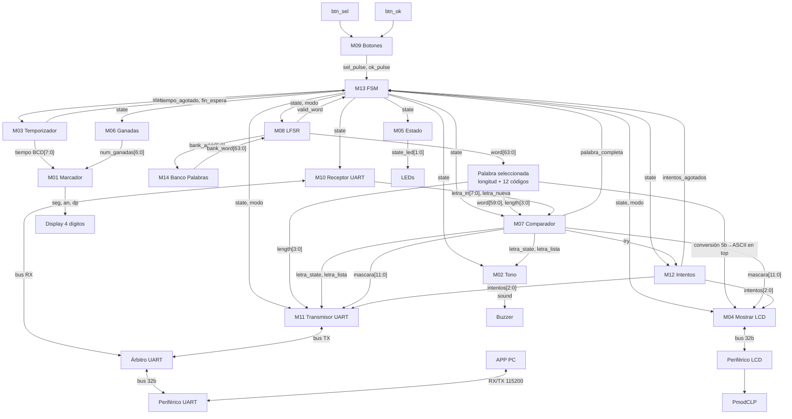

# Nivel 3

Este nivel refleja las conexiones **presentes en `src/design/top.sv` de la rama `develop`**.

## Diagrama de tercer nivel

## Observaciones de integración

- La FSM tiene cinco estados útiles y no envía `start`, `show`, `choose`, `count`, `load` ni
  `detener`.
- `banco_palabras` es un módulo separado del LFSR.
- No existe un registro `REG_Palabra-escogida` instanciado en el `top` actual. `word[63:0]` sale
  directamente de `lfsr.sv`.
- `palabra_escogida.sv` existe en el repositorio, pero **no está instanciado**. El `top` hace
  directamente el slicing de la palabra y la conversión de los códigos de 5 bits a ASCII.
- El receptor y transmisor UART no se conectan directamente al periférico: pasan por
  `arbitro_uart.sv`.
- `mostrar_lcd.sv` escribe al periférico LCD por bus; no genera directamente `RS`, `RW`, `E` ni
  `lcd_data`.
- El display de 7 segmentos es uno de cuatro dígitos: AN0/AN1 muestran ganadas y AN2/AN3 tiempo.

## Codificación de estado compartida

| Código | Estado |
|---|---|
| `000` | SELECCION |
| `001` | CARGA |
| `010` | JUEGO |
| `011` | GANO |
| `100` | PERDIO |
| `101` | no usado |
| `110` | no usado |
| `111` | no usado |

La codificación es un contrato entre la FSM y los módulos que decodifican `state`.
