# Nivel 3

En este documento se detallan los diagramas de diseño de tercer nivel. Además, se detallan las entradas y salidas de estos módulos y como se buscan conectar entre ellos.

## Diagrama de tercer nivel

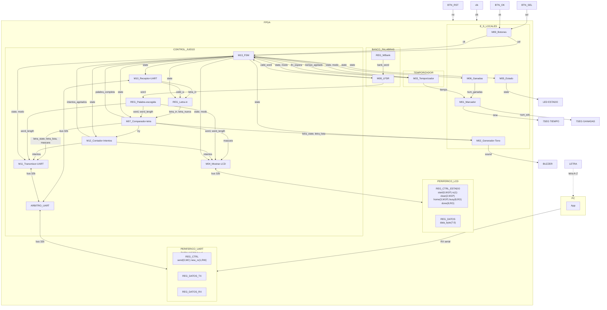

### Leyenda de los diagramas modulares

Para facilitar la creación de los diagramas, utilizando mermaid, utilizaremos la siguiente notación:

- **Óvalo**: puerto externo del módulo (entrada o salida hacia otro módulo/bloque).
- **Rectángulo**: registro o contador.
- **Hexágono**: multiplexor.
- **Rombo**: comparador o lógica de decisión.
- **Rectángulos etiquetados** `XOR`, `OR`, `SUMADOR`, `DECOD_...`: compuertas o bloques combinacionales
  puntuales (comparación bit a bit, decremento, decodificación).

`clk` y `rst` entran a todo registro/contador de cada módulo aunque no se dibujen en cada elemento,
por el mismo criterio usado en los niveles 1 y 2.

## M01: Marcador

### b) Diagrama modular

### c) Objetivo del módulo

Manejar los displays de 7 segmentos del marcador: recibe el tiempo restante desde
M03_Temporizador y el número de partidas ganadas desde M06_Ganadas, y los muestra en 7SEG1 y
7SEG2 respectivamente.

### d) Entradas

- `clk`, `rst`.
- `time`, tiempo restante de la partida, desde M03_Temporizador.
- `num_ganadas`, número de partidas ganadas, desde M06_Ganadas.

### e) Salidas

- `deco_time`, patrón de segmentos/ánodos del display de tiempo, hacia 7SEG1.
- `deco_num_win`, patrón de segmentos/ánodos del display de ganadas, hacia 7SEG2.

## M02: Generador-Tono

### b) Diagrama modular

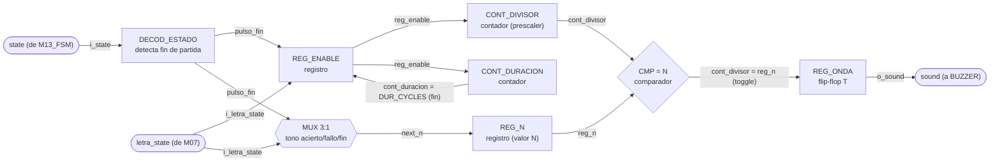

### c) Objetivo del módulo

Generar el tono del buzzer. Se dispara solo, con `letra_state` de M07_Comparador-letra para
distinguir acierto de fallo, y decodificando `state` para el tono de fin de partida cuando el
sistema entra a GANO, PERDIO_INTENTOS o PERDIO_TIEMPO. Son los tres sonidos distintos que pide el
enunciado.

### d) Entradas

- `clk`, `rst`.
- `state`, estado actual, desde M13_FSM, de ahí saca el fin de partida.
- `letra_state`, resultado de la última letra evaluada, desde M07_Comparador-letra.
- `letra_lista`, estrobo que marca cuándo `letra_state` es nuevo, desde M07_Comparador-letra.

### e) Salidas

- `sound`, onda cuadrada de audio, hacia BUZZER.

## M03: Temporizador

### b) Diagrama modular

### c) Objetivo del módulo

Llevar la cuenta regresiva de la partida activa. Arranca sola al ver que `state` entró a JUEGO,
con la duración inicial que le dice `modo`, y se detiene al llegar a cero o al entrar a GANO o
PERDIO. Entrega el tiempo restante en BCD a M01_Marcador y avisa a M13_FSM cuando el tiempo se
agota (`tiempo_agotado`).

Es además la única fuente de tiempo real del sistema, así que también le toca contar la espera
del resultado en pantalla, tres pulsos de su `tick_1hz` en GANO o PERDIO, y avisar con
`o_fin_espera`. Se hace acá y no en la FSM para no duplicar un prescalador de 100 MHz a 1 Hz que
ya vive en este módulo.

### d) Entradas

- `clk`, `rst`.
- `i_state`, estado actual, desde M13_FSM, de ahí saca cuándo contar la partida y cuándo la
  espera del resultado.
- `modo`, fácil o difícil, desde M13_FSM, define el tiempo inicial a cargar (60 s o 45 s).

### e) Salidas

- `tiempo_agotado`, bandera de fin de tiempo de partida, hacia M13_FSM.
- `o_fin_espera`, bandera de espera de resultado cumplida, hacia M13_FSM.
- `tiempo[7:0]`, tiempo restante de la partida en BCD, hacia M01_Marcador.

## M04: Mostrar-LCD

### b) Diagrama modular

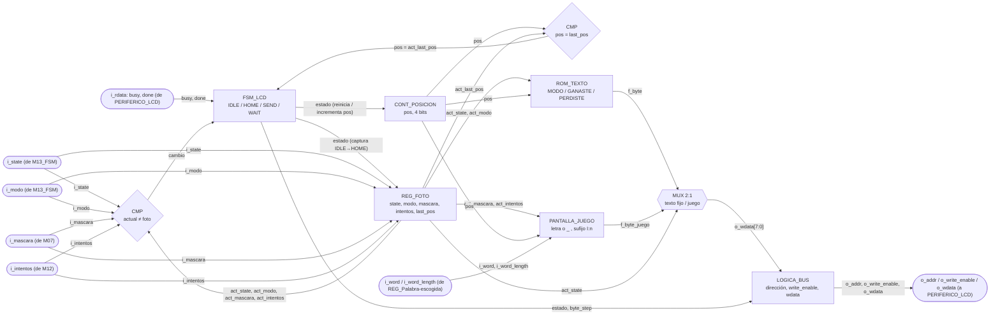

### c) Objetivo del módulo

Controlar lo que se muestra en el LCD. Decodifica `state` para saber cuál pantalla toca,
selección de modo, palabra en juego, ganó o perdió. Compone el mensaje con `modo`, la palabra
escogida, `mascara` e `intentos`, y lo escribe carácter por carácter en PERIFERICO_LCD por el bus.

Repinta la pantalla del estado que ve, no una pantalla por cada transición, así que si un estado
corto pasa antes de que el LCD alcance a refrescar no queda un mensaje a medias, simplemente
pinta el que sigue.

### d) Entradas

- `clk`, `rst`.
- `i_state`, estado actual, desde M13_FSM, decide cuál pantalla se pinta.
- `i_modo`, desde M13_FSM.
- `i_word`, `i_word_length`, palabra escogida y su longitud, desde REG_Palabra-escogida. La
  palabra llega convertida a ASCII por un adaptador en `top.sv`.
- `i_mascara`, posiciones ya reveladas de la palabra, desde M07_Comparador-letra. Es lo que decide
  cuáles letras se pintan y cuáles quedan como guion bajo.
- `i_intentos`, fallos acumulados de la partida, desde M12_Contador-Intentos. Se muestran como
  intentos restantes al final de la pantalla de juego.
- `i_rdata`, lectura del bus de PERIFERICO_LCD, de donde saca `busy` y `done`.

### e) Salidas

- `o_addr`, `o_write_enable`, `o_wdata`, escrituras de bus hacia PERIFERICO_LCD.

## M05: Estado

### b) Diagrama modular

### c) Objetivo del módulo

Reflejar el estado actual del sistema en el LED de estado, traduciendo la señal `state` que
recibe de M13_FSM a la salida física que enciende LED_S. Distingue selección de modo, partida
activa y resultado final, que es lo que pide el enunciado.

### d) Entradas

- `clk`, `rst`.
- `state`, código de estado actual, desde M13_FSM.

### e) Salidas

- `state_led`, señal física del LED de estado, hacia LED_S.

## M06: Ganadas

### b) Diagrama modular

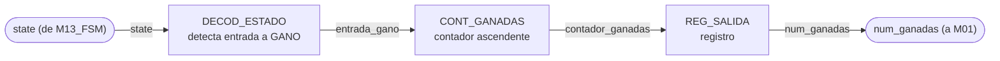

### c) Objetivo del módulo

Contar el número de partidas ganadas. Incrementa por su cuenta al detectar que `state` entró a
GANO y entrega el total acumulado a M01_Marcador para su despliegue. `rst` lo devuelve a cero,
que es lo que hace que BTN_RST reinicie el marcador acumulado como pide el enunciado.

### d) Entradas

- `clk`, `rst`.
- `state`, estado actual, desde M13_FSM, incrementa al entrar a GANO.

### e) Salidas

- `num_ganadas`, número acumulado de partidas ganadas, hacia M01_Marcador.

## M07: Comparador-letra

### b) Diagrama modular

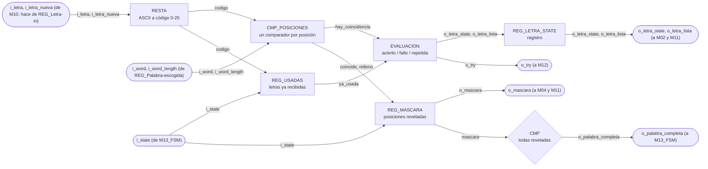

### c) Objetivo del módulo

Compara la letra recibida con la palabra escogida y determina el resultado del intento. Guarda
además cuáles posiciones de la palabra ya se revelaron y cuáles letras ya se recibieron, que es lo
que permite avisar cuando la palabra quedó completa y no penalizar una letra repetida.

### d) Entradas

- `clk`, `rst`.
- `i_letra[7:0]`, letra recibida en ASCII tal como sale de `M10_Receptor-UART`, que en el top hace
  también de `REG_Letra-in`.
- `i_letra_nueva`, pulso de un ciclo que avisa que `i_letra` acaba de cargarse, desde el mismo
  registro.
- `i_word[WORD_MAXLEN*LETRA_WIDTH-1:0]`, palabra de la partida, desde `REG_Palabra-escogida`. Cada
  letra ocupa `LETRA_WIDTH` bits con su código de 0 a 25, y la primera letra va en los bits bajos.
- `i_word_length[$clog2(WORD_MAXLEN+1)-1:0]`, cantidad de letras válidas de `i_word`, desde
  `REG_Palabra-escogida`.
- `i_state[2:0]`, estado actual, desde `M13_FSM`. De acá solo le interesa CARGA.

El módulo está parametrizado con `WORD_MAXLEN = 12` y `LETRA_WIDTH = 5`, los mismos valores con los
que `M08_LFSR` empaqueta la palabra y con los que `M11_Transmisor-UART` recibe la máscara.

### e) Salidas

- `o_letra_state[1:0]`, resultado de la comparación, hacia `M02_Generador-Tono` y
  `M11_Transmisor-UART`.
- `o_letra_lista`, estrobo de un ciclo que acompaña a `o_letra_state`, hacia `M02_Generador-Tono`
  y `M11_Transmisor-UART`.
- `o_palabra_completa`, todas las posiciones de la palabra reveladas, hacia `M13_FSM`.
- `o_mascara[WORD_MAXLEN-1:0]`, posiciones reveladas, hacia `M04_Mostrar-LCD` y
  `M11_Transmisor-UART`. Es el patrón que se pinta en el LCD y el que viaja en la trama hacia la
  PC. El bit 0 corresponde a la primera letra de la palabra.
- `o_try`, pulso de intento fallido, hacia `M12_Contador-Intentos`.

Codificación de `o_letra_state`:

| `o_letra_state` | Significado |
| --------------- | ----------- |
| `00`            | FALLO, la letra no está en la palabra |
| `01`            | ACIERTO, la letra reveló al menos una posición |
| `10`            | REPETIDA, la letra ya se había recibido antes |
| `11`            | sin uso |

## M08: LFSR

### b) Diagrama modular

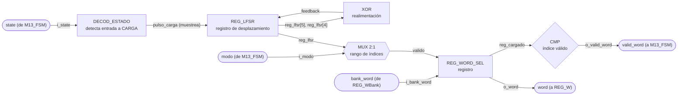

### c) Objetivo del módulo

Escoger de forma pseudoaleatoria la palabra secreta de la partida usando un LFSR. El LFSR corre
libre todo el tiempo y este módulo lo muestrea al ver que `state` entró a CARGA, saca del banco
(REG_WBank) una palabra acorde al `modo`, la entrega a REG_Palabra-escogida y confirma con
`valid_word` que ya está lista, que es justo lo que M13_FSM está esperando para pasar a JUEGO.

### d) Entradas

- `clk`, `rst`.
- `state`, estado actual, desde M13_FSM, muestrea el LFSR al entrar a CARGA.
- `modo`, fácil o difícil, desde M13_FSM, acota el rango de palabras válidas.
- `bank_word`, palabra leída del banco, desde REG_WBank.

### e) Salidas

- `word`, palabra escogida, hacia REG_Palabra-escogida.
- `valid_word`, bandera de índice/palabra válida, hacia M13_FSM.

## M09: Botones

### b) Diagrama modular

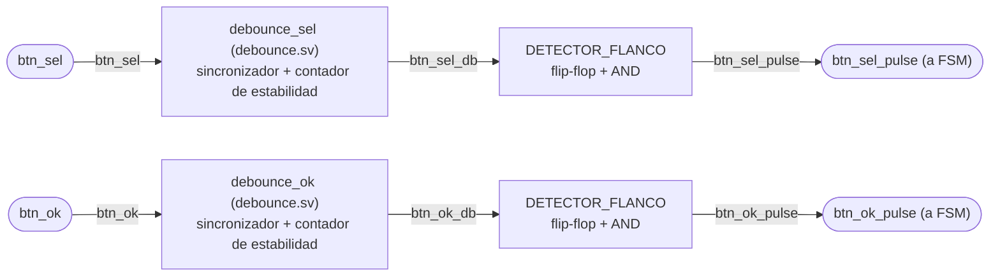

### c) Objetivo del módulo

Capturar y filtrar (debounce) las pulsaciones físicas de BTN_SEL y BTN_OK, entregando los
pulsos limpios `sel` y `ok` directamente a M13_FSM.

### d) Entradas

- `clk`, `rst`.
- `btn_sel`, señal cruda del botón de selección.
- `btn_ok`, señal cruda del botón de confirmación.

### e) Salidas

- `btn_sel_pulse`, pulso de selección filtrado, hacia la entrada `sel` de M13_FSM.
- `btn_ok_pulse`, pulso de confirmación filtrado, hacia la entrada `ok` de M13_FSM.

## M10: Receptor-UART

### b) Diagrama modular

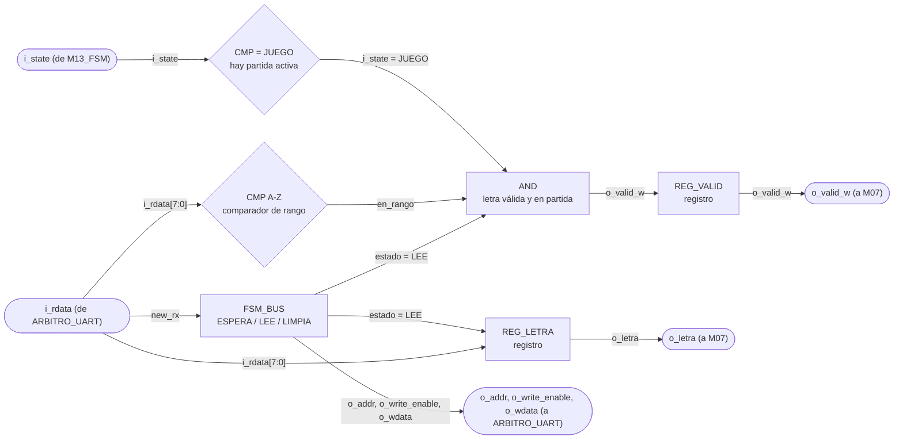

### c) Objetivo del módulo

Recibe los bytes que manda la aplicación del PC, se queda solo con los que son una letra A-Z
durante una partida activa, y los entrega a `M07_Comparador-letra`. Es el punto donde se descarta
todo lo que no debe llegar a la lógica del juego.

### d) Entradas

- `clk`, `rst`.
- `i_rdata[WIDTH-1:0]`, lo que devuelve `PERIFERICO_UART` en la dirección que este módulo le está
  poniendo, de ahí saca el bit `new_rx` y el byte recibido. Llega pasando por `ARBITRO_UART`.
- `i_state[2:0]`, estado actual, desde `M13_FSM`. De acá solo le interesa JUEGO.

El dato no le llega por una flecha propia en el diagrama de tercer nivel, entra por el bus de 32
bits que comparte con `M11_Transmisor-UART` a través de `ARBITRO_UART`.

El módulo está parametrizado con `WIDTH = 32`, el ancho del bus. El byte serial es
`BYTE_WIDTH = 8` y va como `localparam` dentro de la lista de parámetros, porque los núcleos del
curso siempre mueven 8 bits y no tiene sentido que dependa del ancho del bus.

### e) Salidas

- `o_letra[BYTE_WIDTH-1:0]`, letra recibida en ASCII tal como salió del periférico, hacia
  `M07_Comparador-letra`.
- `o_valid_w`, pulso de un ciclo que habilita esa letra, hacia `M07_Comparador-letra`, donde entra
  como `i_letra_nueva`.
- `o_addr[1:0]`, `o_write_enable`, `o_wdata[WIDTH-1:0]`, petición hacia el bus, que entra por la
  cara del receptor de `ARBITRO_UART`.

`o_letra` y `o_valid_w` salen de registros, así que juntas cumplen el papel de `REG_Letra-in` del
diagrama de tercer nivel y en el top no hace falta un registro aparte.

## M11: Transmisor-UART

### b) Diagrama modular

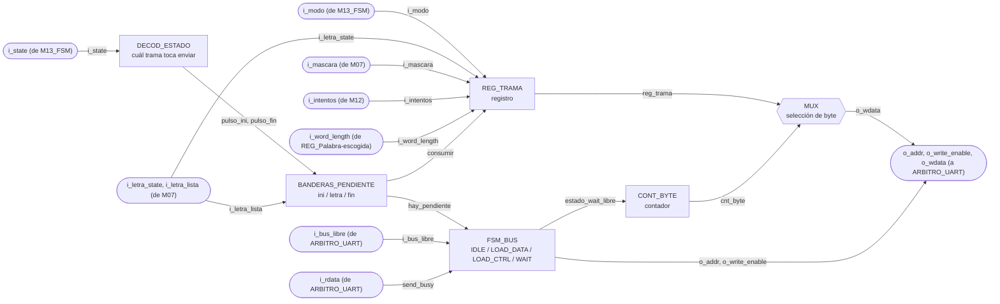

### c) Objetivo del módulo

Ensamblar y transmitir hacia la PC, por UART, las tramas de estado del juego que exige la sección
3.4.4 del enunciado, inicio de partida con modo y longitud, resultado de cada letra con el patrón
actualizado y los intentos, y resultado final con su causa.

Decide solo cuándo transmitir. Al ver que `i_state` entró a JUEGO manda la trama de inicio, con
cada letra evaluada manda la trama de letra, y al entrar a GANO o PERDIO manda la de fin.

La FSM llega a PERDIO tanto por intentos como por tiempo, así que `i_state` solo no alcanza para
la causa. El módulo la saca de `i_intentos` al entrar. Si la cuenta llegó a 6 se perdió por
intentos, y con cualquier otro valor fue el tiempo. Eso es confiable porque `M12_Contador-Intentos`
solo se limpia en CARGA, así que durante PERDIO la cuenta sigue intacta, y coincide con la
prioridad de la FSM, que ante intentos agotados y tiempo en cero en el mismo ciclo escoge intentos.

### d) Entradas

- `clk`, `rst`.
- `i_state[2:0]`: estado actual, desde `M13_FSM`, decide cuál trama toca enviar.
- `i_modo`: modo de la partida, desde `M13_FSM`, viaja en la trama de inicio.
- `i_letra_state[1:0]`: resultado de la última letra, desde `M07_Comparador-letra`. La
  codificación es `00` fallo, `01` acierto, `10` repetida, y el `11` no se usa.
- `i_letra_lista`: estrobo de un ciclo que acompaña a `i_letra_state`, desde
  `M07_Comparador-letra`. Es el que dispara la trama, no el valor de `i_letra_state`, porque dos
  letras seguidas con el mismo resultado no cambian ese bus y sin estrobo la segunda se perdería.
- `i_intentos[2:0]`: fallos acumulados de la partida, desde `M12_Contador-Intentos`. Llega a 6,
  así que 3 bits alcanzan. Viaja en la trama de letra y además decide la causa de una derrota.
- `i_word_length[3:0]`: longitud de la palabra escogida, desde `REG_Palabra-escogida`, que en el
  top es `word[63:60]` de `M08_LFSR`.
- `i_mascara[WORD_MAXLEN-1:0]`: posiciones ya reveladas, desde `M07_Comparador-letra`. Es el
  patrón que el enunciado pide mandar junto con el resultado de la letra.
- `i_rdata[WIDTH-1:0]`: lectura de vuelta del bus, de ahí sondea el bit `send` para saber si el
  periférico sigue ocupado. Llega pasando por `ARBITRO_UART`.
- `i_bus_libre`: desde `ARBITRO_UART`, dice si este ciclo el bus es suyo.

El módulo está parametrizado con `WIDTH = 32`, el ancho del bus, y con `WORD_MAXLEN = 12`, el
mismo valor que usan `M07_Comparador-letra` y el banco de palabras. El byte serial es
`BYTE_WIDTH = 8` fijo, porque los núcleos del curso siempre mueven 8 bits.

### e) Salidas

- `o_write_enable`, `o_addr[1:0]`, `o_wdata[WIDTH-1:0]`: petición hacia el bus, que entra por la cara
  del transmisor de `ARBITRO_UART`.

Todo lo que el módulo tiene que decir viaja empaquetado dentro de `o_wdata`, un byte a la vez.
La etiqueta `modo/letra_state/Resultado/w_word/Intentos` del diagrama de nivel 3 describe ese
contenido, no puertos separados.

## M12: Contador-Intentos

### b) Diagrama modular

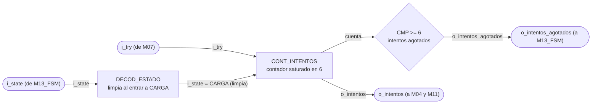

### c) Objetivo del módulo

Lleva la cuenta de letras incorrectas de la partida en curso y avisa cuando se alcanzaron las seis
que el enunciado fija como máximo. Es la condición de derrota por intentos.

### d) Entradas

- `clk`, `rst`.
- `i_try`, pulso de intento fallido, desde `M07_Comparador-letra`.
- `i_state[2:0]`, estado actual, desde `M13_FSM`. De acá solo le interesa CARGA.

El módulo está parametrizado con `MAX_INTENTOS = 6`, el máximo que fija el enunciado.

### e) Salidas

- `o_intentos[$clog2(MAX_INTENTOS+1)-1:0]`, fallos acumulados de la partida, hacia
  `M04_Mostrar-LCD` y `M11_Transmisor-UART`.
- `o_intentos_agotados`, bandera de seis fallos alcanzados, hacia `M13_FSM`.

## M13: FSM

### b) Diagrama de estados

Para este módulo el diagrama de estados ocupa el lugar del diagrama modular de los demás. Una FSM
se escribe directamente desde su diagrama de estados, no desde un arreglo de registros y
compuertas, así que ese es el diagrama que de verdad sirve para implementarla.

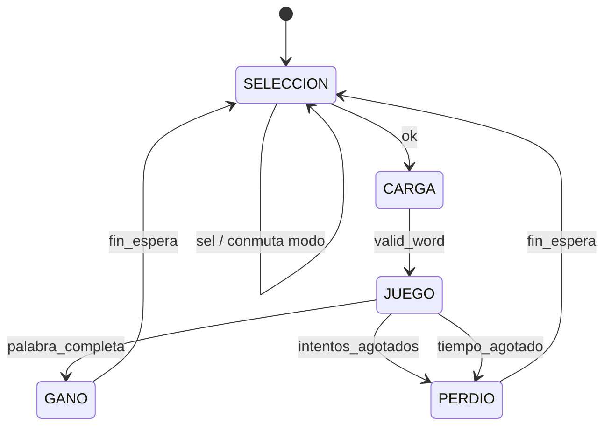

Codificación de `state`, tres bits. Es el contrato que decodifican los demás módulos, así que el
valor de cada estado queda fijo:

- `000` SELECCION, pantalla de selección de modo.
- `001` CARGA, se le pide palabra al banco y se espera `valid_word`.
- `010` JUEGO, partida activa.
- `011` GANO, la palabra quedó completa.
- `100` PERDIO, se alcanzaron las seis letras incorrectas o la cuenta regresiva llegó a cero.

`101`, `110` y `111` no se usan. La FSM no guarda la causa de la derrota, M11_Transmisor-UART la
deduce del contador de intentos (ver `M13_FSM.md`, g).

`BTN_RST` devuelve la FSM a SELECCION desde cualquier estado, igual que reinicia al resto de los
módulos, por eso no se dibuja como una transición más del diagrama.

### c) Objetivo del módulo

Llevar el estado global de la partida y publicarlo para que cada módulo decida por su cuenta qué
le toca hacer. La FSM no le da órdenes puntuales a nadie, no manda pulsos de `start`, `show`,
`choose` ni `count`. Solo dice en cuál de los cinco estados está el sistema y cuál modo está
seleccionado.

Esa es la decisión de diseño central del módulo. Con la FSM mandando, cada módulo nuevo obligaba a
agregarle una salida y a meterle mano a su lógica interna. Con los módulos decodificando `state`
la FSM queda fija, y un módulo nuevo solo se cuelga del estado que ya se difunde. Se nota en el
diagrama de tercer nivel, todas las flechas que salen de la FSM llevan lo mismo, `state` y en
algunos casos `modo`, en vez de once señales de control distintas.

El otro efecto es que la FSM nunca se queda esperando a nadie. No sondea el `busy` del LCD ni
espera confirmación de M11 para cambiar de estado, porque no les está ordenando nada. M04 repinta
el estado que ve en el momento en que puede, y si CARGA pasa demasiado rápido para el LCD,
simplemente pinta el siguiente estado sin que quede nada a medias.

De aquí sale también la respuesta a lo que el enunciado exige documentar, qué pasa con una letra
que llega por UART fuera de partida. REG_Letra-in solo carga cuando `state` es JUEGO, así que la
letra se descarta ahí mismo, sin llegar a M07 ni gastar intento. La FSM ni se entera.

### d) Entradas

- `clk`, `rst`.
- `sel`, pulso de cambio de modo, desde M09_Botones.
- `ok`, pulso de confirmación, desde M09_Botones.
- `valid_word`, palabra lista en REG_Palabra-escogida, desde M08_LFSR.
- `palabra_completa`, todas las posiciones de la palabra reveladas, desde M07_Comparador-letra.
- `intentos_agotados`, seis letras incorrectas alcanzadas, desde M12_Contador-Intentos.
- `tiempo_agotado`, cuenta regresiva en cero, desde M03_Temporizador.
- `fin_espera`, se cumplió la espera del resultado en pantalla, desde M03_Temporizador.

### e) Salidas

- `state`, estado actual en tres bits, hacia M02_Generador-Tono, M03_Temporizador,
  M04_Mostrar-LCD, M05_Estado, M06_Ganadas, M07_Comparador-letra, M08_LFSR, M10_Receptor-UART,
  M11_Transmisor-UART, M12_Contador-Intentos y REG_Letra-in.
- `modo`, FACIL o DIFICIL, hacia M03_Temporizador, M04_Mostrar-LCD, M08_LFSR y
  M11_Transmisor-UART.
