# Nivel 3

## Diagrama de tercer nivel

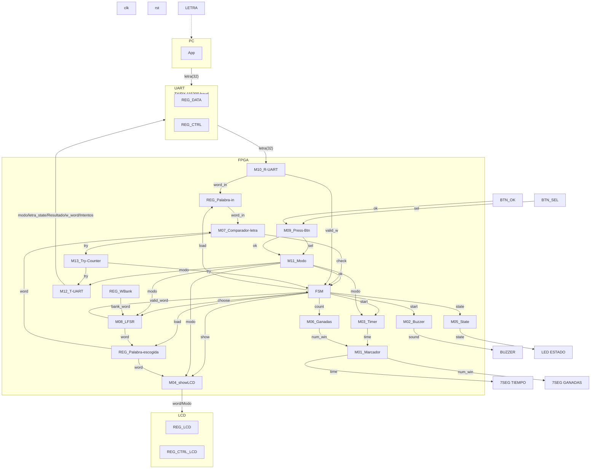

### Leyenda de los diagramas modulares

Para facilitar la creación de los diagramas, utilizando mermaid, utilizaremos la siguiente notación:

- **Óvalo**: puerto externo del módulo (entrada o salida hacia otro módulo/bloque).
- **Rectángulo**: registro o contador.
- **Hexágono**: multiplexor.
- **Rombo**: comparador o lógica de decisión.
- **Rectángulos etiquetados** `XOR`, `OR`, `SUMADOR`, `DECOD_...`: compuertas o bloques combinacionales
  puntuales (comparación bit a bit, decremento, decodificación).

`clk` y `rst` entran a todo registro/contador de cada módulo aunque no se dibujen en cada elemento,
por el mismo criterio usado en los niveles 1 y 2.

## M01: Marcador

### b) Diagrama modular

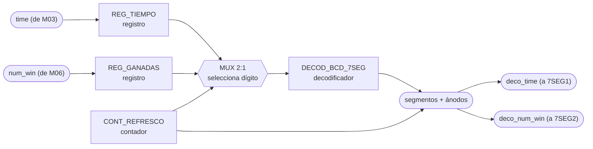

### c) Objetivo del módulo

Manejar los displays de 7 segmentos del marcador: recibe el tiempo restante desde M03_Timer y
el número de partidas ganadas desde M06_Ganadas, y los muestra en 7SEG1 y 7SEG2
respectivamente.

### d) Entradas

- `clk`, `rst`.
- `time`, tiempo restante de la partida, desde M03_Timer.
- `num_win`, número de partidas ganadas, desde M06_Ganadas.

### e) Salidas

- `deco_time`, patrón de segmentos/ánodos del display de tiempo, hacia 7SEG1.
- `deco_num_win`, patrón de segmentos/ánodos del display de ganadas, hacia 7SEG2.

## M02: Buzzer

### b) Diagrama modular

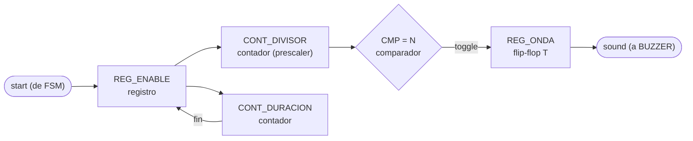

### c) Objetivo del módulo

Generar la señal de sonido para el buzzer cuando la FSM lo indica (por ejemplo, como
retroalimentación de acierto, error o fin de partida).

### d) Entradas

- `clk`, `rst`.
- `start`, pulso que dispara el tono, desde la FSM.

### e) Salidas

- `sound`, onda cuadrada de audio, hacia BUZZER.

## M03: Timer

### b) Diagrama modular

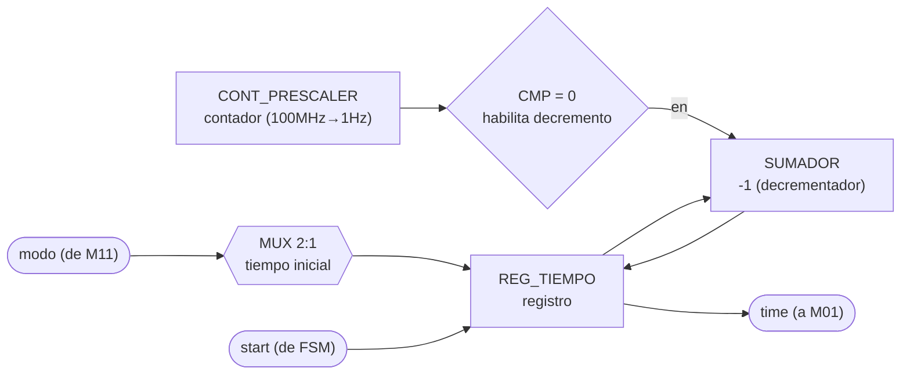

### c) Objetivo del módulo

Llevar la cuenta regresiva de tiempo de la partida activa. Arranca cuando la FSM lo indica,
ajusta la duración según el modo (fácil/difícil) recibido de M11_Modo, y entrega el tiempo
restante a M01_Marcador para mostrarlo.

### d) Entradas

- `clk`, `rst`.
- `start`, pulso que arranca/reinicia la cuenta, desde la FSM.
- `modo`, fácil o difícil, desde M11_Modo (define el tiempo inicial a cargar).

### e) Salidas

- `time`, tiempo restante de la partida, hacia M01_Marcador.

## M04: ShowLCD

### b) Diagrama modular

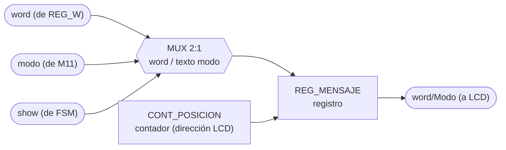

### c) Objetivo del módulo

Controlar lo que se muestra en el LCD: cuando la FSM lo ordena, toma la palabra escogida
(REG_W) y el modo actual (M11_Modo) y compone la salida `word/Modo` que se envía al periférico
LCD.

### d) Entradas

- `clk`, `rst`.
- `show`, pulso de la FSM que ordena refrescar el LCD.
- `modo`, desde M11_Modo.
- `word`, palabra escogida (REG_Palabra-escogida).

### e) Salidas

- `word/Modo`, mensaje compuesto (palabra en curso o texto de modo), hacia el periférico LCD.

## M05: State

### b) Diagrama modular

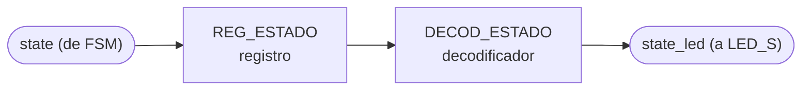

### c) Objetivo del módulo

Reflejar el estado actual de la FSM en el LED de estado, traduciendo la señal `state` que
recibe de la FSM a la salida física que enciende LED_S.

### d) Entradas

- `clk`, `rst`.
- `state`, código de estado actual, desde la FSM.

### e) Salidas

- `state_led`, señal física del LED de estado, hacia LED_S.

## M06: Ganadas

### b) Diagrama modular

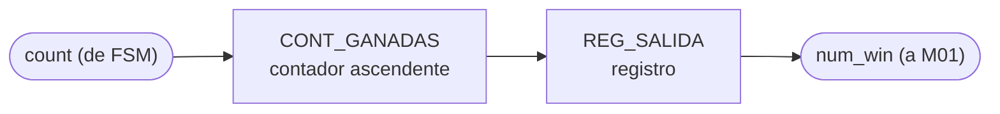

### c) Objetivo del módulo

Contar el número de partidas ganadas: incrementa cuando la FSM lo indica (`count`) y entrega el
total acumulado a M01_Marcador para su despliegue.

### d) Entradas

- `clk`, `rst`.
- `count`, pulso de incremento (partida ganada), desde la FSM.

### e) Salidas

- `num_win`, número acumulado de partidas ganadas, hacia M01_Marcador.

## M07: Comparador-letra

### b) Diagrama modular

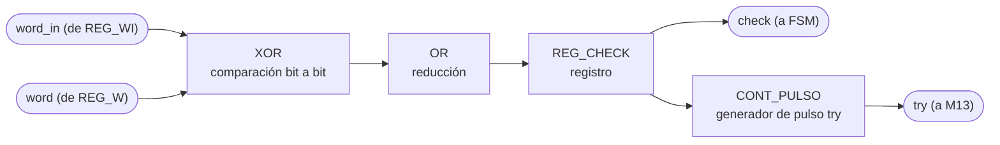

### c) Objetivo del módulo

Comparar la letra recibida (REG_WI, `word_in`) contra la palabra secreta (REG_W, `word`) para
determinar si hubo acierto o fallo, informando el resultado (`check`) a la FSM y actualizando el
contador de intentos en M13_Try-Counter (`try`).

### d) Entradas

- `clk`, `rst`.
- `word_in`, letra recibida, desde REG_Palabra-in.
- `word`, palabra secreta, desde REG_Palabra-escogida.

### e) Salidas

- `check`, resultado de la comparación (acierto/fallo), hacia la FSM.
- `try`, pulso de intento evaluado, hacia M13_Try-Counter.

## M08: LFSR

### b) Diagrama modular

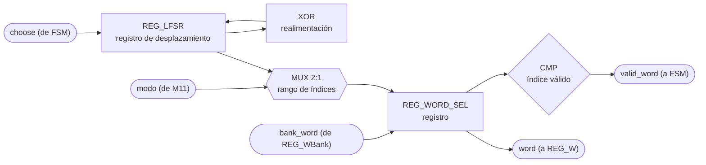

### c) Objetivo del módulo

Escoger de forma pseudoaleatoria la palabra secreta de la partida usando un LFSR: cuando la FSM
lo pide (`choose`), muestrea el banco de palabras (REG_WBank) según el modo indicado por
M11_Modo, entrega la palabra elegida a REG_W y confirma su validez a la FSM (`valid_word`).

### d) Entradas

- `clk`, `rst`.
- `choose`, pulso de solicitud de nueva palabra, desde la FSM.
- `modo`, fácil o difícil, desde M11_Modo (acota el rango de palabras válidas).
- `bank_word`, palabra leída del banco, desde REG_WBank.

### e) Salidas

- `word`, palabra escogida, hacia REG_Palabra-escogida.
- `valid_word`, bandera de índice/palabra válida, hacia la FSM.

## M09: Press_Btn

### b) Diagrama modular

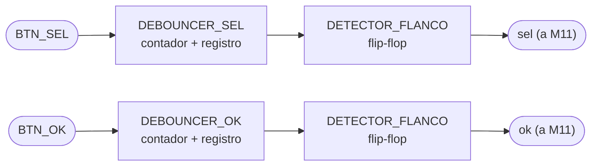

### c) Objetivo del módulo

Capturar y filtrar (debounce) las pulsaciones físicas de BTN_SEL y BTN_OK, entregando los
pulsos limpios `sel` y `ok` a M11_Modo.

### d) Entradas

- `clk`, `rst`.
- `BTN_SEL`, señal cruda del botón de selección.
- `BTN_OK`, señal cruda del botón de confirmación.

### e) Salidas

- `sel`, pulso de selección filtrado, hacia M11_Modo.
- `ok`, pulso de confirmación filtrado, hacia M11_Modo.

## M10: R-UART

### b) Diagrama modular

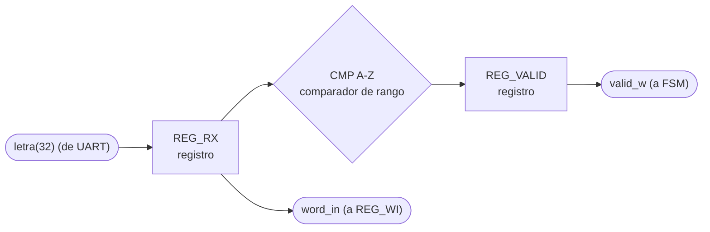

### c) Objetivo del módulo

Recibir la letra enviada por la PC a través de UART, cargarla en REG_WI (`word_in`) y avisar a
la FSM que llegó un dato válido (`valid_w`).

### d) Entradas

- `clk`, `rst`.
- `letra(32)`, byte recibido por UART (empaquetado en 32 bits), desde el periférico UART.

### e) Salidas

- `word_in`, letra recibida, hacia REG_Palabra-in.
- `valid_w`, bandera de dato válido recibido, hacia la FSM.

## M11: Modo

### b) Diagrama modular

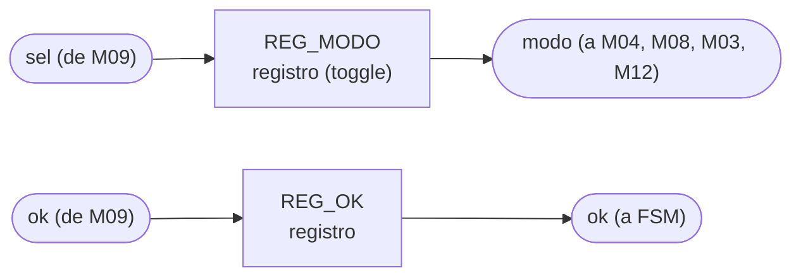

### c) Objetivo del módulo

Gestionar la selección de modo de juego (fácil/difícil): a partir de los pulsos `sel`/`ok` de
M09_Press-Btn, confirma el inicio de partida a la FSM (`ok`) y distribuye el modo elegido
(`modo`) a M04_showLCD, M08_LFSR, M03_Timer y M12_T-UART.

### d) Entradas

- `clk`, `rst`.
- `sel`, pulso de cambio de modo, desde M09_Press-Btn.
- `ok`, pulso de confirmación, desde M09_Press-Btn.

### e) Salidas

- `ok`, confirmación de inicio de partida, hacia la FSM.
- `modo`, modo elegido (fácil/difícil), hacia M04_showLCD, M08_LFSR, M03_Timer y M12_T-UART.

## M12: T-UART

### b) Diagrama modular

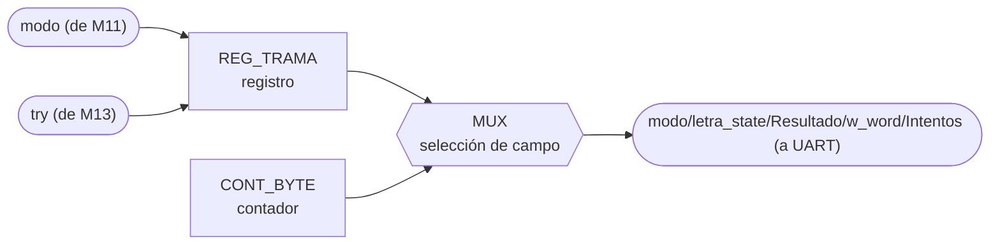

### c) Objetivo del módulo

Transmitir hacia la PC, por UART, el estado del juego: modo, estado de la letra, resultado,
palabra en curso e intentos usados (`modo/letra_state/Resultado/w_word/Intentos`), a partir del
modo recibido de M11_Modo y los intentos reportados por M13_Try-Counter.

### d) Entradas

- `clk`, `rst`.
- `modo`, desde M11_Modo.
- `try`, número de intentos, desde M13_Try-Counter.

Nota: el diagrama de tercer nivel no dibuja explícitamente el origen de `letra_state`,
`Resultado` ni `w_word` dentro de la trama; quedan pendientes de conectar (probablemente desde
la FSM o desde REG_W/M07) al completar este apartado.

### e) Salidas

- `modo/letra_state/Resultado/w_word/Intentos`, trama de estado del juego, hacia el periférico
  UART.

## M13: Try-Counter

### b) Diagrama modular

### c) Objetivo del módulo

Contar los intentos (letras evaluadas) de la partida en curso: se incrementa con cada resultado
de M07_Comparador-letra y reporta el total tanto a la FSM como a M12_T-UART para su transmisión
a la PC.

### d) Entradas

- `clk`, `rst`.
- `try`, pulso de intento evaluado, desde M07_Comparador-letra.

### e) Salidas

- `try`, número acumulado de intentos, hacia la FSM y hacia M12_T-UART.
