# Diseño — Proyecto 2 Ahorcado

> Documento consolidado de la documentación de diseño vigente en la rama `develop`.
> Los documentos individuales de nivel y módulo constituyen la fuente de verdad; este archivo los reúne en un único documento.

---

<!-- Fuente: docs/diseño/diagramas/nivel01.md -->

# Nivel 1

## Diagrama de primer nivel

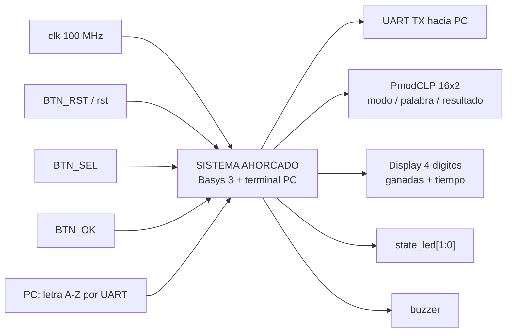

## Objetivo

El sistema implementa el juego de ahorcado con la **lógica de juego dentro de la FPGA**. La PC
funciona como terminal: envía letras A-Z y presenta el estado que la FPGA reporta por UART.

## Entradas externas

- `clk`: reloj de 100 MHz de la Basys 3.
- `rst`: reinicio global.
- `btn_sel`: cambia entre modo fácil y difícil mientras el sistema está en selección.
- `btn_ok`: confirma el modo y comienza una partida.
- `rx_i`: línea UART desde la PC; transporta letras ASCII A-Z.

## Salidas externas

- `tx_o`: UART hacia la PC.
- `lcd_rs_o`, `lcd_rw_o`, `lcd_e_o`, `lcd_data_o[7:0]`: interfaz del PmodCLP.
- `seg[6:0]`, `an[3:0]`, `dp`: display multiplexado de cuatro dígitos.
- `state_led[1:0]`: codificación visual del estado global.
- `buzzer`: onda cuadrada de realimentación sonora.

## Explicación general

Después del reset el sistema queda en `SELECCION` y arranca en modo fácil. `BTN_SEL` conmuta la
dificultad y `BTN_OK` pasa a `CARGA`. En `CARGA`, el LFSR y el banco interno seleccionan una palabra.
Cuando `valid_word` se activa, la FSM entra a `JUEGO`.

Durante `JUEGO`, el receptor UART solo acepta letras ASCII entre `A` y `Z`. El comparador revela
todas las posiciones de una letra acertada, detecta repeticiones y genera un pulso de fallo para el
contador de intentos. La partida termina al completar la palabra, al llegar a seis fallos o al
agotarse el tiempo.

La FSM usa un único estado `PERDIO`, por lo que la causa concreta de la derrota no forma parte de
`state`. El transmisor UART determina si la derrota fue por intentos o por tiempo al construir el
mensaje final.

El resultado se mantiene aproximadamente tres segundos y luego la FSM vuelve a `SELECCION`.

## Diagrama de flujo de una partida

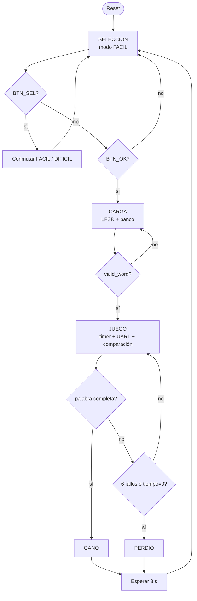

---

<!-- Fuente: docs/diseño/diagramas/nivel02.md -->

# Nivel 2

## Diagrama de segundo nivel

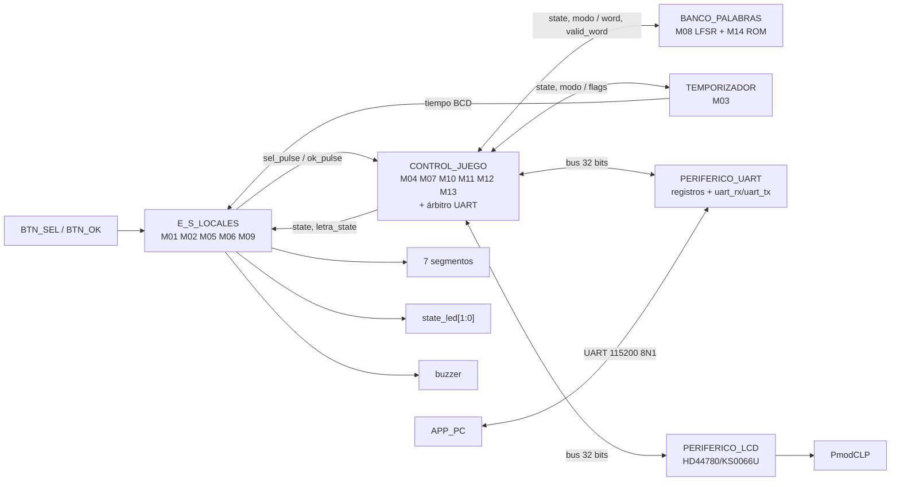

## CONTROL_JUEGO

Agrupa la lógica que interpreta los eventos de la partida y las transacciones hacia los periféricos.
Incluye la FSM principal, comparación de letras, contador de fallos, manejadores de LCD y UART, y el
árbitro del bus UART.

A diferencia del diseño inicial, **la FSM no genera órdenes puntuales para cada módulo**. Publica
`state` y `modo`; cada bloque reconoce el estado que le interesa.

## BANCO_PALABRAS

Está formado por:

- `banco_palabras.sv`: ROM combinacional de 50 palabras.
- `lfsr.sv`: generador pseudoaleatorio y selector de dirección.

La interfaz interna principal es:

`LFSR.o_bank_addr -> banco_palabras.i_bank_addr -> banco_palabras.o_bank_word -> LFSR.i_bank_word`.

El LFSR entrega finalmente `word[63:0]` y `valid_word`.

## TEMPORIZADOR

`temporizador.sv` recibe `state` y `modo`. Detecta por sí mismo la entrada a `JUEGO`, carga 60 s en
modo fácil o 45 s en modo difícil y produce el tiempo en BCD. También cuenta los tres segundos de
permanencia en los estados de resultado.

## PERIFERICO_UART

Es un periférico de bus de 32 bits con tres direcciones:

- `00`: dato TX.
- `01`: dato RX.
- `10`: control (`send` en bit 0 y `new_rx` en bit 1).

Internamente usa `uart_tx.sv` y `uart_rx.sv` a 115200 baudios.

El receptor y el transmisor de juego son dos maestros lógicos del mismo periférico; por eso
`arbitro_uart.sv` multiplexa sus solicitudes y da prioridad al receptor.

## PERIFERICO_LCD

Recibe comandos por un bus de 32 bits y encapsula la temporización física del HD44780/KS0066U.
`mostrar_lcd.sv` no controla directamente los pines: escribe registros de alto nivel y espera
`busy` / `done`.

## E_S_LOCALES

Agrupa las interfaces físicas que no necesitan el bus de 32 bits:

- M01 Marcador.
- M02 Generador de tono.
- M05 Estado.
- M06 Ganadas.
- M09 Botones y `debounce`.

## APP_PC

La PC envía letras y decodifica mensajes UART. No decide aciertos, fallos, fin de partida ni tiempo;
esas decisiones pertenecen a la FPGA.

---

<!-- Fuente: docs/diseño/diagramas/nivel03.md -->

# Nivel 3

Este nivel refleja las conexiones **presentes en `src/design/top.sv` de la rama `develop`**.

## Diagrama de tercer nivel

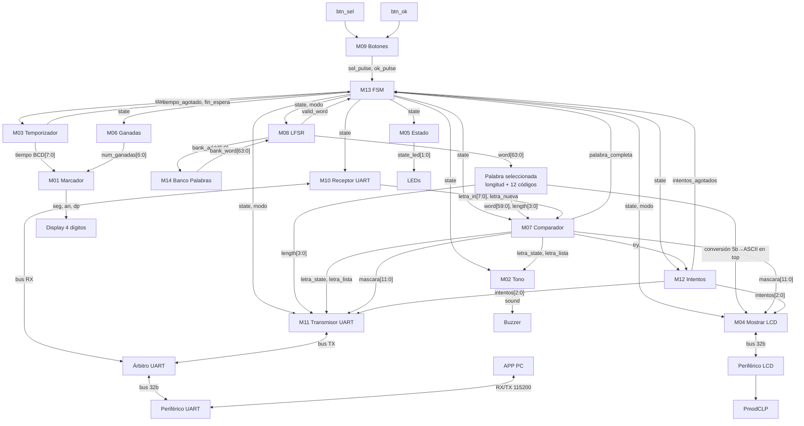

## Observaciones de integración

- La FSM tiene cinco estados útiles y no envía `start`, `show`, `choose`, `count`, `load` ni
  `detener`.
- `banco_palabras` es un módulo separado del LFSR.
- No existe un registro `REG_Palabra-escogida` instanciado en el `top` actual. `word[63:0]` sale
  directamente de `lfsr.sv`.
- `palabra_escogida.sv` existe en el repositorio, pero **no está instanciado**. El `top` hace
  directamente el slicing de la palabra y la conversión de los códigos de 5 bits a ASCII.
- El receptor y transmisor UART no se conectan directamente al periférico: pasan por
  `arbitro_uart.sv`.
- `mostrar_lcd.sv` escribe al periférico LCD por bus; no genera directamente `RS`, `RW`, `E` ni
  `lcd_data`.
- El display de 7 segmentos es uno de cuatro dígitos: AN0/AN1 muestran ganadas y AN2/AN3 tiempo.

## Codificación de estado compartida

| Código | Estado |
|---|---|
| `000` | SELECCION |
| `001` | CARGA |
| `010` | JUEGO |
| `011` | GANO |
| `100` | PERDIO |
| `101` | no usado |
| `110` | no usado |
| `111` | no usado |

La codificación es un contrato entre la FSM y los módulos que decodifican `state`.

---

<!-- Fuente: docs/diseño/modulos/M01_Marcador.md -->

# M01 - Marcador

Archivo RTL de referencia: `src/design/marcador.sv`.

## b) Diagrama modular

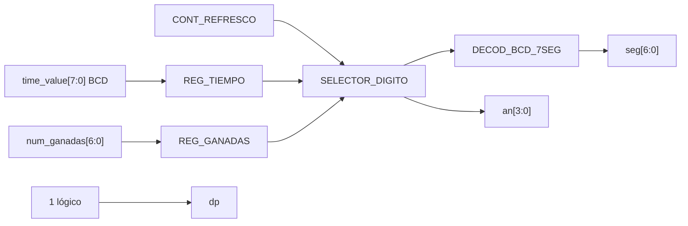

## c) Objetivo del módulo

Multiplexar los cuatro dígitos del display de siete segmentos. Los dos dígitos menos
    significativos muestran partidas ganadas y los dos restantes muestran el tiempo restante.

## d) Entradas

- `clk`: reloj de 100 MHz.
    - `rst`: reset síncrono.
    - `time_value[7:0]`: tiempo BCD `{decenas, unidades}` desde M03.
    - `num_ganadas[6:0]`: acumulado binario 0–99 desde M06.

## e) Salidas

- `seg[6:0]`: segmentos activos en bajo, orden `gfedcba`.
    - `an[3:0]`: selección de dígito activa en bajo.
    - `dp`: punto decimal; permanece apagado (`1`).

## f) Explicación de la relación con otros módulos

M03 entrega directamente el tiempo BCD y M06 entrega el acumulado binario. M01 no modifica
    ningún estado del juego; únicamente registra, separa los dígitos y maneja el refresco visual.

## g) Explicación de funcionamiento

El módulo registra ambos valores. `contador_refresco` toma dos bits altos de un contador libre
    para seleccionar un dígito. `selector_digito` elige unidades/decenas y `decod_bcd_7seg`
    transforma el nibble al patrón físico.

## h) Diseño

Distribución física:

    - `AN0`: unidades de ganadas.
    - `AN1`: decenas de ganadas.
    - `AN2`: unidades de tiempo.
    - `AN3`: decenas de tiempo.

    El tiempo no se divide entre 10 porque ya llega en BCD; las ganadas sí llegan en binario y se
    convierten con `/10` y `%10`.

## i) Diagrama esquemático detallado

El diagrama de b) representa también el datapath principal de la implementación. Para módulos con
FSM interna se incluye la secuencia de estados dentro de la explicación de funcionamiento.

---

<!-- Fuente: docs/diseño/modulos/M02_Generador-Tono.md -->

# M02 - Generador de tono

Archivo RTL de referencia: `src/design/generador_tono.sv`.

## b) Diagrama modular

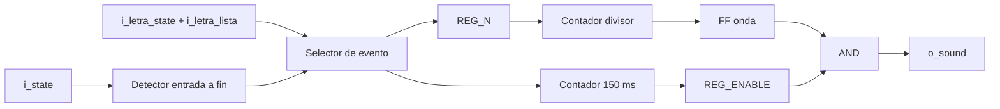

## c) Objetivo del módulo

Generar realimentación sonora distinta para acierto, fallo y fin de partida usando una onda
    cuadrada sobre el buzzer.

## d) Entradas

- `clk`, `rst`.
    - `i_state[2:0]`: estado global.
    - `i_letra_state[1:0]`: fallo/acierto/repetida.
    - `i_letra_lista`: pulso que indica resultado de letra válido.

## e) Salidas

- `o_sound`: onda cuadrada hacia el buzzer.

## f) Explicación de la relación con otros módulos

Recibe el resultado de M07 y el estado de M13. Una letra repetida no dispara sonido. La
    entrada a un estado final genera el tono de fin.

## g) Explicación de funcionamiento

Los valores por defecto son 1000 Hz para acierto, 250 Hz para fallo y 500 Hz para fin, todos
    durante 150 ms. Cada nuevo disparo reinicia la duración y el divisor, por lo que un evento
    reciente puede interrumpir el tono anterior.

## h) Diseño

El RTL todavía reconoce `3'b101` como un segundo código histórico de derrota. La FSM actual
    no genera ese estado; `3'b100` sí está incluido y por eso el tono de derrota actual funciona.
    Esta compatibilidad heredada se registra también en la documentación general.

## i) Diagrama esquemático detallado

El diagrama de b) representa también el datapath principal de la implementación. Para módulos con
FSM interna se incluye la secuencia de estados dentro de la explicación de funcionamiento.

---

<!-- Fuente: docs/diseño/modulos/M03_Temporizador.md -->

# M03 - Temporizador

Archivo RTL de referencia: `src/design/temporizador.sv`.

## b) Diagrama modular

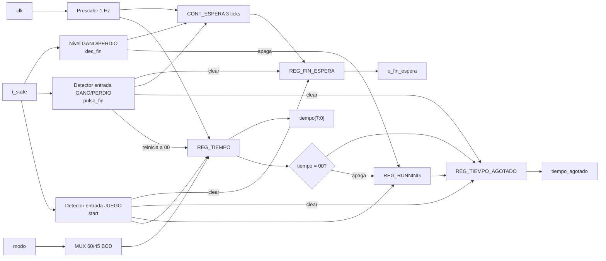

## c) Objetivo del módulo

Llevar la cuenta regresiva de la partida y generar la espera utilizada por la FSM para mantener el
resultado final antes de regresar a selección.

## d) Entradas

- `clk`, `rst`.
- `i_state[2:0]`: estado global de M13.
- `modo`: `0` fácil y `1` difícil.

No se agregaron puertos nuevos respecto a la revisión anterior. `start`, `dec_fin` y `pulso_fin`
son señales **internas** derivadas de `i_state`.

## e) Salidas

- `tiempo[7:0]`: tiempo restante en BCD `{decenas, unidades}`.
- `tiempo_agotado`: indica a M13 que la cuenta llegó a cero durante una partida activa.
- `o_fin_espera`: indica a M13 que se cumplieron los tres ticks de espera en `GANO` o `PERDIO`.

## f) Explicación de la relación con otros módulos

M13 entrega únicamente `state` y `modo`; no genera un `start` ni un `detener` independiente.
M03 detecta internamente la entrada a `JUEGO` mediante `start` y la entrada a `GANO/PERDIO`
mediante `pulso_fin`.

`tiempo_agotado` y `o_fin_espera` vuelven a M13. `tiempo` se conecta directamente a M01 para los
dos dígitos de tiempo del display.

Las conexiones externas del módulo no cambiaron, por lo que `top.sv`, M13 y el diagrama de nivel 3
mantienen exactamente los mismos puertos que en la revisión anterior.

## g) Explicación de funcionamiento

Al entrar a `JUEGO`, `start` carga `60` BCD en modo fácil o `45` BCD en modo difícil y activa
`running`. El prescaler genera `tick_1hz`; mientras `running=1`, cada tick decrementa el tiempo en
BCD.

Cuando el tiempo llega a `00` durante una partida activa, `tiempo_agotado` se pone en `1` y
`running` se apaga.

Si la partida termina antes por victoria o por seis fallos, la FSM entra a `GANO` o `PERDIO`.
M03 detecta ese flanco como `pulso_fin`, apaga `running`, pone el tiempo mostrado en `00` y empieza
la cuenta de tres ticks para generar `o_fin_espera`.

### Cambio importante de esta revisión

Se corrigió el ciclo de vida de las dos banderas para evitar que un `1` de la partida anterior sea
interpretado por la FSM en la partida siguiente:

| Evento | `tiempo_agotado` | `o_fin_espera` |
|---|---:|---:|
| `rst` | 0 | 0 |
| entrada a JUEGO (`start`) | 0 | 0 |
| tiempo llega a 00 mientras `running=1` | 1 | sin cambio |
| entrada a GANO/PERDIO (`pulso_fin`) | **0** | **0** |
| tercer tick en GANO/PERDIO | sin cambio | 1 |
| SELECCION/CARGA posteriores | 0 | puede seguir en 1 |
| siguiente entrada a JUEGO (`start`) | 0 | **0** |

La corrección concreta del RTL es:

```systemverilog
// Antes:
else if (start)
    tiempo_agotado <= 1'b0;

// Ahora:
else if (start || pulso_fin)
    tiempo_agotado <= 1'b0;
```

y:

```systemverilog
// Antes:
else if (pulso_fin)
    o_fin_espera <= 1'b0;

// Ahora:
else if (pulso_fin || start)
    o_fin_espera <= 1'b0;
```

Esto evita dos fallas entre partidas consecutivas:

1. Después de perder por tiempo, `tiempo_agotado` podía seguir en `1` hasta el primer ciclo de la
   nueva partida y provocar una derrota inmediata.
2. `o_fin_espera` podía conservar el `1` de la ronda anterior y hacer que un resultado posterior
   durara solamente un ciclo antes de volver a `SELECCION`.

## h) Diseño

### Señales internas derivadas de `state`

```systemverilog
dec_juego = (i_state == JUEGO);
start     = dec_juego & ~dec_juego_prev;

dec_fin   = (i_state == GANO) || (i_state == PERDIO);
pulso_fin = dec_fin & ~dec_fin_prev;
```

`start` y `pulso_fin` son pulsos de un ciclo obtenidos mediante detección de flanco.

### Registro `running`

Conceptualmente:

```text
running_next = start OR (running AND NOT zero AND NOT dec_fin)
```

Por ello:

- `start` enciende la cuenta.
- `zero` la apaga al llegar a cero.
- `dec_fin` la apaga si la partida termina por otra causa.

### Registro `tiempo_agotado`

Prioridad:

| Condición | Siguiente valor |
|---|---:|
| `rst` | 0 |
| `start OR pulso_fin` | 0 |
| `running AND zero` | 1 |
| resto | conserva |

El `clear` con `pulso_fin` es el cambio relevante respecto a la revisión anterior.

### Registro `o_fin_espera`

Prioridad:

| Condición | Siguiente valor |
|---|---:|
| `rst` | 0 |
| `pulso_fin OR start` | 0 |
| tercer tick estando en GANO/PERDIO | 1 |
| resto | conserva |

El `clear` con `start` es el otro cambio relevante.

## i) Diagrama esquemático detallado

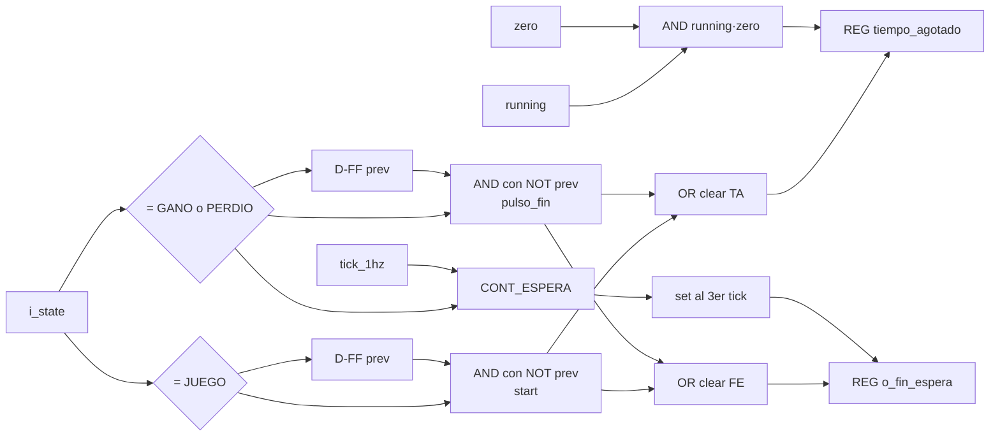

---

<!-- Fuente: docs/diseño/modulos/M04_Mostrar-LCD.md -->

# M04 - Mostrar LCD

Archivo RTL de referencia: `src/design/mostrar_lcd.sv`.

## b) Diagrama modular

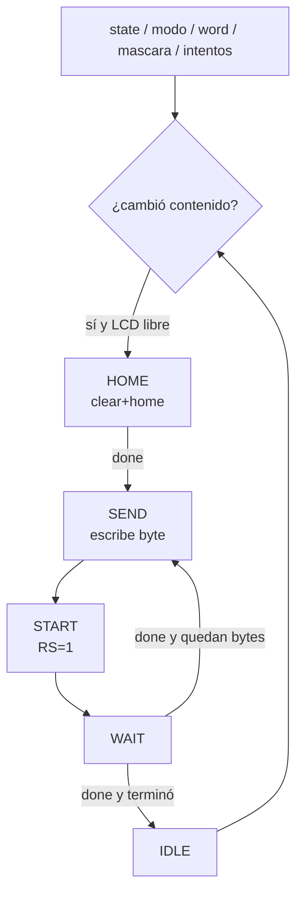

## c) Objetivo del módulo

Componer la pantalla que corresponde al estado actual y convertirla en transacciones del bus
    del periférico LCD.

## d) Entradas

- `clk`, `rst`.
    - `i_state[2:0]`, `i_modo`.
    - `i_word[95:0]`: palabra ASCII, hasta 12 caracteres.
    - `i_word_length[3:0]`.
    - `i_mascara[11:0]`.
    - `i_intentos[2:0]`: fallos acumulados.
    - `i_rdata[31:0]`: lectura del periférico LCD.

## e) Salidas

- `o_addr[1:0]`.
    - `o_write_enable`.
    - `o_wdata[31:0]`.

## f) Explicación de la relación con otros módulos

Recibe `state`/`modo` de la FSM, palabra desde la adaptación de `top.sv`, máscara desde M07 e
    intentos desde M12. Se comunica exclusivamente con `periferico_lcd.sv`; no maneja pines
    físicos.

## g) Explicación de funcionamiento

Pantallas implementadas:

    - SELECCION: `MODO: FACIL` o `MODO: DIFICIL`.
    - CARGA: no tiene pantalla propia.
    - JUEGO: 12 posiciones de palabra/espacios y sufijo ` I:n` con intentos restantes.
    - GANO: `GANASTE`.
    - PERDIO: `PERDISTE`.

    Detecta cambios en `state`, en `modo` durante selección y en máscara/intentos durante juego.
    Toma una fotografía del contenido al comenzar un refresco para no mezclar dos pantallas.

    Su FSM interna recorre `IDLE -> HOME -> SEND -> WAIT`. `HOME` ordena `clear+home` y espera
    `done`. Cada carácter necesita escribir el byte y después pulsar `start` con `RS=1`.

## h) Diseño

Direcciones actuales: control/estado=`00`, datos=`01`. Bits de control: start=0, rs=1,
    clear=2, home=3; bits de lectura: busy=8, done=9. Estas direcciones coinciden con
    `periferico_lcd.sv` aunque el comentario TODO histórico todavía permanezca en el RTL.

## i) Diagrama esquemático detallado

El diagrama de b) representa también el datapath principal de la implementación. Para módulos con
FSM interna se incluye la secuencia de estados dentro de la explicación de funcionamiento.

---

<!-- Fuente: docs/diseño/modulos/M05_Estado.md -->

# M05 - Estado

Archivo RTL de referencia: `src/design/Estado.sv`.

## b) Diagrama modular


## c) Objetivo del módulo

Registrar `state` y reducir los cinco estados de la FSM a una codificación visual de dos
    bits.

## d) Entradas

- `clk`, `rst`.
    - `state[2:0]`.

## e) Salidas

- `state_led[1:0]`.

## f) Explicación de la relación con otros módulos

Consume directamente el estado de M13 y entrega la salida al `top` para conexión con LEDs.

## g) Explicación de funcionamiento

Codificación:

    - `00`: selección.
    - `01`: carga o juego.
    - `10`: resultado final (`GANO` o `PERDIO`).

    Los códigos no usados se muestran como selección.

## h) Diseño

Se añade un registro de `state` antes del decodificador, por lo que la indicación visual sigue
    la FSM con un ciclo de reloj de latencia.

## i) Diagrama esquemático detallado

El diagrama de b) representa también el datapath principal de la implementación. Para módulos con
FSM interna se incluye la secuencia de estados dentro de la explicación de funcionamiento.

---

<!-- Fuente: docs/diseño/modulos/M06_Ganadas.md -->

# M06 - Ganadas

Archivo RTL de referencia: `src/design/Ganadas.sv`.

## b) Diagrama modular

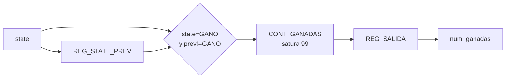

## c) Objetivo del módulo

Contar partidas ganadas desde el último reset y entregar el acumulado al marcador.

## d) Entradas

- `clk`, `rst`.
    - `state[2:0]`.

## e) Salidas

- `num_ganadas[6:0]`: contador binario 0–99.

## f) Explicación de la relación con otros módulos

M06 detecta la entrada a `GANO` (`011`) y envía el acumulado a M01. No depende de la causa
    de las derrotas.

## g) Explicación de funcionamiento

Compara el estado actual contra el estado anterior. Solo incrementa cuando el sistema acaba de
    entrar a `GANO`, evitando sumar una vez por ciclo durante los tres segundos de resultado.

## h) Diseño

El contador satura en 99. Un registro de salida copia el contador interno.

## i) Diagrama esquemático detallado

El diagrama de b) representa también el datapath principal de la implementación. Para módulos con
FSM interna se incluye la secuencia de estados dentro de la explicación de funcionamiento.

---

<!-- Fuente: docs/diseño/modulos/M07_Comparador-letra.md -->

# M07 - Comparador de letra

Archivo RTL de referencia: `src/design/comparador_letra.sv`.

## b) Diagrama modular

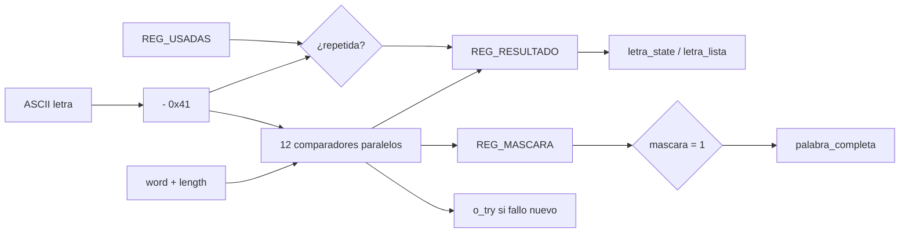

## c) Objetivo del módulo

Evaluar cada letra nueva contra todas las posiciones de la palabra, controlar letras usadas y
    mantener la máscara de posiciones reveladas.

## d) Entradas

- `clk`, `rst`.
    - `i_letra[7:0]`: ASCII A-Z.
    - `i_letra_nueva`: pulso de un ciclo.
    - `i_word[59:0]`: 12 códigos de cinco bits.
    - `i_word_length[3:0]`.
    - `i_state[2:0]`.

## e) Salidas

- `o_letra_state[1:0]`: 00 fallo, 01 acierto, 10 repetida.
    - `o_letra_lista`: estrobo del resultado.
    - `o_palabra_completa`.
    - `o_mascara[11:0]`.
    - `o_try`: pulso únicamente para un fallo nuevo.

## f) Explicación de la relación con otros módulos

La letra proviene de M10. La palabra proviene de M08 a través de `top.sv`. La máscara va a
    M04 y M11; `o_try` va a M12; `o_palabra_completa` va a M13.

## g) Explicación de funcionamiento

Convierte ASCII a código restando `0x41`. Compara en paralelo las 12 posiciones, de modo que
    una sola letra revela todas sus ocurrencias. Un vector `usadas[25:0]` detecta repeticiones.

    Al entrar a `CARGA`, se borra el registro de usadas y la máscara se inicializa con unos en las
    posiciones fuera de la longitud real. Así `mascara=='1` indica palabra completa para cualquier
    longitud.

    La repetición genera `o_letra_lista` para que la PC reciba respuesta, pero no cambia máscara ni
    contador de fallos.

## h) Diseño

`o_try` se produce en el mismo ciclo de `i_letra_nueva` solo si la letra es nueva y no aparece
    en la palabra.

## i) Diagrama esquemático detallado

El diagrama de b) representa también el datapath principal de la implementación. Para módulos con
FSM interna se incluye la secuencia de estados dentro de la explicación de funcionamiento.

## Verificación

`src/sim/tb_comparador_letra.sv` es autoverificable, corre con `make sim TB=comparador_letra` y
reporta 34 pruebas sin fallos. La palabra se fuerza desde el testbench en vez de instanciar
`M08_LFSR`, así cada caso escoge la que le sirve. Comprueba:

- Después del reset la máscara queda en ceros, las salidas de letra quietas y `o_palabra_completa`
  en 0.
- Al pasar por CARGA la máscara arranca con el relleno en unos y las posiciones válidas en cero.
- La A de CASA acierta y revela sus dos posiciones de un solo golpe, que es el requisito de revelar
  todas las ocurrencias a la vez.
- La Z no está, se evalúa como fallo y pulsa `o_try` sin mover la máscara.
- `o_letra_lista` y `o_try` duran un solo ciclo cada uno.
- Una letra repetida sí levanta `o_letra_lista` pero no gasta intento ni toca la máscara, y una que
  ya había fallado antes también cuenta como repetida.
- La palabra se cierra letra por letra y `o_palabra_completa` sube en el mismo ciclo en que la
  última posición se revela.
- Los tres largos de borde, CASA con relleno desde la posición 4, PERRO donde la A no aparece y no
  se confunde con el relleno, y una palabra de 12 letras que no deja relleno.
- Que la partida siguiente vuelva a dejar solo el relleno y limpie `REG_USADAS`, con la A otra vez
  como acierto.

Las dos últimas pruebas son las carreras de prioridad del registro, `rst` contra una letra que
llega en el mismo ciclo, y CARGA contra una letra en el mismo ciclo. Las dos tienen que ganarle a
la letra, si no la máscara y la evaluación quedan diciendo cosas distintas.

`make synth SYNTH_TOP=comparador_letra` pasa sin `Latch inferred` en el log.

---

<!-- Fuente: docs/diseño/modulos/M08_LFSR.md -->

# M08 - LFSR

Archivo RTL de referencia: `src/design/lfsr.sv`.

## b) Diagrama modular

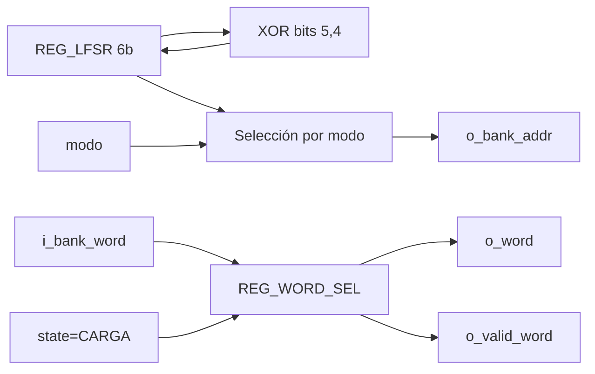

## c) Objetivo del módulo

Generar una secuencia pseudoaleatoria continua, producir la dirección del banco y capturar
    una palabra válida cuando la FSM entra a `CARGA`.

## d) Entradas

- `clk`, `rst`.
    - `i_state[2:0]`.
    - `i_modo`.
    - `i_bank_word[63:0]`: palabra leída de M14.

## e) Salidas

- `o_bank_addr[5:0]`.
    - `o_word[63:0]`.
    - `o_valid_word`.

## f) Explicación de la relación con otros módulos

M08 direcciona M14 y recibe inmediatamente su lectura combinacional. Entrega la palabra
    seleccionada a M07/M04/M11 por medio del `top` y levanta `valid_word` hacia M13.

## g) Explicación de funcionamiento

El LFSR de seis bits corre libre con realimentación `bit5 XOR bit4` y semilla `1`. Al detectar
    entrada a `CARGA`, limpia `reg_cargado`; mientras permanezca en CARGA captura la primera
    dirección válida y sostiene `o_valid_word`.

    En modo fácil la dirección se obtiene del LFSR para el rango del banco. En difícil se usan los
    cinco bits bajos como índice de una tabla 0–31 traducida a direcciones 1–32.

## h) Diseño

Parámetros por defecto: 50 palabras, 32 palabras difíciles, longitud máxima 12 y cinco bits
    por letra. La palabra capturada conserva el formato de 64 bits del banco.

## i) Diagrama esquemático detallado

El diagrama de b) representa también el datapath principal de la implementación. Para módulos con
FSM interna se incluye la secuencia de estados dentro de la explicación de funcionamiento.

---

<!-- Fuente: docs/diseño/modulos/M09_Botones.md -->

# M09 - Botones

Archivo RTL de referencia: `src/design/botones.sv`.

## b) Diagrama modular

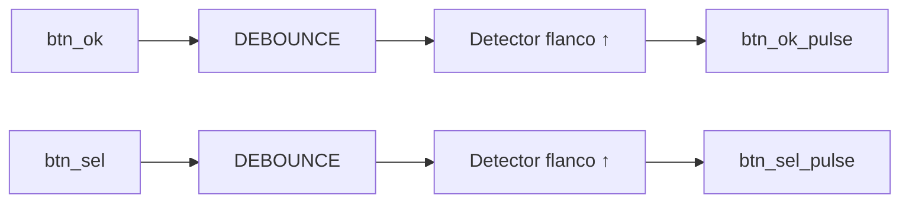

## c) Objetivo del módulo

Filtrar rebotes de `BTN_OK` y `BTN_SEL` y transformar cada pulsación estable en un pulso de
    un solo ciclo.

## d) Entradas

- `clk`, `rst`.
    - `btn_ok`.
    - `btn_sel`.

## e) Salidas

- `btn_ok_pulse`.
    - `btn_sel_pulse`.

## f) Explicación de la relación con otros módulos

Los pulsos se conectan directamente a M13 como `i_ok` e `i_sel`. El filtrado se delega a dos
    instancias de `debounce.sv`.

## g) Explicación de funcionamiento

Cada botón pasa primero por un debounce con `N=21`. Luego se registra el valor filtrado del
    ciclo anterior y se aplica detección de flanco de subida: `db & ~db_prev`.

## h) Diseño

No existe una FSM interna. La separación entre debounce y detector de flanco evita que
    mantener un botón presionado provoque múltiples acciones en la FSM.

## i) Diagrama esquemático detallado

El diagrama de b) representa también el datapath principal de la implementación. Para módulos con
FSM interna se incluye la secuencia de estados dentro de la explicación de funcionamiento.

---

<!-- Fuente: docs/diseño/modulos/M10_Receptor-UART.md -->

# M10 - Receptor UART

## a) Nombre del módulo

M10_Receptor-UART

## b) Diagrama modular

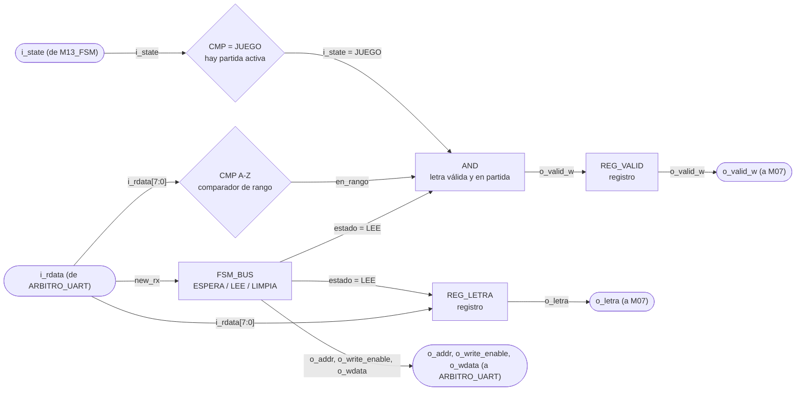

## c) Objetivo del módulo

Recibe los bytes que manda la aplicación del PC, se queda solo con los que son una letra A-Z
durante una partida activa, y los entrega a `M07_Comparador-letra`. Es el punto donde se descarta
todo lo que no debe llegar a la lógica del juego.

---

## d) Entradas

- `clk`, `rst`.
- `i_rdata[WIDTH-1:0]`, lo que devuelve `PERIFERICO_UART` en la dirección que este módulo le está
  poniendo, de ahí saca el bit `new_rx` y el byte recibido. Llega pasando por `ARBITRO_UART`.
- `i_state[2:0]`, estado actual, desde `M13_FSM`. De acá solo le interesa JUEGO.

El dato no le llega por una flecha propia en el diagrama de tercer nivel, entra por el bus de 32
bits que comparte con `M11_Transmisor-UART` a través de `ARBITRO_UART`.

El módulo está parametrizado con `WIDTH = 32`, el ancho del bus. El byte serial es
`BYTE_WIDTH = 8` y va como `localparam` dentro de la lista de parámetros, porque los núcleos del
curso siempre mueven 8 bits y no tiene sentido que dependa del ancho del bus.

---

## e) Salidas

- `o_letra[BYTE_WIDTH-1:0]`, letra recibida en ASCII tal como salió del periférico, hacia
  `M07_Comparador-letra`.
- `o_valid_w`, pulso de un ciclo que habilita esa letra, hacia `M07_Comparador-letra`, donde entra
  como `i_letra_nueva`.
- `o_addr[1:0]`, `o_write_enable`, `o_wdata[WIDTH-1:0]`, petición hacia el bus, que entra por la
  cara del receptor de `ARBITRO_UART`.

`o_letra` y `o_valid_w` salen de registros, así que juntas cumplen el papel de `REG_Letra-in` del
diagrama de tercer nivel y en el top no hace falta un registro aparte.

---

## f) Relación con otros módulos

Del lado del bus habla con `PERIFERICO_UART`. Le sondea el bit `new_rx` del registro de control,
le lee el registro de datos de recepción, y le vuelve a escribir el registro de control para bajar
`new_rx`. Esa limpieza es responsabilidad de quien instancia la interfaz, según el enunciado, y le
toca a este módulo.

Del lado del juego solo le habla a `M07_Comparador-letra`, con el dato y su pulso de habilitación,
que en el diagrama de tercer nivel pasan por `REG_Letra-in`. No le reporta nada a `M13_FSM`. En el
planteamiento anterior este módulo le avisaba a la FSM que había llegado una letra, y ahora ya no
hace falta, porque la FSM no participa en el ciclo de validación de letras.

De `M13_FSM` recibe `i_state`, y lo usa para decidir si la letra pasa o se bota.

El módulo comparte el bus de 32 bits con `M11_Transmisor-UART`, que es quien transmite. Los dos
acceden al mismo periférico, y quien resuelve el choque es `ARBITRO_UART`, que le da prioridad
absoluta a este módulo. Por eso el receptor se escribió como si el bus fuera solo suyo, no tiene
entrada de concesión ni sabe esperar, su FSM avanza pase lo que pase.

Este módulo nunca escribe el registro de datos de transmisión, solo el bit `new_rx` del de
control. Aun así el choque existe, porque escribir ese registro con ceros también bajaría el
`send` del transmisor. Esa parte la arregla el árbitro recomponiendo la palabra, y está explicada
en su documento.

---

## g) Explicación de funcionamiento

El módulo vive sondeando `new_rx`. Mientras esté en cero no hace nada y no toca el bus más allá de
mantener la dirección del registro de control para poder leerlo.

Cuando `new_rx` se levanta, hay un byte esperando. El módulo lo lee del registro de datos de
recepción y le hace dos preguntas. Si el byte cae en el rango A-Z, y si el sistema está en JUEGO.
Solo si las dos son ciertas levanta `o_valid_w` durante un ciclo, que es lo que dispara la
evaluación en `M07_Comparador-letra`.

Pase lo que pase con esas dos preguntas, el módulo limpia `new_rx`. Ese detalle es importante. Si
solo se limpiara cuando la letra se acepta, un byte basura recibido durante la pantalla de
selección de modo dejaría el bit levantado para siempre y el receptor quedaría trabado, sin poder
recibir nunca más. El byte se descarta, pero el periférico se libera igual.

Acá se resuelve lo que el enunciado exige documentar de forma explícita. Una letra que llega
mientras el sistema está en selección de modo o mostrando el resultado final se descarta en este
punto. No llega a `M07_Comparador-letra`, no consume intento y no toca el temporizador. La
aplicación de PC además filtra antes de mandar, pero ese filtro es por comodidad, el que de verdad
manda es este.

---

## h) Diseño

### Validación del byte

El rango de letras mayúsculas en ASCII va de `0x41` a `0x5A`:

| `i_rdata[7:0]`    | En rango A-Z |
| ----------------- | ------------ |
| `< 0x41`          | `0`          |
| `0x41` a `0x5A`   | `1`          |
| `> 0x5A`          | `0`          |

Se comparan los dos extremos con dos comparadores y se juntan con un AND. No se traduce a
minúsculas ni se corrige nada, el enunciado dice que todo byte que no sea una mayúscula A-Z se
descarta sin afectar la partida.

### Decisión de aceptar la letra

Tabla de verdad principal del módulo:

| `new_rx` | `en_rango` | `i_state = JUEGO` | `o_valid_w` | Limpia `new_rx` | Resultado |
| -------- | ---------- | ----------------- | ----------- | --------------- | --------- |
| `0`      | `x`        | `x`               | `0`         | no              | no hay dato |
| `1`      | `0`        | `x`               | `0`         | sí              | byte no alfabético, se bota |
| `1`      | `1`        | `0`               | `0`         | sí              | letra fuera de partida, se bota |
| `1`      | `1`        | `1`               | `1`         | sí              | letra aceptada |

Las tres últimas filas limpian `new_rx`, que es la propiedad que mantiene vivo el receptor pase lo
que pase con el byte.

### Secuencia de acceso al bus

La lectura no es de un solo ciclo, porque hay que poner la dirección, muestrear `i_rdata` y
después escribir de vuelta el registro de control. Se resuelve con una FSM interna de tres
estados, que no tiene nada que ver con la FSM principal del juego:

| Estado actual | Condición    | Estado siguiente | `o_addr`        | `o_write_enable` |
| ------------- | ------------ | ---------------- | --------------- | ---------------- |
| ESPERA        | `new_rx = 0` | ESPERA           | REG_CTRL        | `0`              |
| ESPERA        | `new_rx = 1` | LEE              | REG_CTRL        | `0`              |
| LEE           | siempre      | LIMPIA           | REG_DATOS_RX    | `0`              |
| LIMPIA        | siempre      | ESPERA           | REG_CTRL        | `1`              |

En LEE se muestrea el dato y se evalúa la tabla anterior, y ahí es donde sale el pulso `o_valid_w`.
`o_letra` también se carga en LEE, aunque el byte se vaya a botar. No afecta nada, porque
`M07_Comparador-letra` solo mira la letra en el ciclo en que llega el pulso.

En LIMPIA se escribe el registro de control con `o_wdata` en ceros, o sea `new_rx` en cero. El
`send` del transmisor, que en esa escritura también iría en cero, lo rescata `ARBITRO_UART`.

El mapa de direcciones ya está cerrado y se documenta en `PERIFERICO_UART.md`. Este módulo usa
`2'b10` para el registro de control y `2'b01` para el de datos de recepción, esa segunda la fija
el enunciado. Los dos valores van como `localparam`, no como `parameter`, porque son parte fija
del mapa de registros y ningún testbench necesita moverlos.

### Por qué sondeo y no interrupción

El periférico no ofrece una línea de interrupción, solo el bit `new_rx`. A 115200 baudios un byte
tarda unos 87 µs en llegar completo, y el ciclo de sondeo de esta FSM dura tres ciclos de reloj de
100 MHz, o sea 30 ns. Sobra margen de tres órdenes de magnitud, así que no hay riesgo de perder un
byte por sondear demasiado lento.

---

## i) Diagrama esquemático detallado del diseño

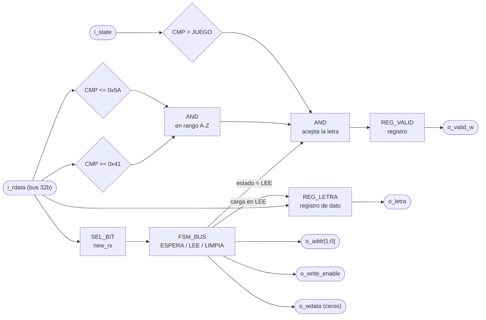

`clk` y `rst` entran a `REG_LETRA`, a `REG_VALID` y a `FSM_BUS` aunque no se dibujen.

---

## j) Diagrama completo de conexiones del diseño

Este módulo no tiene puertos físicos propios. La línea RX de la tarjeta entra al núcleo TX/RX
dentro de `PERIFERICO_UART`, no acá, así que la restricción de pin del puente USB-UART pertenece a
ese periférico y no a este archivo.

Conexiones en `src/design/top.sv`, instancia `u_receptor_uart`:

- `clk`, al reloj global de 100 MHz, pin W5.
- `rst`, a la entrada `rst` del top, el botón central en el pin U18.
- `i_state`, desde `M13_FSM`.
- `i_rdata`, desde `o_rx_rdata` de `ARBITRO_UART`.
- `o_addr`, `o_write_enable`, `o_wdata`, hacia `i_rx_addr`, `i_rx_we` e `i_rx_wdata` de
  `ARBITRO_UART`.
- `o_letra`, `o_valid_w`, hacia `i_letra` e `i_letra_nueva` de `M07_Comparador-letra`.

Igual que en los demás módulos, el diagrama por chips que pide el método no aplica a un diseño que
se sintetiza dentro de una sola FPGA, y esta lista de puertos es el reemplazo propuesto.

---

## Verificación

`src/sim/tb_receptor_uart.sv` es autoverificable, corre con `make sim TB=receptor_uart` y reporta
26 pruebas sin fallos. No instancia `PERIFERICO_UART` entero, instancia el núcleo `uart_rx` de
verdad con `TICKS_X16 = 54` y le agrega alrededor el bit pegajoso `new_rx` que el periférico
tendría que sostener, porque el núcleo solo da un pulso de un ciclo y eso no se puede sondear
desde el bus. Los bytes entran bit a bit por la línea serial con su tiempo real. Comprueba:

- Después del reset la letra y el `o_valid_w` quedan en cero, y el bus queda sondeando el registro
  de control sin escribir.
- Con la línea en reposo se queda sondeando y no entrega ninguna letra.
- Con `new_rx` arriba pasa a leer el registro de datos, la A sale con su `o_valid_w`, y en ese
  mismo ciclo escribe ceros para bajar `new_rx`.
- `o_valid_w` dura un solo ciclo y el byte ya limpiado no se vuelve a entregar.
- Los cuatro bordes del rango A-Z, la Z que pasa, el arroba que queda justo debajo de la A, el
  corchete justo encima de la Z, más una minúscula y un dígito.
- Que después de varios bytes botados siga entregando bien, o sea que la limpieza de `new_rx`
  ocurre igual cuando el byte se descarta.
- Una letra válida en selección de modo y otra mostrando resultado se descartan pero igual limpian
  `new_rx`, y de vuelta en JUEGO la vuelve a aceptar. Esto es lo que el enunciado exige documentar
  y acá queda además comprobado.
- Dos bytes pegados sin un solo ciclo de línea en reposo entre el stop de uno y el start del otro.

El último caso es un `rst` a mitad de un byte. La cola del byte cortado deja bits sueltos en la
línea y el núcleo resincroniza sobre ellos armando un frame falso, así que la prueba verifica que
al pasar ese ruido no quede ninguna letra entregándose, que el bus vuelva a ESPERA, y que el
receptor siga recibiendo bien después.

`make synth SYNTH_TOP=receptor_uart` pasa sin `Latch inferred` en el log.

---

<!-- Fuente: docs/diseño/modulos/M11_Transmisor-UART.md -->

# M11 - Transmisor-UART

## a) Nombre del módulo

M11_Transmisor-UART

## b) Diagrama modular

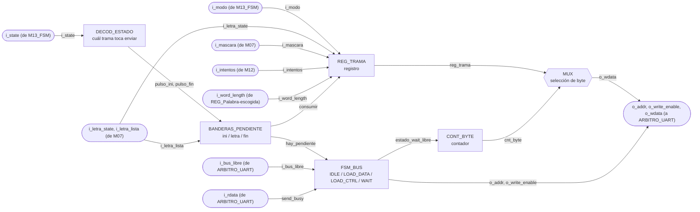

## c) Objetivo del módulo

Ensamblar y transmitir hacia la PC, por UART, las tramas de estado del juego que exige la sección
3.4.4 del enunciado, inicio de partida con modo y longitud, resultado de cada letra con el patrón
actualizado y los intentos, y resultado final con su causa.

Decide solo cuándo transmitir. Al ver que `i_state` entró a JUEGO manda la trama de inicio, con
cada letra evaluada manda la trama de letra, y al entrar a GANO o PERDIO manda la de fin.

La FSM llega a PERDIO tanto por intentos como por tiempo, así que `i_state` solo no alcanza para
la causa. El módulo la saca de `i_intentos` al entrar. Si la cuenta llegó a 6 se perdió por
intentos, y con cualquier otro valor fue el tiempo. Eso es confiable porque `M12_Contador-Intentos`
solo se limpia en CARGA, así que durante PERDIO la cuenta sigue intacta, y coincide con la
prioridad de la FSM, que ante intentos agotados y tiempo en cero en el mismo ciclo escoge intentos.

## d) Entradas

- `clk`, `rst`.
- `i_state[2:0]`, estado actual, desde `M13_FSM`, decide cuál trama toca enviar.
- `i_modo`, modo de la partida, desde `M13_FSM`, viaja en la trama de inicio.
- `i_letra_state[1:0]`, resultado de la última letra, desde `M07_Comparador-letra`. La
  codificación es `00` fallo, `01` acierto, `10` repetida, y el `11` no se usa.
- `i_letra_lista`, estrobo de un ciclo que acompaña a `i_letra_state`, desde
  `M07_Comparador-letra`. Es el que dispara la trama, no el valor de `i_letra_state`, porque dos
  letras seguidas con el mismo resultado no cambian ese bus y sin estrobo la segunda se perdería.
- `i_intentos[2:0]`, fallos acumulados de la partida, desde `M12_Contador-Intentos`. Llega a 6,
  así que 3 bits alcanzan. Viaja en la trama de letra y además decide la causa de una derrota.
- `i_word_length[3:0]`, longitud de la palabra escogida, desde `REG_Palabra-escogida`, que en el
  top es `word[63:60]` de `M08_LFSR`.
- `i_mascara[WORD_MAXLEN-1:0]`, posiciones ya reveladas, desde `M07_Comparador-letra`. Es el
  patrón que el enunciado pide mandar junto con el resultado de la letra.
- `i_rdata[WIDTH-1:0]`, lectura de vuelta del bus, de ahí sondea el bit `send` para saber si el
  periférico sigue ocupado. Llega pasando por `ARBITRO_UART`.
- `i_bus_libre`, desde `ARBITRO_UART`, dice si este ciclo el bus es suyo.

El módulo está parametrizado con `WIDTH = 32`, el ancho del bus, y con `WORD_MAXLEN = 12`, el
mismo valor que usan `M07_Comparador-letra` y el banco de palabras. El byte serial es
`BYTE_WIDTH = 8` fijo, porque los núcleos del curso siempre mueven 8 bits.

## e) Salidas

- `o_write_enable`, `o_addr[1:0]`, `o_wdata[WIDTH-1:0]`, petición hacia el bus, que entra por la cara
  del transmisor de `ARBITRO_UART`.

Todo lo que el módulo tiene que decir viaja empaquetado dentro de `o_wdata`, un byte a la vez.
La etiqueta `modo/letra_state/Resultado/w_word/Intentos` del diagrama de nivel 3 describe ese
contenido, no puertos separados.

## f) Explicación de la relación con otros módulos

Recibe `i_state` y `i_modo` de `M13_FSM`, `i_letra_state`, `i_letra_lista` e `i_mascara` de
`M07_Comparador-letra`, `i_intentos` de `M12_Contador-Intentos` y `i_word_length` de
`REG_Palabra-escogida`. No le devuelve nada a ninguno, es un módulo de salida pura hacia el
periférico, igual que `M04_Mostrar-LCD` lo es hacia el LCD.

Comparte el periférico UART con `M10_Receptor-UART`, y ese reparto lo resuelve `ARBITRO_UART`,
que le da prioridad al receptor. De ahí sale `i_bus_libre`, la única entrada que este módulo tuvo
que agregar para convivir con el otro maestro. Cuando el bus no es suyo, el módulo no avanza y
reintenta el ciclo siguiente.

A diferencia de `M02_Generador-Tono`, que puede perderse un evento sin consecuencias graves
porque un tono que no suena no rompe la partida, acá perder o cortar una trama deja a la PC con
una vista inconsistente del juego. Por eso los eventos que llegan mientras el módulo está
ocupado no se descartan, quedan retenidos en las banderas que se explican en h).

## g) Explicación de funcionamiento

El módulo es una FSM chiquita que traduce un evento de un solo pulso en una ráfaga de
transacciones de bus.

El periférico UART no expone `busy` y `done` como bits separados, como sí hace el LCD. Expone un
único bit `send` que el maestro escribe en 1 para pedir el envío y que el hardware baja solo
cuando el byte ya salió completo. Ese bit sirve entonces de orden y de bandera de ocupado, y el
módulo lo lee de vuelta por `i_rdata` antes de mandar el siguiente byte de la trama.

Para cada byte el módulo hace tres cosas en orden. Lo escribe en el registro de datos de
transmisión, levanta `send` en el registro de control, y espera a leer `send` en cero. Ahí sabe
que el periférico terminó y sigue con el byte siguiente, o vuelve a IDLE si ya mandó la trama
entera.

Tres eventos disparan una trama nueva. La entrada a JUEGO, cada estrobo `i_letra_lista`, y la
entrada a un estado de fin. Como los tres pueden ocurrir mientras el módulo sigue ocupado con
una trama anterior, cada uno levanta su bandera de pendiente y espera turno.

## h) Diseño

### Formato de las tramas

Protocolo binario, un byte de cabecera que identifica el tipo y detrás el contenido:

| Trama | Disparador | Cabecera | Byte 1 | Byte 2 | Byte 3 | Byte 4 | Largo |
|---|---|---|---|---|---|---|---|
| INICIO | entrada a JUEGO | `"I"` (`0x49`) | `{7'b0, modo}` | `{4'b0, word_length}` | | | 3 |
| LETRA | `i_letra_lista` | `"L"` (`0x4C`) | `{6'b0, letra_state}` | `{5'b0, intentos}` | `mascara[7:0]` | `mascara[15:8]` | 5 |
| FIN | entrada a GANO o PERDIO | `"F"` (`0x46`) | `{5'b0, causa}` | | | | 2 |

La causa usa los códigos que la app de PC ya conoce, `011` ganó, `100` perdió por intentos y `101`
perdió por tiempo. El `101` ya no existe como estado de la FSM, solo sobrevive dentro de la trama.

Las cabeceras son caracteres ASCII imprimibles solo para que la trama cruda se pueda leer con un
monitor serial durante la depuración. La app de PC las trata como bytes, no como texto.

La máscara viaja en dos bytes, poco significativo primero, aunque con `WORD_MAXLEN = 12` sobren
cuatro bits. Se hizo así para que el formato no cambie si el banco de palabras crece a 16
caracteres.

Ojo con un detalle de la máscara. `M07_Comparador-letra` arranca las posiciones de relleno en
unos, para que su comparación de palabra completa funcione igual con una palabra de 4 letras que
con una de 12. O sea que los bits por encima de `word_length` llegan en 1 sin que eso signifique
nada. La app de PC solo debe mirar los primeros `word_length` bits, y por eso la trama de inicio
manda la longitud antes que cualquier máscara.

La trama de letra también sale cuando la letra estaba repetida. Es a propósito. El enunciado dice
que una letra repetida se ignora y no gasta intento, pero si la FPGA no contesta nada, la PC se
queda esperando una respuesta que nunca llega y el usuario vuelve a escribir. Se le contesta con
`letra_state = 10` y el mismo patrón de antes, así la PC sabe que el byte llegó y que no cambió
nada.

### Direcciones del periférico

- Registro de datos de transmisión en `2'b00`, la fija el enunciado.
- Registro de control en `2'b10`, la escogió el equipo y está documentada en
  `PERIFERICO_UART.md`.

Van como `localparam`, no como `parameter`. No son constantes que un testbench necesite ajustar
para simular más rápido, son parte fija del mapa de registros.

Este módulo escribe el control con `32'h1`, o sea con `new_rx` en cero, lo que borraría un byte
recibido esperando. Quien lo evita es `ARBITRO_UART`, que recompone la palabra antes de que
llegue al periférico. El módulo no tiene que saber nada de eso.

### Detección de disparo y banderas pendientes

La entrada a JUEGO y la entrada a un estado de fin son niveles, y hay que convertirlos en pulsos
de un ciclo con un registro de retardo:

```
dec_juego  = (i_state == JUEGO)
dec_fin    = (i_state == GANO) | (i_state == PERDIO)
pulso_ini  = dec_juego AND (NOT dec_juego_prev)
pulso_fin  = dec_fin   AND (NOT dec_fin_prev)
```

`i_letra_lista` ya viene como pulso de un ciclo desde M07, así que no necesita detector.

Esos tres pulsos no cargan la trama de una vez, primero levantan una bandera que se mantiene alta
hasta que la FSM la atienda:

| Bandera | Se levanta con | Valores que captura | Se limpia cuando |
|---|---|---|---|
| `pend_ini` | `pulso_ini` | ninguno, `i_modo` e `i_word_length` se leen al cargar | la FSM la consume |
| `pend_letra` | `i_letra_lista` | `i_letra_state`, `i_intentos`, `i_mascara` | la FSM la consume |
| `pend_fin` | `pulso_fin` | la causa, `GANO` si ganó y si no `100` o `101` según `i_intentos` | la FSM la consume |

Consumir está atado a la transición y no solo al estado. Una bandera se limpia únicamente en el
ciclo en que la FSM de verdad arranca la trama, o sea estando en IDLE, con pendiente, y con el
bus libre. Si se limpiara solo por estar en IDLE, una pendiente que aparece mientras el árbitro
tiene el bus ocupado se borraría sin haberse mandado nunca.

Cuando el set y el clear coinciden en el mismo ciclo, gana el set. Eso pasa si llega una letra
nueva justo cuando se está consumiendo la anterior, y con la prioridad al revés el evento nuevo
se perdería.

Si un segundo evento del mismo tipo llega mientras el primero sigue sin atender, el valor
capturado se sobreescribe con el más reciente y el viejo se pierde. Es una limitación aceptada.
Una trama de 5 bytes a 115200 baudios tarda 434 µs, y ninguna persona escribe dos letras con
menos de medio milisegundo de diferencia.

En IDLE se decide cuál pendiente atender, con la misma prioridad que ya usa `M02_Generador-Tono`:

| `pend_fin` | `pend_letra` | `pend_ini` | Trama que se carga |
|---|---|---|---|
| `1` | `x` | `x` | FIN |
| `0` | `1` | `x` | LETRA |
| `0` | `0` | `1` | INICIO |
| `0` | `0` | `0` | ninguna, se queda en IDLE |

El fin de partida va primero a propósito. Si el jugador completa la palabra con la última letra,
quedan pendientes la trama de letra y la de fin al mismo tiempo, y a la PC le sirve más saber
antes que la partida terminó.

### Máquina de estados

Cuatro estados, codificados `IDLE=00`, `LOAD_DATA=01`, `LOAD_CTRL=10`, `WAIT=11`:

| Estado actual | `i_bus_libre` | hay pendiente | `send` leído | `CNT_BYTE = LEN-1` | Estado siguiente |
|---|---|---|---|---|---|
| IDLE | `x` | `0` | `x` | `x` | IDLE |
| IDLE | `0` | `1` | `x` | `x` | IDLE, espera el bus |
| IDLE | `1` | `1` | `x` | `x` | LOAD_DATA, carga la trama y pone `CNT_BYTE = 0` |
| LOAD_DATA | `0` | `x` | `x` | `x` | LOAD_DATA, reintenta la escritura |
| LOAD_DATA | `1` | `x` | `x` | `x` | LOAD_CTRL |
| LOAD_CTRL | `0` | `x` | `x` | `x` | LOAD_CTRL, reintenta la escritura |
| LOAD_CTRL | `1` | `x` | `x` | `x` | WAIT |
| WAIT | `0` | `x` | `x` | `x` | WAIT |
| WAIT | `1` | `x` | `1` ocupado | `x` | WAIT |
| WAIT | `1` | `x` | `0` libre | `0` | LOAD_DATA, `CNT_BYTE + 1` |
| WAIT | `1` | `x` | `0` libre | `1` | IDLE |

Salidas por estado, que es Moore salvo por el byte que sale del contador:

| Estado | `o_addr` | `o_write_enable` | `o_wdata` |
|---|---|---|---|
| IDLE | control | `0` | ceros |
| LOAD_DATA | datos TX | `1` | `{24'b0, byte_actual}` |
| LOAD_CTRL | control | `1` | `32'h1`, o sea `send` |
| WAIT | control | `0` | ceros |

En IDLE y en WAIT la dirección queda apuntando al control, que es lo que el módulo quiere leer
en esos estados. Para el árbitro eso no cuenta como pedir el bus, así que los dos maestros pueden
sondear el control a la vez sin estorbarse.

El sondeo de `send` solo tiene sentido con el bus concedido. Cuando el árbitro se lo corta, el
`i_rdata` llega en ceros, y un cero en el bit `send` significaría que el periférico está libre
cuando en realidad nadie preguntó. Por eso la condición de salida de WAIT lleva `i_bus_libre`
además del bit, y no solo el bit.

### Latches

El bloque de salidas es un `always_comb` con valores por defecto asignados antes del `case`, así
que ninguna combinación queda sin cubrir. `make synth SYNTH_TOP=transmisor_uart` pasa sin
`Latch inferred` en el log.

## i) Diagrama esquemático detallado (por compuertas lógicas)

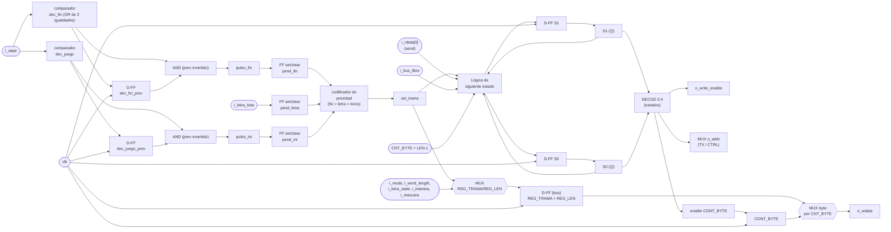

`clk` y `rst` entran a todo registro y contador del módulo aunque no se dibujen en cada elemento.
`rst` fuerza el estado a IDLE, limpia las tres banderas `pend_*` y pone `o_write_enable` en cero,
así que después de un reset el módulo queda mudo hasta el siguiente evento.

## j) Diagrama completo de conexiones del diseño

Este módulo no tiene puertos físicos propios. La línea TX de la tarjeta sale del núcleo que vive
dentro de `PERIFERICO_UART`, así que la restricción de pin pertenece a ese periférico.

Conexiones en `src/design/top.sv`, instancia `u_transmisor_uart`:

- `clk`, al reloj global de 100 MHz, pin W5.
- `rst`, a la entrada `rst` del top, el botón central en el pin U18.
- `i_state`, `i_modo`, desde `M13_FSM`.
- `i_letra_state`, `i_letra_lista`, `i_mascara`, desde `M07_Comparador-letra`.
- `i_intentos`, desde `o_intentos` de `M12_Contador-Intentos`.
- `i_word_length`, desde `word[63:60]`, la palabra que entrega `M08_LFSR`.
- `i_rdata`, `i_bus_libre`, desde `o_tx_rdata` y `o_tx_bus_libre` de `ARBITRO_UART`.
- `o_addr`, `o_write_enable`, `o_wdata`, hacia `i_tx_addr`, `i_tx_we` e `i_tx_wdata` de
  `ARBITRO_UART`.

Igual que en los demás módulos, el diagrama por chips que pide el método no aplica a un diseño que
se sintetiza dentro de una sola FPGA, y esta lista de puertos es el reemplazo propuesto.

---

## Verificación

`src/sim/tb_transmisor_uart.sv` es autoverificable, corre con `make sim TB=transmisor_uart` y
reporta 28 pruebas sin fallos. No instancia `PERIFERICO_UART`, lo modela con un `send` que se
sostiene 20 ciclos y se baja solo, que es el handshake que el módulo sondea. Cada trama se captura
byte a byte del bus y se compara entera contra la esperada. Comprueba:

- Después del reset el módulo no escribe nada, y en selección de modo tampoco.
- La trama de inicio son tres bytes, la `I`, el modo y la longitud de la palabra.
- La trama de letra son cinco bytes, la `L`, el resultado, los intentos acumulados, y la máscara
  con el byte bajo primero.
- Un fallo también manda trama, con los intentos ya actualizados, y una repetida también, que es lo
  que evita que la PC se quede esperando respuesta.
- La trama de fin son dos bytes, la `F` y la causa.
- Las tres causas de fin. Con seis intentos la causa son los intentos, con cinco es el tiempo
  aunque todavía quedara uno, y sin ningún fallo también sale tiempo.
- Que la causa se congele al entrar a PERDIO y no cambie después.

Los dos últimos casos son los de las banderas pendientes, que es la parte del módulo que más fácil
se rompe. Uno manda una letra mientras la trama de inicio todavía está saliendo y verifica que el
inicio salga entero y que la letra arranque después, sin perderse. El otro deja letra y fin
pendientes en el mismo ciclo y verifica el orden, primero el fin porque a la PC le sirve más saber
que la partida terminó, y la letra igual sale después en vez de descartarse.

`make synth SYNTH_TOP=transmisor_uart` pasa sin `Latch inferred` en el log.

---

<!-- Fuente: docs/diseño/modulos/M12_Contador-Intentos.md -->

# M12 - Contador de intentos

Archivo RTL de referencia: `src/design/contador_intentos.sv`.

## b) Diagrama modular

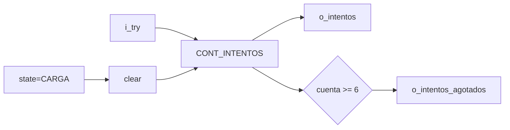

## c) Objetivo del módulo

Contar fallos nuevos de la partida y detectar la sexta letra incorrecta.

## d) Entradas

- `clk`, `rst`.
    - `i_try`: pulso de fallo desde M07.
    - `i_state[2:0]`.

## e) Salidas

- `o_intentos[2:0]`: fallos acumulados.
    - `o_intentos_agotados`.

## f) Explicación de la relación con otros módulos

M07 genera `i_try` únicamente para fallos nuevos. M12 envía el valor acumulado a M04/M11 y
    la bandera de seis fallos a M13.

## g) Explicación de funcionamiento

La cuenta se limpia con reset o durante `CARGA`, incrementa con `i_try` y satura en
    `MAX_INTENTOS=6`.

## h) Diseño

`o_intentos_agotados` usa comparación `>=6` como protección adicional aunque el contador ya
    está saturado.

## i) Diagrama esquemático detallado

El diagrama de b) representa también el datapath principal de la implementación. Para módulos con
FSM interna se incluye la secuencia de estados dentro de la explicación de funcionamiento.

---

<!-- Fuente: docs/diseño/modulos/M13_FSM.md -->

# M13 - FSM principal

Archivo RTL de referencia: `src/design/fsm.sv`.

## b) Diagrama modular

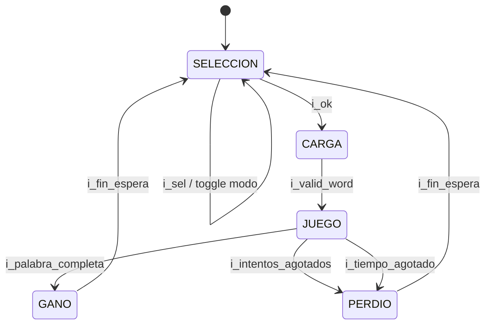

## c) Objetivo del módulo

Mantener el estado global de la partida y el modo seleccionado. La FSM coordina por estado,
    no por una colección de pulsos individuales hacia cada módulo.

## d) Entradas

- `clk`, `rst`.
    - `i_sel`, `i_ok`.
    - `i_valid_word`.
    - `i_palabra_completa`.
    - `i_intentos_agotados`.
    - `i_tiempo_agotado`.
    - `i_fin_espera`.

## e) Salidas

- `o_state[2:0]`.
    - `o_modo`: 0 fácil, 1 difícil.

## f) Explicación de la relación con otros módulos

M09 entrega botones; M08 indica palabra lista; M07 indica palabra completa; M12 indica sexto
    fallo; M03 indica tiempo agotado y fin de espera. Los consumidores de `state` decodifican de
    forma local lo que deben hacer.

## g) Explicación de funcionamiento

Transiciones:

    - SELECCION (`000`) -> CARGA (`001`) con `i_ok`.
    - CARGA -> JUEGO (`010`) con `i_valid_word`.
    - JUEGO -> GANO (`011`) con `i_palabra_completa`.
    - JUEGO -> PERDIO (`100`) con `i_intentos_agotados` o `i_tiempo_agotado`.
    - GANO/PERDIO -> SELECCION con `i_fin_espera`.

    En JUEGO la prioridad es palabra completa, luego intentos agotados y finalmente tiempo agotado.

    `i_sel` no cambia el estado; conmuta `modo` solo mientras el estado actual es SELECCION.

## h) Diseño

El registro de estado usa tres bits aunque solo cinco códigos son válidos. `101`, `110` y
    `111` caen a SELECCION por la rama `default`.

    La FSM no conserva la causa de derrota. M11 determina la causa para el protocolo UART a partir
    del contador de intentos al entrar a PERDIO.

## i) Diagrama esquemático detallado

El diagrama de b) representa también el datapath principal de la implementación. Para módulos con
FSM interna se incluye la secuencia de estados dentro de la explicación de funcionamiento.

---

<!-- Fuente: docs/diseño/modulos/M14_banco-palabras.md -->

# M14 - Banco de palabras

Archivo RTL de referencia: `src/design/banco_palabras.sv`.

## b) Diagrama modular

```mermaid
flowchart LR
        ADDR["i_bank_addr"] --> ROM["ROM ASCII + longitud"]
        ROM --> PACK["ASCII→5 bits<br/>empaquetado 64b"]
        PACK --> OUT["o_bank_word[63:0]"]
```

## c) Objetivo del módulo

Almacenar 50 palabras constantes y entregar de forma combinacional la palabra asociada a la
    dirección solicitada por M08, en el formato compacto usado por el juego.

## d) Entradas

- `i_bank_addr[5:0]`: dirección 1–50.

## e) Salidas

- `o_bank_word[63:0]`: `{longitud[3:0], letra12[4:0], ..., letra1[4:0]}`.

## f) Explicación de la relación con otros módulos

M08 genera la dirección y consume la palabra empacada. Las direcciones 1–32 contienen
    palabras de seis o más letras y sirven para ambos modos. Las direcciones 33–50 contienen
    palabras de cuatro o cinco letras y se usan en fácil.

## g) Explicación de funcionamiento

La ROM conserva las palabras como ASCII y su longitud. Una función convierte cada carácter
    `A..Z` a código 0..25 y otra empaqueta el resultado. `rom_word` se genera con índice constante
    para que síntesis pueda plegar la conversión a constantes.

## h) Diseño

Parámetros por defecto: `N_PALABRAS=50`, `WORD_MAXLEN=12`, `LETRA_WIDTH=5`.

    Rango difícil: direcciones 1–32.
    Rango adicional de fácil: 33–50.

## i) Diagrama esquemático detallado

El diagrama de b) representa también el datapath principal de la implementación. Para módulos con
FSM interna se incluye la secuencia de estados dentro de la explicación de funcionamiento.

---

<!-- Fuente: docs/diseño/modulos/ARBITRO_UART.md -->

# ARBITRO_UART

## a) Nombre del módulo

ARBITRO_UART

## b) Diagrama modular

```mermaid
flowchart LR
    IN_RX(["i_rx_addr, i_rx_we, i_rx_wdata (de M10)"]) --> PRIO{"PRIORIDAD<br/>receptor primero"}
    IN_TX(["i_tx_addr, i_tx_we, i_tx_wdata (de M11)"]) --> PRIO
    PRIO --> MUX_BUS{{"MUX de petición"}}
    IN_RD(["i_rdata (de PERIFERICO_UART)"]) --> RECOMP["RECOMP_CTRL<br/>rescata send y new_rx"]
    MUX_BUS --> RECOMP
    RECOMP --> OUT_BUS(["o_addr, o_we, o_wdata (a PERIFERICO_UART)"])
    IN_RD --> GATE["COMPUERTAS de lectura<br/>ceros al que no tiene el bus"]
    PRIO --> GATE
    GATE --> OUT_RXD(["o_rx_rdata (a M10)"])
    GATE --> OUT_TXD(["o_tx_rdata, o_tx_bus_libre (a M11)"])
```

## c) Objetivo del módulo

Multiplexa el bus de 32 bits entre los dos maestros que quieren hablarle a `PERIFERICO_UART`,
`M10_Receptor-UART` y `M11_Transmisor-UART`. El periférico tiene un solo puerto y el enunciado
supone un único bloque instanciándolo, así que partir el UART en receptor y transmisor
independientes obliga a poner algo en el medio.

Aparte del multiplexado hace un segundo trabajo que no es obvio, recompone las escrituras al
registro de control para que un maestro no le borre el bit al otro.

---

## d) Entradas

- `i_rx_addr[1:0]`, `i_rx_we`, `i_rx_wdata[WIDTH-1:0]`, petición de `M10_Receptor-UART`.
- `i_tx_addr[1:0]`, `i_tx_we`, `i_tx_wdata[WIDTH-1:0]`, petición de `M11_Transmisor-UART`.
- `i_rdata[WIDTH-1:0]`, lo que devuelve `PERIFERICO_UART` en la dirección que se le está poniendo.

No tiene `clk` ni `rst`. Es combinacional puro, no guarda estado. Está parametrizado con
`WIDTH = 32`, el ancho del bus.

---

## e) Salidas

- `o_addr[1:0]`, `o_we`, `o_wdata[WIDTH-1:0]`, petición ganadora, hacia `PERIFERICO_UART`.
- `o_rx_rdata[WIDTH-1:0]`, lo que ve `M10_Receptor-UART` de vuelta.
- `o_tx_rdata[WIDTH-1:0]`, lo que ve `M11_Transmisor-UART` de vuelta.
- `o_tx_bus_libre`, le avisa a `M11_Transmisor-UART` que este ciclo el bus es suyo.

---

## f) Relación con otros módulos

Se sienta entre los dos maestros y el periférico, y los tres lo ven como si fueran ellos los que
hablan directo. `M10_Receptor-UART` ni siquiera sabe que existe, porque nunca pierde el bus y su
lectura siempre es la de verdad. `M11_Transmisor-UART` sí lo sabe, y para eso tiene la entrada
`i_bus_libre`, que es la única señal que este módulo le agregó al diseño original de M11.

No le reporta nada a `M13_FSM` ni participa en la lógica del juego. Es infraestructura de bus.

En el diagrama de tercer nivel va dentro de `CONTROL_JUEGO`, entre M10/M11 y `PERIFERICO_UART`.
La primera versión de ese diagrama no lo tenía porque se dibujó cuando el UART todavía se pensaba
como un solo maestro.

---

## g) Explicación de funcionamiento

En cada ciclo el árbitro mira si alguno de los dos maestros está pidiendo el bus de verdad. Pedir
el bus significa querer una dirección que no sea la del control, o querer escribir. Sondear el
registro de control sin escribir no cuenta, porque los dos pueden leerlo a la vez sin estorbarse,
que es justo lo que hacen la mayor parte del tiempo.

Si el receptor pide, gana el receptor. Siempre, sin excepción y sin turnos. Si no pide y el
transmisor sí, gana el transmisor. Si no pide ninguno, el árbitro deja la dirección apuntando al
control, que es lo que los dos quieren leer cuando están sondeando.

Al que pierde no se le devuelve el `rdata` del ganador, se le devuelven ceros. Eso es importante
y es la parte que más fácil se hace mal.

---

## h) Diseño

### Tabla de decisión

| `rx_pide` | `tx_pide` | Quién maneja `o_addr`/`o_we`/`o_wdata` | `o_rx_rdata` | `o_tx_rdata` | `o_tx_bus_libre` |
| --------- | --------- | -------------------------------------- | ------------ | ------------ | ------------- |
| `1`       | `x`       | receptor                                | `i_rdata`    | ceros        | `0`           |
| `0`       | `1`       | transmisor                              | ceros        | `i_rdata`    | `1`           |
| `0`       | `0`       | nadie, `o_addr` al control y `o_we = 0` | `i_rdata`    | `i_rdata`    | `1`           |

Donde `rx_pide = (i_rx_addr != CONTROL) OR i_rx_we` y lo mismo para el transmisor.

La fila del medio explica por qué al perdedor se le mandan ceros. El receptor pasa la vida
leyendo el registro de control y mirando el bit 1 para ver si hay byte nuevo. Si mientras tanto el
transmisor tiene el bus puesto en el registro de datos de transmisión, el receptor estaría mirando
el bit 1 de un byte cualquiera de una trama saliente y creería que le llegó una letra. Con ceros
ve `new_rx = 0`, que es la respuesta segura. Del otro lado pasa lo mismo con `send`, el
transmisor leería un `send` falso y creería que el periférico sigue ocupado, o peor, que ya
terminó.

En la última fila los dos pueden leer el mismo `i_rdata` sin problema, porque la dirección está
en el control y eso es exactamente lo que los dos querían leer.

### Recomposición de la escritura al control

Este es el problema que motivó el módulo. El registro de control tiene un bit de cada maestro,
`send` del transmisor en el bit 0 y `new_rx` del receptor en el bit 1, y el enunciado define
`new_rx` como RW, o sea que una escritura lo deja en lo que diga el bit. No es W1C, así que
escribir cero lo borra.

El receptor escribe `32'h0` para bajar `new_rx`, y de paso pone `send` en cero, lo que aborta una
transmisión en curso. El transmisor escribe `32'h1` para levantar `send`, y de paso pone `new_rx`
en cero, o sea que cada trama que manda la FPGA se traga un byte recibido que estuviera
esperando. Con un juego donde la PC escribe letras mientras la FPGA responde, los dos casos
pasan seguido.

Se propuso definir `new_rx` como W1C, pero eso contradice la línea 252 del enunciado, así
que se descartó. Lo que hace el árbitro es rearmar la palabra que se escribe, tomando el bit del
maestro que ganó y rescatando el del otro de la lectura viva del periférico:

| Bit | Si gana el receptor      | Si gana el transmisor   |
| --- | ------------------------ | ----------------------- |
| 0, `send`   | `i_rdata[0]`, el valor que ya tenía | `i_tx_wdata[0]`, lo que pide el transmisor |
| 1, `new_rx` | `i_rx_wdata[1]`, lo que pide el receptor | `i_rdata[1]`, el valor que ya tenía |

Esto funciona sin carrera porque el `rdata_o` del periférico es combinacional respecto a `addr_i`
y no depende de `wdata_i`. En el mismo ciclo en que se está componiendo la escritura, la lectura
que llega ya es la del registro de control, así que el bit rescatado es el valor actual y no uno
viejo. Si el periférico registrara la lectura, esta técnica no serviría y habría que meter un
ciclo de espera.

La recomposición solo aplica cuando la dirección ganadora es la del control. Para los dos
registros de datos el `wdata` pasa tal cual.

### Por qué prioridad fija y no turnos

El receptor no sabe esperar. Su FSM avanza pase lo que pase, y si pierde el bus en el ciclo en
que iba a leer el dato, lee cualquier cosa. Hacerlo capaz de esperar significaba agregarle una
entrada y condicionar sus tres transiciones.

El transmisor sí sabe esperar, ya venía con un estado `WAIT` y con banderas `pendiente` para no
perder eventos que lleguen mientras está ocupado. Agregarle `i_bus_libre` fue barato, solo
condicionar las transiciones que ya existían.

El costo teórico de la prioridad fija es que el transmisor se muera de hambre, y en este sistema
no puede pasar. El receptor toma el bus dos ciclos por cada byte que le llega, y a 115200 baudios
un byte tarda 8680 ciclos de reloj. Aunque la PC mandara letras de forma continua, el receptor
ocuparía el bus el 0.02% del tiempo. La probabilidad de que el transmisor pierda dos ciclos
seguidos es despreciable, y aunque los perdiera, reintenta el ciclo siguiente sin perder nada.

### Latches

Todo el módulo es `always_comb` y `assign`. El `always_comb` asigna las tres salidas en las tres
ramas del if, sin caminos sin cubrir. `make synth SYNTH_TOP=arbitro_uart` pasa sin
`Latch inferred` en el log.

---

## i) Diagrama esquemático detallado del diseño

```mermaid
flowchart LR
    RXA(["i_rx_addr, i_rx_we"]) --> CMP_RX{"CMP<br/>rx_pide"}
    TXA(["i_tx_addr, i_tx_we"]) --> CMP_TX{"CMP<br/>tx_pide"}

    CMP_RX --> MUX_BUS{{"MUX de peticion<br/>rx / tx / reposo"}}
    CMP_TX --> MUX_BUS
    RXW(["i_rx_wdata"]) --> MUX_BUS
    TXW(["i_tx_wdata"]) --> MUX_BUS

    CMP_RX --> COMP["RECOMP_CTRL<br/>arma send y new_rx"]
    RXW --> COMP
    TXW --> COMP
    RD(["i_rdata (del periferico)"]) --> COMP

    COMP --> MUX_WD{{"MUX de wdata<br/>control / datos"}}
    MUX_BUS --> MUX_WD
    MUX_WD --> OUT_WD(["o_wdata"])
    MUX_BUS --> OUT_ADDR(["o_addr"])
    MUX_BUS --> OUT_WE(["o_we"])

    CMP_RX --> GATE_RX["AND<br/>rdata al receptor"]
    CMP_TX --> GATE_RX
    RD --> GATE_RX
    GATE_RX --> OUT_RXD(["o_rx_rdata"])

    CMP_RX --> GATE_TX["AND<br/>rdata al transmisor"]
    RD --> GATE_TX
    GATE_TX --> OUT_TXD(["o_tx_rdata"])

    CMP_RX --> OUT_LIBRE(["o_tx_bus_libre"])
```

---

## j) Diagrama completo de conexiones del diseño

No tiene puertos físicos, ni reloj, ni reset. Vive entero dentro de `CONTROL_JUEGO`.

Conexiones en `src/design/top.sv`, instancia `u_arbitro_uart`:

- `i_rx_addr`, `i_rx_we`, `i_rx_wdata`, desde `M10_Receptor-UART`.
- `o_rx_rdata`, hacia `M10_Receptor-UART`.
- `i_tx_addr`, `i_tx_we`, `i_tx_wdata`, desde `M11_Transmisor-UART`.
- `o_tx_rdata` y `o_tx_bus_libre`, hacia `M11_Transmisor-UART`.
- `o_addr`, `o_we`, `o_wdata`, hacia `PERIFERICO_UART`.
- `i_rdata`, desde `PERIFERICO_UART`.

Igual que en los demás módulos, el diagrama por chips que pide el método no aplica a un diseño
que se sintetiza dentro de una sola FPGA, y esta lista de puertos es el reemplazo propuesto.

---

<!-- Fuente: docs/diseño/modulos/PERIFERICO_UART.md -->

# PERIFERICO_UART

## a) Nombre del módulo

PERIFERICO_UART

## b) Diagrama modular

```mermaid
flowchart LR
    IN_BUS(["write_enable_i, addr_i, wdata_i (de ARBITRO_UART)"]) --> REGS["REG_DATOS_TX / REG_DATOS_RX / REG_CTRL<br/>send(0,WC) new_rx(1,RW)"]
    REGS --> NUC_TX["uart_tx<br/>115200 baud"]
    NUC_TX -->|o_listo| REGS
    IN_RX(["rx_i (pin B18)"]) --> NUC_RX["uart_rx<br/>115200 baud"]
    NUC_RX -->|"o_dato, o_dato_listo"| REGS
    NUC_TX --> OUT_TX(["tx_o (pin A18)"])
    REGS --> OUT_RD(["rdata_o (a ARBITRO_UART)"])
```

## c) Objetivo del módulo

Envuelve los dos núcleos serie que da el curso (`UART_tx.vhd` y `UART_rx.vhd`, portados a
SystemVerilog) en la interfaz estándar de periférico de 32 bits que fija la sección 3.4.3 del
enunciado. Expone tres registros y es el único bloque del diseño que toca las líneas físicas del
puente USB-UART de la tarjeta.

No sabe nada del juego. No conoce letras, ni estados, ni tramas. Mueve bytes en las dos
direcciones y levanta banderas para que alguien más las lea.

---

## d) Entradas

- `clk_i`, `rst_i`.
- `write_enable_i`, habilitación de escritura del bus, desde `ARBITRO_UART`.
- `addr_i[1:0]`, dirección del registro, desde `ARBITRO_UART`.
- `wdata_i[WIDTH-1:0]`, dato a escribir, desde `ARBITRO_UART`.
- `rx_i`, línea serial cruda, desde el pin B18 de la Basys 3.

Los puertos del bus llevan sufijo `_i`/`_o` en vez del prefijo `i_`/`o_` que usa el resto del
repo, porque la sección 3.4.3 los nombra así y la interfaz es de cumplimiento obligatorio.

El módulo está parametrizado con `WIDTH = 32`, `TICKS_BIT = 868` y `TICKS_X16 = 54`. Los dos
últimos se le pasan tal cual a los núcleos, que tienen los mismos parámetros, y es sobre los
núcleos donde `tb_uart_tx` los reescala a 160 y 10 para que la simulación no tarde una eternidad.

---

## e) Salidas

- `rdata_o[WIDTH-1:0]`, contenido del registro apuntado por `addr_i`, hacia `ARBITRO_UART`.
- `tx_o`, línea serial hacia el pin A18 de la Basys 3.

---

## f) Relación con otros módulos

Hacia adentro del sistema habla con un solo bloque, `ARBITRO_UART`. Ese es el punto importante del
diseño. El enunciado habla de "el bloque que instancia la interfaz" en singular, y acá hay dos
módulos que la quieren usar, `M10_Receptor-UART` para leer y `M11_Transmisor-UART` para escribir.
El periférico no resuelve ese conflicto, lo resuelve el árbitro, y por eso el periférico ve un
único maestro y se puede diseñar como si fuera un puerto simple.

Hacia afuera habla con la PC. `rx_i` y `tx_o` salen directo a los pines del puente USB-UART, que
es el mismo cable con el que se programa la tarjeta, así que no hace falta adaptador externo.

Los dos núcleos que instancia adentro, `uart_tx` y `uart_rx`, son suyos y de nadie más. Ningún
otro módulo del diseño los toca.

---

## g) Explicación de funcionamiento

El periférico es un banco de tres registros con dos máquinas serie colgando.

Para transmitir, el maestro escribe el byte en el registro de datos de transmisión y después
levanta el bit `send` del registro de control. El periférico sostiene ese bit mientras el núcleo
suelta el byte por la línea, y lo baja solo cuando el núcleo avisa que terminó. Ese bit hace dos
trabajos a la vez, es la orden de arranque y es la bandera de ocupado que el maestro sondea para
saber cuándo puede mandar el siguiente byte. El enunciado lo define como WC, o sea que lo escribe
el maestro y lo limpia el hardware.

Para recibir, el núcleo avisa con un pulso de un ciclo que hay un byte nuevo. El periférico lo
guarda en el registro de datos de recepción y levanta `new_rx`. Ese bit se queda alto hasta que
alguien lo escriba en cero, y limpiarlo es responsabilidad del maestro, tal como pide el
enunciado. `new_rx` es RW, no W1C, y esa diferencia es la que obliga a tener árbitro.

---

## h) Diseño

### Mapa de registros

El enunciado fija las dos direcciones de datos y deja la del control a criterio del equipo:

- `2'b00`, registro de datos de transmisión. Bits `[7:0]` son el byte a enviar, `[31:8]` son
  reservados y se leen en cero.
- `2'b01`, registro de datos de recepción. Bits `[7:0]` son el último byte recibido, `[31:8]` son
  reservados y se leen en cero. El enunciado lo declara de escritura igual que el de transmisión,
  así que se implementa escribible aunque en la práctica solo lo escribe un testbench.
- `2'b10`, registro de control. Bit 0 es `send` (WC), bit 1 es `new_rx` (RW), y los bits `[31:2]`
  son reservados, se leen en cero y las escrituras sobre ellos se ignoran.
- `2'b11`, sin asignar. Las lecturas devuelven ceros y las escrituras no tienen efecto. Queda
  libre por si en el futuro hace falta un registro de estado de errores de trama.

La dirección del control se escogió `2'b10` y no `2'b11` para dejar el patrón de bits más alto
como el hueco reconocible, y para que las dos direcciones de datos queden contiguas.

### El bit send

| Condición                                    | `send'` |
| -------------------------------------------- | ------- |
| `rst_i`                                       | `0`     |
| escritura al control con `wdata_i[0] = 1`     | `1`     |
| `o_listo` del núcleo de transmisión           | `0`     |
| resto                                         | sin cambio |

El orden de prioridad importa. La escritura va antes que la bajada automática, porque si el
maestro pide un envío en el mismo ciclo en que el núcleo termina el anterior, lo que se quiere es
que el envío nuevo gane.

Se baja `send` en cuanto el núcleo avisa con `o_listo`, y esa es la única opción segura. El
núcleo vuelve a mirar la orden de arranque un bit entero después de terminar el byte, así que
bajar `send` ahí deja todo ese margen. Si el bit se sostuviera más tiempo, el núcleo lo leería
otra vez y el mismo byte saldría dos veces.

### El bit new_rx y su carrera

| Condición                                         | `new_rx'` | `reg_rx'` |
| -------------------------------------------------- | --------- | --------- |
| `rst_i`                                            | `0`       | `0x00`    |
| `o_dato_listo` del núcleo de recepción             | `1`       | dato del núcleo |
| escritura al control                               | `wdata_i[1]` | sin cambio |
| escritura al registro de datos de recepción        | sin cambio | `wdata_i[7:0]` |
| resto                                              | sin cambio | sin cambio |

El byte que llega le gana a la escritura del mismo ciclo. Sin esa prioridad existe un caso donde
el maestro limpia `new_rx` justo en el ciclo en que entra un byte nuevo, y ese byte se pierde en
silencio con el bit ya en cero. La ventana es de un ciclo de 10 ns cada 87 µs, o sea rarísima,
que es exactamente el tipo de bug que aparece una vez en la demostración y nunca en simulación si
uno no lo busca a propósito.

### Los dos núcleos y su baudaje

Los núcleos son transcripción de los `.vhd` del curso, misma máquina de estados y mismos tiempos,
con los nombres traducidos al estilo del repo. Lo único que cambió son los genéricos, porque los
originales venían calculados para un reloj de 16 MHz:

- `uart_tx` cuenta `TICKS_BIT` ciclos por bit. A 100 MHz y 115200 baudios eso da
  `100e6 / 115200 = 868.06`, se usa **868**. El baudaje real queda en 115207, un error de 0.006%.
  El genérico original era 139.
- `uart_rx` sobremuestrea a 16 veces el baudaje, así que cuenta `TICKS_X16` ciclos por tick. Eso
  da `868.06 / 16 = 54.25`, se usa **54**. El genérico original era 9.

El redondeo del receptor es el que aprieta, 54 en vez de 54.25 corre el muestreo un 0.47% por
bit. Vale la pena hacer la cuenta completa, porque es la que garantiza que la comunicación
funcione. El receptor detecta el flanco de arranque, espera 8 ticks para caer al centro del bit, y
de ahí muestrea cada 16 ticks. El último bit de datos lo muestrea en el tick 136, o sea a
`136 x 54 = 7344` ciclos del flanco. El centro real de ese bit está en `8.5 x 868.06 = 7379`
ciclos. El desfase acumulado es de 35 ciclos contra los 434 que serían medio bit, así que sobra
más de un orden de magnitud de margen.

### La ventana muerta del núcleo de transmisión

`UART_tx.vhd` levanta `start_reset` en el estado de parada y solo lo baja al volver a reposo, y
las dos transiciones ocurren en ticks de baudaje. Entre una y otra pasa un bit entero, unos 8.7
µs, durante los cuales el registro que atrapa la orden de arranque se mantiene en cero. Un pulso
de un ciclo en `i_enviar` que caiga en esa ventana se pierde sin dejar rastro, no hay bandera de
error ni nada.

Por eso este periférico maneja `i_enviar` con el bit `send` sostenido y no con un pulso. Mientras
`send` esté alto el núcleo va a atrapar la orden apenas salga de la ventana, y `send` se baja
justo cuando el núcleo confirma que terminó. El comportamiento está cubierto con dos pruebas
específicas en `tb_uart_tx`, una que demuestra que el pulso corto se pierde y otra que demuestra
que el nivel sostenido sí atraviesa.

### Los pulsos de un ciclo

`o_dato_listo` y `o_listo` salen los dos del mismo detector de flanco dentro de los núcleos, y
duran un solo ciclo de reloj. No se pueden sondear desde el bus, porque entre que el maestro pone
la dirección y lee el resultado ya pasaron. Por eso el periférico los convierte en los dos bits
pegajosos del registro de control, `new_rx` que se queda hasta que lo limpien y `send` que se queda
hasta que el núcleo termine.

### Latches

El decodificador de lectura es un `always_comb` con `case` y rama `default`, así que las cuatro
direcciones están cubiertas y no queda ninguna combinación sin asignar. Los dos bloques
secuenciales son `always_ff` con reset síncrono. `make synth SYNTH_TOP=periferico_uart` pasa sin
`Latch inferred` en el log.

---

## i) Diagrama esquemático detallado del diseño

```mermaid
flowchart LR
    ADDR(["addr_i[1:0]"]) --> DEC["DECOD_DIR<br/>tx / rx / ctrl"]
    WE(["write_enable_i"]) --> DEC

    WDATA(["wdata_i[31:0]"]) --> REG_TX["REG_DATOS_TX<br/>registro 8b"]
    DEC --> REG_TX
    WDATA --> BIT_SEND["SET_SEND<br/>wdata_i[0]"]
    WDATA --> BIT_NRX["SET_NEW_RX<br/>wdata_i[1]"]

    BIT_SEND --> FF_SEND["FF_SEND<br/>flip-flop, WC"]
    BIT_NRX --> FF_NRX["FF_NEW_RX<br/>flip-flop, RW"]

    REG_TX --> NUC_TX["uart_tx<br/>TICKS_BIT = 868"]
    FF_SEND --> NUC_TX
    NUC_TX --> OUT_TX(["tx_o"])
    NUC_TX -->|o_listo| FF_SEND

    IN_RX(["rx_i"]) --> NUC_RX["uart_rx<br/>TICKS_X16 = 54"]
    NUC_RX -->|o_dato| REG_RX["REG_DATOS_RX<br/>registro 8b"]
    NUC_RX -->|o_dato_listo| FF_NRX
    NUC_RX -->|o_dato_listo| REG_RX

    REG_TX --> MUX_RD{{"MUX de lectura"}}
    REG_RX --> MUX_RD
    FF_SEND --> MUX_RD
    FF_NRX --> MUX_RD
    DEC --> MUX_RD
    MUX_RD --> OUT_RD(["rdata_o[31:0]"])
```

`clk_i` y `rst_i` entran a los dos registros, a los dos flip-flops y a los dos núcleos aunque no
se dibujen.

---

## j) Diagrama completo de conexiones del diseño

Este es el único módulo del subsistema UART con puertos físicos propios, así que acá sí hay
restricciones de pin que poner en `src/fpga/basys3.xdc`:

- `rx_i`, al pin **B18**, `RsRx` del puente USB-UART.
- `tx_o`, al pin **A18**, `RsTx` del puente USB-UART.
- Los dos con `IOSTANDARD LVCMOS33`.

Las dos líneas ya están activas en `src/fpga/basys3.xdc` con los mismos nombres de puerto que usa
el top, así que `rx_i` y `tx_o` del periférico van directo a los puertos `rx_i` y `tx_o` de
`top.sv`.

Conexiones en `src/design/top.sv`, instancia `u_periferico_uart`:

- `clk_i`, al reloj global de 100 MHz, pin W5.
- `rst_i`, a la entrada `rst` del top, el botón central en el pin U18.
- `write_enable_i`, `addr_i[1:0]`, `wdata_i[31:0]`, desde `o_we`, `o_addr` y `o_wdata` de
  `ARBITRO_UART`.
- `rdata_o[31:0]`, hacia `i_rdata` de `ARBITRO_UART`.
- `rx_i`, `tx_o`, a los puertos del top con el mismo nombre.

Igual que en los demás módulos, el diagrama por chips que pide el método no aplica a un diseño
que se sintetiza dentro de una sola FPGA, y esta lista de puertos es el reemplazo propuesto.

---

<!-- Fuente: docs/diseño/modulos/PERIFERICO_LCD.md -->

# PERIFERICO_LCD

## a) Nombre del módulo

PERIFERICO_LCD

## b) Diagrama modular

```mermaid
flowchart LR
    IN_BUS(["write_enable_i, addr_i, wdata_i (de M04_Mostrar-LCD)"]) --> REGS["REG_CTRL_ESTADO / REG_DATOS<br/>rs (RW), dato (RW)"]
    IN_BUS --> PULSOS["DECOD_PULSOS<br/>start / clear / home (W1P)"]
    PULSOS --> REG_PEND["REG_PENDING_OP<br/>operación pedida"]
    PULSOS --> FSM_LCD["FSM_LCD<br/>RESET_WAIT / SET / SETUP / EXEC / WAIT / IDLE"]
    REG_PEND --> SEL_OP
    ROM_INIT["ROM_INIT<br/>0x38, 0x0C, 0x01 + esperas"] --> SEL_OP{{"MUX<br/>init / clear / home / start"}}
    REGS --> SEL_OP
    FSM_LCD --> SEL_OP
    SEL_OP --> REG_OP["REG_OPERACION<br/>op_byte, op_rs, op_wait_target"]
    CNT["CONT_ESPERA / CONT_E<br/>contadores de ciclos"] --> FSM_LCD
    FSM_LCD --> CNT
    REG_OP --> CNT
    REG_OP --> OUT_PINS(["lcd_rs_o, lcd_data_o[7:0] (a PmodCLP)"])
    FSM_LCD --> OUT_E(["lcd_e_o, lcd_rw_o = 0 (a PmodCLP)"])
    FSM_LCD --> ST["busy, done"]
    ST --> MUX_RD{{"MUX de lectura"}}
    REGS --> MUX_RD
    MUX_RD --> OUT_RD(["rdata_o (a M04_Mostrar-LCD)"])
```

## c) Objetivo del módulo

Envuelve el manejo del LCD de caracteres PmodCLP en la interfaz estándar de periférico de 32 bits
que fija la sección 3.4.3 del enunciado. Expone dos registros y es el único bloque del diseño que
toca los pines físicos del LCD.

El PmodCLP es una pantalla de 2 filas por 16 caracteres controlada por un Samsung KS0066,
compatible con el HD44780. El controlador recibe un byte en paralelo más las líneas `RS`, `R/W` y
`E`, y es lento: necesita microsegundos para escribir un carácter y milisegundos para borrar la
pantalla. Además, al encenderse hay que configurarlo con una secuencia de comandos fija antes de
poder escribir nada.

Este periférico absorbe todo eso: la inicialización al arranque, la secuencia de setup y pulso
de `E` de cada escritura, y las esperas posteriores. No sabe nada del juego. Recibe "mandá este
byte como dato", "mandá este byte como comando", "borrá" o "cursor al inicio", y avisa con `busy`
y `done` cuándo puede aceptar la siguiente orden.

---

## d) Entradas

- `clk_i`: reloj del sistema.
- `rst_i`: reset síncrono, activo en alto.
- `write_enable_i`: habilitación de escritura del bus, desde `M04_Mostrar-LCD`.
- `addr_i[1:0]`: dirección del registro, desde `M04_Mostrar-LCD`.
- `wdata_i[31:0]`: dato a escribir, desde `M04_Mostrar-LCD`.

Los puertos llevan sufijo `_i`/`_o` en vez del prefijo `i_`/`o_` del resto del repo, porque la
sección 3.4.3 los nombra así y la interfaz es de cumplimiento obligatorio.

El módulo está parametrizado con `CLK_FREQ_HZ = 100_000_000`. Todos los tiempos internos se
calculan a partir de ese valor, así que `tb_periferico_lcd` lo baja a 1 MHz para que la espera de
encendido no tarde una eternidad en simulación.

---

## e) Salidas

- `rdata_o[31:0]`: contenido del registro apuntado por `addr_i`, hacia `M04_Mostrar-LCD`.
- `lcd_rs_o`: `RS` del PmodCLP, 0 para comando y 1 para dato.
- `lcd_rw_o`: `R/W` del PmodCLP, fijo en 0 (solo escritura).
- `lcd_e_o`: `E` del PmodCLP, el LCD captura el byte en su flanco de bajada.
- `lcd_data_o[7:0]`: `DB7`–`DB0` del PmodCLP.

---

## f) Relación con otros módulos

Hacia adentro del sistema habla con un solo bloque, `M04_Mostrar-LCD`, que es el único maestro de
su bus. A diferencia del UART no hace falta árbitro, porque ningún otro módulo del juego escribe
en el LCD.

La división de trabajo es:

- `M04_Mostrar-LCD` decide **qué** mostrar: qué pantalla toca, qué carácter va en cada posición y
  en qué orden. No conoce pines ni tiempos del LCD.
- `PERIFERICO_LCD` decide **cómo** mandarlo: la inicialización, el orden de `RS`, datos y `E`, y
  cuánto esperar después de cada operación. No conoce estados del juego.

El contrato entre los dos es el mapa de registros de la h) más una regla: el maestro no pide una
operación nueva hasta ver `done=1` (o `busy=0`). `M04_Mostrar-LCD` la respeta esperando `done`
después de cada comando y cada carácter, y esperando `busy=0` antes de su primer envío, mientras
corre la inicialización.

Hacia afuera es el único módulo conectado al PmodCLP.

---

## g) Explicación de funcionamiento

### Cómo se le escribe al LCD

Cada escritura al controlador sigue la misma secuencia:

1. Se ponen `RS` y el byte en los pines con `E=0`, y se dejan estables un tiempo mínimo de setup.
2. Se sube `E` y se mantiene en alto un ancho mínimo.
3. Se baja `E`. En ese flanco de bajada el controlador captura `RS` y el byte.
4. Se espera a que el controlador procese la instrucción. Mientras tanto `RS` y el byte siguen
   quietos, así que el tiempo de hold también se cumple.

El controlador tiene una bandera de ocupado que se puede leer con `R/W=1`, pero eso obliga a que
las líneas de datos sean bidireccionales. Este periférico nunca lee (`lcd_rw_o = 0`) y en su
lugar espera un tiempo fijo con margen después de cada operación. Es más simple y cumple lo que
pide el enunciado, que no se asuman escrituras instantáneas.

### Arranque

Después del reset el periférico ejecuta solo la secuencia de inicialización del manual del
PmodCLP, con `busy=1` todo el tiempo:

1. Espera 20 ms a que el LCD arranque.
2. `0x38`, Function Set: bus de 8 bits, 2 líneas, fuente 5×8.
3. `0x0C`, Display On/Off: pantalla encendida, sin cursor y sin parpadeo.
4. `0x01`, Clear Display: pantalla en blanco y cursor en la posición 0.

Después del Clear Display la FSM da una pasada más antes de quedar en reposo: manda un cuarto
pulso de `E` con el byte `0x00` y `rs=0`, y al terminar genera un pulso de `done` a la vez que
baja `busy`. Es un efecto de cómo se actualiza `init_done` (ver h, "Fin de la inicialización").
`0x00` no activa ninguna instrucción del controlador, y `M04_Mostrar-LCD` todavía no está
esperando `done` en ese momento, así que no tiene efecto visible. En la placa no causa
problemas.

El manual agrega un Entry Mode Set al final de la secuencia. No se manda porque el reset interno
del controlador ya deja el cursor avanzando a la derecha sin desplazar la pantalla, que es lo que
necesita el juego.

### Operación normal

En reposo el periférico atiende tres órdenes que llegan como bits W1P del registro de control:

- `start`: manda el byte de `REG_DATOS` con el `rs` que haya en el registro de control. Con
  `rs=1` es un carácter; con `rs=0` es un comando cualquiera del LCD. Por ejemplo, `0xC0` lleva el
  cursor al inicio de la segunda fila, aunque el juego no lo usa.
- `clear`: manda `0x01`.
- `home`: manda `0x02`.

Para escribir un carácter el maestro necesita dos escrituras de bus en ciclos distintos, porque
son dos direcciones:

| Ciclo | Maestro | Periférico |
|---|---|---|
| A | `addr=01`, `wdata=0x4D` ("M") | `data_reg ← 0x4D` |
| B | `addr=00`, `wdata=0x3` (`start` y `rs`) | ve `start`, `rs_reg ← 1`, guarda la orden |
| C… | espera leyendo `addr=00` | setup, pulso `E`, espera de 120 µs, con `busy=1` |
| fin | lee `done=1` | vuelve a reposo, `busy=0` |

Una orden que llega con `busy=1` se ignora sin aviso. Por eso el maestro tiene que esperar.

---

## h) Diseño

### Mapa de registros

| `addr_i` | Registro | Bit(s) | Nombre | Tipo | Descripción |
|---|---|---|---|---|---|
| `00` | CONTROL/ESTADO | 0 | `start` | W1P | Manda `REG_DATOS` al LCD con el `rs` actual |
| `00` | CONTROL/ESTADO | 1 | `rs` | RW | 0 comando, 1 dato |
| `00` | CONTROL/ESTADO | 2 | `clear` | W1P | Manda Clear Display (`0x01`) |
| `00` | CONTROL/ESTADO | 3 | `home` | W1P | Manda Return Home (`0x02`) |
| `00` | CONTROL/ESTADO | 8 | `busy` | RO | 1 mientras no esté en reposo |
| `00` | CONTROL/ESTADO | 9 | `done` | RO | Pulso de un ciclo al terminar una operación pedida |
| `01` | DATOS | 7:0 | `dato` | RW | Carácter ASCII o código de instrucción |
| `10`, `11` | — | — | — | — | No se usan, leen `0` |

Los bits no listados escriben sin efecto y leen `0`, incluidos los reservados `[31:16]` del
registro de control y `[31:8]` del de datos.

W1P (*write-one-to-pulse*) significa que escribir un 1 dispara la acción pero el bit no se guarda:
el pulso existe solo en el ciclo de la escritura. `rs` se guarda en cada escritura a la dirección
`00`, así que escribir `clear` o `home` también deja `rs=0`, lo cual no afecta a esas operaciones.

La lectura es combinacional:

```
addr_i = 00  →  rdata_o = {22'b0, done, busy, 6'b0, rs, 1'b0}
addr_i = 01  →  rdata_o = {24'b0, dato}
otro         →  rdata_o = 32'b0
```

Justo después del reset la lectura de `00` da `0x00000100`, con `busy=1`.

### Máquina de estados

Seis estados, declarados con `typedef enum logic [2:0]`, con reset a `S_RESET_WAIT`:

| Estado | Qué hace | `E` | `busy` |
|---|---|---|---|
| `S_RESET_WAIT` | Cuenta 20 ms después del reset | 0 | 1 |
| `S_SET` | Carga `op_byte`, `op_rs` y `op_wait_target`; limpia contadores | 0 | 1 |
| `S_SETUP` | Mantiene `RS` y datos estables antes de subir `E` | 0 | 1 |
| `S_EXEC` | Pulso de `E` | 1 | 1 |
| `S_WAIT` | Espera a que el LCD procese | 0 | 1 |
| `S_IDLE` | Reposo, atiende órdenes del bus | 0 | 0 |

Tabla de transiciones:

| Estado actual | Condición | Estado siguiente | Efecto |
|---|---|---|---|
| `S_RESET_WAIT` | `cnt = T_20MS_CYC` | `S_SET` | |
| `S_SET` | siempre | `S_SETUP` | carga la operación |
| `S_SETUP` | `cnt = T_SETUP_CYC` | `S_EXEC` | |
| `S_EXEC` | `e_cnt = T_EPULSE_CYC` | `S_WAIT` | |
| `S_WAIT` | `cnt = op_wait_target` y `init_done=0` | `S_SET` | avanza `init_idx`, o pone `init_done ← 1` si `init_idx=2` |
| `S_WAIT` | `cnt = op_wait_target` y `init_done=1` | `S_IDLE` | `done ← 1` por un ciclo |
| `S_IDLE` | `start_pulse + clear_pulse + home_pulse` | `S_SET` | guarda la orden en `pending_op` |
| cualquiera | resto | el mismo | |

### Fin de la inicialización

En el último paso de la tabla (`init_idx=2`, Clear Display) se cumple la espera en `S_WAIT` con
`init_done=0`. La lógica de siguiente estado decide volver a `S_SET`, y en ese mismo flanco el
datapath pone `init_done ← 1`. La pasada siguiente por `S_SET` ya ve `init_done=1` y carga la
operación desde `pending_op`, que después del reset vale `OP_START` con `data_reg=0x00` y
`rs_reg=0`. Resultado, confirmado en simulación:

| Pulso de `E` | Byte | `rs` | `init_done` al cargar |
|---|---|---|---|
| 1 | `0x38` | 0 | 0 |
| 2 | `0x0C` | 0 | 0 |
| 3 | `0x01` | 0 | 0 |
| 4 | `0x00` | 0 | 1 |

Al terminar la espera de 120 µs del cuarto pulso, la FSM pasa a `S_IDLE` y pulsa `done`, igual que
con cualquier operación pedida por el bus. El byte `0x00` con `RS=0` no tiene ningún bit de
instrucción en 1, así que el controlador no hace nada, y el `done` extra llega antes de que
`M04_Mostrar-LCD` haya pedido algo, así que lo ignora. La inicialización dura unos 120 µs más de
lo necesario y no tiene otro efecto.

### Selección de la operación en `S_SET`

| Situación | `op_byte` | `op_rs` | `op_wait_target` |
|---|---|---|---|
| `init_done=0`, `init_idx=0` | `0x38` | 0 | `T_37US_CYC` |
| `init_done=0`, `init_idx=1` | `0x0C` | 0 | `T_37US_CYC` |
| `init_done=0`, `init_idx=2` | `0x01` | 0 | `T_1_52MS_CYC` |
| `init_done=1`, `pending_op=OP_CLEAR` | `0x01` | 0 | `T_1_52MS_CYC` |
| `init_done=1`, `pending_op=OP_HOME` | `0x02` | 0 | `T_1_52MS_CYC` |
| `init_done=1`, `pending_op=OP_START` | `data_reg` | `rs_reg` | `T_40US_CYC` |

La tabla de inicialización está escrita como dos funciones con `case` (`init_byte_f`,
`init_wait_f`) en vez de un arreglo constante, porque Icarus Verilog no soporta un `localparam`
de arreglo sin empacar. En hardware es la misma ROM de tres filas indexada por `init_idx`.

### `pending_op`

`start_pulse`, `clear_pulse` y `home_pulse` son combinacionales y duran un solo ciclo, el de la
escritura. `S_IDLE` los usa para decidir ir a `S_SET`, pero `S_SET` ocurre un ciclo después,
cuando ya valen 0. Por eso en el mismo ciclo de `S_IDLE` se guarda cuál llegó en el registro
`pending_op`, con prioridad `clear > home > start`:

| `clear_pulse` | `home_pulse` | `start_pulse` | `pending_op'` |
|---|---|---|---|
| 1 | X | X | `OP_CLEAR` |
| 0 | 1 | X | `OP_HOME` |
| 0 | 0 | 1 | `OP_START` |
| 0 | 0 | 0 | sin cambio |

`M04_Mostrar-LCD` escribe `clear` y `home` en la misma escritura; por esta prioridad se ejecuta
solo el Clear Display, que de todas formas también deja el cursor en la posición 0.

`rs_reg` y `data_reg` se actualizan al final del ciclo de la escritura, así que en `S_SET` ya
tienen el valor nuevo aunque `rs` y `start` hayan llegado en la misma escritura.

### Tiempos

Todos salen de `CYC_PER_US = CLK_FREQ_HZ / 1_000_000`, que es 100 a 100 MHz. Casi todos se
multiplican por `MARGEN_SEGURIDAD = 3`: con los mínimos del datasheet del KS0066 se perdía el
primer carácter de cada mensaje en la Basys 3 (en simulación no se veía), y con el triple quedó
estable.

| Constante | Mínimo del datasheet | Valor usado | Ciclos a 100 MHz | Duración real del estado |
|---|---|---|---|---|
| `T_20MS_CYC` | 20 ms | 20 ms, sin margen | 2 000 000 | 20 ms |
| `T_SETUP_CYC` | 80 ns (tsu2) | 240 ns | 24 | 25 ciclos, 250 ns |
| `T_EPULSE_CYC` | 230 ns (tw) | 1.5 µs | 150 | 151 ciclos, 1.51 µs |
| `T_37US_CYC` | 37 µs | 111 µs | 11 100 | 11 101 ciclos |
| `T_40US_CYC` | ~40 µs | 120 µs | 12 000 | 12 001 ciclos |
| `T_1_52MS_CYC` | 1.52 ms | 4.56 ms | 456 000 | 456 001 ciclos |

Cada estado dura su constante más un ciclo, porque el contador arranca en 0 y la transición
ocurre en el ciclo en que la iguala. `T_SETUP_CYC` y `T_EPULSE_CYC` tienen un mínimo de 1 ciclo
antes del margen, para que no colapsen a 0 con relojes de simulación más lentos.

`cnt` es de 21 bits (máximo 2 097 151), lo justo para la espera de encendido. `e_cnt` es de 16
bits.

Con esto, a 100 MHz:

- Inicialización completa: unos 25 ms después del reset.
- Un carácter o comando normal: 1 + 25 + 151 + 12 001 ciclos, unos 0.12 ms.
- Clear o home: unos 4.56 ms.
- Una pantalla completa de `M04_Mostrar-LCD` (clear + 16 caracteres): unos 6.5 ms.

### Salidas físicas

```systemverilog
assign lcd_rw_o   = 1'b0;
assign lcd_rs_o   = op_rs;
assign lcd_data_o = op_byte;
assign lcd_e_o    = (state == S_EXEC);
```

`op_rs` y `op_byte` se cargan en `S_SET` y no cambian durante `S_SETUP`, `S_EXEC` ni `S_WAIT`, así
que el setup antes de subir `E` y el hold después de bajarlo quedan garantizados por la propia
secuencia de estados.

### `busy` y `done`

`busy = (state ≠ S_IDLE)`, combinacional. `done` es un registro que se pone en 0 en todos los
ciclos y solo vale 1 en el ciclo siguiente a cumplir la espera de una operación pedida por el bus.
Ese flanco es el mismo en que el estado pasa a `S_IDLE`, así que `done` sube justo en el ciclo en
que `busy` baja, y dura un solo ciclo. Como la lectura depende de `addr_i`, el maestro tiene que
tener `addr_i=00` en ese ciclo para verlo.

### Latches

La lógica de siguiente estado y el decodificador de lectura son `always_comb` con valor por
defecto antes del `case`, así que no queda ninguna salida sin asignar. El registro de estado y el
datapath están en un `always_ff` con reset síncrono.

---

## i) Diagrama esquemático detallado del diseño

```mermaid
flowchart LR
    ADDR(["addr_i[1:0]"]) --> DEC00{"CMP<br/>addr = 00"}
    ADDR --> DEC01{"CMP<br/>addr = 01"}
    WE(["write_enable_i"]) --> AND00["AND<br/>escribe CTRL"]
    DEC00 --> AND00
    WE --> AND01["AND<br/>escribe DATOS"]
    DEC01 --> AND01

    WDATA(["wdata_i[31:0]"]) --> P_START["AND wdata[0]<br/>start_pulse"]
    WDATA --> P_CLEAR["AND wdata[2]<br/>clear_pulse"]
    WDATA --> P_HOME["AND wdata[3]<br/>home_pulse"]
    AND00 --> P_START
    AND00 --> P_CLEAR
    AND00 --> P_HOME

    AND00 -->|enable| FF_RS["FF rs_reg<br/>D = wdata[1]"]
    AND01 -->|enable| REG_DAT["REG data_reg<br/>8 bits, D = wdata[7:0]"]

    P_START --> PRIO["PRIORIDAD<br/>clear > home > start"]
    P_CLEAR --> PRIO
    P_HOME --> PRIO
    PRIO --> REG_PEND["REG pending_op<br/>2 bits"]

    P_START --> NSL["LÓGICA DE<br/>SIGUIENTE ESTADO"]
    P_CLEAR --> NSL
    P_HOME --> NSL
    NSL --> REG_ST["REG state<br/>3 bits"]
    REG_ST --> NSL
    CMP_CNT{"CMP cnt = objetivo"} --> NSL
    CMP_E{"CMP e_cnt = T_EPULSE"} --> NSL
    FF_INIT["FF init_done"] --> NSL

    CNT_INIT["CONT init_idx"] --> ROM["ROM_INIT<br/>byte + espera"]
    ROM --> MUX_OP{{"MUX operación"}}
    REG_PEND --> MUX_OP
    REG_DAT --> MUX_OP
    FF_RS --> MUX_OP
    FF_INIT --> MUX_OP
    MUX_OP --> REG_OP["REG op_byte, op_rs,<br/>op_wait_target"]

    REG_OP --> CMP_CNT
    CNT["CONT cnt<br/>21 bits"] --> CMP_CNT
    ECNT["CONT e_cnt<br/>16 bits"] --> CMP_E

    REG_OP --> OUT_RS(["lcd_rs_o"])
    REG_OP --> OUT_DB(["lcd_data_o[7:0]"])
    REG_ST --> CMP_EXEC{"CMP<br/>state = EXEC"}
    CMP_EXEC --> OUT_E(["lcd_e_o"])
    GND(["0"]) --> OUT_RW(["lcd_rw_o"])

    REG_ST --> CMP_IDLE{"CMP<br/>state ≠ IDLE"}
    CMP_IDLE --> BUSY["busy"]
    CMP_CNT --> FF_DONE["FF done<br/>1 ciclo"]
    FF_INIT --> FF_DONE

    BUSY --> MUX_RD{{"MUX de lectura"}}
    FF_DONE --> MUX_RD
    FF_RS --> MUX_RD
    REG_DAT --> MUX_RD
    ADDR --> MUX_RD
    MUX_RD --> OUT_RD(["rdata_o[31:0]"])
```

`clk_i` y `rst_i` entran a todos los registros, flip-flops y contadores aunque no se dibujen.
Los comparadores de los contadores contra constantes de 21 y 16 bits no se dibujan por compuertas;
en la FPGA son árboles de LUT.

---

## j) Diagrama completo de conexiones del diseño

Este módulo tiene puertos físicos propios, así que lleva restricciones de pin en
`src/fpga/basys3.xdc`, todas con `IOSTANDARD LVCMOS33`:

| Puerto | Pin Basys 3 | Conector | Señal PmodCLP |
|---|---|---|---|
| `lcd_rs_o` | H1 | JA7 | RS (J2-1) |
| `lcd_rw_o` | K2 | JA8 | R/W (J2-2) |
| `lcd_e_o` | H2 | JA9 | E (J2-3) |
| `lcd_data_o[0]` | J3 | JXADC XA1_P | DB0 |
| `lcd_data_o[1]` | L3 | JXADC XA2_P | DB1 |
| `lcd_data_o[2]` | M2 | JXADC XA3_P | DB2 |
| `lcd_data_o[3]` | N2 | JXADC XA4_P | DB3 |
| `lcd_data_o[4]` | K3 | JXADC XA1_N | DB4 |
| `lcd_data_o[5]` | M3 | JXADC XA2_N | DB5 |
| `lcd_data_o[6]` | M1 | JXADC XA3_N | DB6 |
| `lcd_data_o[7]` | N1 | JXADC XA4_N | DB7 |

El PmodCLP rev. B se alimenta a 3.3 V, igual que los bancos de la Basys 3.

Conexiones en `src/design/top.sv`, instancia `u_periferico_lcd`:

- `clk_i`, al reloj global de 100 MHz, pin W5.
- `rst_i`, a la entrada `rst` del top, el botón central en el pin U18.
- `write_enable_i`, `addr_i[1:0]`, `wdata_i[31:0]`, desde `o_write_enable`, `o_addr` y `o_wdata`
  de `M04_Mostrar-LCD`.
- `rdata_o[31:0]`, hacia `i_rdata` de `M04_Mostrar-LCD`.
- `lcd_rs_o`, `lcd_rw_o`, `lcd_e_o`, `lcd_data_o`, a los puertos del top con el mismo nombre.

Igual que en los demás módulos, el diagrama por chips que pide el método no aplica a un diseño
que se sintetiza dentro de una sola FPGA, y esta lista de puertos es el reemplazo propuesto.

---

## Verificación

`src/sim/tb_periferico_lcd.sv` es autoverificable y corre con `CLK_FREQ_HZ = 1_000_000`. A ese
reloj `T_SETUP_CYC` y `T_EPULSE_CYC` quedan en su mínimo, así que el ancho real de `E` y el setup a
100 MHz no se verifican ahí. Comprueba:

- Después del reset, `busy=1` y las direcciones `10` y `11` leen 0.
- La inicialización manda `0x38`, `0x0C` y `0x01` con `rs=0`, en ese orden.
- Al terminar la inicialización baja `busy`. El testbench también afirma que ahí no hay pulso de
  `done`, pero esa comprobación no detecta el pulso real (ver h, "Fin de la inicialización"): el
  cuarto pulso de `E` con `0x00` y el `done` sí ocurren, confirmado con una simulación aparte.
- Escribir `0x41` en `DATOS` queda guardado, y `start` con `rs=1` manda `0x41` con `RS=1`.
- `done` sube en el mismo ciclo en que baja `busy` y se limpia al ciclo siguiente.
- `home` manda `0x02` y `clear` manda `0x01`, los dos con `rs=0`.
- `R/W` se mantiene en 0 durante toda la prueba.

El problema de los tiempos mínimos (primer carácter perdido) solo apareció en la placa, y se
resolvió con `MARGEN_SEGURIDAD = 3`.

---

<!-- Fuente: docs/diseño/APP_PC.md -->

# APP_PC, la terminal del jugador

Ficha del bloque `APP_PC` del nivel 2. No lleva el formato de nivel 4 de los módulos porque no es
hardware, no tiene diagrama por compuertas ni restricciones de pin.

El código vive en `sw/` y la única dependencia es `pyserial`.

## Por qué no hay lógica de juego acá

El enunciado lo pide explícito y es lo primero que se pregunta en la defensa. La app **no** decide
si una letra es correcta, **no** cuenta intentos, **no** decide cuándo termina la partida, **no**
sabe cuál es la palabra y **no** lleva el tiempo. Todo eso lo resuelve la FPGA y lo comunica por el
enlace.

Lo único que la app calcula es despliegue:

- Los intentos restantes salen de `MAX_INTENTOS - intentos`, porque el mensaje manda los fallos
  acumulados y en pantalla se ve mejor lo que queda.
- El patrón visible se arma con el delta de la máscara. Cuando la FPGA contesta que la letra fue
  acierto, las posiciones que la máscara acaba de destapar son las de la letra que la app acaba de
  mandar, así que las llena con esa letra. Cuáles posiciones se destapan lo decidió
  `comparador_letra.sv`, la app solo copia.
- El muñeco se dibuja según los intentos que reportó la FPGA.

## Estructura

- `sw/protocolo.py`, decodificador del flujo de bytes y filtro A-Z de la tecla. Es puro, no toca el
  puerto ni la pantalla, y por eso se prueba sin tarjeta.
- `sw/partida.py`, el espejo del estado. Guarda lo último que dijo cada mensaje.
- `sw/vista.py` y `sw/dibujo.py`, el pintado de la pantalla y el muñeco.
- `sw/enlace.py`, apertura del puerto serial y detección de la tarjeta.
- `sw/terminal.py`, el teclado en modo cbreak.
- `sw/ahorcado_pc.py`, la CLI y el ciclo principal.
- `sw/pruebas/`, las pruebas con `unittest`.

## El decodificador

Los mensajes son de largo variable y se identifican por la cabecera, así que el decodificador es una
máquina de estados sobre el flujo de bytes. Con `0x49` espera 2 bytes más, con `0x4C` espera 4 y con
`0x46` espera 1. Cualquier otro byte cuando no hay mensaje en curso se bota y se cuenta.

Eso último es lo que resincroniza la app cuando se abre con la FPGA a media partida, que es el caso
normal, porque la tarjeta ya está corriendo cuando uno lanza la terminal.

El formato completo de los mensajes está en
[`M11_Transmisor-UART.md`](modulos/M11_Transmisor-UART.md), esta ficha no lo repite para no tener
dos fuentes de verdad. Ahí y en el RTL se les dice tramas, es el mismo byte con otro nombre.

Dos detalles del formato que pesan acá. La máscara llega con los bits de arriba de `word_length` en
uno, porque `comparador_letra.sv` arranca el relleno en unos para que su comparación de palabra
completa sirva igual con 4 letras que con 12, así que la app solo mira los primeros `word_length`
bits. Y el mensaje de letra no dice cuál letra era, así que la app aparea las respuestas en orden con
una cola FIFO de las letras que mandó.

El bit 0 de la máscara es la primera letra de la palabra, porque `comparador_letra.sv` recibe la
palabra con la letra 1 en los bits bajos. La app recorre la máscara desde el bit 0 y pinta el patrón
de izquierda a derecha en ese mismo orden.

## El ciclo principal

Un solo hilo con `select` sobre dos descriptores, la entrada estándar y el puerto serial. Sin
hilos, sin colas y sin locks.

El teclado va en modo cbreak, así la letra sale apenas se aprieta la tecla y no hay que darle Enter,
igual que la tarjeta reacciona letra por letra. Se usa cbreak y no raw para que Ctrl-C siga
funcionando.

La app solo manda la tecla cuando la partida está activa. Fuera de partida la FPGA descarta el byte
igual, en `receptor_uart.sv`, pero mandarlo descuadraría la cola de letras esperando respuesta.

## Lo que la pantalla no muestra

- La cuenta regresiva, porque el tiempo no viaja por UART y es exclusivo de los 7 segmentos.
- El contador acumulado de partidas ganadas, que vive solo en los 7 segmentos.
- La palabra cuando se pierde. La FPGA nunca la transmite, así que las posiciones que no se
  llegaron a destapar quedan en guion bajo. El enunciado pide el resultado final con su causa y eso
  sí se muestra.

## Cómo se corre

Lo normal es por el `GNUmakefile`, con el mismo `python3` que usa el resto de los targets.

```
make app                          # busca la tarjeta sola
make app PUERTO=/dev/ttyUSB1      # puerto a mano
make all                          # bitstream, programar y abrir la app, en ese orden
```

`make all` abre la app apenas `make program` termina, así que la terminal queda lista cuando la
tarjeta ya está corriendo el diseño nuevo. Después de programar, la FPGA arranca en la selección
de modo y el mensaje de inicio no sale hasta que alguien aprieta `BTN_OK`, así que la app siempre
alcanza a abrirse antes del primer mensaje.

Directo con Python también sirve, y ahí se tienen las opciones que el target no expone.

```
pip install -r sw/requirements.txt
python3 sw/ahorcado_pc.py --lista    # muestra los puertos de la tarjeta
python3 sw/ahorcado_pc.py -b 9600    # otro baudaje, solo para pruebas con un puerto que no sea la tarjeta
```

Si se prefiere no instalar `pyserial` en el sistema, un entorno virtual en `sw/.venv/` ya está en
el `.gitignore`. En ese caso hay que activarlo antes de `make app`, porque el target llama a
`python3` a secas.

La detección automática busca el FT2232 por VID y PID y se queda con el último puerto, porque el
chip saca dos canales y el segundo es el del puente USB-UART. El primero es el del JTAG.

La app necesita `termios` para el modo cbreak, así que corre en Linux y en FreeBSD. En Windows no
está probada.

En FreeBSD hay un detalle de orden. `make connect` pide `kldunload uftdi` para que openFPGALoader
pueda hablar JTAG, y ese unload se lleva también los `/dev/cuaU*`, así que hay que programar
primero y volver a cargar `uftdi` antes de abrir la app. Por eso en FreeBSD `make all` no llega a
abrir la terminal si `uftdi` quedó descargado, y lo que funciona es `make program`, después
`kldload uftdi` y al final `make app`. En Linux el driver se desprende por interfaz y el puerto del
UART sobrevive a la programación, así que `make all` corre de punta a punta.

## Pruebas

```
make test-app
```

Corren sin tarjeta y sin puerto, contra vectores de bytes armados a mano. Cubren los tres mensajes,
un mensaje partido en varias lecturas, la basura antes de la cabecera, abrir a medio mensaje, un byte
del cuerpo que se parece a una cabecera, el filtro A-Z con acentos y con la ñ, y del lado del
espejo la revelación de todas las posiciones de una letra, el relleno de arriba, la letra repetida,
el apareo de respuestas cuando salen dos letras seguidas, y el reinicio entre partidas.

Aparte hay un chequeo manual del teclado, que no es unittest y por eso vive en
`sw/pruebas/teclado.py` sin el prefijo `test`.

```
make test-teclado
```

Imprime el byte que saldría hacia la FPGA por cada tecla apretada, y ESC lo corta. Necesita una
terminal interactiva, con la entrada canalizada avisa y solo procesa lo que le llegue.

Para probar el ciclo completo sin la tarjeta sirve un pseudoterminal. Se abre con `pty.openpty()`,
se le pasa el `/dev/pts/N` a la app con `-p`, y por el otro extremo se le escriben los mensajes
crudos mientras se le mandan teclas por la entrada estándar.
