# Diseño — Proyecto 2 Ahorcado

Este archivo junta, en un solo documento y en orden, todo el diseño modular del proyecto: los
tres niveles de diagramas (`docs/diseño/diagramas/nivel01.md`, `nivel02.md`, `nivel03.md`) y el
diseño detallado de cada uno de los trece módulos (`docs/diseño/modulos/M01_*.md` a
`M13_FSM.md`), más los bloques que no llevan número de módulo: los dos del subsistema UART,
`PERIFERICO_UART.md` y `ARBITRO_UART.md`, y el periférico del LCD, `PERIFERICO_LCD.md`.

---

# Nivel 1

## Diagrama de primer nivel

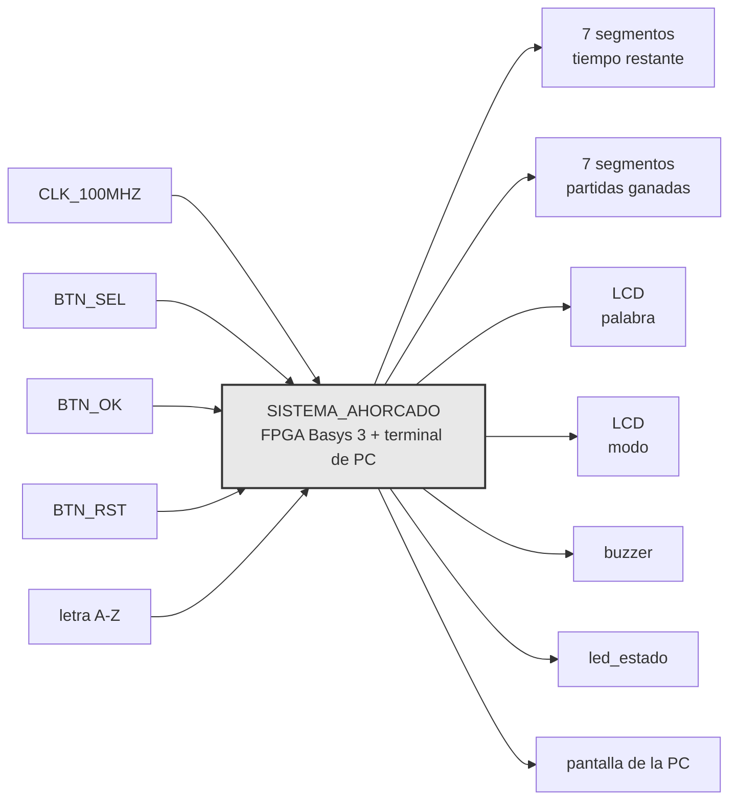

## Objetivo

Toda la inteligencia de la partida vive en la FPGA, la PC es solo terminal. La FPGA escoge la
palabra de forma pseudoaleatoria, valida cada letra contra ella, lleva tiempo e intentos
fallidos, decide el resultado, y refleja ese estado local y remotamente.

## Entradas

- `CLK_100MHZ`, oscilador de la Basys 3. Único reloj de entrada, toda referencia de tiempo del
  sistema se deriva de él.
- `BTN_SEL`, pulsador de la tarjeta. Alterna el modo mostrado en la pantalla de selección entre
  FACIL y DIFICIL.
- `BTN_OK`, pulsador de la tarjeta. Confirma el modo mostrado y arranca la partida.
- `BTN_RST`, pulsador central. Reinicia el sistema completo en cualquier momento, incluido el
  contador de partidas ganadas.
- UNICAMENTE letras A-Z, tecleada en la app de la PC. Viaja por el enlace serial hacia la FPGA.

## Salidas

- Tiempo restante, 2 dígitos de 7 segmentos. Cuenta regresiva en segundos de la partida en
  curso.
- Partidas ganadas, 2 dígitos de 7 segmentos. Acumulado de 00 a 99 desde el último `BTN_RST`.
- Palabra, LCD 16x2 PmodCLP. Patrón con posiciones reveladas y ocultas, más intentos fallidos
  disponibles.
- Modo, LCD 16x2 PmodCLP. Dificultad mostrada en la pantalla de selección.
- Sonido, buzzer piezoeléctrico pasivo. Tono distinto para acierto, error, y fin de partida.
- Estado del sistema, LED de la tarjeta. Distingue selección de modo, partida activa, y
  resultado final.
- Estado de la partida, pantalla de la PC. Patrón de la palabra, longitud, modo, intentos
  restantes, resultado de la última letra, y resultado final.

## Explicación general

El modo se elige desde la tarjeta, no desde la PC, con `BTN_SEL` para recorrer las opciones y
`BTN_OK` para confirmar. Al confirmar, la FPGA selecciona una palabra del banco interno acorde
al modo elegido, arranca la cuenta regresiva, y muestra la palabra oculta en el LCD.

De ahí en adelante cada letra tecleada en la PC llega por el enlace serial y se valida en la
FPGA contra la palabra secreta. Un acierto revela todas las posiciones de esa letra a la vez, un
fallo descuenta un intento, y una letra repetida se ignora sin penalizar ni reiniciar el
temporizador. El LCD y los displays reflejan el mismo estado en la tarjeta, y el buzzer da
realimentación sonora inmediata en cada uno de los tres casos.

La partida termina por palabra completa, sexto fallo, o tiempo agotado, sin distinción de
prioridad entre las dos últimas más allá de cuál ocurra primero en el tiempo. El resultado se
sostiene en el LCD por al menos tres segundos, se actualiza el acumulado de partidas ganadas si
corresponde, y el sistema regresa solo a la pantalla de selección.

El enlace serial es invisible desde afuera del sistema. Es decir, quien juega solo ve que escribe en un
lado y el estado aparece en los dos.


## Diagrama de flujo general de una partida

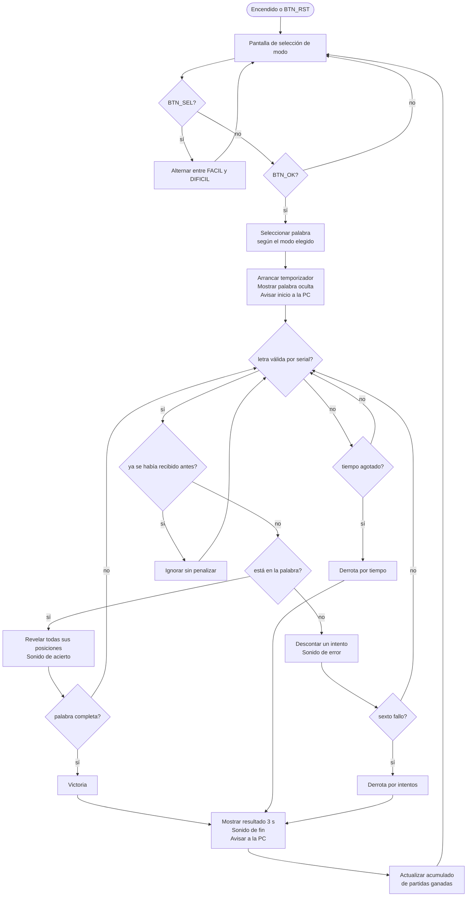

---

# Nivel 2

## Diagrama de segundo nivel

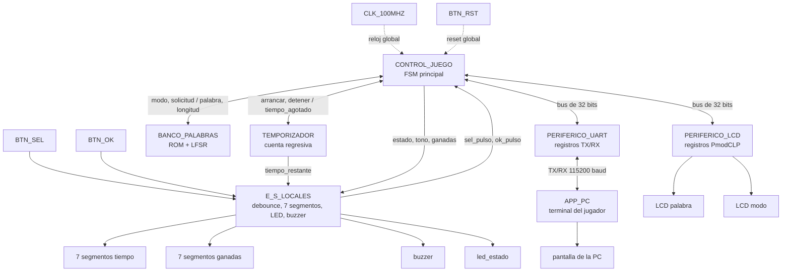

CLK_100MHZ y BTN_RST en realidad entran a los siete bloques, no solo a CONTROL_JUEGO. Se
dibujan una sola vez para no saturar el diagrama, igual que en nivel 1. BTN_RST no pasa por
CONTROL_JUEGO como pulso decodificado, es un reset físico que llega sincronizado a cada
bloque por igual, por eso reinicia el contador de partidas ganadas junto con todo lo demás.

## CONTROL_JUEGO

### Objetivo

Coordinar el flujo completo de una partida. Es el único bloque con permiso de escribir en los
periféricos de bus, y el que concentra la lógica de negocio que el enunciado exige mantener
adentro de la FPGA.

### Entradas

- `sel_pulso`, `ok_pulso`, pulsos ya filtrados de rebote desde E_S_LOCALES.
- `palabra_secreta`, `longitud`, desde BANCO_PALABRAS.
- `tiempo_agotado`, bandera desde TEMPORIZADOR.
- `rdata_o` del bus, compartido entre PERIFERICO_LCD y PERIFERICO_UART.

### Salidas

- `modo`, pulso de solicitud hacia BANCO_PALABRAS.
- `arrancar`, `detener`, hacia TEMPORIZADOR.
- Señales de control hacia E_S_LOCALES, estado para el LED, tono a sonar en el buzzer, valor
  del contador de partidas ganadas.
- `write_enable_i`, `addr_i`, `wdata_i` del bus, hacia PERIFERICO_LCD y PERIFERICO_UART.

### Explicación general

Es el bloque que más pesa en la nota y el que más se va a preguntar en la defensa, porque ahí
vive la máquina de estados que atraviesa selección de modo, partida activa, y resultado. Tiene
que arbitrar el mismo bus de 32 bits entre los dos periféricos, decidir cuándo una letra ya se
recibió antes, y descartar cualquier byte que llegue por UART mientras no hay partida activa.
Ese último comportamiento todavía está pendiente de redactar en detalle, pero la decisión de
diseño es que este bloque es el único responsable de tomarla, ningún otro bloque filtra letras
por su cuenta.

## BANCO_PALABRAS

### Objetivo

Guardar el banco de al menos 50 palabras y entregar una selección pseudoaleatoria acorde al
modo pedido.

### Entradas

- `modo`, FACIL o DIFICIL, desde CONTROL_JUEGO.
- pulso de solicitud, desde CONTROL_JUEGO.

### Salidas

- `palabra_secreta`, los caracteres de la palabra elegida.
- `longitud`, cuántos de esos caracteres son válidos.

### Explicación general

Adentro conviven la ROM con las 50 y tantas palabras y el LFSR que la recorre. Para el modo
difícil conviene una segunda tabla, solo con los índices de las palabras de 6 letras o más, en
vez de filtrar la ROM completa en tiempo de ejecución cada vez que se pide una palabra nueva.
El LFSR corre libre de fondo todo el tiempo y este bloque solo lo muestrea cuando llega el
pulso de solicitud, así la palabra elegida no depende de un seed fijo ni del instante exacto en
que arrancó el sistema.

## TEMPORIZADOR

### Objetivo

Llevar la cuenta regresiva de la partida en curso y avisar cuando se agota el tiempo.

### Entradas

- `arrancar`, `detener`, desde CONTROL_JUEGO, junto con el tiempo inicial según el modo.

### Salidas

- `tiempo_restante`, valor a mostrar, hacia E_S_LOCALES.
- `tiempo_agotado`, bandera, hacia CONTROL_JUEGO.

### Explicación general

Es la única fuente de tiempo real del sistema, ahí vive el prescalador que baja el reloj de
100 MHz hasta segundos. El valor de tiempo restante va directo a E_S_LOCALES sin pasar por
CONTROL_JUEGO, no hay razón para que la FSM principal repita un dato que ya tiene dueño. El
enunciado es explícito en que este valor no se transmite por UART, la PC nunca se entera del
tiempo restante de la partida.

## PERIFERICO_UART

### Objetivo

Envolver en registros de 32 bits el núcleo TX/RX que da el curso, siguiendo la interfaz
estándar de bus del enunciado.

### Entradas

- `write_enable_i`, `addr_i`, `wdata_i`, desde CONTROL_JUEGO.
- línea RX física, desde el puente USB-UART de la tarjeta.

### Salidas

- `rdata_o`, hacia CONTROL_JUEGO.
- línea TX física, hacia el mismo puente USB-UART.

### Explicación general

El equipo no diseña el núcleo serial en sí, sí el envoltorio, registro CONTROL con `send` y
`new_rx`, y los registros de datos de transmisión y recepción por separado. Corre fijo a
115200 baudios. El formato exacto de cada trama hacia la PC lo decide CONTROL_JUEGO, este
bloque solo mueve bytes de un lado al otro del bus.

## APP_PC

- terminal del jugador

### Objetivo

Ser la terminal remota del jugador, sin ninguna lógica de juego propia.

### Entradas

- trama recibida desde PERIFERICO_UART, por el mismo puente USB-UART.
- tecla A-Z presionada por el jugador.

### Salidas

- byte ASCII de la letra, hacia PERIFERICO_UART.
- texto en la pantalla de la PC.

### Explicación general

Valida que la tecla presionada sea A-Z antes de mandarla, pero esa validación es solo para no
llenar el enlace de basura, la que de verdad manda es la FPGA. Esta app no decide nada del
resultado de la partida, solo pinta lo que la trama de la FPGA le dice que pinte.

## PERIFERICO_LCD

### Objetivo

Envolver en registros de 32 bits, diseño propio del equipo, el manejo del HD44780 del
PmodCLP.

### Entradas

- `write_enable_i`, `addr_i`, `wdata_i`, desde CONTROL_JUEGO.

### Salidas

- `rdata_o`, hacia CONTROL_JUEGO, ahí van los bits `busy` y `done`.
- señales físicas del PmodCLP, `RS`, `RW`, `E`, y el bus de datos de 8 bits.

### Explicación general

Adentro vive la secuencia de inicialización del HD44780, que es uno de los puntos técnicos
más delicados del proyecto por los tiempos de espera entre comandos. CONTROL_JUEGO no conoce
esos tiempos, solo escribe comandos o datos de alto nivel y sondea `busy`/`done` antes de
mandar el siguiente. Ese aislamiento es a propósito, si algún día cambia el driver del LCD
CONTROL_JUEGO no debería enterarse.

## E_S_LOCALES

### Objetivo

Agrupar la entrada y salida física de la tarjeta que no necesita pasar por el bus de
periféricos, botones, displays de 7 segmentos, LED, y buzzer.

### Entradas

- `BTN_SEL`, `BTN_OK`, crudos, sin filtrar.
- `tiempo_restante`, desde TEMPORIZADOR.
- estado, tono, y contador de partidas ganadas, desde CONTROL_JUEGO.

### Salidas

- `sel_pulso`, `ok_pulso`, ya filtrados de rebote, hacia CONTROL_JUEGO.
- dígitos de los 7 segmentos.
- LED de estado.
- onda cuadrada hacia el buzzer.

### Explicación general

Junta varios bloques chiquitos que no valen la pena separar a este nivel, dos debouncers, dos
manejadores de display, un generador de onda para el buzzer. Ninguno necesita direccionarse
por registro porque ninguno comparte el mismo puerto físico con otro, a diferencia del LCD y
el UART que sí necesitan un bus para compartir sus 32 bits entre comandos y datos.

## Explicación general del sistema

CONTROL_JUEGO es el único bloque que le habla a todos los demás, los otros seis no se hablan
entre sí. BANCO_PALABRAS y TEMPORIZADOR le entregan datos, PERIFERICO_LCD y PERIFERICO_UART
comparten el mismo bus de 32 bits cada uno en su rango, y E_S_LOCALES absorbe lo que es
demasiado simple como para merecer un bus propio.

Esta partición calza con el reparto de trabajo del equipo, frente C para CONTROL_JUEGO,
BANCO_PALABRAS y TEMPORIZADOR, frente B para PERIFERICO_UART y APP_PC, frente A para
PERIFERICO_LCD y E_S_LOCALES. Cómo se arma cada bloque por dentro, empezando por la FSM de
CONTROL_JUEGO, es lo que le toca al nivel 3.

---

# Nivel 3

En este documento se detallan los diagramas de diseño de tercer nivel. Además, se detallan las entradas y salidas de estos módulos y como se buscan conectar entre ellos.


## Diagrama de tercer nivel

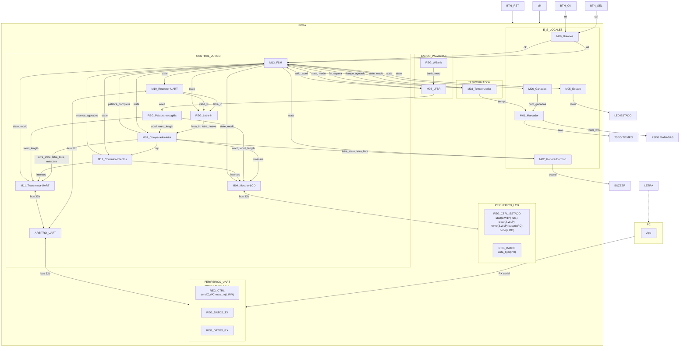

### Leyenda de los diagramas modulares

Para facilitar la creación de los diagramas, utilizando mermaid, utilizaremos la siguiente notación:

- **Óvalo**: puerto externo del módulo (entrada o salida hacia otro módulo/bloque).
- **Rectángulo**: registro o contador.
- **Hexágono**: multiplexor.
- **Rombo**: comparador o lógica de decisión.
- **Rectángulos etiquetados** `XOR`, `OR`, `SUMADOR`, `DECOD_...`: compuertas o bloques combinacionales
  puntuales (comparación bit a bit, decremento, decodificación).

`clk` y `rst` entran a todo registro/contador de cada módulo aunque no se dibujen en cada elemento,
por el mismo criterio usado en los niveles 1 y 2.

## M01: Marcador

### b) Diagrama modular


### c) Objetivo del módulo

Manejar los displays de 7 segmentos del marcador: recibe el tiempo restante desde
M03_Temporizador y el número de partidas ganadas desde M06_Ganadas, y los muestra en 7SEG1 y
7SEG2 respectivamente.

### d) Entradas

- `clk`, `rst`.
- `time`, tiempo restante de la partida, desde M03_Temporizador.
- `num_ganadas`, número de partidas ganadas, desde M06_Ganadas.

### e) Salidas

- `deco_time`, patrón de segmentos/ánodos del display de tiempo, hacia 7SEG1.
- `deco_num_win`, patrón de segmentos/ánodos del display de ganadas, hacia 7SEG2.

## M02: Generador-Tono

### b) Diagrama modular


### c) Objetivo del módulo

Generar el tono del buzzer. Se dispara solo, con `letra_state` de M07_Comparador-letra para
distinguir acierto de fallo, y decodificando `state` para el tono de fin de partida cuando el
sistema entra a GANO, PERDIO_INTENTOS o PERDIO_TIEMPO. Son los tres sonidos distintos que pide el
enunciado.

### d) Entradas

- `clk`, `rst`.
- `state`, estado actual, desde M13_FSM, de ahí saca el fin de partida.
- `letra_state`, resultado de la última letra evaluada, desde M07_Comparador-letra.
- `letra_lista`, estrobo que marca cuándo `letra_state` es nuevo, desde M07_Comparador-letra.

### e) Salidas

- `sound`, onda cuadrada de audio, hacia BUZZER.

## M03: Temporizador

### b) Diagrama modular

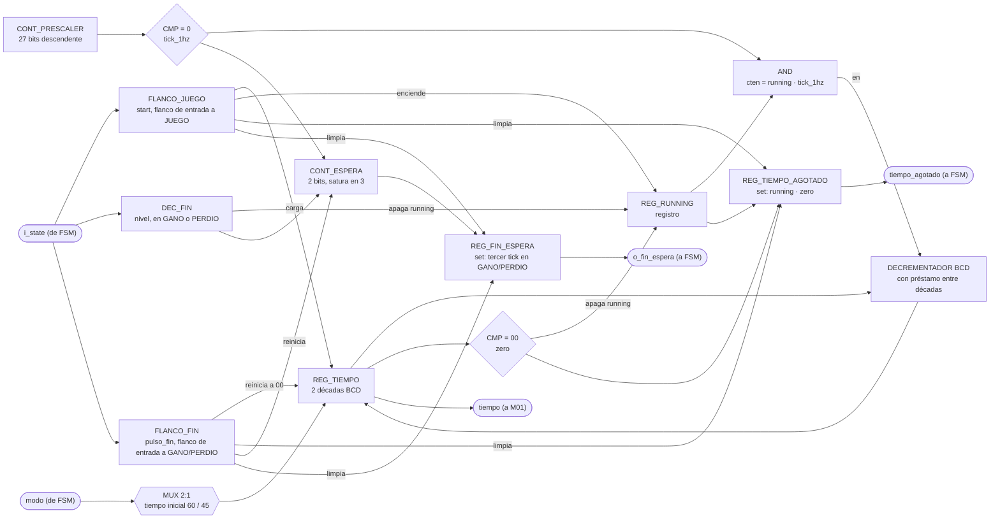

### c) Objetivo del módulo

Llevar la cuenta regresiva de la partida activa. Arranca sola al ver que `state` entró a JUEGO,
con la duración inicial que le dice `modo`, y se detiene al llegar a cero o al entrar a GANO o
PERDIO. Entrega el tiempo restante en BCD a M01_Marcador y avisa a M13_FSM cuando el tiempo se
agota (`tiempo_agotado`).

Es además la única fuente de tiempo real del sistema, así que también le toca contar la espera
del resultado en pantalla, tres pulsos de su `tick_1hz` en GANO o PERDIO, y avisar con
`o_fin_espera`. Se hace acá y no en la FSM para no duplicar un prescalador de 100 MHz a 1 Hz que
ya vive en este módulo.

### d) Entradas

- `clk`, `rst`.
- `i_state`, estado actual, desde M13_FSM, de ahí saca cuándo contar la partida y cuándo la
  espera del resultado.
- `modo`, fácil o difícil, desde M13_FSM, define el tiempo inicial a cargar (60 s o 45 s).

### e) Salidas

- `tiempo_agotado`, bandera de fin de tiempo de partida, hacia M13_FSM.
- `o_fin_espera`, bandera de espera de resultado cumplida, hacia M13_FSM.
- `tiempo[7:0]`, tiempo restante de la partida en BCD, hacia M01_Marcador.

## M04: Mostrar-LCD

### b) Diagrama modular

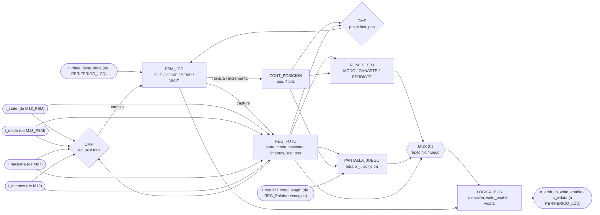

### c) Objetivo del módulo

Controlar lo que se muestra en el LCD. Decodifica `state` para saber cuál pantalla toca,
selección de modo, palabra en juego, ganó o perdió. Compone el mensaje con `modo`, la palabra
escogida, `mascara` e `intentos`, y lo escribe carácter por carácter en PERIFERICO_LCD por el bus.

Repinta la pantalla del estado que ve, no una pantalla por cada transición, así que si un estado
corto pasa antes de que el LCD alcance a refrescar no queda un mensaje a medias, simplemente
pinta el que sigue.

### d) Entradas

- `clk`, `rst`.
- `i_state`, estado actual, desde M13_FSM, decide cuál pantalla se pinta.
- `i_modo`, desde M13_FSM.
- `i_word`, `i_word_length`, palabra escogida y su longitud, desde REG_Palabra-escogida. La
  palabra llega convertida a ASCII por un adaptador en `top.sv`.
- `i_mascara`, posiciones ya reveladas de la palabra, desde M07_Comparador-letra. Es lo que decide
  cuáles letras se pintan y cuáles quedan como guion bajo.
- `i_intentos`, fallos acumulados de la partida, desde M12_Contador-Intentos. Se muestran como
  intentos restantes al final de la pantalla de juego.
- `i_rdata`, lectura del bus de PERIFERICO_LCD, de donde saca `busy` y `done`.

### e) Salidas

- `o_addr`, `o_write_enable`, `o_wdata`, escrituras de bus hacia PERIFERICO_LCD.

## M05: Estado

### b) Diagrama modular


### c) Objetivo del módulo

Reflejar el estado actual del sistema en el LED de estado, traduciendo la señal `state` que
recibe de M13_FSM a la salida física que enciende LED_S. Distingue selección de modo, partida
activa y resultado final, que es lo que pide el enunciado.

### d) Entradas

- `clk`, `rst`.
- `state`, código de estado actual, desde M13_FSM.

### e) Salidas

- `state_led`, señal física del LED de estado, hacia LED_S.

## M06: Ganadas

### b) Diagrama modular


### c) Objetivo del módulo

Contar el número de partidas ganadas. Incrementa por su cuenta al detectar que `state` entró a
GANO y entrega el total acumulado a M01_Marcador para su despliegue. `rst` lo devuelve a cero,
que es lo que hace que BTN_RST reinicie el marcador acumulado como pide el enunciado.

### d) Entradas

- `clk`, `rst`.
- `state`, estado actual, desde M13_FSM, incrementa al entrar a GANO.

### e) Salidas

- `num_ganadas`, número acumulado de partidas ganadas, hacia M01_Marcador.

## M07: Comparador-letra

### b) Diagrama modular

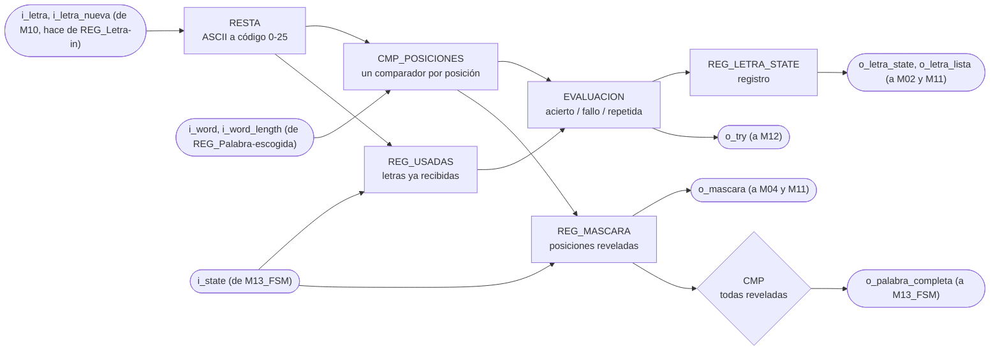

### c) Objetivo del módulo

Compara la letra recibida con la palabra escogida y determina el resultado del intento. Guarda
además cuáles posiciones de la palabra ya se revelaron y cuáles letras ya se recibieron, que es lo
que permite avisar cuando la palabra quedó completa y no penalizar una letra repetida.

### d) Entradas

- `clk`, `rst`.
- `i_letra[7:0]`, letra recibida en ASCII tal como sale de `M10_Receptor-UART`, que en el top hace
  también de `REG_Letra-in`.
- `i_letra_nueva`, pulso de un ciclo que avisa que `i_letra` acaba de cargarse, desde el mismo
  registro.
- `i_word[WORD_MAXLEN*LETRA_WIDTH-1:0]`, palabra de la partida, desde `REG_Palabra-escogida`. Cada
  letra ocupa `LETRA_WIDTH` bits con su código de 0 a 25, y la primera letra va en los bits bajos.
- `i_word_length[$clog2(WORD_MAXLEN+1)-1:0]`, cantidad de letras válidas de `i_word`, desde
  `REG_Palabra-escogida`.
- `i_state[2:0]`, estado actual, desde `M13_FSM`. De acá solo le interesa CARGA.

El módulo está parametrizado con `WORD_MAXLEN = 12` y `LETRA_WIDTH = 5`, los mismos valores con los
que `M08_LFSR` empaqueta la palabra y con los que `M11_Transmisor-UART` recibe la máscara.

### e) Salidas

- `o_letra_state[1:0]`, resultado de la comparación, hacia `M02_Generador-Tono` y
  `M11_Transmisor-UART`.
- `o_letra_lista`, estrobo de un ciclo que acompaña a `o_letra_state`, hacia `M02_Generador-Tono`
  y `M11_Transmisor-UART`.
- `o_palabra_completa`, todas las posiciones de la palabra reveladas, hacia `M13_FSM`.
- `o_mascara[WORD_MAXLEN-1:0]`, posiciones reveladas, hacia `M04_Mostrar-LCD` y
  `M11_Transmisor-UART`. Es el patrón que se pinta en el LCD y el que viaja en la trama hacia la
  PC. El bit 0 corresponde a la primera letra de la palabra.
- `o_try`, pulso de intento fallido, hacia `M12_Contador-Intentos`.

Codificación de `o_letra_state`:

| `o_letra_state` | Significado |
| --------------- | ----------- |
| `00`            | FALLO, la letra no está en la palabra |
| `01`            | ACIERTO, la letra reveló al menos una posición |
| `10`            | REPETIDA, la letra ya se había recibido antes |
| `11`            | sin uso |

## M08: LFSR

### b) Diagrama modular

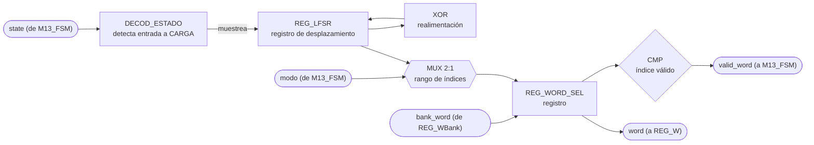

### c) Objetivo del módulo

Escoger de forma pseudoaleatoria la palabra secreta de la partida usando un LFSR. El LFSR corre
libre todo el tiempo y este módulo lo muestrea al ver que `state` entró a CARGA, saca del banco
(REG_WBank) una palabra acorde al `modo`, la entrega a REG_Palabra-escogida y confirma con
`valid_word` que ya está lista, que es justo lo que M13_FSM está esperando para pasar a JUEGO.

### d) Entradas

- `clk`, `rst`.
- `state`, estado actual, desde M13_FSM, muestrea el LFSR al entrar a CARGA.
- `modo`, fácil o difícil, desde M13_FSM, acota el rango de palabras válidas.
- `bank_word`, palabra leída del banco, desde REG_WBank.

### e) Salidas

- `word`, palabra escogida, hacia REG_Palabra-escogida.
- `valid_word`, bandera de índice/palabra válida, hacia M13_FSM.

## M09: Botones

### b) Diagrama modular

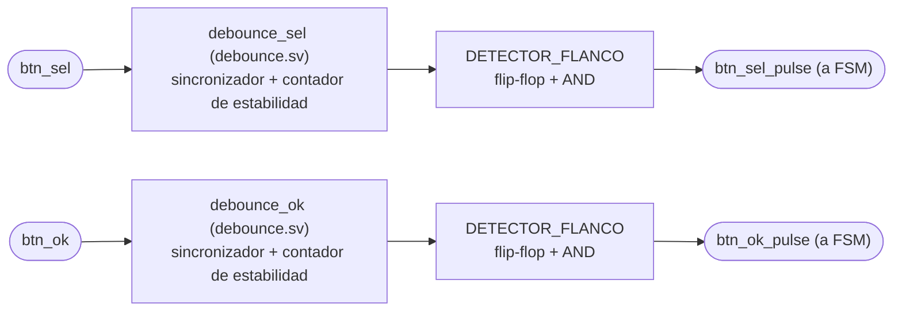

### c) Objetivo del módulo

Capturar y filtrar (debounce) las pulsaciones físicas de BTN_SEL y BTN_OK, entregando los
pulsos limpios `sel` y `ok` directamente a M13_FSM.

### d) Entradas

- `clk`, `rst`.
- `btn_sel`, señal cruda del botón de selección.
- `btn_ok`, señal cruda del botón de confirmación.

### e) Salidas

- `btn_sel_pulse`, pulso de selección filtrado, hacia la entrada `sel` de M13_FSM.
- `btn_ok_pulse`, pulso de confirmación filtrado, hacia la entrada `ok` de M13_FSM.

## M10: Receptor-UART

### b) Diagrama modular

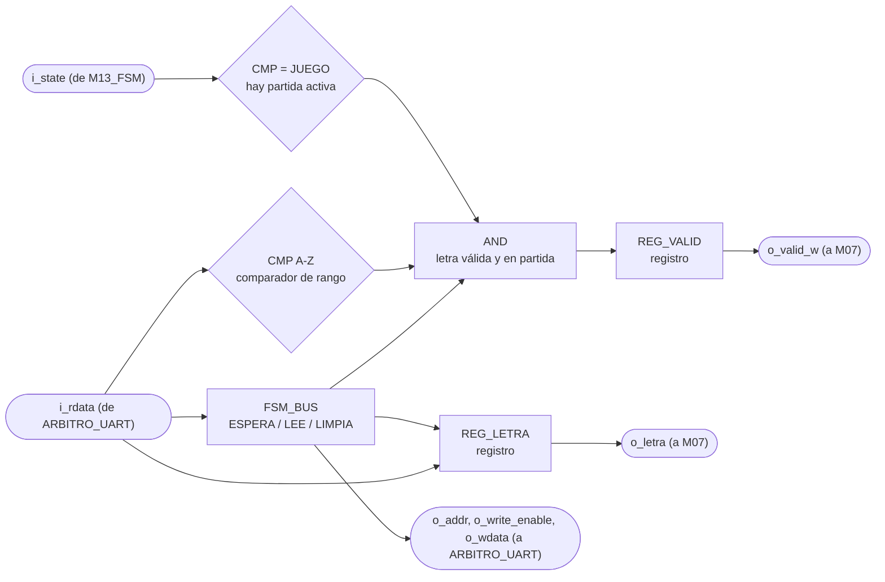

### c) Objetivo del módulo

Recibe los bytes que manda la aplicación del PC, se queda solo con los que son una letra A-Z
durante una partida activa, y los entrega a `M07_Comparador-letra`. Es el punto donde se descarta
todo lo que no debe llegar a la lógica del juego.

### d) Entradas

- `clk`, `rst`.
- `i_rdata[WIDTH-1:0]`, lo que devuelve `PERIFERICO_UART` en la dirección que este módulo le está
  poniendo, de ahí saca el bit `new_rx` y el byte recibido. Llega pasando por `ARBITRO_UART`.
- `i_state[2:0]`, estado actual, desde `M13_FSM`. De acá solo le interesa JUEGO.

El dato no le llega por una flecha propia en el diagrama de tercer nivel, entra por el bus de 32
bits que comparte con `M11_Transmisor-UART` a través de `ARBITRO_UART`.

El módulo está parametrizado con `WIDTH = 32`, el ancho del bus. El byte serial es
`BYTE_WIDTH = 8` y va como `localparam` dentro de la lista de parámetros, porque los núcleos del
curso siempre mueven 8 bits y no tiene sentido que dependa del ancho del bus.

### e) Salidas

- `o_letra[BYTE_WIDTH-1:0]`, letra recibida en ASCII tal como salió del periférico, hacia
  `M07_Comparador-letra`.
- `o_valid_w`, pulso de un ciclo que habilita esa letra, hacia `M07_Comparador-letra`, donde entra
  como `i_letra_nueva`.
- `o_addr[1:0]`, `o_write_enable`, `o_wdata[WIDTH-1:0]`, petición hacia el bus, que entra por la
  cara del receptor de `ARBITRO_UART`.

`o_letra` y `o_valid_w` salen de registros, así que juntas cumplen el papel de `REG_Letra-in` del
diagrama de tercer nivel y en el top no hace falta un registro aparte.

## M11: Transmisor-UART

### b) Diagrama modular

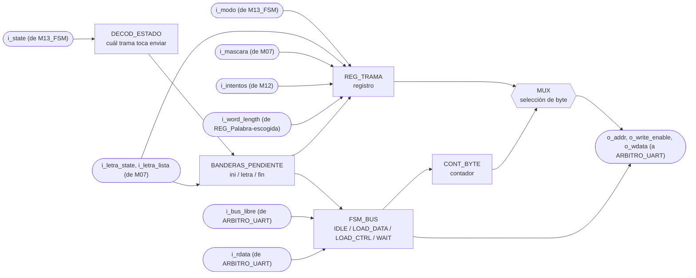

### c) Objetivo del módulo

Ensamblar y transmitir hacia la PC, por UART, las tramas de estado del juego que exige la sección
3.4.4 del enunciado, inicio de partida con modo y longitud, resultado de cada letra con el patrón
actualizado y los intentos, y resultado final con su causa.

Decide solo cuándo transmitir. Al ver que `i_state` entró a JUEGO manda la trama de inicio, con
cada letra evaluada manda la trama de letra, y al entrar a GANO o PERDIO manda la de fin.

La FSM llega a PERDIO tanto por intentos como por tiempo, así que `i_state` solo no alcanza para
la causa. El módulo la saca de `i_intentos` al entrar. Si la cuenta llegó a 6 se perdió por
intentos, y con cualquier otro valor fue el tiempo. Eso es confiable porque `M12_Contador-Intentos`
solo se limpia en CARGA, así que durante PERDIO la cuenta sigue intacta, y coincide con la
prioridad de la FSM, que ante intentos agotados y tiempo en cero en el mismo ciclo escoge intentos.

### d) Entradas

- `clk`, `rst`.
- `i_state[2:0]`: estado actual, desde `M13_FSM`, decide cuál trama toca enviar.
- `i_modo`: modo de la partida, desde `M13_FSM`, viaja en la trama de inicio.
- `i_letra_state[1:0]`: resultado de la última letra, desde `M07_Comparador-letra`. La
  codificación es `00` fallo, `01` acierto, `10` repetida, y el `11` no se usa.
- `i_letra_lista`: estrobo de un ciclo que acompaña a `i_letra_state`, desde
  `M07_Comparador-letra`. Es el que dispara la trama, no el valor de `i_letra_state`, porque dos
  letras seguidas con el mismo resultado no cambian ese bus y sin estrobo la segunda se perdería.
- `i_intentos[2:0]`: fallos acumulados de la partida, desde `M12_Contador-Intentos`. Llega a 6,
  así que 3 bits alcanzan. Viaja en la trama de letra y además decide la causa de una derrota.
- `i_word_length[3:0]`: longitud de la palabra escogida, desde `REG_Palabra-escogida`, que en el
  top es `word[63:60]` de `M08_LFSR`.
- `i_mascara[WORD_MAXLEN-1:0]`: posiciones ya reveladas, desde `M07_Comparador-letra`. Es el
  patrón que el enunciado pide mandar junto con el resultado de la letra.
- `i_rdata[WIDTH-1:0]`: lectura de vuelta del bus, de ahí sondea el bit `send` para saber si el
  periférico sigue ocupado. Llega pasando por `ARBITRO_UART`.
- `i_bus_libre`: desde `ARBITRO_UART`, dice si este ciclo el bus es suyo.

El módulo está parametrizado con `WIDTH = 32`, el ancho del bus, y con `WORD_MAXLEN = 12`, el
mismo valor que usan `M07_Comparador-letra` y el banco de palabras. El byte serial es
`BYTE_WIDTH = 8` fijo, porque los núcleos del curso siempre mueven 8 bits.

### e) Salidas

- `o_write_enable`, `o_addr[1:0]`, `o_wdata[WIDTH-1:0]`: petición hacia el bus, que entra por la cara
  del transmisor de `ARBITRO_UART`.

Todo lo que el módulo tiene que decir viaja empaquetado dentro de `o_wdata`, un byte a la vez.
La etiqueta `modo/letra_state/Resultado/w_word/Intentos` del diagrama de nivel 3 describe ese
contenido, no puertos separados.

## M12: Contador-Intentos

### b) Diagrama modular

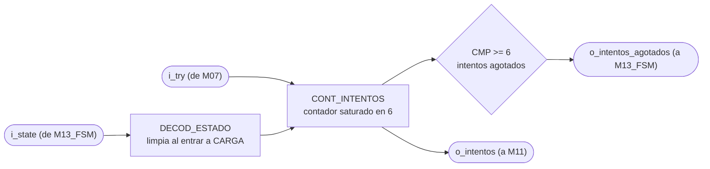

### c) Objetivo del módulo

Lleva la cuenta de letras incorrectas de la partida en curso y avisa cuando se alcanzaron las seis
que el enunciado fija como máximo. Es la condición de derrota por intentos.

### d) Entradas

- `clk`, `rst`.
- `i_try`, pulso de intento fallido, desde `M07_Comparador-letra`.
- `i_state[2:0]`, estado actual, desde `M13_FSM`. De acá solo le interesa CARGA.

El módulo está parametrizado con `MAX_INTENTOS = 6`, el máximo que fija el enunciado.

### e) Salidas

- `o_intentos[$clog2(MAX_INTENTOS+1)-1:0]`, fallos acumulados de la partida, hacia
  `M11_Transmisor-UART`.
- `o_intentos_agotados`, bandera de seis fallos alcanzados, hacia `M13_FSM`.

## M13: FSM

### b) Diagrama de estados

Para este módulo el diagrama de estados ocupa el lugar del diagrama modular de los demás. Una FSM
se escribe directamente desde su diagrama de estados, no desde un arreglo de registros y
compuertas, así que ese es el diagrama que de verdad sirve para implementarla.

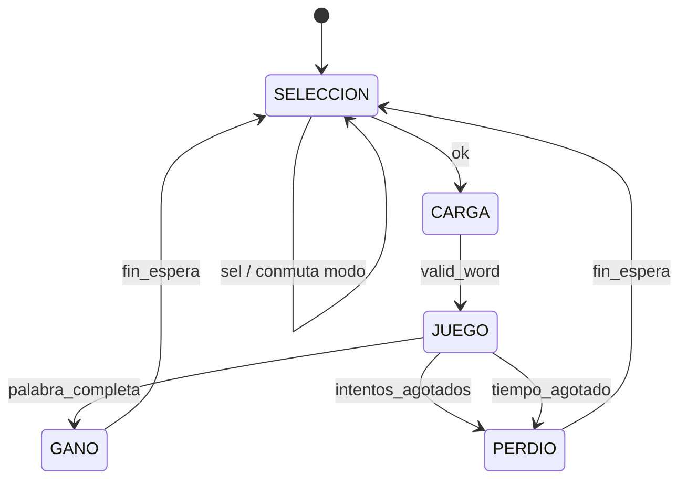

Codificación de `state`, tres bits. Es el contrato que decodifican los demás módulos, así que el
valor de cada estado queda fijo:

- `000` SELECCION, pantalla de selección de modo.
- `001` CARGA, se le pide palabra al banco y se espera `valid_word`.
- `010` JUEGO, partida activa.
- `011` GANO, la palabra quedó completa.
- `100` PERDIO, se alcanzaron las seis letras incorrectas o la cuenta regresiva llegó a cero.

`101`, `110` y `111` no se usan. La FSM no guarda la causa de la derrota, M11_Transmisor-UART la
deduce del contador de intentos (ver `M13_FSM.md`, g).

`BTN_RST` devuelve la FSM a SELECCION desde cualquier estado, igual que reinicia al resto de los
módulos, por eso no se dibuja como una transición más del diagrama.

### c) Objetivo del módulo

Llevar el estado global de la partida y publicarlo para que cada módulo decida por su cuenta qué
le toca hacer. La FSM no le da órdenes puntuales a nadie, no manda pulsos de `start`, `show`,
`choose` ni `count`. Solo dice en cuál de los cinco estados está el sistema y cuál modo está
seleccionado.

Esa es la decisión de diseño central del módulo. Con la FSM mandando, cada módulo nuevo obligaba a
agregarle una salida y a meterle mano a su lógica interna. Con los módulos decodificando `state`
la FSM queda fija, y un módulo nuevo solo se cuelga del estado que ya se difunde. Se nota en el
diagrama de tercer nivel, todas las flechas que salen de la FSM llevan lo mismo, `state` y en
algunos casos `modo`, en vez de once señales de control distintas.

El otro efecto es que la FSM nunca se queda esperando a nadie. No sondea el `busy` del LCD ni
espera confirmación de M11 para cambiar de estado, porque no les está ordenando nada. M04 repinta
el estado que ve en el momento en que puede, y si CARGA pasa demasiado rápido para el LCD,
simplemente pinta el siguiente estado sin que quede nada a medias.

De aquí sale también la respuesta a lo que el enunciado exige documentar, qué pasa con una letra
que llega por UART fuera de partida. REG_Letra-in solo carga cuando `state` es JUEGO, así que la
letra se descarta ahí mismo, sin llegar a M07 ni gastar intento. La FSM ni se entera.

### d) Entradas

- `clk`, `rst`.
- `sel`, pulso de cambio de modo, desde M09_Botones.
- `ok`, pulso de confirmación, desde M09_Botones.
- `valid_word`, palabra lista en REG_Palabra-escogida, desde M08_LFSR.
- `palabra_completa`, todas las posiciones de la palabra reveladas, desde M07_Comparador-letra.
- `intentos_agotados`, seis letras incorrectas alcanzadas, desde M12_Contador-Intentos.
- `tiempo_agotado`, cuenta regresiva en cero, desde M03_Temporizador.
- `fin_espera`, se cumplió la espera del resultado en pantalla, desde M03_Temporizador.

### e) Salidas

- `state`, estado actual en tres bits, hacia M02_Generador-Tono, M03_Temporizador,
  M04_Mostrar-LCD, M05_Estado, M06_Ganadas, M07_Comparador-letra, M08_LFSR, M10_Receptor-UART,
  M11_Transmisor-UART, M12_Contador-Intentos y REG_Letra-in.
- `modo`, FACIL o DIFICIL, hacia M03_Temporizador, M04_Mostrar-LCD, M08_LFSR y
  M11_Transmisor-UART.

En el `.sv` las entradas llevan prefijo `i_` y las salidas `o_` (`i_sel`, `i_ok`, `i_valid_word`,
`i_palabra_completa`, `i_intentos_agotados`, `i_tiempo_agotado`, `i_fin_espera`). En el resto de
este documento se nombran sin prefijo para no cargar el texto.

Son las únicas dos salidas del módulo, cuatro bits en total. No hay señales de `start`, `show`,
`choose`, `count` ni `load` porque la FSM no le ordena nada puntual a ningún módulo.

### f) Explicación de la relación con otros módulos

Le entregan eventos a la FSM:

- M09_Botones, con `sel` y `ok` ya filtrados de rebote.
- M08_LFSR, con `valid_word` cuando la palabra de la partida quedó lista en REG_Palabra-escogida.
- M07_Comparador-letra, con `palabra_completa` cuando su máscara de posiciones reveladas se llenó.
- M12_Contador-Intentos, con `intentos_agotados` cuando el contador llegó a seis fallos.
- M03_Temporizador, con `tiempo_agotado` durante la partida y con `fin_espera` cuando ya pasó la
  espera mostrando el resultado.

Consumen `state` los once bloques listados en la e). Cada uno decodifica los estados que le
importan e ignora el resto. M05_Estado lo traduce al LED, M03_Temporizador lo usa para arrancar y
detener la cuenta, M08_LFSR muestrea al entrar a CARGA, M06_Ganadas incrementa al entrar a GANO,
M04_Mostrar-LCD elige cuál de sus pantallas pinta, M11_Transmisor-UART decide cuál trama
manda, y REG_Letra-in y M10_Receptor-UART lo usan para descartar letras fuera de partida.

Consumen `modo` los cuatro que necesitan saber la dificultad, M03_Temporizador para cargar 60 s o
45 s, M08_LFSR para acotar el rango de palabras, y M04_Mostrar-LCD y M11_Transmisor-UART para
reportarla.

La FSM no toca el bus de 32 bits. No le escribe al PERIFERICO_LCD ni al PERIFERICO_UART, de eso se
encargan M04, M10 y M11 dentro de CONTROL_JUEGO. Por eso la FSM tampoco conoce los bits `busy` y
`done` del LCD, ni el `send` ni el `new_rx` del UART.

Esta es la parte que más cambió respecto al primer planteamiento. Antes la FSM tenía una salida
por cada cosa que quería que pasara, y agregar un módulo significaba agregarle un puerto y meterle
otra rama a su lógica. Ahora la FSM queda fija y el módulo nuevo se cuelga del `state` que ya se
difunde, sin tocar este archivo. El costo es que la codificación de `state` pasa a ser un contrato
público, si se cambia un código hay que revisar los once decodificadores.

### g) Explicación de funcionamiento

El sistema arranca en SELECCION después del reset. Ahí el LCD muestra la pantalla de selección de
dificultad y cada pulso `sel` de BTN_SEL conmuta `modo` entre FACIL y DIFICIL, sin salir del
estado. El pulso `ok` de BTN_OK es el que confirma y pasa a CARGA. Mientras se está en SELECCION
cualquier byte que llegue por UART se descarta en M10_Receptor-UART, así que la FSM ni se entera.

En CARGA la FSM solo espera. M08_LFSR ve que el estado cambió, muestrea su registro de
desplazamiento, escoge una palabra del banco acorde al `modo` y la deja en REG_Palabra-escogida.
Cuando levanta `valid_word` la FSM pasa a JUEGO. M07_Comparador-letra y M12_Contador-Intentos
aprovechan el paso por CARGA para limpiar la máscara de letras reveladas y el contador de fallos
de la partida anterior.

JUEGO es donde se juega la partida completa y donde la FSM hace menos. El temporizador corre, las
letras entran por UART, M07 las compara, M12 cuenta los fallos, M04 repinta el LCD y M11 le
reporta a la PC, todo sin intervención de la FSM. Ella solo vigila tres señales, `palabra_completa`
para ganar, `intentos_agotados` para perder por fallos, y `tiempo_agotado` para perder por tiempo.

Los dos estados de fin, GANO y PERDIO, funcionan igual entre sí. Se mantienen mientras
M03_Temporizador cuenta la espera de resultado en pantalla, y cuando llega `fin_espera` la FSM
vuelve sola a SELECCION para la siguiente partida.

A PERDIO se llega por cualquiera de las dos derrotas, `intentos_agotados` o `tiempo_agotado`, y
la FSM no guarda cuál fue. En el primer planteamiento eran dos estados, PERDIO_INTENTOS y
PERDIO_TIEMPO, para que la causa viajara en `state`. Se juntaron porque ningún consumidor la
necesita sacar de ahí. M04_Mostrar-LCD muestra un único "PERDISTE", y M11_Transmisor-UART
distingue la causa por su cuenta con `intentos` de M12_Contador-Intentos, que solo se limpia en
CARGA y por lo tanto sigue intacto durante PERDIO (seis fallos es derrota por intentos, menos de
seis es derrota por tiempo). Con un estado menos la FSM y los decodificadores que miran los
estados de fin quedan más simples.

BTN_RST es un reset físico que llega sincronizado a todos los módulos por igual. Devuelve la FSM a
SELECCION desde cualquier estado, y en el mismo golpe M06_Ganadas pone su contador acumulado en
cero, que es lo que pide el enunciado. La FSM no manda ninguna señal para que eso pase.

### h) Diseño

#### Codificación de estados

Cinco estados, tres bits, codificación binaria:

- `000` SELECCION
- `001` CARGA
- `010` JUEGO
- `011` GANO
- `100` PERDIO

Se descartó one-hot aunque sea lo típico para FSM en FPGA. Con one-hot cada módulo decodificaría
con una sola comparación de bit, que es más barato, pero `state` sale del módulo como puerto hacia
once bloques, y cinco líneas contra tres casi duplican el ruteo de una señal que ya es la más
difundida del diseño. Además, al ser puerto, Vivado no puede recodificar el registro por su cuenta, así que
la codificación queda fija de todas formas y conviene que sea la compacta.

Los códigos `101`, `110` y `111` no se usan. `101` era PERDIO_TIEMPO antes de juntar las dos
derrotas, y ahora cae en el mismo `default` que los otros dos, que los manda a SELECCION, tanto
para no dejar estados colgados como para que no se infiera un latch.

#### Tabla de transiciones

El orden de las filas dentro de cada estado es el orden de prioridad, y es el mismo orden en que
van los `if / else if / else` de la implementación:

| Estado actual | Condición | Estado siguiente | Efecto |
|---|---|---|---|
| SELECCION `000` | `ok` | CARGA `001` | |
| SELECCION `000` | `sel` | SELECCION `000` | conmuta `modo` |
| SELECCION `000` | ninguna | SELECCION `000` | |
| CARGA `001` | `valid_word` | JUEGO `010` | |
| CARGA `001` | ninguna | CARGA `001` | |
| JUEGO `010` | `palabra_completa` | GANO `011` | |
| JUEGO `010` | `intentos_agotados` | PERDIO `100` | |
| JUEGO `010` | `tiempo_agotado` | PERDIO `100` | |
| JUEGO `010` | ninguna | JUEGO `010` | |
| GANO `011` | `fin_espera` | SELECCION `000` | |
| GANO `011` | ninguna | GANO `011` | |
| PERDIO `100` | `fin_espera` | SELECCION `000` | |
| PERDIO `100` | ninguna | PERDIO `100` | |
| `101`, `110`, `111` | cualquiera | SELECCION `000` | estados no usados |

#### Registro de modo

`modo` es el otro elemento de memoria del módulo, un solo bit que vive aparte del registro de
estado. Las transiciones no lo tocan, lo mueve únicamente BTN_SEL:

| Condición (prioridad descendente) | `modo'`  |
| --------------------------------- | -------- |
| `rst = 1`                         | `0`      |
| `state = SELECCION` y `sel = 1`   | `NOT modo` |
| resto                             | `modo`   |

La segunda fila es la que congela la dificultad durante la partida. Fuera de SELECCION el pulso
`sel` no hace nada, así que un botonazo accidental a media partida no puede cambiarle el
temporizador ni el banco de palabras a una partida ya empezada.

Significado del bit y valores que dispara en los otros módulos:

| `modo` | Dificultad | Palabras del banco        | Tiempo de partida |
| ------ | ---------- | ------------------------- | ----------------- |
| `0`    | FACIL      | cualquiera, 4 a 12 letras | 60 s              |
| `1`    | DIFICIL    | solo de 6 letras o más    | 45 s              |

Los tiempos son los sugeridos por el enunciado y se mantienen tal cual. La relación que sí es
obligatoria es que difícil tenga menos tiempo que fácil, y 45 contra 60 la cumple. La
justificación de los valores concretos es que en modo difícil la palabra es más larga, entre 6 y
12 letras, así que hay más posiciones que descubrir con menos tiempo, y ahí está la dificultad
real del modo, no solo en el reloj.

Después del reset el sistema arranca en FACIL, que es el modo que se muestra primero en el LCD.

#### Prioridades y casos de borde

En SELECCION, `ok` y `sel` no compiten entre sí porque actúan sobre registros distintos. `ok`
decide el estado siguiente y `sel` conmuta `modo`, y la condición de `modo` solo mira que el estado
actual sea SELECCION, no que `ok` esté en cero. Si los dos pulsos llegaran en el mismo ciclo, la
FSM pasaría a CARGA y `modo` se conmutaría en ese mismo flanco, así que la partida arrancaría con
el modo contrario al que mostraba el LCD. En la práctica no pasa. Cada botón pasa por su propio
filtro de rebote en M09_Botones (unos 10 ms de estabilidad) y su detector de flanco entrega un
pulso de un solo ciclo de 10 ns, así que que los dos pulsos caigan exactamente en el mismo ciclo
de reloj es despreciable.

En JUEGO la victoria va de primera. `palabra_completa` y `tiempo_agotado` sí pueden coincidir en un
mismo ciclo, si la última letra completa la palabra justo cuando la cuenta llega a cero, y ahí gana
el jugador. `palabra_completa` e `intentos_agotados` no pueden coincidir, porque una letra
incorrecta nunca revela una posición nueva, así que ese orden entre las dos no cambia nada en la
práctica y se deja documentado por completitud.

Entre las dos derrotas el orden es indiferente, las dos llevan a PERDIO. En el `.sv` se dejan
como dos ramas `else if` separadas, primero `intentos_agotados` y luego `tiempo_agotado`, solo para
que cada condición de la tabla se lea igual en el código. La causa que reporta M11 no sale de
este orden sino del contador de intentos, como se explicó en la g).

#### Por qué la FSM no espera al LCD ni al UART

La FSM cambia de estado sin consultar el `busy` del periférico LCD ni si M11_Transmisor-UART
terminó de mandar la trama anterior. Eso es intencional. El LCD es lento en escala de
milisegundos, y si la FSM se bloqueara esperándolo, una letra que llegue durante el repintado se
perdería, o habría que meterle una cola a la FSM y volverla el bloque más complicado del diseño.

Lo que hace M04_Mostrar-LCD es repintar la pantalla que corresponde al `state` que ve en el
momento en que el LCD queda libre. Si un estado corto pasa antes de que alcance a refrescar,
simplemente pinta el siguiente, y como cada pantalla se compone completa desde una foto del estado
tomada al arrancar el envío, nunca queda una mezcla de dos pantallas. El único estado que puede pasar más rápido que un
refresco del LCD es CARGA, y no tiene pantalla propia.

M11_Transmisor-UART sí ve todos los estados, porque muestrea a 100 MHz y el estado más corto dura
al menos un ciclo.

#### Duración de los estados de resultado

La espera la cuenta M03_Temporizador y no la FSM. Meter un contador de segundos adentro de la FSM
obligaría a duplicar el prescalador de 100 MHz a 1 Hz que M03 ya tiene, y dejaría la FSM con lógica
de tiempo real, que es justo lo que se quiere sacar de ella. M03 decodifica que `state` está en
GANO o PERDIO, cuenta tres pulsos de su `tick_1hz`, y levanta `fin_espera`. Como ese prescalador
corre libre, la espera real queda entre 2 y 3 s según en qué punto del segundo se entró al estado
de fin, el detalle está en `M03_Temporizador.md`.

M03 también se encarga de que `tiempo_agotado` y `fin_espera` valgan 0 en el primer ciclo del
estado que los consulta, JUEGO y GANO/PERDIO respectivamente. La FSM los lee sin filtrar, así que
si alguno quedara en 1 de la partida anterior la FSM saltaría de estado en ese primer ciclo. Esa
garantía es parte del contrato entre los dos módulos y está documentada en la g) de M03.

#### Estructura de la implementación

Dos bloques y nada más. Un `always_ff @(posedge clk)` con el registro de estado y el registro de
`modo`, y un `always_comb` con la lógica de siguiente estado, que asigna `estado_siguiente =
estado_actual` como valor por defecto antes del `case` para que no se infiera ningún latch.

La salida `state` es el propio registro de estado, sin lógica de decodificación de por medio. Es
una máquina de Moore en el sentido más literal, la salida es el estado. `modo` es un registro
aparte de un bit que solo conmuta con `sel` estando en SELECCION, y se congela durante el resto de
la partida para que nadie pueda cambiar la dificultad a medio juego.

Los códigos de estado van como `localparam logic [2:0]` con el ancho escrito directo, sin `$clog2`,
porque acá el ancho no depende de ningún parámetro, está fijo en 3 bits por el contrato de
codificación.

### i) Diagrama esquemático detallado del diseño

Misma notación de la leyenda de `nivel03.md`, óvalo para puerto externo, rectángulo para registro,
rombo para comparador, y rectángulo etiquetado para lógica combinacional.

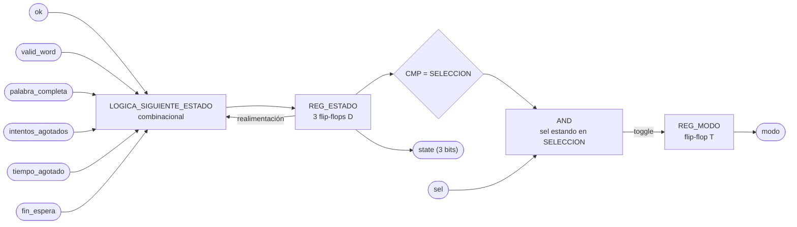

`clk` y `rst` entran a los dos registros aunque no se dibujen, por el mismo criterio del resto de
los diagramas del proyecto.

Del diagrama se lee que no hay lógica entre `REG_ESTADO` y la salida `state`, el registro es la
salida. Toda la combinacional del módulo está en `LOGICA_SIGUIENTE_ESTADO`, que son tres funciones
booleanas de nueve variables (tres de estado actual y seis de evento, `sel` no entra porque no
cambia el estado), y en la compuerta que habilita el conmutado de `modo`. Esa compuerta no recibe
`ok`, que es la razón del caso de borde descrito en la h).

Sobre el nivel de detalle que pide el método, un esquemático por compuertas dibujado a mano acá no
aporta nada. Esas tres funciones las sintetiza Vivado con un puñado de LUT, y el número exacto
depende de la optimización, no del dibujo. El equivalente honesto es el esquemático
post-síntesis que genera la herramienta, y esa captura es la que va como evidencia en el informe.
Queda pendiente confirmarle al profesor que ese reemplazo es aceptable, es la misma duda que
aplica a los doce módulos anteriores.

### j) Diagrama completo de conexiones del diseño

Ningún puerto de este módulo sale de la FPGA, así que no le corresponde ninguna línea del
`basys3.xdc`. Sus conexiones son las del instanciado dentro de CONTROL_JUEGO:

- `clk`, al reloj global de 100 MHz de la tarjeta.
- `rst`, a BTN_RST ya sincronizado, el mismo que llega a todos los demás módulos.
- `sel`, `ok`, desde M09_Botones.
- `valid_word`, desde M08_LFSR.
- `palabra_completa`, desde M07_Comparador-letra.
- `intentos_agotados`, desde M12_Contador-Intentos.
- `tiempo_agotado`, `fin_espera`, desde M03_Temporizador.
- `state`, hacia M02, M03, M04, M05, M06, M07, M08, M10, M11, M12 y REG_Letra-in.
- `modo`, hacia M03, M04, M08 y M11.

Las señales que sí cruzan al mundo físico pertenecen a los módulos del borde, los botones en
M09_Botones, los displays en M01_Marcador, el LED en M05_Estado, el buzzer en M02_Generador-Tono,
y los dos periféricos de bus con el PmodCLP y el puente USB-UART. Cada una está documentada en el
módulo que la maneja.

Acá el punto j) del método de diseño modular pide un diagrama de conexiones eléctricas por chips,
que está pensado para un montaje con circuitos integrados discretos en protoboard. En un diseño
que se sintetiza completo dentro de una sola Artix-7 no hay chips que alambrar, y la lista de
arriba es la traducción razonable. Es la otra mitad de la consulta pendiente con el profesor.

---

# M01 - Marcador

## Propósito

El módulo `M01_Marcador` se encarga de mostrar en los displays de 7 segmentos el tiempo restante de la partida y el número de partidas ganadas.

Recibe time desde `M03_Temporizador` y num_ganadas desde `M06_Ganadas`. Ambos valores se representan utilizando dos dígitos decimales, para un total de cuatro dígitos multiplexados.

---

## Entradas

* clk: reloj principal de la FPGA, de 100 MHz.
* rst: reinicio del módulo.
* time: tiempo restante de la partida, proveniente de `M03_Temporizador`.
* num_ganadas: número de partidas ganadas, proveniente de `M06_Ganadas`.

---

## Salidas

* seg[6:0]: patrón de los siete segmentos.
* an[3:0]: selección del dígito activo.
* dp: control del punto decimal.

La distribución propuesta es:

| Dígito | Valor               |
| ------ | ------------------- |
| `AN3`  | Decenas del tiempo  |
| `AN2`  | Unidades del tiempo |
| `AN1`  | Decenas de ganadas  |
| `AN0`  | Unidades de ganadas |

---

## f) Relación con otros módulos

time proviene directamente de `M03_Temporizador`, mientras que num_ganadas proviene de `M06_Ganadas`. `M01_Marcador` no modifica ninguno de estos valores, sino que únicamente realiza su conversión y despliegue.

El marcador se mantiene funcionando continuamente y no necesita señales de habilitación provenientes de la FSM.

La multiplexación utiliza únicamente el reloj principal de 100 MHz. Para cambiar entre los cuatro dígitos se genera internamente un pulso de habilitación tick_ref, evitando crear un segundo reloj físico dentro de la FPGA.

rst reinicia tanto el contador de refresco como el selector del dígito activo.

---

## g) Explicación de funcionamiento

Los valores time y `num_ganadas` se separan en decenas y unidades mediante lógica combinacional.

Para cada valor `x`:

$$
decenas = \left\lfloor \frac{x}{10} \right\rfloor
$$

$$
unidades = x - 10(decenas)
$$

De esta forma se obtienen cuatro valores BCD:

* time_decenas
* time_unidades
* win_decenas
* win_unidades

Un multiplexor selecciona cuál de estos cuatro dígitos se envía al decodificador BCD a 7 segmentos.

La selección depende de un registro de dos bits REG_SEL, que recorre continuamente los estados:

`00 → 01 → 10 → 11 → 00`

El cambio entre estados se produce mediante tick_ref, generado por `CONT_REFRESCO`.

Con un reloj de 100 MHz y un contador de 25 000 ciclos:

$$
f_{tick}=\frac{100\,000\,000}{25\,000}=4000\text{ Hz}
$$

Como existen cuatro dígitos, cada uno se refresca aproximadamente a:

$$
f_{digito}=\frac{4000}{4}=1000\text{ Hz}
$$

Esta frecuencia permite que visualmente los cuatro dígitos parezcan permanecer encendidos al mismo tiempo.

---

## h) Diseño

El módulo se implementa mediante un datapath sencillo compuesto por lógica combinacional y dos elementos secuenciales principales: CONT_REFRESCO y REG_SEL.

CONT_REFRESCO cuenta de 0 a 24999. Cuando llega al valor máximo, vuelve a cero y genera tick_ref durante un ciclo de reloj.

| Condición       | `count'`    | `tick_ref` |
| --------------- | ----------- | ---------- |
| `rst = 1`       | `0`         | `0`        |
| `count < 24999` | `count + 1` | `0`        |
| `count = 24999` | `0`         | `1`        |

REG_SEL cambia de estado únicamente cuando tick_ref = 1.

| `REG_SEL` | Siguiente valor con `tick_ref = 1` |
| --------- | ---------------------------------- |
| `00`      | `01`                               |
| `01`      | `10`                               |
| `10`      | `11`                               |
| `11`      | `00`                               |

El multiplexor de dígitos utiliza REG_SEL para seleccionar:

| `REG_SEL` | Valor seleccionado |
| --------- | ------------------ |
| `00`      | `win_unidades`     |
| `01`      | `win_decenas`      |
| `10`      | `time_unidades`    |
| `11`      | `time_decenas`     |

El mismo valor selecciona el ánodo correspondiente:

| `REG_SEL` | `an[3:0]` |
| --------- | --------- |
| `00`      | `1110`    |
| `01`      | `1101`    |
| `10`      | `1011`    |
| `11`      | `0111`    |

Suponiendo segmentos activos en bajo, el decodificador BCD a 7 segmentos utiliza:

| BCD    | Número | `abcdefg` |
| ------ | -----: | --------- |
| `0000` |      0 | `0000001` |
| `0001` |      1 | `1001111` |
| `0010` |      2 | `0010010` |
| `0011` |      3 | `0000110` |
| `0100` |      4 | `1001100` |
| `0101` |      5 | `0100100` |
| `0110` |      6 | `0100000` |
| `0111` |      7 | `0001111` |
| `1000` |      8 | `0000000` |
| `1001` |      9 | `0000100` |

El punto decimal no se utiliza, por lo que dp se mantiene apagado.

---

## i) Diagrama esquemático detallado del diseño


Este diseño mantiene un único dominio de reloj de `100 MHz`. `tick_ref` funciona únicamente como habilitación de conteo y no como un reloj independiente.

---

# M02 - Generador-Tono

## a) Nombre del módulo

M02_Generador-Tono

## b) Diagrama modular

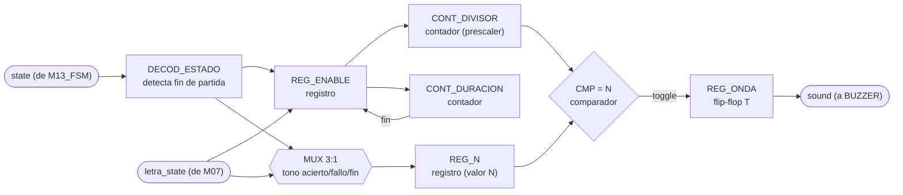

## c) Objetivo del módulo

Generar el tono del buzzer. Se dispara solo, con `letra_state` de M07_Comparador-letra para
distinguir acierto de fallo, y decodificando `state` para el tono de fin de partida cuando el
sistema entra a GANO, PERDIO_INTENTOS o PERDIO_TIEMPO. Son los tres sonidos distintos que pide el
enunciado.

## d) Entradas

- `clk`, `rst`.
- `state[2:0]`: estado actual, desde M13_FSM, de ahí saca la entrada a un estado de fin de
  partida.
- `letra_state[1:0]`: resultado de la última letra evaluada, desde M07_Comparador-letra. Se
  asume, siguiendo la convención de pulsos limpios que ya usan `sel`/`ok`/`valid_word` en el
  resto del proyecto, que M07 solo mantiene este valor en `01` (acierto) o `10` (fallo) durante
  **un ciclo de reloj**, y en `00` el resto del tiempo; `11` queda reservado para letra repetida
  y no dispara tono. **Este contrato queda pendiente de confirmar** contra la documentación real
  de M07_Comparador-letra cuando se escriba, porque hoy solo existe su diagrama modular.

## e) Salidas

- `sound`: onda cuadrada de audio, hacia BUZZER.

## f) Explicación de la relación con otros módulos

M02 no recibe órdenes puntuales de nadie ni le devuelve nada a ningún módulo M0X; es, junto con
M05_Estado, uno de los módulos más aislados del diseño, salida directa hacia BUZZER sin pasar por
CONTROL_JUEGO ni por ningún bus.

De `state` (M13_FSM) solo le importan tres de los seis códigos, GANO, PERDIO_INTENTOS y
PERDIO_TIEMPO; el resto (SELECCION, CARGA, JUEGO) es indistinguible para este módulo y no dispara
nada por sí solo. De `letra_state` (M07_Comparador-letra) solo le importan dos de los cuatro
códigos posibles, acierto y fallo; letra repetida no genera sonido, consistente con que el
enunciado dice que una letra repetida "se ignora sin penalizar", y M02 extiende ese silencio
también al buzzer.

M02 no sabe si el fin de partida fue victoria o alguna de las dos derrotas, decodifica los tres
estados de fin como un solo evento y usa el mismo tono para los tres. Esto es intencional: el
enunciado pide "tono distinto para acierto, error, y fin de partida", tres tonos, no cinco, así
que no hay necesidad de que M02 distinga la causa del fin de partida como sí lo hacen M04 y M11.

## g) Funcionamiento

El módulo vigila dos eventos en paralelo: la entrada a un estado de fin de partida (decodificado
de `state`) y un pulso de `letra_state` en acierto o fallo. Cualquiera de los dos, al ocurrir,
dispara un tono nuevo, con la entrada a fin de partida teniendo prioridad sobre un acierto o
fallo que llegara en el mismo ciclo (esto puede pasar de verdad: la última letra que completa la
palabra genera `letra_state = acierto` en M07 en el mismo ciclo en que `palabra_completa` mueve a
la FSM a GANO, así que hace falta una regla de prioridad y se eligió que suene el tono de fin, no
el de acierto, para que el jugador no pierda esa señal).

Al dispararse un tono, el módulo carga en `REG_N` el divisor de frecuencia que le corresponde
(uno distinto por cada uno de los tres tonos), reinicia el contador de duración desde cero, y
arranca `REG_ENABLE`. Mientras `REG_ENABLE` esté activo, un contador (`CONT_DIVISOR`) cuenta
ciclos de reloj y cada vez que alcanza el valor cargado en `REG_N` conmuta un flip-flop tipo T
(`REG_ONDA`), lo que genera una onda cuadrada de la frecuencia deseada, la misma técnica de
divisor de frecuencia que usa M03_Temporizador para bajar de 100 MHz a 1 Hz, aplicada aquí para
bajar de 100 MHz a un tono audible. Un segundo contador (`CONT_DURACION`) cuenta en paralelo
mientras `REG_ENABLE` está activo; cuando llega a la duración fija del tono, apaga
`REG_ENABLE` y el módulo vuelve a silencio hasta el próximo disparo.

La salida `sound` no es directamente `REG_ONDA`: se combina con `REG_ENABLE` (`sound = REG_ONDA
AND REG_ENABLE`) para que el buzzer quede en `0` franco entre tonos, en vez de quedarse
"congelado" en `1` si el último toggle antes de apagarse dejó la onda en alto. Un piezoeléctrico
pasivo con una tensión de continua sostenida no sueña nada pero sí puede degradarse con el tiempo,
así que forzar el silencio a `0` es la opción más segura y no cuesta hardware adicional, un único
AND de dos entradas.

## h) Diseño

### Detector de entrada a fin de partida

`DECOD_ESTADO` es puramente combinacional:

```
dec_fin = (state == GANO) | (state == PERDIO_INTENTOS) | (state == PERDIO_TIEMPO)
```

Como `dec_fin` es un nivel que se mantiene mientras dure el estado de fin (hasta 3 s, ver
M03_Temporizador), hace falta un detector de flanco para no quedarse re-disparando el tono cada
ciclo. Se registra `dec_fin` un ciclo (`dec_fin_prev`) y se genera un pulso de un ciclo:

| `dec_fin` (actual) | `dec_fin_prev` | `pulso_fin` |
|---|---|---|
| 0 | 0 | 0 |
| 0 | 1 | 0 |
| 1 | 0 | 1 |
| 1 | 1 | 0 |

`pulso_fin = dec_fin AND (NOT dec_fin_prev)`, la misma estructura de detector de flanco de subida
que usa M09_Botones sobre el valor ya estable de cada botón.

### Selección de disparo y de frecuencia (MUX 3:1)

Señal de disparo combinacional:

```
trig = pulso_fin OR (letra_state == 2'b01) OR (letra_state == 2'b10)
```

El `MUX 3:1` decide, con prioridad fin > acierto > fallo, qué valor de `N` se carga en `REG_N`
cuando `trig = 1`:

| `pulso_fin` | `letra_state` | Tono seleccionado | `N` cargado en `REG_N` |
|---|---|---|---|
| 1 | XX | FIN | `N_FIN` |
| 0 | 01 | ACIERTO | `N_ACIERTO` |
| 0 | 10 | FALLO | `N_FALLO` |
| 0 | 00 | (sin disparo) | `REG_N` conserva su valor |
| 0 | 11 | (sin disparo, repetida) | `REG_N` conserva su valor |

### REG_ENABLE y CONT_DURACION

`CONT_DURACION` es un contador que corre solo mientras `REG_ENABLE = 1`, y comparte una única
duración fija (`DUR_CYCLES`) para los tres tonos, ya que el diagrama modular solo contempla un
contador de duración y no un segundo mux para seleccionarla; distinguir los tonos únicamente por
frecuencia es suficiente para el propósito de este módulo y evita duplicar hardware de selección.

| `trig` | `REG_ENABLE` actual | `CONT_DURACION = DUR_CYCLES-1`? | `REG_ENABLE` siguiente | `CONT_DURACION` siguiente |
|---|---|---|---|---|
| 1 | X | X | 1 | 0 (reinicia, un disparo nuevo interrumpe al que estuviera sonando) |
| 0 | 0 | X | 0 | 0 |
| 0 | 1 | 0 | 1 | `CONT_DURACION + 1` |
| 0 | 1 | 1 | 0 | 0 |

### CONT_DIVISOR y REG_ONDA (generación de la onda cuadrada)

`CONT_DIVISOR` solo cuenta mientras `REG_ENABLE = 1`; en reposo, o justo al dispararse un `trig`
nuevo, se fuerza a 0 junto con `REG_ONDA`, para que cada tono arranque siempre desde silencio con
un flanco limpio en vez de heredar la fase del tono anterior:

| `trig` | `REG_ENABLE` | `CONT_DIVISOR = REG_N`? | `CONT_DIVISOR` siguiente | `REG_ONDA` siguiente |
|---|---|---|---|---|
| 1 | X | X | 0 | 0 |
| 0 | 0 | X | 0 | 0 (mantiene silencio) |
| 0 | 1 | 0 | `CONT_DIVISOR + 1` | `REG_ONDA` (sin cambio) |
| 0 | 1 | 1 | 0 | `NOT REG_ONDA` (toggle) |

Con esto la frecuencia de salida es `f = f_clk / (2 · (N + 1))`, la misma relación que usa
M03_Temporizador para su `tick_1Hz`, solo que acá el "período" de interés es audible en vez de
segundos.

### Valores de frecuencia y duración propuestos

Se exponen como `parameter` con valores de producción por defecto (no `localparam`), siguiendo el
principio ya usado en otros módulos del proyecto de dejar las constantes de tiempo overrideables
desde el testbench para simulación práctica en EDA Playground:

| Parámetro | Valor por defecto | Frecuencia resultante | `N` (18 bits) |
|---|---|---|---|
| `F_ACIERTO_HZ` | 1000 Hz | agudo, "positivo" | `N_ACIERTO = 49 999` |
| `F_FALLO_HZ` | 250 Hz | grave, "negativo" | `N_FALLO = 199 999` |
| `F_FIN_HZ` | 500 Hz | intermedio, distinguible de los otros dos | `N_FIN = 99 999` |
| `DUR_MS` | 150 ms | duración común a los tres tonos | `DUR_CYCLES = 14 999 999` (24 bits) |

`CONT_DIVISOR` necesita 18 bits para alcanzar 199 999 (el `N` más grande, el del tono más grave).
`CONT_DURACION` necesita 24 bits para alcanzar 14 999 999. Ambos anchos van con `$clog2` sobre los
parámetros, no fijos a mano, para que si el equipo ajusta las frecuencias o la duración el ancho
de los contadores se recalcule solo.

## i) Diagrama esquemático detallado (por compuertas lógicas)

```mermaid
flowchart LR
    STATEIN(["state"]) --> DECFIN["comparador<br/>dec_fin = OR de 3 igualdades"]
    DECFIN --> DPREV["D-FF<br/>dec_fin_prev"]
    CLK1(["clk"]) --> DPREV
    DECFIN --> ANDF["AND<br/>(dec_fin_prev invertido)"]
    DPREV --> ANDF
    ANDF --> PFIN["pulso_fin"]

    LST(["letra_state[1:0]"]) --> CMPA{"CMP = 01<br/>acierto"}
    LST --> CMPB{"CMP = 10<br/>fallo"}
    PFIN --> ORT["OR3<br/>trig"]
    CMPA --> ORT
    CMPB --> ORT
    ORT --> TRIG["trig"]

    PFIN --> MUXN{{"MUX 3:1<br/>N_FIN/N_ACIERTO/N_FALLO"}}
    CMPA --> MUXN
    CMPB --> MUXN
    MUXN --> DN["D-FF (bus)<br/>REG_N"]
    TRIG --> DN
    CLK1 --> DN

    TRIG --> ORE["OR<br/>REG_ENABLE next"]
    DUREND["CONT_DURACION = fin?"] --> ORE
    ORE --> DE["D-FF<br/>REG_ENABLE"]
    CLK1 --> DE
    DE --> CTEN_DUR["enable"]
    CTEN_DUR --> CNTDUR["CONT_DURACION<br/>contador"]
    CLK1 --> CNTDUR
    TRIG -->|clear| CNTDUR
    CNTDUR --> DUREND

    DE --> CTEN_DIV["enable"]
    CTEN_DIV --> CNTDIV["CONT_DIVISOR<br/>contador"]
    CLK1 --> CNTDIV
    TRIG -->|clear| CNTDIV
    CNTDIV --> CMPN{"CMP = REG_N"}
    DN --> CMPN
    CNTDIV -->|clear en match| CNTDIV
    CMPN -->|toggle| DONDA["D-FF T<br/>REG_ONDA"]
    CLK1 --> DONDA
    TRIG -->|clear| DONDA

    DONDA --> ANDOUT["AND"]
    DE --> ANDOUT
    ANDOUT --> SOUND(["sound"])
```

`clk` y `rst` entran a todo registro/contador del módulo aunque no se dibujen en cada elemento,
por el mismo criterio usado en el resto de los diagramas del proyecto; `rst` fuerza
`REG_ENABLE = 0`, `dec_fin_prev = 0`, `CONT_DIVISOR = 0`, `CONT_DURACION = 0` y `REG_ONDA = 0`,
dejando el buzzer en silencio tras cualquier reinicio, incluido `BTN_RST` a mitad de un tono.

---

# M03 - Temporizador

## a) Nombre del módulo

M03_Temporizador

## b) Diagrama modular

```mermaid
flowchart LR
    IN_STATE(["i_state (de FSM)"]) --> DECJ["FLANCO_JUEGO<br/>start, flanco de entrada a JUEGO"]
    IN_STATE --> DECFN["DEC_FIN<br/>nivel, en GANO o PERDIO"]
    IN_STATE --> DECF["FLANCO_FIN<br/>pulso_fin, flanco de entrada a GANO/PERDIO"]
    DECJ -->|"carga"| REG_T["REG_TIEMPO<br/>2 décadas BCD"]
    DECJ -->|"enciende"| REG_RUN["REG_RUNNING<br/>registro"]
    DECFN -->|"apaga running"| REG_RUN
    DECF -->|"reinicia a 00"| REG_T
    IN_MODO(["modo (de FSM)"]) --> MUX1{{"MUX 2:1<br/>tiempo inicial 60 / 45"}}
    MUX1 --> REG_T
    CNT_PRE["CONT_PRESCALER<br/>27 bits descendente"] --> CMP0{"CMP = 0<br/>tick_1hz"}
    CMP0 --> AND_EN["AND<br/>cten = running · tick_1hz"]
    REG_RUN --> AND_EN
    AND_EN -->|en| SUB1["DECREMENTADOR BCD<br/>con préstamo entre décadas"]
    REG_T --> SUB1
    SUB1 --> REG_T
    REG_T --> CMP2{"CMP = 00<br/>zero"}
    CMP2 -->|"apaga running"| REG_RUN
    CMP2 --> REG_TA["REG_TIEMPO_AGOTADO<br/>set: running · zero"]
    REG_RUN --> REG_TA
    DECJ -->|"limpia"| REG_TA
    DECF -->|"limpia"| REG_TA
    REG_TA --> OUT_FIN(["tiempo_agotado (a FSM)"])
    REG_T --> OUT_TIME(["tiempo (a M01)"])
    DECF -->|"reinicia"| CNT_ESPERA["CONT_ESPERA<br/>2 bits, satura en 3"]
    DECFN --> CNT_ESPERA
    CMP0 --> CNT_ESPERA
    CNT_ESPERA --> REG_FE["REG_FIN_ESPERA<br/>set: tercer tick en GANO/PERDIO"]
    DECJ -->|"limpia"| REG_FE
    DECF -->|"limpia"| REG_FE
    REG_FE --> OUT_ESPERA(["o_fin_espera (a FSM)"])
```

## c) Objetivo del módulo

Controla el tiempo disponible para la partida y el tiempo que se muestra el resultado. Al ver que
`i_state` entró a JUEGO, carga el tiempo inicial según el `modo` recibido y arranca la cuenta
regresiva. Al llegar a cero, avisa a la `FSM` con `tiempo_agotado`. Al ver que `i_state` entró a
GANO o a PERDIO, corta la cuenta regresiva de inmediato (la partida ya se resolvió), reinicia el
tiempo mostrado a 00 y cuenta tres pulsos de 1 Hz para levantar `o_fin_espera`, con lo que la
`FSM` vuelve a SELECCION. Entrega el tiempo restante en todo momento a `M01_Marcador` para su
despliegue.

## d) Entradas

- `clk`, `rst`.
- `i_state[2:0]`: estado actual, desde la `FSM`. M03 decodifica la entrada a JUEGO para arrancar
  la cuenta y la entrada a GANO/PERDIO para arrancar la espera de `o_fin_espera`. No hay un puerto
  `start` aparte: la `FSM` no manda señales puntuales a ningún módulo (ver `M13_FSM.md`, f), así
  que M03 se engancha del mismo `state` que ya se difunde, igual que hacen `M08_LFSR` y
  `M07_Comparador-letra` con la entrada a CARGA.
- `modo`: selecciona el modo de operación (0 fácil, 1 difícil), define el tiempo inicial a cargar.

El módulo tiene además el `parameter PRESCALER_RECARGA` (27 bits, por defecto `99_999_999`). Es
`parameter` y no `localparam` para que el testbench lo pueda achicar y simular una cuenta completa
sin esperar 100 000 000 ciclos por segundo.

## e) Salidas

- `tiempo[7:0]`: tiempo restante en BCD, `{decenas, unidades}`, hacia `M01_Marcador`.
- `tiempo_agotado`: indica a la `FSM` que la cuenta de la partida llegó a cero.
- `o_fin_espera`: indica a la `FSM` que ya pasó la espera mostrando el resultado en GANO o PERDIO.

## f) Explicación de la relación con otros módulos

M03 solo recibe `i_state` y `modo` de la `FSM`, y solo le responde a la `FSM` (`tiempo_agotado`,
`o_fin_espera`). El valor de tiempo en sí (`tiempo`) va aparte hacia `M01_Marcador` para su
despliegue. No tiene ninguna relación con M02, M04, M11 ni con ningún periférico de bus: vive
solo, aislado, dentro del subgraph TEMPORIZADOR. Es importante que M03 nunca se conecte con
M11_Transmisor-UART, porque el enunciado exige explícitamente que el tiempo restante no se
transmita por UART hacia la PC.

Las dos banderas que le entrega a la `FSM` tienen que valer 0 en el primer ciclo del estado en
que la `FSM` las consulta, `tiempo_agotado` en JUEGO y `o_fin_espera` en GANO/PERDIO. M03 detecta
el flanco de entrada en ese mismo primer ciclo, pero sus registros recién cambian al final del
ciclo, así que no puede limpiarlas "al entrar" al estado que las consulta. Las limpia antes, en
el flanco de un estado anterior del ciclo de la partida (ver g y h).

## g) Funcionamiento

Cuenta el tiempo mientras está habilitado (`running`). Al detectar el flanco de entrada a JUEGO
(`start`), M03 carga el tiempo inicial correspondiente al `modo` recibido y activa `running`.
Mientras `running` esté activa, cada pulso `tick_1hz` del prescaler decrementa el tiempo
restante en 1. Cuando el contador llega a 00, se levanta `tiempo_agotado` y se apaga `running`
automáticamente, ya no hay nada que contar.

`running` también se apaga, sin esperar a que el tiempo llegue a 0, apenas `i_state` entra a GANO
o a PERDIO: la partida ya se resolvió (palabra completa o sexto fallo) y no tiene sentido seguir
descontando en el fondo mientras el LCD muestra el resultado. En el mismo flanco de entrada a
GANO/PERDIO (`pulso_fin`) el tiempo mostrado se reinicia a 00, no se congela en el valor que
tenía, así que el jugador ve el resultado sin un número residual de la partida.

Por separado, en ese mismo `pulso_fin` M03 reinicia un segundo contador, `cont_espera`, que
cuenta los `tick_1hz` mientras el estado siga en GANO o PERDIO. Al tercer pulso levanta
`o_fin_espera`, y la `FSM` vuelve a SELECCION. El prescaler es uno solo y corre libre sin depender
del estado de la FSM, así que sirve para las dos cuentas a la vez.

Ciclo de vida de las dos banderas a lo largo de una partida:

| Evento | `tiempo_agotado` | `o_fin_espera` |
|---|---|---|
| `rst` | 0 | 0 |
| entrada a JUEGO (`start`) | 0 | 0 |
| tiempo llega a 00 corriendo | 1 | sin cambio |
| entrada a GANO/PERDIO (`pulso_fin`) | 0 | 0 |
| tercer `tick_1hz` en GANO/PERDIO | sin cambio | 1 |
| vuelta a SELECCION, CARGA | sin cambio (0) | sin cambio (1) |

`tiempo_agotado` se limpia en `pulso_fin`, así que ya vale 0 mucho antes de la siguiente entrada a
JUEGO. `o_fin_espera` se queda en 1 durante SELECCION y CARGA, donde la `FSM` no lo consulta, y se
limpia en el `start` de la partida siguiente, mucho antes de que la `FSM` pueda volver a un estado
de fin.

En la primera versión cada bandera se limpiaba solo en el flanco del estado que la consulta,
`tiempo_agotado` con `start` y `o_fin_espera` con `pulso_fin`. Eso funcionaba en la primera
partida después del reset, pero no en las siguientes. El registro recién baja al final del
primer ciclo del estado nuevo, y en ese ciclo la `FSM` todavía veía el 1 de la partida anterior.
Con `o_fin_espera`, desde la segunda partida GANO/PERDIO duraba un solo ciclo y el resultado no
se alcanzaba a ver. Con `tiempo_agotado`, después de perder por tiempo, la siguiente partida
pasaba de JUEGO a PERDIO en un ciclo, sin dejar jugar. Se encontró simulando `fsm.sv` y
`temporizador.sv` juntos durante varias partidas seguidas.

### Duraciones reales

El prescaler corre libre, así que la entrada a JUEGO o a GANO/PERDIO cae en un punto cualquiera
del segundo en curso, y el primer `tick_1hz` llega entre 1 ciclo y 1 s después. Por eso:

- La partida dura entre 59 y 60 s en fácil y entre 44 y 45 s en difícil. El display sí arranca
  mostrando 60 o 45.
- La espera en GANO/PERDIO dura entre 2 y 3 s, tres ticks donde el primero puede llegar casi de
  inmediato.

## h) Diseño

El tiempo restante se maneja en BCD (dos dígitos, decenas y unidades) en vez de binario puro,
para conectarlo directo al decodificador BCD→7 segmentos de M01_Marcador sin necesitar un
divisor por 10 adicional. El costo es usar dos contadores en cascada en vez de uno binario de 7
bits.

### Detección de flancos de estado

`start` es la señal interna `dec_juego & ~dec_juego_prev`, con `dec_juego = (i_state == JUEGO)`
y `dec_juego_prev` un flip-flop D del ciclo anterior, el mismo par registro-comparador que usa
`M11_Transmisor-UART` para sus propios pulsos de disparo. `dec_fin` es el nivel
`(i_state == GANO) || (i_state == PERDIO)`, y `pulso_fin = dec_fin & ~dec_fin_prev` su flanco de
subida.

### REG_RUNNING

Como no existe una entrada `detener`, la bandera `running` se apaga sola cuando el contador llega
a cero o cuando `i_state` está en GANO/PERDIO. `start` tiene prioridad total, y si no está en alto
`running_next = running AND NOT zero AND NOT dec_fin`:

| start | running | zero | dec_fin | running_next |
|---|---|---|---|---|
| 1 | X | X | X | 1 |
| 0 | 0 | X | X | 0 |
| 0 | 1 | 0 | 0 | 1 |
| 0 | 1 | 1 | X | 0 |
| 0 | 1 | X | 1 | 0 |

`running_next = start + running · zero' · dec_fin'`.

### CONT_PRESCALER

El `tick_1hz` se genera con un contador binario de 27 bits que cuenta en modo descendente desde
`PRESCALER_RECARGA = 99_999_999`. Cuando llega a 0, `tick_1hz = (prescaler_cnt == 0)` vale 1
durante ese ciclo y el contador se recarga, así que el periodo es exactamente 100 000 000 ciclos,
1 s a 100 MHz. El comparador contra 0 es un NOR de reducción de 27 bits, que en la FPGA se
resuelve con un par de LUT en cascada. Corre libre desde el reset, sin reiniciarse con la entrada
a JUEGO ni con la entrada a GANO/PERDIO, así que las dos cuentas comparten el mismo `tick_1hz`
sin estorbarse.

### REG_TIEMPO y decrementador BCD

El multiplexor de valor inicial selecciona entre dos constantes fijas en BCD, `6 0` para fácil y
`4 5` para difícil (ver `M13_FSM.md`). El habilitador de conteo es `cten = running · tick_1hz`, y
`zero = (tiempo_dec == 0) · (tiempo_uni == 0)`. Tabla de prioridad del registro:

| Condición (prioridad descendente) | `tiempo_dec'` | `tiempo_uni'` |
|---|---|---|
| `rst` | 0 | 0 |
| `start` | inicial según `modo` | inicial según `modo` |
| `pulso_fin` | 0 | 0 |
| `cten · zero'` y `tiempo_uni = 0` | `tiempo_dec - 1` | 9 |
| `cten · zero'` y `tiempo_uni ≠ 0` | `tiempo_dec` | `tiempo_uni - 1` |
| resto | `tiempo_dec` | `tiempo_uni` |

El `zero'` en la condición de decremento evita que la cuenta dé la vuelta a 99 en el mismo ciclo
en que llega a 00, antes de que `running` alcance a apagarse. `start` y `pulso_fin` nunca
coinciden, porque `dec_juego` y `dec_fin` son estados mutuamente excluyentes de la FSM.

### REG_TIEMPO_AGOTADO

| Condición (prioridad descendente) | `tiempo_agotado'` |
|---|---|
| `rst` | 0 |
| `start + pulso_fin` | 0 |
| `running · zero` | 1 |
| resto | `tiempo_agotado` |

Se levanta con `running · zero` y no con `zero` solo, porque después del reset el tiempo vale 00 y
la bandera quedaría en un falso "agotado" antes de cualquier partida. El clear con `pulso_fin` es
el que evita que la `FSM` vea el 1 viejo en el primer ciclo de JUEGO de la partida siguiente (ver
g). El de `start` quedó del diseño anterior y ahora es redundante, pero no estorba.

### CONT_ESPERA y REG_FIN_ESPERA

`fin_espera` cuenta pulsos en vez de comparar contra cero. `cont_espera` es un registro de
`$clog2(ESPERA_S + 1) = 2` bits, con `ESPERA_S = 3`:

| Condición (prioridad descendente) | `cont_espera'` |
|---|---|
| `rst + pulso_fin` | 0 |
| `dec_fin · tick_1hz · (cont_espera ≠ 3)` | `cont_espera + 1` |
| resto | `cont_espera` |

Satura en 3 para no dar la vuelta si la FSM tardara en consumir `o_fin_espera`.

| Condición (prioridad descendente) | `o_fin_espera'` |
|---|---|
| `rst` | 0 |
| `pulso_fin + start` | 0 |
| `dec_fin · tick_1hz · (cont_espera = 2)` | 1 |
| resto | `o_fin_espera` |

La bandera sube en el mismo ciclo en que `cont_espera` pasa de 2 a 3, o sea con el tercer tick.
El clear con `start` es el que evita que la `FSM` vea el 1 viejo en el primer ciclo de GANO/PERDIO
de la partida siguiente (ver g). El de `pulso_fin` quedó del diseño anterior y ahora es
redundante, pero no estorba.

## i) Diagrama esquemático detallado (por compuertas lógicas)

```mermaid
flowchart LR
    STATEIN(["i_state"]) --> DECJ["comparador<br/>dec_juego = JUEGO"]
    DECJ --> DJP["D-FF<br/>dec_juego_prev"]
    CLK1(["clk"]) --> DJP
    DECJ --> ANDJ["AND (prev invertido)"]
    DJP --> ANDJ
    ANDJ --> START(["start"])

    STATEIN --> DECF["comparador<br/>dec_fin = GANO o PERDIO"]
    DECF --> DFP["D-FF<br/>dec_fin_prev"]
    CLK1 --> DFP
    DECF --> ANDF["AND (prev invertido)"]
    DFP --> ANDF
    ANDF --> PULSOFIN(["pulso_fin"])

    ZERO(["zero<br/>(tiempo = 00, NOR8)"]) --> NOT1["NOT"]
    DECF --> NOT2["NOT"]
    RUNQ["running (Q)"] --> AND1["AND3"]
    NOT1 --> AND1
    NOT2 --> AND1
    AND1 --> OR1["OR2"]
    START --> OR1
    OR1 --> D1["D-FF<br/>running"]
    CLK1 --> D1
    D1 --> RUNQ

    PRE(["prescaler_cnt<br/>27 bits"]) --> NOR27["NOR27<br/>(reducción)"]
    NOR27 --> TICK1HZ(["tick_1hz"])

    RUNQ --> ANDTA["AND2<br/>running · zero"]
    ZERO --> ANDTA
    START --> ORTA["OR2<br/>clear"]
    PULSOFIN --> ORTA
    ANDTA -->|set| D2["D-FF<br/>tiempo_agotado"]
    ORTA -->|clear| D2
    CLK1 --> D2
    D2 --> OUTFIN(["tiempo_agotado"])

    PULSOFIN --> CE_RST["clear"]
    TICK1HZ --> CE_EN["AND<br/>dec_fin · tick_1hz"]
    DECF --> CE_EN
    CE_EN --> CE_CNT["CONT_ESPERA<br/>2 bits, satura en 3"]
    CE_RST --> CE_CNT
    CLK1 --> CE_CNT
    CE_CNT --> CE_CMP{"CMP = 2"}
    CE_CMP --> CE_SET["AND<br/>set"]
    CE_EN --> CE_SET
    START --> ORFE["OR2<br/>clear"]
    PULSOFIN --> ORFE
    CE_SET -->|set| CE_D["D-FF<br/>fin_espera"]
    ORFE -->|clear| CE_D
    CLK1 --> CE_D
    CE_D --> OUTESPERA(["o_fin_espera"])
```

`NOR8` representa la compuerta de reducción que detecta "todo el registro de tiempo en 0"
(8 bits de las dos décadas BCD, la señal `zero`), y `NOR27` la que genera `tick_1hz` a partir del
prescaler. En la implementación real las dos son árboles de compuertas de pocas entradas en
cascada, no una sola compuerta de 8 o 27 entradas. El decrementador BCD de `REG_TIEMPO` no se
dibuja por compuertas, está descrito por su tabla en la h).

---

# M04 - Mostrar LCD

## a) Nombre del módulo

M04_Mostrar-LCD

## Cambios respecto al diseño original

Esta versión reemplaza el diseño original (`show` como pulso de la `FSM` principal, mux 2:1) por
la arquitectura de nivel 3: `M13_FSM` ya no manda órdenes puntuales, solo difunde `state` (3 bits)
y `modo`. M04 decodifica `state` por su cuenta para saber cuál de las cuatro pantallas pintar
(selección, palabra en juego, ganó, perdió) y dispara su propio redibujado. Se mantienen la FSM
interna de 4 estados (IDLE/HOME/SEND/WAIT) y el protocolo de bus byte a byte del diseño original.

Cambios en los puertos respecto a ese diseño:

- Se quitó `letra_in` y se agregaron `word`/`word_length`, del mismo origen que ya consultan
  `M07_Comparador-letra` y `M11_Transmisor-UART`: `REG_Palabra-escogida`. Redibujar la palabra con
  varias letras ya reveladas requiere la palabra secreta entera, no solo la última letra
  recibida. Con `mascara` (bitmap de posiciones reveladas, sin identidad de letra) y `letra_in` no
  alcanza para pintar, por ejemplo, dos letras distintas reveladas en posiciones distintas.
- Se agregó `intentos`, desde `M12_Contador-Intentos`, para mostrar en la pantalla de juego los
  intentos que le quedan al jugador.
- La salida abstracta `word/Modo` se concretó en la interfaz de bus de `PERIFERICO_LCD`
  (`o_addr`, `o_write_enable`, `o_wdata`, `i_rdata`).

Y en las pantallas: como `M13_FSM` juntó PERDIO_INTENTOS y PERDIO_TIEMPO en un solo PERDIO, el LCD
ya no puede distinguir la causa y muestra un único "PERDISTE". La causa la reporta
`M11_Transmisor-UART` a la PC.

## b) Diagrama modular

```mermaid
flowchart LR
    IN_STATE(["i_state (de M13_FSM)"]) --> CMP_CAMBIO{"CMP<br/>actual ≠ foto"}
    IN_MODO(["i_modo (de M13_FSM)"]) --> CMP_CAMBIO
    IN_MASC(["i_mascara (de M07)"]) --> CMP_CAMBIO
    IN_INT(["i_intentos (de M12)"]) --> CMP_CAMBIO
    IN_RD(["i_rdata: busy, done (de PERIFERICO_LCD)"]) --> FSM_LCD
    CMP_CAMBIO -->|cambio| FSM_LCD["FSM_LCD<br/>IDLE / HOME / SEND / WAIT"]
    FSM_LCD -->|"captura"| REG_FOTO["REG_FOTO<br/>state, modo, mascara, intentos, last_pos"]
    IN_STATE --> REG_FOTO
    IN_MODO --> REG_FOTO
    IN_MASC --> REG_FOTO
    IN_INT --> REG_FOTO
    REG_FOTO --> CMP_CAMBIO
    FSM_LCD -->|"reinicia / incrementa"| CNT_POS["CONT_POSICION<br/>pos, 4 bits"]
    CNT_POS --> CMP_FIN{"CMP<br/>pos = last_pos"}
    REG_FOTO --> CMP_FIN
    CMP_FIN --> FSM_LCD
    REG_FOTO --> ROM_TXT["ROM_TEXTO<br/>MODO / GANASTE / PERDISTE"]
    CNT_POS --> ROM_TXT
    REG_FOTO --> GEN_JUEGO["PANTALLA_JUEGO<br/>letra o _ , sufijo I:n"]
    CNT_POS --> GEN_JUEGO
    IN_WORD(["i_word / i_word_length (de REG_Palabra-escogida)"]) --> GEN_JUEGO
    ROM_TXT --> MUX1{{"MUX 2:1<br/>texto fijo / juego"}}
    GEN_JUEGO --> MUX1
    REG_FOTO --> MUX1
    MUX1 --> BUS_OUT["LOGICA_BUS<br/>dirección, write_enable, wdata"]
    FSM_LCD --> BUS_OUT
    BUS_OUT --> OUT_LCD(["o_addr / o_write_enable / o_wdata (a PERIFERICO_LCD)"])
```

## c) Objetivo del módulo

Prepara la información del juego que debe mostrarse en el LCD y se la entrega al periférico LCD
por el bus. Decodifica `state` para saber cuál pantalla toca (selección de modo, palabra en juego,
ganó, perdió), compone el mensaje a partir de `modo`, `mascara`, `intentos` y la palabra escogida
(`word`, `word_length`), y lo escribe carácter por carácter en `PERIFERICO_LCD`.

## d) Entradas

- `clk`, `rst`.
- `i_state[2:0]`: estado actual del juego, desde `M13_FSM`. Decide cuál pantalla se pinta y
  dispara el redibujado al cambiar.
- `i_modo`: modo actual del juego, desde `M13_FSM`. 0 FACIL, 1 DIFICIL.
- `i_word[95:0]`: palabra escogida, 12 letras en ASCII empacadas, la letra 0 en los bits bajos
  (`i_word[pos*8 +: 8]`). `REG_Palabra-escogida` guarda cada letra como código de 5 bits (0 a 25),
  así que en `top.sv` hay un adaptador combinacional que suma `8'h41` a cada código antes de
  entrar a M04.
- `i_word_length[3:0]`: cuántas posiciones de `i_word` son válidas, `word[63:60]` de
  `REG_Palabra-escogida`.
- `i_mascara[11:0]`: posiciones ya reveladas de la palabra, desde `M07_Comparador-letra`. Decide
  cuáles posiciones de `i_word` se pintan y cuáles quedan como guion bajo.
- `i_intentos[2:0]`: fallos acumulados de la partida (0 a 6), desde `M12_Contador-Intentos`.
- `i_rdata[31:0]`: lectura del bus de `PERIFERICO_LCD` en la dirección que M04 está poniendo en
  `o_addr`. De ahí saca `busy` y `done`.

## e) Salidas

- `o_addr[1:0]`: dirección del registro de `PERIFERICO_LCD` que se escribe o se lee.
- `o_write_enable`: habilita la escritura en ese ciclo.
- `o_wdata[31:0]`: dato o comando escrito en `PERIFERICO_LCD`.

## f) Explicación de la relación con otros módulos

`M13_FSM` solo difunde `state` y `modo`, y M04 decodifica `state` por su cuenta para saber cuál
pantalla pintar, sin que la FSM le ordene nada puntual. `M07_Comparador-letra` le entrega
`mascara`, `M12_Contador-Intentos` le entrega `intentos`, y `REG_Palabra-escogida` le entrega
`word`/`word_length` (pasando por el adaptador a ASCII de `top.sv`), todos necesarios para
componer la pantalla de juego.

La salida no llega directo al LCD. M04 es el maestro del bus de 32 bits de `PERIFERICO_LCD`:
escribe en `REG_CTRL_ESTADO` y `REG_DATOS`, y lee de vuelta los bits `busy` y `done` para
sincronizarse con el HD44780 del PmodCLP. El mapa que usa, y que coincide con `periferico_lcd.sv`:

| Dirección | Registro | Bits |
|---|---|---|
| `00` | `REG_CTRL_ESTADO` | escritura: bit 0 `start` (W1P), bit 1 `rs`, bit 2 `clear` (W1P), bit 3 `home` (W1P); lectura: bit 8 `busy`, bit 9 `done` (pulso de un ciclo) |
| `01` | `REG_DATOS` | bits 7:0, carácter a escribir |

No tiene relación directa con M01, M02, M05, M06, M08, M09, M10 ni M11: además de la FSM, M07, M12
y `REG_Palabra-escogida`, su única otra conexión es el periférico LCD.

## g) Funcionamiento

M04 es una pequeña FSM que traduce cada cambio de lo que hay que mostrar en una ráfaga de
transacciones de bus hacia `PERIFERICO_LCD`. Al detectar el cambio, primero escribe `clear` y
`home` a la vez en `REG_CTRL_ESTADO`, para borrar lo que haya quedado de un mensaje anterior más
largo y llevar el cursor al inicio, y espera el `done` de ese comando. Luego, carácter por
carácter, escribe el byte en `REG_DATOS`, pulsa `start` con `rs=1` (dato, no comando) y espera
`done` antes de pasar al siguiente.

Pantallas, todas en la primera línea de 16 caracteres del LCD:

| `state` | Mensaje | Largo |
|---|---|---|
| SELECCION, `modo=0` | `MODO: FACIL` | 11 |
| SELECCION, `modo=1` | `MODO: DIFICIL` | 13 |
| CARGA | no tiene pantalla propia, se queda la de selección | — |
| JUEGO | palabra en 0..11 más ` I:n` en 12..15 | 16 |
| GANO | `GANASTE` | 7 |
| PERDIO | `PERDISTE` | 8 |

En la pantalla de juego, cada posición `p < word_length` muestra la letra si `mascara[p]=1` o `_`
si no. Las posiciones de `word_length` a 11 van en blanco, y las cuatro últimas llevan un sufijo
fijo con los intentos restantes, `" I:"` y un dígito de `6` a `0`. El sufijo va siempre en 12..15
sin importar el largo de la palabra, que es de 12 letras como máximo, así que nunca se pisan. Por
ejemplo, con la palabra `CASA`, la `A` revelada y un fallo: `_A_A         I:5`.

El disparo de redibujado no es un pulso `show` externo. M04 guarda una "foto" de lo que está
mostrando y la compara en cada ciclo contra las entradas actuales. `cambio` vale 1 si:

- `state` es distinto al de la foto, o
- se está en SELECCION y `modo` cambió, o
- se está en JUEGO y cambió `mascara` o `intentos`.

`intentos` entra aparte de `mascara` porque una letra incorrecta no revela ninguna posición, y
sin esa condición un fallo nunca redibujaría el contador. Desde IDLE se arranca un envío solo si
`cambio=1`, `state` no es CARGA y `busy=0`. El `busy` evita escribirle al periférico mientras
todavía corre la inicialización del HD44780 después del reset. La foto se toma justo al arrancar
el envío, así que si el contenido vuelve a cambiar a media ráfaga (otra letra llega mientras el
LCD todavía imprime la anterior), el mensaje en curso se termina completo con la foto vieja,
`cambio` sigue en 1, y apenas vuelve a IDLE arranca otra ráfaga con lo más reciente. Nunca queda
una pantalla mezclada.

Después del reset la foto guarda `state = 111`, un código que la FSM no usa, así que el primer
ciclo libre ya ve `cambio=1` y pinta la pantalla de selección apenas el periférico termina su
inicialización.

## h) Diseño

El módulo se modela como una máquina de Moore de 4 estados: `IDLE`, `HOME`, `SEND`, `WAIT`, con un
bit auxiliar `byte_step` que divide `HOME` y `SEND` en dos sub-pasos.

Tabla de transición de estados:

| Estado actual | Condición | Estado siguiente | Efecto |
|---|---|---|---|
| IDLE | `cambio · (state ≠ CARGA) · busy'` | HOME | `pos=0`, `byte_step=0`, captura la foto |
| IDLE | resto | IDLE | |
| HOME, `byte_step=0` | X | HOME | escribe `clear`+`home`, `byte_step=1` |
| HOME, `byte_step=1` | `done=0` | HOME | |
| HOME, `byte_step=1` | `done=1` | SEND | `byte_step=0` |
| SEND, `byte_step=0` | X | SEND | escribe el carácter en `REG_DATOS`, `byte_step=1` |
| SEND, `byte_step=1` | X | WAIT | pulsa `start` con `rs=1`, `byte_step=0` |
| WAIT | `done=0` | WAIT | |
| WAIT | `done=1 · (pos = last_pos)` | IDLE | |
| WAIT | `done=1 · (pos ≠ last_pos)` | SEND | `pos = pos+1` |

Codificación de estado (2 bits, `S1 S0`): `IDLE=00`, `HOME=01`, `SEND=10`, `WAIT=11`.

`REG_DATOS` y `REG_CTRL_ESTADO` son direcciones distintas del mismo bus, así que escribir el byte y
pulsar `start`/`rs` no caben en el mismo ciclo. Por eso `SEND` usa `byte_step`: el primer
sub-paso escribe `REG_DATOS` y el segundo pulsa `start`/`rs` en `REG_CTRL_ESTADO`. `HOME` reutiliza
el mismo bit para su espera: en el primer sub-paso escribe `clear`/`home` y en el segundo ya no
toca el bus, solo espera `done`. Así se evita un quinto estado y la codificación se queda en 2
bits.

En el diseño original `HOME` pasaba a `SEND` sin esperar nada, suponiendo que `PERIFERICO_LCD`
absorbía la espera larga del `clear`/`home`. `tb_mostrar_lcd.sv` mostró en simulación que no era
así: el primer byte del mensaje se pisaba con el propio comando en curso y el mensaje salía
corrido una posición ("MODO: FACIL" salía como "ODO: FACIL "). Por eso `HOME` espera `done` igual
que `WAIT`.

`done` es un pulso de un ciclo en el bit 9 de `REG_CTRL_ESTADO`, y la lectura del bus depende de
`o_addr`. Por eso en los ciclos de espera (`HOME` con `byte_step=1` y `WAIT`) la dirección se deja
en `00`, la dirección por defecto de la lógica de salida, para no perder ese pulso.

### Foto (REG_FOTO)

Al pasar de IDLE a HOME se capturan `act_state`, `act_modo`, `act_mascara`, `act_intentos` y
`act_last_pos`, este último calculado una sola vez con la tabla de largos de la g) menos uno:

| `state` | `last_pos` |
|---|---|
| SELECCION, `modo=0` | 10 |
| SELECCION, `modo=1` | 12 |
| JUEGO | 15 |
| GANO | 6 |
| PERDIO | 7 |

Todo el envío se compone desde la foto, no desde las entradas en vivo. La excepción es
`i_word`/`i_word_length`, que se leen directo porque `REG_Palabra-escogida` solo cambia en CARGA,
que no tiene pantalla, así que no pueden cambiar a media ráfaga de JUEGO.

### Contador de posición y fuente del carácter

`pos` es de 4 bits, alcanza las 16 posiciones del PmodCLP. Se reinicia al arrancar el envío y se
incrementa cada vez que `WAIT` recibe `done` sin haber llegado a `last_pos`.

El byte a enviar lo decide un multiplexor 2:1 según `act_state`:

- Pantallas de texto fijo (SELECCION, GANO, PERDIO): una ROM de texto indexada por
  (`act_state`, `act_modo`, `pos`), `f_byte` en el código. Se usa una ROM en vez de lógica
  dedicada por ser mensajes fijos de longitud conocida, la forma estándar de guardar texto
  constante.
- Pantalla de JUEGO, `f_byte_juego` en el código:

| Condición sobre `pos` | Carácter |
|---|---|
| `pos < word_length` y `mascara[pos]=1` | `i_word[pos*8 +: 8]` |
| `pos < word_length` y `mascara[pos]=0` | `_` |
| `word_length ≤ pos < 12` | espacio |
| `pos = 12` | espacio |
| `pos = 13` | `I` |
| `pos = 14` | `:` |
| `pos = 15` | dígito de intentos restantes |

El dígito sale de una tabla directa sobre los fallos acumulados, en vez de un restador `6 -
intentos` seguido de la suma de `"0"`. Son solo 7 valores posibles, porque `M12_Contador-Intentos`
satura en 6:

| `intentos` | 0 | 1 | 2 | 3 | 4 | 5 | 6 |
|---|---|---|---|---|---|---|---|
| dígito | `6` | `5` | `4` | `3` | `2` | `1` | `0` |

### Lógica de salida al bus

| Estado | `o_addr` | `o_write_enable` | `o_wdata` |
|---|---|---|---|
| IDLE, WAIT | `00` | 0 | 0 |
| HOME, `byte_step=0` | `00` | 1 | bit 2 `clear` = 1, bit 3 `home` = 1 |
| HOME, `byte_step=1` | `00` | 0 | 0 |
| SEND, `byte_step=0` | `01` | 1 | bits 7:0 = carácter |
| SEND, `byte_step=1` | `00` | 1 | bit 0 `start` = 1, bit 1 `rs` = 1 |

## i) Diagrama esquemático detallado (por compuertas lógicas)

```mermaid
flowchart LR
    S1Q["S1 (Q)"] --> NSL["Lógica de<br/>siguiente estado<br/>(AND/OR/NOT)"]
    S0Q["S0 (Q)"] --> NSL
    BSQ["byte_step (Q)"] --> NSL
    CAMBIO(["cambio"]) --> ARR["AND3<br/>cambio · no CARGA · busy'"]
    NOCARGA(["state ≠ CARGA"]) --> ARR
    BUSY(["busy"]) --> NOTB["NOT"]
    NOTB --> ARR
    ARR --> NSL
    DONE(["done"]) --> NSL
    POSEND(["pos = last_pos"]) --> NSL
    NSL --> D1["D-FF S1"]
    NSL --> D2["D-FF S0"]
    NSL --> D3["D-FF byte_step"]
    CLK(["clk"]) --> D1
    CLK --> D2
    CLK --> D3
    D1 --> S1Q
    D2 --> S0Q
    D3 --> BSQ
    S1Q --> DEC["DECOD 2:4<br/>(estados)"]
    S0Q --> DEC
    DEC --> CAPT(["captura foto (IDLE → HOME)"])
    DEC --> CTEN(["enable contador pos"])
    DEC --> BUSOUT(["lógica de bus (tabla h)"])
    BSQ --> BUSOUT
```

`cambio` es el OR de tres comparadores de igualdad negados contra la foto (`state`, `modo`
habilitado por SELECCION, `mascara`/`intentos` habilitados por JUEGO). La ROM de texto y el
generador de la pantalla de juego no se dibujan por compuertas, están descritos por sus tablas en
la h).

---

# M05 - Estado

## Propósito

El módulo M05_Estado se encarga de representar visualmente el estado actual del sistema mediante los LEDs disponibles en la FPGA.

Recibe desde la FSM el código correspondiente al estado actual del juego y lo transforma mediante lógica combinacional en el patrón necesario para encender los LEDs de estado.

---

## Entradas

* clk: reloj principal de la FPGA, de 100 MHz.
* rst: señal de reinicio del módulo.
* state: código correspondiente al estado actual de la FSM.

---

## Salidas

* state_led: patrón de salida utilizado para representar el estado actual mediante los LEDs físicos de la FPGA.

La cantidad de bits utilizada para state_led dependerá de la cantidad de estados que finalmente se deseen representar.

---

## f) Relación con otros módulos

La entrada state proviene directamente de la FSM principal . Cada vez que la FSM cambia de estado, M05_Estado recibe el nuevo código y actualiza la representación visual correspondiente.

El módulo no interviene en las transiciones de la FSM y tampoco genera señales de control hacia otros módulos. Su función es únicamente mostrar información al usuario.

La señal state se almacena en REG_ESTADO para mantener una representación estable del estado recibido. Posteriormente, este registro alimenta un decodificador combinacional encargado de transformar el código de estado en el patrón necesario para los LEDs.

La señal rst permite colocar REG_ESTADO en un estado conocido después de un reinicio general del sistema.

---

## g) Explicación de funcionamiento

El funcionamiento del módulo consiste en registrar el código proveniente de la FSM y convertirlo en una representación visual.

En cada flanco positivo del reloj, REG_ESTADO almacena el valor recibido desde la FSM. Posteriormente, DECOD_ESTADO evalúa este valor y genera el patrón correspondiente en state_led.

El uso de un registro intermedio permite mantener estable la salida visual entre ciclos de reloj y separa el estado generado por la FSM de la lógica física encargada de controlar los LEDs.

La relación general es:

FSM → REG_ESTADO → DECOD_ESTADO → LED_S

El número de patrones necesarios dependerá directamente de la cantidad de estados definidos en la FSM. Cada código debe asociarse con una salida única o suficientemente distinguible para facilitar la identificación visual del estado actual durante el funcionamiento y las pruebas del sistema.

---

## h) Diseño

El módulo se compone de dos bloques principales: REG_ESTADO y DECOD_ESTADO.

REG_ESTADO es un registro síncrono encargado de almacenar el código recibido desde la FSM. Cuando rst se encuentra activo, el registro vuelve al código correspondiente al estado inicial del sistema.

Su comportamiento general es:

| rst | state                  | Estado siguiente de REG_ESTADO |
| --- | ---------------------- | ------------------------------ |
| 1   | X                      | Estado inicial                 |
| 0   | Valor actual de la FSM | state                          |

DECOD_ESTADO corresponde a lógica combinacional. Su entrada es el contenido de REG_ESTADO y su salida es el patrón aplicado a los LEDs.

La tabla exacta de decodificación depende de la codificación definitiva utilizada por la FSM. De manera general:

| Estado almacenado    | Salida state_led       | Significado             |
| -------------------- | ----------------------- | ----------------------- |
| Estado inicial       | Patrón 1               | Sistema en espera       |
| Selección de modo    | Patrón 2               | Selección de dificultad |
| Selección de palabra | Patrón 3               | Preparación de partida  |
| Juego activo         | Patrón 4               | Partida en ejecución    |
| Resultado            | Patrón 5               | Resultado de la partida |
| Otro estado definido | Patrón correspondiente | Según la FSM            |

No se requiere una máquina de estados adicional dentro de M05, ya que el estado del sistema ya es determinado por la FSM principal.

---

## i) Diagrama esquemático detallado del diseño

```mermaid
flowchart LR

    STATE(["state<br/>desde FSM"]) --> REG["REG_ESTADO"]

    CLK(["clk 100 MHz"]) --> REG
    RST(["rst"]) --> REG

    REG -->|"estado almacenado"| DEC["DECOD_ESTADO"]

    DEC -->|"patrón de LEDs"| OUT(["state_led"])
```

El módulo utiliza un único elemento secuencial, REG_ESTADO, mientras que DECOD_ESTADO se implementa como lógica combinacional.

Todo el módulo opera utilizando el reloj principal de 100 MHz y no necesita relojes derivados ni señales adicionales de habilitación.

---

# M06 - Ganadas

## Propósito

El módulo M06_Ganadas se encarga de contabilizar el número de partidas ganadas durante la ejecución del sistema.

Recibe desde la FSM una señal de incremento cada vez que una partida termina con resultado favorable y mantiene almacenado el total acumulado hasta que se produce un reinicio general.

El valor resultante se envía hacia M01_Marcador para su representación en los displays de 7 segmentos.

---

## Entradas

* clk: reloj principal de la FPGA, de 100 MHz.
* rst: señal de reinicio del módulo.
* count: pulso proveniente de la FSM que indica que debe registrarse una nueva partida ganada.

---

## Salidas

* num_ganadas: número acumulado de partidas ganadas, enviado hacia M01_Marcador.

---

## f) Relación con otros módulos

La entrada count proviene directamente de la FSM principal del bloque CONTROL_JUEGO. La FSM genera este pulso únicamente cuando una partida ha sido completada satisfactoriamente y debe incrementarse el marcador de victorias.

M06_Ganadas recibe dicho pulso y aumenta en una unidad el valor almacenado en CONT_GANADAS.

El valor acumulado se entrega mediante num_ganadas hacia M01_Marcador, donde posteriormente se divide en decenas y unidades para mostrarse en los displays de 7 segmentos.

El módulo no interviene en las decisiones de la FSM y tampoco modifica el flujo de la partida. Su única función es almacenar el número de victorias obtenidas.

La señal rst reinicia el contador acumulado a cero.

---

## g) Explicación de funcionamiento

El funcionamiento del módulo se basa en un contador ascendente.

Mientras count permanezca inactivo, el valor almacenado no cambia. Cuando count se activa durante un ciclo de reloj, el contador aumenta en una unidad.

La operación general puede expresarse como:

num_ganadas siguiente = num_ganadas + 1

cuando count = 1.

Si count = 0, el valor actual se conserva.

Debido a que el marcador únicamente necesita representar valores entre 00 y 99, el contador puede limitarse al mismo rango.

Una vez alcanzado el valor máximo de 99, se recomienda mantener el contador saturado para evitar que continúe incrementándose y produzca un valor fuera del rango representable por M01_Marcador.

Por tanto, si el contador ya contiene 99 y llega un nuevo pulso count, su valor permanece en 99.

---

## h) Diseño

El módulo se compone principalmente de CONT_GANADAS, un contador ascendente síncrono, y de REG_SALIDA, encargado de entregar de forma estable el valor acumulado hacia la salida del módulo.

CONT_GANADAS incrementa su contenido únicamente cuando count se encuentra activo.

Su comportamiento general es:

| rst | count | Valor actual | Valor siguiente |
| --- | ----- | ------------ | --------------- |
| 1   | X     | X            | 0               |
| 0   | 0     | N            | N               |
| 0   | 1     | N < 99       | N + 1           |
| 0   | 1     | 99           | 99              |

REG_SALIDA mantiene disponible hacia num_ganadas el valor producido por el contador.

Debido a que el contador ya representa un elemento secuencial estable, REG_SALIDA puede implementarse como un registro adicional si se desea respetar estrictamente el diagrama modular de nivel 3, o puede simplificarse conectando directamente la salida de CONT_GANADAS hacia num_ganadas.

Para mantener correspondencia con el diseño previamente definido, se conserva REG_SALIDA en este documento.

La tabla general de transferencia hacia la salida es:

| rst | Valor de CONT_GANADAS | REG_SALIDA siguiente |
| --- | --------------------- | -------------------- |
| 1   | X                     | 0                    |
| 0   | N                     | N                    |

El módulo no requiere una máquina de estados ni lógica combinacional compleja.

---

## i) Diagrama esquemático detallado del diseño

```mermaid
flowchart LR

    COUNT(["count<br/>desde FSM"]) --> CNT["CONT_GANADAS<br/>contador ascendente"]

    CLK(["clk 100 MHz"]) --> CNT
    RST(["rst"]) --> CNT

    CNT -->|"valor acumulado"| REG["REG_SALIDA"]

    CLK --> REG
    RST --> REG

    REG -->|"num_ganadas"| OUT(["num_ganadas<br/>hacia M01"])
```

El módulo utiliza dos elementos secuenciales: CONT_GANADAS y REG_SALIDA.

CONT_GANADAS almacena el número acumulado de partidas ganadas, mientras que REG_SALIDA mantiene disponible dicho valor hacia M01_Marcador.

Todo el módulo opera utilizando exclusivamente el reloj principal de 100 MHz y no requiere relojes derivados ni señales adicionales de habilitación.

---

# M07 - Comparador de letra

## a) Nombre del módulo

M07_Comparador-letra

## b) Diagrama modular

```mermaid
flowchart LR
    IN_LETRA(["i_letra, i_letra_nueva (de M10, hace de REG_Letra-in)"]) --> CONV["RESTA<br/>ASCII a código 0-25"]
    CONV --> CMP_POS["CMP_POSICIONES<br/>un comparador por posición"]
    IN_W(["i_word, i_word_length (de REG_Palabra-escogida)"]) --> CMP_POS
    CONV --> REG_USADAS["REG_USADAS<br/>letras ya recibidas"]
    IN_STATE(["i_state (de M13_FSM)"]) --> REG_USADAS
    IN_STATE --> REG_MASC["REG_MASCARA<br/>posiciones reveladas"]
    CMP_POS --> EVAL["EVALUACION<br/>acierto / fallo / repetida"]
    REG_USADAS --> EVAL
    CMP_POS --> REG_MASC
    EVAL --> REG_ST["REG_LETRA_STATE<br/>registro"]
    REG_ST --> OUT_ST(["o_letra_state, o_letra_lista (a M02 y M11)"])
    EVAL --> OUT_TRY(["o_try (a M12)"])
    REG_MASC --> OUT_MASC(["o_mascara (a M04 y M11)"])
    REG_MASC --> CMP_FIN{"CMP<br/>todas reveladas"}
    CMP_FIN --> OUT_COMP(["o_palabra_completa (a M13_FSM)"])
```

## c) Objetivo del módulo

Compara la letra recibida con la palabra escogida y determina el resultado del intento. Guarda
además cuáles posiciones de la palabra ya se revelaron y cuáles letras ya se recibieron, que es lo
que permite avisar cuando la palabra quedó completa y no penalizar una letra repetida.

---

## d) Entradas

- `clk`, `rst`.
- `i_letra[7:0]`, letra recibida en ASCII tal como sale de `M10_Receptor-UART`, que en el top hace
  también de `REG_Letra-in`.
- `i_letra_nueva`, pulso de un ciclo que avisa que `i_letra` acaba de cargarse, desde el mismo
  registro.
- `i_word[WORD_MAXLEN*LETRA_WIDTH-1:0]`, palabra de la partida, desde `REG_Palabra-escogida`. Cada
  letra ocupa `LETRA_WIDTH` bits con su código de 0 a 25, y la primera letra va en los bits bajos.
- `i_word_length[$clog2(WORD_MAXLEN+1)-1:0]`, cantidad de letras válidas de `i_word`, desde
  `REG_Palabra-escogida`.
- `i_state[2:0]`, estado actual, desde `M13_FSM`. De acá solo le interesa CARGA.

El módulo está parametrizado con `WORD_MAXLEN = 12` y `LETRA_WIDTH = 5`, los mismos valores con los
que `M08_LFSR` empaqueta la palabra y con los que `M11_Transmisor-UART` recibe la máscara.

---

## e) Salidas

- `o_letra_state[1:0]`, resultado de la comparación, hacia `M02_Generador-Tono` y
  `M11_Transmisor-UART`.
- `o_letra_lista`, estrobo de un ciclo que acompaña a `o_letra_state`, hacia `M02_Generador-Tono`
  y `M11_Transmisor-UART`.
- `o_palabra_completa`, todas las posiciones de la palabra reveladas, hacia `M13_FSM`.
- `o_mascara[WORD_MAXLEN-1:0]`, posiciones reveladas, hacia `M04_Mostrar-LCD` y
  `M11_Transmisor-UART`. Es el patrón que se pinta en el LCD y el que viaja en la trama hacia la
  PC. El bit 0 corresponde a la primera letra de la palabra.
- `o_try`, pulso de intento fallido, hacia `M12_Contador-Intentos`.

Codificación de `o_letra_state`:

| `o_letra_state` | Significado |
| --------------- | ----------- |
| `00`            | FALLO, la letra no está en la palabra |
| `01`            | ACIERTO, la letra reveló al menos una posición |
| `10`            | REPETIDA, la letra ya se había recibido antes |
| `11`            | sin uso |

---

## f) Relación con otros módulos

`REG_Letra-in` le entrega la letra junto con el estrobo `i_letra_nueva`. Ese estrobo es necesario
porque la letra se queda en el registro después de evaluarse, y sin él el módulo estaría
reevaluando la misma letra en cada ciclo de reloj. En el top ese registro no existe como bloque
aparte. Son las salidas `o_letra` y `o_valid_w` de `M10_Receptor-UART`, que ya salen registradas.

`REG_Palabra-escogida` le entrega la palabra y su longitud. La longitud se usa al arrancar la
partida para saber cuántas posiciones de la máscara cuentan, ya que la palabra puede tener entre 4
y 12 caracteres y el registro es de ancho fijo. En el top ese registro es la salida `o_word` de
`M08_LFSR`, de la que este módulo toma `word[59:0]` como palabra y `word[63:60]` como longitud.

`M13_FSM` solo le da `i_state`. Con eso limpia la máscara y las letras usadas al ver que entró a
CARGA, y en ese mismo estado ignora cualquier letra. La FSM no le ordena comparar, la comparación
la dispara la llegada de una letra.

Hacia afuera alimenta cinco bloques. `M12_Contador-Intentos` recibe `o_try`, y solo cuando la letra
fue un fallo real. `M02_Generador-Tono` y `M11_Transmisor-UART` reciben `o_letra_state` con su
estrobo, para el sonido y para la trama hacia la PC. `M04_Mostrar-LCD` y `M11_Transmisor-UART`
reciben `o_mascara`. `M13_FSM` recibe `o_palabra_completa`, que es la condición de victoria.

Vale la pena notar quién decide qué. Este módulo decide si la letra acierta, falla o está
repetida, pero no decide si la partida se acaba. Reporta `o_palabra_completa` y deja que la FSM
cambie de estado.

---

## g) Explicación de funcionamiento

Al entrar la partida a CARGA se limpian los dos registros de memoria del módulo, la máscara de
posiciones reveladas y el conjunto de letras ya recibidas. La máscara se inicializa con unos en
las posiciones que quedan fuera de `i_word_length`, para que esas posiciones de relleno no impidan
nunca detectar la palabra completa.

Cuando llega `i_letra_nueva`, el módulo convierte la letra de ASCII a código restándole `0x41`,
porque el banco guarda cada letra en 5 bits con la A en cero. Con ese código hace dos preguntas en
paralelo. Primero, si esa letra ya está marcada en el conjunto de usadas. Segundo, si coincide con
alguna de las posiciones válidas de la palabra.

Si la letra ya se había recibido, el resultado es REPETIDA y no pasa nada más. No se marca nada,
no se pulsa `o_try`, y el temporizador ni se entera. Es exactamente lo que pide el enunciado, una
letra repetida no consume intento ni reinicia el conteo de tiempo.

Si la letra es nueva y coincide, se marcan de un solo golpe todas las posiciones donde aparece.
Esa es la parte que resuelve el requisito de revelar todas las ocurrencias simultáneamente, la
comparación es paralela contra las doce posiciones y la máscara se actualiza con un OR, no hay
recorrido secuencial de la palabra.

Si la letra es nueva y no coincide, se marca como usada y se pulsa `o_try` para que
`M12_Contador-Intentos` sume el fallo.

`o_try` sale combinacional, en el mismo ciclo en que llega `i_letra_nueva`, un ciclo antes que
`o_letra_lista`. Cuando `M11_Transmisor-UART` captura los intentos junto con `o_letra_lista`, el
contador ya sumó el fallo de esta letra. Si `o_try` fuera registrado, la trama saldría con la cuenta
de la letra anterior.

Una letra que llegue con `i_state` en CARGA se ignora entera, sin estrobo y sin intento. En el top
no debería pasar, porque `M10_Receptor-UART` solo deja pasar letras en JUEGO. Aun así el módulo la
bloquea, porque en ese ciclo la máscara y las usadas se están limpiando y no registran la letra, y
si la evaluación sí la contara saldría una trama o un fallo de una letra que el módulo olvidó.

`o_palabra_completa` sale de comparar la máscara contra el patrón de todos unos. Se evalúa de forma
continua, así que se levanta en el mismo ciclo en que la última letra revela la última posición
pendiente.

---

## h) Diseño

### Comparación paralela

La letra entra a doce comparadores, uno por posición de `REG_Palabra-escogida`. Antes se convierte
a código, y `word[i]` son los `LETRA_WIDTH` bits de la posición `i`, o sea
`i_word[i*LETRA_WIDTH +: LETRA_WIDTH]`. Cada comparador produce un bit de coincidencia:

$$
codigo = i\_letra - \text{0x41}
$$

$$
coincide[i] = (word[i] = codigo) \land (i < i\_word\_length)
$$

$$
hay\_coincidencia = \bigvee_{i=0}^{11} coincide[i]
$$

La condición `i < i_word_length` es la que evita que las posiciones de relleno del registro generen
coincidencias falsas. En el RTL la reducción se escribe como `coincide != '0`, que es el mismo OR.

### Evaluación de la letra

Tabla de verdad de la evaluación, válida cuando `i_letra_nueva = 1` e `i_state` no es CARGA.
`ya_usada` es el bit correspondiente a `codigo` dentro de `REG_USADAS`:

| `ya_usada` | `hay_coincidencia` | `o_letra_state` | `o_try` | `o_letra_lista` | `REG_MASCARA'` | `REG_USADAS'` |
| ---------- | ------------------ | --------------- | ------- | --------------- | -------------- | ------------- |
| `1`        | `x`                | `10` REPETIDA   | `0`     | `1`             | sin cambio     | sin cambio    |
| `0`        | `1`                | `01` ACIERTO    | `0`     | `1`             | `mascara \| coincide` | marca `codigo` |
| `0`        | `0`                | `00` FALLO      | `1`     | `1`             | sin cambio     | marca `codigo` |

Con `i_letra_nueva = 0`, o con `i_state` en CARGA, `o_try` y `o_letra_lista` quedan en cero y
`o_letra_state` conserva su valor. `o_letra_state` y `o_letra_lista` salen registrados un ciclo
después de `i_letra_nueva`, `o_try` sale en el mismo ciclo (ver g).

La letra repetida sí levanta `o_letra_lista`. Eso es a propósito, la PC tiene que enterarse de que
su letra se ignoró, si no el jugador se queda sin respuesta y vuelve a escribir.

### Registros de memoria

`REG_USADAS` es un vector de 26 bits, uno por letra del alfabeto. El índice es el mismo `codigo`
de la comparación, así que no hace falta un segundo restador. `M10_Receptor-UART` ya filtró todo lo
que no sea A-Z, por eso el índice nunca pasa de 25.

Se eligió un bit por letra en vez de guardar la lista de letras recibidas porque la consulta es de
un solo ciclo y el costo es fijo, 26 flip-flops, sin importar cuántas letras lleve la partida.

`REG_MASCARA` es de 12 bits, uno por posición máxima de palabra.

Tabla de verdad de los dos registros, en orden de prioridad descendente:

| Condición                                  | `REG_MASCARA'`               | `REG_USADAS'`     |
| ------------------------------------------ | ---------------------------- | ----------------- |
| `rst = 1`                                  | todo en `0`                  | todo en `0`       |
| `i_state = CARGA`                          | relleno en `1`, resto en `0` | todo en `0`       |
| `i_letra_nueva = 1` y `ya_usada = 0`       | `mascara \| coincide`        | marca `codigo`    |
| resto                                      | sin cambio                   | sin cambio        |

El relleno en `1` significa poner en uno las posiciones desde `i_word_length` hasta la 11, que no
pertenecen a la palabra de esta partida. En la fila de la letra nueva, un fallo deja `coincide` en
ceros, así que la máscara no cambia y solo se marca la letra.

### Palabra completa

$$
o\_palabra\_completa = \bigwedge_{i=0}^{11} mascara[i]
$$

| `mascara`                     | `o_palabra_completa` |
| ----------------------------- | -------------------- |
| todos los bits en `1`         | `1`                  |
| al menos un bit en `0`        | `0`                  |

Gracias a la inicialización con relleno, este AND de doce bits sirve igual para una palabra de 4
letras que para una de 12, sin comparar contra `i_word_length` en tiempo de ejecución. En el RTL se
escribe como `mascara == '1`.

### Nota sobre latches

La comparación es un `always_comb` que asigna los doce bits de `coincide` y de `relleno` en cada
vuelta del `for`, sin ramas. `o_letra_lista` tiene valor por defecto antes del `if` del `always_ff`
y `o_letra_state` conserva su valor dentro de ese mismo bloque, que infiere un registro, así que
tampoco hay latch ahí. `o_try` es un `assign` continuo, así que no tiene ramas que puedan quedar sin asignar.

---

## i) Diagrama esquemático detallado del diseño

```mermaid
flowchart LR
    LETRA(["i_letra"]) --> RESTA["RESTA<br/>i_letra - 0x41"]
    RESTA -->|codigo| CMP_POS["CMP_POSICIONES<br/>12 comparadores"]
    WORD(["i_word"]) --> CMP_POS
    LEN(["i_word_length"]) --> CMP_POS
    CMP_POS -->|"coincide[11:0]"| OR_RED["OR<br/>reducción"]
    CMP_POS -->|"coincide[11:0]"| OR_MASC["OR<br/>actualiza máscara"]

    RESTA -->|codigo| REG_US["REG_USADAS<br/>26 flip-flops"]
    REG_US -->|"ya_usada"| LOG_EV["LOGICA_EVALUACION<br/>combinacional"]
    OR_RED -->|"hay_coincidencia"| LOG_EV
    NUEVA(["i_letra_nueva"]) --> LOG_EV
    ST(["i_state"]) --> CMP_CARGA{"CMP = CARGA"}
    CMP_CARGA -->|bloquea| LOG_EV

    LOG_EV --> REG_LS["REG_LETRA_STATE<br/>registro"]
    REG_LS --> OUT_LS(["o_letra_state[1:0]"])
    LOG_EV --> REG_LL["REG_LETRA_LISTA<br/>registro"]
    REG_LL --> OUT_LL(["o_letra_lista"])
    LOG_EV --> OUT_TRY(["o_try"])
    LOG_EV -->|habilita| OR_MASC

    OR_MASC --> REG_MASC["REG_MASCARA<br/>12 flip-flops"]
    REG_MASC --> OR_MASC
    LEN --> REG_MASC
    CMP_CARGA -->|limpia| REG_MASC
    CMP_CARGA -->|limpia| REG_US
    REG_MASC --> OUT_MASC(["o_mascara"])
    REG_MASC --> AND_FIN["AND<br/>reducción de 12 bits"]
    AND_FIN --> OUT_COMP(["o_palabra_completa"])
```

`clk` y `rst` entran a los cuatro registros aunque no se dibujen, por el mismo criterio del resto
de los diagramas del proyecto.

---

## j) Diagrama completo de conexiones del diseño

Ningún puerto de este módulo sale de la FPGA, así que no le corresponde ninguna línea del
`basys3.xdc`. Sus conexiones en `src/design/top.sv`, instancia `u_comparador_letra`, son:

- `clk`, al reloj global de 100 MHz, pin W5.
- `rst`, a la entrada `rst` del top, el botón central en el pin U18.
- `i_letra`, `i_letra_nueva`, desde `o_letra` y `o_valid_w` de `M10_Receptor-UART`.
- `i_word`, `i_word_length`, desde `word[59:0]` y `word[63:60]`, la palabra que entrega `M08_LFSR`.
- `i_state`, desde `M13_FSM`.
- `o_letra_state`, `o_letra_lista`, hacia `M02_Generador-Tono` y `M11_Transmisor-UART`.
- `o_mascara`, hacia `M04_Mostrar-LCD` y `M11_Transmisor-UART`.
- `o_palabra_completa`, hacia `M13_FSM`.
- `o_try`, hacia `M12_Contador-Intentos`.

El punto j) del método de diseño modular pide un diagrama de conexiones eléctricas por chips, que
aplica a un montaje con circuitos integrados discretos. En un diseño que se sintetiza completo
dentro de la Artix-7 la traducción razonable es esta lista de puertos del instanciado, y queda
pendiente confirmárselo al profesor.

---

# M08 - LFSR

## a) Nombre del módulo

M08_LFSR

## b) Diagrama modular

```mermaid
flowchart LR
    XOR_FB["XOR<br/>realimentación"] --> REG_LFSR["REG_LFSR<br/>registro de desplazamiento (6b)"]
    REG_LFSR --> XOR_FB

    IN_STATE(["state (de M13_FSM)"]) --> DEC_ST["DECOD_ESTADO<br/>detecta entrada a CARGA"]
    DEC_ST --> DPREV["D-FF<br/>dec_carga_prev"]
    DEC_ST --> ANDP["AND<br/>(prev invertido)"]
    DPREV --> ANDP
    ANDP --> PULSO["pulso_carga"]

    REG_LFSR -->|"[5:0]"| CMPF{"CMP ≤ 50<br/>índice fácil válido"}
    REG_LFSR -->|"[4:0]"| ROMD["ROM_IDX_DIFICIL<br/>20 entradas"]
    ROMD --> CMPD{"CMP < 20<br/>índice difícil válido"}

    IN_MODO(["modo (de M13_FSM)"]) --> MUXV{{"MUX 2:1<br/>válido / dirección"}}
    CMPF --> MUXV
    CMPD --> MUXV
    REG_LFSR -->|"dir_facil"| MUXV
    ROMD -->|"dir_dificil"| MUXV

    MUXV -->|"bank_addr"| OUT_ADDR(["bank_addr (a REG_WBank)"])
    PULSO --> REGCARG["REG_CARGADO<br/>flip-flop"]
    MUXV -->|"valido"| REGCARG

    IN_BANK(["bank_word (de REG_WBank)"]) --> REG_SEL["REG_WORD_SEL<br/>registro (palabra + longitud)"]
    REGCARG --> REG_SEL
    REG_SEL --> OUT_WORD(["word (a REG_Palabra-escogida)"])
    REGCARG --> OUT_VALID(["valid_word (a M13_FSM)"])
```

`clk` y `rst` entran a todo registro/contador aunque no se dibujen, por el mismo criterio del
resto de los diagramas del proyecto.

Nota sobre la diferencia con el diagrama de `nivel03.md`: ese diagrama muestra `bank_word`
entrando a M08 pero no dibuja la flecha de salida `bank_addr` hacia `REG_WBank`, la dirección que
M08 tiene que generar para que la ROM le devuelva algo. Es la misma omisión de nivel de detalle
que M11_Transmisor-UART señala para la arbitración del bus, y queda igual de pendiente: a nivel
2/3 se simplifica, acá en nivel de módulo hace falta dibujarla para que el diseño cierre.

## c) Objetivo del módulo

Escoger de forma pseudoaleatoria la palabra secreta de la partida. Un LFSR corre libre todo el
tiempo, sin depender de `state`; al ver que `state` entró a CARGA, el módulo muestrea el valor
del LFSR en ese instante (y, si hiciera falta, en los ciclos siguientes) para producir una
dirección válida dentro del banco de 50 palabras, acotada según `modo`, se la entrega a
`REG_WBank` como `bank_addr`, recibe de vuelta `bank_word` (los caracteres y la longitud de esa
palabra), y lo entrega como `word` a `REG_Palabra-escogida` junto con `valid_word` para que
M13_FSM pase a JUEGO.

## d) Entradas

- `clk`, `rst`.
- `state[2:0]`: estado actual, desde M13_FSM. Solo le importa distinguir CARGA del resto; el
  módulo decodifica la entrada a ese estado igual que hacen M02, M06, M11 y M12 con sus propios
  eventos de interés.
- `modo`: FACIL o DIFICIL, desde M13_FSM. Acota el rango de palabras válidas.
- `bank_word[63:0]`: palabra leída de `REG_WBank` en la dirección que M08 acaba de pedir,
  formato `{longitud[3:0], letra12[4:0], ..., letra1[4:0]}` (ver h). Combinacional respecto a
  `bank_addr`, no hay reloj de por medio en la ROM.

## e) Salidas

- `bank_addr[5:0]`: dirección hacia `REG_WBank`, valores `1`–`50`. No está en la lista original
  de `nivel03.md` (ver nota en b), pero es imprescindible para que el módulo tenga con qué
  direccionar la ROM.
- `word[63:0]`: palabra escogida, mismo formato que `bank_word`, hacia `REG_Palabra-escogida`.
- `valid_word`: bandera de palabra lista, hacia M13_FSM.

## f) Explicación de la relación con otros módulos

M08 solo recibe `state` y `modo` de M13_FSM, igual que la mayoría de los módulos de
CONTROL_JUEGO, y no le devuelve nada a la FSM salvo `valid_word`. Su única otra relación es con
`REG_WBank`, el registro/ROM que vive junto a él dentro del subgraph BANCO_PALABRAS de
`nivel03.md`: le pide una dirección (`bank_addr`) y recibe el contenido (`bank_word`). No tiene
ninguna relación con M02, M04, M05, M06, M07, M09, M10, M11 ni M12; es tan aislado como
M03_Temporizador, solo que en vez de "aislado y con un reloj propio" es "aislado y con un
generador de aleatoriedad propio".

A diferencia de M07_Comparador-letra o M12_Contador-Intentos, que se limpian al **entrar** a
CARGA para la partida que empieza, M08 hace lo contrario: es quien **dispara** la salida de
CARGA, al ser el único módulo que le debe algo a M13_FSM (`valid_word`) antes de que la FSM pueda
avanzar. Es el mismo patrón que `tiempo_agotado`/`fin_espera` de M03, una señal que la FSM espera
sin apurar a nadie.

El LFSR en sí no tiene ninguna relación con `state`: corre libre desde el primer ciclo después de
`rst` y nunca se detiene, ni siquiera durante JUEGO o los estados de resultado. Es la decisión de
diseño que ya adelanta `nivel02.md`, para que la palabra elegida no dependa de un seed fijo ni del
instante exacto en que arrancó el sistema, sino de cuántos ciclos de reloj — impredecibles desde
el punto de vista del jugador — pasaron desde el encendido hasta que se confirmó `ok`.

## g) Explicación de funcionamiento

El registro `REG_LFSR`, de 6 bits, se desplaza un bit cada ciclo de reloj con realimentación XOR
(polinomio de período máximo, ver h), generando una secuencia pseudoaleatoria de 63 valores no
nulos que se repite cada 63 ciclos, es decir, cada 630 ns a 100 MHz. Esto pasa siempre, sin
importar en qué estado esté el sistema.

Mientras `state` no sea CARGA, el resto del módulo permanece en reposo: `REG_CARGADO` está en 0 y
`valid_word` en 0. Al detectar la entrada a CARGA (flanco de `state`, mismo detector de flanco que
usan M02 y M11 sobre sus propios niveles de interés), el módulo empieza a evaluar, ciclo a ciclo,
si el valor **actual** del LFSR cae dentro del rango válido para el `modo` vigente:

- En FACIL, cualquier valor de `REG_LFSR` entre 1 y 50 es una dirección válida directa hacia el
  banco de 50 palabras.
- En DIFICIL, se toman los 5 bits menos significativos de `REG_LFSR` como índice (0 a 31) hacia
  `ROM_IDX_DIFICIL`, una tabla de solo 20 entradas con las direcciones (1 a 50) de las palabras de
  6 letras o más dentro del mismo banco de 50; un índice de 20 a 31 no tiene entrada y se descarta
  como no válido.

Como el LFSR sigue corriendo libre durante toda esta espera, un valor no válido en un ciclo no
detiene nada: simplemente el módulo vuelve a mirar en el ciclo siguiente, con un valor distinto.
En la práctica esto tarda como mucho un puñado de ciclos de reloj (en FACIL, 50 de 63 valores son
válidos; en DIFICIL, 20 de 32), muchísimo más rápido que cualquier cosa perceptible por el
jugador. Esto es, de hecho, la razón de que CARGA exista como estado propio en vez de resolverse
en el mismo ciclo en que se confirma `ok`: la FSM ya está diseñada (ver M13_FSM, g) para
quedarse esperando en CARGA sin hacer nada más hasta que `valid_word` se levante.

En cuanto aparece un valor válido, el módulo lo fija como `bank_addr` hacia `REG_WBank`, que
responde en el mismo ciclo con `bank_word` (la ROM es combinacional, sin reloj propio). Ese
mismo ciclo, `REG_CARGADO` se pone en 1 y `REG_WORD_SEL` captura `bank_word`. `REG_CARGADO` se
mantiene en 1 el resto de la partida — no hace falta bajarlo antes, porque a M13_FSM solo le
importa `valid_word` mientras está en CARGA, y a la siguiente partida se limpia solo al volver a
detectar la entrada a un nuevo CARGA (ver h). `REG_LFSR` nunca se detiene ni siquiera después de
esto, así que cuando la próxima partida entre a CARGA el punto de partida de la búsqueda ya es
otro, sin relación con la palabra anterior.

## h) Diseño

### Parámetros y anchos

| Parámetro | Valor por defecto | Justificación |
|---|---|---|
| `N_PALABRAS` | 50 | Mínimo que exige el enunciado (nivel01, "banco de al menos 50 palabras"). |
| `N_PALABRAS_DIFICIL` | 20 | Subconjunto de palabras de 6+ letras, por definir en equipo al armar la ROM. |
| `LFSR_WIDTH` | 6 bits | `$clog2(N_PALABRAS+1) = 6`, cubre direcciones 1–50 con margen (hasta 63) sin necesitar un ancho mayor. |
| `IDX_DIFICIL_WIDTH` | 5 bits | `$clog2(32)`, ancho natural de los 5 bits menos significativos de `REG_LFSR` que se reutilizan como índice hacia `ROM_IDX_DIFICIL`. |
| `WORD_MAXLEN` | 12 | Longitud máxima de palabra que fija el enunciado (3.1), igual valor que usan M04/M11. |
| `LETRA_WIDTH` | 5 bits | Alcanza para 26 códigos (A-Z). |

`bank_addr` y `word`/`bank_word` van con `parameter`/`localparam` calculados a partir de estos
valores, siguiendo la convención ya usada en M02 y M03, para que si el equipo ajusta el tamaño
del banco los anchos se recalculen solos.

### Por qué direcciones 1–50 y no 0–49

Con realimentación XOR pura, el estado todo-ceros es un punto fijo: si `REG_LFSR` llegara a
`000000` se quedaría ahí para siempre, así que el diseño estándar de este tipo de LFSR evita ese
estado por construcción (sembrando `rst` con un valor no nulo) y por lo tanto nunca lo produce.
Esto deja disponibles exactamente los valores `1` a `63`, nunca `0`. En vez de restar 1 en algún
punto del datapath para volver a un rango `0`-`49` y desperdiciar además los valores `51`-`63`,
se numeran las palabras del banco de `1` a `50` directamente: la dirección `0` simplemente no se
usa nunca, ni por el LFSR ni por la ROM, y se ahorra un resta.

### REG_LFSR (registro de desplazamiento)

Polinomio de período máximo para 6 bits, taps en las posiciones 6 y 5 (`x^6 + x^5 + 1`):

```
feedback = REG_LFSR[5] XOR REG_LFSR[4]
REG_LFSR' = {REG_LFSR[4:0], feedback}
```

| `rst` | `REG_LFSR'` |
|---|---|
| 1 | `6'b000001` (semilla fija no nula) |
| 0 | `{REG_LFSR[4:0], feedback}` |

Corre en todos los ciclos, sin señal de habilitación: no depende de `state` ni de `pulso_carga`.

### Detección de entrada a CARGA

Mismo detector de flanco que usan M02 y M11 sobre sus propios eventos:

```
dec_carga      = (state == CARGA)
pulso_carga    = dec_carga AND (NOT dec_carga_prev)
```

`pulso_carga` no dispara directamente una captura (a diferencia de M02): solo limpia
`REG_CARGADO` a 0 para que la partida anterior no deje `valid_word` "heredado" confundiendo a la
FSM durante el primer ciclo de la CARGA nueva. La condición de captura real es la validez del
índice, evaluada en cada ciclo mientras `dec_carga = 1`.

### Validez del índice y dirección según `modo`

| `modo` | Condición de validez | `bank_addr` si válido |
|---|---|---|
| FACIL (`0`) | `REG_LFSR <= N_PALABRAS` (`<= 50`) | `REG_LFSR[5:0]` |
| DIFICIL (`1`) | `REG_LFSR[4:0] < N_PALABRAS_DIFICIL` (`< 20`) | `ROM_IDX_DIFICIL[REG_LFSR[4:0]]` |

`ROM_IDX_DIFICIL` es una ROM combinacional de 20 entradas de 6 bits cada una, con las direcciones
(dentro del mismo banco de 50) de las palabras de 6 letras o más; su contenido concreto depende
de qué 20 y tantas palabras del banco cumplan esa condición, pendiente de fijar en equipo junto
con el resto del contenido de `REG_WBank`.

### REG_CARGADO y REG_WORD_SEL (captura)

| `pulso_carga` | `dec_carga` | `válido` (según tabla anterior) | `REG_CARGADO'` | `REG_WORD_SEL'` |
|---|---|---|---|---|
| 1 | X | X | `0` | conserva su valor |
| 0 | 0 | X | conserva su valor | conserva su valor |
| 0 | 1 | 0 | conserva su valor (`0`, sigue esperando) | conserva su valor |
| 0 | 1 | 1 | `1` | `bank_word` (captura) |

`valid_word = REG_CARGADO`. `word = REG_WORD_SEL`.

Nótese que `pulso_carga` y la primera evaluación de validez pueden coincidir en el mismo ciclo si
el LFSR ya está en rango válido justo al entrar a CARGA (la mitad de las veces, aproximadamente,
en FACIL); la tabla lo resuelve solo porque la fila de `pulso_carga=1` tiene prioridad de lectura
sobre la de captura, pero el valor de `REG_LFSR` de ese ciclo no se pierde, vuelve a evaluarse un
ciclo después ya con `pulso_carga=0`. En el peor caso esto cuesta un ciclo de reloj adicional de
espera, irrelevante frente a la duración de CARGA.

## i) Diagrama esquemático detallado (por compuertas lógicas)

```mermaid
flowchart LR
    L5["REG_LFSR[5]"] --> XORF["XOR"]
    L4["REG_LFSR[4]"] --> XORF
    XORF --> DSH["D-FF x6<br/>(desplazamiento)"]
    CLK1(["clk"]) --> DSH
    DSH --> LOUT["REG_LFSR[5:0]"]
    LOUT -->|"realimenta [4:0]"| DSH

    STATEIN(["state"]) --> DECC["comparador<br/>dec_carga"]
    DECC --> DCP["D-FF<br/>dec_carga_prev"]
    CLK1 --> DCP
    DECC --> ANDC["AND (prev invertido)"]
    DCP --> ANDC
    ANDC --> PULSOC["pulso_carga"]

    LOUT --> CMPF{"CMP ≤ 50"}
    LOUT -->|"[4:0]"| ROMD["ROM_IDX_DIFICIL"]
    ROMD --> CMPD{"CMP < 20"}

    MODOIN(["modo"]) --> MUXVAL{{"MUX 2:1<br/>válido"}}
    CMPF --> MUXVAL
    CMPD --> MUXVAL
    MUXVAL --> VALIDO["valido"]

    MODOIN --> MUXADDR{{"MUX 2:1<br/>bank_addr"}}
    LOUT --> MUXADDR
    ROMD --> MUXADDR
    MUXADDR --> BANKADDR(["bank_addr"])

    PULSOC -->|"clear"| REGC["D-FF<br/>REG_CARGADO"]
    VALIDO -->|"set (si dec_carga)"| REGC
    DECC --> REGC
    CLK1 --> REGC
    REGC --> VALIDWORD(["valid_word"])
    REGC -->|"enable carga"| REGSEL["D-FF (bus)<br/>REG_WORD_SEL"]
    CLK1 --> REGSEL

    BANKWORD(["bank_word"]) --> REGSEL
    REGSEL --> WORDOUT(["word"])
```

`clk` y `rst` entran a todo registro/contador del módulo aunque no se dibujen en cada elemento,
por el mismo criterio usado en el resto de los diagramas del proyecto; `rst` fuerza
`REG_LFSR = 6'b000001` (nunca `0`, ver h), `dec_carga_prev = 0` y `REG_CARGADO = 0`, dejando el
módulo sin ninguna palabra confirmada hasta el primer CARGA después del reinicio.

---

# M09 - Botones

## a) Nombre del módulo
M09_Botones

## b) Diagrama modular

```mermaid
flowchart LR
    IN_SEL(["btn_sel"]) --> DEB1["debounce_sel (debounce.sv)<br/>sincronizador + contador de estabilidad"]
    DEB1 --> EDGE1["DETECTOR_FLANCO<br/>flip-flop + AND"]
    EDGE1 --> OUT_SEL(["btn_sel_pulse (a FSM)"])
    IN_OK(["btn_ok"]) --> DEB2["debounce_ok (debounce.sv)<br/>sincronizador + contador de estabilidad"]
    DEB2 --> EDGE2["DETECTOR_FLANCO<br/>flip-flop + AND"]
    EDGE2 --> OUT_OK(["btn_ok_pulse (a FSM)"])
```

El filtro de rebote está en un submódulo aparte, `debounce.sv`, que `botones.sv` instancia dos
veces, una por botón, con el mismo parámetro `N = 21`. Los dos detectores de flanco están en
`botones.sv`.

## c) Objetivo del módulo

Elimina los rebotes eléctricos de los botones de selección y confirmación, entregando pulsos
limpios de un ciclo `sel` y `ok` directamente a la `FSM`.

## d) Entradas

- `clk`: reloj del sistema, 100 MHz.
- `rst`: reinicio del sistema, desde `BTN_RST`.
- `btn_sel`: botón de selección, señal cruda.
- `btn_ok`: botón de confirmación, señal cruda.

`debounce.sv` tiene el `parameter N` (por defecto 21), el ancho de su contador de estabilidad.

## e) Salidas

- `btn_sel_pulse`: pulso de un ciclo por cada presión de BTN_SEL, hacia la entrada `i_sel` de la
  `FSM`.
- `btn_ok_pulse`: pulso de un ciclo por cada presión de BTN_OK, hacia la entrada `i_ok` de la
  `FSM`.

## f) Explicación de la relación con otros módulos

Es el único módulo que toca directamente las señales físicas `BTN_SEL` y `BTN_OK`. Entrega
`btn_sel_pulse` y `btn_ok_pulse` únicamente a la `FSM`; ningún otro módulo consume estas señales
(ya no existe un M11_Modo intermedio como en versiones anteriores del diagrama). No depende de
ningún otro módulo M0X, solo de `clk`/`rst`: es de los módulos más aislados del sistema, junto con
M05_Estado.

## g) Funcionamiento

Filtra las transiciones inestables de los botones y genera pulsos únicos y sincronizados para el
control del juego. Cada botón pasa por tres etapas.

1. **Sincronizador.** Dos flip-flops D en cascada, `dff1` y `dff2`, llevan la señal mecánica
   asíncrona al dominio del reloj y reducen la probabilidad de metaestabilidad.
2. **Contador de estabilidad.** En cada ciclo se compara la muestra de `dff1` con la de `dff2`,
   que es la misma señal un ciclo antes. Si difieren, el botón está rebotando y el contador de
   `N` bits vuelve a 0. Si son iguales, el contador sube, hasta que su bit más alto
   (`q_reg[N-1]`) se pone en 1 y ahí se queda. Mientras ese bit está en 1, la salida estable
   `button_out` copia a `dff2` en cada ciclo. Con `N = 21`, el bit 20 se enciende después de
   2²⁰ = 1 048 576 ciclos iguales seguidos, unos 10.5 ms a 100 MHz.
3. **Detector de flanco de subida.** Sobre el valor ya estable, genera un pulso de un solo ciclo
   de reloj cada vez que el botón pasa de no presionado a presionado, para que la FSM no vea
   "presionado" sostenido varios ciclos.

No hace falta un divisor de reloj ni un `tick` de muestreo: el contador corre a la frecuencia del
reloj y el tiempo de estabilidad sale directamente de su ancho.

Un cambio nuevo nunca pasa a la salida sin cumplir otra vez la espera completa. En el ciclo en
que `dff1` toma el valor nuevo, `dff1 ≠ dff2` y el contador se reinicia en ese mismo flanco,
mientras `button_out` todavía copia el valor viejo de `dff2`. En el ciclo siguiente, cuando `dff2`
ya tiene el valor nuevo, el bit alto del contador ya está en 0 y `button_out` no se actualiza
hasta completar los ~10.5 ms.

La comparación usa `dff1`, la primera etapa del sincronizador, que es la que podría quedar
metaestable. Si eso pasara, el único efecto sería reiniciar el contador un ciclo antes o después,
que no cambia el valor que llega a `button_out` (ese siempre sale de `dff2`), así que se acepta.

## h) Diseño

### Detección de cambio

`q_rst` indica que la muestra cambió entre un ciclo y el siguiente:

| dff1 | dff2 | q_rst |
|---|---|---|
| 0 | 0 | 0 |
| 0 | 1 | 1 |
| 1 | 0 | 1 |
| 1 | 1 | 0 |

`q_rst = dff1 XOR dff2` (una sola compuerta, ya en forma mínima).

### Contador de estabilidad

`q_add = NOT q_reg[N-1]`, el contador todavía no llegó a su valor de saturación. Siguiente valor
del contador:

| q_rst | q_add | q_next |
|---|---|---|
| 0 | 1 | `q_reg + 1` |
| 0 | 0 | `q_reg` (saturado) |
| 1 | X | 0 |

Registro de salida del filtro:

| rst | q_reg[N-1] | button_out' |
|---|---|---|
| 1 | X | 0 |
| 0 | 1 | `dff2` |
| 0 | 0 | `button_out` |

`q_reg[N-1]` funciona como el habilitador del flip-flop de salida, así que no se necesita un
comparador contra un valor final: basta con el bit más significativo del contador.

Parámetros: con `N = 21` el tiempo de estabilidad es 2^(N-1) ciclos = 1 048 576 ciclos ≈ 10.5 ms
a 100 MHz, suficiente para los rebotes típicos de un pulsador (unos pocos ms) y todavía
imperceptible para el jugador.

### Detector de flanco de subida

Sobre el valor estable (`Q` = `button_out` actual, `Qd` = `button_out` un ciclo antes, registro
`btn_*_db_prev` en `botones.sv`):

| Qd | Q | pulso |
|---|---|---|
| 0 | 0 | 0 |
| 0 | 1 | 1 |
| 1 | 0 | 0 |
| 1 | 1 | 0 |

`pulso = Q AND NOT Qd`.

## i) Diagrama esquemático detallado (por compuertas lógicas)

A continuación se muestra solamente el diagrama de `btn_sel`, ya que es idéntico para ambos
botones.

```mermaid
flowchart LR
    RAW(["btn_sel"]) --> D1["D-FF<br/>dff1"]
    CLK(["clk"]) --> D1
    D1 --> D2["D-FF<br/>dff2"]
    CLK --> D2
    D1 --> XOR1["XOR"]
    D2 --> XOR1
    XOR1 -->|"q_rst: clear síncrono"| CNT["Contador 21 bits<br/>q_reg"]
    CNT -->|"q_reg[20]"| NOT1["NOT"]
    NOT1 -->|"q_add: habilita cuenta"| CNT
    CLK --> CNT
    CNT -->|"q_reg[20]: enable"| DQ["D-FF con enable<br/>button_out (Q)"]
    D2 --> DQ
    CLK --> DQ
    DQ --> QREG["Q"]
    QREG --> AND1["AND<br/>(Qd invertido)"]
    QREG --> DQD["D-FF<br/>Qd = btn_sel_db_prev"]
    CLK --> DQD
    DQD --> AND1
    AND1 --> PULSE(["btn_sel_pulse"])
```

`rst` entra a todos los flip-flops y al contador aunque no se dibuje, por el mismo criterio del
resto de los diagramas del proyecto.

---

# M10 - Receptor UART

## a) Nombre del módulo

M10_Receptor-UART

## b) Diagrama modular

```mermaid
flowchart LR
    IN_RD(["i_rdata (de ARBITRO_UART)"]) --> FSM_BUS["FSM_BUS<br/>ESPERA / LEE / LIMPIA"]
    IN_RD --> CMP_RNG{"CMP A-Z<br/>comparador de rango"}
    IN_STATE(["i_state (de M13_FSM)"]) --> CMP_JG{"CMP = JUEGO<br/>hay partida activa"}
    FSM_BUS --> AND1["AND<br/>letra válida y en partida"]
    CMP_RNG --> AND1
    CMP_JG --> AND1
    AND1 --> REG_VALID["REG_VALID<br/>registro"]
    IN_RD --> REG_LETRA["REG_LETRA<br/>registro"]
    FSM_BUS --> REG_LETRA
    REG_LETRA --> OUT_LETRA(["o_letra (a M07)"])
    REG_VALID --> OUT_VW(["o_valid_w (a M07)"])
    FSM_BUS --> OUT_BUS(["o_addr, o_write_enable, o_wdata (a ARBITRO_UART)"])
```

## c) Objetivo del módulo

Recibe los bytes que manda la aplicación del PC, se queda solo con los que son una letra A-Z
durante una partida activa, y los entrega a `M07_Comparador-letra`. Es el punto donde se descarta
todo lo que no debe llegar a la lógica del juego.

---

## d) Entradas

- `clk`, `rst`.
- `i_rdata[WIDTH-1:0]`, lo que devuelve `PERIFERICO_UART` en la dirección que este módulo le está
  poniendo, de ahí saca el bit `new_rx` y el byte recibido. Llega pasando por `ARBITRO_UART`.
- `i_state[2:0]`, estado actual, desde `M13_FSM`. De acá solo le interesa JUEGO.

El dato no le llega por una flecha propia en el diagrama de tercer nivel, entra por el bus de 32
bits que comparte con `M11_Transmisor-UART` a través de `ARBITRO_UART`.

El módulo está parametrizado con `WIDTH = 32`, el ancho del bus. El byte serial es
`BYTE_WIDTH = 8` y va como `localparam` dentro de la lista de parámetros, porque los núcleos del
curso siempre mueven 8 bits y no tiene sentido que dependa del ancho del bus.

---

## e) Salidas

- `o_letra[BYTE_WIDTH-1:0]`, letra recibida en ASCII tal como salió del periférico, hacia
  `M07_Comparador-letra`.
- `o_valid_w`, pulso de un ciclo que habilita esa letra, hacia `M07_Comparador-letra`, donde entra
  como `i_letra_nueva`.
- `o_addr[1:0]`, `o_write_enable`, `o_wdata[WIDTH-1:0]`, petición hacia el bus, que entra por la
  cara del receptor de `ARBITRO_UART`.

`o_letra` y `o_valid_w` salen de registros, así que juntas cumplen el papel de `REG_Letra-in` del
diagrama de tercer nivel y en el top no hace falta un registro aparte.

---

## f) Relación con otros módulos

Del lado del bus habla con `PERIFERICO_UART`. Le sondea el bit `new_rx` del registro de control,
le lee el registro de datos de recepción, y le vuelve a escribir el registro de control para bajar
`new_rx`. Esa limpieza es responsabilidad de quien instancia la interfaz, según el enunciado, y le
toca a este módulo.

Del lado del juego solo le habla a `M07_Comparador-letra`, con el dato y su pulso de habilitación,
que en el diagrama de tercer nivel pasan por `REG_Letra-in`. No le reporta nada a `M13_FSM`. En el
planteamiento anterior este módulo le avisaba a la FSM que había llegado una letra, y ahora ya no
hace falta, porque la FSM no participa en el ciclo de validación de letras.

De `M13_FSM` recibe `i_state`, y lo usa para decidir si la letra pasa o se bota.

El módulo comparte el bus de 32 bits con `M11_Transmisor-UART`, que es quien transmite. Los dos
acceden al mismo periférico, y quien resuelve el choque es `ARBITRO_UART`, que le da prioridad
absoluta a este módulo. Por eso el receptor se escribió como si el bus fuera solo suyo, no tiene
entrada de concesión ni sabe esperar, su FSM avanza pase lo que pase.

Este módulo nunca escribe el registro de datos de transmisión, solo el bit `new_rx` del de
control. Aun así el choque existe, porque escribir ese registro con ceros también bajaría el
`send` del transmisor. Esa parte la arregla el árbitro recomponiendo la palabra, y está explicada
en su documento.

---

## g) Explicación de funcionamiento

El módulo vive sondeando `new_rx`. Mientras esté en cero no hace nada y no toca el bus más allá de
mantener la dirección del registro de control para poder leerlo.

Cuando `new_rx` se levanta, hay un byte esperando. El módulo lo lee del registro de datos de
recepción y le hace dos preguntas. Si el byte cae en el rango A-Z, y si el sistema está en JUEGO.
Solo si las dos son ciertas levanta `o_valid_w` durante un ciclo, que es lo que dispara la
evaluación en `M07_Comparador-letra`.

Pase lo que pase con esas dos preguntas, el módulo limpia `new_rx`. Ese detalle es importante. Si
solo se limpiara cuando la letra se acepta, un byte basura recibido durante la pantalla de
selección de modo dejaría el bit levantado para siempre y el receptor quedaría trabado, sin poder
recibir nunca más. El byte se descarta, pero el periférico se libera igual.

Acá se resuelve lo que el enunciado exige documentar de forma explícita. Una letra que llega
mientras el sistema está en selección de modo o mostrando el resultado final se descarta en este
punto. No llega a `M07_Comparador-letra`, no consume intento y no toca el temporizador. La
aplicación de PC además filtra antes de mandar, pero ese filtro es por comodidad, el que de verdad
manda es este.

---

## h) Diseño

### Validación del byte

El rango de letras mayúsculas en ASCII va de `0x41` a `0x5A`:

| `i_rdata[7:0]`    | En rango A-Z |
| ----------------- | ------------ |
| `< 0x41`          | `0`          |
| `0x41` a `0x5A`   | `1`          |
| `> 0x5A`          | `0`          |

Se comparan los dos extremos con dos comparadores y se juntan con un AND. No se traduce a
minúsculas ni se corrige nada, el enunciado dice que todo byte que no sea una mayúscula A-Z se
descarta sin afectar la partida.

### Decisión de aceptar la letra

Tabla de verdad principal del módulo:

| `new_rx` | `en_rango` | `i_state = JUEGO` | `o_valid_w` | Limpia `new_rx` | Resultado |
| -------- | ---------- | ----------------- | ----------- | --------------- | --------- |
| `0`      | `x`        | `x`               | `0`         | no              | no hay dato |
| `1`      | `0`        | `x`               | `0`         | sí              | byte no alfabético, se bota |
| `1`      | `1`        | `0`               | `0`         | sí              | letra fuera de partida, se bota |
| `1`      | `1`        | `1`               | `1`         | sí              | letra aceptada |

Las tres últimas filas limpian `new_rx`, que es la propiedad que mantiene vivo el receptor pase lo
que pase con el byte.

### Secuencia de acceso al bus

La lectura no es de un solo ciclo, porque hay que poner la dirección, muestrear `i_rdata` y
después escribir de vuelta el registro de control. Se resuelve con una FSM interna de tres
estados, que no tiene nada que ver con la FSM principal del juego:

| Estado actual | Condición    | Estado siguiente | `o_addr`        | `o_write_enable` |
| ------------- | ------------ | ---------------- | --------------- | ---------------- |
| ESPERA        | `new_rx = 0` | ESPERA           | REG_CTRL        | `0`              |
| ESPERA        | `new_rx = 1` | LEE              | REG_CTRL        | `0`              |
| LEE           | siempre      | LIMPIA           | REG_DATOS_RX    | `0`              |
| LIMPIA        | siempre      | ESPERA           | REG_CTRL        | `1`              |

En LEE se muestrea el dato y se evalúa la tabla anterior, y ahí es donde sale el pulso `o_valid_w`.
`o_letra` también se carga en LEE, aunque el byte se vaya a botar. No afecta nada, porque
`M07_Comparador-letra` solo mira la letra en el ciclo en que llega el pulso.

En LIMPIA se escribe el registro de control con `o_wdata` en ceros, o sea `new_rx` en cero. El
`send` del transmisor, que en esa escritura también iría en cero, lo rescata `ARBITRO_UART`.

El mapa de direcciones ya está cerrado y se documenta en `PERIFERICO_UART.md`. Este módulo usa
`2'b10` para el registro de control y `2'b01` para el de datos de recepción, esa segunda la fija
el enunciado. Los dos valores van como `localparam`, no como `parameter`, porque son parte fija
del mapa de registros y ningún testbench necesita moverlos.

### Por qué sondeo y no interrupción

El periférico no ofrece una línea de interrupción, solo el bit `new_rx`. A 115200 baudios un byte
tarda unos 87 µs en llegar completo, y el ciclo de sondeo de esta FSM dura tres ciclos de reloj de
100 MHz, o sea 30 ns. Sobra margen de tres órdenes de magnitud, así que no hay riesgo de perder un
byte por sondear demasiado lento.

---

## i) Diagrama esquemático detallado del diseño

```mermaid
flowchart LR
    BUS(["i_rdata (bus 32b)"]) --> REG_RX["REG_LETRA<br/>registro de dato"]
    BUS --> BIT_NRX["SEL_BIT<br/>new_rx"]

    BUS --> CMP_LO{"CMP >= 0x41"}
    BUS --> CMP_HI{"CMP <= 0x5A"}
    CMP_LO --> AND_RNG["AND<br/>en rango A-Z"]
    CMP_HI --> AND_RNG

    ST(["i_state"]) --> CMP_JG{"CMP = JUEGO"}

    BIT_NRX --> FSM_BUS["FSM_BUS<br/>ESPERA / LEE / LIMPIA"]
    FSM_BUS -->|"estado = LEE"| AND_VAL["AND<br/>acepta la letra"]
    AND_RNG --> AND_VAL
    CMP_JG --> AND_VAL
    FSM_BUS -->|"carga en LEE"| REG_RX

    AND_VAL --> REG_VW["REG_VALID<br/>registro"]
    REG_VW --> OUT_VW(["o_valid_w"])
    REG_RX --> OUT_LETRA(["o_letra"])

    FSM_BUS --> OUT_ADDR(["o_addr[1:0]"])
    FSM_BUS --> OUT_WE(["o_write_enable"])
    FSM_BUS --> OUT_WD(["o_wdata (ceros)"])
```

`clk` y `rst` entran a `REG_LETRA`, a `REG_VALID` y a `FSM_BUS` aunque no se dibujen.

---

## j) Diagrama completo de conexiones del diseño

Este módulo no tiene puertos físicos propios. La línea RX de la tarjeta entra al núcleo TX/RX
dentro de `PERIFERICO_UART`, no acá, así que la restricción de pin del puente USB-UART pertenece a
ese periférico y no a este archivo.

Conexiones en `src/design/top.sv`, instancia `u_receptor_uart`:

- `clk`, al reloj global de 100 MHz, pin W5.
- `rst`, a la entrada `rst` del top, el botón central en el pin U18.
- `i_state`, desde `M13_FSM`.
- `i_rdata`, desde `o_rx_rdata` de `ARBITRO_UART`.
- `o_addr`, `o_write_enable`, `o_wdata`, hacia `i_rx_addr`, `i_rx_we` e `i_rx_wdata` de
  `ARBITRO_UART`.
- `o_letra`, `o_valid_w`, hacia `i_letra` e `i_letra_nueva` de `M07_Comparador-letra`.

Igual que en los demás módulos, el diagrama por chips que pide el método no aplica a un diseño que
se sintetiza dentro de una sola FPGA, y esta lista de puertos es el reemplazo propuesto.

---

# M11 - Transmisor-UART

## a) Nombre del módulo

M11_Transmisor-UART

## b) Diagrama modular

```mermaid
flowchart LR
    IN_STATE(["i_state (de M13_FSM)"]) --> DEC_ST["DECOD_ESTADO<br/>cuál trama toca enviar"]
    IN_MODO(["i_modo (de M13_FSM)"]) --> REG_FRAME["REG_TRAMA<br/>registro"]
    DEC_ST --> PEND["BANDERAS_PENDIENTE<br/>ini / letra / fin"]
    IN_LST(["i_letra_state, i_letra_lista (de M07)"]) --> PEND
    IN_LST --> REG_FRAME
    IN_MASK(["i_mascara (de M07)"]) --> REG_FRAME
    IN_TRY(["i_intentos (de M12)"]) --> REG_FRAME
    IN_LEN(["i_word_length (de REG_Palabra-escogida)"]) --> REG_FRAME
    PEND --> FSM["FSM_BUS<br/>IDLE / LOAD_DATA / LOAD_CTRL / WAIT"]
    IN_LIBRE(["i_bus_libre (de ARBITRO_UART)"]) --> FSM
    IN_RD(["i_rdata (de ARBITRO_UART)"]) --> FSM
    PEND --> REG_FRAME
    REG_FRAME --> MUX1{{"MUX<br/>selección de byte"}}
    CNT_BYTE["CONT_BYTE<br/>contador"] --> MUX1
    FSM --> CNT_BYTE
    MUX1 --> OUT_BUS(["o_addr, o_write_enable, o_wdata (a ARBITRO_UART)"])
    FSM --> OUT_BUS
```

## c) Objetivo del módulo

Ensamblar y transmitir hacia la PC, por UART, las tramas de estado del juego que exige la sección
3.4.4 del enunciado, inicio de partida con modo y longitud, resultado de cada letra con el patrón
actualizado y los intentos, y resultado final con su causa.

Decide solo cuándo transmitir. Al ver que `i_state` entró a JUEGO manda la trama de inicio, con
cada letra evaluada manda la trama de letra, y al entrar a GANO o PERDIO manda la de fin.

La FSM llega a PERDIO tanto por intentos como por tiempo, así que `i_state` solo no alcanza para
la causa. El módulo la saca de `i_intentos` al entrar. Si la cuenta llegó a 6 se perdió por
intentos, y con cualquier otro valor fue el tiempo. Eso es confiable porque `M12_Contador-Intentos`
solo se limpia en CARGA, así que durante PERDIO la cuenta sigue intacta, y coincide con la
prioridad de la FSM, que ante intentos agotados y tiempo en cero en el mismo ciclo escoge intentos.

## d) Entradas

- `clk`, `rst`.
- `i_state[2:0]`: estado actual, desde `M13_FSM`, decide cuál trama toca enviar.
- `i_modo`: modo de la partida, desde `M13_FSM`, viaja en la trama de inicio.
- `i_letra_state[1:0]`: resultado de la última letra, desde `M07_Comparador-letra`. La
  codificación es `00` fallo, `01` acierto, `10` repetida, y el `11` no se usa.
- `i_letra_lista`: estrobo de un ciclo que acompaña a `i_letra_state`, desde
  `M07_Comparador-letra`. Es el que dispara la trama, no el valor de `i_letra_state`, porque dos
  letras seguidas con el mismo resultado no cambian ese bus y sin estrobo la segunda se perdería.
- `i_intentos[2:0]`: fallos acumulados de la partida, desde `M12_Contador-Intentos`. Llega a 6,
  así que 3 bits alcanzan. Viaja en la trama de letra y además decide la causa de una derrota.
- `i_word_length[3:0]`: longitud de la palabra escogida, desde `REG_Palabra-escogida`, que en el
  top es `word[63:60]` de `M08_LFSR`.
- `i_mascara[WORD_MAXLEN-1:0]`: posiciones ya reveladas, desde `M07_Comparador-letra`. Es el
  patrón que el enunciado pide mandar junto con el resultado de la letra.
- `i_rdata[WIDTH-1:0]`: lectura de vuelta del bus, de ahí sondea el bit `send` para saber si el
  periférico sigue ocupado. Llega pasando por `ARBITRO_UART`.
- `i_bus_libre`: desde `ARBITRO_UART`, dice si este ciclo el bus es suyo.

El módulo está parametrizado con `WIDTH = 32`, el ancho del bus, y con `WORD_MAXLEN = 12`, el
mismo valor que usan `M07_Comparador-letra` y el banco de palabras. El byte serial es
`BYTE_WIDTH = 8` fijo, porque los núcleos del curso siempre mueven 8 bits.

## e) Salidas

- `o_write_enable`, `o_addr[1:0]`, `o_wdata[WIDTH-1:0]`: petición hacia el bus, que entra por la cara
  del transmisor de `ARBITRO_UART`.

Todo lo que el módulo tiene que decir viaja empaquetado dentro de `o_wdata`, un byte a la vez.
La etiqueta `modo/letra_state/Resultado/w_word/Intentos` del diagrama de nivel 3 describe ese
contenido, no puertos separados.

## f) Explicación de la relación con otros módulos

Recibe `i_state` y `i_modo` de `M13_FSM`, `i_letra_state`, `i_letra_lista` e `i_mascara` de
`M07_Comparador-letra`, `i_intentos` de `M12_Contador-Intentos` y `i_word_length` de
`REG_Palabra-escogida`. No le devuelve nada a ninguno, es un módulo de salida pura hacia el
periférico, igual que `M04_Mostrar-LCD` lo es hacia el LCD.

Comparte el periférico UART con `M10_Receptor-UART`, y ese reparto lo resuelve `ARBITRO_UART`,
que le da prioridad al receptor. De ahí sale `i_bus_libre`, la única entrada que este módulo tuvo
que agregar para convivir con el otro maestro. Cuando el bus no es suyo, el módulo no avanza y
reintenta el ciclo siguiente.

A diferencia de `M02_Generador-Tono`, que puede perderse un evento sin consecuencias graves
porque un tono que no suena no rompe la partida, acá perder o cortar una trama deja a la PC con
una vista inconsistente del juego. Por eso los eventos que llegan mientras el módulo está
ocupado no se descartan, quedan retenidos en las banderas que se explican en h).

## g) Explicación de funcionamiento

El módulo es una FSM chiquita que traduce un evento de un solo pulso en una ráfaga de
transacciones de bus.

El periférico UART no expone `busy` y `done` como bits separados, como sí hace el LCD. Expone un
único bit `send` que el maestro escribe en 1 para pedir el envío y que el hardware baja solo
cuando el byte ya salió completo. Ese bit sirve entonces de orden y de bandera de ocupado, y el
módulo lo lee de vuelta por `i_rdata` antes de mandar el siguiente byte de la trama.

Para cada byte el módulo hace tres cosas en orden. Lo escribe en el registro de datos de
transmisión, levanta `send` en el registro de control, y espera a leer `send` en cero. Ahí sabe
que el periférico terminó y sigue con el byte siguiente, o vuelve a IDLE si ya mandó la trama
entera.

Tres eventos disparan una trama nueva. La entrada a JUEGO, cada estrobo `i_letra_lista`, y la
entrada a un estado de fin. Como los tres pueden ocurrir mientras el módulo sigue ocupado con
una trama anterior, cada uno levanta su bandera de pendiente y espera turno.

## h) Diseño

### Formato de las tramas

Protocolo binario, un byte de cabecera que identifica el tipo y detrás el contenido:

| Trama | Disparador | Cabecera | Byte 1 | Byte 2 | Byte 3 | Byte 4 | Largo |
|---|---|---|---|---|---|---|---|
| INICIO | entrada a JUEGO | `"I"` (`0x49`) | `{7'b0, modo}` | `{4'b0, word_length}` | | | 3 |
| LETRA | `i_letra_lista` | `"L"` (`0x4C`) | `{6'b0, letra_state}` | `{5'b0, intentos}` | `mascara[7:0]` | `mascara[15:8]` | 5 |
| FIN | entrada a GANO o PERDIO | `"F"` (`0x46`) | `{5'b0, causa}` | | | | 2 |

La causa usa los códigos que la app de PC ya conoce, `011` ganó, `100` perdió por intentos y `101`
perdió por tiempo. El `101` ya no existe como estado de la FSM, solo sobrevive dentro de la trama.

Las cabeceras son caracteres ASCII imprimibles solo para que la trama cruda se pueda leer con un
monitor serial durante la depuración. La app de PC las trata como bytes, no como texto.

La máscara viaja en dos bytes, poco significativo primero, aunque con `WORD_MAXLEN = 12` sobren
cuatro bits. Se hizo así para que el formato no cambie si el banco de palabras crece a 16
caracteres.

Ojo con un detalle de la máscara. `M07_Comparador-letra` arranca las posiciones de relleno en
unos, para que su comparación de palabra completa funcione igual con una palabra de 4 letras que
con una de 12. O sea que los bits por encima de `word_length` llegan en 1 sin que eso signifique
nada. La app de PC solo debe mirar los primeros `word_length` bits, y por eso la trama de inicio
manda la longitud antes que cualquier máscara.

La trama de letra también sale cuando la letra estaba repetida. Es a propósito. El enunciado dice
que una letra repetida se ignora y no gasta intento, pero si la FPGA no contesta nada, la PC se
queda esperando una respuesta que nunca llega y el usuario vuelve a escribir. Se le contesta con
`letra_state = 10` y el mismo patrón de antes, así la PC sabe que el byte llegó y que no cambió
nada.

### Direcciones del periférico

- Registro de datos de transmisión en `2'b00`, la fija el enunciado.
- Registro de control en `2'b10`, la escogió el equipo y está documentada en
  `PERIFERICO_UART.md`.

Van como `localparam`, no como `parameter`. No son constantes que un testbench necesite ajustar
para simular más rápido, son parte fija del mapa de registros.

Este módulo escribe el control con `32'h1`, o sea con `new_rx` en cero, lo que borraría un byte
recibido esperando. Quien lo evita es `ARBITRO_UART`, que recompone la palabra antes de que
llegue al periférico. El módulo no tiene que saber nada de eso.

### Detección de disparo y banderas pendientes

La entrada a JUEGO y la entrada a un estado de fin son niveles, y hay que convertirlos en pulsos
de un ciclo con un registro de retardo:

```
dec_juego  = (i_state == JUEGO)
dec_fin    = (i_state == GANO) | (i_state == PERDIO)
pulso_ini  = dec_juego AND (NOT dec_juego_prev)
pulso_fin  = dec_fin   AND (NOT dec_fin_prev)
```

`i_letra_lista` ya viene como pulso de un ciclo desde M07, así que no necesita detector.

Esos tres pulsos no cargan la trama de una vez, primero levantan una bandera que se mantiene alta
hasta que la FSM la atienda:

| Bandera | Se levanta con | Valores que captura | Se limpia cuando |
|---|---|---|---|
| `pend_ini` | `pulso_ini` | ninguno, `i_modo` e `i_word_length` se leen al cargar | la FSM la consume |
| `pend_letra` | `i_letra_lista` | `i_letra_state`, `i_intentos`, `i_mascara` | la FSM la consume |
| `pend_fin` | `pulso_fin` | la causa, `GANO` si ganó y si no `100` o `101` según `i_intentos` | la FSM la consume |

Consumir está atado a la transición y no solo al estado. Una bandera se limpia únicamente en el
ciclo en que la FSM de verdad arranca la trama, o sea estando en IDLE, con pendiente, y con el
bus libre. Si se limpiara solo por estar en IDLE, una pendiente que aparece mientras el árbitro
tiene el bus ocupado se borraría sin haberse mandado nunca.

Cuando el set y el clear coinciden en el mismo ciclo, gana el set. Eso pasa si llega una letra
nueva justo cuando se está consumiendo la anterior, y con la prioridad al revés el evento nuevo
se perdería.

Si un segundo evento del mismo tipo llega mientras el primero sigue sin atender, el valor
capturado se sobreescribe con el más reciente y el viejo se pierde. Es una limitación aceptada.
Una trama de 5 bytes a 115200 baudios tarda 434 µs, y ninguna persona escribe dos letras con
menos de medio milisegundo de diferencia.

En IDLE se decide cuál pendiente atender, con la misma prioridad que ya usa `M02_Generador-Tono`:

| `pend_fin` | `pend_letra` | `pend_ini` | Trama que se carga |
|---|---|---|---|
| `1` | `x` | `x` | FIN |
| `0` | `1` | `x` | LETRA |
| `0` | `0` | `1` | INICIO |
| `0` | `0` | `0` | ninguna, se queda en IDLE |

El fin de partida va primero a propósito. Si el jugador completa la palabra con la última letra,
quedan pendientes la trama de letra y la de fin al mismo tiempo, y a la PC le sirve más saber
antes que la partida terminó.

### Máquina de estados

Cuatro estados, codificados `IDLE=00`, `LOAD_DATA=01`, `LOAD_CTRL=10`, `WAIT=11`:

| Estado actual | `i_bus_libre` | hay pendiente | `send` leído | `CNT_BYTE = LEN-1` | Estado siguiente |
|---|---|---|---|---|---|
| IDLE | `x` | `0` | `x` | `x` | IDLE |
| IDLE | `0` | `1` | `x` | `x` | IDLE, espera el bus |
| IDLE | `1` | `1` | `x` | `x` | LOAD_DATA, carga la trama y pone `CNT_BYTE = 0` |
| LOAD_DATA | `0` | `x` | `x` | `x` | LOAD_DATA, reintenta la escritura |
| LOAD_DATA | `1` | `x` | `x` | `x` | LOAD_CTRL |
| LOAD_CTRL | `0` | `x` | `x` | `x` | LOAD_CTRL, reintenta la escritura |
| LOAD_CTRL | `1` | `x` | `x` | `x` | WAIT |
| WAIT | `0` | `x` | `x` | `x` | WAIT |
| WAIT | `1` | `x` | `1` ocupado | `x` | WAIT |
| WAIT | `1` | `x` | `0` libre | `0` | LOAD_DATA, `CNT_BYTE + 1` |
| WAIT | `1` | `x` | `0` libre | `1` | IDLE |

Salidas por estado, que es Moore salvo por el byte que sale del contador:

| Estado | `o_addr` | `o_write_enable` | `o_wdata` |
|---|---|---|---|
| IDLE | control | `0` | ceros |
| LOAD_DATA | datos TX | `1` | `{24'b0, byte_actual}` |
| LOAD_CTRL | control | `1` | `32'h1`, o sea `send` |
| WAIT | control | `0` | ceros |

En IDLE y en WAIT la dirección queda apuntando al control, que es lo que el módulo quiere leer
en esos estados. Para el árbitro eso no cuenta como pedir el bus, así que los dos maestros pueden
sondear el control a la vez sin estorbarse.

El sondeo de `send` solo tiene sentido con el bus concedido. Cuando el árbitro se lo corta, el
`i_rdata` llega en ceros, y un cero en el bit `send` significaría que el periférico está libre
cuando en realidad nadie preguntó. Por eso la condición de salida de WAIT lleva `i_bus_libre`
además del bit, y no solo el bit.

### Latches

El bloque de salidas es un `always_comb` con valores por defecto asignados antes del `case`, así
que ninguna combinación queda sin cubrir. `make synth SYNTH_TOP=transmisor_uart` pasa sin
`Latch inferred` en el log.

## i) Diagrama esquemático detallado (por compuertas lógicas)

```mermaid
flowchart LR
    STATEIN(["i_state"]) --> DECJ["comparador<br/>dec_juego"]
    STATEIN --> DECF["comparador<br/>dec_fin (OR de 2 igualdades)"]
    DECJ --> DJP["D-FF<br/>dec_juego_prev"]
    DECF --> DFP["D-FF<br/>dec_fin_prev"]
    CLK(["clk"]) --> DJP
    CLK --> DFP
    DECJ --> ANDJ["AND (prev invertido)"]
    DJP --> ANDJ
    ANDJ --> PULSOI["pulso_ini"]
    DECF --> ANDF["AND (prev invertido)"]
    DFP --> ANDF
    ANDF --> PULSOF["pulso_fin"]

    PULSOI --> LATCHI["FF set/clear<br/>pend_ini"]
    LST(["i_letra_lista"]) --> LATCHL["FF set/clear<br/>pend_letra"]
    PULSOF --> LATCHF["FF set/clear<br/>pend_fin"]

    LATCHF --> PRIO["codificador de<br/>prioridad<br/>(fin > letra > inicio)"]
    LATCHL --> PRIO
    LATCHI --> PRIO
    PRIO --> SELTRAMA["sel_trama"]

    S1Q["S1 (Q)"] --> NSL["Lógica de<br/>siguiente estado"]
    S0Q["S0 (Q)"] --> NSL
    SELTRAMA --> NSL
    RDATA(["i_rdata[0]<br/>(send)"]) --> NSL
    LIBRE(["i_bus_libre"]) --> NSL
    BYTEFIN(["CNT_BYTE = LEN-1"]) --> NSL
    NSL --> D1["D-FF S1"]
    NSL --> D2["D-FF S0"]
    CLK --> D1
    CLK --> D2
    D1 --> S1Q
    D2 --> S0Q
    S1Q --> DEC["DECOD 2:4<br/>(estados)"]
    S0Q --> DEC
    DEC --> WEO["o_write_enable"]
    DEC --> ADDRSEL["MUX o_addr<br/>(TX / CTRL)"]
    DEC --> CTENBYTE["enable CONT_BYTE"]

    SELTRAMA --> MUXFRAME{{"MUX<br/>REG_TRAMA/REG_LEN"}}
    VALS(["i_modo, i_word_length,<br/>i_letra_state, i_intentos, i_mascara"]) --> MUXFRAME
    MUXFRAME --> RFRAME["D-FF (bus)<br/>REG_TRAMA + REG_LEN"]
    CLK --> RFRAME
    RFRAME --> MUXBYTE{{"MUX byte<br/>por CNT_BYTE"}}
    CTENBYTE --> CNTBYTE["CONT_BYTE"]
    CLK --> CNTBYTE
    CNTBYTE --> MUXBYTE
    MUXBYTE --> WDATAO["o_wdata"]
```

`clk` y `rst` entran a todo registro y contador del módulo aunque no se dibujen en cada elemento.
`rst` fuerza el estado a IDLE, limpia las tres banderas `pend_*` y pone `o_write_enable` en cero,
así que después de un reset el módulo queda mudo hasta el siguiente evento.

## j) Diagrama completo de conexiones del diseño

Este módulo no tiene puertos físicos propios. La línea TX de la tarjeta sale del núcleo que vive
dentro de `PERIFERICO_UART`, así que la restricción de pin pertenece a ese periférico.

Conexiones en `src/design/top.sv`, instancia `u_transmisor_uart`:

- `clk`, al reloj global de 100 MHz, pin W5.
- `rst`, a la entrada `rst` del top, el botón central en el pin U18.
- `i_state`, `i_modo`, desde `M13_FSM`.
- `i_letra_state`, `i_letra_lista`, `i_mascara`, desde `M07_Comparador-letra`.
- `i_intentos`, desde `o_intentos` de `M12_Contador-Intentos`.
- `i_word_length`, desde `word[63:60]`, la palabra que entrega `M08_LFSR`.
- `i_rdata`, `i_bus_libre`, desde `o_tx_rdata` y `o_tx_bus_libre` de `ARBITRO_UART`.
- `o_addr`, `o_write_enable`, `o_wdata`, hacia `i_tx_addr`, `i_tx_we` e `i_tx_wdata` de
  `ARBITRO_UART`.

Igual que en los demás módulos, el diagrama por chips que pide el método no aplica a un diseño
que se sintetiza dentro de una sola FPGA, y esta lista de puertos es el reemplazo propuesto.

---

# M12 - Contador de intentos

## a) Nombre del módulo

M12_Contador-Intentos

## b) Diagrama modular

```mermaid
flowchart LR
    IN_TRY(["i_try (de M07)"]) --> CNT1["CONT_INTENTOS<br/>contador saturado en 6"]
    IN_STATE(["i_state (de M13_FSM)"]) --> DEC_ST["DECOD_ESTADO<br/>limpia al entrar a CARGA"]
    DEC_ST --> CNT1
    CNT1 --> CMP1{"CMP >= 6<br/>intentos agotados"}
    CMP1 --> OUT_FSM(["o_intentos_agotados (a M13_FSM)"])
    CNT1 --> OUT_M11(["o_intentos (a M11)"])
```

## c) Objetivo del módulo

Lleva la cuenta de letras incorrectas de la partida en curso y avisa cuando se alcanzaron las seis
que el enunciado fija como máximo. Es la condición de derrota por intentos.

---

## d) Entradas

- `clk`, `rst`.
- `i_try`, pulso de intento fallido, desde `M07_Comparador-letra`.
- `i_state[2:0]`, estado actual, desde `M13_FSM`. De acá solo le interesa CARGA.

El módulo está parametrizado con `MAX_INTENTOS = 6`, el máximo que fija el enunciado.

---

## e) Salidas

- `o_intentos[$clog2(MAX_INTENTOS+1)-1:0]`, fallos acumulados de la partida, hacia
  `M11_Transmisor-UART`.
- `o_intentos_agotados`, bandera de seis fallos alcanzados, hacia `M13_FSM`.

---

## f) Relación con otros módulos

`M07_Comparador-letra` es el único que lo incrementa, y solo pulsa `i_try` cuando la letra fue un
fallo real. Una letra acertada no pulsa, y una letra repetida tampoco, así que este módulo no
necesita saber nada de aciertos ni de repeticiones, le llega el evento ya filtrado.

`M13_FSM` recibe `o_intentos_agotados` y es quien decide terminar la partida. Este módulo no decide
nada del flujo, solo reporta que llegó al límite.

`M11_Transmisor-UART` recibe la cuenta y la usa para dos cosas. La primera es mandarla tal cual en
la trama de letra. El enunciado pide reportar los intentos fallidos restantes y lo que viaja son los
acumulados, así que la resta `6 - intentos` la hace la app de PC al pintar la pantalla, ver
`APP_PC.md`. Se dejó así para no meterle un restador a la FPGA cuando el valor que de verdad
importa adentro es el acumulado.

La segunda es decidir la causa de una derrota. `M13_FSM` junta la derrota por intentos y la derrota
por tiempo en un solo estado PERDIO, y `M11_Transmisor-UART` mira si la cuenta llegó a 6 en el
ciclo en que el sistema entra a ese estado. Eso le pone una condición a este módulo, la cuenta
tiene que seguir intacta durante PERDIO. Hoy se cumple porque solo se limpia en CARGA. Si algún día
se cambiara para limpiar al salir de JUEGO, la trama de fin diría siempre que se perdió por tiempo.

De `M13_FSM` recibe `i_state`, y lo usa solo para limpiar la cuenta al entrar a CARGA, o sea al
arrancar cada partida nueva.

---

## g) Explicación de funcionamiento

El contador arranca en cero y se limpia cada vez que el sistema pasa por CARGA, que es el estado
en que se escoge la palabra de la partida nueva. No hace falta una señal de limpieza dedicada
desde la FSM, el paso por ese estado ya es la señal.

Durante la partida, cada pulso `i_try` suma uno. Al llegar a seis se levanta `o_intentos_agotados`
y la FSM se lleva el sistema a PERDIO. El contador se satura ahí, no sigue contando ni da la vuelta
a cero, aunque en la práctica no debería recibir más pulsos porque la partida ya terminó y
`M10_Receptor-UART` deja de aceptar letras al salir de JUEGO.

`rst` lo devuelve a cero igual que la limpieza por estado, lo que hace que BTN_RST deje la cuenta
en un estado consistente sin importar en qué momento de la partida se presione.

---

## h) Diseño

### Ancho del contador

La cuenta va de 0 a 6, así que necesita tres bits:

$$
ancho = \lceil \log_2(6+1) \rceil = 3
$$

El ancho se calcula con `$clog2(MAX_INTENTOS+1)` directo en la declaración del puerto, siguiendo la
convención del proyecto, con el máximo de intentos como parámetro del módulo en vez de un seis fijo
en la lógica. Así el valor sale del mismo lugar en el que está documentado, y probar la partida con
tres intentos en simulación no obliga a tocar la descripción.

### Contador

Tabla de verdad del contador, en orden de prioridad descendente, que es el mismo orden de los
`if / else if / else` de la implementación:

| Condición                             | `cuenta'`     |
| ------------------------------------- | ------------- |
| `rst = 1`                             | `000`         |
| `i_state = CARGA`                     | `000`         |
| `i_try = 1` y `cuenta < MAX_INTENTOS` | `cuenta + 1`  |
| resto                                 | `cuenta`      |

La condición `cuenta < MAX_INTENTOS` de la tercera fila es la que satura el contador. Sin ella, un
pulso extra lo llevaría a 7 y el siguiente lo devolvería a 0, apagando `o_intentos_agotados` justo
después de haberlo levantado.

El reset gana sobre la limpieza por estado, y las dos ganan sobre el incremento. Ese orden importa
para el caso en que llegue un `i_try` en el mismo ciclo en que el sistema entra a CARGA, donde la
cuenta tiene que quedar en cero y no en uno.

### Bandera de agotados

$$
o\_intentos\_agotados = (cuenta \geq MAX\_INTENTOS)
$$

| `cuenta`        | `o_intentos_agotados` | Situación |
| --------------- | --------------------- | --------- |
| `000`           | `0`                   | partida recién empezada, seis intentos disponibles |
| `001` a `101`   | `0`                   | quedan intentos |
| `110`           | `1`                   | seis fallos, derrota por intentos |
| `111`           | `1`                   | no alcanzable, el contador satura en `110` |

La bandera es combinacional a partir del registro, no un registro aparte. Así se levanta en el
mismo ciclo en que el contador llega a seis, sin un ciclo de atraso que dejaría entrar una letra
más antes de que la FSM reaccione.

La fila `111` se documenta por completitud de la tabla. Con la saturación del contador ese valor
no se alcanza, y de todas formas la comparación por mayor o igual lo dejaría del lado correcto.
Por eso se usa `>=` y no `==`, si algún día se rompe la saturación la bandera no vuelve a bajar.

---

## i) Diagrama esquemático detallado del diseño

```mermaid
flowchart LR
    TRY(["i_try (de M07)"]) --> LOG_EN["AND<br/>habilita incremento"]
    CNT["CONT_INTENTOS<br/>3 flip-flops"] --> CMP_MAX{"CMP < 6<br/>no saturado"}
    CMP_MAX --> LOG_EN
    LOG_EN --> SUM["SUMADOR<br/>+1"]
    CNT --> SUM
    SUM --> CNT

    ST(["i_state"]) --> DEC_ST["DECOD_ESTADO<br/>i_state = CARGA"]
    DEC_ST -->|limpia| CNT

    CNT --> CMP_FIN{"CMP >= 6"}
    CMP_FIN --> OUT_AG(["o_intentos_agotados (a M13_FSM)"])
    CNT --> OUT_INT(["o_intentos (a M11)"])
```

`clk` y `rst` entran a `CONT_INTENTOS` aunque no se dibujen, por el mismo criterio del resto de
los diagramas del proyecto.

---

## j) Diagrama completo de conexiones del diseño

Ningún puerto de este módulo sale de la FPGA, así que no le corresponde ninguna línea del
`basys3.xdc`. Conexiones en `src/design/top.sv`, instancia `u_contador_intentos`:

- `clk`, al reloj global de 100 MHz, pin W5.
- `rst`, a la entrada `rst` del top, el botón central en el pin U18.
- `i_try`, desde `o_try` de `M07_Comparador-letra`.
- `i_state`, desde `M13_FSM`.
- `o_intentos_agotados`, hacia `M13_FSM`.
- `o_intentos`, hacia `i_intentos` de `M11_Transmisor-UART`.

Como en los demás módulos, el diagrama de conexiones por chips que pide el método corresponde a un
montaje con integrados discretos, y en este diseño la traducción es la lista de puertos del
instanciado. Falta confirmarlo con el profesor.

---

# M13 - FSM

Los puntos a) a d) de este módulo están en `docs/diseño/diagramas/nivel03.md`, junto con el
diagrama de estados que hace las veces de diagrama modular. Ese contenido ya está incluido en la
sección "M13: FSM" del Nivel 3 más arriba en este mismo documento; los puntos e) en adelante van
a continuación.

## e) Salidas

- `o_state[2:0]`, estado actual del sistema en 3 bits, hacia M02_Generador-Tono,
  M03_Temporizador, M04_Mostrar-LCD, M05_Estado, M06_Ganadas, M07_Comparador-letra, M08_LFSR,
  M10_Receptor-UART, M11_Transmisor-UART, M12_Contador-Intentos y REG_Letra-in.
- `o_modo`, dificultad seleccionada, 0 para FACIL y 1 para DIFICIL, hacia M03_Temporizador,
  M04_Mostrar-LCD, M08_LFSR y M11_Transmisor-UART.

En el `.sv` las entradas llevan prefijo `i_` y las salidas `o_` (`i_sel`, `i_ok`, `i_valid_word`,
`i_palabra_completa`, `i_intentos_agotados`, `i_tiempo_agotado`, `i_fin_espera`). En el resto de
este documento se nombran sin prefijo para no cargar el texto.

Son las únicas dos salidas del módulo, cuatro bits en total. No hay señales de `start`, `show`,
`choose`, `count` ni `load` porque la FSM no le ordena nada puntual a ningún módulo.

## f) Explicación de la relación con otros módulos

Le entregan eventos a la FSM:

- M09_Botones, con `sel` y `ok` ya filtrados de rebote.
- M08_LFSR, con `valid_word` cuando la palabra de la partida quedó lista en REG_Palabra-escogida.
- M07_Comparador-letra, con `palabra_completa` cuando su máscara de posiciones reveladas se llenó.
- M12_Contador-Intentos, con `intentos_agotados` cuando el contador llegó a seis fallos.
- M03_Temporizador, con `tiempo_agotado` durante la partida y con `fin_espera` cuando ya pasó la
  espera mostrando el resultado.

Consumen `state` los once bloques listados en la e). Cada uno decodifica los estados que le
importan e ignora el resto. M05_Estado lo traduce al LED, M03_Temporizador lo usa para arrancar y
detener la cuenta, M08_LFSR muestrea al entrar a CARGA, M06_Ganadas incrementa al entrar a GANO,
M04_Mostrar-LCD elige cuál de sus pantallas pinta, M11_Transmisor-UART decide cuál trama
manda, y REG_Letra-in y M10_Receptor-UART lo usan para descartar letras fuera de partida.

Consumen `modo` los cuatro que necesitan saber la dificultad, M03_Temporizador para cargar 60 s o
45 s, M08_LFSR para acotar el rango de palabras, y M04_Mostrar-LCD y M11_Transmisor-UART para
reportarla.

La FSM no toca el bus de 32 bits. No le escribe al PERIFERICO_LCD ni al PERIFERICO_UART, de eso se
encargan M04, M10 y M11 dentro de CONTROL_JUEGO. Por eso la FSM tampoco conoce los bits `busy` y
`done` del LCD, ni el `send` ni el `new_rx` del UART.

Esta es la parte que más cambió respecto al primer planteamiento. Antes la FSM tenía una salida
por cada cosa que quería que pasara, y agregar un módulo significaba agregarle un puerto y meterle
otra rama a su lógica. Ahora la FSM queda fija y el módulo nuevo se cuelga del `state` que ya se
difunde, sin tocar este archivo. El costo es que la codificación de `state` pasa a ser un contrato
público, si se cambia un código hay que revisar los once decodificadores.

## g) Explicación de funcionamiento

El sistema arranca en SELECCION después del reset. Ahí el LCD muestra la pantalla de selección de
dificultad y cada pulso `sel` de BTN_SEL conmuta `modo` entre FACIL y DIFICIL, sin salir del
estado. El pulso `ok` de BTN_OK es el que confirma y pasa a CARGA. Mientras se está en SELECCION
cualquier byte que llegue por UART se descarta en M10_Receptor-UART, así que la FSM ni se entera.

En CARGA la FSM solo espera. M08_LFSR ve que el estado cambió, muestrea su registro de
desplazamiento, escoge una palabra del banco acorde al `modo` y la deja en REG_Palabra-escogida.
Cuando levanta `valid_word` la FSM pasa a JUEGO. M07_Comparador-letra y M12_Contador-Intentos
aprovechan el paso por CARGA para limpiar la máscara de letras reveladas y el contador de fallos
de la partida anterior.

JUEGO es donde se juega la partida completa y donde la FSM hace menos. El temporizador corre, las
letras entran por UART, M07 las compara, M12 cuenta los fallos, M04 repinta el LCD y M11 le
reporta a la PC, todo sin intervención de la FSM. Ella solo vigila tres señales, `palabra_completa`
para ganar, `intentos_agotados` para perder por fallos, y `tiempo_agotado` para perder por tiempo.

Los dos estados de fin, GANO y PERDIO, funcionan igual entre sí. Se mantienen mientras
M03_Temporizador cuenta la espera de resultado en pantalla, y cuando llega `fin_espera` la FSM
vuelve sola a SELECCION para la siguiente partida.

A PERDIO se llega por cualquiera de las dos derrotas, `intentos_agotados` o `tiempo_agotado`, y
la FSM no guarda cuál fue. En el primer planteamiento eran dos estados, PERDIO_INTENTOS y
PERDIO_TIEMPO, para que la causa viajara en `state`. Se juntaron porque ningún consumidor la
necesita sacar de ahí. M04_Mostrar-LCD muestra un único "PERDISTE", y M11_Transmisor-UART
distingue la causa por su cuenta con `intentos` de M12_Contador-Intentos, que solo se limpia en
CARGA y por lo tanto sigue intacto durante PERDIO (seis fallos es derrota por intentos, menos de
seis es derrota por tiempo). Con un estado menos la FSM y los decodificadores que miran los
estados de fin quedan más simples.

BTN_RST es un reset físico que llega sincronizado a todos los módulos por igual. Devuelve la FSM a
SELECCION desde cualquier estado, y en el mismo golpe M06_Ganadas pone su contador acumulado en
cero, que es lo que pide el enunciado. La FSM no manda ninguna señal para que eso pase.

## h) Diseño

### Codificación de estados

Cinco estados, tres bits, codificación binaria:

- `000` SELECCION
- `001` CARGA
- `010` JUEGO
- `011` GANO
- `100` PERDIO

Se descartó one-hot aunque sea lo típico para FSM en FPGA. Con one-hot cada módulo decodificaría
con una sola comparación de bit, que es más barato, pero `state` sale del módulo como puerto hacia
once bloques, y cinco líneas contra tres casi duplican el ruteo de una señal que ya es la más
difundida del diseño. Además, al ser puerto, Vivado no puede recodificar el registro por su cuenta, así que
la codificación queda fija de todas formas y conviene que sea la compacta.

Los códigos `101`, `110` y `111` no se usan. `101` era PERDIO_TIEMPO antes de juntar las dos
derrotas, y ahora cae en el mismo `default` que los otros dos, que los manda a SELECCION, tanto
para no dejar estados colgados como para que no se infiera un latch.

### Tabla de transiciones

El orden de las filas dentro de cada estado es el orden de prioridad, y es el mismo orden en que
van los `if / else if / else` de la implementación:

| Estado actual | Condición | Estado siguiente | Efecto |
|---|---|---|---|
| SELECCION `000` | `ok` | CARGA `001` | |
| SELECCION `000` | `sel` | SELECCION `000` | conmuta `modo` |
| SELECCION `000` | ninguna | SELECCION `000` | |
| CARGA `001` | `valid_word` | JUEGO `010` | |
| CARGA `001` | ninguna | CARGA `001` | |
| JUEGO `010` | `palabra_completa` | GANO `011` | |
| JUEGO `010` | `intentos_agotados` | PERDIO `100` | |
| JUEGO `010` | `tiempo_agotado` | PERDIO `100` | |
| JUEGO `010` | ninguna | JUEGO `010` | |
| GANO `011` | `fin_espera` | SELECCION `000` | |
| GANO `011` | ninguna | GANO `011` | |
| PERDIO `100` | `fin_espera` | SELECCION `000` | |
| PERDIO `100` | ninguna | PERDIO `100` | |
| `101`, `110`, `111` | cualquiera | SELECCION `000` | estados no usados |

### Registro de modo

`modo` es el otro elemento de memoria del módulo, un solo bit que vive aparte del registro de
estado. Las transiciones no lo tocan, lo mueve únicamente BTN_SEL:

| Condición (prioridad descendente) | `modo'`  |
| --------------------------------- | -------- |
| `rst = 1`                         | `0`      |
| `state = SELECCION` y `sel = 1`   | `NOT modo` |
| resto                             | `modo`   |

La segunda fila es la que congela la dificultad durante la partida. Fuera de SELECCION el pulso
`sel` no hace nada, así que un botonazo accidental a media partida no puede cambiarle el
temporizador ni el banco de palabras a una partida ya empezada.

Significado del bit y valores que dispara en los otros módulos:

| `modo` | Dificultad | Palabras del banco        | Tiempo de partida |
| ------ | ---------- | ------------------------- | ----------------- |
| `0`    | FACIL      | cualquiera, 4 a 12 letras | 60 s              |
| `1`    | DIFICIL    | solo de 6 letras o más    | 45 s              |

Los tiempos son los sugeridos por el enunciado y se mantienen tal cual. La relación que sí es
obligatoria es que difícil tenga menos tiempo que fácil, y 45 contra 60 la cumple. La
justificación de los valores concretos es que en modo difícil la palabra es más larga, entre 6 y
12 letras, así que hay más posiciones que descubrir con menos tiempo, y ahí está la dificultad
real del modo, no solo en el reloj.

Después del reset el sistema arranca en FACIL, que es el modo que se muestra primero en el LCD.

### Prioridades y casos de borde

En SELECCION, `ok` y `sel` no compiten entre sí porque actúan sobre registros distintos. `ok`
decide el estado siguiente y `sel` conmuta `modo`, y la condición de `modo` solo mira que el estado
actual sea SELECCION, no que `ok` esté en cero. Si los dos pulsos llegaran en el mismo ciclo, la
FSM pasaría a CARGA y `modo` se conmutaría en ese mismo flanco, así que la partida arrancaría con
el modo contrario al que mostraba el LCD. En la práctica no pasa. Cada botón pasa por su propio
filtro de rebote en M09_Botones (unos 10 ms de estabilidad) y su detector de flanco entrega un
pulso de un solo ciclo de 10 ns, así que que los dos pulsos caigan exactamente en el mismo ciclo
de reloj es despreciable.

En JUEGO la victoria va de primera. `palabra_completa` y `tiempo_agotado` sí pueden coincidir en un
mismo ciclo, si la última letra completa la palabra justo cuando la cuenta llega a cero, y ahí gana
el jugador. `palabra_completa` e `intentos_agotados` no pueden coincidir, porque una letra
incorrecta nunca revela una posición nueva, así que ese orden entre las dos no cambia nada en la
práctica y se deja documentado por completitud.

Entre las dos derrotas el orden es indiferente, las dos llevan a PERDIO. En el `.sv` se dejan
como dos ramas `else if` separadas, primero `intentos_agotados` y luego `tiempo_agotado`, solo para
que cada condición de la tabla se lea igual en el código. La causa que reporta M11 no sale de
este orden sino del contador de intentos, como se explicó en la g).

### Por qué la FSM no espera al LCD ni al UART

La FSM cambia de estado sin consultar el `busy` del periférico LCD ni si M11_Transmisor-UART
terminó de mandar la trama anterior. Eso es intencional. El LCD es lento en escala de
milisegundos, y si la FSM se bloqueara esperándolo, una letra que llegue durante el repintado se
perdería, o habría que meterle una cola a la FSM y volverla el bloque más complicado del diseño.

Lo que hace M04_Mostrar-LCD es repintar la pantalla que corresponde al `state` que ve en el
momento en que el LCD queda libre. Si un estado corto pasa antes de que alcance a refrescar,
simplemente pinta el siguiente, y como cada pantalla se compone completa desde una foto del estado
tomada al arrancar el envío, nunca queda una mezcla de dos pantallas. El único estado que puede pasar más rápido que un
refresco del LCD es CARGA, y no tiene pantalla propia.

M11_Transmisor-UART sí ve todos los estados, porque muestrea a 100 MHz y el estado más corto dura
al menos un ciclo.

### Duración de los estados de resultado

La espera la cuenta M03_Temporizador y no la FSM. Meter un contador de segundos adentro de la FSM
obligaría a duplicar el prescalador de 100 MHz a 1 Hz que M03 ya tiene, y dejaría la FSM con lógica
de tiempo real, que es justo lo que se quiere sacar de ella. M03 decodifica que `state` está en
GANO o PERDIO, cuenta tres pulsos de su `tick_1hz`, y levanta `fin_espera`. Como ese prescalador
corre libre, la espera real queda entre 2 y 3 s según en qué punto del segundo se entró al estado
de fin, el detalle está en `M03_Temporizador.md`.

M03 también se encarga de que `tiempo_agotado` y `fin_espera` valgan 0 en el primer ciclo del
estado que los consulta, JUEGO y GANO/PERDIO respectivamente. La FSM los lee sin filtrar, así que
si alguno quedara en 1 de la partida anterior la FSM saltaría de estado en ese primer ciclo. Esa
garantía es parte del contrato entre los dos módulos y está documentada en la g) de M03.

### Estructura de la implementación

Dos bloques y nada más. Un `always_ff @(posedge clk)` con el registro de estado y el registro de
`modo`, y un `always_comb` con la lógica de siguiente estado, que asigna `estado_siguiente =
estado_actual` como valor por defecto antes del `case` para que no se infiera ningún latch.

La salida `state` es el propio registro de estado, sin lógica de decodificación de por medio. Es
una máquina de Moore en el sentido más literal, la salida es el estado. `modo` es un registro
aparte de un bit que solo conmuta con `sel` estando en SELECCION, y se congela durante el resto de
la partida para que nadie pueda cambiar la dificultad a medio juego.

Los códigos de estado van como `localparam logic [2:0]` con el ancho escrito directo, sin `$clog2`,
porque acá el ancho no depende de ningún parámetro, está fijo en 3 bits por el contrato de
codificación.

## i) Diagrama esquemático detallado del diseño

Misma notación de la leyenda de `nivel03.md`, óvalo para puerto externo, rectángulo para registro,
rombo para comparador, y rectángulo etiquetado para lógica combinacional.

```mermaid
flowchart LR
    IN_OK(["ok"]) --> LSE["LOGICA_SIGUIENTE_ESTADO<br/>combinacional"]
    IN_SEL(["sel"])
    IN_VW(["valid_word"]) --> LSE
    IN_PC(["palabra_completa"]) --> LSE
    IN_IA(["intentos_agotados"]) --> LSE
    IN_TA(["tiempo_agotado"]) --> LSE
    IN_FE(["fin_espera"]) --> LSE
    LSE --> REG_ST["REG_ESTADO<br/>3 flip-flops D"]
    REG_ST -->|realimentación| LSE
    REG_ST --> OUT_ST(["state (3 bits)"])
    REG_ST --> CMP_SEL{"CMP = SELECCION"}
    CMP_SEL --> AND_M["AND<br/>sel estando en SELECCION"]
    IN_SEL --> AND_M
    AND_M -->|toggle| REG_MODO["REG_MODO<br/>flip-flop T"]
    REG_MODO --> OUT_MODO(["modo"])
```

`clk` y `rst` entran a los dos registros aunque no se dibujen, por el mismo criterio del resto de
los diagramas del proyecto.

Del diagrama se lee que no hay lógica entre `REG_ESTADO` y la salida `state`, el registro es la
salida. Toda la combinacional del módulo está en `LOGICA_SIGUIENTE_ESTADO`, que son tres funciones
booleanas de nueve variables (tres de estado actual y seis de evento, `sel` no entra porque no
cambia el estado), y en la compuerta que habilita el conmutado de `modo`. Esa compuerta no recibe
`ok`, que es la razón del caso de borde descrito en la h).

Sobre el nivel de detalle que pide el método, un esquemático por compuertas dibujado a mano acá no
aporta nada. Esas tres funciones las sintetiza Vivado con un puñado de LUT, y el número exacto
depende de la optimización, no del dibujo. El equivalente honesto es el esquemático
post-síntesis que genera la herramienta, y esa captura es la que va como evidencia en el informe.
Queda pendiente confirmarle al profesor que ese reemplazo es aceptable, es la misma duda que
aplica a los doce módulos anteriores.

## j) Diagrama completo de conexiones del diseño

Ningún puerto de este módulo sale de la FPGA, así que no le corresponde ninguna línea del
`basys3.xdc`. Sus conexiones son las del instanciado dentro de CONTROL_JUEGO:

- `clk`, al reloj global de 100 MHz de la tarjeta.
- `rst`, a BTN_RST ya sincronizado, el mismo que llega a todos los demás módulos.
- `sel`, `ok`, desde M09_Botones.
- `valid_word`, desde M08_LFSR.
- `palabra_completa`, desde M07_Comparador-letra.
- `intentos_agotados`, desde M12_Contador-Intentos.
- `tiempo_agotado`, `fin_espera`, desde M03_Temporizador.
- `state`, hacia M02, M03, M04, M05, M06, M07, M08, M10, M11, M12 y REG_Letra-in.
- `modo`, hacia M03, M04, M08 y M11.

Las señales que sí cruzan al mundo físico pertenecen a los módulos del borde, los botones en
M09_Botones, los displays en M01_Marcador, el LED en M05_Estado, el buzzer en M02_Generador-Tono,
y los dos periféricos de bus con el PmodCLP y el puente USB-UART. Cada una está documentada en el
módulo que la maneja.

Acá el punto j) del método de diseño modular pide un diagrama de conexiones eléctricas por chips,
que está pensado para un montaje con circuitos integrados discretos en protoboard. En un diseño
que se sintetiza completo dentro de una sola Artix-7 no hay chips que alambrar, y la lista de
arriba es la traducción razonable. Es la otra mitad de la consulta pendiente con el profesor.

---

# PERIFERICO_UART

## a) Nombre del módulo

PERIFERICO_UART

## b) Diagrama modular

```mermaid
flowchart LR
    IN_BUS(["write_enable_i, addr_i, wdata_i (de ARBITRO_UART)"]) --> REGS["REG_DATOS_TX / REG_DATOS_RX / REG_CTRL<br/>send(0,WC) new_rx(1,RW)"]
    REGS --> NUC_TX["uart_tx<br/>115200 baud"]
    NUC_TX -->|o_listo| REGS
    IN_RX(["rx_i (pin B18)"]) --> NUC_RX["uart_rx<br/>115200 baud"]
    NUC_RX -->|"o_dato, o_dato_listo"| REGS
    NUC_TX --> OUT_TX(["tx_o (pin A18)"])
    REGS --> OUT_RD(["rdata_o (a ARBITRO_UART)"])
```

## c) Objetivo del módulo

Envuelve los dos núcleos serie que da el curso (`UART_tx.vhd` y `UART_rx.vhd`, portados a
SystemVerilog) en la interfaz estándar de periférico de 32 bits que fija la sección 3.4.3 del
enunciado. Expone tres registros y es el único bloque del diseño que toca las líneas físicas del
puente USB-UART de la tarjeta.

No sabe nada del juego. No conoce letras, ni estados, ni tramas. Mueve bytes en las dos
direcciones y levanta banderas para que alguien más las lea.

---

## d) Entradas

- `clk_i`, `rst_i`.
- `write_enable_i`: habilitación de escritura del bus, desde `ARBITRO_UART`.
- `addr_i[1:0]`: dirección del registro, desde `ARBITRO_UART`.
- `wdata_i[WIDTH-1:0]`: dato a escribir, desde `ARBITRO_UART`.
- `rx_i`: línea serial cruda, desde el pin B18 de la Basys 3.

Los puertos del bus llevan sufijo `_i`/`_o` en vez del prefijo `i_`/`o_` que usa el resto del
repo, porque la sección 3.4.3 los nombra así y la interfaz es de cumplimiento obligatorio.

El módulo está parametrizado con `WIDTH = 32`, `TICKS_BIT = 868` y `TICKS_X16 = 54`. Los dos
últimos se le pasan tal cual a los núcleos, que tienen los mismos parámetros, y es sobre los
núcleos donde `tb_uart_tx` los reescala a 160 y 10 para que la simulación no tarde una eternidad.

---

## e) Salidas

- `rdata_o[WIDTH-1:0]`: contenido del registro apuntado por `addr_i`, hacia `ARBITRO_UART`.
- `tx_o`: línea serial hacia el pin A18 de la Basys 3.

---

## f) Relación con otros módulos

Hacia adentro del sistema habla con un solo bloque, `ARBITRO_UART`. Ese es el punto importante del
diseño. El enunciado habla de "el bloque que instancia la interfaz" en singular, y acá hay dos
módulos que la quieren usar, `M10_Receptor-UART` para leer y `M11_Transmisor-UART` para escribir.
El periférico no resuelve ese conflicto, lo resuelve el árbitro, y por eso el periférico ve un
único maestro y se puede diseñar como si fuera un puerto simple.

Hacia afuera habla con la PC. `rx_i` y `tx_o` salen directo a los pines del puente USB-UART, que
es el mismo cable con el que se programa la tarjeta, así que no hace falta adaptador externo.

Los dos núcleos que instancia adentro, `uart_tx` y `uart_rx`, son suyos y de nadie más. Ningún
otro módulo del diseño los toca.

---

## g) Explicación de funcionamiento

El periférico es un banco de tres registros con dos máquinas serie colgando.

Para transmitir, el maestro escribe el byte en el registro de datos de transmisión y después
levanta el bit `send` del registro de control. El periférico sostiene ese bit mientras el núcleo
suelta el byte por la línea, y lo baja solo cuando el núcleo avisa que terminó. Ese bit hace dos
trabajos a la vez, es la orden de arranque y es la bandera de ocupado que el maestro sondea para
saber cuándo puede mandar el siguiente byte. El enunciado lo define como WC, o sea que lo escribe
el maestro y lo limpia el hardware.

Para recibir, el núcleo avisa con un pulso de un ciclo que hay un byte nuevo. El periférico lo
guarda en el registro de datos de recepción y levanta `new_rx`. Ese bit se queda alto hasta que
alguien lo escriba en cero, y limpiarlo es responsabilidad del maestro, tal como pide el
enunciado. `new_rx` es RW, no W1C, y esa diferencia es la que obliga a tener árbitro.

---

## h) Diseño

### Mapa de registros

El enunciado fija las dos direcciones de datos y deja la del control a criterio del equipo:

- `2'b00`, registro de datos de transmisión. Bits `[7:0]` son el byte a enviar, `[31:8]` son
  reservados y se leen en cero.
- `2'b01`, registro de datos de recepción. Bits `[7:0]` son el último byte recibido, `[31:8]` son
  reservados y se leen en cero. El enunciado lo declara de escritura igual que el de transmisión,
  así que se implementa escribible aunque en la práctica solo lo escribe un testbench.
- `2'b10`, registro de control. Bit 0 es `send` (WC), bit 1 es `new_rx` (RW), y los bits `[31:2]`
  son reservados, se leen en cero y las escrituras sobre ellos se ignoran.
- `2'b11`, sin asignar. Las lecturas devuelven ceros y las escrituras no tienen efecto. Queda
  libre por si en el futuro hace falta un registro de estado de errores de trama.

La dirección del control se escogió `2'b10` y no `2'b11` para dejar el patrón de bits más alto
como el hueco reconocible, y para que las dos direcciones de datos queden contiguas.

### El bit send

| Condición                                    | `send'` |
| -------------------------------------------- | ------- |
| `rst_i`                                       | `0`     |
| escritura al control con `wdata_i[0] = 1`     | `1`     |
| `o_listo` del núcleo de transmisión           | `0`     |
| resto                                         | sin cambio |

El orden de prioridad importa. La escritura va antes que la bajada automática, porque si el
maestro pide un envío en el mismo ciclo en que el núcleo termina el anterior, lo que se quiere es
que el envío nuevo gane.

Se baja `send` en cuanto el núcleo avisa con `o_listo`, y esa es la única opción segura. El
núcleo vuelve a mirar la orden de arranque un bit entero después de terminar el byte, así que
bajar `send` ahí deja todo ese margen. Si el bit se sostuviera más tiempo, el núcleo lo leería
otra vez y el mismo byte saldría dos veces.

### El bit new_rx y su carrera

| Condición                                         | `new_rx'` | `reg_rx'` |
| -------------------------------------------------- | --------- | --------- |
| `rst_i`                                            | `0`       | `0x00`    |
| `o_dato_listo` del núcleo de recepción             | `1`       | dato del núcleo |
| escritura al control                               | `wdata_i[1]` | sin cambio |
| escritura al registro de datos de recepción        | sin cambio | `wdata_i[7:0]` |
| resto                                              | sin cambio | sin cambio |

El byte que llega le gana a la escritura del mismo ciclo. Sin esa prioridad existe un caso donde
el maestro limpia `new_rx` justo en el ciclo en que entra un byte nuevo, y ese byte se pierde en
silencio con el bit ya en cero. La ventana es de un ciclo de 10 ns cada 87 µs, o sea rarísima,
que es exactamente el tipo de bug que aparece una vez en la demostración y nunca en simulación si
uno no lo busca a propósito.

### Los dos núcleos y su baudaje

Los núcleos son transcripción de los `.vhd` del curso, misma máquina de estados y mismos tiempos,
con los nombres traducidos al estilo del repo. Lo único que cambió son los genéricos, porque los
originales venían calculados para un reloj de 16 MHz:

- `uart_tx` cuenta `TICKS_BIT` ciclos por bit. A 100 MHz y 115200 baudios eso da
  `100e6 / 115200 = 868.06`, se usa **868**. El baudaje real queda en 115207, un error de 0.006%.
  El genérico original era 139.
- `uart_rx` sobremuestrea a 16 veces el baudaje, así que cuenta `TICKS_X16` ciclos por tick. Eso
  da `868.06 / 16 = 54.25`, se usa **54**. El genérico original era 9.

El redondeo del receptor es el que aprieta, 54 en vez de 54.25 corre el muestreo un 0.47% por
bit. Vale la pena hacer la cuenta completa, porque es la que garantiza que la comunicación
funcione. El receptor detecta el flanco de arranque, espera 8 ticks para caer al centro del bit, y
de ahí muestrea cada 16 ticks. El último bit de datos lo muestrea en el tick 136, o sea a
`136 x 54 = 7344` ciclos del flanco. El centro real de ese bit está en `8.5 x 868.06 = 7379`
ciclos. El desfase acumulado es de 35 ciclos contra los 434 que serían medio bit, así que sobra
más de un orden de magnitud de margen.

### La ventana muerta del núcleo de transmisión

`UART_tx.vhd` levanta `start_reset` en el estado de parada y solo lo baja al volver a reposo, y
las dos transiciones ocurren en ticks de baudaje. Entre una y otra pasa un bit entero, unos 8.7
µs, durante los cuales el registro que atrapa la orden de arranque se mantiene en cero. Un pulso
de un ciclo en `i_enviar` que caiga en esa ventana se pierde sin dejar rastro, no hay bandera de
error ni nada.

Por eso este periférico maneja `i_enviar` con el bit `send` sostenido y no con un pulso. Mientras
`send` esté alto el núcleo va a atrapar la orden apenas salga de la ventana, y `send` se baja
justo cuando el núcleo confirma que terminó. El comportamiento está cubierto con dos pruebas
específicas en `tb_uart_tx`, una que demuestra que el pulso corto se pierde y otra que demuestra
que el nivel sostenido sí atraviesa.

### Los pulsos de un ciclo

`o_dato_listo` y `o_listo` salen los dos del mismo detector de flanco dentro de los núcleos, y
duran un solo ciclo de reloj. No se pueden sondear desde el bus, porque entre que el maestro pone
la dirección y lee el resultado ya pasaron. Por eso el periférico los convierte en los dos bits
pegajosos del registro de control, `new_rx` que se queda hasta que lo limpien y `send` que se
queda hasta que el núcleo termine.

### Latches

El decodificador de lectura es un `always_comb` con `case` y rama `default`, así que las cuatro
direcciones están cubiertas y no queda ninguna combinación sin asignar. Los dos bloques
secuenciales son `always_ff` con reset síncrono. `make synth SYNTH_TOP=periferico_uart` pasa sin
`Latch inferred` en el log.

---

## i) Diagrama esquemático detallado del diseño

```mermaid
flowchart LR
    ADDR(["addr_i[1:0]"]) --> DEC["DECOD_DIR<br/>tx / rx / ctrl"]
    WE(["write_enable_i"]) --> DEC

    WDATA(["wdata_i[31:0]"]) --> REG_TX["REG_DATOS_TX<br/>registro 8b"]
    DEC --> REG_TX
    WDATA --> BIT_SEND["SET_SEND<br/>wdata_i[0]"]
    WDATA --> BIT_NRX["SET_NEW_RX<br/>wdata_i[1]"]

    BIT_SEND --> FF_SEND["FF_SEND<br/>flip-flop, WC"]
    BIT_NRX --> FF_NRX["FF_NEW_RX<br/>flip-flop, RW"]

    REG_TX --> NUC_TX["uart_tx<br/>TICKS_BIT = 868"]
    FF_SEND --> NUC_TX
    NUC_TX --> OUT_TX(["tx_o"])
    NUC_TX -->|o_listo| FF_SEND

    IN_RX(["rx_i"]) --> NUC_RX["uart_rx<br/>TICKS_X16 = 54"]
    NUC_RX -->|o_dato| REG_RX["REG_DATOS_RX<br/>registro 8b"]
    NUC_RX -->|o_dato_listo| FF_NRX
    NUC_RX -->|o_dato_listo| REG_RX

    REG_TX --> MUX_RD{{"MUX de lectura"}}
    REG_RX --> MUX_RD
    FF_SEND --> MUX_RD
    FF_NRX --> MUX_RD
    DEC --> MUX_RD
    MUX_RD --> OUT_RD(["rdata_o[31:0]"])
```

`clk_i` y `rst_i` entran a los dos registros, a los dos flip-flops y a los dos núcleos aunque no
se dibujen.

---

## j) Diagrama completo de conexiones del diseño

Este es el único módulo del subsistema UART con puertos físicos propios, así que acá sí hay
restricciones de pin que poner en `src/fpga/basys3.xdc`:

- `rx_i`, al pin **B18**, `RsRx` del puente USB-UART.
- `tx_o`, al pin **A18**, `RsTx` del puente USB-UART.
- Los dos con `IOSTANDARD LVCMOS33`.

Las dos líneas ya están activas en `src/fpga/basys3.xdc` con los mismos nombres de puerto que usa
el top, así que `rx_i` y `tx_o` del periférico van directo a los puertos `rx_i` y `tx_o` de
`top.sv`.

Conexiones en `src/design/top.sv`, instancia `u_periferico_uart`:

- `clk_i`, al reloj global de 100 MHz, pin W5.
- `rst_i`, a la entrada `rst` del top, el botón central en el pin U18.
- `write_enable_i`, `addr_i[1:0]`, `wdata_i[31:0]`, desde `o_we`, `o_addr` y `o_wdata` de
  `ARBITRO_UART`.
- `rdata_o[31:0]`, hacia `i_rdata` de `ARBITRO_UART`.
- `rx_i`, `tx_o`, a los puertos del top con el mismo nombre.

Igual que en los demás módulos, el diagrama por chips que pide el método no aplica a un diseño
que se sintetiza dentro de una sola FPGA, y esta lista de puertos es el reemplazo propuesto.

---

# ARBITRO_UART

## a) Nombre del módulo

ARBITRO_UART

## b) Diagrama modular

```mermaid
flowchart LR
    IN_RX(["i_rx_addr, i_rx_we, i_rx_wdata (de M10)"]) --> PRIO{"PRIORIDAD<br/>receptor primero"}
    IN_TX(["i_tx_addr, i_tx_we, i_tx_wdata (de M11)"]) --> PRIO
    PRIO --> MUX_BUS{{"MUX de petición"}}
    IN_RD(["i_rdata (de PERIFERICO_UART)"]) --> RECOMP["RECOMP_CTRL<br/>rescata send y new_rx"]
    MUX_BUS --> RECOMP
    RECOMP --> OUT_BUS(["o_addr, o_we, o_wdata (a PERIFERICO_UART)"])
    IN_RD --> GATE["COMPUERTAS de lectura<br/>ceros al que no tiene el bus"]
    PRIO --> GATE
    GATE --> OUT_RXD(["o_rx_rdata (a M10)"])
    GATE --> OUT_TXD(["o_tx_rdata, o_tx_bus_libre (a M11)"])
```

## c) Objetivo del módulo

Multiplexa el bus de 32 bits entre los dos maestros que quieren hablarle a `PERIFERICO_UART`,
`M10_Receptor-UART` y `M11_Transmisor-UART`. El periférico tiene un solo puerto y el enunciado
supone un único bloque instanciándolo, así que partir el UART en receptor y transmisor
independientes obliga a poner algo en el medio.

Aparte del multiplexado hace un segundo trabajo que no es obvio, recompone las escrituras al
registro de control para que un maestro no le borre el bit al otro.

---

## d) Entradas

- `i_rx_addr[1:0]`, `i_rx_we`, `i_rx_wdata[WIDTH-1:0]`: petición de `M10_Receptor-UART`.
- `i_tx_addr[1:0]`, `i_tx_we`, `i_tx_wdata[WIDTH-1:0]`: petición de `M11_Transmisor-UART`.
- `i_rdata[WIDTH-1:0]`: lo que devuelve `PERIFERICO_UART` en la dirección que se le está poniendo.

No tiene `clk` ni `rst`. Es combinacional puro, no guarda estado. Está parametrizado con
`WIDTH = 32`, el ancho del bus.

---

## e) Salidas

- `o_addr[1:0]`, `o_we`, `o_wdata[WIDTH-1:0]`: petición ganadora, hacia `PERIFERICO_UART`.
- `o_rx_rdata[WIDTH-1:0]`: lo que ve `M10_Receptor-UART` de vuelta.
- `o_tx_rdata[WIDTH-1:0]`: lo que ve `M11_Transmisor-UART` de vuelta.
- `o_tx_bus_libre`: le avisa a `M11_Transmisor-UART` que este ciclo el bus es suyo.

---

## f) Relación con otros módulos

Se sienta entre los dos maestros y el periférico, y los tres lo ven como si fueran ellos los que
hablan directo. `M10_Receptor-UART` ni siquiera sabe que existe, porque nunca pierde el bus y su
lectura siempre es la de verdad. `M11_Transmisor-UART` sí lo sabe, y para eso tiene la entrada
`i_bus_libre`, que es la única señal que este módulo le agregó al diseño original de M11.

No le reporta nada a `M13_FSM` ni participa en la lógica del juego. Es infraestructura de bus.

En el diagrama de tercer nivel va dentro de `CONTROL_JUEGO`, entre M10/M11 y `PERIFERICO_UART`.
La primera versión de ese diagrama no lo tenía porque se dibujó cuando el UART todavía se pensaba
como un solo maestro.

---

## g) Explicación de funcionamiento

En cada ciclo el árbitro mira si alguno de los dos maestros está pidiendo el bus de verdad. Pedir
el bus significa querer una dirección que no sea la del control, o querer escribir. Sondear el
registro de control sin escribir no cuenta, porque los dos pueden leerlo a la vez sin estorbarse,
que es justo lo que hacen la mayor parte del tiempo.

Si el receptor pide, gana el receptor. Siempre, sin excepción y sin turnos. Si no pide y el
transmisor sí, gana el transmisor. Si no pide ninguno, el árbitro deja la dirección apuntando al
control, que es lo que los dos quieren leer cuando están sondeando.

Al que pierde no se le devuelve el `rdata` del ganador, se le devuelven ceros. Eso es importante
y es la parte que más fácil se hace mal.

---

## h) Diseño

### Tabla de decisión

| `rx_pide` | `tx_pide` | Quién maneja `o_addr`/`o_we`/`o_wdata` | `o_rx_rdata` | `o_tx_rdata` | `o_tx_bus_libre` |
| --------- | --------- | -------------------------------------- | ------------ | ------------ | ------------- |
| `1`       | `x`       | receptor                                | `i_rdata`    | ceros        | `0`           |
| `0`       | `1`       | transmisor                              | ceros        | `i_rdata`    | `1`           |
| `0`       | `0`       | nadie, `o_addr` al control y `o_we = 0` | `i_rdata`    | `i_rdata`    | `1`           |

Donde `rx_pide = (i_rx_addr != CONTROL) OR i_rx_we` y lo mismo para el transmisor.

La fila del medio explica por qué al perdedor se le mandan ceros. El receptor pasa la vida
leyendo el registro de control y mirando el bit 1 para ver si hay byte nuevo. Si mientras tanto el
transmisor tiene el bus puesto en el registro de datos de transmisión, el receptor estaría mirando
el bit 1 de un byte cualquiera de una trama saliente y creería que le llegó una letra. Con ceros
ve `new_rx = 0`, que es la respuesta segura. Del otro lado pasa lo mismo con `send`, el
transmisor leería un `send` falso y creería que el periférico sigue ocupado, o peor, que ya
terminó.

En la última fila los dos pueden leer el mismo `i_rdata` sin problema, porque la dirección está
en el control y eso es exactamente lo que los dos querían leer.

### Recomposición de la escritura al control

Este es el problema que motivó el módulo. El registro de control tiene un bit de cada maestro,
`send` del transmisor en el bit 0 y `new_rx` del receptor en el bit 1, y el enunciado define
`new_rx` como RW, o sea que una escritura lo deja en lo que diga el bit. No es W1C, así que
escribir cero lo borra.

El receptor escribe `32'h0` para bajar `new_rx`, y de paso pone `send` en cero, lo que aborta una
transmisión en curso. El transmisor escribe `32'h1` para levantar `send`, y de paso pone `new_rx`
en cero, o sea que cada trama que manda la FPGA se traga un byte recibido que estuviera
esperando. Con un juego donde la PC escribe letras mientras la FPGA responde, los dos casos
pasan seguido.

Se propuso definir `new_rx` como W1C, pero eso contradice la línea 252 del enunciado, así
que se descartó. Lo que hace el árbitro es rearmar la palabra que se escribe, tomando el bit del
maestro que ganó y rescatando el del otro de la lectura viva del periférico:

| Bit | Si gana el receptor      | Si gana el transmisor   |
| --- | ------------------------ | ----------------------- |
| 0, `send`   | `i_rdata[0]`, el valor que ya tenía | `i_tx_wdata[0]`, lo que pide el transmisor |
| 1, `new_rx` | `i_rx_wdata[1]`, lo que pide el receptor | `i_rdata[1]`, el valor que ya tenía |

Esto funciona sin carrera porque el `rdata_o` del periférico es combinacional respecto a `addr_i`
y no depende de `wdata_i`. En el mismo ciclo en que se está componiendo la escritura, la lectura
que llega ya es la del registro de control, así que el bit rescatado es el valor actual y no uno
viejo. Si el periférico registrara la lectura, esta técnica no serviría y habría que meter un
ciclo de espera.

La recomposición solo aplica cuando la dirección ganadora es la del control. Para los dos
registros de datos el `wdata` pasa tal cual.

### Por qué prioridad fija y no turnos

El receptor no sabe esperar. Su FSM avanza pase lo que pase, y si pierde el bus en el ciclo en
que iba a leer el dato, lee cualquier cosa. Hacerlo capaz de esperar significaba agregarle una
entrada y condicionar sus tres transiciones.

El transmisor sí sabe esperar, ya venía con un estado `WAIT` y con banderas `pendiente` para no
perder eventos que lleguen mientras está ocupado. Agregarle `i_bus_libre` fue barato, solo
condicionar las transiciones que ya existían.

El costo teórico de la prioridad fija es que el transmisor se muera de hambre, y en este sistema
no puede pasar. El receptor toma el bus dos ciclos por cada byte que le llega, y a 115200 baudios
un byte tarda 8680 ciclos de reloj. Aunque la PC mandara letras de forma continua, el receptor
ocuparía el bus el 0.02% del tiempo. La probabilidad de que el transmisor pierda dos ciclos
seguidos es despreciable, y aunque los perdiera, reintenta el ciclo siguiente sin perder nada.

### Latches

Todo el módulo es `always_comb` y `assign`. El `always_comb` asigna las tres salidas en las tres
ramas del if, sin caminos sin cubrir. `make synth SYNTH_TOP=arbitro_uart` pasa sin
`Latch inferred` en el log.

---

## i) Diagrama esquemático detallado del diseño

```mermaid
flowchart LR
    RXA(["i_rx_addr, i_rx_we"]) --> CMP_RX{"CMP<br/>rx_pide"}
    TXA(["i_tx_addr, i_tx_we"]) --> CMP_TX{"CMP<br/>tx_pide"}

    CMP_RX --> MUX_BUS{{"MUX de peticion<br/>rx / tx / reposo"}}
    CMP_TX --> MUX_BUS
    RXW(["i_rx_wdata"]) --> MUX_BUS
    TXW(["i_tx_wdata"]) --> MUX_BUS

    CMP_RX --> COMP["RECOMP_CTRL<br/>arma send y new_rx"]
    RXW --> COMP
    TXW --> COMP
    RD(["i_rdata (del periferico)"]) --> COMP

    COMP --> MUX_WD{{"MUX de wdata<br/>control / datos"}}
    MUX_BUS --> MUX_WD
    MUX_WD --> OUT_WD(["o_wdata"])
    MUX_BUS --> OUT_ADDR(["o_addr"])
    MUX_BUS --> OUT_WE(["o_we"])

    CMP_RX --> GATE_RX["AND<br/>rdata al receptor"]
    CMP_TX --> GATE_RX
    RD --> GATE_RX
    GATE_RX --> OUT_RXD(["o_rx_rdata"])

    CMP_RX --> GATE_TX["AND<br/>rdata al transmisor"]
    RD --> GATE_TX
    GATE_TX --> OUT_TXD(["o_tx_rdata"])

    CMP_RX --> OUT_LIBRE(["o_tx_bus_libre"])
```

---

## j) Diagrama completo de conexiones del diseño

No tiene puertos físicos, ni reloj, ni reset. Vive entero dentro de `CONTROL_JUEGO`.

Conexiones en `src/design/top.sv`, instancia `u_arbitro_uart`:

- `i_rx_addr`, `i_rx_we`, `i_rx_wdata`, desde `M10_Receptor-UART`.
- `o_rx_rdata`, hacia `M10_Receptor-UART`.
- `i_tx_addr`, `i_tx_we`, `i_tx_wdata`, desde `M11_Transmisor-UART`.
- `o_tx_rdata` y `o_tx_bus_libre`, hacia `M11_Transmisor-UART`.
- `o_addr`, `o_we`, `o_wdata`, hacia `PERIFERICO_UART`.
- `i_rdata`, desde `PERIFERICO_UART`.

Igual que en los demás módulos, el diagrama por chips que pide el método no aplica a un diseño
que se sintetiza dentro de una sola FPGA, y esta lista de puertos es el reemplazo propuesto.

---

# PERIFERICO_LCD

## a) Nombre del módulo

PERIFERICO_LCD

## b) Diagrama modular

```mermaid
flowchart LR
    IN_BUS(["write_enable_i, addr_i, wdata_i (de M04_Mostrar-LCD)"]) --> REGS["REG_CTRL_ESTADO / REG_DATOS<br/>rs (RW), dato (RW)"]
    IN_BUS --> PULSOS["DECOD_PULSOS<br/>start / clear / home (W1P)"]
    PULSOS --> REG_PEND["REG_PENDING_OP<br/>operación pedida"]
    PULSOS --> FSM_LCD["FSM_LCD<br/>RESET_WAIT / SET / SETUP / EXEC / WAIT / IDLE"]
    REG_PEND --> SEL_OP
    ROM_INIT["ROM_INIT<br/>0x38, 0x0C, 0x01 + esperas"] --> SEL_OP{{"MUX<br/>init / clear / home / start"}}
    REGS --> SEL_OP
    FSM_LCD --> SEL_OP
    SEL_OP --> REG_OP["REG_OPERACION<br/>op_byte, op_rs, op_wait_target"]
    CNT["CONT_ESPERA / CONT_E<br/>contadores de ciclos"] --> FSM_LCD
    FSM_LCD --> CNT
    REG_OP --> CNT
    REG_OP --> OUT_PINS(["lcd_rs_o, lcd_data_o[7:0] (a PmodCLP)"])
    FSM_LCD --> OUT_E(["lcd_e_o, lcd_rw_o = 0 (a PmodCLP)"])
    FSM_LCD --> ST["busy, done"]
    ST --> MUX_RD{{"MUX de lectura"}}
    REGS --> MUX_RD
    MUX_RD --> OUT_RD(["rdata_o (a M04_Mostrar-LCD)"])
```

## c) Objetivo del módulo

Envuelve el manejo del LCD de caracteres PmodCLP en la interfaz estándar de periférico de 32 bits
que fija la sección 3.4.3 del enunciado. Expone dos registros y es el único bloque del diseño que
toca los pines físicos del LCD.

El PmodCLP es una pantalla de 2 filas por 16 caracteres controlada por un Samsung KS0066,
compatible con el HD44780. El controlador recibe un byte en paralelo más las líneas `RS`, `R/W` y
`E`, y es lento: necesita microsegundos para escribir un carácter y milisegundos para borrar la
pantalla. Además, al encenderse hay que configurarlo con una secuencia de comandos fija antes de
poder escribir nada.

Este periférico absorbe todo eso: la inicialización al arranque, la secuencia de setup y pulso
de `E` de cada escritura, y las esperas posteriores. No sabe nada del juego. Recibe "mandá este
byte como dato", "mandá este byte como comando", "borrá" o "cursor al inicio", y avisa con `busy`
y `done` cuándo puede aceptar la siguiente orden.

---

## d) Entradas

- `clk_i`: reloj del sistema.
- `rst_i`: reset síncrono, activo en alto.
- `write_enable_i`: habilitación de escritura del bus, desde `M04_Mostrar-LCD`.
- `addr_i[1:0]`: dirección del registro, desde `M04_Mostrar-LCD`.
- `wdata_i[31:0]`: dato a escribir, desde `M04_Mostrar-LCD`.

Los puertos llevan sufijo `_i`/`_o` en vez del prefijo `i_`/`o_` del resto del repo, porque la
sección 3.4.3 los nombra así y la interfaz es de cumplimiento obligatorio.

El módulo está parametrizado con `CLK_FREQ_HZ = 100_000_000`. Todos los tiempos internos se
calculan a partir de ese valor, así que `tb_periferico_lcd` lo baja a 1 MHz para que la espera de
encendido no tarde una eternidad en simulación.

---

## e) Salidas

- `rdata_o[31:0]`: contenido del registro apuntado por `addr_i`, hacia `M04_Mostrar-LCD`.
- `lcd_rs_o`: `RS` del PmodCLP, 0 para comando y 1 para dato.
- `lcd_rw_o`: `R/W` del PmodCLP, fijo en 0 (solo escritura).
- `lcd_e_o`: `E` del PmodCLP, el LCD captura el byte en su flanco de bajada.
- `lcd_data_o[7:0]`: `DB7`–`DB0` del PmodCLP.

---

## f) Relación con otros módulos

Hacia adentro del sistema habla con un solo bloque, `M04_Mostrar-LCD`, que es el único maestro de
su bus. A diferencia del UART no hace falta árbitro, porque ningún otro módulo del juego escribe
en el LCD.

La división de trabajo es:

- `M04_Mostrar-LCD` decide **qué** mostrar: qué pantalla toca, qué carácter va en cada posición y
  en qué orden. No conoce pines ni tiempos del LCD.
- `PERIFERICO_LCD` decide **cómo** mandarlo: la inicialización, el orden de `RS`, datos y `E`, y
  cuánto esperar después de cada operación. No conoce estados del juego.

El contrato entre los dos es el mapa de registros de la h) más una regla: el maestro no pide una
operación nueva hasta ver `done=1` (o `busy=0`). `M04_Mostrar-LCD` la respeta esperando `done`
después de cada comando y cada carácter, y esperando `busy=0` antes de su primer envío, mientras
corre la inicialización.

Hacia afuera es el único módulo conectado al PmodCLP.

---

## g) Explicación de funcionamiento

### Cómo se le escribe al LCD

Cada escritura al controlador sigue la misma secuencia:

1. Se ponen `RS` y el byte en los pines con `E=0`, y se dejan estables un tiempo mínimo de setup.
2. Se sube `E` y se mantiene en alto un ancho mínimo.
3. Se baja `E`. En ese flanco de bajada el controlador captura `RS` y el byte.
4. Se espera a que el controlador procese la instrucción. Mientras tanto `RS` y el byte siguen
   quietos, así que el tiempo de hold también se cumple.

```
RS, DB  ‾‾‾X═══════════ valor estable ═════════════════
E       ___________/‾‾‾‾‾‾‾‾‾‾\________________________
           | setup |  ancho E  |      espera de la instrucción
                               ↑ el LCD captura aquí
```

El controlador tiene una bandera de ocupado que se puede leer con `R/W=1`, pero eso obliga a que
las líneas de datos sean bidireccionales. Este periférico nunca lee (`lcd_rw_o = 0`) y en su
lugar espera un tiempo fijo con margen después de cada operación. Es más simple y cumple lo que
pide el enunciado, que no se asuman escrituras instantáneas.

### Arranque

Después del reset el periférico ejecuta solo la secuencia de inicialización del manual del
PmodCLP, con `busy=1` todo el tiempo:

1. Espera 20 ms a que el LCD arranque.
2. `0x38`, Function Set: bus de 8 bits, 2 líneas, fuente 5×8.
3. `0x0C`, Display On/Off: pantalla encendida, sin cursor y sin parpadeo.
4. `0x01`, Clear Display: pantalla en blanco y cursor en la posición 0.

Después del Clear Display la FSM da una pasada más antes de quedar en reposo: manda un cuarto
pulso de `E` con el byte `0x00` y `rs=0`, y al terminar genera un pulso de `done` a la vez que
baja `busy`. Es un efecto de cómo se actualiza `init_done` (ver h, "Fin de la inicialización").
`0x00` no activa ninguna instrucción del controlador, y `M04_Mostrar-LCD` todavía no está
esperando `done` en ese momento, así que no tiene efecto visible. En la placa no causa
problemas.

El manual agrega un Entry Mode Set al final de la secuencia. No se manda porque el reset interno
del controlador ya deja el cursor avanzando a la derecha sin desplazar la pantalla, que es lo que
necesita el juego.

### Operación normal

En reposo el periférico atiende tres órdenes que llegan como bits W1P del registro de control:

- `start`: manda el byte de `REG_DATOS` con el `rs` que haya en el registro de control. Con
  `rs=1` es un carácter; con `rs=0` es un comando cualquiera del LCD. Por ejemplo, `0xC0` lleva el
  cursor al inicio de la segunda fila, aunque el juego no lo usa.
- `clear`: manda `0x01`.
- `home`: manda `0x02`.

Para escribir un carácter el maestro necesita dos escrituras de bus en ciclos distintos, porque
son dos direcciones:

| Ciclo | Maestro | Periférico |
|---|---|---|
| A | `addr=01`, `wdata=0x4D` ("M") | `data_reg ← 0x4D` |
| B | `addr=00`, `wdata=0x3` (`start` y `rs`) | ve `start`, `rs_reg ← 1`, guarda la orden |
| C… | espera leyendo `addr=00` | setup, pulso `E`, espera de 120 µs, con `busy=1` |
| fin | lee `done=1` | vuelve a reposo, `busy=0` |

Una orden que llega con `busy=1` se ignora sin aviso. Por eso el maestro tiene que esperar.

---

## h) Diseño

### Mapa de registros

| `addr_i` | Registro | Bit(s) | Nombre | Tipo | Descripción |
|---|---|---|---|---|---|
| `00` | CONTROL/ESTADO | 0 | `start` | W1P | Manda `REG_DATOS` al LCD con el `rs` actual |
| `00` | CONTROL/ESTADO | 1 | `rs` | RW | 0 comando, 1 dato |
| `00` | CONTROL/ESTADO | 2 | `clear` | W1P | Manda Clear Display (`0x01`) |
| `00` | CONTROL/ESTADO | 3 | `home` | W1P | Manda Return Home (`0x02`) |
| `00` | CONTROL/ESTADO | 8 | `busy` | RO | 1 mientras no esté en reposo |
| `00` | CONTROL/ESTADO | 9 | `done` | RO | Pulso de un ciclo al terminar una operación pedida |
| `01` | DATOS | 7:0 | `dato` | RW | Carácter ASCII o código de instrucción |
| `10`, `11` | — | — | — | — | No se usan, leen `0` |

Los bits no listados escriben sin efecto y leen `0`, incluidos los reservados `[31:16]` del
registro de control y `[31:8]` del de datos.

W1P (*write-one-to-pulse*) significa que escribir un 1 dispara la acción pero el bit no se guarda:
el pulso existe solo en el ciclo de la escritura. `rs` se guarda en cada escritura a la dirección
`00`, así que escribir `clear` o `home` también deja `rs=0`, lo cual no afecta a esas operaciones.

La lectura es combinacional:

```
addr_i = 00  →  rdata_o = {22'b0, done, busy, 6'b0, rs, 1'b0}
addr_i = 01  →  rdata_o = {24'b0, dato}
otro         →  rdata_o = 32'b0
```

Justo después del reset la lectura de `00` da `0x00000100`, con `busy=1`.

### Máquina de estados

Seis estados, declarados con `typedef enum logic [2:0]`, con reset a `S_RESET_WAIT`:

| Estado | Qué hace | `E` | `busy` |
|---|---|---|---|
| `S_RESET_WAIT` | Cuenta 20 ms después del reset | 0 | 1 |
| `S_SET` | Carga `op_byte`, `op_rs` y `op_wait_target`; limpia contadores | 0 | 1 |
| `S_SETUP` | Mantiene `RS` y datos estables antes de subir `E` | 0 | 1 |
| `S_EXEC` | Pulso de `E` | 1 | 1 |
| `S_WAIT` | Espera a que el LCD procese | 0 | 1 |
| `S_IDLE` | Reposo, atiende órdenes del bus | 0 | 0 |

Tabla de transiciones:

| Estado actual | Condición | Estado siguiente | Efecto |
|---|---|---|---|
| `S_RESET_WAIT` | `cnt = T_20MS_CYC` | `S_SET` | |
| `S_SET` | siempre | `S_SETUP` | carga la operación |
| `S_SETUP` | `cnt = T_SETUP_CYC` | `S_EXEC` | |
| `S_EXEC` | `e_cnt = T_EPULSE_CYC` | `S_WAIT` | |
| `S_WAIT` | `cnt = op_wait_target` y `init_done=0` | `S_SET` | avanza `init_idx`, o pone `init_done ← 1` si `init_idx=2` |
| `S_WAIT` | `cnt = op_wait_target` y `init_done=1` | `S_IDLE` | `done ← 1` por un ciclo |
| `S_IDLE` | `start_pulse + clear_pulse + home_pulse` | `S_SET` | guarda la orden en `pending_op` |
| cualquiera | resto | el mismo | |

### Fin de la inicialización

En el último paso de la tabla (`init_idx=2`, Clear Display) se cumple la espera en `S_WAIT` con
`init_done=0`. La lógica de siguiente estado decide volver a `S_SET`, y en ese mismo flanco el
datapath pone `init_done ← 1`. La pasada siguiente por `S_SET` ya ve `init_done=1` y carga la
operación desde `pending_op`, que después del reset vale `OP_START` con `data_reg=0x00` y
`rs_reg=0`. Resultado, confirmado en simulación:

| Pulso de `E` | Byte | `rs` | `init_done` al cargar |
|---|---|---|---|
| 1 | `0x38` | 0 | 0 |
| 2 | `0x0C` | 0 | 0 |
| 3 | `0x01` | 0 | 0 |
| 4 | `0x00` | 0 | 1 |

Al terminar la espera de 120 µs del cuarto pulso, la FSM pasa a `S_IDLE` y pulsa `done`, igual que
con cualquier operación pedida por el bus. El byte `0x00` con `RS=0` no tiene ningún bit de
instrucción en 1, así que el controlador no hace nada, y el `done` extra llega antes de que
`M04_Mostrar-LCD` haya pedido algo, así que lo ignora. La inicialización dura unos 120 µs más de
lo necesario y no tiene otro efecto.

### Selección de la operación en `S_SET`

| Situación | `op_byte` | `op_rs` | `op_wait_target` |
|---|---|---|---|
| `init_done=0`, `init_idx=0` | `0x38` | 0 | `T_37US_CYC` |
| `init_done=0`, `init_idx=1` | `0x0C` | 0 | `T_37US_CYC` |
| `init_done=0`, `init_idx=2` | `0x01` | 0 | `T_1_52MS_CYC` |
| `init_done=1`, `pending_op=OP_CLEAR` | `0x01` | 0 | `T_1_52MS_CYC` |
| `init_done=1`, `pending_op=OP_HOME` | `0x02` | 0 | `T_1_52MS_CYC` |
| `init_done=1`, `pending_op=OP_START` | `data_reg` | `rs_reg` | `T_40US_CYC` |

La tabla de inicialización está escrita como dos funciones con `case` (`init_byte_f`,
`init_wait_f`) en vez de un arreglo constante, porque Icarus Verilog no soporta un `localparam`
de arreglo sin empacar. En hardware es la misma ROM de tres filas indexada por `init_idx`.

### `pending_op`

`start_pulse`, `clear_pulse` y `home_pulse` son combinacionales y duran un solo ciclo, el de la
escritura. `S_IDLE` los usa para decidir ir a `S_SET`, pero `S_SET` ocurre un ciclo después,
cuando ya valen 0. Por eso en el mismo ciclo de `S_IDLE` se guarda cuál llegó en el registro
`pending_op`, con prioridad `clear > home > start`:

| `clear_pulse` | `home_pulse` | `start_pulse` | `pending_op'` |
|---|---|---|---|
| 1 | X | X | `OP_CLEAR` |
| 0 | 1 | X | `OP_HOME` |
| 0 | 0 | 1 | `OP_START` |
| 0 | 0 | 0 | sin cambio |

`M04_Mostrar-LCD` escribe `clear` y `home` en la misma escritura; por esta prioridad se ejecuta
solo el Clear Display, que de todas formas también deja el cursor en la posición 0.

`rs_reg` y `data_reg` se actualizan al final del ciclo de la escritura, así que en `S_SET` ya
tienen el valor nuevo aunque `rs` y `start` hayan llegado en la misma escritura.

### Tiempos

Todos salen de `CYC_PER_US = CLK_FREQ_HZ / 1_000_000`, que es 100 a 100 MHz. Casi todos se
multiplican por `MARGEN_SEGURIDAD = 3`: con los mínimos del datasheet del KS0066 se perdía el
primer carácter de cada mensaje en la Basys 3 (en simulación no se veía), y con el triple quedó
estable.

| Constante | Mínimo del datasheet | Valor usado | Ciclos a 100 MHz | Duración real del estado |
|---|---|---|---|---|
| `T_20MS_CYC` | 20 ms | 20 ms, sin margen | 2 000 000 | 20 ms |
| `T_SETUP_CYC` | 80 ns (tsu2) | 240 ns | 24 | 25 ciclos, 250 ns |
| `T_EPULSE_CYC` | 230 ns (tw) | 1.5 µs | 150 | 151 ciclos, 1.51 µs |
| `T_37US_CYC` | 37 µs | 111 µs | 11 100 | 11 101 ciclos |
| `T_40US_CYC` | ~40 µs | 120 µs | 12 000 | 12 001 ciclos |
| `T_1_52MS_CYC` | 1.52 ms | 4.56 ms | 456 000 | 456 001 ciclos |

Cada estado dura su constante más un ciclo, porque el contador arranca en 0 y la transición
ocurre en el ciclo en que la iguala. `T_SETUP_CYC` y `T_EPULSE_CYC` tienen un mínimo de 1 ciclo
antes del margen, para que no colapsen a 0 con relojes de simulación más lentos.

`cnt` es de 21 bits (máximo 2 097 151), lo justo para la espera de encendido. `e_cnt` es de 16
bits.

Con esto, a 100 MHz:

- Inicialización completa: unos 25 ms después del reset.
- Un carácter o comando normal: 1 + 25 + 151 + 12 001 ciclos, unos 0.12 ms.
- Clear o home: unos 4.56 ms.
- Una pantalla completa de `M04_Mostrar-LCD` (clear + 16 caracteres): unos 6.5 ms.

### Salidas físicas

```systemverilog
assign lcd_rw_o   = 1'b0;
assign lcd_rs_o   = op_rs;
assign lcd_data_o = op_byte;
assign lcd_e_o    = (state == S_EXEC);
```

`op_rs` y `op_byte` se cargan en `S_SET` y no cambian durante `S_SETUP`, `S_EXEC` ni `S_WAIT`, así
que el setup antes de subir `E` y el hold después de bajarlo quedan garantizados por la propia
secuencia de estados.

### `busy` y `done`

`busy = (state ≠ S_IDLE)`, combinacional. `done` es un registro que se pone en 0 en todos los
ciclos y solo vale 1 en el ciclo siguiente a cumplir la espera de una operación pedida por el bus.
Ese flanco es el mismo en que el estado pasa a `S_IDLE`, así que `done` sube justo en el ciclo en
que `busy` baja, y dura un solo ciclo. Como la lectura depende de `addr_i`, el maestro tiene que
tener `addr_i=00` en ese ciclo para verlo.

### Latches

La lógica de siguiente estado y el decodificador de lectura son `always_comb` con valor por
defecto antes del `case`, así que no queda ninguna salida sin asignar. El registro de estado y el
datapath están en un `always_ff` con reset síncrono.

---

## i) Diagrama esquemático detallado del diseño

```mermaid
flowchart LR
    ADDR(["addr_i[1:0]"]) --> DEC00{"CMP<br/>addr = 00"}
    ADDR --> DEC01{"CMP<br/>addr = 01"}
    WE(["write_enable_i"]) --> AND00["AND<br/>escribe CTRL"]
    DEC00 --> AND00
    WE --> AND01["AND<br/>escribe DATOS"]
    DEC01 --> AND01

    WDATA(["wdata_i[31:0]"]) --> P_START["AND wdata[0]<br/>start_pulse"]
    WDATA --> P_CLEAR["AND wdata[2]<br/>clear_pulse"]
    WDATA --> P_HOME["AND wdata[3]<br/>home_pulse"]
    AND00 --> P_START
    AND00 --> P_CLEAR
    AND00 --> P_HOME

    AND00 -->|enable| FF_RS["FF rs_reg<br/>D = wdata[1]"]
    AND01 -->|enable| REG_DAT["REG data_reg<br/>8 bits, D = wdata[7:0]"]

    P_START --> PRIO["PRIORIDAD<br/>clear > home > start"]
    P_CLEAR --> PRIO
    P_HOME --> PRIO
    PRIO --> REG_PEND["REG pending_op<br/>2 bits"]

    P_START --> NSL["LÓGICA DE<br/>SIGUIENTE ESTADO"]
    P_CLEAR --> NSL
    P_HOME --> NSL
    NSL --> REG_ST["REG state<br/>3 bits"]
    REG_ST --> NSL
    CMP_CNT{"CMP cnt = objetivo"} --> NSL
    CMP_E{"CMP e_cnt = T_EPULSE"} --> NSL
    FF_INIT["FF init_done"] --> NSL

    CNT_INIT["CONT init_idx"] --> ROM["ROM_INIT<br/>byte + espera"]
    ROM --> MUX_OP{{"MUX operación"}}
    REG_PEND --> MUX_OP
    REG_DAT --> MUX_OP
    FF_RS --> MUX_OP
    FF_INIT --> MUX_OP
    MUX_OP --> REG_OP["REG op_byte, op_rs,<br/>op_wait_target"]

    REG_OP --> CMP_CNT
    CNT["CONT cnt<br/>21 bits"] --> CMP_CNT
    ECNT["CONT e_cnt<br/>16 bits"] --> CMP_E

    REG_OP --> OUT_RS(["lcd_rs_o"])
    REG_OP --> OUT_DB(["lcd_data_o[7:0]"])
    REG_ST --> CMP_EXEC{"CMP<br/>state = EXEC"}
    CMP_EXEC --> OUT_E(["lcd_e_o"])
    GND(["0"]) --> OUT_RW(["lcd_rw_o"])

    REG_ST --> CMP_IDLE{"CMP<br/>state ≠ IDLE"}
    CMP_IDLE --> BUSY["busy"]
    CMP_CNT --> FF_DONE["FF done<br/>1 ciclo"]
    FF_INIT --> FF_DONE

    BUSY --> MUX_RD{{"MUX de lectura"}}
    FF_DONE --> MUX_RD
    FF_RS --> MUX_RD
    REG_DAT --> MUX_RD
    ADDR --> MUX_RD
    MUX_RD --> OUT_RD(["rdata_o[31:0]"])
```

`clk_i` y `rst_i` entran a todos los registros, flip-flops y contadores aunque no se dibujen.
Los comparadores de los contadores contra constantes de 21 y 16 bits no se dibujan por compuertas;
en la FPGA son árboles de LUT.

---

## j) Diagrama completo de conexiones del diseño

Este módulo tiene puertos físicos propios, así que lleva restricciones de pin en
`src/fpga/basys3.xdc`, todas con `IOSTANDARD LVCMOS33`:

| Puerto | Pin Basys 3 | Conector | Señal PmodCLP |
|---|---|---|---|
| `lcd_rs_o` | H1 | JA7 | RS (J2-1) |
| `lcd_rw_o` | K2 | JA8 | R/W (J2-2) |
| `lcd_e_o` | H2 | JA9 | E (J2-3) |
| `lcd_data_o[0]` | J3 | JXADC XA1_P | DB0 |
| `lcd_data_o[1]` | L3 | JXADC XA2_P | DB1 |
| `lcd_data_o[2]` | M2 | JXADC XA3_P | DB2 |
| `lcd_data_o[3]` | N2 | JXADC XA4_P | DB3 |
| `lcd_data_o[4]` | K3 | JXADC XA1_N | DB4 |
| `lcd_data_o[5]` | M3 | JXADC XA2_N | DB5 |
| `lcd_data_o[6]` | M1 | JXADC XA3_N | DB6 |
| `lcd_data_o[7]` | N1 | JXADC XA4_N | DB7 |

El PmodCLP rev. B se alimenta a 3.3 V, igual que los bancos de la Basys 3.

Conexiones en `src/design/top.sv`, instancia `u_periferico_lcd`:

- `clk_i`, al reloj global de 100 MHz, pin W5.
- `rst_i`, a la entrada `rst` del top, el botón central en el pin U18.
- `write_enable_i`, `addr_i[1:0]`, `wdata_i[31:0]`, desde `o_write_enable`, `o_addr` y `o_wdata`
  de `M04_Mostrar-LCD`.
- `rdata_o[31:0]`, hacia `i_rdata` de `M04_Mostrar-LCD`.
- `lcd_rs_o`, `lcd_rw_o`, `lcd_e_o`, `lcd_data_o`, a los puertos del top con el mismo nombre.

Igual que en los demás módulos, el diagrama por chips que pide el método no aplica a un diseño
que se sintetiza dentro de una sola FPGA, y esta lista de puertos es el reemplazo propuesto.

---

## Verificación

`src/sim/tb_periferico_lcd.sv` es autoverificable y corre con `CLK_FREQ_HZ = 1_000_000`. A ese
reloj `T_SETUP_CYC` y `T_EPULSE_CYC` quedan en su mínimo, así que el ancho real de `E` y el setup a
100 MHz no se verifican ahí. Comprueba:

- Después del reset, `busy=1` y las direcciones `10` y `11` leen 0.
- La inicialización manda `0x38`, `0x0C` y `0x01` con `rs=0`, en ese orden.
- Al terminar la inicialización baja `busy`. El testbench también afirma que ahí no hay pulso de
  `done`, pero esa comprobación no detecta el pulso real (ver h, "Fin de la inicialización"): el
  cuarto pulso de `E` con `0x00` y el `done` sí ocurren, confirmado con una simulación aparte.
- Escribir `0x41` en `DATOS` queda guardado, y `start` con `rs=1` manda `0x41` con `RS=1`.
- `done` sube en el mismo ciclo en que baja `busy` y se limpia al ciclo siguiente.
- `home` manda `0x02` y `clear` manda `0x01`, los dos con `rs=0`.
- `R/W` se mantiene en 0 durante toda la prueba.

El problema de los tiempos mínimos (primer carácter perdido) solo apareció en la placa, y se
resolvió con `MARGEN_SEGURIDAD = 3`.
