# Diseño — Proyecto 2 Ahorcado

Este archivo junta, en un solo documento y en orden, todo el diseño modular del proyecto: los
tres niveles de diagramas (`docs/diseño/diagramas/nivel01.md`, `nivel02.md`, `nivel03.md`) y el
diseño detallado de cada uno de los trece módulos (`docs/diseño/modulos/M01_*.md` a
`M13_FSM.md`). Es una copia de conveniencia para leer todo seguido; la fuente de verdad de cada
sección sigue siendo su archivo individual, y ese es el que hay que editar.

---

# Nivel 1

## Diagrama de primer nivel

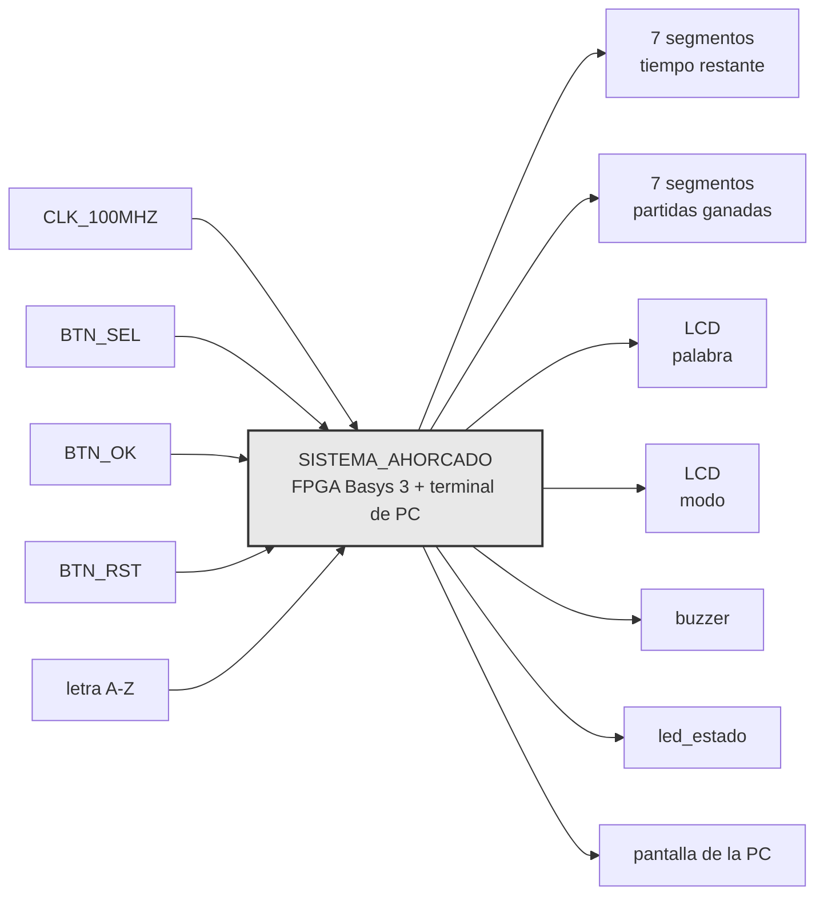

## Objetivo

Toda la inteligencia de la partida vive en la FPGA, la PC es solo terminal. La FPGA escoge la
palabra de forma pseudoaleatoria, valida cada letra contra ella, lleva tiempo e intentos
fallidos, decide el resultado, y refleja ese estado local y remotamente.

## Entradas

- `CLK_100MHZ`, oscilador de la Basys 3. Único reloj de entrada, toda referencia de tiempo del
  sistema se deriva de él.
- `BTN_SEL`, pulsador de la tarjeta. Alterna el modo mostrado en la pantalla de selección entre
  FACIL y DIFICIL.
- `BTN_OK`, pulsador de la tarjeta. Confirma el modo mostrado y arranca la partida.
- `BTN_RST`, pulsador central. Reinicia el sistema completo en cualquier momento, incluido el
  contador de partidas ganadas.
- UNICAMENTE letras A-Z, tecleada en la app de la PC. Viaja por el enlace serial hacia la FPGA.

## Salidas

- Tiempo restante, 2 dígitos de 7 segmentos. Cuenta regresiva en segundos de la partida en
  curso.
- Partidas ganadas, 2 dígitos de 7 segmentos. Acumulado de 00 a 99 desde el último `BTN_RST`.
- Palabra, LCD 16x2 PmodCLP. Patrón con posiciones reveladas y ocultas, más intentos fallidos
  disponibles.
- Modo, LCD 16x2 PmodCLP. Dificultad mostrada en la pantalla de selección.
- Sonido, buzzer piezoeléctrico pasivo. Tono distinto para acierto, error, y fin de partida.
- Estado del sistema, LED de la tarjeta. Distingue selección de modo, partida activa, y
  resultado final.
- Estado de la partida, pantalla de la PC. Patrón de la palabra, longitud, modo, intentos
  restantes, resultado de la última letra, y resultado final.

## Explicación general

El modo se elige desde la tarjeta, no desde la PC, con `BTN_SEL` para recorrer las opciones y
`BTN_OK` para confirmar. Al confirmar, la FPGA selecciona una palabra del banco interno acorde
al modo elegido, arranca la cuenta regresiva, y muestra la palabra oculta en el LCD.

De ahí en adelante cada letra tecleada en la PC llega por el enlace serial y se valida en la
FPGA contra la palabra secreta. Un acierto revela todas las posiciones de esa letra a la vez, un
fallo descuenta un intento, y una letra repetida se ignora sin penalizar ni reiniciar el
temporizador. El LCD y los displays reflejan el mismo estado en la tarjeta, y el buzzer da
realimentación sonora inmediata en cada uno de los tres casos.

La partida termina por palabra completa, sexto fallo, o tiempo agotado, sin distinción de
prioridad entre las dos últimas más allá de cuál ocurra primero en el tiempo. El resultado se
sostiene en el LCD por al menos tres segundos, se actualiza el acumulado de partidas ganadas si
corresponde, y el sistema regresa solo a la pantalla de selección.

El enlace serial es invisible desde afuera del sistema. Es decir, quien juega solo ve que escribe en un
lado y el estado aparece en los dos.


## Diagrama de flujo general de una partida


---

# Nivel 2

## Diagrama de segundo nivel

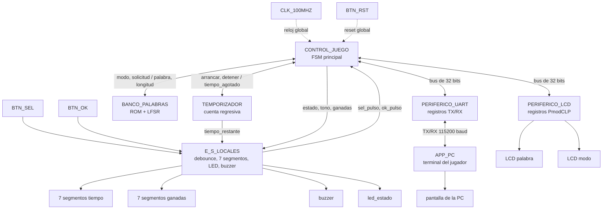

CLK_100MHZ y BTN_RST en realidad entran a los siete bloques, no solo a CONTROL_JUEGO. Se
dibujan una sola vez para no saturar el diagrama, igual que en nivel 1. BTN_RST no pasa por
CONTROL_JUEGO como pulso decodificado, es un reset físico que llega sincronizado a cada
bloque por igual, por eso reinicia el contador de partidas ganadas junto con todo lo demás.

## CONTROL_JUEGO

### Objetivo

Coordinar el flujo completo de una partida. Es el único bloque con permiso de escribir en los
periféricos de bus, y el que concentra la lógica de negocio que el enunciado exige mantener
adentro de la FPGA.

### Entradas

- `sel_pulso`, `ok_pulso`, pulsos ya filtrados de rebote desde E_S_LOCALES.
- `palabra_secreta`, `longitud`, desde BANCO_PALABRAS.
- `tiempo_agotado`, bandera desde TEMPORIZADOR.
- `rdata_o` del bus, compartido entre PERIFERICO_LCD y PERIFERICO_UART.

### Salidas

- `modo`, pulso de solicitud hacia BANCO_PALABRAS.
- `arrancar`, `detener`, hacia TEMPORIZADOR.
- Señales de control hacia E_S_LOCALES, estado para el LED, tono a sonar en el buzzer, valor
  del contador de partidas ganadas.
- `write_enable_i`, `addr_i`, `wdata_i` del bus, hacia PERIFERICO_LCD y PERIFERICO_UART.

### Explicación general

Es el bloque que más pesa en la nota y el que más se va a preguntar en la defensa, porque ahí
vive la máquina de estados que atraviesa selección de modo, partida activa, y resultado. Tiene
que arbitrar el mismo bus de 32 bits entre los dos periféricos, decidir cuándo una letra ya se
recibió antes, y descartar cualquier byte que llegue por UART mientras no hay partida activa.
Ese último comportamiento todavía está pendiente de redactar en detalle, pero la decisión de
diseño es que este bloque es el único responsable de tomarla, ningún otro bloque filtra letras
por su cuenta.

## BANCO_PALABRAS

### Objetivo

Guardar el banco de al menos 50 palabras y entregar una selección pseudoaleatoria acorde al
modo pedido.

### Entradas

- `modo`, FACIL o DIFICIL, desde CONTROL_JUEGO.
- pulso de solicitud, desde CONTROL_JUEGO.

### Salidas

- `palabra_secreta`, los caracteres de la palabra elegida.
- `longitud`, cuántos de esos caracteres son válidos.

### Explicación general

Adentro conviven la ROM con las 50 y tantas palabras y el LFSR que la recorre. Para el modo
difícil conviene una segunda tabla, solo con los índices de las palabras de 6 letras o más, en
vez de filtrar la ROM completa en tiempo de ejecución cada vez que se pide una palabra nueva.
El LFSR corre libre de fondo todo el tiempo y este bloque solo lo muestrea cuando llega el
pulso de solicitud, así la palabra elegida no depende de un seed fijo ni del instante exacto en
que arrancó el sistema.

## TEMPORIZADOR

### Objetivo

Llevar la cuenta regresiva de la partida en curso y avisar cuando se agota el tiempo.

### Entradas

- `arrancar`, `detener`, desde CONTROL_JUEGO, junto con el tiempo inicial según el modo.

### Salidas

- `tiempo_restante`, valor a mostrar, hacia E_S_LOCALES.
- `tiempo_agotado`, bandera, hacia CONTROL_JUEGO.

### Explicación general

Es la única fuente de tiempo real del sistema, ahí vive el prescalador que baja el reloj de
100 MHz hasta segundos. El valor de tiempo restante va directo a E_S_LOCALES sin pasar por
CONTROL_JUEGO, no hay razón para que la FSM principal repita un dato que ya tiene dueño. El
enunciado es explícito en que este valor no se transmite por UART, la PC nunca se entera del
tiempo restante de la partida.

## PERIFERICO_UART

### Objetivo

Envolver en registros de 32 bits el núcleo TX/RX que da el curso, siguiendo la interfaz
estándar de bus del enunciado.

### Entradas

- `write_enable_i`, `addr_i`, `wdata_i`, desde CONTROL_JUEGO.
- línea RX física, desde el puente USB-UART de la tarjeta.

### Salidas

- `rdata_o`, hacia CONTROL_JUEGO.
- línea TX física, hacia el mismo puente USB-UART.

### Explicación general

El equipo no diseña el núcleo serial en sí, sí el envoltorio, registro CONTROL con `send` y
`new_rx`, y los registros de datos de transmisión y recepción por separado. Corre fijo a
115200 baudios. El formato exacto de cada trama hacia la PC lo decide CONTROL_JUEGO, este
bloque solo mueve bytes de un lado al otro del bus.

## APP_PC

- terminal del jugador

### Objetivo

Ser la terminal remota del jugador, sin ninguna lógica de juego propia.

### Entradas

- trama recibida desde PERIFERICO_UART, por el mismo puente USB-UART.
- tecla A-Z presionada por el jugador.

### Salidas

- byte ASCII de la letra, hacia PERIFERICO_UART.
- texto en la pantalla de la PC.

### Explicación general

Valida que la tecla presionada sea A-Z antes de mandarla, pero esa validación es solo para no
llenar el enlace de basura, la que de verdad manda es la FPGA. Esta app no decide nada del
resultado de la partida, solo pinta lo que la trama de la FPGA le dice que pinte.

## PERIFERICO_LCD

### Objetivo

Envolver en registros de 32 bits, diseño propio del equipo, el manejo del HD44780 del
PmodCLP.

### Entradas

- `write_enable_i`, `addr_i`, `wdata_i`, desde CONTROL_JUEGO.

### Salidas

- `rdata_o`, hacia CONTROL_JUEGO, ahí van los bits `busy` y `done`.
- señales físicas del PmodCLP, `RS`, `RW`, `E`, y el bus de datos de 8 bits.

### Explicación general

Adentro vive la secuencia de inicialización del HD44780, que es uno de los puntos técnicos
más delicados del proyecto por los tiempos de espera entre comandos. CONTROL_JUEGO no conoce
esos tiempos, solo escribe comandos o datos de alto nivel y sondea `busy`/`done` antes de
mandar el siguiente. Ese aislamiento es a propósito, si algún día cambia el driver del LCD
CONTROL_JUEGO no debería enterarse.

## E_S_LOCALES

### Objetivo

Agrupar la entrada y salida física de la tarjeta que no necesita pasar por el bus de
periféricos, botones, displays de 7 segmentos, LED, y buzzer.

### Entradas

- `BTN_SEL`, `BTN_OK`, crudos, sin filtrar.
- `tiempo_restante`, desde TEMPORIZADOR.
- estado, tono, y contador de partidas ganadas, desde CONTROL_JUEGO.

### Salidas

- `sel_pulso`, `ok_pulso`, ya filtrados de rebote, hacia CONTROL_JUEGO.
- dígitos de los 7 segmentos.
- LED de estado.
- onda cuadrada hacia el buzzer.

### Explicación general

Junta varios bloques chiquitos que no valen la pena separar a este nivel, dos debouncers, dos
manejadores de display, un generador de onda para el buzzer. Ninguno necesita direccionarse
por registro porque ninguno comparte el mismo puerto físico con otro, a diferencia del LCD y
el UART que sí necesitan un bus para compartir sus 32 bits entre comandos y datos.

## Explicación general del sistema

CONTROL_JUEGO es el único bloque que le habla a todos los demás, los otros seis no se hablan
entre sí. BANCO_PALABRAS y TEMPORIZADOR le entregan datos, PERIFERICO_LCD y PERIFERICO_UART
comparten el mismo bus de 32 bits cada uno en su rango, y E_S_LOCALES absorbe lo que es
demasiado simple como para merecer un bus propio.

Esta partición calza con el reparto de trabajo del equipo, frente C para CONTROL_JUEGO,
BANCO_PALABRAS y TEMPORIZADOR, frente B para PERIFERICO_UART y APP_PC, frente A para
PERIFERICO_LCD y E_S_LOCALES. Cómo se arma cada bloque por dentro, empezando por la FSM de
CONTROL_JUEGO, es lo que le toca al nivel 3.

---

# Nivel 3

En este documento se detallan los diagramas de diseño de tercer nivel. Además, se detallan las entradas y salidas de estos módulos y como se buscan conectar entre ellos.

## Diagrama de tercer nivel

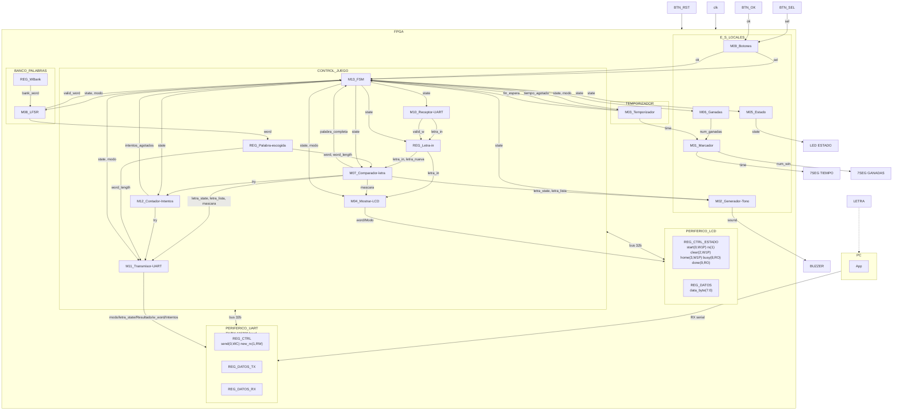

### Leyenda de los diagramas modulares

Para facilitar la creación de los diagramas, utilizando mermaid, utilizaremos la siguiente notación:

- **Óvalo**: puerto externo del módulo (entrada o salida hacia otro módulo/bloque).
- **Rectángulo**: registro o contador.
- **Hexágono**: multiplexor.
- **Rombo**: comparador o lógica de decisión.
- **Rectángulos etiquetados** `XOR`, `OR`, `SUMADOR`, `DECOD_...`: compuertas o bloques combinacionales
  puntuales (comparación bit a bit, decremento, decodificación).

`clk` y `rst` entran a todo registro/contador de cada módulo aunque no se dibujen en cada elemento,
por el mismo criterio usado en los niveles 1 y 2.

## M01: Marcador

### b) Diagrama modular

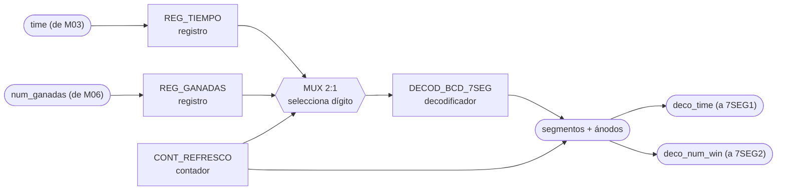

### c) Objetivo del módulo

Manejar los displays de 7 segmentos del marcador: recibe el tiempo restante desde
M03_Temporizador y el número de partidas ganadas desde M06_Ganadas, y los muestra en 7SEG1 y
7SEG2 respectivamente.

### d) Entradas

- `clk`, `rst`.
- `time`, tiempo restante de la partida, desde M03_Temporizador.
- `num_ganadas`, número de partidas ganadas, desde M06_Ganadas.

### e) Salidas

- `deco_time`, patrón de segmentos/ánodos del display de tiempo, hacia 7SEG1.
- `deco_num_win`, patrón de segmentos/ánodos del display de ganadas, hacia 7SEG2.

## M02: Generador-Tono

### b) Diagrama modular


### c) Objetivo del módulo

Generar el tono del buzzer. Se dispara solo, con `letra_state` de M07_Comparador-letra para
distinguir acierto de fallo, y decodificando `state` para el tono de fin de partida cuando el
sistema entra a GANO, PERDIO_INTENTOS o PERDIO_TIEMPO. Son los tres sonidos distintos que pide el
enunciado.

### d) Entradas

- `clk`, `rst`.
- `state`, estado actual, desde M13_FSM, de ahí saca el fin de partida.
- `letra_state`, resultado de la última letra evaluada, desde M07_Comparador-letra.
- `letra_lista`, estrobo que marca cuándo `letra_state` es nuevo, desde M07_Comparador-letra.

### e) Salidas

- `sound`, onda cuadrada de audio, hacia BUZZER.

## M03: Temporizador

### b) Diagrama modular

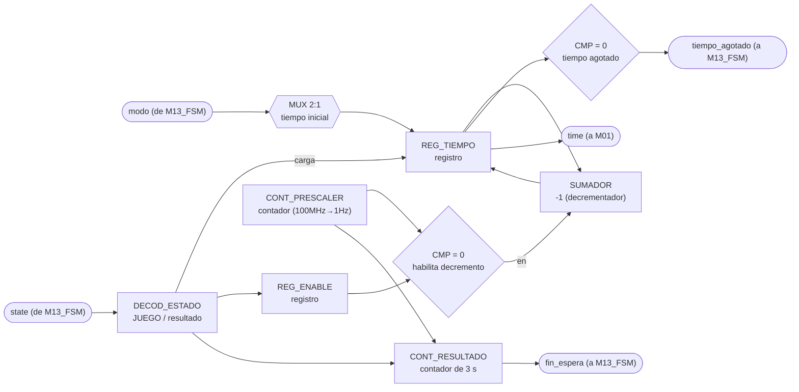

### c) Objetivo del módulo

Llevar la cuenta regresiva de la partida activa. Arranca sola al ver que `state` entró a JUEGO y
se detiene al salir, con la duración inicial que le dice `modo`. Entrega el tiempo restante a
M01_Marcador y avisa a M13_FSM cuando el tiempo se agota (`tiempo_agotado`).

Es además la única fuente de tiempo real del sistema, así que también le toca contar los 3 s
mínimos que el resultado tiene que quedarse en pantalla, y avisar con `fin_espera`. Se hace acá y
no en la FSM para no duplicar un prescalador de 100 MHz a 1 Hz que ya vive en este módulo.

### d) Entradas

- `clk`, `rst`.
- `state`, estado actual, desde M13_FSM, de ahí saca cuándo contar la partida y cuándo los 3 s.
- `modo`, fácil o difícil, desde M13_FSM, define el tiempo inicial a cargar.

### e) Salidas

- `tiempo_agotado`, bandera de fin de tiempo de partida, hacia M13_FSM.
- `fin_espera`, bandera de 3 s cumplidos mostrando resultado, hacia M13_FSM.
- `time`, tiempo restante de la partida, hacia M01_Marcador.

## M04: Mostrar-LCD

### b) Diagrama modular

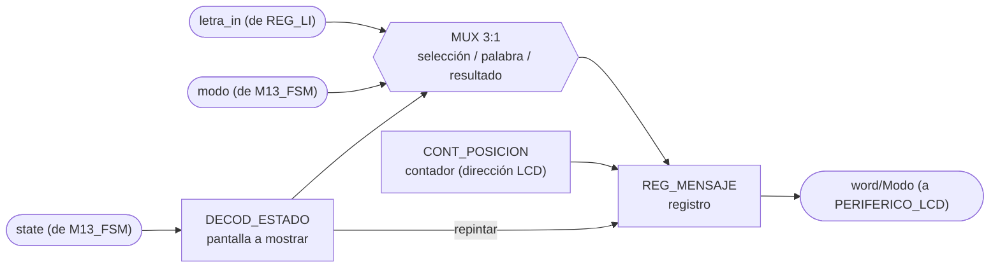

### c) Objetivo del módulo

Controlar lo que se muestra en el LCD. Decodifica `state` para saber cuál de las tres pantallas
toca, selección de modo, palabra en juego, o resultado final, compone el mensaje con la última
letra recibida (REG_Letra-in) y el modo actual, y lo manda como `word/Modo` al periférico LCD.

Repinta la pantalla del estado que ve, no una pantalla por cada transición, así que si un estado
corto pasa antes de que el LCD alcance a refrescar no queda un mensaje a medias, simplemente
pinta el que sigue.

### d) Entradas

- `clk`, `rst`.
- `state`, estado actual, desde M13_FSM, decide cuál pantalla se pinta.
- `modo`, desde M13_FSM.
- `letra_in`, última letra recibida, desde REG_Letra-in.
- `mascara`, posiciones ya reveladas de la palabra, desde M07_Comparador-letra. Es lo que decide
  cuáles letras se pintan y cuáles quedan como guion bajo.

### e) Salidas

- `word/Modo`, mensaje compuesto, hacia PERIFERICO_LCD.

## M05: Estado

### b) Diagrama modular

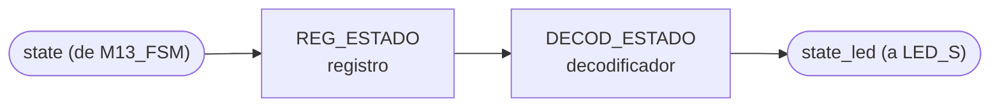

### c) Objetivo del módulo

Reflejar el estado actual del sistema en el LED de estado, traduciendo la señal `state` que
recibe de M13_FSM a la salida física que enciende LED_S. Distingue selección de modo, partida
activa y resultado final, que es lo que pide el enunciado.

### d) Entradas

- `clk`, `rst`.
- `state`, código de estado actual, desde M13_FSM.

### e) Salidas

- `state_led`, señal física del LED de estado, hacia LED_S.

## M06: Ganadas

### b) Diagrama modular

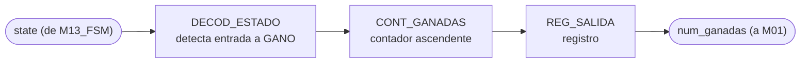

### c) Objetivo del módulo

Contar el número de partidas ganadas. Incrementa por su cuenta al detectar que `state` entró a
GANO y entrega el total acumulado a M01_Marcador para su despliegue. `rst` lo devuelve a cero,
que es lo que hace que BTN_RST reinicie el marcador acumulado como pide el enunciado.

### d) Entradas

- `clk`, `rst`.
- `state`, estado actual, desde M13_FSM, incrementa al entrar a GANO.

### e) Salidas

- `num_ganadas`, número acumulado de partidas ganadas, hacia M01_Marcador.

## M07: Comparador-letra

### b) Diagrama modular

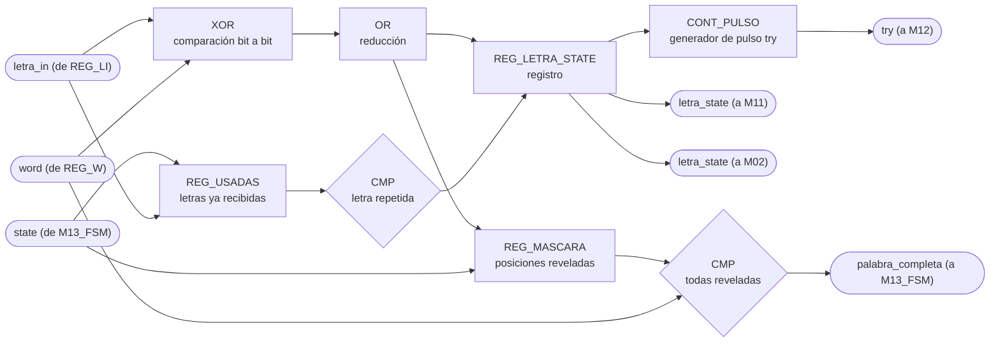

### c) Objetivo del módulo

Comparar la letra recibida (REG_Letra-in, `letra_in`) contra la palabra secreta
(REG_Palabra-escogida, `word`) para determinar acierto, fallo o letra repetida, informando el
resultado (`letra_state`) a M11_Transmisor-UART y a M02_Generador-Tono, y avisando a
M12_Contador-Intentos (`try`) que se evaluó un intento que sí cuenta.

Guarda además la máscara de posiciones ya reveladas y el registro de letras ya recibidas. La
máscara es la que permite avisarle a M13_FSM que la palabra quedó completa, y el registro de
usadas es el que hace que una letra repetida no gaste intento ni vuelva a sonar como fallo.
Ambos se limpian al ver que `state` entró a CARGA, o sea al empezar cada partida nueva.

### d) Entradas

- `clk`, `rst`.
- `letra_in`, letra recibida, desde REG_Letra-in.
- `letra_nueva`, estrobo de un ciclo que avisa que `letra_in` acaba de cargarse, desde
  REG_Letra-in. Sin él el módulo reevaluaría la misma letra en cada ciclo de reloj.
- `word`, palabra secreta, desde REG_Palabra-escogida.
- `word_length`, cuántas posiciones de `word` son válidas, desde REG_Palabra-escogida.
- `state`, estado actual, desde M13_FSM, limpia máscara y letras usadas al entrar a CARGA.

### e) Salidas

- `letra_state`, resultado de la comparación (acierto, fallo o repetida), hacia
  M11_Transmisor-UART y M02_Generador-Tono.
- `letra_lista`, estrobo que acompaña a `letra_state`, hacia M11_Transmisor-UART y
  M02_Generador-Tono.
- `mascara`, posiciones de la palabra ya reveladas, hacia M04_Mostrar-LCD y M11_Transmisor-UART.
  Es el patrón que se pinta en el LCD y el que viaja en la trama hacia la PC.
- `palabra_completa`, todas las posiciones reveladas, hacia M13_FSM.
- `try`, pulso de intento fallido, hacia M12_Contador-Intentos.

## M08: LFSR

### b) Diagrama modular


### c) Objetivo del módulo

Escoger de forma pseudoaleatoria la palabra secreta de la partida usando un LFSR. El LFSR corre
libre todo el tiempo y este módulo lo muestrea al ver que `state` entró a CARGA, saca del banco
(REG_WBank) una palabra acorde al `modo`, la entrega a REG_Palabra-escogida y confirma con
`valid_word` que ya está lista, que es justo lo que M13_FSM está esperando para pasar a JUEGO.

### d) Entradas

- `clk`, `rst`.
- `state`, estado actual, desde M13_FSM, muestrea el LFSR al entrar a CARGA.
- `modo`, fácil o difícil, desde M13_FSM, acota el rango de palabras válidas.
- `bank_word`, palabra leída del banco, desde REG_WBank.

### e) Salidas

- `word`, palabra escogida, hacia REG_Palabra-escogida.
- `valid_word`, bandera de índice/palabra válida, hacia M13_FSM.

## M09: Botones

### b) Diagrama modular

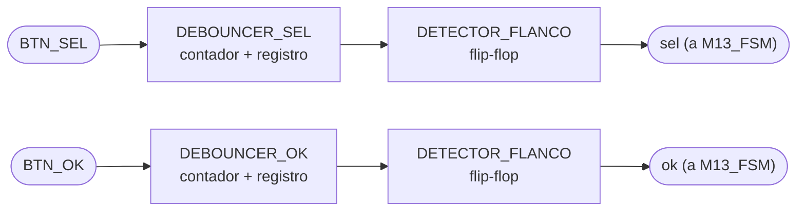

### c) Objetivo del módulo

Capturar y filtrar (debounce) las pulsaciones físicas de BTN_SEL y BTN_OK, entregando los
pulsos limpios `sel` y `ok` directamente a M13_FSM.

### d) Entradas

- `clk`, `rst`.
- `BTN_SEL`, señal cruda del botón de selección.
- `BTN_OK`, señal cruda del botón de confirmación.

### e) Salidas

- `sel`, pulso de selección filtrado, hacia M13_FSM.
- `ok`, pulso de confirmación filtrado, hacia M13_FSM.

## M10: Receptor-UART

### b) Diagrama modular

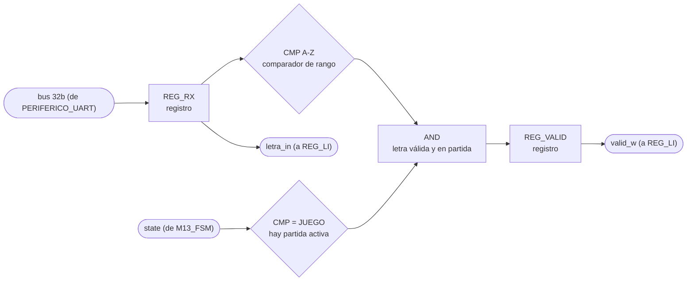

### c) Objetivo del módulo

Recibir la letra enviada por la PC a través de UART, cargarla en REG_Letra-in (`letra_in`) y
habilitar esa carga con `valid_w` solo si el byte es A-Z y además hay partida activa.

Acá es donde se resuelve lo que el enunciado exige documentar, la letra que llega mientras el
sistema está en selección de modo o mostrando resultado se descarta en este punto, no llega a
REG_Letra-in ni a M07_Comparador-letra, así que no gasta intento ni toca el temporizador. Se
filtra por `state` en vez de preguntarle a M13_FSM, que es lo mismo que hacen los demás módulos.

### d) Entradas

- `clk`, `rst`.
- Bus de 32 bits compartido con PERIFERICO_UART (lee `REG_DATOS_RX`).
- `state`, estado actual, desde M13_FSM, solo deja pasar letras durante JUEGO.

Nota: el diagrama de tercer nivel no dibuja una flecha individual de entrada hacia M10; el dato
le llega a través del bus de 32 bits que todo CONTROL_JUEGO comparte con PERIFERICO_UART.

### e) Salidas

- `letra_in`, letra recibida, hacia REG_Letra-in.
- `valid_w`, habilitación de carga de la letra, hacia REG_Letra-in.

## M11: Transmisor-UART

### b) Diagrama modular

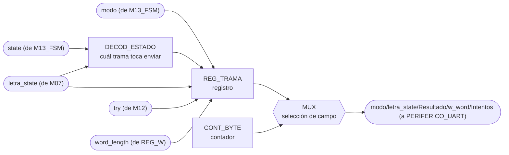

### c) Objetivo del módulo

Ensamblar y transmitir hacia la PC, por UART, la trama de estado del juego, con modo, estado de
la última letra, resultado, longitud de la palabra e intentos usados
(`modo/letra_state/Resultado/w_word/Intentos`).

Decide solo cuándo transmitir. Al ver que `state` entró a JUEGO manda la trama de inicio de
partida con longitud y modo, con cada `letra_state` nuevo manda el resultado de la letra y los
intentos restantes, y al entrar a GANO, PERDIO_INTENTOS o PERDIO_TIEMPO manda el resultado final.
Como los tres estados de fin son distintos, la causa de la derrota sale directo del `state`, sin
necesidad de una señal aparte.

### d) Entradas

- `clk`, `rst`.
- `state`, estado actual, desde M13_FSM, decide cuál trama toca enviar.
- `modo`, desde M13_FSM.
- `letra_state`, desde M07_Comparador-letra.
- `letra_lista`, estrobo que marca cuándo `letra_state` es nuevo, desde M07_Comparador-letra.
- `mascara`, patrón de la palabra revelada, desde M07_Comparador-letra, va en la trama hacia la PC.
- `try`, fallos acumulados, desde M12_Contador-Intentos. El enunciado pide reportar los intentos
  restantes, así que la resta `6 - try` se hace acá al componer la trama.
- `word_length`, longitud de la palabra escogida, desde REG_Palabra-escogida.

### e) Salidas

- `modo/letra_state/Resultado/w_word/Intentos`, trama de estado del juego, hacia
  PERIFERICO_UART.

## M12: Contador-Intentos

### b) Diagrama modular

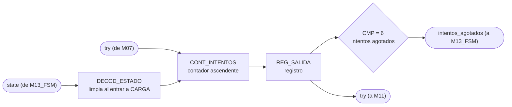

### c) Objetivo del módulo

Contar los intentos fallidos de la partida en curso. Se incrementa con cada pulso `try` de
M07_Comparador-letra, reporta el total a M11_Transmisor-UART y le avisa a M13_FSM con
`intentos_agotados` cuando llega a seis, que es la condición de derrota por intentos. Se limpia
solo al ver que `state` entró a CARGA.

### d) Entradas

- `clk`, `rst`.
- `try`, pulso de intento evaluado, desde M07_Comparador-letra.
- `state`, estado actual, desde M13_FSM, limpia la cuenta al entrar a CARGA.

### e) Salidas

- `intentos_agotados`, bandera de seis letras incorrectas alcanzadas, hacia M13_FSM.
- `try`, número acumulado de intentos, hacia M11_Transmisor-UART.

## M13: FSM

### b) Diagrama de estados

Para este módulo el diagrama de estados ocupa el lugar del diagrama modular de los demás. Una FSM
se escribe directamente desde su diagrama de estados, no desde un arreglo de registros y
compuertas, así que ese es el diagrama que de verdad sirve para implementarla.

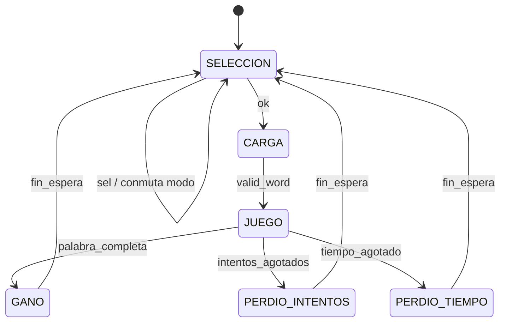

Codificación de `state`, tres bits. Es el contrato que decodifican los demás módulos, así que el
valor de cada estado queda fijo:

- `000` SELECCION, pantalla de selección de modo.
- `001` CARGA, se le pide palabra al banco y se espera `valid_word`.
- `010` JUEGO, partida activa.
- `011` GANO, la palabra quedó completa.
- `100` PERDIO_INTENTOS, se alcanzaron las seis letras incorrectas.
- `101` PERDIO_TIEMPO, la cuenta regresiva llegó a cero.

`BTN_RST` devuelve la FSM a SELECCION desde cualquier estado, igual que reinicia al resto de los
módulos, por eso no se dibuja como una transición más del diagrama.

### c) Objetivo del módulo

Llevar el estado global de la partida y publicarlo para que cada módulo decida por su cuenta qué
le toca hacer. La FSM no le da órdenes puntuales a nadie, no manda pulsos de `start`, `show`,
`choose` ni `count`. Solo dice en cuál de los seis estados está el sistema y cuál modo está
seleccionado.

Esa es la decisión de diseño central del módulo. Con la FSM mandando, cada módulo nuevo obligaba a
agregarle una salida y a meterle mano a su lógica interna. Con los módulos decodificando `state`
la FSM queda fija, y un módulo nuevo solo se cuelga del estado que ya se difunde. Se nota en el
diagrama de tercer nivel, todas las flechas que salen de la FSM llevan lo mismo, `state` y en
algunos casos `modo`, en vez de once señales de control distintas.

El otro efecto es que la FSM nunca se queda esperando a nadie. No sondea el `busy` del LCD ni
espera confirmación de M11 para cambiar de estado, porque no les está ordenando nada. M04 repinta
el estado que ve en el momento en que puede, y si CARGA pasa demasiado rápido para el LCD,
simplemente pinta el siguiente estado sin que quede nada a medias.

De aquí sale también la respuesta a lo que el enunciado exige documentar, qué pasa con una letra
que llega por UART fuera de partida. REG_Letra-in solo carga cuando `state` es JUEGO, así que la
letra se descarta ahí mismo, sin llegar a M07 ni gastar intento. La FSM ni se entera.

### d) Entradas

- `clk`, `rst`.
- `sel`, pulso de cambio de modo, desde M09_Botones.
- `ok`, pulso de confirmación, desde M09_Botones.
- `valid_word`, palabra lista en REG_Palabra-escogida, desde M08_LFSR.
- `palabra_completa`, todas las posiciones de la palabra reveladas, desde M07_Comparador-letra.
- `intentos_agotados`, seis letras incorrectas alcanzadas, desde M12_Contador-Intentos.
- `tiempo_agotado`, cuenta regresiva en cero, desde M03_Temporizador.
- `fin_espera`, se cumplieron los 3 s de resultado en pantalla, desde M03_Temporizador.

### e) Salidas

- `state`, estado actual en tres bits, hacia M02_Generador-Tono, M03_Temporizador,
  M04_Mostrar-LCD, M05_Estado, M06_Ganadas, M07_Comparador-letra, M08_LFSR, M10_Receptor-UART,
  M11_Transmisor-UART, M12_Contador-Intentos y REG_Letra-in.
- `modo`, FACIL o DIFICIL, hacia M03_Temporizador, M04_Mostrar-LCD, M08_LFSR y
  M11_Transmisor-UART.

Son las únicas dos salidas del módulo, cuatro bits en total. No hay señales de `start`, `show`,
`choose`, `count` ni `load` porque la FSM no le ordena nada puntual a ningún módulo.

### f) Explicación de la relación con otros módulos

Le entregan eventos a la FSM:

- M09_Botones, con `sel` y `ok` ya filtrados de rebote.
- M08_LFSR, con `valid_word` cuando la palabra de la partida quedó lista en REG_Palabra-escogida.
- M07_Comparador-letra, con `palabra_completa` cuando su máscara de posiciones reveladas se llenó.
- M12_Contador-Intentos, con `intentos_agotados` cuando el contador llegó a seis fallos.
- M03_Temporizador, con `tiempo_agotado` durante la partida y con `fin_espera` cuando ya pasaron
  los 3 s mínimos mostrando el resultado.

Consumen `state` los once bloques listados en la e). Cada uno decodifica los estados que le
importan e ignora el resto. M05_Estado lo traduce al LED, M03_Temporizador lo usa para arrancar y
detener la cuenta, M08_LFSR muestrea al entrar a CARGA, M06_Ganadas incrementa al entrar a GANO,
M04_Mostrar-LCD elige cuál de las tres pantallas pinta, M11_Transmisor-UART decide cuál trama
manda, y REG_Letra-in y M10_Receptor-UART lo usan para descartar letras fuera de partida.

Consumen `modo` los cuatro que necesitan saber la dificultad, M03_Temporizador para cargar 60 s o
45 s, M08_LFSR para acotar el rango de palabras, y M04_Mostrar-LCD y M11_Transmisor-UART para
reportarla.

La FSM no toca el bus de 32 bits. No le escribe al PERIFERICO_LCD ni al PERIFERICO_UART, de eso se
encargan M04, M10 y M11 dentro de CONTROL_JUEGO. Por eso la FSM tampoco conoce los bits `busy` y
`done` del LCD, ni el `send` ni el `new_rx` del UART.

Esta es la parte que más cambió respecto al primer planteamiento. Antes la FSM tenía una salida
por cada cosa que quería que pasara, y agregar un módulo significaba agregarle un puerto y meterle
otra rama a su lógica. Ahora la FSM queda fija y el módulo nuevo se cuelga del `state` que ya se
difunde, sin tocar este archivo. El costo es que la codificación de `state` pasa a ser un contrato
público, si se cambia un código hay que revisar los once decodificadores.

### g) Explicación de funcionamiento

El sistema arranca en SELECCION después del reset. Ahí el LCD muestra la pantalla de selección de
dificultad y cada pulso `sel` de BTN_SEL conmuta `modo` entre FACIL y DIFICIL, sin salir del
estado. El pulso `ok` de BTN_OK es el que confirma y pasa a CARGA. Mientras se está en SELECCION
cualquier byte que llegue por UART se descarta en M10_Receptor-UART, así que la FSM ni se entera.

En CARGA la FSM solo espera. M08_LFSR ve que el estado cambió, muestrea su registro de
desplazamiento, escoge una palabra del banco acorde al `modo` y la deja en REG_Palabra-escogida.
Cuando levanta `valid_word` la FSM pasa a JUEGO. M07_Comparador-letra y M12_Contador-Intentos
aprovechan el paso por CARGA para limpiar la máscara de letras reveladas y el contador de fallos
de la partida anterior.

JUEGO es donde se juega la partida completa y donde la FSM hace menos. El temporizador corre, las
letras entran por UART, M07 las compara, M12 cuenta los fallos, M04 repinta el LCD y M11 le
reporta a la PC, todo sin intervención de la FSM. Ella solo vigila tres señales, `palabra_completa`
para ganar, `intentos_agotados` para perder por fallos, y `tiempo_agotado` para perder por tiempo.

Los tres estados de fin funcionan igual entre sí. Se mantienen mientras M03_Temporizador cuenta los
3 s que el enunciado exige que el resultado quede en pantalla, y cuando llega `fin_espera` la FSM
vuelve sola a SELECCION para la siguiente partida. Están separados en GANO, PERDIO_INTENTOS y
PERDIO_TIEMPO porque el resultado y su causa tienen que salir por UART y por LCD, y teniéndolos
como estados distintos esa información viaja en el mismo `state` que ya se difunde.

BTN_RST es un reset físico que llega sincronizado a todos los módulos por igual. Devuelve la FSM a
SELECCION desde cualquier estado, y en el mismo golpe M06_Ganadas pone su contador acumulado en
cero, que es lo que pide el enunciado. La FSM no manda ninguna señal para que eso pase.

### h) Diseño

#### Codificación de estados

Seis estados, tres bits, codificación binaria:

- `000` SELECCION
- `001` CARGA
- `010` JUEGO
- `011` GANO
- `100` PERDIO_INTENTOS
- `101` PERDIO_TIEMPO

Se descartó one-hot aunque sea lo típico para FSM en FPGA. Con one-hot cada módulo decodificaría
con una sola comparación de bit, que es más barato, pero `state` sale del módulo como puerto hacia
once bloques, y seis líneas contra tres duplican el ruteo de una señal que ya es la más difundida
del diseño. Además, al ser puerto, Vivado no puede recodificar el registro por su cuenta, así que
la codificación queda fija de todas formas y conviene que sea la compacta.

Los códigos `110` y `111` no se usan. El `default` de la lógica combinacional los manda a
SELECCION, tanto para no dejar estados colgados como para que no se infiera un latch.

#### Tabla de transiciones

El orden de las filas dentro de cada estado es el orden de prioridad, y es el mismo orden en que
van los `if / else if / else` de la implementación:

| Estado actual | Condición | Estado siguiente | Efecto |
|---|---|---|---|
| SELECCION `000` | `ok` | CARGA `001` | |
| SELECCION `000` | `sel` | SELECCION `000` | conmuta `modo` |
| SELECCION `000` | ninguna | SELECCION `000` | |
| CARGA `001` | `valid_word` | JUEGO `010` | |
| CARGA `001` | ninguna | CARGA `001` | |
| JUEGO `010` | `palabra_completa` | GANO `011` | |
| JUEGO `010` | `intentos_agotados` | PERDIO_INTENTOS `100` | |
| JUEGO `010` | `tiempo_agotado` | PERDIO_TIEMPO `101` | |
| JUEGO `010` | ninguna | JUEGO `010` | |
| GANO `011` | `fin_espera` | SELECCION `000` | |
| GANO `011` | ninguna | GANO `011` | |
| PERDIO_INTENTOS `100` | `fin_espera` | SELECCION `000` | |
| PERDIO_INTENTOS `100` | ninguna | PERDIO_INTENTOS `100` | |
| PERDIO_TIEMPO `101` | `fin_espera` | SELECCION `000` | |
| PERDIO_TIEMPO `101` | ninguna | PERDIO_TIEMPO `101` | |
| `110`, `111` | cualquiera | SELECCION `000` | estados no usados |

#### Registro de modo

`modo` es el otro elemento de memoria del módulo, un solo bit que vive aparte del registro de
estado. Las transiciones no lo tocan, lo mueve únicamente BTN_SEL:

| Condición (prioridad descendente) | `modo'`  |
| --------------------------------- | -------- |
| `rst = 1`                         | `0`      |
| `state = SELECCION` y `sel = 1`   | `NOT modo` |
| resto                             | `modo`   |

La segunda fila es la que congela la dificultad durante la partida. Fuera de SELECCION el pulso
`sel` no hace nada, así que un botonazo accidental a media partida no puede cambiarle el
temporizador ni el banco de palabras a una partida ya empezada.

Significado del bit y valores que dispara en los otros módulos:

| `modo` | Dificultad | Palabras del banco        | Tiempo de partida |
| ------ | ---------- | ------------------------- | ----------------- |
| `0`    | FACIL      | cualquiera, 4 a 12 letras | 60 s              |
| `1`    | DIFICIL    | solo de 6 letras o más    | 45 s              |

Los tiempos son los sugeridos por el enunciado y se mantienen tal cual. La relación que sí es
obligatoria es que difícil tenga menos tiempo que fácil, y 45 contra 60 la cumple. La
justificación de los valores concretos es que en modo difícil la palabra es más larga, entre 6 y
12 letras, así que hay más posiciones que descubrir con menos tiempo, y ahí está la dificultad
real del modo, no solo en el reloj.

Después del reset el sistema arranca en FACIL, que es el modo que se muestra primero en el LCD.

#### Prioridades y casos de borde

En SELECCION, `ok` va antes que `sel` por si alguien presiona los dos botones en el mismo ciclo.
Confirmar es la acción destructiva de las dos, y dejarla de última haría que un `sel` simultáneo
cambiara la dificultad justo en el ciclo en que se confirma, arrancando la partida con un modo
distinto al que el jugador vio en el LCD.

En JUEGO la victoria va de primera. `palabra_completa` y `tiempo_agotado` sí pueden coincidir en un
mismo ciclo, si la última letra completa la palabra justo cuando la cuenta llega a cero, y ahí gana
el jugador. `palabra_completa` e `intentos_agotados` no pueden coincidir, porque una letra
incorrecta nunca revela una posición nueva, así que ese orden entre las dos no cambia nada en la
práctica y se deja documentado por completitud.

Entre las dos derrotas manda `intentos_agotados`. El enunciado dice que a la sexta letra incorrecta
la partida se pierde sin importar el tiempo restante, y respetar ese orden hace que la causa
reportada por UART sea la de intentos cuando ambas ocurren juntas.

#### Por qué la FSM no espera al LCD ni al UART

La FSM cambia de estado sin consultar el `busy` del periférico LCD ni si M11_Transmisor-UART
terminó de mandar la trama anterior. Eso es intencional. El LCD es lento en escala de
milisegundos, y si la FSM se bloqueara esperándolo, una letra que llegue durante el repintado se
perdería, o habría que meterle una cola a la FSM y volverla el bloque más complicado del diseño.

Lo que hace M04_Mostrar-LCD es repintar la pantalla que corresponde al `state` que ve en el
momento en que el LCD queda libre. Si un estado corto pasa antes de que alcance a refrescar,
simplemente pinta el siguiente, y como cada pantalla se compone completa desde el estado actual,
nunca queda una mezcla de dos pantallas. El único estado que puede pasar más rápido que un
refresco del LCD es CARGA, y no tiene pantalla propia.

M11_Transmisor-UART sí ve todos los estados, porque muestrea a 100 MHz y el estado más corto dura
al menos un ciclo.

#### Duración de los estados de resultado

Los 3 s los cuenta M03_Temporizador y no la FSM. Meter un contador de segundos adentro de la FSM
obligaría a duplicar el prescalador de 100 MHz a 1 Hz que M03 ya tiene, y dejaría la FSM con lógica
de tiempo real, que es justo lo que se quiere sacar de ella. M03 decodifica que `state` está en uno
de los tres estados de fin, cuenta, y levanta `fin_espera`.

#### Estructura de la implementación

Dos bloques y nada más. Un `always_ff @(posedge clk)` con el registro de estado y el registro de
`modo`, y un `always_comb` con la lógica de siguiente estado, que asigna `estado_siguiente =
estado_actual` como valor por defecto antes del `case` para que no se infiera ningún latch.

La salida `state` es el propio registro de estado, sin lógica de decodificación de por medio. Es
una máquina de Moore en el sentido más literal, la salida es el estado. `modo` es un registro
aparte de un bit que solo conmuta con `sel` estando en SELECCION, y se congela durante el resto de
la partida para que nadie pueda cambiar la dificultad a medio juego.

Los anchos van con `localparam` y `$clog2`, siguiendo la convención del resto del proyecto, aunque
acá el ancho de estado es fijo en 3 bits por el contrato de codificación.

### i) Diagrama esquemático detallado del diseño

Misma notación de la leyenda de `nivel03.md`, óvalo para puerto externo, rectángulo para registro,
rombo para comparador, y rectángulo etiquetado para lógica combinacional.

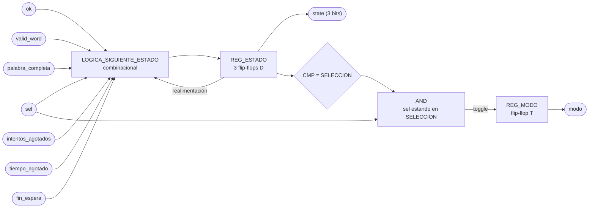

`clk` y `rst` entran a los dos registros aunque no se dibujen, por el mismo criterio del resto de
los diagramas del proyecto.

Del diagrama se lee que no hay lógica entre `REG_ESTADO` y la salida `state`, el registro es la
salida. Toda la combinacional del módulo está en `LOGICA_SIGUIENTE_ESTADO`, que son tres funciones
booleanas de diez variables (tres de estado actual y siete de evento), y en la compuerta que
habilita el conmutado de `modo`.

Sobre el nivel de detalle que pide el método, un esquemático por compuertas dibujado a mano acá no
aporta nada. Esas tres funciones las sintetiza Vivado con un puñado de LUT, y el número exacto
depende de la optimización, no del dibujo. El equivalente honesto es el esquemático
post-síntesis que genera la herramienta, y esa captura es la que va como evidencia en el informe.
Queda pendiente confirmarle al profesor que ese reemplazo es aceptable, es la misma duda que
aplica a los doce módulos anteriores.

### j) Diagrama completo de conexiones del diseño

Ningún puerto de este módulo sale de la FPGA, así que no le corresponde ninguna línea del
`basys3.xdc`. Sus conexiones son las del instanciado dentro de CONTROL_JUEGO:

- `clk`, al reloj global de 100 MHz de la tarjeta.
- `rst`, a BTN_RST ya sincronizado, el mismo que llega a todos los demás módulos.
- `sel`, `ok`, desde M09_Botones.
- `valid_word`, desde M08_LFSR.
- `palabra_completa`, desde M07_Comparador-letra.
- `intentos_agotados`, desde M12_Contador-Intentos.
- `tiempo_agotado`, `fin_espera`, desde M03_Temporizador.
- `state`, hacia M02, M03, M04, M05, M06, M07, M08, M10, M11, M12 y REG_Letra-in.
- `modo`, hacia M03, M04, M08 y M11.

Las señales que sí cruzan al mundo físico pertenecen a los módulos del borde, los botones en
M09_Botones, los displays en M01_Marcador, el LED en M05_Estado, el buzzer en M02_Generador-Tono,
y los dos periféricos de bus con el PmodCLP y el puente USB-UART. Cada una está documentada en el
módulo que la maneja.

Acá el punto j) del método de diseño modular pide un diagrama de conexiones eléctricas por chips,
que está pensado para un montaje con circuitos integrados discretos en protoboard. En un diseño
que se sintetiza completo dentro de una sola Artix-7 no hay chips que alambrar, y la lista de
arriba es la traducción razonable. Es la otra mitad de la consulta pendiente con el profesor.

---

# M01 - Marcador

## Propósito

El módulo `M01_Marcador` se encarga de mostrar en los displays de 7 segmentos el tiempo restante de la partida y el número de partidas ganadas.

Recibe time desde `M03_Temporizador` y num_ganadas desde `M06_Ganadas`. Ambos valores se representan utilizando dos dígitos decimales, para un total de cuatro dígitos multiplexados.

---

## Entradas

* clk: reloj principal de la FPGA, de 100 MHz.
* rst: reinicio del módulo.
* time: tiempo restante de la partida, proveniente de `M03_Temporizador`.
* num_ganadas: número de partidas ganadas, proveniente de `M06_Ganadas`.

---

## Salidas

* seg[6:0]: patrón de los siete segmentos.
* an[3:0]: selección del dígito activo.
* dp: control del punto decimal.

La distribución propuesta es:

| Dígito | Valor               |
| ------ | ------------------- |
| `AN3`  | Decenas del tiempo  |
| `AN2`  | Unidades del tiempo |
| `AN1`  | Decenas de ganadas  |
| `AN0`  | Unidades de ganadas |

---

## f) Relación con otros módulos

time proviene directamente de `M03_Temporizador`, mientras que num_ganadas proviene de `M06_Ganadas`. `M01_Marcador` no modifica ninguno de estos valores, sino que únicamente realiza su conversión y despliegue.

El marcador se mantiene funcionando continuamente y no necesita señales de habilitación provenientes de la FSM.

La multiplexación utiliza únicamente el reloj principal de 100 MHz. Para cambiar entre los cuatro dígitos se genera internamente un pulso de habilitación tick_ref, evitando crear un segundo reloj físico dentro de la FPGA.

rst reinicia tanto el contador de refresco como el selector del dígito activo.

---

## g) Explicación de funcionamiento

Los valores time y `num_ganadas` se separan en decenas y unidades mediante lógica combinacional.

Para cada valor `x`:

$$
decenas = \left\lfloor \frac{x}{10} \right\rfloor
$$

$$
unidades = x - 10(decenas)
$$

De esta forma se obtienen cuatro valores BCD:

* time_decenas
* time_unidades
* win_decenas
* win_unidades

Un multiplexor selecciona cuál de estos cuatro dígitos se envía al decodificador BCD a 7 segmentos.

La selección depende de un registro de dos bits REG_SEL, que recorre continuamente los estados:

`00 → 01 → 10 → 11 → 00`

El cambio entre estados se produce mediante tick_ref, generado por `CONT_REFRESCO`.

Con un reloj de 100 MHz y un contador de 25 000 ciclos:

$$
f_{tick}=\frac{100\,000\,000}{25\,000}=4000\text{ Hz}
$$

Como existen cuatro dígitos, cada uno se refresca aproximadamente a:

$$
f_{digito}=\frac{4000}{4}=1000\text{ Hz}
$$

Esta frecuencia permite que visualmente los cuatro dígitos parezcan permanecer encendidos al mismo tiempo.

---

## h) Diseño

El módulo se implementa mediante un datapath sencillo compuesto por lógica combinacional y dos elementos secuenciales principales: CONT_REFRESCO y REG_SEL.

CONT_REFRESCO cuenta de 0 a 24999. Cuando llega al valor máximo, vuelve a cero y genera tick_ref durante un ciclo de reloj.

| Condición       | `count'`    | `tick_ref` |
| --------------- | ----------- | ---------- |
| `rst = 1`       | `0`         | `0`        |
| `count < 24999` | `count + 1` | `0`        |
| `count = 24999` | `0`         | `1`        |

REG_SEL cambia de estado únicamente cuando tick_ref = 1.

| `REG_SEL` | Siguiente valor con `tick_ref = 1` |
| --------- | ---------------------------------- |
| `00`      | `01`                               |
| `01`      | `10`                               |
| `10`      | `11`                               |
| `11`      | `00`                               |

El multiplexor de dígitos utiliza REG_SEL para seleccionar:

| `REG_SEL` | Valor seleccionado |
| --------- | ------------------ |
| `00`      | `win_unidades`     |
| `01`      | `win_decenas`      |
| `10`      | `time_unidades`    |
| `11`      | `time_decenas`     |

El mismo valor selecciona el ánodo correspondiente:

| `REG_SEL` | `an[3:0]` |
| --------- | --------- |
| `00`      | `1110`    |
| `01`      | `1101`    |
| `10`      | `1011`    |
| `11`      | `0111`    |

Suponiendo segmentos activos en bajo, el decodificador BCD a 7 segmentos utiliza:

| BCD    | Número | `abcdefg` |
| ------ | -----: | --------- |
| `0000` |      0 | `0000001` |
| `0001` |      1 | `1001111` |
| `0010` |      2 | `0010010` |
| `0011` |      3 | `0000110` |
| `0100` |      4 | `1001100` |
| `0101` |      5 | `0100100` |
| `0110` |      6 | `0100000` |
| `0111` |      7 | `0001111` |
| `1000` |      8 | `0000000` |
| `1001` |      9 | `0000100` |

El punto decimal no se utiliza, por lo que dp se mantiene apagado.

---

## i) Diagrama esquemático detallado del diseño

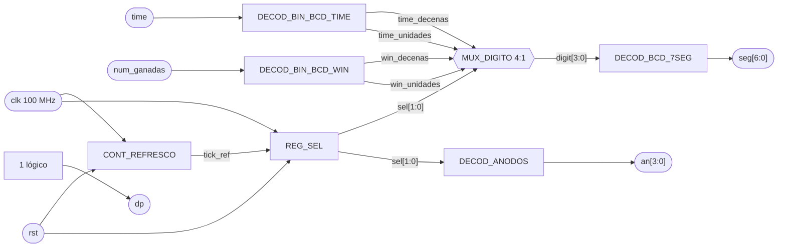

Este diseño mantiene un único dominio de reloj de `100 MHz`. `tick_ref` funciona únicamente como habilitación de conteo y no como un reloj independiente.

---

# M02 - Generador de tono

## Propósito

Genera la señal sonora del juego para indicar el resultado de una letra o de una transición de estado.

## Entradas

- `start`: habilitación de la generación de sonido desde la `FSM`.
- `letra_state`: resultado de la letra entregado por `M07_Comparador-letra`.

**REVISAR LESTRA_STATE**

## Salidas

- `sound`: señal hacia el buzzer.

## Funcionamiento

Selecciona y genera el tono correspondiente al evento indicado por `start` y `letra_state`.

---

# M03 - Temporizador

## a) Nombre del módulo

M03_Temporizador

## b) Diagrama modular

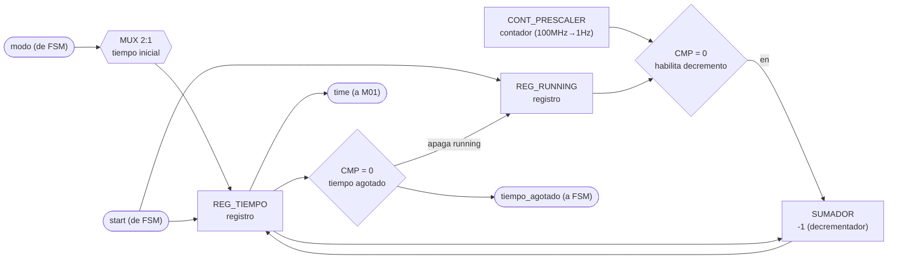

## c) Objetivo del módulo

Controla el tiempo disponible para la partida. Al recibir `start`, carga el tiempo inicial según
el `modo` recibido y arranca la cuenta regresiva; al llegar a cero, avisa a la `FSM` mediante una señal
`tiempo_agotado` y entrega el tiempo restante en todo momento a `M01_Marcador` para su
despliegue.

## d) Entradas

- `clk`, `rst`.
- `start`: inicia el temporizador desde la `FSM` (carga el tiempo inicial y arranca la cuenta).
- `modo`: selecciona el modo de operación (fácil/difícil), define el tiempo inicial a cargar.

## e) Salidas

- `time`: tiempo restante hacia `M01_Marcador`.
- `tiempo_agotado`: indica a la `FSM` que terminó el tiempo.

## f) Explicación de la relación con otros módulos

M03 solo recibe órdenes de la `FSM` (`start`, `modo`) y solo le responde a la `FSM`
(`tiempo_agotado`); el valor de tiempo en sí (`time`) va aparte hacia `M01_Marcador` para su
despliegue. No tiene ninguna relación con M02, M04, M11 ni con ningún periférico de bus: vive
solo, aislado, dentro del subgraph TEMPORIZADOR. Es importante que M03 nunca se conecte con
M11_Transmisor-UART, porque el enunciado exige explícitamente que el tiempo restante no se
transmita por UART hacia la PC.

## g) Funcionamiento

Cuenta el tiempo mientras está habilitado (`running`). Al recibir `start`, M03 carga el tiempo
inicial correspondiente al `modo` recibido y activa `running`. Mientras `running` esté activa,
un divisor de reloj (prescaler) genera un pulso de 1 Hz que decrementa el tiempo restante en 1
cada vez. Cuando el contador llega a 0, se levanta `tiempo_agotado`, se apaga `running`
automáticamente (ya no hay nada que contar) y `tiempo_agotado` se mantiene en alto hasta el
siguiente `start`.

## h) Diseño

El tiempo restante se maneja en BCD (dos dígitos, decenas y unidades) en vez de binario puro,
para conectarlo directo al decodificador BCD→7 segmentos de M01_Marcador sin necesitar un
divisor por 10 adicional; el costo es usar dos contadores en cascada en vez de uno binario de 7
bits.

Como no existe una entrada `detener`, la bandera `running` se apaga sola cuando el contador
llega a cero, en vez de por una señal externa. Tabla de verdad de `running` (entradas `start`,
`running` actual y `zero` = "el contador de tiempo ya está en 0"; salida `running_next`):

| start | running | zero | running_next |
|---|---|---|---|
| 0 | 0 | 0 | 0 |
| 0 | 0 | 1 | 0 |
| 0 | 1 | 0 | 1 |
| 0 | 1 | 1 | 0 |
| 1 | 0 | 0 | 1 |
| 1 | 0 | 1 | 1 |
| 1 | 1 | 0 | 1 |
| 1 | 1 | 1 | 1 |

El habilitador de conteo de los contadores BCD es `CTEN = running · tick_1Hz`.

El `tick_1Hz` se genera con un contador binario de 27 bits que cuenta en modo descendente,
cargado con el valor `100 000 000 − 1` a 100 MHz; se usa la salida de acarreo/borrow (Ripple
Carry Output) de la última etapa como el propio pulso de un ciclo, evitando así un comparador de
27 bits.

El multiplexor de valor inicial (`modo` → tiempo de arranque) selecciona entre dos constantes
fijas (por definir en equipo, p. ej. 90 s para fácil y 60 s para difícil).

## i) Diagrama esquemático detallado (por compuertas lógicas)

```mermaid
flowchart LR
    ZERO(["zero<br/>(tiempo = 0, 8 bits BCD)"]) --> NOT1["NOT"]
    RUNQ["running (Q)"] --> AND1["AND2"]
    NOT1 --> AND1
    AND1 --> OR1["OR2"]
    START(["start"]) --> OR1
    OR1 --> D1["D-FF<br/>running"]
    CLK1(["clk"]) --> D1
    D1 --> RUNQ

    T0(["tiempo = 0<br/>(8 bits BCD)"]) --> NOR1["NOR8<br/>(reducción)"]
    NOR1 --> D2["D-FF<br/>tiempo_agotado"]
    START --> RST2["clear"]
    RST2 --> D2
    CLK1 --> D2
    D2 --> OUTFIN(["tiempo_agotado"])
```

`NOR8` representa la compuerta de reducción que detecta "todo el registro de tiempo en 0"
(8 bits de las dos décadas BCD, la misma señal `zero` usada arriba); en la implementación real
es un árbol de compuertas NOR/OR de 2-3 entradas en cascada, no una sola compuerta de 8 entradas.

---

# M04 - Mostrar LCD

## a) Nombre del módulo

M04_Mostrar-LCD

## b) Diagrama modular

```mermaid
flowchart LR
    IN_LETRA(["letra_in (de REG_LI)"]) --> MUX1{{"MUX 2:1<br/>letra / texto modo"}}
    IN_MODO(["modo (de FSM)"]) --> MUX1
    IN_SHOW(["show (de FSM)"]) --> MUX1
    MUX1 --> REG_MSG["REG_MENSAJE<br/>registro"]
    CNT_POS["CONT_POSICION<br/>contador (dirección LCD)"] --> REG_MSG
    REG_MSG --> OUT_LCD(["word/Modo (a PERIFERICO_LCD)"])
```

## c) Objetivo del módulo

Prepara la información del juego que debe mostrarse en el periférico LCD: cuando la `FSM` lo
ordena (`show`), compone el mensaje a partir de la última letra recibida (`REG_Letra-in`) y del
`modo` actual, y lo envía como `word/Modo` al periférico LCD.

## d) Entradas

- `clk`, `rst`.
- `show`: orden de actualización desde la `FSM`.
- `modo`: modo actual del juego desde la `FSM`.
- `letra_in`: letra recibida desde `REG_Letra-in`.

## e) Salidas

- `word/Modo`: datos y comandos enviados a `PERIFERICO_LCD`.

## f) Explicación de la relación con otros módulos

La `FSM` (principal) controla cuándo actualizar la pantalla (`show`) y qué modo mostrar (`modo`). M04 lee la
última letra recibida desde `REG_Letra-in`, cargado por `M10_Receptor-UART` bajo orden de la
FSM. La salida no llega directo al LCD: se entrega a `PERIFERICO_LCD` a través del mismo bus de
32 bits que `CONTROL_JUEGO` comparte con `PERIFERICO_UART`, es decir M04 escribe en los
registros `REG_DATOS` y `REG_CTRL_ESTADO` y lee de vuelta los bits `busy`/`done` para
sincronizarse con el HD44780 del PmodCLP. No tiene relación directa con M01, M02, M05, M06, M08,
M09 ni M12: su única "clientela" es el LCD físico.

## g) Funcionamiento

Construye la secuencia de datos que representa la palabra, la letra y el modo actual, y la
envía al LCD cuando `show` lo solicita. En el fondo, M04 es una pequeño FSM que traduce una orden de un solo pulso (`show`) en una ráfaga de
transacciones de bus hacia `PERIFERICO_LCD`. Al llegar `show`, primero pulsa `home`/`clear` en
`REG_CTRL_ESTADO` para posicionar el cursor; luego, byte por byte, escribe cada carácter del
mensaje en `REG_DATOS` y pulsa `start` con `rs=1` (dato, no comando); después de cada byte
espera a que `done` se levante antes de enviar el siguiente. El mensaje
depende del contexto: en selección de modo es un texto fijo ("MODO: FACIL"/"MODO: DIFICIL"); en
partida, es la letra recién recibida superpuesta sobre la palabra en curso.

## h) Diseño

Para este diseño el módulo se modela como una máquina de Moore de 4 estados: `IDLE`, `HOME`, `SEND`, `WAIT`.

Tabla de transición de estados:

| Estado actual | show | done | pos = fin? | Estado siguiente |
|---|---|---|---|---|
| IDLE | 0 | X | X | IDLE |
| IDLE | 1 | X | X | HOME |
| HOME | X | X | X | SEND |
| SEND | X | X | X | WAIT |
| WAIT | X | 0 | X | WAIT |
| WAIT | X | 1 | 0 | SEND (`pos = pos+1`) |
| WAIT | X | 1 | 1 | IDLE |

Codificación de estado (2 bits, `S1 S0`): `IDLE=00`, `HOME=01`, `SEND=10`, `WAIT=11`.

El contador de posición (`pos`) es de 4 bits (alcanza hasta 16 caracteres, el ancho del
PmodCLP), se reinicia en `HOME` y se incrementa cada vez que `WAIT` recibe `done=1` sin haber
llegado al final del mensaje. El byte a enviar sale de una pequeña ROM de texto (una por modo)
seleccionada por `modo`, o directamente de `letra_in` cuando se muestra la palabra en juego; un
multiplexor 2:1 decide la fuente. Se usa una ROM en vez de lógica combinacional dedicada por ser
mensajes fijos de longitud conocida — la forma estándar de guardar texto constante a nivel de
compuertas/MSI sin recurrir a memoria de programa.

## i) Diagrama esquemático detallado (por compuertas lógicas)

```mermaid
flowchart LR
    S1Q["S1 (Q)"] --> NSL["Lógica de<br/>siguiente estado<br/>(AND/OR/NOT)"]
    S0Q["S0 (Q)"] --> NSL
    SHOW(["show"]) --> NSL
    DONE(["done"]) --> NSL
    POSEND(["pos_fin"]) --> NSL
    NSL --> D1["D-FF S1"]
    NSL --> D2["D-FF S0"]
    CLK(["clk"]) --> D1
    CLK --> D2
    D1 --> S1Q
    D2 --> S0Q
    S1Q --> DEC["DECOD 2:4<br/>(estados)"]
    S0Q --> DEC
    DEC --> CTEN(["enable contador pos"])
    DEC --> STARTB(["start bus (RS, W1P)"])
```

---

# M05 - Estado

## Propósito

El módulo M05_Estado se encarga de representar visualmente el estado actual del sistema mediante los LEDs disponibles en la FPGA.

Recibe desde la FSM el código correspondiente al estado actual del juego y lo transforma mediante lógica combinacional en el patrón necesario para encender los LEDs de estado.

---

## Entradas

* clk: reloj principal de la FPGA, de 100 MHz.
* rst: señal de reinicio del módulo.
* state: código correspondiente al estado actual de la FSM.

---

## Salidas

* state_led: patrón de salida utilizado para representar el estado actual mediante los LEDs físicos de la FPGA.

La cantidad de bits utilizada para state_led dependerá de la cantidad de estados que finalmente se deseen representar.

---

## f) Relación con otros módulos

La entrada state proviene directamente de la FSM principal . Cada vez que la FSM cambia de estado, M05_Estado recibe el nuevo código y actualiza la representación visual correspondiente.

El módulo no interviene en las transiciones de la FSM y tampoco genera señales de control hacia otros módulos. Su función es únicamente mostrar información al usuario.

La señal state se almacena en REG_ESTADO para mantener una representación estable del estado recibido. Posteriormente, este registro alimenta un decodificador combinacional encargado de transformar el código de estado en el patrón necesario para los LEDs.

La señal rst permite colocar REG_ESTADO en un estado conocido después de un reinicio general del sistema.

---

## g) Explicación de funcionamiento

El funcionamiento del módulo consiste en registrar el código proveniente de la FSM y convertirlo en una representación visual.

En cada flanco positivo del reloj, REG_ESTADO almacena el valor recibido desde la FSM. Posteriormente, DECOD_ESTADO evalúa este valor y genera el patrón correspondiente en state_led.

El uso de un registro intermedio permite mantener estable la salida visual entre ciclos de reloj y separa el estado generado por la FSM de la lógica física encargada de controlar los LEDs.

La relación general es:

FSM → REG_ESTADO → DECOD_ESTADO → LED_S

El número de patrones necesarios dependerá directamente de la cantidad de estados definidos en la FSM. Cada código debe asociarse con una salida única o suficientemente distinguible para facilitar la identificación visual del estado actual durante el funcionamiento y las pruebas del sistema.

---

## h) Diseño

El módulo se compone de dos bloques principales: REG_ESTADO y DECOD_ESTADO.

REG_ESTADO es un registro síncrono encargado de almacenar el código recibido desde la FSM. Cuando rst se encuentra activo, el registro vuelve al código correspondiente al estado inicial del sistema.

Su comportamiento general es:

| rst | state                  | Estado siguiente de REG_ESTADO |
| --- | ---------------------- | ------------------------------ |
| 1   | X                      | Estado inicial                 |
| 0   | Valor actual de la FSM | state                          |

DECOD_ESTADO corresponde a lógica combinacional. Su entrada es el contenido de REG_ESTADO y su salida es el patrón aplicado a los LEDs.

La tabla exacta de decodificación depende de la codificación definitiva utilizada por la FSM. De manera general:

| Estado almacenado    | Salida state_led       | Significado             |
| -------------------- | ----------------------- | ----------------------- |
| Estado inicial       | Patrón 1               | Sistema en espera       |
| Selección de modo    | Patrón 2               | Selección de dificultad |
| Selección de palabra | Patrón 3               | Preparación de partida  |
| Juego activo         | Patrón 4               | Partida en ejecución    |
| Resultado            | Patrón 5               | Resultado de la partida |
| Otro estado definido | Patrón correspondiente | Según la FSM            |

No se requiere una máquina de estados adicional dentro de M05, ya que el estado del sistema ya es determinado por la FSM principal.

---

## i) Diagrama esquemático detallado del diseño

```mermaid
flowchart LR

    STATE(["state<br/>desde FSM"]) --> REG["REG_ESTADO"]

    CLK(["clk 100 MHz"]) --> REG
    RST(["rst"]) --> REG

    REG -->|"estado almacenado"| DEC["DECOD_ESTADO"]

    DEC -->|"patrón de LEDs"| OUT(["state_led"])
```

El módulo utiliza un único elemento secuencial, REG_ESTADO, mientras que DECOD_ESTADO se implementa como lógica combinacional.

Todo el módulo opera utilizando el reloj principal de 100 MHz y no necesita relojes derivados ni señales adicionales de habilitación.

---

# M06 - Ganadas

## Propósito

El módulo M06_Ganadas se encarga de contabilizar el número de partidas ganadas durante la ejecución del sistema.

Recibe desde la FSM una señal de incremento cada vez que una partida termina con resultado favorable y mantiene almacenado el total acumulado hasta que se produce un reinicio general.

El valor resultante se envía hacia M01_Marcador para su representación en los displays de 7 segmentos.

---

## Entradas

* clk: reloj principal de la FPGA, de 100 MHz.
* rst: señal de reinicio del módulo.
* count: pulso proveniente de la FSM que indica que debe registrarse una nueva partida ganada.

---

## Salidas

* num_ganadas: número acumulado de partidas ganadas, enviado hacia M01_Marcador.

---

## f) Relación con otros módulos

La entrada count proviene directamente de la FSM principal del bloque CONTROL_JUEGO. La FSM genera este pulso únicamente cuando una partida ha sido completada satisfactoriamente y debe incrementarse el marcador de victorias.

M06_Ganadas recibe dicho pulso y aumenta en una unidad el valor almacenado en CONT_GANADAS.

El valor acumulado se entrega mediante num_ganadas hacia M01_Marcador, donde posteriormente se divide en decenas y unidades para mostrarse en los displays de 7 segmentos.

El módulo no interviene en las decisiones de la FSM y tampoco modifica el flujo de la partida. Su única función es almacenar el número de victorias obtenidas.

La señal rst reinicia el contador acumulado a cero.

---

## g) Explicación de funcionamiento

El funcionamiento del módulo se basa en un contador ascendente.

Mientras count permanezca inactivo, el valor almacenado no cambia. Cuando count se activa durante un ciclo de reloj, el contador aumenta en una unidad.

La operación general puede expresarse como:

num_ganadas siguiente = num_ganadas + 1

cuando count = 1.

Si count = 0, el valor actual se conserva.

Debido a que el marcador únicamente necesita representar valores entre 00 y 99, el contador puede limitarse al mismo rango.

Una vez alcanzado el valor máximo de 99, se recomienda mantener el contador saturado para evitar que continúe incrementándose y produzca un valor fuera del rango representable por M01_Marcador.

Por tanto, si el contador ya contiene 99 y llega un nuevo pulso count, su valor permanece en 99.

---

## h) Diseño

El módulo se compone principalmente de CONT_GANADAS, un contador ascendente síncrono, y de REG_SALIDA, encargado de entregar de forma estable el valor acumulado hacia la salida del módulo.

CONT_GANADAS incrementa su contenido únicamente cuando count se encuentra activo.

Su comportamiento general es:

| rst | count | Valor actual | Valor siguiente |
| --- | ----- | ------------ | --------------- |
| 1   | X     | X            | 0               |
| 0   | 0     | N            | N               |
| 0   | 1     | N < 99       | N + 1           |
| 0   | 1     | 99           | 99              |

REG_SALIDA mantiene disponible hacia num_ganadas el valor producido por el contador.

Debido a que el contador ya representa un elemento secuencial estable, REG_SALIDA puede implementarse como un registro adicional si se desea respetar estrictamente el diagrama modular de nivel 3, o puede simplificarse conectando directamente la salida de CONT_GANADAS hacia num_ganadas.

Para mantener correspondencia con el diseño previamente definido, se conserva REG_SALIDA en este documento.

La tabla general de transferencia hacia la salida es:

| rst | Valor de CONT_GANADAS | REG_SALIDA siguiente |
| --- | --------------------- | -------------------- |
| 1   | X                     | 0                    |
| 0   | N                     | N                    |

El módulo no requiere una máquina de estados ni lógica combinacional compleja.

---

## i) Diagrama esquemático detallado del diseño

```mermaid
flowchart LR

    COUNT(["count<br/>desde FSM"]) --> CNT["CONT_GANADAS<br/>contador ascendente"]

    CLK(["clk 100 MHz"]) --> CNT
    RST(["rst"]) --> CNT

    CNT -->|"valor acumulado"| REG["REG_SALIDA"]

    CLK --> REG
    RST --> REG

    REG -->|"num_ganadas"| OUT(["num_ganadas<br/>hacia M01"])
```

El módulo utiliza dos elementos secuenciales: CONT_GANADAS y REG_SALIDA.

CONT_GANADAS almacena el número acumulado de partidas ganadas, mientras que REG_SALIDA mantiene disponible dicho valor hacia M01_Marcador.

Todo el módulo opera utilizando exclusivamente el reloj principal de 100 MHz y no requiere relojes derivados ni señales adicionales de habilitación.

---

# M07 - Comparador de letra

## Propósito

Compara la letra recibida con la palabra escogida y determina el resultado del intento. Guarda
además cuáles posiciones de la palabra ya se revelaron y cuáles letras ya se recibieron, que es lo
que permite avisar cuando la palabra quedó completa y no penalizar una letra repetida.

---

## Entradas

- `clk`, `rst`.
- `letra_in`: letra almacenada en `REG_Letra-in`.
- `letra_nueva`: estrobo de un ciclo que avisa que `letra_in` acaba de cargarse, desde `REG_Letra-in`.
- `word`: palabra almacenada en `REG_Palabra-escogida`.
- `word_length`: cantidad de caracteres válidos de `word`, desde `REG_Palabra-escogida`.
- `state`: estado actual, desde `M13_FSM`.

---

## e) Salidas

- `letra_state[1:0]`: resultado de la comparación, hacia `M02_Generador-Tono` y
  `M11_Transmisor-UART`.
- `letra_lista`: estrobo de un ciclo que acompaña a `letra_state`, hacia `M02_Generador-Tono` y
  `M11_Transmisor-UART`.
- `palabra_completa`: todas las posiciones de la palabra reveladas, hacia `M13_FSM`.
- `mascara`: posiciones reveladas, hacia `M04_Mostrar-LCD` y `M11_Transmisor-UART`, es el patrón
  que se pinta en el LCD y el que viaja en la trama hacia la PC.
- `try`: pulso de intento fallido, hacia `M12_Contador-Intentos`.

Codificación de `letra_state`:

| `letra_state` | Significado |
| ------------- | ----------- |
| `00`          | FALLO, la letra no está en la palabra |
| `01`          | ACIERTO, la letra reveló al menos una posición |
| `10`          | REPETIDA, la letra ya se había recibido antes |
| `11`          | sin uso |

---

## f) Relación con otros módulos

`REG_Letra-in` le entrega la letra junto con el estrobo `letra_nueva`. Ese estrobo es necesario
porque la letra se queda en el registro después de evaluarse, y sin él el módulo estaría
reevaluando la misma letra en cada ciclo de reloj.

`REG_Palabra-escogida` le entrega la palabra y su longitud. La longitud se usa al arrancar la
partida para saber cuántas posiciones de la máscara cuentan, ya que la palabra puede tener entre 4
y 12 caracteres y el registro es de ancho fijo.

`M13_FSM` solo le da `state`, y este módulo lo usa para una cosa, limpiar la máscara y las letras
usadas al ver que entró a CARGA. La FSM no le ordena comparar, la comparación la dispara la
llegada de una letra.

Hacia afuera alimenta cuatro bloques. `M12_Contador-Intentos` recibe `try` y solo cuando la letra
fue un fallo real. `M02_Generador-Tono` y `M11_Transmisor-UART` reciben `letra_state` con su
estrobo, para el sonido y para la trama hacia la PC. `M13_FSM` recibe `palabra_completa`, que es
la condición de victoria de la partida.

Vale la pena notar quién decide qué. Este módulo decide si la letra acierta, falla o está
repetida, pero no decide si la partida se acaba. Reporta `palabra_completa` y deja que la FSM
cambie de estado.

---

## g) Explicación de funcionamiento

Al entrar la partida a CARGA se limpian los dos registros de memoria del módulo, la máscara de
posiciones reveladas y el conjunto de letras ya recibidas. La máscara se inicializa con unos en
las posiciones que quedan fuera de `word_length`, para que esas posiciones de relleno no impidan
nunca detectar la palabra completa.

Cuando llega `letra_nueva`, el módulo hace dos preguntas en paralelo. Primero, si esa letra ya
está marcada en el conjunto de usadas. Segundo, si coincide con alguna de las posiciones válidas
de la palabra.

Si la letra ya se había recibido, el resultado es REPETIDA y no pasa nada más. No se marca nada,
no se pulsa `try`, y el temporizador ni se entera. Es exactamente lo que pide el enunciado, una
letra repetida no consume intento ni reinicia el conteo de tiempo.

Si la letra es nueva y coincide, se marcan de un solo golpe todas las posiciones donde aparece.
Esa es la parte que resuelve el requisito de revelar todas las ocurrencias simultáneamente, la
comparación es paralela contra las doce posiciones y la máscara se actualiza con un OR, no hay
recorrido secuencial de la palabra.

Si la letra es nueva y no coincide, se marca como usada y se pulsa `try` para que
`M12_Contador-Intentos` sume el fallo.

`palabra_completa` sale de comparar la máscara contra el patrón de todos unos. Se evalúa de forma
continua, así que se levanta en el mismo ciclo en que la última letra revela la última posición
pendiente.

---

## h) Diseño

### Comparación paralela

La letra entra a doce comparadores, uno por posición de `REG_Palabra-escogida`. Cada uno produce
un bit de coincidencia:

$$
coincide[i] = (word[i] = letra\_in) \land (i < word\_length)
$$

$$
hay\_coincidencia = \bigvee_{i=0}^{11} coincide[i]
$$

La condición `i < word_length` es la que evita que las posiciones de relleno del registro generen
coincidencias falsas.

### Evaluación de la letra

Tabla de verdad de la evaluación, válida cuando `letra_nueva = 1`. `ya_usada` es el bit
correspondiente a `letra_in` dentro de `REG_USADAS`:

| `ya_usada` | `hay_coincidencia` | `letra_state` | `try` | `letra_lista` | `REG_MASCARA'` | `REG_USADAS'` |
| ---------- | ------------------ | ------------- | ----- | ------------- | -------------- | ------------- |
| `1`        | `x`                | `10` REPETIDA | `0`   | `1`           | sin cambio     | sin cambio    |
| `0`        | `1`                | `01` ACIERTO  | `0`   | `1`           | `mascara \| coincide` | marca `letra_in` |
| `0`        | `0`                | `00` FALLO    | `1`   | `1`           | sin cambio     | marca `letra_in` |

Con `letra_nueva = 0` nada cambia, `try` y `letra_lista` quedan en cero y los dos registros
conservan su valor.

La letra repetida sí levanta `letra_lista`. Eso es a propósito, la PC tiene que enterarse de que
su letra se ignoró, si no el jugador se queda sin respuesta y vuelve a escribir.

### Registros de memoria

`REG_USADAS` es un vector de 26 bits, uno por letra del alfabeto. El índice sale de restarle el
código ASCII de la `A`:

$$
indice = letra\_in - \text{0x41}
$$

Se eligió un bit por letra en vez de guardar la lista de letras recibidas porque la consulta es de
un solo ciclo y el costo es fijo, 26 flip-flops, sin importar cuántas letras lleve la partida.

`REG_MASCARA` es de 12 bits, uno por posición máxima de palabra.

Tabla de verdad de los dos registros, en orden de prioridad descendente:

| Condición                        | `REG_MASCARA'`         | `REG_USADAS'`     |
| -------------------------------- | ---------------------- | ------------------ |
| `rst = 1`                        | todo en `0`            | todo en `0`       |
| `state = CARGA`                  | relleno en `1`, resto en `0` | todo en `0` |
| `letra_nueva = 1` (ver tabla anterior) | según evaluación | según evaluación  |
| resto                            | sin cambio             | sin cambio        |

El relleno en `1` significa poner en uno las posiciones desde `word_length` hasta la 11, que no
pertenecen a la palabra de esta partida.

### Palabra completa

$$
palabra\_completa = \bigwedge_{i=0}^{11} mascara[i]
$$

| `mascara`                     | `palabra_completa` |
| ----------------------------- | ------------------- |
| todos los bits en `1`         | `1`                 |
| al menos un bit en `0`        | `0`                 |

Gracias a la inicialización con relleno, este AND de doce bits sirve igual para una palabra de 4
letras que para una de 12, sin comparar contra `word_length` en tiempo de ejecución.

### Nota sobre latches

La evaluación de la letra es combinacional y alimenta registros dentro de un `always_ff`. Las
asignaciones de `letra_state`, `try` y `letra_lista` tienen valor por defecto antes del `if`, para
que ninguna rama quede sin asignar.

---

## i) Diagrama esquemático detallado del diseño

```mermaid
flowchart LR
    LETRA(["letra_in"]) --> CMP_POS["CMP_POSICIONES<br/>12 comparadores"]
    WORD(["word"]) --> CMP_POS
    LEN(["word_length"]) --> CMP_POS
    CMP_POS -->|"coincide[11:0]"| OR_RED["OR<br/>reducción"]
    CMP_POS -->|"coincide[11:0]"| OR_MASC["OR<br/>actualiza máscara"]

    LETRA --> DEC_IDX["DECOD_INDICE<br/>letra_in - 0x41"]
    DEC_IDX --> REG_US["REG_USADAS<br/>26 flip-flops"]
    REG_US -->|"ya_usada"| LOG_EV["LOGICA_EVALUACION<br/>combinacional"]
    OR_RED -->|"hay_coincidencia"| LOG_EV
    NUEVA(["letra_nueva"]) --> LOG_EV

    LOG_EV --> REG_LS["REG_LETRA_STATE<br/>registro"]
    REG_LS --> OUT_LS(["letra_state[1:0]"])
    LOG_EV --> OUT_LL(["letra_lista"])
    LOG_EV --> OUT_TRY(["try"])
    LOG_EV -->|habilita| OR_MASC

    OR_MASC --> REG_MASC["REG_MASCARA<br/>12 flip-flops"]
    REG_MASC --> OR_MASC
    LEN --> REG_MASC
    ST(["state"]) --> REG_MASC
    ST --> REG_US
    REG_MASC --> OUT_MASC(["mascara"])
    REG_MASC --> AND_FIN["AND<br/>reducción de 12 bits"]
    AND_FIN --> OUT_COMP(["palabra_completa"])
```

`clk` y `rst` entran a los tres registros aunque no se dibujen, por el mismo criterio del resto de
los diagramas del proyecto.

---

## j) Diagrama completo de conexiones del diseño

Ningún puerto de este módulo sale de la FPGA, así que no le corresponde ninguna línea del
`basys3.xdc`. Sus conexiones dentro de `CONTROL_JUEGO` son:

- `clk`, al reloj global de 100 MHz.
- `rst`, a BTN_RST ya sincronizado.
- `letra_in`, `letra_nueva`, desde `REG_Letra-in`.
- `word`, `word_length`, desde `REG_Palabra-escogida`.
- `state`, desde `M13_FSM`.
- `letra_state`, `letra_lista`, hacia `M02_Generador-Tono` y `M11_Transmisor-UART`.
- `mascara`, hacia `M04_Mostrar-LCD` y `M11_Transmisor-UART`.
- `palabra_completa`, hacia `M13_FSM`.
- `try`, hacia `M12_Contador-Intentos`.

El punto j) del método de diseño modular pide un diagrama de conexiones eléctricas por chips, que
aplica a un montaje con circuitos integrados discretos. En un diseño que se sintetiza completo
dentro de la Artix-7 la traducción razonable es esta lista de puertos del instanciado, y queda
pendiente confirmárselo al profesor.

---

# M08 - LFSR

## Propósito

Selecciona una palabra del banco de palabras mediante una secuencia pseudoaleatoria.

## Entradas

- `bank_word`: palabra disponible en `REG_WBank`.
- `choose`: orden de selección desde la `FSM`.
- `modo`: modo de operación desde la `FSM`.

## Salidas

- `word`: palabra seleccionada hacia `REG_Palabra-escogida`.
- `valid_word`: indica a la `FSM` que la palabra seleccionada es válida.

## Funcionamiento

Genera el índice pseudoaleatorio con un registro de desplazamiento con realimentación lineal y selecciona la palabra correspondiente del banco.

---

# M09 - Botones

## a) Nombre del módulo
M09_Botones

## b) Diagrama modular

```mermaid
flowchart LR
    IN_SEL(["BTN_SEL"]) --> DEB1["DEBOUNCER_SEL<br/>contador + registro"]
    DEB1 --> EDGE1["DETECTOR_FLANCO<br/>flip-flop"]
    EDGE1 --> OUT_SEL(["sel (a FSM)"])
    IN_OK(["BTN_OK"]) --> DEB2["DEBOUNCER_OK<br/>contador + registro"]
    DEB2 --> EDGE2["DETECTOR_FLANCO<br/>flip-flop"]
    EDGE2 --> OUT_OK(["ok (a FSM)"])
```

## c) Objetivo del módulo

Elimina los rebotes eléctricos de los botones de selección y confirmación, entregando pulsos
limpios `sel` y `ok` directamente a la `FSM`.

## d) Entradas

- `BTN_SEL`: botón de selección.
- `BTN_OK`: botón de confirmación.
- `clk`: reloj del sistema.
- `BTN_RST`: reinicio del sistema.

## e) Salidas

- `sel`: evento de selección hacia la `FSM`.
- `ok`: evento de confirmación hacia la `FSM`.

## f) Explicación de la relación con otros módulos

Es el único módulo que toca directamente las señales físicas `BTN_SEL` y `BTN_OK`. Entrega
`sel` y `ok` únicamente a la `FSM`; ningún otro módulo consume estas señales (ya no existe un
M11_Modo intermedio como en versiones anteriores del diagrama). No depende de ningún otro
módulo M0X, solo de `clk`/`BTN_RST`: es de los módulos más aislados del sistema, junto con
M05_Estado.

## g) Funcionamiento

Filtra las transiciones inestables de los botones y genera pulsos únicos y sincronizados para el
control del juego. Cada botón pasa primero por un sincronizador de 2 etapas para evitar
metaestabilidad al cruzar del dominio "asíncrono/mecánico" al reloj del sistema. Luego se
compara la muestra actual contra la muestra anterior a un ritmo fijo (`tick` de ~1 kHz, derivado
con un divisor de reloj); mientras cambien entre muestreos (rebote), se reinicia un contador;
cuando el valor se mantiene igual durante N muestreos consecutivos (por ejemplo 16, ≈16 ms a
1 kHz), se acepta como el nuevo valor estable del botón. Un detector de flanco de subida sobre
el valor ya estable genera un pulso de un solo ciclo de reloj (`sel`/`ok`) cada vez que el botón
pasa de no presionado a presionado, para que la FSM no vea "presionado" sostenido varios ciclos.

## h) Diseño

Comparador de igualdad entre la muestra actual y la anterior (`sample`, `sample_prev`) para
decidir si reiniciar o incrementar el contador de estabilidad:

| sample | sample_prev | match (= igual) |
|---|---|---|
| 0 | 0 | 1 |
| 0 | 1 | 0 |
| 1 | 0 | 0 |
| 1 | 1 | 1 |

`match = sample XNOR sample_prev` (una sola compuerta, ya en forma mínima).

Detector de flanco de subida sobre el valor estable (`Q` = valor estable actual, `Qd` = valor
estable un ciclo antes):

| Qd | Q | pulso |
|---|---|---|
| 0 | 0 | 0 |
| 0 | 1 | 1 |
| 1 | 0 | 0 |
| 1 | 1 | 0 |

## i) Diagrama esquemático detallado (por compuertas lógicas)

A continuación se muestra solamente el diagrama del btn_sel, ya que son identicos para ambos casos.

```mermaid
flowchart LR
    RAW(["BTN_SEL"]) --> D1["D-FF<br/>sync1"]
    CLK(["clk"]) --> D1
    D1 --> D2["D-FF<br/>sync2"]
    CLK --> D2
    D2 --> SAMPLE["sample"]
    SAMPLE --> XNOR1["XNOR"]
    SAMPLE --> DP["D-FF<br/>sample_prev"]
    CLK --> DP
    DP --> XNOR1
    XNOR1 --> MATCH["match"]
    MATCH -->|"CTEN"| CNT["74LS163<br/>contador estabilidad"]
    TICK(["tick_1kHz"]) --> CNT
    MATCH -->|"CLR' (invertido)"| CNT
    CNT -->|"RCO"| DQ["D-FF<br/>estable (Q)"]
    SAMPLE --> DQ
    CLK --> DQ
    DQ --> QREG["Q"]
    QREG --> AND1["AND<br/>(un input invertido)"]
    QREG --> DQD["D-FF<br/>Qd"]
    CLK --> DQD
    DQD --> AND1
    AND1 --> PULSE(["sel"])
```

---

# M10 - Receptor UART

## Propósito

Recibe los bytes que manda la aplicación del PC, se queda solo con los que son una letra A-Z
durante una partida activa, y los entrega a `REG_Letra-in`. Es el punto donde se descarta todo lo
que no debe llegar a la lógica del juego.

---

## Entradas

- `clk`, `rst`.
- `bus 32b`: registros de control y datos del periférico UART, de ahí lee `new_rx` y el dato
  recibido.
- `state`: estado actual, desde `M13_FSM`.

El dato no le llega por una flecha propia en el diagrama de tercer nivel, entra por el bus de 32
bits que todo `CONTROL_JUEGO` comparte con `PERIFERICO_UART`.

---

## e) Salidas

- `letra_in`: letra recibida, hacia `REG_Letra-in`.
- `valid_w`: habilitación de carga de esa letra, hacia `REG_Letra-in`.
- Hacia el bus, `write_enable_i`, `addr_i` y `wdata_i` durante los ciclos en que limpia `new_rx`.

---

## f) Relación con otros módulos

Del lado del bus habla con `PERIFERICO_UART`. Le sondea el bit `new_rx` del registro de control,
le lee el registro de datos de recepción, y le vuelve a escribir el registro de control para bajar
`new_rx`. Esa limpieza es responsabilidad de quien instancia la interfaz, según el enunciado, y le
toca a este módulo.

Del lado del juego solo le habla a `REG_Letra-in`, con el dato y su habilitación de carga. No le
reporta nada a `M13_FSM`. En el planteamiento anterior este módulo le avisaba a la FSM que había
llegado una letra, y ahora ya no hace falta, porque la FSM no participa en el ciclo de validación
de letras.

De `M13_FSM` recibe `state`, y lo usa para decidir si la letra pasa o se bota.

El módulo comparte el bus de 32 bits con `M11_Transmisor-UART`, que es quien transmite. Los dos
acceden al mismo periférico, así que el arbitraje entre ambos tiene que quedar definido en el
diseño de `PERIFERICO_UART` y en el instanciado de `CONTROL_JUEGO`. Este módulo nunca escribe el
registro de datos de transmisión, solo el bit `new_rx` del de control, lo que reduce el choque a
un único registro compartido.

---

## g) Explicación de funcionamiento

El módulo vive sondeando `new_rx`. Mientras esté en cero no hace nada y no toca el bus más allá de
mantener la dirección del registro de control para poder leerlo.

Cuando `new_rx` se levanta, hay un byte esperando. El módulo lo lee del registro de datos de
recepción y le hace dos preguntas. Si el byte cae en el rango A-Z, y si el sistema está en JUEGO.
Solo si las dos son ciertas levanta `valid_w` durante un ciclo, que es lo que hace que
`REG_Letra-in` cargue la letra.

Pase lo que pase con esas dos preguntas, el módulo limpia `new_rx`. Ese detalle es importante. Si
solo se limpiara cuando la letra se acepta, un byte basura recibido durante la pantalla de
selección de modo dejaría el bit levantado para siempre y el receptor quedaría trabado, sin poder
recibir nunca más. El byte se descarta, pero el periférico se libera igual.

Acá se resuelve lo que el enunciado exige documentar de forma explícita. Una letra que llega
mientras el sistema está en selección de modo o mostrando el resultado final se descarta en este
punto. No llega a `REG_Letra-in`, no llega a `M07_Comparador-letra`, no consume intento y no toca
el temporizador. La aplicación de PC además filtra antes de mandar, pero ese filtro es por
comodidad, el que de verdad manda es este.

---

## h) Diseño

### Validación del byte

El rango de letras mayúsculas en ASCII va de `0x41` a `0x5A`:

| `dato_rx`         | En rango A-Z |
| ----------------- | ------------ |
| `< 0x41`          | `0`          |
| `0x41` a `0x5A`   | `1`          |
| `> 0x5A`          | `0`          |

Se comparan los dos extremos con dos comparadores y se juntan con un AND. No se traduce a
minúsculas ni se corrige nada, el enunciado dice que todo byte que no sea una mayúscula A-Z se
descarta sin afectar la partida.

### Decisión de aceptar la letra

Tabla de verdad principal del módulo:

| `new_rx` | `en_rango` | `state = JUEGO` | `valid_w` | Limpia `new_rx` | Resultado |
| -------- | ---------- | --------------- | --------- | --------------- | --------- |
| `0`      | `x`        | `x`             | `0`       | no              | no hay dato |
| `1`      | `0`        | `x`             | `0`       | sí              | byte no alfabético, se bota |
| `1`      | `1`        | `0`             | `0`       | sí              | letra fuera de partida, se bota |
| `1`      | `1`        | `1`             | `1`       | sí              | letra aceptada |

Las tres últimas filas limpian `new_rx`, que es la propiedad que mantiene vivo el receptor pase lo
que pase con el byte.

### Secuencia de acceso al bus

La lectura no es de un solo ciclo, porque hay que poner la dirección, muestrear `rdata_o` y
después escribir de vuelta el registro de control. Se resuelve con una FSM interna de tres
estados, que no tiene nada que ver con la FSM principal del juego:

| Estado actual | Condición    | Estado siguiente | `addr_i`        | `write_enable_i` |
| ------------- | ------------ | ----------------- | --------------- | ----------------- |
| ESPERA        | `new_rx = 0` | ESPERA             | REG_CTRL        | `0`               |
| ESPERA        | `new_rx = 1` | LEE                | REG_CTRL        | `0`               |
| LEE           | siempre      | LIMPIA             | REG_DATOS_RX    | `0`               |
| LIMPIA        | siempre      | ESPERA             | REG_CTRL        | `1`               |

En LEE se muestrea el dato y se evalúa la tabla anterior, y ahí es donde sale el pulso `valid_w`.
En LIMPIA se escribe el registro de control con `new_rx` en cero.

El mapa exacto de direcciones de `addr_i[1:0]` lo define el diseño de `PERIFERICO_UART`, que es
del frente de UART. Este módulo solo depende de que existan un registro de control con el bit
`new_rx` y un registro de datos de recepción, no de en cuál dirección quedaron.

### Por qué sondeo y no interrupción

El periférico no ofrece una línea de interrupción, solo el bit `new_rx`. A 115200 baudios un byte
tarda unos 87 µs en llegar completo, y el ciclo de sondeo de esta FSM dura tres ciclos de reloj de
100 MHz, o sea 30 ns. Sobra margen de tres órdenes de magnitud, así que no hay riesgo de perder un
byte por sondear demasiado lento.

---

## i) Diagrama esquemático detallado del diseño

```mermaid
flowchart LR
    BUS(["rdata_o (bus 32b)"]) --> REG_RX["REG_RX<br/>registro de dato"]
    BUS --> BIT_NRX["SEL_BIT<br/>new_rx"]

    REG_RX --> CMP_LO{"CMP >= 0x41"}
    REG_RX --> CMP_HI{"CMP <= 0x5A"}
    CMP_LO --> AND_RNG["AND<br/>en rango A-Z"]
    CMP_HI --> AND_RNG

    ST(["state"]) --> CMP_JG{"CMP = JUEGO"}

    BIT_NRX --> FSM_BUS["FSM_BUS<br/>ESPERA / LEE / LIMPIA"]
    FSM_BUS --> AND_VAL["AND<br/>acepta la letra"]
    AND_RNG --> AND_VAL
    CMP_JG --> AND_VAL

    AND_VAL --> OUT_VW(["valid_w"])
    REG_RX --> OUT_LETRA(["letra_in"])

    FSM_BUS --> OUT_ADDR(["addr_i[1:0]"])
    FSM_BUS --> OUT_WE(["write_enable_i"])
    FSM_BUS --> OUT_WD(["wdata_i (new_rx = 0)"])
```

`clk` y `rst` entran a `REG_RX` y a `FSM_BUS` aunque no se dibujen.

---

## j) Diagrama completo de conexiones del diseño

Este módulo no tiene puertos físicos propios. La línea RX de la tarjeta entra al núcleo TX/RX
dentro de `PERIFERICO_UART`, no acá, así que la restricción de pin del puente USB-UART pertenece a
ese periférico y no a este archivo.

Conexiones del instanciado dentro de `CONTROL_JUEGO`:

- `clk`, al reloj global de 100 MHz.
- `rst`, a BTN_RST ya sincronizado.
- `state`, desde `M13_FSM`.
- `rdata_o[31:0]`, desde `PERIFERICO_UART`, compartido con `M11_Transmisor-UART`.
- `addr_i[1:0]`, `write_enable_i`, `wdata_i[31:0]`, hacia `PERIFERICO_UART`, compartidos con
  `M11_Transmisor-UART` y arbitrados en el instanciado de `CONTROL_JUEGO`.
- `letra_in`, `valid_w`, hacia `REG_Letra-in`.

Igual que en los demás módulos, el diagrama por chips que pide el método no aplica a un diseño que
se sintetiza dentro de una sola FPGA, y esta lista de puertos es el reemplazo propuesto.

---

# M11 - Transmisor UART

## Propósito

Envía a la aplicación del PC el estado y los resultados de la partida.

## Entradas

- `modo`: modo actual desde la `FSM`.
- `letra_state`: resultado de la letra desde `M07_Comparador-letra`.
- `try`: número de intento desde `M12_Contador-Intentos`.
- `word_length`: longitud de la palabra escogida.
- `bus 32b`: acceso al periférico UART.

## Salidas

- `modo/letra_state/Resultado/w_word/Intentos`: datos transmitidos mediante `PERIFERICO_UART` hacia el PC.

## Funcionamiento

Construye los mensajes del juego y los transmite a 115200 baudios cuando la `FSM` habilita el envío.

---

# M12 - Contador de intentos

## Propósito

Lleva la cuenta de letras incorrectas de la partida en curso y avisa cuando se alcanzaron las seis
que el enunciado fija como máximo. Es la condición de derrota por intentos.

---

## Entradas

- `clk`, `rst`.
- `try`: pulso de intento fallido, desde `M07_Comparador-letra`.
- `state`: estado actual, desde `M13_FSM`.

---

## e) Salidas

- `intentos_agotados`: bandera de seis fallos alcanzados, hacia `M13_FSM`.
- `try`: cantidad de fallos acumulados, hacia `M11_Transmisor-UART`.

---

## f) Relación con otros módulos

`M07_Comparador-letra` es el único que lo incrementa, y solo pulsa `try` cuando la letra fue un
fallo real. Una letra acertada no pulsa, y una letra repetida tampoco, así que este módulo no
necesita saber nada de aciertos ni de repeticiones, le llega el evento ya filtrado.

`M13_FSM` recibe `intentos_agotados` y es quien decide terminar la partida. Este módulo no decide
nada del flujo, solo reporta que llegó al límite.

`M11_Transmisor-UART` recibe la cuenta para armar la trama hacia la PC. El enunciado pide reportar
intentos fallidos **restantes**, y lo que sale de acá son los acumulados, así que la resta
`6 - try` la hace `M11_Transmisor-UART` al componer la trama. Se dejó así para no meterle un
restador a este módulo cuando el valor que de verdad importa adentro de la FPGA es el acumulado.

De `M13_FSM` recibe `state`, y lo usa solo para limpiar la cuenta al entrar a CARGA, o sea al
arrancar cada partida nueva.

Queda un detalle de nomenclatura pendiente. La señal `try` significa dos cosas distintas según el
tramo, un pulso de evento cuando viene de `M07_Comparador-letra` y una cuenta acumulada cuando va hacia
`M11_Transmisor-UART`. Conviene renombrar la segunda a `intentos` en algún momento, está pendiente
de acordar con el equipo porque toca el diagrama de tercer nivel y el módulo de transmisión.

---

## g) Explicación de funcionamiento

El contador arranca en cero y se limpia cada vez que el sistema pasa por CARGA, que es el estado
en que se escoge la palabra de la partida nueva. No hace falta una señal de limpieza dedicada
desde la FSM, el paso por ese estado ya es la señal.

Durante la partida, cada pulso `try` suma uno. Al llegar a seis se levanta `intentos_agotados` y
la FSM se lleva el sistema a PERDIO_INTENTOS. El contador se satura ahí, no sigue contando ni da
la vuelta a cero, aunque en la práctica no debería recibir más pulsos porque la partida ya
terminó y `REG_Letra-in` deja de cargar letras al salir de JUEGO.

`rst` lo devuelve a cero igual que la limpieza por estado, lo que hace que BTN_RST deje la cuenta
en un estado consistente sin importar en qué momento de la partida se presione.

---

## h) Diseño

### Ancho del contador

La cuenta va de 0 a 6, así que necesita tres bits:

$$
ancho = \lceil \log_2(6+1) \rceil = 3
$$

Se describe con `localparam` y `$clog2` siguiendo la convención del proyecto, con el máximo de
intentos como parámetro del módulo en vez de un seis fijo en la lógica. Así el valor sale del
mismo lugar en el que está documentado, y probar la partida con tres intentos en simulación no
obliga a tocar la descripción.

### Contador

Tabla de verdad del contador, en orden de prioridad descendente, que es el mismo orden de los
`if / else if / else` de la implementación:

| Condición                        | `cuenta'`     |
| -------------------------------- | ------------- |
| `rst = 1`                        | `000`         |
| `state = CARGA`                  | `000`         |
| `try = 1` y `cuenta < 6`         | `cuenta + 1`  |
| resto                            | `cuenta`      |

La condición `cuenta < 6` de la tercera fila es la que satura el contador. Sin ella, un pulso
extra lo llevaría a 7 y el siguiente lo devolvería a 0, apagando `intentos_agotados` justo después
de haberlo levantado.

El reset gana sobre la limpieza por estado, y las dos ganan sobre el incremento. Ese orden importa
para el caso en que llegue un `try` en el mismo ciclo en que el sistema entra a CARGA, donde la
cuenta tiene que quedar en cero y no en uno.

### Bandera de agotados

$$
intentos\_agotados = (cuenta = 6)
$$

| `cuenta`        | `intentos_agotados` | Situación |
| --------------- | -------------------- | --------- |
| `000`           | `0`                  | partida recién empezada, seis intentos disponibles |
| `001` a `101`   | `0`                  | quedan intentos |
| `110`           | `1`                  | seis fallos, derrota por intentos |
| `111`           | `1`                  | no alcanzable, el contador satura en `110` |

La bandera es combinacional a partir del registro, no un registro aparte. Así se levanta en el
mismo ciclo en que el contador llega a seis, sin un ciclo de atraso que dejaría entrar una letra
más antes de que la FSM reaccione.

La fila `111` se documenta por completitud de la tabla. Con la saturación del contador ese valor
no se alcanza, y de todas formas la comparación por mayor o igual lo dejaría del lado correcto.

---

## i) Diagrama esquemático detallado del diseño

```mermaid
flowchart LR
    TRY(["try (de M07)"]) --> LOG_EN["AND<br/>habilita incremento"]
    CNT["CONT_INTENTOS<br/>3 flip-flops"] --> CMP_MAX{"CMP < 6<br/>no saturado"}
    CMP_MAX --> LOG_EN
    LOG_EN --> SUM["SUMADOR<br/>+1"]
    CNT --> SUM
    SUM --> CNT

    ST(["state"]) --> DEC_ST["DECOD_ESTADO<br/>state = CARGA"]
    DEC_ST -->|limpia| CNT

    CNT --> CMP_FIN{"CMP = 6"}
    CMP_FIN --> OUT_AG(["intentos_agotados (a M13_FSM)"])
    CNT --> OUT_TRY(["try (a M11)"])
```

`clk` y `rst` entran a `CONT_INTENTOS` aunque no se dibujen, por el mismo criterio del resto de
los diagramas del proyecto.

---

## j) Diagrama completo de conexiones del diseño

Ningún puerto de este módulo sale de la FPGA, así que no le corresponde ninguna línea del
`basys3.xdc`. Conexiones del instanciado dentro de `CONTROL_JUEGO`:

- `clk`, al reloj global de 100 MHz.
- `rst`, a BTN_RST ya sincronizado.
- `try` de entrada, desde `M07_Comparador-letra`.
- `state`, desde `M13_FSM`.
- `intentos_agotados`, hacia `M13_FSM`.
- `try` de salida, hacia `M11_Transmisor-UART`.

Como en los demás módulos, el diagrama de conexiones por chips que pide el método corresponde a un
montaje con integrados discretos, y en este diseño la traducción es la lista de puertos del
instanciado. Falta confirmarlo con el profesor.

---

# M13 - FSM

Los puntos a) a d) de este módulo están en `docs/diseño/diagramas/nivel03.md`, junto con el
diagrama de estados que hace las veces de diagrama modular. Ese contenido ya está incluido en la
sección "M13: FSM" del Nivel 3 más arriba en este mismo documento; los puntos e) en adelante van
a continuación.

## e) Salidas

- `state`, estado actual del sistema en 3 bits, hacia M02_Generador-Tono, M03_Temporizador,
  M04_Mostrar-LCD, M05_Estado, M06_Ganadas, M07_Comparador-letra, M08_LFSR, M10_Receptor-UART,
  M11_Transmisor-UART, M12_Contador-Intentos y REG_Letra-in.
- `modo`, dificultad seleccionada, 0 para FACIL y 1 para DIFICIL, hacia M03_Temporizador,
  M04_Mostrar-LCD, M08_LFSR y M11_Transmisor-UART.

Son las únicas dos salidas del módulo, cuatro bits en total. No hay señales de `start`, `show`,
`choose`, `count` ni `load` porque la FSM no le ordena nada puntual a ningún módulo.

## f) Explicación de la relación con otros módulos

Le entregan eventos a la FSM:

- M09_Botones, con `sel` y `ok` ya filtrados de rebote.
- M08_LFSR, con `valid_word` cuando la palabra de la partida quedó lista en REG_Palabra-escogida.
- M07_Comparador-letra, con `palabra_completa` cuando su máscara de posiciones reveladas se llenó.
- M12_Contador-Intentos, con `intentos_agotados` cuando el contador llegó a seis fallos.
- M03_Temporizador, con `tiempo_agotado` durante la partida y con `fin_espera` cuando ya pasaron
  los 3 s mínimos mostrando el resultado.

Consumen `state` los once bloques listados en la e). Cada uno decodifica los estados que le
importan e ignora el resto. M05_Estado lo traduce al LED, M03_Temporizador lo usa para arrancar y
detener la cuenta, M08_LFSR muestrea al entrar a CARGA, M06_Ganadas incrementa al entrar a GANO,
M04_Mostrar-LCD elige cuál de las tres pantallas pinta, M11_Transmisor-UART decide cuál trama
manda, y REG_Letra-in y M10_Receptor-UART lo usan para descartar letras fuera de partida.

Consumen `modo` los cuatro que necesitan saber la dificultad, M03_Temporizador para cargar 60 s o
45 s, M08_LFSR para acotar el rango de palabras, y M04_Mostrar-LCD y M11_Transmisor-UART para
reportarla.

La FSM no toca el bus de 32 bits. No le escribe al PERIFERICO_LCD ni al PERIFERICO_UART, de eso se
encargan M04, M10 y M11 dentro de CONTROL_JUEGO. Por eso la FSM tampoco conoce los bits `busy` y
`done` del LCD, ni el `send` ni el `new_rx` del UART.

Esta es la parte que más cambió respecto al primer planteamiento. Antes la FSM tenía una salida
por cada cosa que quería que pasara, y agregar un módulo significaba agregarle un puerto y meterle
otra rama a su lógica. Ahora la FSM queda fija y el módulo nuevo se cuelga del `state` que ya se
difunde, sin tocar este archivo. El costo es que la codificación de `state` pasa a ser un contrato
público, si se cambia un código hay que revisar los once decodificadores.

## g) Explicación de funcionamiento

El sistema arranca en SELECCION después del reset. Ahí el LCD muestra la pantalla de selección de
dificultad y cada pulso `sel` de BTN_SEL conmuta `modo` entre FACIL y DIFICIL, sin salir del
estado. El pulso `ok` de BTN_OK es el que confirma y pasa a CARGA. Mientras se está en SELECCION
cualquier byte que llegue por UART se descarta en M10_Receptor-UART, así que la FSM ni se entera.

En CARGA la FSM solo espera. M08_LFSR ve que el estado cambió, muestrea su registro de
desplazamiento, escoge una palabra del banco acorde al `modo` y la deja en REG_Palabra-escogida.
Cuando levanta `valid_word` la FSM pasa a JUEGO. M07_Comparador-letra y M12_Contador-Intentos
aprovechan el paso por CARGA para limpiar la máscara de letras reveladas y el contador de fallos
de la partida anterior.

JUEGO es donde se juega la partida completa y donde la FSM hace menos. El temporizador corre, las
letras entran por UART, M07 las compara, M12 cuenta los fallos, M04 repinta el LCD y M11 le
reporta a la PC, todo sin intervención de la FSM. Ella solo vigila tres señales, `palabra_completa`
para ganar, `intentos_agotados` para perder por fallos, y `tiempo_agotado` para perder por tiempo.

Los tres estados de fin funcionan igual entre sí. Se mantienen mientras M03_Temporizador cuenta los
3 s que el enunciado exige que el resultado quede en pantalla, y cuando llega `fin_espera` la FSM
vuelve sola a SELECCION para la siguiente partida. Están separados en GANO, PERDIO_INTENTOS y
PERDIO_TIEMPO porque el resultado y su causa tienen que salir por UART y por LCD, y teniéndolos
como estados distintos esa información viaja en el mismo `state` que ya se difunde.

BTN_RST es un reset físico que llega sincronizado a todos los módulos por igual. Devuelve la FSM a
SELECCION desde cualquier estado, y en el mismo golpe M06_Ganadas pone su contador acumulado en
cero, que es lo que pide el enunciado. La FSM no manda ninguna señal para que eso pase.

## h) Diseño

### Codificación de estados

Seis estados, tres bits, codificación binaria:

- `000` SELECCION
- `001` CARGA
- `010` JUEGO
- `011` GANO
- `100` PERDIO_INTENTOS
- `101` PERDIO_TIEMPO

Se descartó one-hot aunque sea lo típico para FSM en FPGA. Con one-hot cada módulo decodificaría
con una sola comparación de bit, que es más barato, pero `state` sale del módulo como puerto hacia
once bloques, y seis líneas contra tres duplican el ruteo de una señal que ya es la más difundida
del diseño. Además, al ser puerto, Vivado no puede recodificar el registro por su cuenta, así que
la codificación queda fija de todas formas y conviene que sea la compacta.

Los códigos `110` y `111` no se usan. El `default` de la lógica combinacional los manda a
SELECCION, tanto para no dejar estados colgados como para que no se infiera un latch.

### Tabla de transiciones

El orden de las filas dentro de cada estado es el orden de prioridad, y es el mismo orden en que
van los `if / else if / else` de la implementación:

| Estado actual | Condición | Estado siguiente | Efecto |
|---|---|---|---|
| SELECCION `000` | `ok` | CARGA `001` | |
| SELECCION `000` | `sel` | SELECCION `000` | conmuta `modo` |
| SELECCION `000` | ninguna | SELECCION `000` | |
| CARGA `001` | `valid_word` | JUEGO `010` | |
| CARGA `001` | ninguna | CARGA `001` | |
| JUEGO `010` | `palabra_completa` | GANO `011` | |
| JUEGO `010` | `intentos_agotados` | PERDIO_INTENTOS `100` | |
| JUEGO `010` | `tiempo_agotado` | PERDIO_TIEMPO `101` | |
| JUEGO `010` | ninguna | JUEGO `010` | |
| GANO `011` | `fin_espera` | SELECCION `000` | |
| GANO `011` | ninguna | GANO `011` | |
| PERDIO_INTENTOS `100` | `fin_espera` | SELECCION `000` | |
| PERDIO_INTENTOS `100` | ninguna | PERDIO_INTENTOS `100` | |
| PERDIO_TIEMPO `101` | `fin_espera` | SELECCION `000` | |
| PERDIO_TIEMPO `101` | ninguna | PERDIO_TIEMPO `101` | |
| `110`, `111` | cualquiera | SELECCION `000` | estados no usados |

### Registro de modo

`modo` es el otro elemento de memoria del módulo, un solo bit que vive aparte del registro de
estado. Las transiciones no lo tocan, lo mueve únicamente BTN_SEL:

| Condición (prioridad descendente) | `modo'`  |
| ---------------------------------- | -------- |
| `rst = 1`                          | `0`      |
| `state = SELECCION` y `sel = 1`    | `NOT modo` |
| resto                               | `modo`   |

La segunda fila es la que congela la dificultad durante la partida. Fuera de SELECCION el pulso
`sel` no hace nada, así que un botonazo accidental a media partida no puede cambiarle el
temporizador ni el banco de palabras a una partida ya empezada.

Significado del bit y valores que dispara en los otros módulos:

| `modo` | Dificultad | Palabras del banco        | Tiempo de partida |
| ------ | ---------- | -------------------------- | ------------------ |
| `0`    | FACIL      | cualquiera, 4 a 12 letras  | 60 s               |
| `1`    | DIFICIL    | solo de 6 letras o más    | 45 s               |

Los tiempos son los sugeridos por el enunciado y se mantienen tal cual. La relación que sí es
obligatoria es que difícil tenga menos tiempo que fácil, y 45 contra 60 la cumple. La
justificación de los valores concretos es que en modo difícil la palabra es más larga, entre 6 y
12 letras, así que hay más posiciones que descubrir con menos tiempo, y ahí está la dificultad
real del modo, no solo en el reloj.

Después del reset el sistema arranca en FACIL, que es el modo que se muestra primero en el LCD.

### Prioridades y casos de borde

En SELECCION, `ok` va antes que `sel` por si alguien presiona los dos botones en el mismo ciclo.
Confirmar es la acción destructiva de las dos, y dejarla de última haría que un `sel` simultáneo
cambiara la dificultad justo en el ciclo en que se confirma, arrancando la partida con un modo
distinto al que el jugador vio en el LCD.

En JUEGO la victoria va de primera. `palabra_completa` y `tiempo_agotado` sí pueden coincidir en un
mismo ciclo, si la última letra completa la palabra justo cuando la cuenta llega a cero, y ahí gana
el jugador. `palabra_completa` e `intentos_agotados` no pueden coincidir, porque una letra
incorrecta nunca revela una posición nueva, así que ese orden entre las dos no cambia nada en la
práctica y se deja documentado por completitud.

Entre las dos derrotas manda `intentos_agotados`. El enunciado dice que a la sexta letra incorrecta
la partida se pierde sin importar el tiempo restante, y respetar ese orden hace que la causa
reportada por UART sea la de intentos cuando ambas ocurren juntas.

### Por qué la FSM no espera al LCD ni al UART

La FSM cambia de estado sin consultar el `busy` del periférico LCD ni si M11_Transmisor-UART
terminó de mandar la trama anterior. Eso es intencional. El LCD es lento en escala de
milisegundos, y si la FSM se bloqueara esperándolo, una letra que llegue durante el repintado se
perdería, o habría que meterle una cola a la FSM y volverla el bloque más complicado del diseño.

Lo que hace M04_Mostrar-LCD es repintar la pantalla que corresponde al `state` que ve en el
momento en que el LCD queda libre. Si un estado corto pasa antes de que alcance a refrescar,
simplemente pinta el siguiente, y como cada pantalla se compone completa desde el estado actual,
nunca queda una mezcla de dos pantallas. El único estado que puede pasar más rápido que un
refresco del LCD es CARGA, y no tiene pantalla propia.

M11_Transmisor-UART sí ve todos los estados, porque muestrea a 100 MHz y el estado más corto dura
al menos un ciclo.

### Duración de los estados de resultado

Los 3 s los cuenta M03_Temporizador y no la FSM. Meter un contador de segundos adentro de la FSM
obligaría a duplicar el prescalador de 100 MHz a 1 Hz que M03 ya tiene, y dejaría la FSM con lógica
de tiempo real, que es justo lo que se quiere sacar de ella. M03 decodifica que `state` está en uno
de los tres estados de fin, cuenta, y levanta `fin_espera`.

### Estructura de la implementación

Dos bloques y nada más. Un `always_ff @(posedge clk)` con el registro de estado y el registro de
`modo`, y un `always_comb` con la lógica de siguiente estado, que asigna `estado_siguiente =
estado_actual` como valor por defecto antes del `case` para que no se infiera ningún latch.

La salida `state` es el propio registro de estado, sin lógica de decodificación de por medio. Es
una máquina de Moore en el sentido más literal, la salida es el estado. `modo` es un registro
aparte de un bit que solo conmuta con `sel` estando en SELECCION, y se congela durante el resto de
la partida para que nadie pueda cambiar la dificultad a medio juego.

Los anchos van con `localparam` y `$clog2`, siguiendo la convención del resto del proyecto, aunque
acá el ancho de estado es fijo en 3 bits por el contrato de codificación.

## i) Diagrama esquemático detallado del diseño

Misma notación de la leyenda de `nivel03.md`, óvalo para puerto externo, rectángulo para registro,
rombo para comparador, y rectángulo etiquetado para lógica combinacional.

```mermaid
flowchart LR
    IN_OK(["ok"]) --> LSE["LOGICA_SIGUIENTE_ESTADO<br/>combinacional"]
    IN_SEL(["sel"]) --> LSE
    IN_VW(["valid_word"]) --> LSE
    IN_PC(["palabra_completa"]) --> LSE
    IN_IA(["intentos_agotados"]) --> LSE
    IN_TA(["tiempo_agotado"]) --> LSE
    IN_FE(["fin_espera"]) --> LSE
    LSE --> REG_ST["REG_ESTADO<br/>3 flip-flops D"]
    REG_ST -->|realimentación| LSE
    REG_ST --> OUT_ST(["state (3 bits)"])
    REG_ST --> CMP_SEL{"CMP = SELECCION"}
    CMP_SEL --> AND_M["AND<br/>sel estando en SELECCION"]
    IN_SEL --> AND_M
    AND_M -->|toggle| REG_MODO["REG_MODO<br/>flip-flop T"]
    REG_MODO --> OUT_MODO(["modo"])
```

`clk` y `rst` entran a los dos registros aunque no se dibujen, por el mismo criterio del resto de
los diagramas del proyecto.

Del diagrama se lee que no hay lógica entre `REG_ESTADO` y la salida `state`, el registro es la
salida. Toda la combinacional del módulo está en `LOGICA_SIGUIENTE_ESTADO`, que son tres funciones
booleanas de diez variables (tres de estado actual y siete de evento), y en la compuerta que
habilita el conmutado de `modo`.

Sobre el nivel de detalle que pide el método, un esquemático por compuertas dibujado a mano acá no
aporta nada. Esas tres funciones las sintetiza Vivado con un puñado de LUT, y el número exacto
depende de la optimización, no del dibujo. El equivalente honesto es el esquemático
post-síntesis que genera la herramienta, y esa captura es la que va como evidencia en el informe.
Queda pendiente confirmarle al profesor que ese reemplazo es aceptable, es la misma duda que
aplica a los doce módulos anteriores.

## j) Diagrama completo de conexiones del diseño

Ningún puerto de este módulo sale de la FPGA, así que no le corresponde ninguna línea del
`basys3.xdc`. Sus conexiones son las del instanciado dentro de CONTROL_JUEGO:

- `clk`, al reloj global de 100 MHz de la tarjeta.
- `rst`, a BTN_RST ya sincronizado, el mismo que llega a todos los demás módulos.
- `sel`, `ok`, desde M09_Botones.
- `valid_word`, desde M08_LFSR.
- `palabra_completa`, desde M07_Comparador-letra.
- `intentos_agotados`, desde M12_Contador-Intentos.
- `tiempo_agotado`, `fin_espera`, desde M03_Temporizador.
- `state`, hacia M02, M03, M04, M05, M06, M07, M08, M10, M11, M12 y REG_Letra-in.
- `modo`, hacia M03, M04, M08 y M11.

Las señales que sí cruzan al mundo físico pertenecen a los módulos del borde, los botones en
M09_Botones, los displays en M01_Marcador, el LED en M05_Estado, el buzzer en M02_Generador-Tono,
y los dos periféricos de bus con el PmodCLP y el puente USB-UART. Cada una está documentada en el
módulo que la maneja.

Acá el punto j) del método de diseño modular pide un diagrama de conexiones eléctricas por chips,
que está pensado para un montaje con circuitos integrados discretos en protoboard. En un diseño
que se sintetiza completo dentro de una sola Artix-7 no hay chips que alambrar, y la lista de
arriba es la traducción razonable. Es la otra mitad de la consulta pendiente con el profesor.
