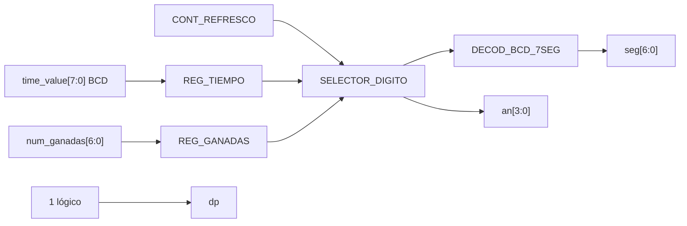

# M01 - Marcador

Archivo RTL de referencia: `src/design/marcador.sv`.

## b) Diagrama modular

## c) Objetivo del módulo

Multiplexar los cuatro dígitos del display de siete segmentos. Los dos dígitos menos
    significativos muestran partidas ganadas y los dos restantes muestran el tiempo restante.

## d) Entradas

- `clk`: reloj de 100 MHz.
    - `rst`: reset síncrono.
    - `time_value[7:0]`: tiempo BCD `{decenas, unidades}` desde M03.
    - `num_ganadas[6:0]`: acumulado binario 0–99 desde M06.

## e) Salidas

- `seg[6:0]`: segmentos activos en bajo, orden `gfedcba`.
    - `an[3:0]`: selección de dígito activa en bajo.
    - `dp`: punto decimal; permanece apagado (`1`).

## f) Explicación de la relación con otros módulos

M03 entrega directamente el tiempo BCD y M06 entrega el acumulado binario. M01 no modifica
    ningún estado del juego; únicamente registra, separa los dígitos y maneja el refresco visual.

## g) Explicación de funcionamiento

El módulo registra ambos valores. `contador_refresco` toma dos bits altos de un contador libre
    para seleccionar un dígito. `selector_digito` elige unidades/decenas y `decod_bcd_7seg`
    transforma el nibble al patrón físico.

## h) Diseño

Distribución física:

    - `AN0`: unidades de ganadas.
    - `AN1`: decenas de ganadas.
    - `AN2`: unidades de tiempo.
    - `AN3`: decenas de tiempo.

    El tiempo no se divide entre 10 porque ya llega en BCD; las ganadas sí llegan en binario y se
    convierten con `/10` y `%10`.

## i) Diagrama esquemático detallado

El diagrama de b) representa también el datapath principal de la implementación. Para módulos con
FSM interna se incluye la secuencia de estados dentro de la explicación de funcionamiento.
