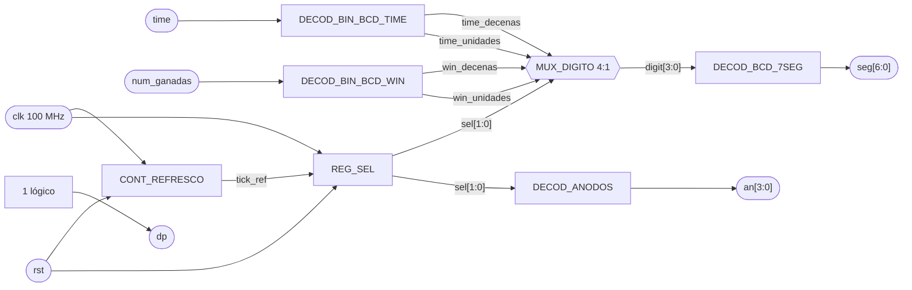

# M01 - Marcador

## Propósito

El módulo `M01_Marcador` se encarga de mostrar en los displays de 7 segmentos el tiempo restante de la partida y el número de partidas ganadas.

Recibe time desde `M03_Temporizador` y num_ganadas desde `M06_Ganadas`. Ambos valores se representan utilizando dos dígitos decimales, para un total de cuatro dígitos multiplexados.

---

## Entradas

* clk: reloj principal de la FPGA, de 100 MHz.
* rst: reinicio del módulo.
* time_value[7:0]: tiempo restante de la partida, proveniente de `M03_Temporizador`, en el mismo
  formato BCD empacado que entrega ese módulo (`{decenas, unidades}`, un nibble cada uno).
* num_ganadas[6:0]: número de partidas ganadas, proveniente de `M06_Ganadas`, en binario puro
  (0 a 99).

---

## Salidas

* seg[6:0]: patrón de los siete segmentos.
* an[3:0]: selección del dígito activo.
* dp: control del punto decimal.

La distribución propuesta es:

| Dígito | Valor               |
| ------ | ------------------- |
| `AN3`  | Decenas del tiempo  |
| `AN2`  | Unidades del tiempo |
| `AN1`  | Decenas de ganadas  |
| `AN0`  | Unidades de ganadas |

---

## f) Relación con otros módulos

time_value proviene directamente de `M03_Temporizador` ya en BCD, mientras que num_ganadas proviene de `M06_Ganadas` en binario. `M01_Marcador` no modifica ninguno de estos valores: a time_value solo le extrae los nibbles, a num_ganadas lo convierte a BCD, y ambos se despliegan igual.

El marcador se mantiene funcionando continuamente y no necesita señales de habilitación provenientes de la FSM.

La multiplexación utiliza únicamente el reloj principal de 100 MHz. Para cambiar entre los cuatro dígitos se genera internamente un pulso de habilitación tick_ref, evitando crear un segundo reloj físico dentro de la FPGA.

rst reinicia tanto el contador de refresco como el selector del dígito activo.

---

## g) Explicación de funcionamiento

`time_value` ya llega empacado en BCD, así que sus dos dígitos se obtienen extrayendo cada
nibble directo, sin ninguna operación aritmética:

$$
time\_decenas = time\_value[7:4] \qquad time\_unidades = time\_value[3:0]
$$

`num_ganadas` sí llega en binario puro, así que sus dos dígitos se calculan con división y
módulo mediante lógica combinacional:

$$
win\_decenas = \left\lfloor \frac{num\_ganadas}{10} \right\rfloor \qquad win\_unidades =
num\_ganadas - 10(win\_decenas)
$$

De esta forma se obtienen cuatro valores BCD:

* time_decenas
* time_unidades
* win_decenas
* win_unidades

Un multiplexor selecciona cuál de estos cuatro dígitos se envía al decodificador BCD a 7 segmentos.

La selección depende de un registro de dos bits REG_SEL, que recorre continuamente los estados:

`00 → 01 → 10 → 11 → 00`

El cambio entre estados se produce mediante tick_ref, generado por `CONT_REFRESCO`.

Con un reloj de 100 MHz y un contador de 25 000 ciclos:

$$
f_{tick}=\frac{100\,000\,000}{25\,000}=4000\text{ Hz}
$$

Como existen cuatro dígitos, cada uno se refresca aproximadamente a:

$$
f_{digito}=\frac{4000}{4}=1000\text{ Hz}
$$

Esta frecuencia permite que visualmente los cuatro dígitos parezcan permanecer encendidos al mismo tiempo.

---

## h) Diseño

El módulo se implementa mediante un datapath sencillo compuesto por lógica combinacional y dos elementos secuenciales principales: CONT_REFRESCO y REG_SEL.

CONT_REFRESCO cuenta de 0 a 24999. Cuando llega al valor máximo, vuelve a cero y genera tick_ref durante un ciclo de reloj.

| Condición       | `count'`    | `tick_ref` |
| --------------- | ----------- | ---------- |
| `rst = 1`       | `0`         | `0`        |
| `count < 24999` | `count + 1` | `0`        |
| `count = 24999` | `0`         | `1`        |

REG_SEL cambia de estado únicamente cuando tick_ref = 1.

| `REG_SEL` | Siguiente valor con `tick_ref = 1` |
| --------- | ---------------------------------- |
| `00`      | `01`                               |
| `01`      | `10`                               |
| `10`      | `11`                               |
| `11`      | `00`                               |

El multiplexor de dígitos utiliza REG_SEL para seleccionar:

| `REG_SEL` | Valor seleccionado |
| --------- | ------------------ |
| `00`      | `win_unidades`     |
| `01`      | `win_decenas`      |
| `10`      | `time_unidades`    |
| `11`      | `time_decenas`     |

El mismo valor selecciona el ánodo correspondiente:

| `REG_SEL` | `an[3:0]` |
| --------- | --------- |
| `00`      | `1110`    |
| `01`      | `1101`    |
| `10`      | `1011`    |
| `11`      | `0111`    |

Suponiendo segmentos activos en bajo, el decodificador BCD a 7 segmentos utiliza `seg[6:0] =
gfedcba`, es decir `seg[0] = a` hasta `seg[6] = g`. Es el mismo orden que asigna a mano
`basys3.xdc` (`seg[0]→CA`, `seg[1]→CB`, ..., `seg[6]→CG`):

| BCD    | Número | `gfedcba` |
| ------ | -----: | --------- |
| `0000` |      0 | `1000000` |
| `0001` |      1 | `1111001` |
| `0010` |      2 | `0100100` |
| `0011` |      3 | `0110000` |
| `0100` |      4 | `0011001` |
| `0101` |      5 | `0010010` |
| `0110` |      6 | `0000010` |
| `0111` |      7 | `1111000` |
| `1000` |      8 | `0000000` |
| `1001` |      9 | `0010000` |

El punto decimal no se utiliza, por lo que dp se mantiene apagado.

---

## i) Diagrama esquemático detallado del diseño

Este diseño mantiene un único dominio de reloj de `100 MHz`. `tick_ref` funciona únicamente como habilitación de conteo y no como un reloj independiente.

