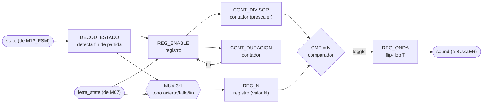
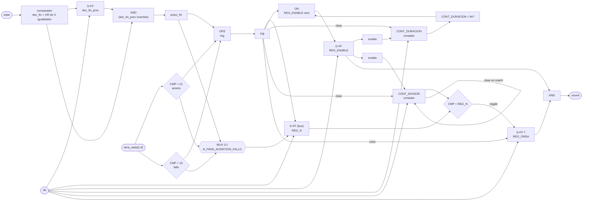

# M02 - Generador-Tono

## a) Nombre del módulo

M02_Generador-Tono

## b) Diagrama modular



## c) Objetivo del módulo

Generar el tono del buzzer. Se dispara solo, con `letra_state` de M07_Comparador-letra para
distinguir acierto de fallo, y decodificando `state` para el tono de fin de partida cuando el
sistema entra a GANO, PERDIO_INTENTOS o PERDIO_TIEMPO. Son los tres sonidos distintos que pide el
enunciado.

## d) Entradas

- `clk`, `rst`.
- `state[2:0]`: estado actual, desde M13_FSM, de ahí saca la entrada a un estado de fin de
  partida.
- `letra_state[1:0]`: resultado de la última letra evaluada, desde M07_Comparador-letra. Se
  asume, siguiendo la convención de pulsos limpios que ya usan `sel`/`ok`/`valid_word` en el
  resto del proyecto, que M07 solo mantiene este valor en `01` (acierto) o `10` (fallo) durante
  **un ciclo de reloj**, y en `00` el resto del tiempo; `11` queda reservado para letra repetida
  y no dispara tono. **Este contrato queda pendiente de confirmar** contra la documentación real
  de M07_Comparador-letra cuando se escriba, porque hoy solo existe su diagrama modular.

## e) Salidas

- `sound`: onda cuadrada de audio, hacia BUZZER.

## f) Explicación de la relación con otros módulos

M02 no recibe órdenes puntuales de nadie ni le devuelve nada a ningún módulo M0X; es, junto con
M05_Estado, uno de los módulos más aislados del diseño, salida directa hacia BUZZER sin pasar por
CONTROL_JUEGO ni por ningún bus.

De `state` (M13_FSM) solo le importan tres de los seis códigos, GANO, PERDIO_INTENTOS y
PERDIO_TIEMPO; el resto (SELECCION, CARGA, JUEGO) es indistinguible para este módulo y no dispara
nada por sí solo. De `letra_state` (M07_Comparador-letra) solo le importan dos de los cuatro
códigos posibles, acierto y fallo; letra repetida no genera sonido, consistente con que el
enunciado dice que una letra repetida "se ignora sin penalizar", y M02 extiende ese silencio
también al buzzer.

M02 no sabe si el fin de partida fue victoria o alguna de las dos derrotas, decodifica los tres
estados de fin como un solo evento y usa el mismo tono para los tres. Esto es intencional: el
enunciado pide "tono distinto para acierto, error, y fin de partida", tres tonos, no cinco, así
que no hay necesidad de que M02 distinga la causa del fin de partida como sí lo hacen M04 y M11.

## g) Funcionamiento

El módulo vigila dos eventos en paralelo: la entrada a un estado de fin de partida (decodificado
de `state`) y un pulso de `letra_state` en acierto o fallo. Cualquiera de los dos, al ocurrir,
dispara un tono nuevo, con la entrada a fin de partida teniendo prioridad sobre un acierto o
fallo que llegara en el mismo ciclo (esto puede pasar de verdad: la última letra que completa la
palabra genera `letra_state = acierto` en M07 en el mismo ciclo en que `palabra_completa` mueve a
la FSM a GANO, así que hace falta una regla de prioridad y se eligió que suene el tono de fin, no
el de acierto, para que el jugador no pierda esa señal).

Al dispararse un tono, el módulo carga en `REG_N` el divisor de frecuencia que le corresponde
(uno distinto por cada uno de los tres tonos), reinicia el contador de duración desde cero, y
arranca `REG_ENABLE`. Mientras `REG_ENABLE` esté activo, un contador (`CONT_DIVISOR`) cuenta
ciclos de reloj y cada vez que alcanza el valor cargado en `REG_N` conmuta un flip-flop tipo T
(`REG_ONDA`), lo que genera una onda cuadrada de la frecuencia deseada, la misma técnica de
divisor de frecuencia que usa M03_Temporizador para bajar de 100 MHz a 1 Hz, aplicada aquí para
bajar de 100 MHz a un tono audible. Un segundo contador (`CONT_DURACION`) cuenta en paralelo
mientras `REG_ENABLE` está activo; cuando llega a la duración fija del tono, apaga
`REG_ENABLE` y el módulo vuelve a silencio hasta el próximo disparo.

La salida `sound` no es directamente `REG_ONDA`: se combina con `REG_ENABLE` (`sound = REG_ONDA
AND REG_ENABLE`) para que el buzzer quede en `0` franco entre tonos, en vez de quedarse
"congelado" en `1` si el último toggle antes de apagarse dejó la onda en alto. Un piezoeléctrico
pasivo con una tensión de continua sostenida no sueña nada pero sí puede degradarse con el tiempo,
así que forzar el silencio a `0` es la opción más segura y no cuesta hardware adicional, un único
AND de dos entradas.

## h) Diseño

### Detector de entrada a fin de partida

`DECOD_ESTADO` es puramente combinacional:

```
dec_fin = (state == GANO) | (state == PERDIO_INTENTOS) | (state == PERDIO_TIEMPO)
```

Como `dec_fin` es un nivel que se mantiene mientras dure el estado de fin (hasta 3 s, ver
M03_Temporizador), hace falta un detector de flanco para no quedarse re-disparando el tono cada
ciclo. Se registra `dec_fin` un ciclo (`dec_fin_prev`) y se genera un pulso de un ciclo:

| `dec_fin` (actual) | `dec_fin_prev` | `pulso_fin` |
|---|---|---|
| 0 | 0 | 0 |
| 0 | 1 | 0 |
| 1 | 0 | 1 |
| 1 | 1 | 0 |

`pulso_fin = dec_fin AND (NOT dec_fin_prev)`, la misma estructura de detector de flanco de subida
que usa M09_Botones sobre el valor ya estable de cada botón.

### Selección de disparo y de frecuencia (MUX 3:1)

Señal de disparo combinacional:

```
trig = pulso_fin OR (letra_state == 2'b01) OR (letra_state == 2'b10)
```

El `MUX 3:1` decide, con prioridad fin > acierto > fallo, qué valor de `N` se carga en `REG_N`
cuando `trig = 1`:

| `pulso_fin` | `letra_state` | Tono seleccionado | `N` cargado en `REG_N` |
|---|---|---|---|
| 1 | XX | FIN | `N_FIN` |
| 0 | 01 | ACIERTO | `N_ACIERTO` |
| 0 | 10 | FALLO | `N_FALLO` |
| 0 | 00 | (sin disparo) | `REG_N` conserva su valor |
| 0 | 11 | (sin disparo, repetida) | `REG_N` conserva su valor |

### REG_ENABLE y CONT_DURACION

`CONT_DURACION` es un contador que corre solo mientras `REG_ENABLE = 1`, y comparte una única
duración fija (`DUR_CYCLES`) para los tres tonos, ya que el diagrama modular solo contempla un
contador de duración y no un segundo mux para seleccionarla; distinguir los tonos únicamente por
frecuencia es suficiente para el propósito de este módulo y evita duplicar hardware de selección.

| `trig` | `REG_ENABLE` actual | `CONT_DURACION = DUR_CYCLES-1`? | `REG_ENABLE` siguiente | `CONT_DURACION` siguiente |
|---|---|---|---|---|
| 1 | X | X | 1 | 0 (reinicia, un disparo nuevo interrumpe al que estuviera sonando) |
| 0 | 0 | X | 0 | 0 |
| 0 | 1 | 0 | 1 | `CONT_DURACION + 1` |
| 0 | 1 | 1 | 0 | 0 |

### CONT_DIVISOR y REG_ONDA (generación de la onda cuadrada)

`CONT_DIVISOR` solo cuenta mientras `REG_ENABLE = 1`; en reposo, o justo al dispararse un `trig`
nuevo, se fuerza a 0 junto con `REG_ONDA`, para que cada tono arranque siempre desde silencio con
un flanco limpio en vez de heredar la fase del tono anterior:

| `trig` | `REG_ENABLE` | `CONT_DIVISOR = REG_N`? | `CONT_DIVISOR` siguiente | `REG_ONDA` siguiente |
|---|---|---|---|---|
| 1 | X | X | 0 | 0 |
| 0 | 0 | X | 0 | 0 (mantiene silencio) |
| 0 | 1 | 0 | `CONT_DIVISOR + 1` | `REG_ONDA` (sin cambio) |
| 0 | 1 | 1 | 0 | `NOT REG_ONDA` (toggle) |

Con esto la frecuencia de salida es `f = f_clk / (2 · (N + 1))`, la misma relación que usa
M03_Temporizador para su `tick_1Hz`, solo que acá el "período" de interés es audible en vez de
segundos.

### Valores de frecuencia y duración propuestos

Se exponen como `parameter` con valores de producción por defecto (no `localparam`), siguiendo el
principio ya usado en otros módulos del proyecto de dejar las constantes de tiempo overrideables
desde el testbench para simulación práctica en EDA Playground:

| Parámetro | Valor por defecto | Frecuencia resultante | `N` (18 bits) |
|---|---|---|---|
| `F_ACIERTO_HZ` | 1000 Hz | agudo, "positivo" | `N_ACIERTO = 49 999` |
| `F_FALLO_HZ` | 250 Hz | grave, "negativo" | `N_FALLO = 199 999` |
| `F_FIN_HZ` | 500 Hz | intermedio, distinguible de los otros dos | `N_FIN = 99 999` |
| `DUR_MS` | 150 ms | duración común a los tres tonos | `DUR_CYCLES = 14 999 999` (24 bits) |

`CONT_DIVISOR` necesita 18 bits para alcanzar 199 999 (el `N` más grande, el del tono más grave).
`CONT_DURACION` necesita 24 bits para alcanzar 14 999 999. Ambos anchos van con `$clog2` sobre los
parámetros, no fijos a mano, para que si el equipo ajusta las frecuencias o la duración el ancho
de los contadores se recalcule solo.

## i) Diagrama esquemático detallado (por compuertas lógicas)



`clk` y `rst` entran a todo registro/contador del módulo aunque no se dibujen en cada elemento,
por el mismo criterio usado en el resto de los diagramas del proyecto; `rst` fuerza
`REG_ENABLE = 0`, `dec_fin_prev = 0`, `CONT_DIVISOR = 0`, `CONT_DURACION = 0` y `REG_ONDA = 0`,
dejando el buzzer en silencio tras cualquier reinicio, incluido `BTN_RST` a mitad de un tono.