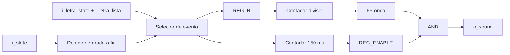

# M02 - Generador de tono

Archivo RTL de referencia: `src/design/generador_tono.sv`.

## b) Diagrama modular

## c) Objetivo del módulo

Generar realimentación sonora distinta para acierto, fallo y fin de partida usando una onda
    cuadrada sobre el buzzer.

## d) Entradas

- `clk`, `rst`.
    - `i_state[2:0]`: estado global.
    - `i_letra_state[1:0]`: fallo/acierto/repetida.
    - `i_letra_lista`: pulso que indica resultado de letra válido.

## e) Salidas

- `o_sound`: onda cuadrada hacia el buzzer.

## f) Explicación de la relación con otros módulos

Recibe el resultado de M07 y el estado de M13. Una letra repetida no dispara sonido. La
    entrada a un estado final genera el tono de fin.

## g) Explicación de funcionamiento

Los valores por defecto son 1000 Hz para acierto, 250 Hz para fallo y 500 Hz para fin, todos
    durante 150 ms. Cada nuevo disparo reinicia la duración y el divisor, por lo que un evento
    reciente puede interrumpir el tono anterior.

## h) Diseño

El RTL todavía reconoce `3'b101` como un segundo código histórico de derrota. La FSM actual
    no genera ese estado; `3'b100` sí está incluido y por eso el tono de derrota actual funciona.
    Esta compatibilidad heredada se registra también en la documentación general.

## i) Diagrama esquemático detallado

El diagrama de b) representa también el datapath principal de la implementación. Para módulos con
FSM interna se incluye la secuencia de estados dentro de la explicación de funcionamiento.
