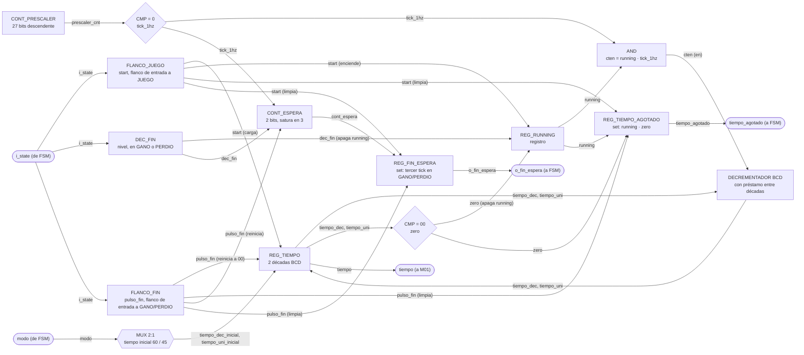
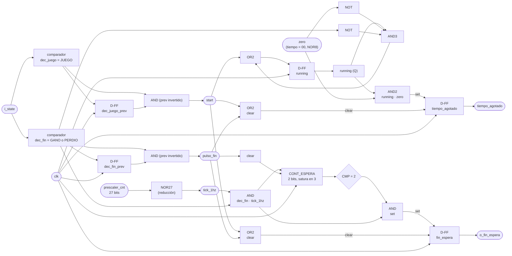

# M03 - Temporizador

## a) Nombre del módulo

M03_Temporizador

## b) Diagrama modular

## c) Objetivo del módulo

Controla el tiempo disponible para la partida y el tiempo que se muestra el resultado. Al ver que
`i_state` entró a JUEGO, carga el tiempo inicial según el `modo` recibido y arranca la cuenta
regresiva. Al llegar a cero, avisa a la `FSM` con `tiempo_agotado`. Al ver que `i_state` entró a
GANO o a PERDIO, corta la cuenta regresiva de inmediato (la partida ya se resolvió), reinicia el
tiempo mostrado a 00 y cuenta tres pulsos de 1 Hz para levantar `o_fin_espera`, con lo que la
`FSM` vuelve a SELECCION. Entrega el tiempo restante en todo momento a `M01_Marcador` para su
despliegue.

## d) Entradas

- `clk`, `rst`.
- `i_state[2:0]`: estado actual, desde la `FSM`. M03 decodifica la entrada a JUEGO para arrancar
  la cuenta y la entrada a GANO/PERDIO para arrancar la espera de `o_fin_espera`. No hay un puerto
  `start` aparte: la `FSM` no manda señales puntuales a ningún módulo (ver `M13_FSM.md`, f), así
  que M03 se engancha del mismo `state` que ya se difunde, igual que hacen `M08_LFSR` y
  `M07_Comparador-letra` con la entrada a CARGA.
- `modo`: selecciona el modo de operación (0 fácil, 1 difícil), define el tiempo inicial a cargar.

El módulo tiene además el `parameter PRESCALER_RECARGA` (27 bits, por defecto `99_999_999`). Es
`parameter` y no `localparam` para que el testbench lo pueda achicar y simular una cuenta completa
sin esperar 100 000 000 ciclos por segundo.

## e) Salidas

- `tiempo[7:0]`: tiempo restante en BCD, `{decenas, unidades}`, hacia `M01_Marcador`.
- `tiempo_agotado`: indica a la `FSM` que la cuenta de la partida llegó a cero.
- `o_fin_espera`: indica a la `FSM` que ya pasó la espera mostrando el resultado en GANO o PERDIO.

## f) Explicación de la relación con otros módulos

M03 solo recibe `i_state` y `modo` de la `FSM`, y solo le responde a la `FSM` (`tiempo_agotado`,
`o_fin_espera`). El valor de tiempo en sí (`tiempo`) va aparte hacia `M01_Marcador` para su
despliegue. No tiene ninguna relación con M02, M04, M11 ni con ningún periférico de bus: vive
solo, aislado, dentro del subgraph TEMPORIZADOR. Es importante que M03 nunca se conecte con
M11_Transmisor-UART, porque el enunciado exige explícitamente que el tiempo restante no se
transmita por UART hacia la PC.

Las dos banderas que le entrega a la `FSM` tienen que valer 0 en el primer ciclo del estado en
que la `FSM` las consulta, `tiempo_agotado` en JUEGO y `o_fin_espera` en GANO/PERDIO. M03 detecta
el flanco de entrada en ese mismo primer ciclo, pero sus registros recién cambian al final del
ciclo, así que no puede limpiarlas "al entrar" al estado que las consulta. Las limpia antes, en
el flanco de un estado anterior del ciclo de la partida (ver g y h).

## g) Funcionamiento

Cuenta el tiempo mientras está habilitado (`running`). Al detectar el flanco de entrada a JUEGO
(`start`), M03 carga el tiempo inicial correspondiente al `modo` recibido y activa `running`.
Mientras `running` esté activa, cada pulso `tick_1hz` del prescaler decrementa el tiempo
restante en 1. Cuando el contador llega a 00, se levanta `tiempo_agotado` y se apaga `running`
automáticamente, ya no hay nada que contar.

`running` también se apaga, sin esperar a que el tiempo llegue a 0, apenas `i_state` entra a GANO
o a PERDIO: la partida ya se resolvió (palabra completa o sexto fallo) y no tiene sentido seguir
descontando en el fondo mientras el LCD muestra el resultado. En el mismo flanco de entrada a
GANO/PERDIO (`pulso_fin`) el tiempo mostrado se reinicia a 00, no se congela en el valor que
tenía, así que el jugador ve el resultado sin un número residual de la partida.

Por separado, en ese mismo `pulso_fin` M03 reinicia un segundo contador, `cont_espera`, que
cuenta los `tick_1hz` mientras el estado siga en GANO o PERDIO. Al tercer pulso levanta
`o_fin_espera`, y la `FSM` vuelve a SELECCION. El prescaler es uno solo y corre libre sin depender
del estado de la FSM, así que sirve para las dos cuentas a la vez.

Ciclo de vida de las dos banderas a lo largo de una partida:

| Evento | `tiempo_agotado` | `o_fin_espera` |
|---|---|---|
| `rst` | 0 | 0 |
| entrada a JUEGO (`start`) | 0 | 0 |
| tiempo llega a 00 corriendo | 1 | sin cambio |
| entrada a GANO/PERDIO (`pulso_fin`) | 0 | 0 |
| tercer `tick_1hz` en GANO/PERDIO | sin cambio | 1 |
| vuelta a SELECCION, CARGA | sin cambio (0) | sin cambio (1) |

`tiempo_agotado` se limpia en `pulso_fin`, así que ya vale 0 mucho antes de la siguiente entrada a
JUEGO. `o_fin_espera` se queda en 1 durante SELECCION y CARGA, donde la `FSM` no lo consulta, y se
limpia en el `start` de la partida siguiente, mucho antes de que la `FSM` pueda volver a un estado
de fin.

En la primera versión cada bandera se limpiaba solo en el flanco del estado que la consulta,
`tiempo_agotado` con `start` y `o_fin_espera` con `pulso_fin`. Eso funcionaba en la primera
partida después del reset, pero no en las siguientes. El registro recién baja al final del
primer ciclo del estado nuevo, y en ese ciclo la `FSM` todavía veía el 1 de la partida anterior.
Con `o_fin_espera`, desde la segunda partida GANO/PERDIO duraba un solo ciclo y el resultado no
se alcanzaba a ver. Con `tiempo_agotado`, después de perder por tiempo, la siguiente partida
pasaba de JUEGO a PERDIO en un ciclo, sin dejar jugar. Se encontró simulando `fsm.sv` y
`temporizador.sv` juntos durante varias partidas seguidas.

### Duraciones reales

El prescaler corre libre, así que la entrada a JUEGO o a GANO/PERDIO cae en un punto cualquiera
del segundo en curso, y el primer `tick_1hz` llega entre 1 ciclo y 1 s después. Por eso:

- La partida dura entre 59 y 60 s en fácil y entre 44 y 45 s en difícil. El display sí arranca
  mostrando 60 o 45.
- La espera en GANO/PERDIO dura entre 2 y 3 s, tres ticks donde el primero puede llegar casi de
  inmediato.

## h) Diseño

El tiempo restante se maneja en BCD (dos dígitos, decenas y unidades) en vez de binario puro,
para conectarlo directo al decodificador BCD→7 segmentos de M01_Marcador sin necesitar un
divisor por 10 adicional. El costo es usar dos contadores en cascada en vez de uno binario de 7
bits.

### Detección de flancos de estado

`start` es la señal interna `dec_juego & ~dec_juego_prev`, con `dec_juego = (i_state == JUEGO)`
y `dec_juego_prev` un flip-flop D del ciclo anterior, el mismo par registro-comparador que usa
`M11_Transmisor-UART` para sus propios pulsos de disparo. `dec_fin` es el nivel
`(i_state == GANO) || (i_state == PERDIO)`, y `pulso_fin = dec_fin & ~dec_fin_prev` su flanco de
subida.

### REG_RUNNING

Como no existe una entrada `detener`, la bandera `running` se apaga sola cuando el contador llega
a cero o cuando `i_state` está en GANO/PERDIO. `start` tiene prioridad total, y si no está en alto
`running_next = running AND NOT zero AND NOT dec_fin`:

| start | running | zero | dec_fin | running_next |
|---|---|---|---|---|
| 1 | X | X | X | 1 |
| 0 | 0 | X | X | 0 |
| 0 | 1 | 0 | 0 | 1 |
| 0 | 1 | 1 | X | 0 |
| 0 | 1 | X | 1 | 0 |

`running_next = start + running · zero' · dec_fin'`.

### CONT_PRESCALER

El `tick_1hz` se genera con un contador binario de 27 bits que cuenta en modo descendente desde
`PRESCALER_RECARGA = 99_999_999`. Cuando llega a 0, `tick_1hz = (prescaler_cnt == 0)` vale 1
durante ese ciclo y el contador se recarga, así que el periodo es exactamente 100 000 000 ciclos,
1 s a 100 MHz. El comparador contra 0 es un NOR de reducción de 27 bits, que en la FPGA se
resuelve con un par de LUT en cascada. Corre libre desde el reset, sin reiniciarse con la entrada
a JUEGO ni con la entrada a GANO/PERDIO, así que las dos cuentas comparten el mismo `tick_1hz`
sin estorbarse.

### REG_TIEMPO y decrementador BCD

El multiplexor de valor inicial selecciona entre dos constantes fijas en BCD, `6 0` para fácil y
`4 5` para difícil (ver `M13_FSM.md`). El habilitador de conteo es `cten = running · tick_1hz`, y
`zero = (tiempo_dec == 0) · (tiempo_uni == 0)`. Tabla de prioridad del registro:

| Condición (prioridad descendente) | `tiempo_dec'` | `tiempo_uni'` |
|---|---|---|
| `rst` | 0 | 0 |
| `start` | inicial según `modo` | inicial según `modo` |
| `pulso_fin` | 0 | 0 |
| `cten · zero'` y `tiempo_uni = 0` | `tiempo_dec - 1` | 9 |
| `cten · zero'` y `tiempo_uni ≠ 0` | `tiempo_dec` | `tiempo_uni - 1` |
| resto | `tiempo_dec` | `tiempo_uni` |

El `zero'` en la condición de decremento evita que la cuenta dé la vuelta a 99 en el mismo ciclo
en que llega a 00, antes de que `running` alcance a apagarse. `start` y `pulso_fin` nunca
coinciden, porque `dec_juego` y `dec_fin` son estados mutuamente excluyentes de la FSM.

### REG_TIEMPO_AGOTADO

| Condición (prioridad descendente) | `tiempo_agotado'` |
|---|---|
| `rst` | 0 |
| `start + pulso_fin` | 0 |
| `running · zero` | 1 |
| resto | `tiempo_agotado` |

Se levanta con `running · zero` y no con `zero` solo, porque después del reset el tiempo vale 00 y
la bandera quedaría en un falso "agotado" antes de cualquier partida. El clear con `pulso_fin` es
el que evita que la `FSM` vea el 1 viejo en el primer ciclo de JUEGO de la partida siguiente (ver
g). El de `start` quedó del diseño anterior y ahora es redundante, pero no estorba.

### CONT_ESPERA y REG_FIN_ESPERA

`fin_espera` cuenta pulsos en vez de comparar contra cero. `cont_espera` es un registro de
`$clog2(ESPERA_S + 1) = 2` bits, con `ESPERA_S = 3`:

| Condición (prioridad descendente) | `cont_espera'` |
|---|---|
| `rst + pulso_fin` | 0 |
| `dec_fin · tick_1hz · (cont_espera ≠ 3)` | `cont_espera + 1` |
| resto | `cont_espera` |

Satura en 3 para no dar la vuelta si la FSM tardara en consumir `o_fin_espera`.

| Condición (prioridad descendente) | `o_fin_espera'` |
|---|---|
| `rst` | 0 |
| `pulso_fin + start` | 0 |
| `dec_fin · tick_1hz · (cont_espera = 2)` | 1 |
| resto | `o_fin_espera` |

La bandera sube en el mismo ciclo en que `cont_espera` pasa de 2 a 3, o sea con el tercer tick.
El clear con `start` es el que evita que la `FSM` vea el 1 viejo en el primer ciclo de GANO/PERDIO
de la partida siguiente (ver g). El de `pulso_fin` quedó del diseño anterior y ahora es
redundante, pero no estorba.

## i) Diagrama esquemático detallado (por compuertas lógicas)

`NOR8` representa la compuerta de reducción que detecta "todo el registro de tiempo en 0"
(8 bits de las dos décadas BCD, la señal `zero`), y `NOR27` la que genera `tick_1hz` a partir del
prescaler. En la implementación real las dos son árboles de compuertas de pocas entradas en
cascada, no una sola compuerta de 8 o 27 entradas. El decrementador BCD de `REG_TIEMPO` no se
dibuja por compuertas, está descrito por su tabla en la h).
