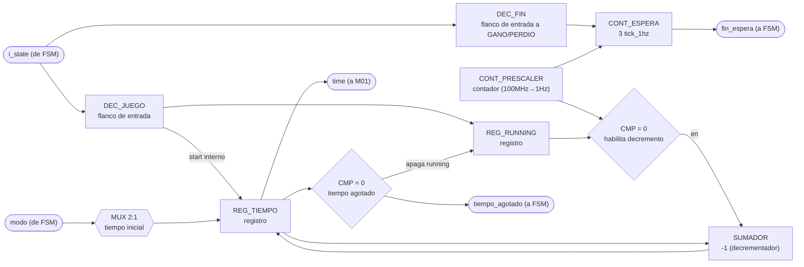
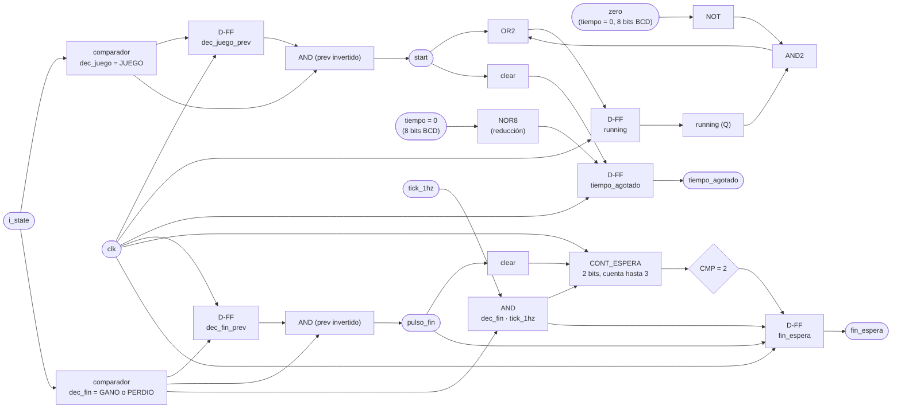

# M03 - Temporizador

## a) Nombre del módulo

M03_Temporizador

## b) Diagrama modular

## c) Objetivo del módulo

Controla el tiempo disponible para la partida y el tiempo mínimo que se muestra el resultado.
Al ver que `i_state` entró a JUEGO, carga el tiempo inicial según el `modo` recibido y arranca la
cuenta regresiva; al llegar a cero, avisa a la `FSM` mediante una señal `tiempo_agotado`. Al ver
que `i_state` entró a GANO o a PERDIO, cuenta 3 s y levanta `fin_espera` para que la `FSM` pueda
volver a SELECCION. Entrega el tiempo restante en todo momento a `M01_Marcador` para su
despliegue.

## d) Entradas

- `clk`, `rst`.
- `i_state`: estado actual, desde la `FSM`. M03 decodifica la entrada a JUEGO para arrancar la
  cuenta y la entrada a GANO/PERDIO para arrancar los 3 s de `fin_espera`. No hay un puerto
  `start` aparte: la `FSM` no manda señales puntuales a ningún módulo (ver `M13_FSM.md`, f), así
  que M03 se engancha del mismo `state` que ya se difunde, igual que hacen `M08_LFSR` y
  `M07_Comparador-letra` con la entrada a CARGA.
- `modo`: selecciona el modo de operación (fácil/difícil), define el tiempo inicial a cargar.

## e) Salidas

- `time`: tiempo restante hacia `M01_Marcador`.
- `tiempo_agotado`: indica a la `FSM` que terminó el tiempo.
- `fin_espera`: indica a la `FSM` que ya pasaron los 3 s mínimos mostrando el resultado en GANO o
  PERDIO.

## f) Explicación de la relación con otros módulos

M03 solo recibe `i_state` y `modo` de la `FSM`, y solo le responde a la `FSM` (`tiempo_agotado`,
`fin_espera`); el valor de tiempo en sí (`time`) va aparte hacia `M01_Marcador` para su
despliegue. No tiene ninguna relación con M02, M04, M11 ni con ningún periférico de bus: vive
solo, aislado, dentro del subgraph TEMPORIZADOR. Es importante que M03 nunca se conecte con
M11_Transmisor-UART, porque el enunciado exige explícitamente que el tiempo restante no se
transmita por UART hacia la PC.

## g) Funcionamiento

Cuenta el tiempo mientras está habilitado (`running`). Al detectar el flanco de entrada a JUEGO,
M03 carga el tiempo inicial correspondiente al `modo` recibido y activa `running`. Mientras
`running` esté activa, un divisor de reloj (prescaler) genera un pulso de 1 Hz que decrementa el
tiempo restante en 1 cada vez. Cuando el contador llega a 0, se levanta `tiempo_agotado`, se
apaga `running` automáticamente (ya no hay nada que contar) y `tiempo_agotado` se mantiene en
alto hasta la siguiente entrada a JUEGO.

Por separado, al detectar el flanco de entrada a GANO o a PERDIO, M03 arranca un segundo contador
con el mismo `tick_1hz` del prescaler. A los 3 pulsos levanta `fin_espera`, y se mantiene en alto
hasta la siguiente entrada a un estado de fin (la de la próxima partida), igual que
`tiempo_agotado` se mantiene hasta el siguiente arranque. El prescaler es uno solo y corre libre
sin depender de en qué estado esté la FSM, así que sirve para las dos cuentas a la vez.

## h) Diseño

El tiempo restante se manejaen BCD (dos dígitos, decenas y unidades) en vez de binario puro,
para conectarlo directo al decodificador BCD→7 segmentos de M01_Marcador sin necesitar un
divisor por 10 adicional; el costo es usar dos contadores en cascada en vez de uno binario de 7
bits.

Como no existe una entrada `detener`, la bandera `running` se apaga sola cuando el contador
llega a cero, en vez de por una señal externa. `start` ya no es un puerto, es la señal interna
`dec_juego & ~dec_juego_prev` que detecta el flanco de entrada a JUEGO, con el mismo par
registro-comparador que usa `M11_Transmisor-UART` para sus propios pulsos de disparo. Tabla de
verdad de `running` (entradas `start` ya interno, `running` actual y `zero` = "el contador de
tiempo ya está en 0"; salida `running_next`):

| start | running | zero | running_next |
|---|---|---|---|
| 0 | 0 | 0 | 0 |
| 0 | 0 | 1 | 0 |
| 0 | 1 | 0 | 1 |
| 0 | 1 | 1 | 0 |
| 1 | 0 | 0 | 1 |
| 1 | 0 | 1 | 1 |
| 1 | 1 | 0 | 1 |
| 1 | 1 | 1 | 1 |

El hhabilitador de conteo
de los contadores BCD es `CTEN = running · tick_1Hz`.

El `tick_1Hz` se genera con un contador binario de 27 bits que cuenta en modo descendente,
cargado con el valor `100 000 000 − 1` a 100 MHz; se usa la salida de acarreo/borrow (Ripple
Carry Output) de la última etapa como el propio pulso de un ciclo, evitando así un comparador de
27 bits. Corre libre desde el reset, sin reiniciarse con la entrada a JUEGO ni con la entrada a
GANO/PERDIO, así que las dos cuentas (`tiempo_agotado` y `fin_espera`) comparten el mismo
`tick_1Hz` sin estorbarse.

El multiplexor de valor inicial (`modo` → tiempo de arranque) selecciona entre dos constantes
fijas (60 s fácil, 45 s difícil, ver `M13_FSM.md`).

`fin_espera` usa el mismo patrón que `tiempo_agotado`, pero contando pulsos en vez de comparar
contra cero: un registro de 2 bits (`cont_espera`) cuenta los `tick_1Hz` transcurridos desde el
flanco de entrada a GANO o a PERDIO (`dec_fin & ~dec_fin_prev`), y al llegar a 3 levanta
`fin_espera`. El contador y la bandera se limpian en el mismo flanco que arma la siguiente cuenta,
para no arrastrar la cuenta de la partida anterior si la FSM tarda en consumir `fin_espera`.

## i) Diagrama esquemático detallado (por compuertas lógicas)

`NOR8` representa la compuerta de reducción que detecta "todo el registro de tiempo en 0"
(8 bits de las dos décadas BCD, la misma señal `zero` usada arriba); en la implementación real
es un árbol de compuertas NOR/OR de 2-3 entradas en cascada, noo una sola compuerta de 8 entradas.

