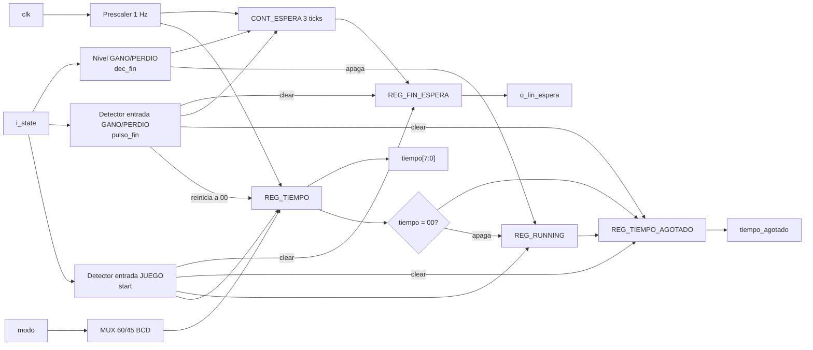
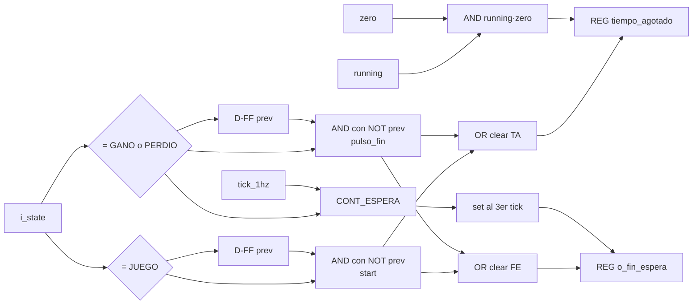

# M03 - Temporizador

Archivo RTL de referencia: `src/design/temporizador.sv`.

## b) Diagrama modular



## c) Objetivo del módulo

Llevar la cuenta regresiva de la partida y generar la espera utilizada por la FSM para mantener el
resultado final antes de regresar a selección.

## d) Entradas

- `clk`, `rst`.
- `i_state[2:0]`: estado global de M13.
- `modo`: `0` fácil y `1` difícil.

No se agregaron puertos nuevos respecto a la revisión anterior. `start`, `dec_fin` y `pulso_fin`
son señales **internas** derivadas de `i_state`.

## e) Salidas

- `tiempo[7:0]`: tiempo restante en BCD `{decenas, unidades}`.
- `tiempo_agotado`: indica a M13 que la cuenta llegó a cero durante una partida activa.
- `o_fin_espera`: indica a M13 que se cumplieron los tres ticks de espera en `GANO` o `PERDIO`.

## f) Explicación de la relación con otros módulos

M13 entrega únicamente `state` y `modo`; no genera un `start` ni un `detener` independiente.
M03 detecta internamente la entrada a `JUEGO` mediante `start` y la entrada a `GANO/PERDIO`
mediante `pulso_fin`.

`tiempo_agotado` y `o_fin_espera` vuelven a M13. `tiempo` se conecta directamente a M01 para los
dos dígitos de tiempo del display.

Las conexiones externas del módulo no cambiaron, por lo que `top.sv`, M13 y el diagrama de nivel 3
mantienen exactamente los mismos puertos que en la revisión anterior.

## g) Explicación de funcionamiento

Al entrar a `JUEGO`, `start` carga `60` BCD en modo fácil o `45` BCD en modo difícil y activa
`running`. El prescaler genera `tick_1hz`; mientras `running=1`, cada tick decrementa el tiempo en
BCD.

Cuando el tiempo llega a `00` durante una partida activa, `tiempo_agotado` se pone en `1` y
`running` se apaga.

Si la partida termina antes por victoria o por seis fallos, la FSM entra a `GANO` o `PERDIO`.
M03 detecta ese flanco como `pulso_fin`, apaga `running`, pone el tiempo mostrado en `00` y empieza
la cuenta de tres ticks para generar `o_fin_espera`.

### Cambio importante de esta revisión

Se corrigió el ciclo de vida de las dos banderas para evitar que un `1` de la partida anterior sea
interpretado por la FSM en la partida siguiente:

| Evento | `tiempo_agotado` | `o_fin_espera` |
|---|---:|---:|
| `rst` | 0 | 0 |
| entrada a JUEGO (`start`) | 0 | 0 |
| tiempo llega a 00 mientras `running=1` | 1 | sin cambio |
| entrada a GANO/PERDIO (`pulso_fin`) | **0** | **0** |
| tercer tick en GANO/PERDIO | sin cambio | 1 |
| SELECCION/CARGA posteriores | 0 | puede seguir en 1 |
| siguiente entrada a JUEGO (`start`) | 0 | **0** |

La corrección concreta del RTL es:

```systemverilog
// Antes:
else if (start)
    tiempo_agotado <= 1'b0;

// Ahora:
else if (start || pulso_fin)
    tiempo_agotado <= 1'b0;
```

y:

```systemverilog
// Antes:
else if (pulso_fin)
    o_fin_espera <= 1'b0;

// Ahora:
else if (pulso_fin || start)
    o_fin_espera <= 1'b0;
```

Esto evita dos fallas entre partidas consecutivas:

1. Después de perder por tiempo, `tiempo_agotado` podía seguir en `1` hasta el primer ciclo de la
   nueva partida y provocar una derrota inmediata.
2. `o_fin_espera` podía conservar el `1` de la ronda anterior y hacer que un resultado posterior
   durara solamente un ciclo antes de volver a `SELECCION`.

## h) Diseño

### Señales internas derivadas de `state`

```systemverilog
dec_juego = (i_state == JUEGO);
start     = dec_juego & ~dec_juego_prev;

dec_fin   = (i_state == GANO) || (i_state == PERDIO);
pulso_fin = dec_fin & ~dec_fin_prev;
```

`start` y `pulso_fin` son pulsos de un ciclo obtenidos mediante detección de flanco.

### Registro `running`

Conceptualmente:

```text
running_next = start OR (running AND NOT zero AND NOT dec_fin)
```

Por ello:

- `start` enciende la cuenta.
- `zero` la apaga al llegar a cero.
- `dec_fin` la apaga si la partida termina por otra causa.

### Registro `tiempo_agotado`

Prioridad:

| Condición | Siguiente valor |
|---|---:|
| `rst` | 0 |
| `start OR pulso_fin` | 0 |
| `running AND zero` | 1 |
| resto | conserva |

El `clear` con `pulso_fin` es el cambio relevante respecto a la revisión anterior.

### Registro `o_fin_espera`

Prioridad:

| Condición | Siguiente valor |
|---|---:|
| `rst` | 0 |
| `pulso_fin OR start` | 0 |
| tercer tick estando en GANO/PERDIO | 1 |
| resto | conserva |

El `clear` con `start` es el otro cambio relevante.

## i) Diagrama esquemático detallado


