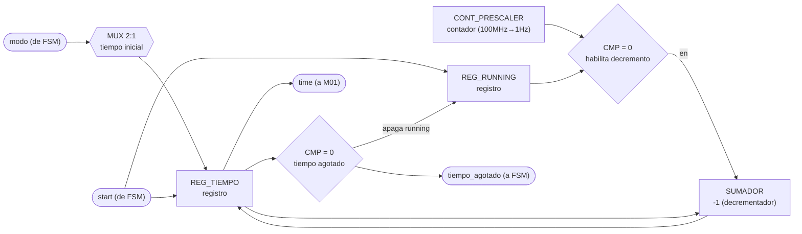
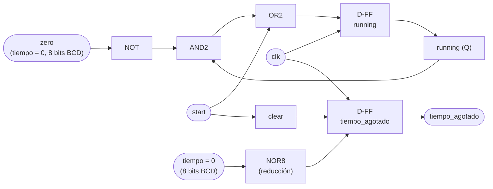

# M03 - Temporizador

## a) Nombre del módulo

M03_Temporizador

## b) Diagrama modular

## c) Objetivo del módulo

Controla el tiempo disponible para la partida. Al recibir `start`, carga el tiempo inicial según
el `modo` recibido y arranca la cuenta regresiva; al llegar a cero, avisa a la `FSM` mediante una señal
`tiempo_agotado` y entrega el tiempo restante en todo momento a `M01_Marcador` para su
despliegue.

## d) Entradas

- `clk`, `rst`.
- `start`: inicia el temporizador desde la `FSM` (carga el tiempo inicial y arranca la cuenta).
- `modo`: selecciona el modo de operación (fácil/difícil), define el tiempo inicial a cargar.

## e) Salidas

- `time`: tiempo restante hacia `M01_Marcador`.
- `tiempo_agotado`: indica a la `FSM` que terminó el tiempo.

## f) Explicación de la relación con otros módulos

M03 solo recibe órdenes de la `FSM` (`start`, `modo`) y solo le responde a la `FSM`
(`tiempo_agotado`); el valor de tiempo en sí (`time`) va aparte hacia `M01_Marcador` para su
despliegue. No tiene ninguna relación con M02, M04, M11 ni con ningún periférico de bus: vive
solo, aislado, dentro del subgraph TEMPORIZADOR. Es importante que M03 nunca se conecte con
M11_Transmisor-UART, porque el enunciado exige explícitamente que el tiempo restante no se
transmita por UART hacia la PC.

## g) Funcionamiento

Cuenta el tiempo mientras está habilitado (`running`). Al recibir `start`, M03 carga el tiempo
inicial correspondiente al `modo` recibido y activa `running`. Mientras `running` esté activa,
un divisor de reloj (prescaler) genera un pulso de 1 Hz que decrementa el tiempo restante en 1
cada vez. Cuando el contador llega a 0, se levanta `tiempo_agotado`, se apaga `running`
automáticamente (ya no hay nada que contar) y `tiempo_agotado` se mantiene en alto hasta el
siguiente `start`.

## h) Diseño

El tiempo restante se manejaen BCD (dos dígitos, decenas y unidades) en vez de binario puro,
para conectarlo directo al decodificador BCD→7 segmentos de M01_Marcador sin necesitar un
divisor por 10 adicional; el costo es usar dos contadores en cascada en vez de uno binario de 7
bits.

Como no existe una entrada `detener`, la bandera `running` se apaga sola cuando el contador
llega a cero, en vez de por una señal externa. Tabla de verdad de `running` (entradas `start`,
`running` actual y `zero` = "el contador de tiempo ya está en 0"; salida `running_next`):

| start | running | zero | running_next |
|---|---|---|---|
| 0 | 0 | 0 | 0 |
| 0 | 0 | 1 | 0 |
| 0 | 1 | 0 | 1 |
| 0 | 1 | 1 | 0 |
| 1 | 0 | 0 | 1 |
| 1 | 0 | 1 | 1 |
| 1 | 1 | 0 | 1 |
| 1 | 1 | 1 | 1 |

El hhabilitador de conteo
de los contadores BCD es `CTEN = running · tick_1Hz`.

El `tick_1Hz` se genera con un contador binario de 27 bits que cuenta en modo descendente,
cargado con el valor `100 000 000 − 1` a 100 MHz; se usa la salida de acarreo/borrow (Ripple
Carry Output) de la última etapa como el propio pulso de un ciclo, evitando así un comparador de
27 bits.

El multiplexor de valor inicial (`modo` → tiempo de arranque) selecciona entre dos constantes
fijas (por definir en equipo, p. ej. 90 s para fácil y 60 s para difícil).

## i) Diagrama esquemático detallado (por compuertas lógicas)

`NOR8` representa la compuerta de reducción que detecta "todo el registro de tiempo en 0"
(8 bits de las dos décadas BCD, la misma señal `zero` usada arriba); en la implementación real
es un árbol de compuertas NOR/OR de 2-3 entradas en cascada, noo una sola compuerta de 8 entradas.

