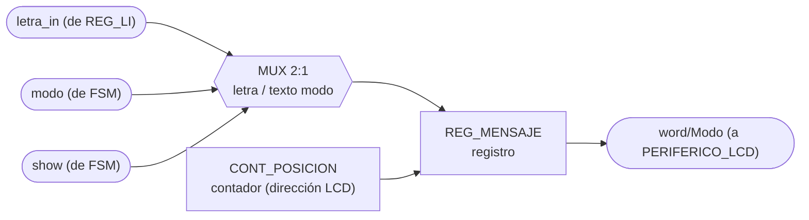
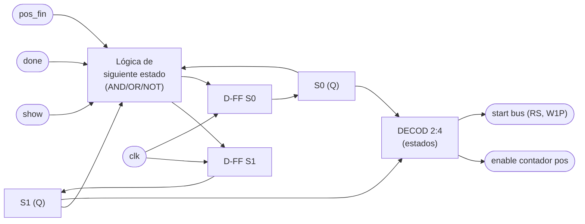

# M04 - Mostrar LCD

## a) Nombre del módulo

M04_Mostrar-LCD

## b) Diagrama modular

## c) Objetivo del módulo

Prepara la información del juego que debe mostrarse en el periférico LCD: cuando la `FSM` lo
ordena (`show`), compone el mensaje a partir de la última letra recibida (`REG_Letra-in`) y del
`modo` actual, y lo envía como `word/Modo` al periférico LCD.

## d) Entradas

- `clk`, `rst`.
- `show`: orden de actualización desde la `FSM`.
- `modo`: modo actual del juego desde la `FSM`.
- `letra_in`: letra recibida desde `REG_Letra-in`.

## e) Salidas

- `word/Modo`: datos y comandos enviados a `PERIFERICO_LCD`.

## f) Explicación de la relación con otros módulos

La `FSM` (principal) controla cuándo actualizar la pantalla (`show`) y qué modo mostrar (`modo`). M04 lee la
última letra recibida desde `REG_Letra-in`, cargado por `M10_Receptor-UART` bajo orden de la
FSM. La salida no llega directo al LCD: se entrega a `PERIFERICO_LCD` a través del mismo bus de
32 bits que `CONTROL_JUEGO` comparte con `PERIFERICO_UART`, es decir M04 escribe en los
registros `REG_DATOS` y `REG_CTRL_ESTADO` y lee de vuelta los bits `busy`/`done` para
sincronizarse con el HD44780 del PmodCLP. No tiene relación directa con M01, M02, M05, M06, M08,
M09 ni M12: su única "clientela" es el LCD físico.

## g) Funcionamiento

Construye la secuencia de datos que representa la palabra, la letra y el modo actual, y la
envía al LCD cuando `show` lo solicita. En el fondo, M04 es una pequeño FSM que traduce una orden de un solo pulso (`show`) en una ráfaga de
transacciones de bus hacia `PERIFERICO_LCD`. Al llegar `show`, primero pulsa `home`/`clear` en
`REG_CTRL_ESTADO` para posicionar el cursor; luego, byte por byte, escribe cada carácter del
mensaje en `REG_DATOS` y pulsa `start` con `rs=1` (dato, no comando); después de cada byte
espera a que `done` se levante antes de enviar el siguiente. El mensaje
depende del contexto: en selección de modo es un texto fijo ("MODO: FACIL"/"MODO: DIFICIL"); en
partida, es la letra recién recibida superpuesta sobre la palabra en curso.

## h) Diseño

Para este diseño el módulo se modela como una máquina de Moore de 4 estados: `IDLE`, `HOME`, `SEND`, `WAIT`.

Tabla de transición de estados:

| Estado actual | show | done | pos = fin? | Estado siguiente |
|---|---|---|---|---|
| IDLE | 0 | X | X | IDLE |
| IDLE | 1 | X | X | HOME |
| HOME | X | X | X | SEND |
| SEND | X | X | X | WAIT |
| WAIT | X | 0 | X | WAIT |
| WAIT | X | 1 | 0 | SEND (`pos = pos+1`) |
| WAIT | X | 1 | 1 | IDLE |

Codificación de estado (2 bits, `S1 S0`): `IDLE=00`, `HOME=01`, `SEND=10`, `WAIT=11`.

El contador de posición (`pos`) es de 4 bits (alcanza hasta 16 caracteres, el ancho del
PmodCLP), se reinicia en `HOME` y se incrementa cada vez que `WAIT` recibe `done=1` sin haber
llegado al final del mensaje. El byte a enviar sale de una pequeña ROM de texto (una por modo)
seleccionada por `modo`, o directamente de `letra_in` cuando se muestra la palabra en juego; un
multiplexor 2:1 decide la fuente. Se usa una ROM en vez de lógica combinacional dedicada por ser
mensajes fijos de longitud conocida — la forma estándar de guardar texto constante a nivel de
compuertas/MSI sin recurrir a memoria de programa.

## i) Diagrama esquemático detallado (por compuertas lógicas)

