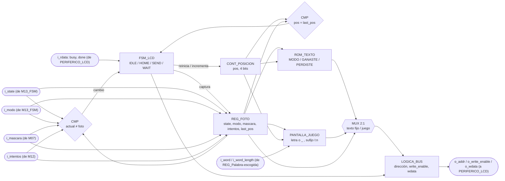
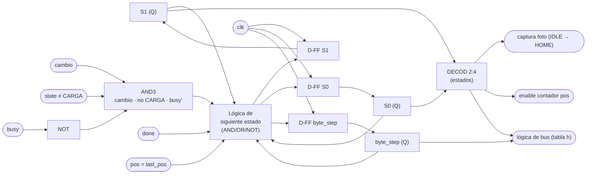

# M04 - Mostrar LCD

## a) Nombre del módulo

M04_Mostrar-LCD

## Cambios respecto al diseño original

Esta versión reemplaza el diseño original (`show` como pulso de la `FSM` principal, mux 2:1) por
la arquitectura de nivel 3: `M13_FSM` ya no manda órdenes puntuales, solo difunde `state` (3 bits)
y `modo`. M04 decodifica `state` por su cuenta para saber cuál de las cuatro pantallas pintar
(selección, palabra en juego, ganó, perdió) y dispara su propio redibujado. Se mantienen la FSM
interna de 4 estados (IDLE/HOME/SEND/WAIT) y el protocolo de bus byte a byte del diseño original.

Cambios en los puertos respecto a ese diseño:

- Se quitó `letra_in` y se agregaron `word`/`word_length`, del mismo origen que ya consultan
  `M07_Comparador-letra` y `M11_Transmisor-UART`: `REG_Palabra-escogida`. Redibujar la palabra con
  varias letras ya reveladas requiere la palabra secreta entera, no solo la última letra
  recibida. Con `mascara` (bitmap de posiciones reveladas, sin identidad de letra) y `letra_in` no
  alcanza para pintar, por ejemplo, dos letras distintas reveladas en posiciones distintas.
- Se agregó `intentos`, desde `M12_Contador-Intentos`, para mostrar en la pantalla de juego los
  intentos que le quedan al jugador.
- La salida abstracta `word/Modo` se concretó en la interfaz de bus de `PERIFERICO_LCD`
  (`o_addr`, `o_write_enable`, `o_wdata`, `i_rdata`).

Y en las pantallas: como `M13_FSM` juntó PERDIO_INTENTOS y PERDIO_TIEMPO en un solo PERDIO, el LCD
ya no puede distinguir la causa y muestra un único "PERDISTE". La causa la reporta
`M11_Transmisor-UART` a la PC.

## b) Diagrama modular

## c) Objetivo del módulo

Prepara la información del juego que debe mostrarse en el LCD y se la entrega al periférico LCD
por el bus. Decodifica `state` para saber cuál pantalla toca (selección de modo, palabra en juego,
ganó, perdió), compone el mensaje a partir de `modo`, `mascara`, `intentos` y la palabra escogida
(`word`, `word_length`), y lo escribe carácter por carácter en `PERIFERICO_LCD`.

## d) Entradas

- `clk`, `rst`.
- `i_state[2:0]`: estado actual del juego, desde `M13_FSM`. Decide cuál pantalla se pinta y
  dispara el redibujado al cambiar.
- `i_modo`: modo actual del juego, desde `M13_FSM`. 0 FACIL, 1 DIFICIL.
- `i_word[95:0]`: palabra escogida, 12 letras en ASCII empacadas, la letra 0 en los bits bajos
  (`i_word[pos*8 +: 8]`). `REG_Palabra-escogida` guarda cada letra como código de 5 bits (0 a 25),
  así que en `top.sv` hay un adaptador combinacional que suma `8'h41` a cada código antes de
  entrar a M04.
- `i_word_length[3:0]`: cuántas posiciones de `i_word` son válidas, `word[63:60]` de
  `REG_Palabra-escogida`.
- `i_mascara[11:0]`: posiciones ya reveladas de la palabra, desde `M07_Comparador-letra`. Decide
  cuáles posiciones de `i_word` se pintan y cuáles quedan como guion bajo.
- `i_intentos[2:0]`: fallos acumulados de la partida (0 a 6), desde `M12_Contador-Intentos`.
- `i_rdata[31:0]`: lectura del bus de `PERIFERICO_LCD` en la dirección que M04 está poniendo en
  `o_addr`. De ahí saca `busy` y `done`.

## e) Salidas

- `o_addr[1:0]`: dirección del registro de `PERIFERICO_LCD` que se escribe o se lee.
- `o_write_enable`: habilita la escritura en ese ciclo.
- `o_wdata[31:0]`: dato o comando escrito en `PERIFERICO_LCD`.

## f) Explicación de la relación con otros módulos

`M13_FSM` solo difunde `state` y `modo`, y M04 decodifica `state` por su cuenta para saber cuál
pantalla pintar, sin que la FSM le ordene nada puntual. `M07_Comparador-letra` le entrega
`mascara`, `M12_Contador-Intentos` le entrega `intentos`, y `REG_Palabra-escogida` le entrega
`word`/`word_length` (pasando por el adaptador a ASCII de `top.sv`), todos necesarios para
componer la pantalla de juego.

La salida no llega directo al LCD. M04 es el maestro del bus de 32 bits de `PERIFERICO_LCD`:
escribe en `REG_CTRL_ESTADO` y `REG_DATOS`, y lee de vuelta los bits `busy` y `done` para
sincronizarse con el HD44780 del PmodCLP. El mapa que usa, y que coincide con `periferico_lcd.sv`:

| Dirección | Registro | Bits |
|---|---|---|
| `00` | `REG_CTRL_ESTADO` | escritura: bit 0 `start` (W1P), bit 1 `rs`, bit 2 `clear` (W1P), bit 3 `home` (W1P); lectura: bit 8 `busy`, bit 9 `done` (pulso de un ciclo) |
| `01` | `REG_DATOS` | bits 7:0, carácter a escribir |

No tiene relación directa con M01, M02, M05, M06, M08, M09, M10 ni M11: además de la FSM, M07, M12
y `REG_Palabra-escogida`, su única otra conexión es el periférico LCD.

## g) Funcionamiento

M04 es una pequeña FSM que traduce cada cambio de lo que hay que mostrar en una ráfaga de
transacciones de bus hacia `PERIFERICO_LCD`. Al detectar el cambio, primero escribe `clear` y
`home` a la vez en `REG_CTRL_ESTADO`, para borrar lo que haya quedado de un mensaje anterior más
largo y llevar el cursor al inicio, y espera el `done` de ese comando. Luego, carácter por
carácter, escribe el byte en `REG_DATOS`, pulsa `start` con `rs=1` (dato, no comando) y espera
`done` antes de pasar al siguiente.

Pantallas, todas en la primera línea de 16 caracteres del LCD:

| `state` | Mensaje | Largo |
|---|---|---|
| SELECCION, `modo=0` | `MODO: FACIL` | 11 |
| SELECCION, `modo=1` | `MODO: DIFICIL` | 13 |
| CARGA | no tiene pantalla propia, se queda la de selección | — |
| JUEGO | palabra en 0..11 más ` I:n` en 12..15 | 16 |
| GANO | `GANASTE` | 7 |
| PERDIO | `PERDISTE` | 8 |

En la pantalla de juego, cada posición `p < word_length` muestra la letra si `mascara[p]=1` o `_`
si no. Las posiciones de `word_length` a 11 van en blanco, y las cuatro últimas llevan un sufijo
fijo con los intentos restantes, `" I:"` y un dígito de `6` a `0`. El sufijo va siempre en 12..15
sin importar el largo de la palabra, que es de 12 letras como máximo, así que nunca se pisan. Por
ejemplo, con la palabra `CASA`, la `A` revelada y un fallo: `_A_A         I:5`.

El disparo de redibujado no es un pulso `show` externo. M04 guarda una "foto" de lo que está
mostrando y la compara en cada ciclo contra las entradas actuales. `cambio` vale 1 si:

- `state` es distinto al de la foto, o
- se está en SELECCION y `modo` cambió, o
- se está en JUEGO y cambió `mascara` o `intentos`.

`intentos` entra aparte de `mascara` porque una letra incorrecta no revela ninguna posición, y
sin esa condición un fallo nunca redibujaría el contador. Desde IDLE se arranca un envío solo si
`cambio=1`, `state` no es CARGA y `busy=0`. El `busy` evita escribirle al periférico mientras
todavía corre la inicialización del HD44780 después del reset. La foto se toma justo al arrancar
el envío, así que si el contenido vuelve a cambiar a media ráfaga (otra letra llega mientras el
LCD todavía imprime la anterior), el mensaje en curso se termina completo con la foto vieja,
`cambio` sigue en 1, y apenas vuelve a IDLE arranca otra ráfaga con lo más reciente. Nunca queda
una pantalla mezclada.

Después del reset la foto guarda `state = 111`, un código que la FSM no usa, así que el primer
ciclo libre ya ve `cambio=1` y pinta la pantalla de selección apenas el periférico termina su
inicialización.

## h) Diseño

El módulo se modela como una máquina de Moore de 4 estados: `IDLE`, `HOME`, `SEND`, `WAIT`, con un
bit auxiliar `byte_step` que divide `HOME` y `SEND` en dos sub-pasos.

Tabla de transición de estados:

| Estado actual | Condición | Estado siguiente | Efecto |
|---|---|---|---|
| IDLE | `cambio · (state ≠ CARGA) · busy'` | HOME | `pos=0`, `byte_step=0`, captura la foto |
| IDLE | resto | IDLE | |
| HOME, `byte_step=0` | X | HOME | escribe `clear`+`home`, `byte_step=1` |
| HOME, `byte_step=1` | `done=0` | HOME | |
| HOME, `byte_step=1` | `done=1` | SEND | `byte_step=0` |
| SEND, `byte_step=0` | X | SEND | escribe el carácter en `REG_DATOS`, `byte_step=1` |
| SEND, `byte_step=1` | X | WAIT | pulsa `start` con `rs=1`, `byte_step=0` |
| WAIT | `done=0` | WAIT | |
| WAIT | `done=1 · (pos = last_pos)` | IDLE | |
| WAIT | `done=1 · (pos ≠ last_pos)` | SEND | `pos = pos+1` |

Codificación de estado (2 bits, `S1 S0`): `IDLE=00`, `HOME=01`, `SEND=10`, `WAIT=11`.

`REG_DATOS` y `REG_CTRL_ESTADO` son direcciones distintas del mismo bus, así que escribir el byte y
pulsar `start`/`rs` no caben en el mismo ciclo. Por eso `SEND` usa `byte_step`: el primer
sub-paso escribe `REG_DATOS` y el segundo pulsa `start`/`rs` en `REG_CTRL_ESTADO`. `HOME` reutiliza
el mismo bit para su espera: en el primer sub-paso escribe `clear`/`home` y en el segundo ya no
toca el bus, solo espera `done`. Así se evita un quinto estado y la codificación se queda en 2
bits.

En el diseño original `HOME` pasaba a `SEND` sin esperar nada, suponiendo que `PERIFERICO_LCD`
absorbía la espera larga del `clear`/`home`. `tb_mostrar_lcd.sv` mostró en simulación que no era
así: el primer byte del mensaje se pisaba con el propio comando en curso y el mensaje salía
corrido una posición ("MODO: FACIL" salía como "ODO: FACIL "). Por eso `HOME` espera `done` igual
que `WAIT`.

`done` es un pulso de un ciclo en el bit 9 de `REG_CTRL_ESTADO`, y la lectura del bus depende de
`o_addr`. Por eso en los ciclos de espera (`HOME` con `byte_step=1` y `WAIT`) la dirección se deja
en `00`, la dirección por defecto de la lógica de salida, para no perder ese pulso.

### Foto (REG_FOTO)

Al pasar de IDLE a HOME se capturan `act_state`, `act_modo`, `act_mascara`, `act_intentos` y
`act_last_pos`, este último calculado una sola vez con la tabla de largos de la g) menos uno:

| `state` | `last_pos` |
|---|---|
| SELECCION, `modo=0` | 10 |
| SELECCION, `modo=1` | 12 |
| JUEGO | 15 |
| GANO | 6 |
| PERDIO | 7 |

Todo el envío se compone desde la foto, no desde las entradas en vivo. La excepción es
`i_word`/`i_word_length`, que se leen directo porque `REG_Palabra-escogida` solo cambia en CARGA,
que no tiene pantalla, así que no pueden cambiar a media ráfaga de JUEGO.

### Contador de posición y fuente del carácter

`pos` es de 4 bits, alcanza las 16 posiciones del PmodCLP. Se reinicia al arrancar el envío y se
incrementa cada vez que `WAIT` recibe `done` sin haber llegado a `last_pos`.

El byte a enviar lo decide un multiplexor 2:1 según `act_state`:

- Pantallas de texto fijo (SELECCION, GANO, PERDIO): una ROM de texto indexada por
  (`act_state`, `act_modo`, `pos`), `f_byte` en el código. Se usa una ROM en vez de lógica
  dedicada por ser mensajes fijos de longitud conocida, la forma estándar de guardar texto
  constante.
- Pantalla de JUEGO, `f_byte_juego` en el código:

| Condición sobre `pos` | Carácter |
|---|---|
| `pos < word_length` y `mascara[pos]=1` | `i_word[pos*8 +: 8]` |
| `pos < word_length` y `mascara[pos]=0` | `_` |
| `word_length ≤ pos < 12` | espacio |
| `pos = 12` | espacio |
| `pos = 13` | `I` |
| `pos = 14` | `:` |
| `pos = 15` | dígito de intentos restantes |

El dígito sale de una tabla directa sobre los fallos acumulados, en vez de un restador `6 -
intentos` seguido de la suma de `"0"`. Son solo 7 valores posibles, porque `M12_Contador-Intentos`
satura en 6:

| `intentos` | 0 | 1 | 2 | 3 | 4 | 5 | 6 |
|---|---|---|---|---|---|---|---|
| dígito | `6` | `5` | `4` | `3` | `2` | `1` | `0` |

### Lógica de salida al bus

| Estado | `o_addr` | `o_write_enable` | `o_wdata` |
|---|---|---|---|
| IDLE, WAIT | `00` | 0 | 0 |
| HOME, `byte_step=0` | `00` | 1 | bit 2 `clear` = 1, bit 3 `home` = 1 |
| HOME, `byte_step=1` | `00` | 0 | 0 |
| SEND, `byte_step=0` | `01` | 1 | bits 7:0 = carácter |
| SEND, `byte_step=1` | `00` | 1 | bit 0 `start` = 1, bit 1 `rs` = 1 |

## i) Diagrama esquemático detallado (por compuertas lógicas)

`cambio` es el OR de tres comparadores de igualdad negados contra la foto (`state`, `modo`
habilitado por SELECCION, `mascara`/`intentos` habilitados por JUEGO). La ROM de texto y el
generador de la pantalla de juego no se dibujan por compuertas, están descritos por sus tablas en
la h).
