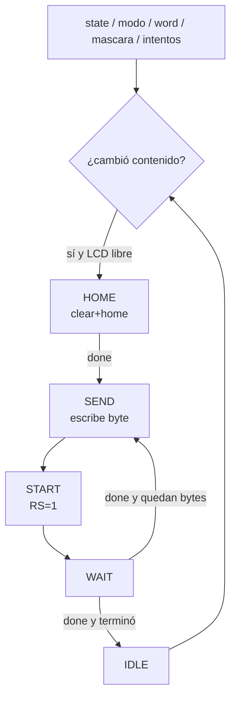

# M04 - Mostrar LCD

Archivo RTL de referencia: `src/design/mostrar_lcd.sv`.

## b) Diagrama modular

## c) Objetivo del módulo

Componer la pantalla que corresponde al estado actual y convertirla en transacciones del bus
    del periférico LCD.

## d) Entradas

- `clk`, `rst`.
    - `i_state[2:0]`, `i_modo`.
    - `i_word[95:0]`: palabra ASCII, hasta 12 caracteres.
    - `i_word_length[3:0]`.
    - `i_mascara[11:0]`.
    - `i_intentos[2:0]`: fallos acumulados.
    - `i_rdata[31:0]`: lectura del periférico LCD.

## e) Salidas

- `o_addr[1:0]`.
    - `o_write_enable`.
    - `o_wdata[31:0]`.

## f) Explicación de la relación con otros módulos

Recibe `state`/`modo` de la FSM, palabra desde la adaptación de `top.sv`, máscara desde M07 e
    intentos desde M12. Se comunica exclusivamente con `periferico_lcd.sv`; no maneja pines
    físicos.

## g) Explicación de funcionamiento

Pantallas implementadas:

    - SELECCION: `MODO: FACIL` o `MODO: DIFICIL`.
    - CARGA: no tiene pantalla propia.
    - JUEGO: 12 posiciones de palabra/espacios y sufijo ` I:n` con intentos restantes.
    - GANO: `GANASTE`.
    - PERDIO: `PERDISTE`.

    Detecta cambios en `state`, en `modo` durante selección y en máscara/intentos durante juego.
    Toma una fotografía del contenido al comenzar un refresco para no mezclar dos pantallas.

    Su FSM interna recorre `IDLE -> HOME -> SEND -> WAIT`. `HOME` ordena `clear+home` y espera
    `done`. Cada carácter necesita escribir el byte y después pulsar `start` con `RS=1`.

## h) Diseño

Direcciones actuales: control/estado=`00`, datos=`01`. Bits de control: start=0, rs=1,
    clear=2, home=3; bits de lectura: busy=8, done=9. Estas direcciones coinciden con
    `periferico_lcd.sv` aunque el comentario TODO histórico todavía permanezca en el RTL.

## i) Diagrama esquemático detallado

El diagrama de b) representa también el datapath principal de la implementación. Para módulos con
FSM interna se incluye la secuencia de estados dentro de la explicación de funcionamiento.
