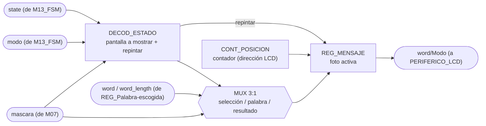
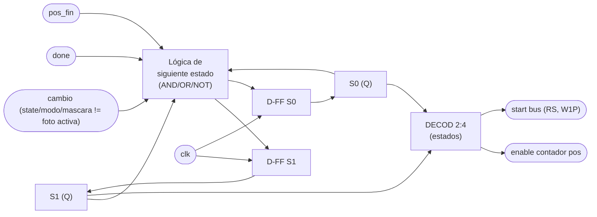

# M04 - Mostrar LCD

## a) Nombre del módulo

M04_Mostrar-LCD

## Nota de fusión con nivel03

Esta versión reemplaza el diseño original (`show` como pulso de la `FSM` principal, mux 2:1) por
la arquitectura vigente descrita en `docs/diseño/diseño.md` ("Nivel 3"): `M13_FSM` ya no manda
órdenes puntuales, solo difunde `state` (3 bits) y `modo`. M04 decodifica `state` por su cuenta
para saber cuál de las tres pantallas pintar (selección, palabra en juego, resultado) y dispara
su propio redibujado internamente. Se mantiene, sin embargo, la FSM interna de 4 estados
(IDLE/HOME/SEND/WAIT) y el protocolo de bus byte a byte descritos más abajo, tal como estaban en
la versión original de este archivo.

También se agregó `word`/`word_length` (mismo origen que ya consultan `M07_Comparador-letra` y
`M11_Transmisor-UART`: `REG_Palabra-escogida`) y se quitó `letra_in` del puerto. Redibujar la
palabra completa con varias letras ya reveladas requiere la palabra secreta entera, no solo la
última letra recibida: con `mascara` (bitmap de posiciones reveladas, sin identidad de letra) y
`letra_in` no alcanza para pintar correctamente, por ejemplo, dos letras distintas reveladas en
posiciones distintas de una misma palabra.

`M13_FSM` y `PERIFERICO_LCD` todavía no existen como `.sv` (solo en los documentos de diseño),
así que `src/sim/tb_mostrar_lcd.sv` verifica este módulo con un stub que hace de las dos cosas:
maneja `state`/`modo` como si fuera la FSM principal, y modela `PERIFERICO_LCD` con un registro
de pantalla de 16 caracteres y un temporizador de `busy`/`done`. Ese testbench fue el que
encontró el problema de `HOME` corrigiéndose en la sección h) — sin la espera de `done`, el
primer carácter de cada mensaje se perdía.

## b) Diagrama modular

## c) Objetivo del módulo

Prepara la información del juego que debe mostrarse en el periférico LCD: decodifica `state`
para saber cuál de las tres pantallas toca (selección de modo, palabra en juego, resultado
final), compone el mensaje a partir de `modo`, `mascara` y la palabra escogida (`word`,
`word_length`), y lo envía como `word/Modo` al periférico LCD.

## d) Entradas

- `clk`, `rst`.
- `state`: estado actual del juego, desde `M13_FSM`. Decide cuál pantalla se pinta y dispara el
  redibujado al cambiar.
- `modo`: modo actual del juego, desde `M13_FSM`.
- `word`, `word_length`: palabra escogida y su longitud, desde `REG_Palabra-escogida`.
- `mascara`: posiciones ya reveladas de la palabra, desde `M07_Comparador-letra`. Decide cuáles
  posiciones de `word` se pintan y cuáles quedan como guion bajo.

## e) Salidas

- `word/Modo`: datos y comandos enviados a `PERIFERICO_LCD`.

## f) Explicación de la relación con otros módulos

`M13_FSM` solo difunde `state` y `modo`; M04 decodifica `state` por su cuenta para saber cuál
pantalla pintar, sin que la FSM le ordene nada puntual. `M07_Comparador-letra` le entrega
`mascara`, y `REG_Palabra-escogida` le entrega `word`/`word_length`, ambos necesarios para
componer la palabra en juego con las posiciones ya reveladas. La salida no llega directo al
LCD: se entrega a `PERIFERICO_LCD` a través del mismo bus de 32 bits que `CONTROL_JUEGO`
comparte con `PERIFERICO_UART`, es decir M04 escribe en los registros `REG_DATOS` y
`REG_CTRL_ESTADO` y lee de vuelta el bit `done` para sincronizarse con el HD44780 del PmodCLP.
No tiene relación directa con M01, M02, M05, M06, M08, M09, M10, M11 ni M12: su única
"clientela" adicional a la FSM y M07/REG_Palabra-escogida es el LCD físico.

## g) Funcionamiento

Construye la secuencia de datos que representa la palabra, la máscara revelada y el modo
actual, y la envía al LCD cuando detecta que cambió lo que le toca mostrar. En el fondo, M04 es
una pequeña FSM que traduce ese cambio en una ráfaga de transacciones de bus hacia
`PERIFERICO_LCD`. Al detectar el cambio, primero pulsa `home`/`clear` en `REG_CTRL_ESTADO` para
posicionar el cursor y borrar lo que haya quedado de un mensaje anterior más largo; luego, byte
por byte, escribe cada carácter del mensaje en `REG_DATOS` y pulsa `start` con `rs=1` (dato, no
comando); después de cada byte espera a que `done` se levante antes de enviar el siguiente. El
mensaje depende del contexto: en selección de modo es un texto fijo ("MODO: FACIL"/"MODO:
DIFICIL"); en partida, es `word` con guion bajo en las posiciones que `mascara` todavía no
revela; en resultado, un texto fijo por causa de fin de partida ("GANASTE"/"PERDISTE: LETRAS"/
"PERDISTE: TIEMPO"). `CARGA` no tiene pantalla propia y no dispara redibujado, la pantalla de
selección se queda en el LCD hasta que `JUEGO` la reemplaza.

El disparo de redibujado ya no es un pulso `show` externo: M04 guarda una "foto" (`state`,
`modo`, `mascara`) del último mensaje enviado y compara contra los valores actuales en cada
ciclo. Si difieren y `state` no es `CARGA`, arranca un nuevo envío. Si el contenido vuelve a
cambiar a media ráfaga (por ejemplo, otra letra se revela mientras el LCD todavía está
imprimiendo la anterior), la comparación sigue en desacuerdo y, apenas termina la ráfaga en
curso, arranca otra con el contenido más reciente — así nunca queda una pantalla a medias.

## h) Diseño

Para este diseño el módulo se modela como una máquina de Moore de 4 estados: `IDLE`, `HOME`, `SEND`, `WAIT`.

Tabla de transición de estados:

| Estado actual | cambio | done | pos = fin? | Estado siguiente |
|---|---|---|---|---|
| IDLE | 0 | X | X | IDLE |
| IDLE | 1 (y `state != CARGA`) | X | X | HOME |
| HOME | X | 0 | X | HOME |
| HOME | X | 1 | X | SEND |
| SEND | X | X | X | WAIT |
| WAIT | X | 0 | X | WAIT |
| WAIT | X | 1 | 0 | SEND (`pos = pos+1`) |
| WAIT | X | 1 | 1 | IDLE |

`cambio` reemplaza al `show` original: es la comparación entre `state`/`modo`/`mascara` actuales
y la foto guardada del último mensaje enviado (ver g). A diferencia de la tabla original, `HOME`
sí espera `done` antes de pasar a `SEND`, con el mismo sub-paso de un bit que ya usa `SEND` (ver
más abajo): la primera versión de esta tabla dejaba pasar a `SEND` sin esperar nada, asumiendo
que `PERIFERICO_LCD` absorbía la espera larga del comando `clear`/`home`. `tb_mostrar_lcd.sv`
(con un modelo simple de `PERIFERICO_LCD`) mostró en simulación que ese supuesto era falso: el
primer byte del mensaje se pisaba con el propio `clear`/`home` en curso, y el mensaje quedaba
corrido una posición completa (por ejemplo, "MODO: FACIL" salía como "ODO: FACIL "). Se corrigió
haciendo que `HOME` espere `done` igual que `WAIT`, sin agregar un estado nuevo ni tocar la
codificación de 2 bits.

Codificación de estado (2 bits, `S1 S0`): `IDLE=00`, `HOME=01`, `SEND=10`, `WAIT=11`.

El contador de posición (`pos`) es de 4 bits (alcanza hasta 16 caracteres, el ancho del
PmodCLP), se reinicia en `HOME` y se incrementa cada vez que `WAIT` recibe `done=1` sin haber
llegado al final del mensaje. El byte a enviar sale de una pequeña ROM de texto (una por
pantalla, y por `modo` dentro de selección) seleccionada por `state`/`modo`, o de `word[pos]`
frente a `mascara[pos]` cuando se muestra la palabra en juego; un multiplexor 3:1 decide la
fuente. Se usa una ROM en vez de lógica combinacional dedicada por ser mensajes fijos de
longitud conocida — la forma estándar de guardar texto constante a nivel de compuertas/MSI sin
recurrir a memoria de programa.

`REG_DATOS` y `REG_CTRL_ESTADO` son direcciones distintas del mismo bus, así que escribir el
byte y pulsar `start`/`rs=1` no caben en el mismo ciclo. `SEND` se subdivide internamente en dos
sub-pasos (un bit `byte_step`, sin tocar la codificación de 2 bits de `estado`): el primero
escribe `REG_DATOS`, el segundo pulsa `start`/`rs` en `REG_CTRL_ESTADO`; recién ahí pasa a
`WAIT`. `HOME` reutiliza el mismo bit para su propia espera de `done` (primer sub-paso: escribe
`clear`/`home`; segundo sub-paso: no vuelve a escribir el bus, solo espera). Es un detalle de
implementación que la tabla de estados de arriba no necesita mostrar, igual que
`M10_Receptor-UART` resuelve su propio acceso al bus con una FSM interna aparte de la principal.

## i) Diagrama esquemático detallado (por compuertas lógicas)

