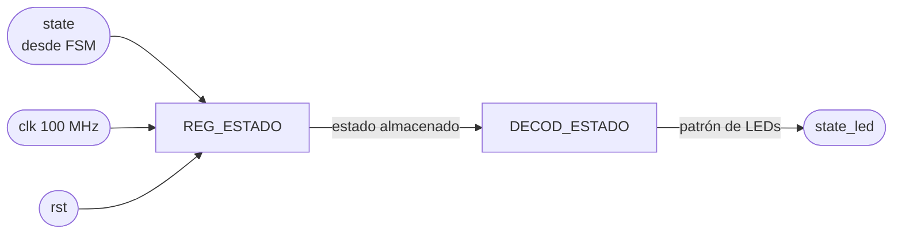

# M05 - Estado

# M05 - Estado

## Propósito

El módulo M05_Estado se encarga de representar visualmente el estado actual del sistema mediante los LEDs disponibles en la FPGA.

Recibe desde la FSM el código correspondiente al estado actual del juego y lo transforma mediante lógica combinacional en el patrón necesario para encender los LEDs de estado.

---

## Entradas

* clk: reloj principal de la FPGA, de 100 MHz.
* rst: señal de reinicio del módulo.
* state: código correspondiente al estado actual de la FSM.

---

## Salidas

* state_led: patrón de salida utilizado para representar el estado actual mediante los LEDs físicos de la FPGA.

La cantidad de bits utilizada para state_led dependerá de la cantidad de estados que finalmente se deseen representar.

---

## f) Relación con otros módulos

La entrada state proviene directamente de la FSM principal . Cada vez que la FSM cambia de estado, M05_Estado recibe el nuevo código y actualiza la representación visual correspondiente.

El módulo no interviene en las transiciones de la FSM y tampoco genera señales de control hacia otros módulos. Su función es únicamente mostrar información al usuario.

La señal state se almacena en REG_ESTADO para mantener una representación estable del estado recibido. Posteriormente, este registro alimenta un decodificador combinacional encargado de transformar el código de estado en el patrón necesario para los LEDs.

La señal rst permite colocar REG_ESTADO en un estado conocido después de un reinicio general del sistema.

---

## g) Explicación de funcionamiento

El funcionamiento del módulo consiste en registrar el código proveniente de la FSM y convertirlo en una representación visual.

En cada flanco positivo del reloj, REG_ESTADO almacena el valor recibido desde la FSM. Posteriormente, DECOD_ESTADO evalúa este valor y genera el patrón correspondiente en state_led.

El uso de un registro intermedio permite mantener estable la salida visual entre ciclos de reloj y separa el estado generado por la FSM de la lógica física encargada de controlar los LEDs.

La relación general es:

FSM → REG_ESTADO → DECOD_ESTADO → LED_S

El número de patrones necesarios dependerá directamente de la cantidad de estados definidos en la FSM. Cada código debe asociarse con una salida única o suficientemente distinguible para facilitar la identificación visual del estado actual durante el funcionamiento y las pruebas del sistema.

---

## h) Diseño

El módulo se compone de dos bloques principales: REG_ESTADO y DECOD_ESTADO.

REG_ESTADO es un registro síncrono encargado de almacenar el código recibido desde la FSM. Cuando rst se encuentra activo, el registro vuelve al código correspondiente al estado inicial del sistema.

Su comportamiento general es:

| rst | state                  | Estado siguiente de REG_ESTADO |
| --- | ---------------------- | ------------------------------ |
| 1   | X                      | Estado inicial                 |
| 0   | Valor actual de la FSM | state                          |

DECOD_ESTADO corresponde a lógica combinacional. Su entrada es el contenido de REG_ESTADO y su salida es el patrón aplicado a los LEDs.

La tabla exacta de decodificación depende de la codificación definitiva utilizada por la FSM. De manera general:

| Estado almacenado    | Salida state_led       | Significado             |
| -------------------- | ---------------------- | ----------------------- |
| Estado inicial       | Patrón 1               | Sistema en espera       |
| Selección de modo    | Patrón 2               | Selección de dificultad |
| Selección de palabra | Patrón 3               | Preparación de partida  |
| Juego activo         | Patrón 4               | Partida en ejecución    |
| Resultado            | Patrón 5               | Resultado de la partida |
| Otro estado definido | Patrón correspondiente | Según la FSM            |

No se requiere una máquina de estados adicional dentro de M05, ya que el estado del sistema ya es determinado por la FSM principal.

---

## i) Diagrama esquemático detallado del diseño

El módulo utiliza un único elemento secuencial, REG_ESTADO, mientras que DECOD_ESTADO se implementa como lógica combinacional.

Todo el módulo opera utilizando el reloj principal de 100 MHz y no necesita relojes derivados ni señales adicionales de habilitación.

