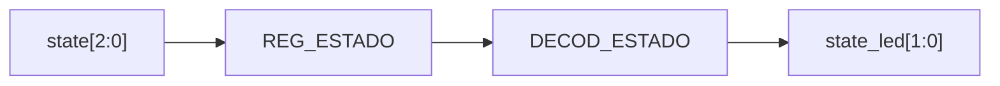

# M05 - Estado

Archivo RTL de referencia: `src/design/Estado.sv`.

## b) Diagrama modular

## c) Objetivo del módulo

Registrar `state` y reducir los cinco estados de la FSM a una codificación visual de dos
    bits.

## d) Entradas

- `clk`, `rst`.
    - `state[2:0]`.

## e) Salidas

- `state_led[1:0]`.

## f) Explicación de la relación con otros módulos

Consume directamente el estado de M13 y entrega la salida al `top` para conexión con LEDs.

## g) Explicación de funcionamiento

Codificación:

    - `00`: selección.
    - `01`: carga o juego.
    - `10`: resultado final (`GANO` o `PERDIO`).

    Los códigos no usados se muestran como selección.

## h) Diseño

Se añade un registro de `state` antes del decodificador, por lo que la indicación visual sigue
    la FSM con un ciclo de reloj de latencia.

## i) Diagrama esquemático detallado

El diagrama de b) representa también el datapath principal de la implementación. Para módulos con
FSM interna se incluye la secuencia de estados dentro de la explicación de funcionamiento.
