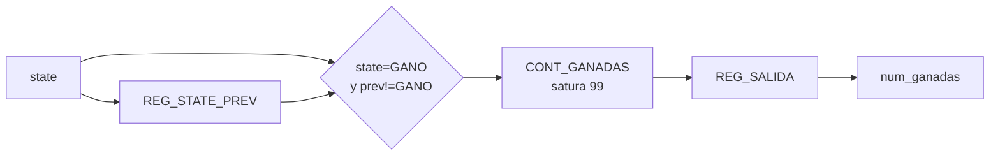

# M06 - Ganadas

Archivo RTL de referencia: `src/design/Ganadas.sv`.

## b) Diagrama modular

## c) Objetivo del módulo

Contar partidas ganadas desde el último reset y entregar el acumulado al marcador.

## d) Entradas

- `clk`, `rst`.
    - `state[2:0]`.

## e) Salidas

- `num_ganadas[6:0]`: contador binario 0–99.

## f) Explicación de la relación con otros módulos

M06 detecta la entrada a `GANO` (`011`) y envía el acumulado a M01. No depende de la causa
    de las derrotas.

## g) Explicación de funcionamiento

Compara el estado actual contra el estado anterior. Solo incrementa cuando el sistema acaba de
    entrar a `GANO`, evitando sumar una vez por ciclo durante los tres segundos de resultado.

## h) Diseño

El contador satura en 99. Un registro de salida copia el contador interno.

## i) Diagrama esquemático detallado

El diagrama de b) representa también el datapath principal de la implementación. Para módulos con
FSM interna se incluye la secuencia de estados dentro de la explicación de funcionamiento.
