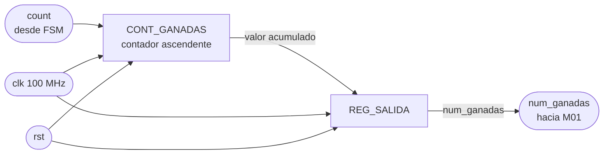

# M06 - Ganadas

## Propósito

El módulo M06_Ganadas se encarga de contabilizar el número de partidas ganadas durante la ejecución del sistema.

Recibe desde la FSM una señal de incremento cada vez que una partida termina con resultado favorable y mantiene almacenado el total acumulado hasta que se produce un reinicio general.

El valor resultante se envía hacia M01_Marcador para su representación en los displays de 7 segmentos.

---

## Entradas

* clk: reloj principal de la FPGA, de 100 MHz.
* rst: señal de reinicio del módulo.
* count: pulso proveniente de la FSM que indica que debe registrarse una nueva partida ganada.

---

## Salidas

* num_ganadas: número acumulado de partidas ganadas, enviado hacia M01_Marcador.

---

## f) Relación con otros módulos

La entrada count proviene directamente de la FSM principal del bloque CONTROL_JUEGO. La FSM genera este pulso únicamente cuando una partida ha sido completada satisfactoriamente y debe incrementarse el marcador de victorias.

M06_Ganadas recibe dicho pulso y aumenta en una unidad el valor almacenado en CONT_GANADAS.

El valor acumulado se entrega mediante num_ganadas hacia M01_Marcador, donde posteriormente se divide en decenas y unidades para mostrarse en los displays de 7 segmentos.

El módulo no interviene en las decisiones de la FSM y tampoco modifica el flujo de la partida. Su única función es almacenar el número de victorias obtenidas.

La señal rst reinicia el contador acumulado a cero.

---

## g) Explicación de funcionamiento

El funcionamiento del módulo se basa en un contador ascendente.

Mientras count permanezca inactivo, el valor almacenado no cambia. Cuando count se activa durante un ciclo de reloj, el contador aumenta en una unidad.

La operación general puede expresarse como:

num_ganadas siguiente = num_ganadas + 1

cuando count = 1.

Si count = 0, el valor actual se conserva.

Debido a que el marcador únicamente necesita representar valores entre 00 y 99, el contador puede limitarse al mismo rango.

Una vez alcanzado el valor máximo de 99, se recomienda mantener el contador saturado para evitar que continúe incrementándose y produzca un valor fuera del rango representable por M01_Marcador.

Por tanto, si el contador ya contiene 99 y llega un nuevo pulso count, su valor permanece en 99.

---

## h) Diseño

El módulo se compone principalmente de CONT_GANADAS, un contador ascendente síncrono, y de REG_SALIDA, encargado de entregar de forma estable el valor acumulado hacia la salida del módulo.

CONT_GANADAS incrementa su contenido únicamente cuando count se encuentra activo.

Su comportamiento general es:

| rst | count | Valor actual | Valor siguiente |
| --- | ----- | ------------ | --------------- |
| 1   | X     | X            | 0               |
| 0   | 0     | N            | N               |
| 0   | 1     | N < 99       | N + 1           |
| 0   | 1     | 99           | 99              |

REG_SALIDA mantiene disponible hacia num_ganadas el valor producido por el contador.

Debido a que el contador ya representa un elemento secuencial estable, REG_SALIDA puede implementarse como un registro adicional si se desea respetar estrictamente el diagrama modular de nivel 3, o puede simplificarse conectando directamente la salida de CONT_GANADAS hacia num_ganadas.

Para mantener correspondencia con el diseño previamente definido, se conserva REG_SALIDA en este documento.

La tabla general de transferencia hacia la salida es:

| rst | Valor de CONT_GANADAS | REG_SALIDA siguiente |
| --- | --------------------- | -------------------- |
| 1   | X                     | 0                    |
| 0   | N                     | N                    |

El módulo no requiere una máquina de estados ni lógica combinacional compleja.

---

## i) Diagrama esquemático detallado del diseño

El módulo utiliza dos elementos secuenciales: CONT_GANADAS y REG_SALIDA.

CONT_GANADAS almacena el número acumulado de partidas ganadas, mientras que REG_SALIDA mantiene disponible dicho valor hacia M01_Marcador.

Todo el módulo opera utilizando exclusivamente el reloj principal de 100 MHz y no requiere relojes derivados ni señales adicionales de habilitación.

