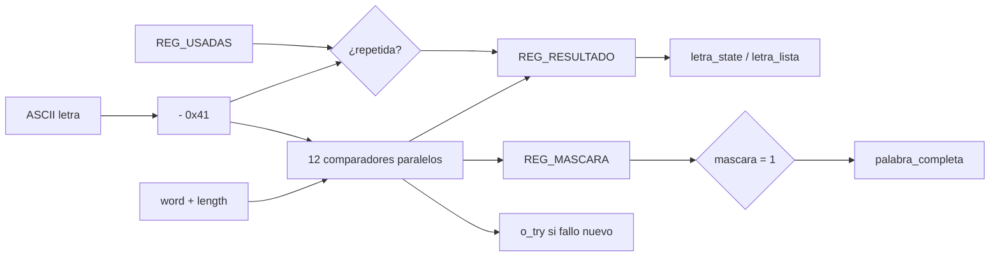

# M07 - Comparador de letra

Archivo RTL de referencia: `src/design/comparador_letra.sv`.

## b) Diagrama modular

## c) Objetivo del módulo

Evaluar cada letra nueva contra todas las posiciones de la palabra, controlar letras usadas y
    mantener la máscara de posiciones reveladas.

## d) Entradas

- `clk`, `rst`.
    - `i_letra[7:0]`: ASCII A-Z.
    - `i_letra_nueva`: pulso de un ciclo.
    - `i_word[59:0]`: 12 códigos de cinco bits.
    - `i_word_length[3:0]`.
    - `i_state[2:0]`.

## e) Salidas

- `o_letra_state[1:0]`: 00 fallo, 01 acierto, 10 repetida.
    - `o_letra_lista`: estrobo del resultado.
    - `o_palabra_completa`.
    - `o_mascara[11:0]`.
    - `o_try`: pulso únicamente para un fallo nuevo.

## f) Explicación de la relación con otros módulos

La letra proviene de M10. La palabra proviene de M08 a través de `top.sv`. La máscara va a
    M04 y M11; `o_try` va a M12; `o_palabra_completa` va a M13.

## g) Explicación de funcionamiento

Convierte ASCII a código restando `0x41`. Compara en paralelo las 12 posiciones, de modo que
    una sola letra revela todas sus ocurrencias. Un vector `usadas[25:0]` detecta repeticiones.

    Al entrar a `CARGA`, se borra el registro de usadas y la máscara se inicializa con unos en las
    posiciones fuera de la longitud real. Así `mascara=='1` indica palabra completa para cualquier
    longitud.

    La repetición genera `o_letra_lista` para que la PC reciba respuesta, pero no cambia máscara ni
    contador de fallos.

## h) Diseño

`o_try` se produce en el mismo ciclo de `i_letra_nueva` solo si la letra es nueva y no aparece
    en la palabra.

## i) Diagrama esquemático detallado

El diagrama de b) representa también el datapath principal de la implementación. Para módulos con
FSM interna se incluye la secuencia de estados dentro de la explicación de funcionamiento.

## Verificación

`src/sim/tb_comparador_letra.sv` es autoverificable, corre con `make sim TB=comparador_letra` y
reporta 34 pruebas sin fallos. La palabra se fuerza desde el testbench en vez de instanciar
`M08_LFSR`, así cada caso escoge la que le sirve. Comprueba:

- Después del reset la máscara queda en ceros, las salidas de letra quietas y `o_palabra_completa`
  en 0.
- Al pasar por CARGA la máscara arranca con el relleno en unos y las posiciones válidas en cero.
- La A de CASA acierta y revela sus dos posiciones de un solo golpe, que es el requisito de revelar
  todas las ocurrencias a la vez.
- La Z no está, se evalúa como fallo y pulsa `o_try` sin mover la máscara.
- `o_letra_lista` y `o_try` duran un solo ciclo cada uno.
- Una letra repetida sí levanta `o_letra_lista` pero no gasta intento ni toca la máscara, y una que
  ya había fallado antes también cuenta como repetida.
- La palabra se cierra letra por letra y `o_palabra_completa` sube en el mismo ciclo en que la
  última posición se revela.
- Los tres largos de borde, CASA con relleno desde la posición 4, PERRO donde la A no aparece y no
  se confunde con el relleno, y una palabra de 12 letras que no deja relleno.
- Que la partida siguiente vuelva a dejar solo el relleno y limpie `REG_USADAS`, con la A otra vez
  como acierto.

Las dos últimas pruebas son las carreras de prioridad del registro, `rst` contra una letra que
llega en el mismo ciclo, y CARGA contra una letra en el mismo ciclo. Las dos tienen que ganarle a
la letra, si no la máscara y la evaluación quedan diciendo cosas distintas.

`make synth SYNTH_TOP=comparador_letra` pasa sin `Latch inferred` en el log.
