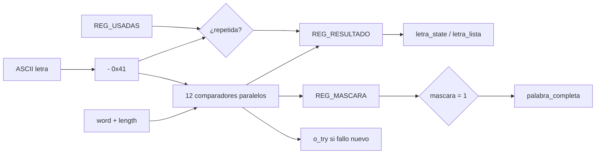

# M07 - Comparador de letra

Archivo RTL de referencia: `src/design/comparador_letra.sv`.

## b) Diagrama modular

## c) Objetivo del módulo

Evaluar cada letra nueva contra todas las posiciones de la palabra, controlar letras usadas y
    mantener la máscara de posiciones reveladas.

## d) Entradas

- `clk`, `rst`.
    - `i_letra[7:0]`: ASCII A-Z.
    - `i_letra_nueva`: pulso de un ciclo.
    - `i_word[59:0]`: 12 códigos de cinco bits.
    - `i_word_length[3:0]`.
    - `i_state[2:0]`.

## e) Salidas

- `o_letra_state[1:0]`: 00 fallo, 01 acierto, 10 repetida.
    - `o_letra_lista`: estrobo del resultado.
    - `o_palabra_completa`.
    - `o_mascara[11:0]`.
    - `o_try`: pulso únicamente para un fallo nuevo.

## f) Explicación de la relación con otros módulos

La letra proviene de M10. La palabra proviene de M08 a través de `top.sv`. La máscara va a
    M04 y M11; `o_try` va a M12; `o_palabra_completa` va a M13.

## g) Explicación de funcionamiento

Convierte ASCII a código restando `0x41`. Compara en paralelo las 12 posiciones, de modo que
    una sola letra revela todas sus ocurrencias. Un vector `usadas[25:0]` detecta repeticiones.

    Al entrar a `CARGA`, se borra el registro de usadas y la máscara se inicializa con unos en las
    posiciones fuera de la longitud real. Así `mascara=='1` indica palabra completa para cualquier
    longitud.

    La repetición genera `o_letra_lista` para que la PC reciba respuesta, pero no cambia máscara ni
    contador de fallos.

## h) Diseño

`o_try` se produce en el mismo ciclo de `i_letra_nueva` solo si la letra es nueva y no aparece
    en la palabra.

## i) Diagrama esquemático detallado

El diagrama de b) representa también el datapath principal de la implementación. Para módulos con
FSM interna se incluye la secuencia de estados dentro de la explicación de funcionamiento.
