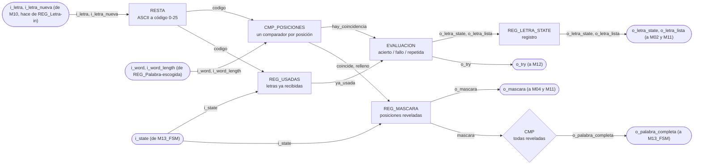
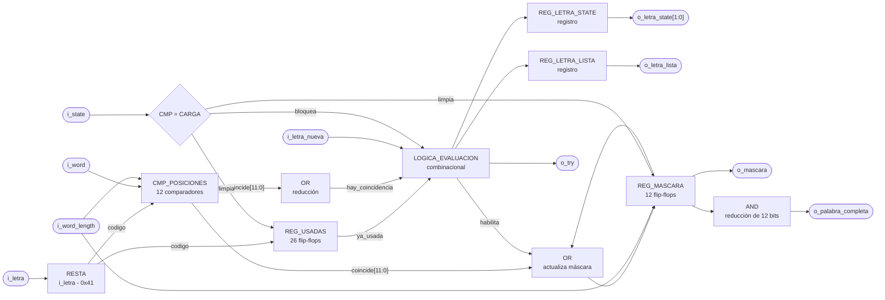

# M07 - Comparador de letra

## a) Nombre del módulo

M07_Comparador-letra

## b) Diagrama modular

## c) Objetivo del módulo

Compara la letra recibida con la palabra escogida y determina el resultado del intento. Guarda
además cuáles posiciones de la palabra ya se revelaron y cuáles letras ya se recibieron, que es lo
que permite avisar cuando la palabra quedó completa y no penalizar una letra repetida.

---

## d) Entradas

- `clk`, `rst`.
- `i_letra[7:0]`, letra recibida en ASCII tal como sale de `M10_Receptor-UART`, que en el top hace
  también de `REG_Letra-in`.
- `i_letra_nueva`, pulso de un ciclo que avisa que `i_letra` acaba de cargarse, desde el mismo
  registro.
- `i_word[WORD_MAXLEN*LETRA_WIDTH-1:0]`, palabra de la partida, desde `REG_Palabra-escogida`. Cada
  letra ocupa `LETRA_WIDTH` bits con su código de 0 a 25, y la primera letra va en los bits bajos.
- `i_word_length[$clog2(WORD_MAXLEN+1)-1:0]`, cantidad de letras válidas de `i_word`, desde
  `REG_Palabra-escogida`.
- `i_state[2:0]`, estado actual, desde `M13_FSM`. De acá solo le interesa CARGA.

El módulo está parametrizado con `WORD_MAXLEN = 12` y `LETRA_WIDTH = 5`, los mismos valores con los
que `M08_LFSR` empaqueta la palabra y con los que `M11_Transmisor-UART` recibe la máscara.

---

## e) Salidas

- `o_letra_state[1:0]`, resultado de la comparación, hacia `M02_Generador-Tono` y
  `M11_Transmisor-UART`.
- `o_letra_lista`, estrobo de un ciclo que acompaña a `o_letra_state`, hacia `M02_Generador-Tono`
  y `M11_Transmisor-UART`.
- `o_palabra_completa`, todas las posiciones de la palabra reveladas, hacia `M13_FSM`.
- `o_mascara[WORD_MAXLEN-1:0]`, posiciones reveladas, hacia `M04_Mostrar-LCD` y
  `M11_Transmisor-UART`. Es el patrón que se pinta en el LCD y el que viaja en la trama hacia la
  PC. El bit 0 corresponde a la primera letra de la palabra.
- `o_try`, pulso de intento fallido, hacia `M12_Contador-Intentos`.

Codificación de `o_letra_state`:

| `o_letra_state` | Significado |
| --------------- | ----------- |
| `00`            | FALLO, la letra no está en la palabra |
| `01`            | ACIERTO, la letra reveló al menos una posición |
| `10`            | REPETIDA, la letra ya se había recibido antes |
| `11`            | sin uso |

---

## f) Relación con otros módulos

`REG_Letra-in` le entrega la letra junto con el estrobo `i_letra_nueva`. Ese estrobo es necesario
porque la letra se queda en el registro después de evaluarse, y sin él el módulo estaría
reevaluando la misma letra en cada ciclo de reloj. En el top ese registro no existe como bloque
aparte. Son las salidas `o_letra` y `o_valid_w` de `M10_Receptor-UART`, que ya salen registradas.

`REG_Palabra-escogida` le entrega la palabra y su longitud. La longitud se usa al arrancar la
partida para saber cuántas posiciones de la máscara cuentan, ya que la palabra puede tener entre 4
y 12 caracteres y el registro es de ancho fijo. En el top ese registro es la salida `o_word` de
`M08_LFSR`, de la que este módulo toma `word[59:0]` como palabra y `word[63:60]` como longitud.

`M13_FSM` solo le da `i_state`. Con eso limpia la máscara y las letras usadas al ver que entró a
CARGA, y en ese mismo estado ignora cualquier letra. La FSM no le ordena comparar, la comparación
la dispara la llegada de una letra.

Hacia afuera alimenta cinco bloques. `M12_Contador-Intentos` recibe `o_try`, y solo cuando la letra
fue un fallo real. `M02_Generador-Tono` y `M11_Transmisor-UART` reciben `o_letra_state` con su
estrobo, para el sonido y para la trama hacia la PC. `M04_Mostrar-LCD` y `M11_Transmisor-UART`
reciben `o_mascara`. `M13_FSM` recibe `o_palabra_completa`, que es la condición de victoria.

Vale la pena notar quién decide qué. Este módulo decide si la letra acierta, falla o está
repetida, pero no decide si la partida se acaba. Reporta `o_palabra_completa` y deja que la FSM
cambie de estado.

---

## g) Explicación de funcionamiento

Al entrar la partida a CARGA se limpian los dos registros de memoria del módulo, la máscara de
posiciones reveladas y el conjunto de letras ya recibidas. La máscara se inicializa con unos en
las posiciones que quedan fuera de `i_word_length`, para que esas posiciones de relleno no impidan
nunca detectar la palabra completa.

Cuando llega `i_letra_nueva`, el módulo convierte la letra de ASCII a código restándole `0x41`,
porque el banco guarda cada letra en 5 bits con la A en cero. Con ese código hace dos preguntas en
paralelo. Primero, si esa letra ya está marcada en el conjunto de usadas. Segundo, si coincide con
alguna de las posiciones válidas de la palabra.

Si la letra ya se había recibido, el resultado es REPETIDA y no pasa nada más. No se marca nada,
no se pulsa `o_try`, y el temporizador ni se entera. Es exactamente lo que pide el enunciado, una
letra repetida no consume intento ni reinicia el conteo de tiempo.

Si la letra es nueva y coincide, se marcan de un solo golpe todas las posiciones donde aparece.
Esa es la parte que resuelve el requisito de revelar todas las ocurrencias simultáneamente, la
comparación es paralela contra las doce posiciones y la máscara se actualiza con un OR, no hay
recorrido secuencial de la palabra.

Si la letra es nueva y no coincide, se marca como usada y se pulsa `o_try` para que
`M12_Contador-Intentos` sume el fallo.

`o_try` sale combinacional, en el mismo ciclo en que llega `i_letra_nueva`, un ciclo antes que
`o_letra_lista`. Cuando `M11_Transmisor-UART` captura los intentos junto con `o_letra_lista`, el
contador ya sumó el fallo de esta letra. Si `o_try` fuera registrado, la trama saldría con la cuenta
de la letra anterior.

Una letra que llegue con `i_state` en CARGA se ignora entera, sin estrobo y sin intento. En el top
no debería pasar, porque `M10_Receptor-UART` solo deja pasar letras en JUEGO. Aun así el módulo la
bloquea, porque en ese ciclo la máscara y las usadas se están limpiando y no registran la letra, y
si la evaluación sí la contara saldría una trama o un fallo de una letra que el módulo olvidó.

`o_palabra_completa` sale de comparar la máscara contra el patrón de todos unos. Se evalúa de forma
continua, así que se levanta en el mismo ciclo en que la última letra revela la última posición
pendiente.

---

## h) Diseño

### Comparación paralela

La letra entra a doce comparadores, uno por posición de `REG_Palabra-escogida`. Antes se convierte
a código, y `word[i]` son los `LETRA_WIDTH` bits de la posición `i`, o sea
`i_word[i*LETRA_WIDTH +: LETRA_WIDTH]`. Cada comparador produce un bit de coincidencia:

$$
codigo = i\_letra - \text{0x41}
$$

$$
coincide[i] = (word[i] = codigo) \land (i < i\_word\_length)
$$

$$
hay\_coincidencia = \bigvee_{i=0}^{11} coincide[i]
$$

La condición `i < i_word_length` es la que evita que las posiciones de relleno del registro generen
coincidencias falsas. En el RTL la reducción se escribe como `coincide != '0`, que es el mismo OR.

### Evaluación de la letra

Tabla de verdad de la evaluación, válida cuando `i_letra_nueva = 1` e `i_state` no es CARGA.
`ya_usada` es el bit correspondiente a `codigo` dentro de `REG_USADAS`:

| `ya_usada` | `hay_coincidencia` | `o_letra_state` | `o_try` | `o_letra_lista` | `REG_MASCARA'` | `REG_USADAS'` |
| ---------- | ------------------ | --------------- | ------- | --------------- | -------------- | ------------- |
| `1`        | `x`                | `10` REPETIDA   | `0`     | `1`             | sin cambio     | sin cambio    |
| `0`        | `1`                | `01` ACIERTO    | `0`     | `1`             | `mascara \| coincide` | marca `codigo` |
| `0`        | `0`                | `00` FALLO      | `1`     | `1`             | sin cambio     | marca `codigo` |

Con `i_letra_nueva = 0`, o con `i_state` en CARGA, `o_try` y `o_letra_lista` quedan en cero y
`o_letra_state` conserva su valor. `o_letra_state` y `o_letra_lista` salen registrados un ciclo
después de `i_letra_nueva`, `o_try` sale en el mismo ciclo (ver g).

La letra repetida sí levanta `o_letra_lista`. Eso es a propósito, la PC tiene que enterarse de que
su letra se ignoró, si no el jugador se queda sin respuesta y vuelve a escribir.

### Registros de memoria

`REG_USADAS` es un vector de 26 bits, uno por letra del alfabeto. El índice es el mismo `codigo`
de la comparación, así que no hace falta un segundo restador. `M10_Receptor-UART` ya filtró todo lo
que no sea A-Z, por eso el índice nunca pasa de 25.

Se eligió un bit por letra en vez de guardar la lista de letras recibidas porque la consulta es de
un solo ciclo y el costo es fijo, 26 flip-flops, sin importar cuántas letras lleve la partida.

`REG_MASCARA` es de 12 bits, uno por posición máxima de palabra.

Tabla de verdad de los dos registros, en orden de prioridad descendente:

| Condición                                  | `REG_MASCARA'`               | `REG_USADAS'`     |
| ------------------------------------------ | ---------------------------- | ----------------- |
| `rst = 1`                                  | todo en `0`                  | todo en `0`       |
| `i_state = CARGA`                          | relleno en `1`, resto en `0` | todo en `0`       |
| `i_letra_nueva = 1` y `ya_usada = 0`       | `mascara \| coincide`        | marca `codigo`    |
| resto                                      | sin cambio                   | sin cambio        |

El relleno en `1` significa poner en uno las posiciones desde `i_word_length` hasta la 11, que no
pertenecen a la palabra de esta partida. En la fila de la letra nueva, un fallo deja `coincide` en
ceros, así que la máscara no cambia y solo se marca la letra.

### Palabra completa

$$
o\_palabra\_completa = \bigwedge_{i=0}^{11} mascara[i]
$$

| `mascara`                     | `o_palabra_completa` |
| ----------------------------- | -------------------- |
| todos los bits en `1`         | `1`                  |
| al menos un bit en `0`        | `0`                  |

Gracias a la inicialización con relleno, este AND de doce bits sirve igual para una palabra de 4
letras que para una de 12, sin comparar contra `i_word_length` en tiempo de ejecución. En el RTL se
escribe como `mascara == '1`.

### Nota sobre latches

La comparación es un `always_comb` que asigna los doce bits de `coincide` y de `relleno` en cada
vuelta del `for`, sin ramas. `o_letra_lista` tiene valor por defecto antes del `if` del `always_ff`
y `o_letra_state` conserva su valor dentro de ese mismo bloque, que infiere un registro, así que
tampoco hay latch ahí. `o_try` es un `assign` continuo, así que no tiene ramas que puedan quedar sin asignar.

---

## i) Diagrama esquemático detallado del diseño

`clk` y `rst` entran a los cuatro registros aunque no se dibujen, por el mismo criterio del resto
de los diagramas del proyecto.

---

## j) Diagrama completo de conexiones del diseño

Ningún puerto de este módulo sale de la FPGA, así que no le corresponde ninguna línea del
`basys3.xdc`. Sus conexiones en `src/design/top.sv`, instancia `u_comparador_letra`, son:

- `clk`, al reloj global de 100 MHz, pin W5.
- `rst`, a la entrada `rst` del top, el botón central en el pin U18.
- `i_letra`, `i_letra_nueva`, desde `o_letra` y `o_valid_w` de `M10_Receptor-UART`.
- `i_word`, `i_word_length`, desde `word[59:0]` y `word[63:60]`, la palabra que entrega `M08_LFSR`.
- `i_state`, desde `M13_FSM`.
- `o_letra_state`, `o_letra_lista`, hacia `M02_Generador-Tono` y `M11_Transmisor-UART`.
- `o_mascara`, hacia `M04_Mostrar-LCD` y `M11_Transmisor-UART`.
- `o_palabra_completa`, hacia `M13_FSM`.
- `o_try`, hacia `M12_Contador-Intentos`.

El punto j) del método de diseño modular pide un diagrama de conexiones eléctricas por chips, que
aplica a un montaje con circuitos integrados discretos. En un diseño que se sintetiza completo
dentro de la Artix-7 la traducción razonable es esta lista de puertos del instanciado, y queda
pendiente confirmárselo al profesor.

---

## Verificación

`src/sim/tb_comparador_letra.sv` es autoverificable, corre con `make sim TB=comparador_letra` y
reporta 34 pruebas sin fallos. La palabra se fuerza desde el testbench en vez de instanciar
`M08_LFSR`, así cada caso escoge la que le sirve. Comprueba:

- Después del reset la máscara queda en ceros, las salidas de letra quietas y `o_palabra_completa`
  en 0.
- Al pasar por CARGA la máscara arranca con el relleno en unos y las posiciones válidas en cero.
- La A de CASA acierta y revela sus dos posiciones de un solo golpe, que es el requisito de revelar
  todas las ocurrencias a la vez.
- La Z no está, se evalúa como fallo y pulsa `o_try` sin mover la máscara.
- `o_letra_lista` y `o_try` duran un solo ciclo cada uno.
- Una letra repetida sí levanta `o_letra_lista` pero no gasta intento ni toca la máscara, y una que
  ya había fallado antes también cuenta como repetida.
- La palabra se cierra letra por letra y `o_palabra_completa` sube en el mismo ciclo en que la
  última posición se revela.
- Los tres largos de borde, CASA con relleno desde la posición 4, PERRO donde la A no aparece y no
  se confunde con el relleno, y una palabra de 12 letras que no deja relleno.
- Que la partida siguiente vuelva a dejar solo el relleno y limpie `REG_USADAS`, con la A otra vez
  como acierto.

Las dos últimas pruebas son las carreras de prioridad del registro, `rst` contra una letra que
llega en el mismo ciclo, y CARGA contra una letra en el mismo ciclo. Las dos tienen que ganarle a
la letra, si no la máscara y la evaluación quedan diciendo cosas distintas.

`make synth SYNTH_TOP=comparador_letra` pasa sin `Latch inferred` en el log.
