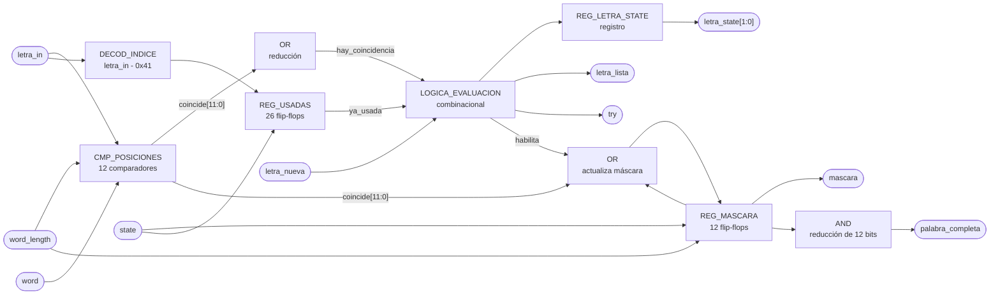

# M07 - Comparador de letra

## Propósito

Compara la letra recibida con la palabra escogida y determina el resultado del intento. Guarda
además cuáles posiciones de la palabra ya se revelaron y cuáles letras ya se recibieron, que es lo
que permite avisar cuando la palabra quedó completa y no penalizar una letra repetida.

---

## Entradas

- `clk`, `rst`.
- `letra_in`: letra almacenada en `REG_Letra-in`.
- `letra_nueva`: estrobo de un ciclo que avisa que `letra_in` acaba de cargarse, desde `REG_Letra-in`.
- `word`: palabra almacenada en `REG_Palabra-escogida`.
- `word_length`: cantidad de caracteres válidos de `word`, desde `REG_Palabra-escogida`.
- `state`: estado actual, desde `M13_FSM`.

---

## e) Salidas

- `letra_state[1:0]`: resultado de la comparación, hacia `M02_Generador-Tono` y
  `M11_Transmisor-UART`.
- `letra_lista`: estrobo de un ciclo que acompaña a `letra_state`, hacia `M02_Generador-Tono` y
  `M11_Transmisor-UART`.
- `palabra_completa`: todas las posiciones de la palabra reveladas, hacia `M13_FSM`.
- `mascara`: posiciones reveladas, hacia `M04_Mostrar-LCD` y `M11_Transmisor-UART`, es el patrón
  que se pinta en el LCD y el que viaja en la trama hacia la PC.
- `try`: pulso de intento fallido, hacia `M12_Contador-Intentos`.

Codificación de `letra_state`:

| `letra_state` | Significado |
| ------------- | ----------- |
| `00`          | FALLO, la letra no está en la palabra |
| `01`          | ACIERTO, la letra reveló al menos una posición |
| `10`          | REPETIDA, la letra ya se había recibido antes |
| `11`          | sin uso |

---

## f) Relación con otros módulos

`REG_Letra-in` le entrega la letra junto con el estrobo `letra_nueva`. Ese estrobo es necesario
porque la letra se queda en el registro después de evaluarse, y sin él el módulo estaría
reevaluando la misma letra en cada ciclo de reloj.

`REG_Palabra-escogida` le entrega la palabra y su longitud. La longitud se usa al arrancar la
partida para saber cuántas posiciones de la máscara cuentan, ya que la palabra puede tener entre 4
y 12 caracteres y el registro es de ancho fijo.

`M13_FSM` solo le da `state`, y este módulo lo usa para una cosa, limpiar la máscara y las letras
usadas al ver que entró a CARGA. La FSM no le ordena comparar, la comparación la dispara la
llegada de una letra.

Hacia afuera alimenta cuatro bloques. `M12_Contador-Intentos` recibe `try` y solo cuando la letra
fue un fallo real. `M02_Generador-Tono` y `M11_Transmisor-UART` reciben `letra_state` con su
estrobo, para el sonido y para la trama hacia la PC. `M13_FSM` recibe `palabra_completa`, que es
la condición de victoria de la partida.

Vale la pena notar quién decide qué. Este módulo decide si la letra acierta, falla o está
repetida, pero no decide si la partida se acaba. Reporta `palabra_completa` y deja que la FSM
cambie de estado.

---

## g) Explicación de funcionamiento

Al entrar la partida a CARGA se limpian los dos registros de memoria del módulo, la máscara de
posiciones reveladas y el conjunto de letras ya recibidas. La máscara se inicializa con unos en
las posiciones que quedan fuera de `word_length`, para que esas posiciones de relleno no impidan
nunca detectar la palabra completa.

Cuando llega `letra_nueva`, el módulo hace dos preguntas en paralelo. Primero, si esa letra ya
está marcada en el conjunto de usadas. Segundo, si coincide con alguna de las posiciones válidas
de la palabra.

Si la letra ya se había recibido, el resultado es REPETIDA y no pasa nada más. No se marca nada,
no se pulsa `try`, y el temporizador ni se entera. Es exactamente lo que pide el enunciado, una
letra repetida no consume intento ni reinicia el conteo de tiempo.

Si la letra es nueva y coincide, se marcan de un solo golpe todas las posiciones donde aparece.
Esa es la parte que resuelve el requisito de revelar todas las ocurrencias simultáneamente, la
comparación es paralela contra las doce posiciones y la máscara se actualiza con un OR, no hay
recorrido secuencial de la palabra.

Si la letra es nueva y no coincide, se marca como usada y se pulsa `try` para que
`M12_Contador-Intentos` sume el fallo.

`palabra_completa` sale de comparar la máscara contra el patrón de todos unos. Se evalúa de forma
continua, así que se levanta en el mismo ciclo en que la última letra revela la última posición
pendiente.

---

## h) Diseño

### Comparación paralela

La letra entra a doce comparadores, uno por posición de `REG_Palabra-escogida`. Cada uno produce
un bit de coincidencia:

$$
coincide[i] = (word[i] = letra\_in) \land (i < word\_length)
$$

$$
hay\_coincidencia = \bigvee_{i=0}^{11} coincide[i]
$$

La condición `i < word_length` es la que evita que las posiciones de relleno del registro generen
coincidencias falsas.

### Evaluación de la letra

Tabla de verdad de la evaluación, válida cuando `letra_nueva = 1`. `ya_usada` es el bit
correspondiente a `letra_in` dentro de `REG_USADAS`:

| `ya_usada` | `hay_coincidencia` | `letra_state` | `try` | `letra_lista` | `REG_MASCARA'` | `REG_USADAS'` |
| ---------- | ------------------ | ------------- | ----- | ------------- | -------------- | ------------- |
| `1`        | `x`                | `10` REPETIDA | `0`   | `1`           | sin cambio     | sin cambio    |
| `0`        | `1`                | `01` ACIERTO  | `0`   | `1`           | `mascara \| coincide` | marca `letra_in` |
| `0`        | `0`                | `00` FALLO    | `1`   | `1`           | sin cambio     | marca `letra_in` |

Con `letra_nueva = 0` nada cambia, `try` y `letra_lista` quedan en cero y los dos registros
conservan su valor.

La letra repetida sí levanta `letra_lista`. Eso es a propósito, la PC tiene que enterarse de que
su letra se ignoró, si no el jugador se queda sin respuesta y vuelve a escribir.

### Registros de memoria

`REG_USADAS` es un vector de 26 bits, uno por letra del alfabeto. El índice sale de restarle el
código ASCII de la `A`:

$$
indice = letra\_in - \text{0x41}
$$

Se eligió un bit por letra en vez de guardar la lista de letras recibidas porque la consulta es de
un solo ciclo y el costo es fijo, 26 flip-flops, sin importar cuántas letras lleve la partida.

`REG_MASCARA` es de 12 bits, uno por posición máxima de palabra.

Tabla de verdad de los dos registros, en orden de prioridad descendente:

| Condición                        | `REG_MASCARA'`         | `REG_USADAS'`     |
| -------------------------------- | ---------------------- | ----------------- |
| `rst = 1`                        | todo en `0`            | todo en `0`       |
| `state = CARGA`                  | relleno en `1`, resto en `0` | todo en `0` |
| `letra_nueva = 1` (ver tabla anterior) | según evaluación | según evaluación  |
| resto                            | sin cambio             | sin cambio        |

El relleno en `1` significa poner en uno las posiciones desde `word_length` hasta la 11, que no
pertenecen a la palabra de esta partida.

### Palabra completa

$$
palabra\_completa = \bigwedge_{i=0}^{11} mascara[i]
$$

| `mascara`                     | `palabra_completa` |
| ----------------------------- | ------------------ |
| todos los bits en `1`         | `1`                |
| al menos un bit en `0`        | `0`                |

Gracias a la inicialización con relleno, este AND de doce bits sirve igual para una palabra de 4
letras que para una de 12, sin comparar contra `word_length` en tiempo de ejecución.

### Nota sobre latches

La evaluación de la letra es combinacional y alimenta registros dentro de un `always_ff`. Las
asignaciones de `letra_state`, `try` y `letra_lista` tienen valor por defecto antes del `if`, para
que ninguna rama quede sin asignar.

---

## i) Diagrama esquemático detallado del diseño

`clk` y `rst` entran a los tres registros aunque no se dibujen, por el mismo criterio del resto de
los diagramas del proyecto.

---

## j) Diagrama completo de conexiones del diseño

Ningún puerto de este módulo sale de la FPGA, así que no le corresponde ninguna línea del
`basys3.xdc`. Sus conexiones dentro de `CONTROL_JUEGO` son:

- `clk`, al reloj global de 100 MHz.
- `rst`, a BTN_RST ya sincronizado.
- `letra_in`, `letra_nueva`, desde `REG_Letra-in`.
- `word`, `word_length`, desde `REG_Palabra-escogida`.
- `state`, desde `M13_FSM`.
- `letra_state`, `letra_lista`, hacia `M02_Generador-Tono` y `M11_Transmisor-UART`.
- `mascara`, hacia `M04_Mostrar-LCD` y `M11_Transmisor-UART`.
- `palabra_completa`, hacia `M13_FSM`.
- `try`, hacia `M12_Contador-Intentos`.

El punto j) del método de diseño modular pide un diagrama de conexiones eléctricas por chips, que
aplica a un montaje con circuitos integrados discretos. En un diseño que se sintetiza completo
dentro de la Artix-7 la traducción razonable es esta lista de puertos del instanciado, y queda
pendiente confirmárselo al profesor.
