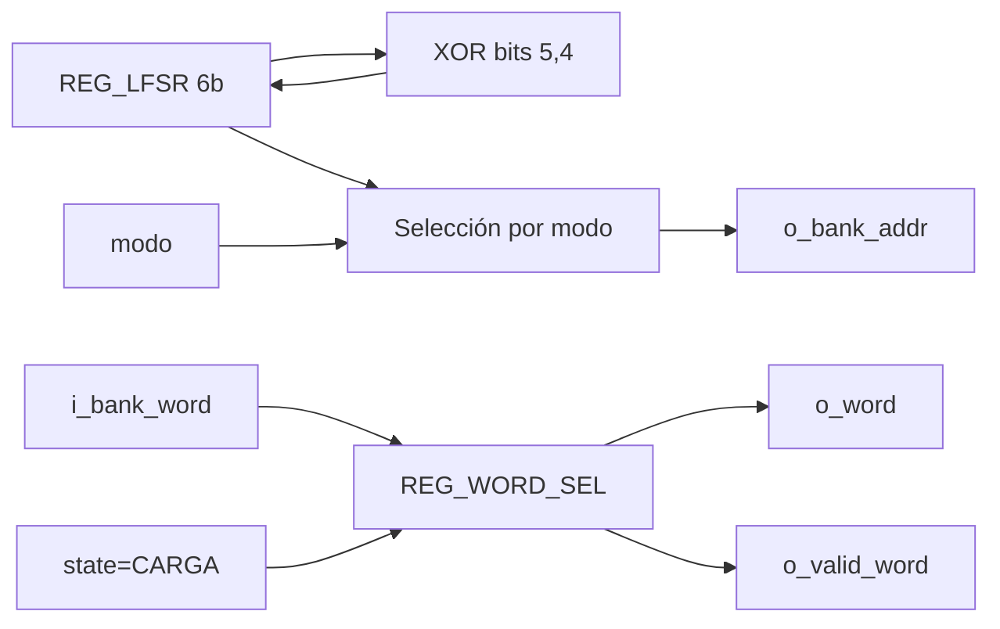

# M08 - LFSR

Archivo RTL de referencia: `src/design/lfsr.sv`.

## b) Diagrama modular

## c) Objetivo del módulo

Generar una secuencia pseudoaleatoria continua, producir la dirección del banco y capturar
    una palabra válida cuando la FSM entra a `CARGA`.

## d) Entradas

- `clk`, `rst`.
    - `i_state[2:0]`.
    - `i_modo`.
    - `i_bank_word[63:0]`: palabra leída de M14.

## e) Salidas

- `o_bank_addr[5:0]`.
    - `o_word[63:0]`.
    - `o_valid_word`.

## f) Explicación de la relación con otros módulos

M08 direcciona M14 y recibe inmediatamente su lectura combinacional. Entrega la palabra
    seleccionada a M07/M04/M11 por medio del `top` y levanta `valid_word` hacia M13.

## g) Explicación de funcionamiento

El LFSR de seis bits corre libre con realimentación `bit5 XOR bit4` y semilla `1`. Al detectar
    entrada a `CARGA`, limpia `reg_cargado`; mientras permanezca en CARGA captura la primera
    dirección válida y sostiene `o_valid_word`.

    En modo fácil la dirección se obtiene del LFSR para el rango del banco. En difícil se usan los
    cinco bits bajos como índice de una tabla 0–31 traducida a direcciones 1–32.

## h) Diseño

Parámetros por defecto: 50 palabras, 32 palabras difíciles, longitud máxima 12 y cinco bits
    por letra. La palabra capturada conserva el formato de 64 bits del banco.

## i) Diagrama esquemático detallado

El diagrama de b) representa también el datapath principal de la implementación. Para módulos con
FSM interna se incluye la secuencia de estados dentro de la explicación de funcionamiento.
