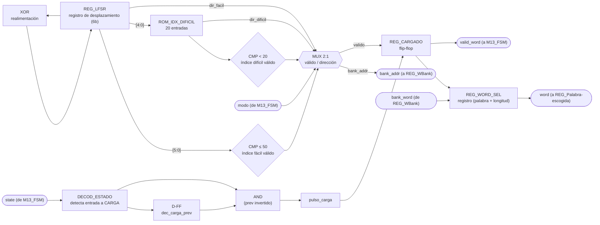
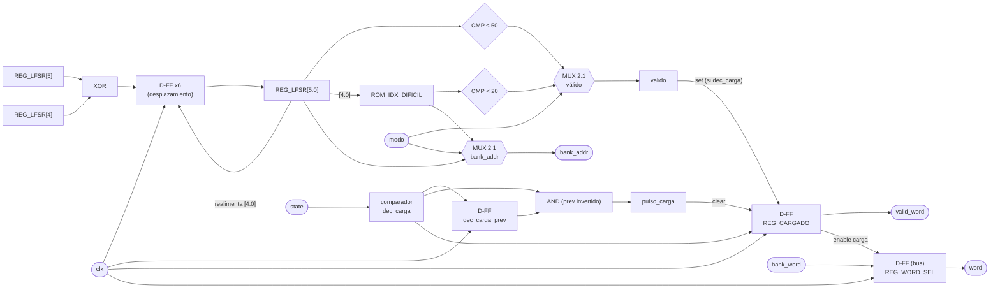

# M08 - LFSR

## a) Nombre del módulo

M08_LFSR

## b) Diagrama modular



`clk` y `rst` entran a todo registro/contador aunque no se dibujen, por el mismo criterio del
resto de los diagramas del proyecto.

Nota sobre la diferencia con el diagrama de `nivel03.md`: ese diagrama muestra `bank_word`
entrando a M08 pero no dibuja la flecha de salida `bank_addr` hacia `REG_WBank`, la dirección que
M08 tiene que generar para que la ROM le devuelva algo. Es la misma omisión de nivel de detalle
que M11_Transmisor-UART señala para la arbitración del bus, y queda igual de pendiente: a nivel
2/3 se simplifica, acá en nivel de módulo hace falta dibujarla para que el diseño cierre.

## c) Objetivo del módulo

Escoger de forma pseudoaleatoria la palabra secreta de la partida. Un LFSR corre libre todo el
tiempo, sin depender de `state`; al ver que `state` entró a CARGA, el módulo muestrea el valor
del LFSR en ese instante (y, si hiciera falta, en los ciclos siguientes) para producir una
dirección válida dentro del banco de 50 palabras, acotada según `modo`, se la entrega a
`REG_WBank` como `bank_addr`, recibe de vuelta `bank_word` (los caracteres y la longitud de esa
palabra), y lo entrega como `word` a `REG_Palabra-escogida` junto con `valid_word` para que
M13_FSM pase a JUEGO.

## d) Entradas

- `clk`, `rst`.
- `state[2:0]`: estado actual, desde M13_FSM. Solo le importa distinguir CARGA del resto; el
  módulo decodifica la entrada a ese estado igual que hacen M02, M06, M11 y M12 con sus propios
  eventos de interés.
- `modo`: FACIL o DIFICIL, desde M13_FSM. Acota el rango de palabras válidas.
- `bank_word[78:0]`: palabra leída de `REG_WBank` en la dirección que M08 acaba de pedir,
  formato `{longitud[3:0], letra15[4:0], ..., letra1[4:0]}` (ver h). Combinacional respecto a
  `bank_addr`, no hay reloj de por medio en la ROM.

## e) Salidas

- `bank_addr[5:0]`: dirección hacia `REG_WBank`, valores `1`–`50`. No está en la lista original
  de `nivel03.md` (ver nota en b), pero es imprescindible para que el módulo tenga con qué
  direccionar la ROM.
- `word[78:0]`: palabra escogida, mismo formato que `bank_word`, hacia `REG_Palabra-escogida`.
- `valid_word`: bandera de palabra lista, hacia M13_FSM.

## f) Explicación de la relación con otros módulos

M08 solo recibe `state` y `modo` de M13_FSM, igual que la mayoría de los módulos de
CONTROL_JUEGO, y no le devuelve nada a la FSM salvo `valid_word`. Su única otra relación es con
`REG_WBank`, el registro/ROM que vive junto a él dentro del subgraph BANCO_PALABRAS de
`nivel03.md`: le pide una dirección (`bank_addr`) y recibe el contenido (`bank_word`). No tiene
ninguna relación con M02, M04, M05, M06, M07, M09, M10, M11 ni M12; es tan aislado como
M03_Temporizador, solo que en vez de "aislado y con un reloj propio" es "aislado y con un
generador de aleatoriedad propio".

A diferencia de M07_Comparador-letra o M12_Contador-Intentos, que se limpian al **entrar** a
CARGA para la partida que empieza, M08 hace lo contrario: es quien **dispara** la salida de
CARGA, al ser el único módulo que le debe algo a M13_FSM (`valid_word`) antes de que la FSM pueda
avanzar. Es el mismo patrón que `tiempo_agotado`/`fin_espera` de M03, una señal que la FSM espera
sin apurar a nadie.

El LFSR en sí no tiene ninguna relación con `state`: corre libre desde el primer ciclo después de
`rst` y nunca se detiene, ni siquiera durante JUEGO o los estados de resultado. Es la decisión de
diseño que ya adelanta `nivel02.md`, para que la palabra elegida no dependa de un seed fijo ni del
instante exacto en que arrancó el sistema, sino de cuántos ciclos de reloj — impredecibles desde
el punto de vista del jugador — pasaron desde el encendido hasta que se confirmó `ok`.

## g) Explicación de funcionamiento

El registro `REG_LFSR`, de 6 bits, se desplaza un bit cada ciclo de reloj con realimentación XOR
(polinomio de período máximo, ver h), generando una secuencia pseudoaleatoria de 63 valores no
nulos que se repite cada 63 ciclos, es decir, cada 630 ns a 100 MHz. Esto pasa siempre, sin
importar en qué estado esté el sistema.

Mientras `state` no sea CARGA, el resto del módulo permanece en reposo: `REG_CARGADO` está en 0 y
`valid_word` en 0. Al detectar la entrada a CARGA (flanco de `state`, mismo detector de flanco que
usan M02 y M11 sobre sus propios niveles de interés), el módulo empieza a evaluar, ciclo a ciclo,
si el valor **actual** del LFSR cae dentro del rango válido para el `modo` vigente:

- En FACIL, cualquier valor de `REG_LFSR` entre 1 y 50 es una dirección válida directa hacia el
  banco de 50 palabras.
- En DIFICIL, se toman los 5 bits menos significativos de `REG_LFSR` como índice (0 a 31) hacia
  `ROM_IDX_DIFICIL`, una tabla de solo 20 entradas con las direcciones (1 a 50) de las palabras de
  6 letras o más dentro del mismo banco de 50; un índice de 20 a 31 no tiene entrada y se descarta
  como no válido.

Como el LFSR sigue corriendo libre durante toda esta espera, un valor no válido en un ciclo no
detiene nada: simplemente el módulo vuelve a mirar en el ciclo siguiente, con un valor distinto.
En la práctica esto tarda como mucho un puñado de ciclos de reloj (en FACIL, 50 de 63 valores son
válidos; en DIFICIL, 20 de 32), muchísimo más rápido que cualquier cosa perceptible por el
jugador. Esto es, de hecho, la razón de que CARGA exista como estado propio en vez de resolverse
en el mismo ciclo en que se confirma `ok`: la FSM ya está diseñada (ver M13_FSM, g) para
quedarse esperando en CARGA sin hacer nada más hasta que `valid_word` se levante.

En cuanto aparece un valor válido, el módulo lo fija como `bank_addr` hacia `REG_WBank`, que
responde en el mismo ciclo con `bank_word` (la ROM es combinacional, sin reloj propio). Ese
mismo ciclo, `REG_CARGADO` se pone en 1 y `REG_WORD_SEL` captura `bank_word`. `REG_CARGADO` se
mantiene en 1 el resto de la partida — no hace falta bajarlo antes, porque a M13_FSM solo le
importa `valid_word` mientras está en CARGA, y a la siguiente partida se limpia solo al volver a
detectar la entrada a un nuevo CARGA (ver h). `REG_LFSR` nunca se detiene ni siquiera después de
esto, así que cuando la próxima partida entre a CARGA el punto de partida de la búsqueda ya es
otro, sin relación con la palabra anterior.

## h) Diseño

### Parámetros y anchos

| Parámetro | Valor por defecto | Justificación |
|---|---|---|
| `N_PALABRAS` | 50 | Mínimo que exige el enunciado (nivel01, "banco de al menos 50 palabras"). |
| `N_PALABRAS_DIFICIL` | 20 | Subconjunto de palabras de 6+ letras, por definir en equipo al armar la ROM. |
| `LFSR_WIDTH` | 6 bits | `$clog2(N_PALABRAS+1) = 6`, cubre direcciones 1–50 con margen (hasta 63) sin necesitar un ancho mayor. |
| `IDX_DIFICIL_WIDTH` | 5 bits | `$clog2(32)`, ancho natural de los 5 bits menos significativos de `REG_LFSR` que se reutilizan como índice hacia `ROM_IDX_DIFICIL`. |
| `WORD_MAXLEN` | 15 | Igual límite que usa M04/M11, columnas del PmodCLP. |
| `LETRA_WIDTH` | 5 bits | Alcanza para 26 códigos (A-Z). |

`bank_addr` y `word`/`bank_word` van con `parameter`/`localparam` calculados a partir de estos
valores, siguiendo la convención ya usada en M02 y M03, para que si el equipo ajusta el tamaño
del banco los anchos se recalculen solos.

### Por qué direcciones 1–50 y no 0–49

Con realimentación XOR pura, el estado todo-ceros es un punto fijo: si `REG_LFSR` llegara a
`000000` se quedaría ahí para siempre, así que el diseño estándar de este tipo de LFSR evita ese
estado por construcción (sembrando `rst` con un valor no nulo) y por lo tanto nunca lo produce.
Esto deja disponibles exactamente los valores `1` a `63`, nunca `0`. En vez de restar 1 en algún
punto del datapath para volver a un rango `0`-`49` y desperdiciar además los valores `51`-`63`,
se numeran las palabras del banco de `1` a `50` directamente: la dirección `0` simplemente no se
usa nunca, ni por el LFSR ni por la ROM, y se ahorra un resta.

### REG_LFSR (registro de desplazamiento)

Polinomio de período máximo para 6 bits, taps en las posiciones 6 y 5 (`x^6 + x^5 + 1`):

```
feedback = REG_LFSR[5] XOR REG_LFSR[4]
REG_LFSR' = {REG_LFSR[4:0], feedback}
```

| `rst` | `REG_LFSR'` |
|---|---|
| 1 | `6'b000001` (semilla fija no nula) |
| 0 | `{REG_LFSR[4:0], feedback}` |

Corre en todos los ciclos, sin señal de habilitación: no depende de `state` ni de `pulso_carga`.

### Detección de entrada a CARGA

Mismo detector de flanco que usan M02 y M11 sobre sus propios eventos:

```
dec_carga      = (state == CARGA)
pulso_carga    = dec_carga AND (NOT dec_carga_prev)
```

`pulso_carga` no dispara directamente una captura (a diferencia de M02): solo limpia
`REG_CARGADO` a 0 para que la partida anterior no deje `valid_word` "heredado" confundiendo a la
FSM durante el primer ciclo de la CARGA nueva. La condición de captura real es la validez del
índice, evaluada en cada ciclo mientras `dec_carga = 1`.

### Validez del índice y dirección según `modo`

| `modo` | Condición de validez | `bank_addr` si válido |
|---|---|---|
| FACIL (`0`) | `REG_LFSR <= N_PALABRAS` (`<= 50`) | `REG_LFSR[5:0]` |
| DIFICIL (`1`) | `REG_LFSR[4:0] < N_PALABRAS_DIFICIL` (`< 20`) | `ROM_IDX_DIFICIL[REG_LFSR[4:0]]` |

`ROM_IDX_DIFICIL` es una ROM combinacional de 20 entradas de 6 bits cada una, con las direcciones
(dentro del mismo banco de 50) de las palabras de 6 letras o más; su contenido concreto depende
de qué 20 y tantas palabras del banco cumplan esa condición, pendiente de fijar en equipo junto
con el resto del contenido de `REG_WBank`.

### REG_CARGADO y REG_WORD_SEL (captura)

| `pulso_carga` | `dec_carga` | `válido` (según tabla anterior) | `REG_CARGADO'` | `REG_WORD_SEL'` |
|---|---|---|---|---|
| 1 | X | X | `0` | conserva su valor |
| 0 | 0 | X | conserva su valor | conserva su valor |
| 0 | 1 | 0 | conserva su valor (`0`, sigue esperando) | conserva su valor |
| 0 | 1 | 1 | `1` | `bank_word` (captura) |

`valid_word = REG_CARGADO`. `word = REG_WORD_SEL`.

Nótese que `pulso_carga` y la primera evaluación de validez pueden coincidir en el mismo ciclo si
el LFSR ya está en rango válido justo al entrar a CARGA (la mitad de las veces, aproximadamente,
en FACIL); la tabla lo resuelve solo porque la fila de `pulso_carga=1` tiene prioridad de lectura
sobre la de captura, pero el valor de `REG_LFSR` de ese ciclo no se pierde, vuelve a evaluarse un
ciclo después ya con `pulso_carga=0`. En el peor caso esto cuesta un ciclo de reloj adicional de
espera, irrelevante frente a la duración de CARGA.

## i) Diagrama esquemático detallado (por compuertas lógicas)



`clk` y `rst` entran a todo registro/contador del módulo aunque no se dibujen en cada elemento,
por el mismo criterio usado en el resto de los diagramas del proyecto; `rst` fuerza
`REG_LFSR = 6'b000001` (nunca `0`, ver h), `dec_carga_prev = 0` y `REG_CARGADO = 0`, dejando el
módulo sin ninguna palabra confirmada hasta el primer CARGA después del reinicio.