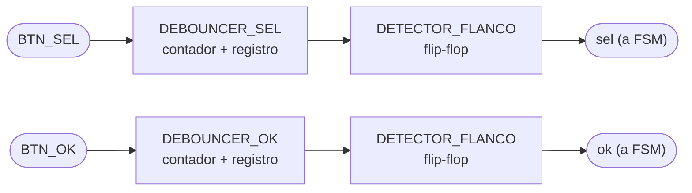
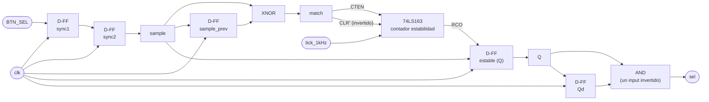

# M09 - Botones

## a) Nombre del módulo
M09_Botones

## b) Diagrama modular

## c) Objetivo del módulo

Elimina los rebotes eléctricos de los botones de selección y confirmación, entregando pulsos
limpios `sel` y `ok` directamente a la `FSM`.

## d) Entradas

- `BTN_SEL`: botón de selección.
- `BTN_OK`: botón de confirmación.
- `clk`: reloj del sistema.
- `BTN_RST`: reinicio del sistema.

## e) Salidas

- `sel`: evento de selección hacia la `FSM`.
- `ok`: evento de confirmación hacia la `FSM`.

## f) Explicación de la relación con otros módulos

Es el único módulo que toca directamente las señales físicas `BTN_SEL` y `BTN_OK`. Entrega
`sel` y `ok` únicamente a la `FSM`; ningún otro módulo consume estas señales (ya no existe un
M11_Modo intermedio como en versiones anteriores del diagrama). No depende de ningún otro
módulo M0X, solo de `clk`/`BTN_RST`: es de los módulos más aislados del sistema, junto con
M05_Estado.

## g) Funcionamiento

Filtra las transiciones inestables de los botones y genera pulsos únicos y sincronizados para el
control del juego. Cada botón pasa primero por un sincronizador de 2 etapas para evitar
metaestabilidad al cruzar del dominio "asíncrono/mecánico" al reloj del sistema. Luego se
compara la muestra actual contra la muestra anterior a un ritmo fijo (`tick` de ~1 kHz, derivado
con un divisor de reloj); mientras cambien entre muestreos (rebote), se reinicia un contador;
cuando el valor se mantiene igual durante N muestreos consecutivos (por ejemplo 16, ≈16 ms a
1 kHz), se acepta como el nuevo valor estable del botón. Un detector de flanco de subida sobre
el valor ya estable genera un pulso de un solo ciclo de reloj (`sel`/`ok`) cada vez que el botón
pasa de no presionado a presionado, para que la FSM no vea "presionado" sostenido varios ciclos.

## h) Diseño

Comparador de igualdad entre la muestra actual y la anterior (`sample`, `sample_prev`) para
decidir si reiniciar o incrementar el contador de estabilidad:

| sample | sample_prev | match (= igual) |
|---|---|---|
| 0 | 0 | 1 |
| 0 | 1 | 0 |
| 1 | 0 | 0 |
| 1 | 1 | 1 |

`match = sample XNOR sample_prev` (una sola compuerta, ya en forma mínima).

Detector de flanco de subida sobre el valor estable (`Q` = valor estable actual, `Qd` = valor
estable un ciclo antes):

| Qd | Q | pulso |
|---|---|---|
| 0 | 0 | 0 |
| 0 | 1 | 1 |
| 1 | 0 | 0 |
| 1 | 1 | 0 |

## i) Diagrama esquemático detallado (por compuertas lógicas)

A continuación se muestra solamente el diagrama del btn_sel, ya que son identicos para ambos casos.

