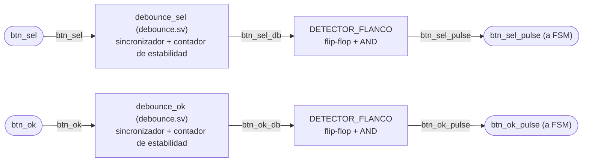
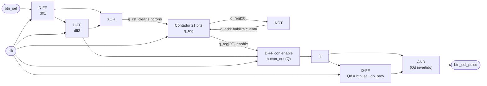

# M09 - Botones

## a) Nombre del módulo
M09_Botones

## b) Diagrama modular

El filtro de rebote está en un submódulo aparte, `debounce.sv`, que `botones.sv` instancia dos
veces, una por botón, con el mismo parámetro `N = 21`. Los dos detectores de flanco están en
`botones.sv`.

## c) Objetivo del módulo

Elimina los rebotes eléctricos de los botones de selección y confirmación, entregando pulsos
limpios de un ciclo `sel` y `ok` directamente a la `FSM`.

## d) Entradas

- `clk`: reloj del sistema, 100 MHz.
- `rst`: reinicio del sistema, desde `BTN_RST`.
- `btn_sel`: botón de selección, señal cruda.
- `btn_ok`: botón de confirmación, señal cruda.

`debounce.sv` tiene el `parameter N` (por defecto 21), el ancho de su contador de estabilidad.

## e) Salidas

- `btn_sel_pulse`: pulso de un ciclo por cada presión de BTN_SEL, hacia la entrada `i_sel` de la
  `FSM`.
- `btn_ok_pulse`: pulso de un ciclo por cada presión de BTN_OK, hacia la entrada `i_ok` de la
  `FSM`.

## f) Explicación de la relación con otros módulos

Es el único módulo que toca directamente las señales físicas `BTN_SEL` y `BTN_OK`. Entrega
`btn_sel_pulse` y `btn_ok_pulse` únicamente a la `FSM`; ningún otro módulo consume estas señales
(ya no existe un M11_Modo intermedio como en versiones anteriores del diagrama). No depende de
ningún otro módulo M0X, solo de `clk`/`rst`: es de los módulos más aislados del sistema, junto con
M05_Estado.

## g) Funcionamiento

Filtra las transiciones inestables de los botones y genera pulsos únicos y sincronizados para el
control del juego. Cada botón pasa por tres etapas.

1. **Sincronizador.** Dos flip-flops D en cascada, `dff1` y `dff2`, llevan la señal mecánica
   asíncrona al dominio del reloj y reducen la probabilidad de metaestabilidad.
2. **Contador de estabilidad.** En cada ciclo se compara la muestra de `dff1` con la de `dff2`,
   que es la misma señal un ciclo antes. Si difieren, el botón está rebotando y el contador de
   `N` bits vuelve a 0. Si son iguales, el contador sube, hasta que su bit más alto
   (`q_reg[N-1]`) se pone en 1 y ahí se queda. Mientras ese bit está en 1, la salida estable
   `button_out` copia a `dff2` en cada ciclo. Con `N = 21`, el bit 20 se enciende después de
   2²⁰ = 1 048 576 ciclos iguales seguidos, unos 10.5 ms a 100 MHz.
3. **Detector de flanco de subida.** Sobre el valor ya estable, genera un pulso de un solo ciclo
   de reloj cada vez que el botón pasa de no presionado a presionado, para que la FSM no vea
   "presionado" sostenido varios ciclos.

No hace falta un divisor de reloj ni un `tick` de muestreo: el contador corre a la frecuencia del
reloj y el tiempo de estabilidad sale directamente de su ancho.

Un cambio nuevo nunca pasa a la salida sin cumplir otra vez la espera completa. En el ciclo en
que `dff1` toma el valor nuevo, `dff1 ≠ dff2` y el contador se reinicia en ese mismo flanco,
mientras `button_out` todavía copia el valor viejo de `dff2`. En el ciclo siguiente, cuando `dff2`
ya tiene el valor nuevo, el bit alto del contador ya está en 0 y `button_out` no se actualiza
hasta completar los ~10.5 ms.

La comparación usa `dff1`, la primera etapa del sincronizador, que es la que podría quedar
metaestable. Si eso pasara, el único efecto sería reiniciar el contador un ciclo antes o después,
que no cambia el valor que llega a `button_out` (ese siempre sale de `dff2`), así que se acepta.

## h) Diseño

### Detección de cambio

`q_rst` indica que la muestra cambió entre un ciclo y el siguiente:

| dff1 | dff2 | q_rst |
|---|---|---|
| 0 | 0 | 0 |
| 0 | 1 | 1 |
| 1 | 0 | 1 |
| 1 | 1 | 0 |

`q_rst = dff1 XOR dff2` (una sola compuerta, ya en forma mínima).

### Contador de estabilidad

`q_add = NOT q_reg[N-1]`, el contador todavía no llegó a su valor de saturación. Siguiente valor
del contador:

| q_rst | q_add | q_next |
|---|---|---|
| 0 | 1 | `q_reg + 1` |
| 0 | 0 | `q_reg` (saturado) |
| 1 | X | 0 |

Registro de salida del filtro:

| rst | q_reg[N-1] | button_out' |
|---|---|---|
| 1 | X | 0 |
| 0 | 1 | `dff2` |
| 0 | 0 | `button_out` |

`q_reg[N-1]` funciona como el habilitador del flip-flop de salida, así que no se necesita un
comparador contra un valor final: basta con el bit más significativo del contador.

Parámetros: con `N = 21` el tiempo de estabilidad es 2^(N-1) ciclos = 1 048 576 ciclos ≈ 10.5 ms
a 100 MHz, suficiente para los rebotes típicos de un pulsador (unos pocos ms) y todavía
imperceptible para el jugador.

### Detector de flanco de subida

Sobre el valor estable (`Q` = `button_out` actual, `Qd` = `button_out` un ciclo antes, registro
`btn_*_db_prev` en `botones.sv`):

| Qd | Q | pulso |
|---|---|---|
| 0 | 0 | 0 |
| 0 | 1 | 1 |
| 1 | 0 | 0 |
| 1 | 1 | 0 |

`pulso = Q AND NOT Qd`.

## i) Diagrama esquemático detallado (por compuertas lógicas)

A continuación se muestra solamente el diagrama de `btn_sel`, ya que es idéntico para ambos
botones.

`rst` entra a todos los flip-flops y al contador aunque no se dibuje, por el mismo criterio del
resto de los diagramas del proyecto.
