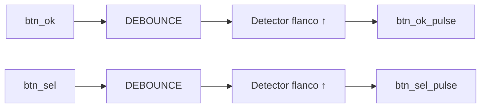

# M09 - Botones

Archivo RTL de referencia: `src/design/botones.sv`.

## b) Diagrama modular

## c) Objetivo del módulo

Filtrar rebotes de `BTN_OK` y `BTN_SEL` y transformar cada pulsación estable en un pulso de
    un solo ciclo.

## d) Entradas

- `clk`, `rst`.
    - `btn_ok`.
    - `btn_sel`.

## e) Salidas

- `btn_ok_pulse`.
    - `btn_sel_pulse`.

## f) Explicación de la relación con otros módulos

Los pulsos se conectan directamente a M13 como `i_ok` e `i_sel`. El filtrado se delega a dos
    instancias de `debounce.sv`.

## g) Explicación de funcionamiento

Cada botón pasa primero por un debounce con `N=21`. Luego se registra el valor filtrado del
    ciclo anterior y se aplica detección de flanco de subida: `db & ~db_prev`.

## h) Diseño

No existe una FSM interna. La separación entre debounce y detector de flanco evita que
    mantener un botón presionado provoque múltiples acciones en la FSM.

## i) Diagrama esquemático detallado

El diagrama de b) representa también el datapath principal de la implementación. Para módulos con
FSM interna se incluye la secuencia de estados dentro de la explicación de funcionamiento.
