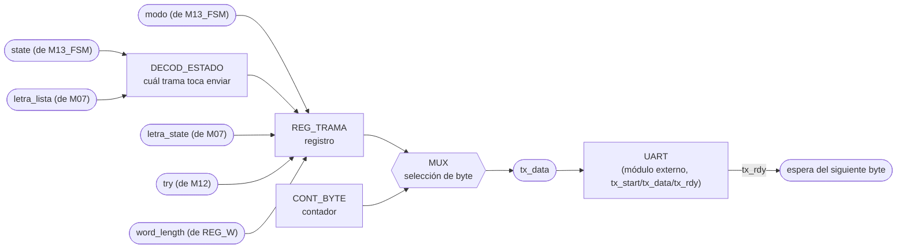
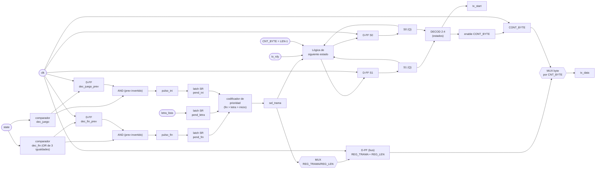

# M11 - Transmisor-UART

## a) Nombre del módulo

M11_Transmisor-UART

## b) Diagrama modular



## c) Objetivo del módulo

Ensamblar y transmitir hacia la PC, por UART, la trama de estado del juego, con modo, estado de
la última letra, resultado, longitud de la palabra e intentos usados
(`modo/letra_state/Resultado/word_length/Intentos`).

Decide solo cuándo transmitir. Al ver que `state` entró a JUEGO manda la trama de inicio de
partida con longitud y modo, con cada letra evaluada por M07 manda el resultado de esa letra y
los intentos restantes, y al entrar a GANO, PERDIO_INTENTOS o PERDIO_TIEMPO manda el resultado
final. Como los tres estados de fin son distintos, la causa de la derrota sale directo del
`state`, sin necesidad de una señal aparte.

La UART en sí es un módulo aparte, dado ya resuelto (`UART/src/UART.vhd`, con `UART_tx.vhd` y
`UART_rx.vhd`). M11 no arma tramas seriales ni cuenta baudios, eso ya lo hace la UART; M11 solo le
entrega un byte a la vez con el handshake que esa UART expone, y decide el contenido y el orden de
esos bytes.

## d) Entradas

- `clk`, `rst`.
- `state[2:0]`: estado actual, desde M13_FSM, decide cuál trama toca enviar.
- `modo`: desde M13_FSM.
- `letra_state[1:0]`: desde M07_Comparador-letra, 2 bits, `00` fallo, `01` acierto, `10`
  repetida. Se mantiene válido solo el ciclo en que lo acompaña `letra_lista`.
- `letra_lista`: pulso de un ciclo desde M07_Comparador-letra que marca que `letra_state` es
  válido este ciclo, para cualquiera de sus tres códigos, incluida la letra repetida.
- `try[2:0]`: intentos fallidos acumulados, desde M12_Contador-Intentos (alcanza hasta 6, así
  que 3 bits bastan).
- `word_length[3:0]`: longitud de la palabra escogida, desde REG_Palabra-escogida (hasta 15
  caracteres, acorde al límite de 16 columnas del PmodCLP que ya usa M04).
- `tx_rdy`: pulso de un ciclo desde la UART, indica que ya terminó de transmitir el byte
  anterior y puede recibir el siguiente.

## e) Salidas

- `tx_start`: pulso de un ciclo hacia la UART, pide transmitir el byte que hay en `tx_data` ese
  mismo ciclo.
- `tx_data[7:0]`: el byte a transmitir, válido el mismo ciclo que `tx_start`.

La etiqueta `modo/letra_state/Resultado/word_length/Intentos` del diagrama de nivel03 describe el
**contenido** que M11 empaqueta dentro de `tx_data` en distintos momentos, no puertos separados;
todos esos campos viajan por la misma señal de 8 bits, un byte a la vez.

## f) Explicación de la relación con otros módulos

M11 recibe `state` y `modo` de M13_FSM igual que el resto de los módulos, `letra_state` y
`letra_lista` de M07_Comparador-letra, y `try`/`word_length` de M12_Contador-Intentos y de
REG_Palabra-escogida respectivamente, todos dentro de CONTROL_JUEGO. No le devuelve nada a
ninguno de ellos: es un módulo de salida pura hacia la UART.

M11 es el único módulo que habla con la UART. No comparte esa interfaz con nadie, así que no hace
falta ningún arbitraje ni bus compartido: `tx_start`/`tx_data` de M11 van conectados directo a
`tx_start`/`data_in` de la UART, y `tx_rdy` de la UART entra directo a M11.

A diferencia de M02_Generador-Tono, que sí puede perderse un evento sin consecuencias graves
(un tono que no suena no rompe la partida), M11 no puede permitirse perder ni corromper una
trama a medio enviar, porque eso deja a la PC con información inconsistente del estado del
juego. Por eso, acá los eventos que llegan mientras el módulo está ocupado enviando una trama
anterior no se descartan: quedan retenidos (ver h) hasta que el módulo vuelve a `IDLE`.

## g) Explicación de funcionamiento

M11 es una pequeña FSM que traduce un evento de un solo pulso en una ráfaga de bytes hacia la
UART, con el mismo handshake que esa UART ya expone: se le entrega el byte en `tx_data`, se
pulsa `tx_start`, y se espera el pulso `tx_rdy` antes de mandar el siguiente. No hay `busy`
sondeable ni registro de control que leer de vuelta, `tx_rdy` mismo es tanto la confirmación del
byte anterior como el permiso para el siguiente.

Tres eventos disparan una trama nueva: la entrada a JUEGO (trama de inicio, con `modo` y
`word_length`), cada letra evaluada por M07 (trama de resultado de letra, con `letra_state` y
`try`, incluida la letra repetida), y la entrada a un estado de fin (trama de resultado final,
con la causa tomada directo de `state`). Cada trama es una cabecera de un byte que identifica el
tipo, seguida de uno o dos bytes de contenido (ver h). Para enviar cada byte, M11 lo pone en
`tx_data`, pulsa `tx_start` un ciclo, y espera el pulso `tx_rdy` antes de repetir con el
siguiente byte de la trama.

Como los tres eventos pueden ocurrir mientras M11 todavía está terminando de enviar una trama
anterior (por ejemplo, si llega una letra nueva mientras la trama de inicio de partida sigue en
tránsito), M11 no los descarta ni los atiende de inmediato: los deja marcados en un pequeño
juego de banderas "pendiente" y solo arranca la siguiente trama cuando vuelve a `IDLE`, con
prioridad fin de partida primero, luego resultado de letra, luego inicio de partida.

## h) Diseño

### Formato de las tramas

Se define un protocolo binario simple, cabecera de un byte más contenido, para que
`CNT_BYTE`/`MUX` del diagrama modular lo recorran byte a byte:

| Trama | Disparador | Cabecera | Byte 1 | Byte 2 | Longitud (`LEN`) |
|---|---|---|---|---|---|
| INICIO | entrada a JUEGO | `"I"` (`0x49`) | `{7'b0, modo}` | `word_length` | 3 |
| LETRA | `letra_lista` | `"L"` (`0x4C`) | `{6'b0, letra_state}` | `try` | 3 |
| FIN | entrada a GANO/PERDIO_INTENTOS/PERDIO_TIEMPO | `"F"` (`0x46`) | `{5'b0, state}` | — | 2 |

Las cabeceras se escogieron como caracteres ASCII imprimibles únicamente para que sean legibles
si alguien mira la trama cruda con un monitor serial durante depuración; `APP_PC` las trata como
bytes, no como texto.

### Detección de disparo y banderas pendientes

La entrada a JUEGO y la entrada a un estado de fin son niveles que hay que convertir en pulsos de
un ciclo con un registro de un ciclo de retardo:

```
dec_juego  = (state == JUEGO)
dec_fin    = (state == GANO) | (state == PERDIO_INTENTOS) | (state == PERDIO_TIEMPO)
pulso_ini  = dec_juego AND (NOT dec_juego_prev)
pulso_fin  = dec_fin   AND (NOT dec_fin_prev)
```

Estos pulsos, junto con `letra_lista`, no disparan directamente la carga de `REG_TRAMA`: primero
fijan una bandera "pendiente" que se mantiene en alto hasta que el módulo la atiende, para no
perder el evento si ocurre mientras la FSM está ocupada:

| Señal | Se activa con | Se limpia cuando |
|---|---|---|
| `pend_ini` | `pulso_ini` | la FSM la consume (transición `IDLE → SEND` para tipo INICIO) |
| `pend_letra` (+ `pend_letra_val[1:0]`, `pend_try_val[2:0]`) | `letra_lista` | la FSM la consume (transición `IDLE → SEND` para tipo LETRA) |
| `pend_fin` (+ `pend_fin_causa[2:0]`) | `pulso_fin` | la FSM la consume (transición `IDLE → SEND` para tipo FIN) |

Si un segundo evento del mismo tipo llega mientras el primero sigue pendiente sin atender (por
ejemplo, dos letras nuevas antes de que la FSM vuelva a `IDLE`), el valor capturado se
sobreescribe con el más reciente y el primero se pierde; es una limitación aceptada dado el
margen de tiempo que da la velocidad de tecleo humana frente a la duración de una trama de a lo
sumo 3 bytes.

Solo en `IDLE` se decide cuál pendiente atender, con esta prioridad:

| `pend_fin` | `pend_letra` | `pend_ini` | Trama a cargar |
|---|---|---|---|
| 1 | X | X | FIN |
| 0 | 1 | X | LETRA |
| 0 | 0 | 1 | INICIO |
| 0 | 0 | 0 | (ninguna, permanece en IDLE) |

### Máquina de estados

Tres estados, Moore, un byte a la vez contra el handshake `tx_start`/`tx_rdy` de la UART:

| Estado actual | hay pendiente? | `tx_rdy`? | `CNT_BYTE = LEN-1`? | Estado siguiente |
|---|---|---|---|---|
| IDLE | 0 | X | X | IDLE |
| IDLE | 1 | X | X | SEND (carga `REG_TRAMA`/`REG_LEN`, `CNT_BYTE=0`, limpia la pendiente elegida) |
| SEND | X | X | X | WAIT (`tx_start=1`, `tx_data` = byte actual) |
| WAIT | X | 0 | X | WAIT |
| WAIT | X | 1 | 0 | SEND (`CNT_BYTE = CNT_BYTE + 1`) |
| WAIT | X | 1 | 1 | IDLE |

Codificación de estado (2 bits): `IDLE=00`, `SEND=01`, `WAIT=10`, `11` no se usa.

`SEND` es el único estado donde `tx_start=1`; `tx_data` sale de un MUX que indexa `REG_TRAMA`
con `CNT_BYTE` y está presente todo el tiempo, no solo en `SEND`, pero solo importa para la UART
en el ciclo en que `tx_start` también está en 1. `WAIT` no escribe nada, solo espera el pulso
`tx_rdy`.

### Sobre la instanciación de la UART

La UART dada (`UART/src/UART_tx.vhd`) trae por defecto los generics de baudrate calculados para
un reloj de 16 MHz (`BAUD_CLK_TICKS = 139`). Como el reloj del proyecto es de 100 MHz, hay que
sobreescribir ese generic al instanciarla (`100_000_000 / 115200 ≈ 868`) para que transmita a
115200 baudios de verdad; M11 no necesita saber nada de esto, es un detalle de la instanciación
en `top.sv`, no de este módulo.

## i) Diagrama esquemático detallado (por compuertas lógicas)



`clk` y `rst` entran a todo registro/contador del módulo aunque no se dibujen en cada elemento.
`rst` fuerza el estado a `IDLE`, limpia las tres banderas `pend_*` y pone `tx_start = 0`, dejando
la interfaz con la UART en reposo tras cualquier reinicio a mitad de una trama.
