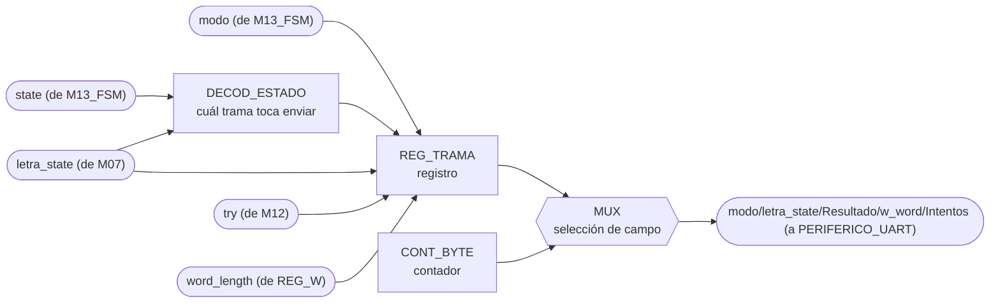
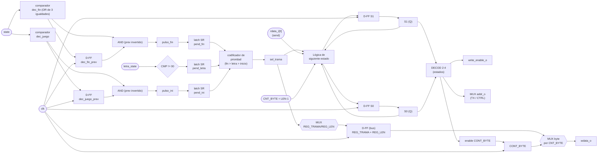

# M11 - Transmisor-UART

## a) Nombre del módulo

M11_Transmisor-UART

## b) Diagrama modular



## c) Objetivo del módulo

Ensamblar y transmitir hacia la PC, por UART, la trama de estado del juego, con modo, estado de
la última letra, resultado, longitud de la palabra e intentos usados
(`modo/letra_state/Resultado/w_word/Intentos`).

Decide solo cuándo transmitir. Al ver que `state` entró a JUEGO manda la trama de inicio de
partida con longitud y modo, con cada `letra_state` nuevo manda el resultado de la letra y los
intentos restantes, y al entrar a GANO, PERDIO_INTENTOS o PERDIO_TIEMPO manda el resultado final.
Como los tres estados de fin son distintos, la causa de la derrota sale directo del `state`, sin
necesidad de una señal aparte.

## d) Entradas

- `clk`, `rst`.
- `state[2:0]`: estado actual, desde M13_FSM, decide cuál trama toca enviar.
- `modo`: desde M13_FSM.
- `letra_state[1:0]`: desde M07_Comparador-letra. Mismo contrato asumido en M02_Generador-Tono,
  pulso de un solo ciclo (`00`=sin evento, `01`=acierto, `10`=fallo, `11`=repetida), pendiente de
  confirmar contra la documentación real de M07.
- `try[2:0]`: intentos fallidos acumulados, desde M12_Contador-Intentos (alcanza hasta 6, según
  la comparación `CMP = 6` de ese módulo, así que 3 bits bastan).
- `word_length[3:0]`: longitud de la palabra escogida, desde REG_Palabra-escogida (hasta 15
  caracteres, acorde al límite de 16 columnas del PmodCLP que ya usa M04).
- `rdata_i[31:0]`: bus de 32 bits compartido con PERIFERICO_UART, para leer de vuelta `REG_CTRL`
  y sondear el bit `send` como bandera de ocupado.

## e) Salidas

- `write_enable_o`, `addr_o[ADDR_WIDTH-1:0]`, `wdata_o[31:0]`: hacia el bus de 32 bits compartido
  con PERIFERICO_UART.

La etiqueta `modo/letra_state/Resultado/w_word/Intentos` del diagrama de nivel03 describe el
**contenido** que M11 empaqueta dentro de `wdata_o` en distintos momentos, no puertos separados;
como CONTROL_JUEGO solo tiene un bus de 32 bits hacia los periféricos, todos esos campos viajan
por las mismas tres señales de arriba, una transacción a la vez.

## f) Explicación de la relación con otros módulos

M11 recibe `state` y `modo` de M13_FSM igual que el resto de los módulos, `letra_state` de
M07_Comparador-letra, y `try`/`word_length` de M12_Contador-Intentos y de REG_Palabra-escogida
respectivamente, todos dentro de CONTROL_JUEGO. No le devuelve nada a ninguno de ellos: es un
módulo de salida pura hacia PERIFERICO_UART, igual que M04_Mostrar-LCD lo es hacia PERIFERICO_LCD.

A diferencia de M02_Generador-Tono, que sí puede perderse un evento sin consecuencias graves
(un tono que no suena no rompe la partida), M11 no puede permitirse perder ni corromper una
trama a medio enviar, porque eso deja a la PC con información inconsistente del estado del
juego. Por eso, a diferencia de M02, acá los eventos que llegan mientras el módulo está ocupado
enviando una trama anterior no se descartan: quedan retenidos (ver h) hasta que el módulo vuelve
a `IDLE`.

M11 comparte el bus físico de 32 bits con M04_Mostrar-LCD dentro de CONTROL_JUEGO (ambos hacia
PERIFERICO_LCD y PERIFERICO_UART respectivamente, que nivel02 describe como el mismo bus de 32
bits arbitrado por CONTROL_JUEGO). Este documento solo describe el lado de M11 de esa interfaz,
`write_enable_o`/`addr_o`/`wdata_o`; quién arbitra entre las peticiones de M04 y las de M11 hacia
el puerto físico único que sale de CONTROL_JUEGO **no tiene módulo asignado todavía** en el
listado M01-M13, y queda como punto pendiente de la integración en `top.sv`, igual que la
identificada en la documentación de M13.

## g) Explicación de funcionamiento

M11 es, igual que M04, una pequeña FSM que traduce un evento de un solo pulso en una ráfaga de
transacciones de bus, aplicada acá al periférico UART en vez de al LCD. A diferencia de M04, el
periférico UART no expone `busy`/`done` como bits separados; expone un único bit `send` en
`REG_CTRL` que el software escribe en 1 para pedir el envío y que el hardware limpia a 0 solo
cuando ya lo aceptó, así que M11 lo usa también como bandera de ocupado, leyéndolo de vuelta por
`rdata_i` antes de mandar el siguiente byte.

Tres eventos disparan una trama nueva: la entrada a JUEGO (trama de inicio, con `modo` y
`word_length`), cada `letra_state` nuevo distinto de "sin evento" (trama de resultado de letra,
con `letra_state` y `try`), y la entrada a un estado de fin (trama de resultado final, con la
causa tomada directo de `state`). Cada trama es una cabecera de un byte que identifica el tipo,
seguida de uno o dos bytes de contenido (ver h). Para enviar cada byte, M11 primero lo escribe en
`REG_DATOS_TX` del periférico, luego pulsa `send` en `REG_CTRL`, y espera a que `send` se lea en
0 de vuelta antes de repetir con el siguiente byte de la trama.

Como los tres eventos pueden ocurrir mientras M11 todavía está terminando de enviar una trama
anterior (por ejemplo, si llega un `letra_state` nuevo mientras la trama de inicio de partida
sigue en tránsito), M11 no los descarta ni los atiende de inmediato: los deja marcados en un
pequeño juego de banderas "pendiente" y solo arranca la siguiente trama cuando vuelve a `IDLE`,
con la misma prioridad que ya se usó en M02_Generador-Tono, fin de partida primero, luego
resultado de letra, luego inicio de partida.

## h) Diseño

### Formato de las tramas

Se define un protocolo binario simple, cabecera de un byte más contenido, para que
CNT_BYTE/MUX del diagrama modular lo recorran byte a byte:

| Trama | Disparador | Cabecera | Byte 1 | Byte 2 | Longitud (`LEN`) |
|---|---|---|---|---|---|
| INICIO | entrada a JUEGO | `"I"` (`0x49`) | `{7'b0, modo}` | `word_length` | 3 |
| LETRA | `letra_state != 00` | `"L"` (`0x4C`) | `{6'b0, letra_state}` | `try` | 3 |
| FIN | entrada a GANO/PERDIO_INTENTOS/PERDIO_TIEMPO | `"F"` (`0x46`) | `{5'b0, state}` | — | 2 |

Las cabeceras se escogieron como caracteres ASCII imprimibles únicamente para que sean legibles
si alguien mira la trama cruda con un monitor serial durante depuración; `APP_PC` las trata como
bytes, no como texto.

### Detección de disparo y banderas pendientes

Igual que en M02, la entrada a JUEGO y la entrada a un estado de fin son niveles que hay que
convertir en pulsos de un ciclo con un registro de un ciclo de retardo:

```
dec_juego  = (state == JUEGO)
dec_fin    = (state == GANO) | (state == PERDIO_INTENTOS) | (state == PERDIO_TIEMPO)
pulso_ini  = dec_juego AND (NOT dec_juego_prev)
pulso_fin  = dec_fin   AND (NOT dec_fin_prev)
```

A diferencia de M02, estos pulsos (junto con `letra_state != 00`) no disparan directamente la
carga de `REG_TRAMA`: primero fijan una bandera "pendiente" que se mantiene en alto hasta que el
módulo la atiende, para no perder el evento si ocurre mientras la FSM está ocupada:

| Señal | Se activa con | Se limpia cuando |
|---|---|---|
| `pend_ini` | `pulso_ini` | la FSM la consume (transición `IDLE → LOAD_DATA` para tipo INICIO) |
| `pend_letra` (+ `pend_letra_val[1:0]`) | `letra_state != 00` | la FSM la consume (transición `IDLE → LOAD_DATA` para tipo LETRA) |
| `pend_fin` (+ `pend_fin_causa[2:0]`) | `pulso_fin` | la FSM la consume (transición `IDLE → LOAD_DATA` para tipo FIN) |

Si un segundo evento del mismo tipo llega mientras el primero sigue pendiente sin atender (por
ejemplo, dos `letra_state` nuevos antes de que la FSM vuelva a `IDLE`), el valor capturado se
sobreescribe con el más reciente y el primero se pierde; es una limitación aceptada dado el
margen de tiempo que da la velocidad de tecleo humana frente a la duración de una trama de a lo
sumo 3 bytes a 115200 baudios.

Solo en `IDLE` se decide cuál pendiente atender, con la misma prioridad usada en M02:

| `pend_fin` | `pend_letra` | `pend_ini` | Trama a cargar |
|---|---|---|---|
| 1 | X | X | FIN |
| 0 | 1 | X | LETRA |
| 0 | 0 | 1 | INICIO |
| 0 | 0 | 0 | (ninguna, permanece en IDLE) |

### Máquina de estados

Cuatro estados, Moore, misma filosofía que M04_Mostrar-LCD (una orden puntual se traduce en una
ráfaga de transacciones de bus), adaptada al handshake de un solo bit `send` del UART en vez de
`busy`/`done` del LCD:

| Estado actual | hay pendiente? | `send` leído (`rdata_i[0]`) | `CNT_BYTE = LEN-1`? | Estado siguiente |
|---|---|---|---|---|
| IDLE | 0 | X | X | IDLE |
| IDLE | 1 | X | X | LOAD_DATA (carga `REG_TRAMA`/`REG_LEN`, `CNT_BYTE=0`, limpia la pendiente elegida) |
| LOAD_DATA | X | X | X | LOAD_CTRL |
| LOAD_CTRL | X | X | X | WAIT |
| WAIT | X | 1 (ocupado) | X | WAIT |
| WAIT | X | 0 (libre) | 0 | LOAD_DATA (`CNT_BYTE = CNT_BYTE + 1`) |
| WAIT | X | 0 (libre) | 1 | IDLE |

Codificación de estado (2 bits, `S1 S0`): `IDLE=00`, `LOAD_DATA=01`, `LOAD_CTRL=10`, `WAIT=11`.

`LOAD_DATA` pone en el bus `addr_o = ADDR_UART_TX`, `wdata_o = {24'b0, byte_actual}`,
`write_enable_o = 1`, donde `byte_actual` sale del MUX de `REG_TRAMA` indexado por `CNT_BYTE`.
`LOAD_CTRL` pone `addr_o = ADDR_UART_CTRL`, `wdata_o = 32'h1` (bit 0 = `send`, resto en 0),
`write_enable_o = 1`; se asume que `REG_CTRL` solo actúa sobre los bits escritos como 1 y no
toca `new_rx` al escribir `send` (misma convención "escribir 1 para pulsar" que usan `start`,
`clear` y `home` en `REG_CTRL_ESTADO` del LCD), pendiente de confirmar contra el diseño real del
periférico. `WAIT` no escribe, `write_enable_o = 0`, y solo lee `rdata_i` para el bit `send`.

Los direccionamientos `ADDR_UART_TX` y `ADDR_UART_CTRL` se definen como `localparam` (no
`parameter`): no son constantes de tiempo que un testbench necesite ajustar para simular más
rápido, son parte fija del mapa de registros del periférico, así que van fijas en el módulo hasta
que se conozca el mapa real de PERIFERICO_UART.

## i) Diagrama esquemático detallado (por compuertas lógicas)



`clk` y `rst` entran a todo registro/contador del módulo aunque no se dibujen en cada elemento.
`rst` fuerza el estado a `IDLE`, limpia las tres banderas `pend_*` y pone `write_enable_o = 0`,
dejando el bus en reposo tras cualquier reinicio a mitad de una trama.