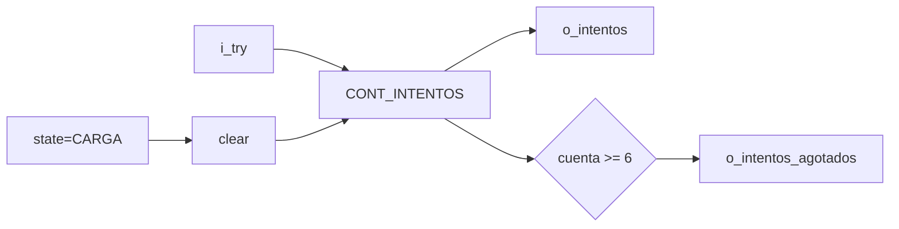

# M12 - Contador de intentos

Archivo RTL de referencia: `src/design/contador_intentos.sv`.

## b) Diagrama modular

## c) Objetivo del módulo

Contar fallos nuevos de la partida y detectar la sexta letra incorrecta.

## d) Entradas

- `clk`, `rst`.
    - `i_try`: pulso de fallo desde M07.
    - `i_state[2:0]`.

## e) Salidas

- `o_intentos[2:0]`: fallos acumulados.
    - `o_intentos_agotados`.

## f) Explicación de la relación con otros módulos

M07 genera `i_try` únicamente para fallos nuevos. M12 envía el valor acumulado a M04/M11 y
    la bandera de seis fallos a M13.

## g) Explicación de funcionamiento

La cuenta se limpia con reset o durante `CARGA`, incrementa con `i_try` y satura en
    `MAX_INTENTOS=6`.

## h) Diseño

`o_intentos_agotados` usa comparación `>=6` como protección adicional aunque el contador ya
    está saturado.

## i) Diagrama esquemático detallado

El diagrama de b) representa también el datapath principal de la implementación. Para módulos con
FSM interna se incluye la secuencia de estados dentro de la explicación de funcionamiento.
