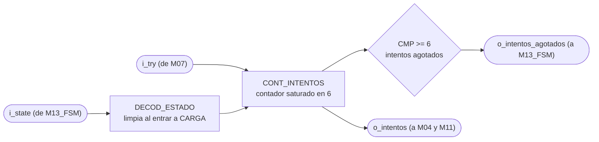
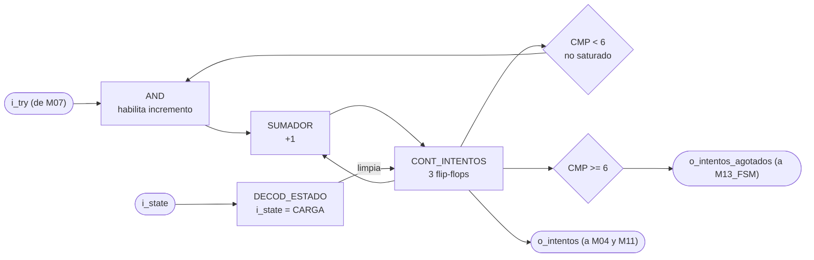

# M12 - Contador de intentos

## a) Nombre del módulo

M12_Contador-Intentos

## b) Diagrama modular

## c) Objetivo del módulo

Lleva la cuenta de letras incorrectas de la partida en curso y avisa cuando se alcanzaron las seis
que el enunciado fija como máximo. Es la condición de derrota por intentos.

---

## d) Entradas

- `clk`, `rst`.
- `i_try`, pulso de intento fallido, desde `M07_Comparador-letra`.
- `i_state[2:0]`, estado actual, desde `M13_FSM`. De acá solo le interesa CARGA.

El módulo está parametrizado con `MAX_INTENTOS = 6`, el máximo que fija el enunciado.

---

## e) Salidas

- `o_intentos[$clog2(MAX_INTENTOS+1)-1:0]`, fallos acumulados de la partida, hacia
  `M04_Mostrar-LCD` y `M11_Transmisor-UART`.
- `o_intentos_agotados`, bandera de seis fallos alcanzados, hacia `M13_FSM`.

---

## f) Relación con otros módulos

`M07_Comparador-letra` es el único que lo incrementa, y solo pulsa `i_try` cuando la letra fue un
fallo real. Una letra acertada no pulsa, y una letra repetida tampoco, así que este módulo no
necesita saber nada de aciertos ni de repeticiones, le llega el evento ya filtrado.

`M13_FSM` recibe `o_intentos_agotados` y es quien decide terminar la partida. Este módulo no decide
nada del flujo, solo reporta que llegó al límite.

`M11_Transmisor-UART` recibe la cuenta y la usa para dos cosas. La primera es mandarla tal cual en
la trama de letra. El enunciado pide reportar los intentos fallidos restantes y lo que viaja son los
acumulados, así que la resta `6 - intentos` la hace la app de PC al pintar la pantalla, ver
`APP_PC.md`. Se dejó así para no meterle un restador a la FPGA cuando el valor que de verdad
importa adentro es el acumulado.

La segunda es decidir la causa de una derrota. `M13_FSM` junta la derrota por intentos y la derrota
por tiempo en un solo estado PERDIO, y `M11_Transmisor-UART` mira si la cuenta llegó a 6 en el
ciclo en que el sistema entra a ese estado. Eso le pone una condición a este módulo, la cuenta
tiene que seguir intacta durante PERDIO. Hoy se cumple porque solo se limpia en CARGA. Si algún día
se cambiara para limpiar al salir de JUEGO, la trama de fin diría siempre que se perdió por tiempo.

`M04_Mostrar-LCD` también recibe la cuenta, y en la pantalla de juego la muestra como intentos
restantes en el sufijo ` I:n`. Allá tampoco hay restador, el dígito sale de una tabla directa sobre
los fallos acumulados. Cuando la cuenta cambia, ese módulo lo nota comparando contra su última foto
y repinta solo, así que acá no hace falta ningún aviso aparte.

De `M13_FSM` recibe `i_state`, y lo usa solo para limpiar la cuenta al entrar a CARGA, o sea al
arrancar cada partida nueva.

---

## g) Explicación de funcionamiento

El contador arranca en cero y se limpia cada vez que el sistema pasa por CARGA, que es el estado
en que se escoge la palabra de la partida nueva. No hace falta una señal de limpieza dedicada
desde la FSM, el paso por ese estado ya es la señal.

Durante la partida, cada pulso `i_try` suma uno. Al llegar a seis se levanta `o_intentos_agotados`
y la FSM se lleva el sistema a PERDIO. El contador se satura ahí, no sigue contando ni da la vuelta
a cero, aunque en la práctica no debería recibir más pulsos porque la partida ya terminó y
`M10_Receptor-UART` deja de aceptar letras al salir de JUEGO.

`rst` lo devuelve a cero igual que la limpieza por estado, lo que hace que BTN_RST deje la cuenta
en un estado consistente sin importar en qué momento de la partida se presione.

---

## h) Diseño

### Ancho del contador

La cuenta va de 0 a 6, así que necesita tres bits:

$$
ancho = \lceil \log_2(6+1) \rceil = 3
$$

El ancho se calcula con `$clog2(MAX_INTENTOS+1)` directo en la declaración del puerto, siguiendo la
convención del proyecto, con el máximo de intentos como parámetro del módulo en vez de un seis fijo
en la lógica. Así el valor sale del mismo lugar en el que está documentado, y probar la partida con
tres intentos en simulación no obliga a tocar la descripción.

### Contador

Tabla de verdad del contador, en orden de prioridad descendente, que es el mismo orden de los
`if / else if / else` de la implementación:

| Condición                             | `cuenta'`     |
| ------------------------------------- | ------------- |
| `rst = 1`                             | `000`         |
| `i_state = CARGA`                     | `000`         |
| `i_try = 1` y `cuenta < MAX_INTENTOS` | `cuenta + 1`  |
| resto                                 | `cuenta`      |

La condición `cuenta < MAX_INTENTOS` de la tercera fila es la que satura el contador. Sin ella, un
pulso extra lo llevaría a 7 y el siguiente lo devolvería a 0, apagando `o_intentos_agotados` justo
después de haberlo levantado.

El reset gana sobre la limpieza por estado, y las dos ganan sobre el incremento. Ese orden importa
para el caso en que llegue un `i_try` en el mismo ciclo en que el sistema entra a CARGA, donde la
cuenta tiene que quedar en cero y no en uno.

### Bandera de agotados

$$
o\_intentos\_agotados = (cuenta \geq MAX\_INTENTOS)
$$

| `cuenta`        | `o_intentos_agotados` | Situación |
| --------------- | --------------------- | --------- |
| `000`           | `0`                   | partida recién empezada, seis intentos disponibles |
| `001` a `101`   | `0`                   | quedan intentos |
| `110`           | `1`                   | seis fallos, derrota por intentos |
| `111`           | `1`                   | no alcanzable, el contador satura en `110` |

La bandera es combinacional a partir del registro, no un registro aparte. Así se levanta en el
mismo ciclo en que el contador llega a seis, sin un ciclo de atraso que dejaría entrar una letra
más antes de que la FSM reaccione.

La fila `111` se documenta por completitud de la tabla. Con la saturación del contador ese valor
no se alcanza, y de todas formas la comparación por mayor o igual lo dejaría del lado correcto.
Por eso se usa `>=` y no `==`, si algún día se rompe la saturación la bandera no vuelve a bajar.

---

## i) Diagrama esquemático detallado del diseño

`clk` y `rst` entran a `CONT_INTENTOS` aunque no se dibujen, por el mismo criterio del resto de
los diagramas del proyecto.

---

## j) Diagrama completo de conexiones del diseño

Ningún puerto de este módulo sale de la FPGA, así que no le corresponde ninguna línea del
`basys3.xdc`. Conexiones en `src/design/top.sv`, instancia `u_contador_intentos`:

- `clk`, al reloj global de 100 MHz, pin W5.
- `rst`, a la entrada `rst` del top, el botón central en el pin U18.
- `i_try`, desde `o_try` de `M07_Comparador-letra`.
- `i_state`, desde `M13_FSM`.
- `o_intentos_agotados`, hacia `M13_FSM`.
- `o_intentos`, hacia `i_intentos` de `M04_Mostrar-LCD` y de `M11_Transmisor-UART`.

Como en los demás módulos, el diagrama de conexiones por chips que pide el método corresponde a un
montaje con integrados discretos, y en este diseño la traducción es la lista de puertos del
instanciado. Falta confirmarlo con el profesor.
