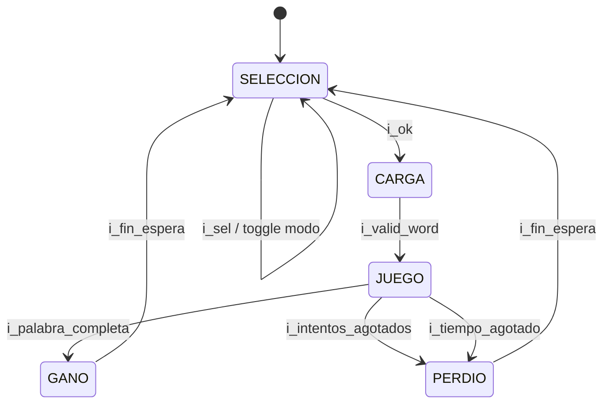

# M13 - FSM principal

Archivo RTL de referencia: `src/design/fsm.sv`.

## b) Diagrama modular

## c) Objetivo del módulo

Mantener el estado global de la partida y el modo seleccionado. La FSM coordina por estado,
    no por una colección de pulsos individuales hacia cada módulo.

## d) Entradas

- `clk`, `rst`.
    - `i_sel`, `i_ok`.
    - `i_valid_word`.
    - `i_palabra_completa`.
    - `i_intentos_agotados`.
    - `i_tiempo_agotado`.
    - `i_fin_espera`.

## e) Salidas

- `o_state[2:0]`.
    - `o_modo`: 0 fácil, 1 difícil.

## f) Explicación de la relación con otros módulos

M09 entrega botones; M08 indica palabra lista; M07 indica palabra completa; M12 indica sexto
    fallo; M03 indica tiempo agotado y fin de espera. Los consumidores de `state` decodifican de
    forma local lo que deben hacer.

## g) Explicación de funcionamiento

Transiciones:

    - SELECCION (`000`) -> CARGA (`001`) con `i_ok`.
    - CARGA -> JUEGO (`010`) con `i_valid_word`.
    - JUEGO -> GANO (`011`) con `i_palabra_completa`.
    - JUEGO -> PERDIO (`100`) con `i_intentos_agotados` o `i_tiempo_agotado`.
    - GANO/PERDIO -> SELECCION con `i_fin_espera`.

    En JUEGO la prioridad es palabra completa, luego intentos agotados y finalmente tiempo agotado.

    `i_sel` no cambia el estado; conmuta `modo` solo mientras el estado actual es SELECCION.

## h) Diseño

El registro de estado usa tres bits aunque solo cinco códigos son válidos. `101`, `110` y
    `111` caen a SELECCION por la rama `default`.

    La FSM no conserva la causa de derrota. M11 determina la causa para el protocolo UART a partir
    del contador de intentos al entrar a PERDIO.

## i) Diagrama esquemático detallado

El diagrama de b) representa también el datapath principal de la implementación. Para módulos con
FSM interna se incluye la secuencia de estados dentro de la explicación de funcionamiento.
