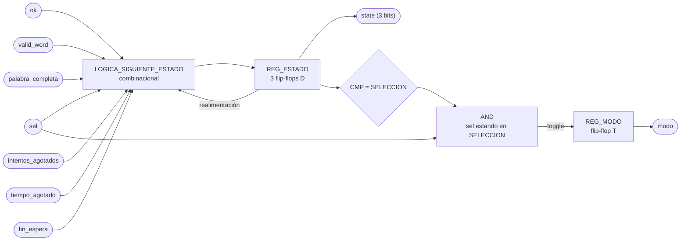

# M13 - FSM

Los puntos a) a d) de este módulo están en `docs/diseño/diagramas/nivel03.md`, junto con el
diagrama de estados que hace las veces de diagrama modular. Este documento arranca en la e).

## e) Salidas

- `state`, estado actual del sistema en 3 bits, hacia M02_Generador-Tono, M03_Temporizador,
  M04_Mostrar-LCD, M05_Estado, M06_Ganadas, M07_Comparador-letra, M08_LFSR, M10_Receptor-UART,
  M11_Transmisor-UART, M12_Contador-Intentos y REG_Letra-in.
- `modo`, dificultad seleccionada, 0 para FACIL y 1 para DIFICIL, hacia M03_Temporizador,
  M04_Mostrar-LCD, M08_LFSR y M11_Transmisor-UART.

Son las únicas dos salidas del módulo, cuatro bits en total. No hay señales de `start`, `show`,
`choose`, `count` ni `load` porque la FSM no le ordena nada puntual a ningún módulo.

## f) Explicación de la relación con otros módulos

Le entregan eventos a la FSM:

- M09_Botones, con `sel` y `ok` ya filtrados de rebote.
- M08_LFSR, con `valid_word` cuando la palabra de la partida quedó lista en REG_Palabra-escogida.
- M07_Comparador-letra, con `palabra_completa` cuando su máscara de posiciones reveladas se llenó.
- M12_Contador-Intentos, con `intentos_agotados` cuando el contador llegó a seis fallos.
- M03_Temporizador, con `tiempo_agotado` durante la partida y con `fin_espera` cuando ya pasaron
  los 3 s mínimos mostrando el resultado.

Consumen `state` los once bloques listados en la e). Cada uno decodifica los estados que le
importan e ignora el resto. M05_Estado lo traduce al LED, M03_Temporizador lo usa para arrancar y
detener la cuenta, M08_LFSR muestrea al entrar a CARGA, M06_Ganadas incrementa al entrar a GANO,
M04_Mostrar-LCD elige cuál de las tres pantallas pinta, M11_Transmisor-UART decide cuál trama
manda, y REG_Letra-in y M10_Receptor-UART lo usan para descartar letras fuera de partida.

Consumen `modo` los cuatro que necesitan saber la dificultad, M03_Temporizador para cargar 60 s o
45 s, M08_LFSR para acotar el rango de palabras, y M04_Mostrar-LCD y M11_Transmisor-UART para
reportarla.

La FSM no toca el bus de 32 bits. No le escribe al PERIFERICO_LCD ni al PERIFERICO_UART, de eso se
encargan M04, M10 y M11 dentro de CONTROL_JUEGO. Por eso la FSM tampoco conoce los bits `busy` y
`done` del LCD, ni el `send` ni el `new_rx` del UART.

Esta es la parte que más cambió respecto al primer planteamiento. Antes la FSM tenía una salida
por cada cosa que quería que pasara, y agregar un módulo significaba agregarle un puerto y meterle
otra rama a su lógica. Ahora la FSM queda fija y el módulo nuevo se cuelga del `state` que ya se
difunde, sin tocar este archivo. El costo es que la codificación de `state` pasa a ser un contrato
público, si se cambia un código hay que revisar los once decodificadores.

## g) Explicación de funcionamiento

El sistema arranca en SELECCION después del reset. Ahí el LCD muestra la pantalla de selección de
dificultad y cada pulso `sel` de BTN_SEL conmuta `modo` entre FACIL y DIFICIL, sin salir del
estado. El pulso `ok` de BTN_OK es el que confirma y pasa a CARGA. Mientras se está en SELECCION
cualquier byte que llegue por UART se descarta en M10_Receptor-UART, así que la FSM ni se entera.

En CARGA la FSM solo espera. M08_LFSR ve que el estado cambió, muestrea su registro de
desplazamiento, escoge una palabra del banco acorde al `modo` y la deja en REG_Palabra-escogida.
Cuando levanta `valid_word` la FSM pasa a JUEGO. M07_Comparador-letra y M12_Contador-Intentos
aprovechan el paso por CARGA para limpiar la máscara de letras reveladas y el contador de fallos
de la partida anterior.

JUEGO es donde se juega la partida completa y donde la FSM hace menos. El temporizador corre, las
letras entran por UART, M07 las compara, M12 cuenta los fallos, M04 repinta el LCD y M11 le
reporta a la PC, todo sin intervención de la FSM. Ella solo vigila tres señales, `palabra_completa`
para ganar, `intentos_agotados` para perder por fallos, y `tiempo_agotado` para perder por tiempo.

Los tres estados de fin funcionan igual entre sí. Se mantienen mientras M03_Temporizador cuenta los
3 s que el enunciado exige que el resultado quede en pantalla, y cuando llega `fin_espera` la FSM
vuelve sola a SELECCION para la siguiente partida. Están separados en GANO, PERDIO_INTENTOS y
PERDIO_TIEMPO porque el resultado y su causa tienen que salir por UART y por LCD, y teniéndolos
como estados distintos esa información viaja en el mismo `state` que ya se difunde.

BTN_RST es un reset físico que llega sincronizado a todos los módulos por igual. Devuelve la FSM a
SELECCION desde cualquier estado, y en el mismo golpe M06_Ganadas pone su contador acumulado en
cero, que es lo que pide el enunciado. La FSM no manda ninguna señal para que eso pase.

## h) Diseño

### Codificación de estados

Seis estados, tres bits, codificación binaria:

- `000` SELECCION
- `001` CARGA
- `010` JUEGO
- `011` GANO
- `100` PERDIO_INTENTOS
- `101` PERDIO_TIEMPO

Se descartó one-hot aunque sea lo típico para FSM en FPGA. Con one-hot cada módulo decodificaría
con una sola comparación de bit, que es más barato, pero `state` sale del módulo como puerto hacia
once bloques, y seis líneas contra tres duplican el ruteo de una señal que ya es la más difundida
del diseño. Además, al ser puerto, Vivado no puede recodificar el registro por su cuenta, así que
la codificación queda fija de todas formas y conviene que sea la compacta.

Los códigos `110` y `111` no se usan. El `default` de la lógica combinacional los manda a
SELECCION, tanto para no dejar estados colgados como para que no se infiera un latch.

### Tabla de transiciones

El orden de las filas dentro de cada estado es el orden de prioridad, y es el mismo orden en que
van los `if / else if / else` de la implementación:

| Estado actual | Condición | Estado siguiente | Efecto |
|---|---|---|---|
| SELECCION `000` | `ok` | CARGA `001` | |
| SELECCION `000` | `sel` | SELECCION `000` | conmuta `modo` |
| SELECCION `000` | ninguna | SELECCION `000` | |
| CARGA `001` | `valid_word` | JUEGO `010` | |
| CARGA `001` | ninguna | CARGA `001` | |
| JUEGO `010` | `palabra_completa` | GANO `011` | |
| JUEGO `010` | `intentos_agotados` | PERDIO_INTENTOS `100` | |
| JUEGO `010` | `tiempo_agotado` | PERDIO_TIEMPO `101` | |
| JUEGO `010` | ninguna | JUEGO `010` | |
| GANO `011` | `fin_espera` | SELECCION `000` | |
| GANO `011` | ninguna | GANO `011` | |
| PERDIO_INTENTOS `100` | `fin_espera` | SELECCION `000` | |
| PERDIO_INTENTOS `100` | ninguna | PERDIO_INTENTOS `100` | |
| PERDIO_TIEMPO `101` | `fin_espera` | SELECCION `000` | |
| PERDIO_TIEMPO `101` | ninguna | PERDIO_TIEMPO `101` | |
| `110`, `111` | cualquiera | SELECCION `000` | estados no usados |

### Registro de modo

`modo` es el otro elemento de memoria del módulo, un solo bit que vive aparte del registro de
estado. Las transiciones no lo tocan, lo mueve únicamente BTN_SEL:

| Condición (prioridad descendente) | `modo'`  |
| --------------------------------- | -------- |
| `rst = 1`                         | `0`      |
| `state = SELECCION` y `sel = 1`   | `NOT modo` |
| resto                             | `modo`   |

La segunda fila es la que congela la dificultad durante la partida. Fuera de SELECCION el pulso
`sel` no hace nada, así que un botonazo accidental a media partida no puede cambiarle el
temporizador ni el banco de palabras a una partida ya empezada.

Significado del bit y valores que dispara en los otros módulos:

| `modo` | Dificultad | Palabras del banco        | Tiempo de partida |
| ------ | ---------- | ------------------------- | ----------------- |
| `0`    | FACIL      | cualquiera, 4 a 12 letras | 60 s              |
| `1`    | DIFICIL    | solo de 6 letras o más    | 45 s              |

Los tiempos son los sugeridos por el enunciado y se mantienen tal cual. La relación que sí es
obligatoria es que difícil tenga menos tiempo que fácil, y 45 contra 60 la cumple. La
justificación de los valores concretos es que en modo difícil la palabra es más larga, entre 6 y
12 letras, así que hay más posiciones que descubrir con menos tiempo, y ahí está la dificultad
real del modo, no solo en el reloj.

Después del reset el sistema arranca en FACIL, que es el modo que se muestra primero en el LCD.

### Prioridades y casos de borde

En SELECCION, `ok` va antes que `sel` por si alguien presiona los dos botones en el mismo ciclo.
Confirmar es la acción destructiva de las dos, y dejarla de última haría que un `sel` simultáneo
cambiara la dificultad justo en el ciclo en que se confirma, arrancando la partida con un modo
distinto al que el jugador vio en el LCD.

En JUEGO la victoria va de primera. `palabra_completa` y `tiempo_agotado` sí pueden coincidir en un
mismo ciclo, si la última letra completa la palabra justo cuando la cuenta llega a cero, y ahí gana
el jugador. `palabra_completa` e `intentos_agotados` no pueden coincidir, porque una letra
incorrecta nunca revela una posición nueva, así que ese orden entre las dos no cambia nada en la
práctica y se deja documentado por completitud.

Entre las dos derrotas manda `intentos_agotados`. El enunciado dice que a la sexta letra incorrecta
la partida se pierde sin importar el tiempo restante, y respetar ese orden hace que la causa
reportada por UART sea la de intentos cuando ambas ocurren juntas.

### Por qué la FSM no espera al LCD ni al UART

La FSM cambia de estado sin consultar el `busy` del periférico LCD ni si M11_Transmisor-UART
terminó de mandar la trama anterior. Eso es intencional. El LCD es lento en escala de
milisegundos, y si la FSM se bloqueara esperándolo, una letra que llegue durante el repintado se
perdería, o habría que meterle una cola a la FSM y volverla el bloque más complicado del diseño.

Lo que hace M04_Mostrar-LCD es repintar la pantalla que corresponde al `state` que ve en el
momento en que el LCD queda libre. Si un estado corto pasa antes de que alcance a refrescar,
simplemente pinta el siguiente, y como cada pantalla se compone completa desde el estado actual,
nunca queda una mezcla de dos pantallas. El único estado que puede pasar más rápido que un
refresco del LCD es CARGA, y no tiene pantalla propia.

M11_Transmisor-UART sí ve todos los estados, porque muestrea a 100 MHz y el estado más corto dura
al menos un ciclo.

### Duración de los estados de resultado

Los 3 s los cuenta M03_Temporizador y no la FSM. Meter un contador de segundos adentro de la FSM
obligaría a duplicar el prescalador de 100 MHz a 1 Hz que M03 ya tiene, y dejaría la FSM con lógica
de tiempo real, que es justo lo que se quiere sacar de ella. M03 decodifica que `state` está en uno
de los tres estados de fin, cuenta, y levanta `fin_espera`.

### Estructura de la implementación

Dos bloques y nada más. Un `always_ff @(posedge clk)` con el registro de estado y el registro de
`modo`, y un `always_comb` con la lógica de siguiente estado, que asigna `estado_siguiente =
estado_actual` como valor por defecto antes del `case` para que no se infiera ningún latch.

La salida `state` es el propio registro de estado, sin lógica de decodificación de por medio. Es
una máquina de Moore en el sentido más literal, la salida es el estado. `modo` es un registro
aparte de un bit que solo conmuta con `sel` estando en SELECCION, y se congela durante el resto de
la partida para que nadie pueda cambiar la dificultad a medio juego.

Los anchos van con `localparam` y `$clog2`, siguiendo la convención del resto del proyecto, aunque
acá el ancho de estado es fijo en 3 bits por el contrato de codificación.

## i) Diagrama esquemático detallado del diseño

Misma notación de la leyenda de `nivel03.md`, óvalo para puerto externo, rectángulo para registro,
rombo para comparador, y rectángulo etiquetado para lógica combinacional.

`clk` y `rst` entran a los dos registros aunque no se dibujen, por el mismo criterio del resto de
los diagramas del proyecto.

Del diagrama se lee que no hay lógica entre `REG_ESTADO` y la salida `state`, el registro es la
salida. Toda la combinacional del módulo está en `LOGICA_SIGUIENTE_ESTADO`, que son tres funciones
booleanas de diez variables (tres de estado actual y siete de evento), y en la compuerta que
habilita el conmutado de `modo`.

Sobre el nivel de detalle que pide el método, un esquemático por compuertas dibujado a mano acá no
aporta nada. Esas tres funciones las sintetiza Vivado con un puñado de LUT, y el número exacto
depende de la optimización, no del dibujo. El equivalente honesto es el esquemático
post-síntesis que genera la herramienta, y esa captura es la que va como evidencia en el informe.
Queda pendiente confirmarle al profesor que ese reemplazo es aceptable, es la misma duda que
aplica a los doce módulos anteriores.

## j) Diagrama completo de conexiones del diseño

Ningún puerto de este módulo sale de la FPGA, así que no le corresponde ninguna línea del
`basys3.xdc`. Sus conexiones son las del instanciado dentro de CONTROL_JUEGO:

- `clk`, al reloj global de 100 MHz de la tarjeta.
- `rst`, a BTN_RST ya sincronizado, el mismo que llega a todos los demás módulos.
- `sel`, `ok`, desde M09_Botones.
- `valid_word`, desde M08_LFSR.
- `palabra_completa`, desde M07_Comparador-letra.
- `intentos_agotados`, desde M12_Contador-Intentos.
- `tiempo_agotado`, `fin_espera`, desde M03_Temporizador.
- `state`, hacia M02, M03, M04, M05, M06, M07, M08, M10, M11, M12 y REG_Letra-in.
- `modo`, hacia M03, M04, M08 y M11.

Las señales que sí cruzan al mundo físico pertenecen a los módulos del borde, los botones en
M09_Botones, los displays en M01_Marcador, el LED en M05_Estado, el buzzer en M02_Generador-Tono,
y los dos periféricos de bus con el PmodCLP y el puente USB-UART. Cada una está documentada en el
módulo que la maneja.

Acá el punto j) del método de diseño modular pide un diagrama de conexiones eléctricas por chips,
que está pensado para un montaje con circuitos integrados discretos en protoboard. En un diseño
que se sintetiza completo dentro de una sola Artix-7 no hay chips que alambrar, y la lista de
arriba es la traducción razonable. Es la otra mitad de la consulta pendiente con el profesor.
