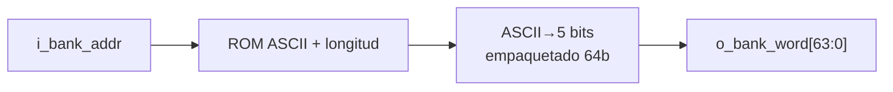

# M14 - Banco de palabras

Archivo RTL de referencia: `src/design/banco_palabras.sv`.

## b) Diagrama modular

## c) Objetivo del módulo

Almacenar 50 palabras constantes y entregar de forma combinacional la palabra asociada a la
    dirección solicitada por M08, en el formato compacto usado por el juego.

## d) Entradas

- `i_bank_addr[5:0]`: dirección 1–50.

## e) Salidas

- `o_bank_word[63:0]`: `{longitud[3:0], letra12[4:0], ..., letra1[4:0]}`.

## f) Explicación de la relación con otros módulos

M08 genera la dirección y consume la palabra empacada. Las direcciones 1–32 contienen
    palabras de seis o más letras y sirven para ambos modos. Las direcciones 33–50 contienen
    palabras de cuatro o cinco letras y se usan en fácil.

## g) Explicación de funcionamiento

La ROM conserva las palabras como ASCII y su longitud. Una función convierte cada carácter
    `A..Z` a código 0..25 y otra empaqueta el resultado. `rom_word` se genera con índice constante
    para que síntesis pueda plegar la conversión a constantes.

## h) Diseño

Parámetros por defecto: `N_PALABRAS=50`, `WORD_MAXLEN=12`, `LETRA_WIDTH=5`.

    Rango difícil: direcciones 1–32.
    Rango adicional de fácil: 33–50.

## i) Diagrama esquemático detallado

El diagrama de b) representa también el datapath principal de la implementación. Para módulos con
FSM interna se incluye la secuencia de estados dentro de la explicación de funcionamiento.
