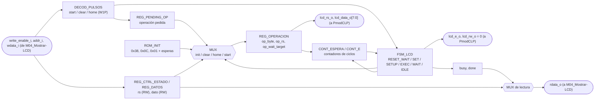
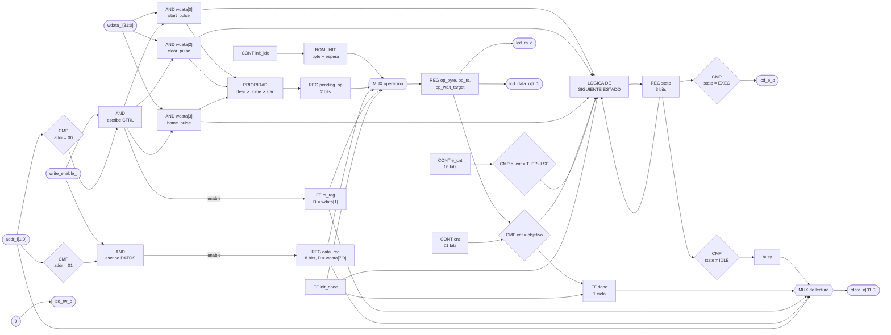

# PERIFERICO_LCD

## a) Nombre del módulo

PERIFERICO_LCD

## b) Diagrama modular



## c) Objetivo del módulo

Envuelve el manejo del LCD de caracteres PmodCLP en la interfaz estándar de periférico de 32 bits
que fija la sección 3.4.3 del enunciado. Expone dos registros y es el único bloque del diseño que
toca los pines físicos del LCD.

El PmodCLP es una pantalla de 2 filas por 16 caracteres controlada por un Samsung KS0066,
compatible con el HD44780. El controlador recibe un byte en paralelo más las líneas `RS`, `R/W` y
`E`, y es lento: necesita microsegundos para escribir un carácter y milisegundos para borrar la
pantalla. Además, al encenderse hay que configurarlo con una secuencia de comandos fija antes de
poder escribir nada.

Este periférico absorbe todo eso: la inicialización al arranque, la secuencia de setup y pulso
de `E` de cada escritura, y las esperas posteriores. No sabe nada del juego. Recibe "mandá este
byte como dato", "mandá este byte como comando", "borrá" o "cursor al inicio", y avisa con `busy`
y `done` cuándo puede aceptar la siguiente orden.

---

## d) Entradas

- `clk_i`: reloj del sistema.
- `rst_i`: reset síncrono, activo en alto.
- `write_enable_i`: habilitación de escritura del bus, desde `M04_Mostrar-LCD`.
- `addr_i[1:0]`: dirección del registro, desde `M04_Mostrar-LCD`.
- `wdata_i[31:0]`: dato a escribir, desde `M04_Mostrar-LCD`.

Los puertos llevan sufijo `_i`/`_o` en vez del prefijo `i_`/`o_` del resto del repo, porque la
sección 3.4.3 los nombra así y la interfaz es de cumplimiento obligatorio.

El módulo está parametrizado con `CLK_FREQ_HZ = 100_000_000`. Todos los tiempos internos se
calculan a partir de ese valor, así que `tb_periferico_lcd` lo baja a 1 MHz para que la espera de
encendido no tarde una eternidad en simulación.

---

## e) Salidas

- `rdata_o[31:0]`: contenido del registro apuntado por `addr_i`, hacia `M04_Mostrar-LCD`.
- `lcd_rs_o`: `RS` del PmodCLP, 0 para comando y 1 para dato.
- `lcd_rw_o`: `R/W` del PmodCLP, fijo en 0 (solo escritura).
- `lcd_e_o`: `E` del PmodCLP, el LCD captura el byte en su flanco de bajada.
- `lcd_data_o[7:0]`: `DB7`–`DB0` del PmodCLP.

---

## f) Relación con otros módulos

Hacia adentro del sistema habla con un solo bloque, `M04_Mostrar-LCD`, que es el único maestro de
su bus. A diferencia del UART no hace falta árbitro, porque ningún otro módulo del juego escribe
en el LCD.

La división de trabajo es:

- `M04_Mostrar-LCD` decide **qué** mostrar: qué pantalla toca, qué carácter va en cada posición y
  en qué orden. No conoce pines ni tiempos del LCD.
- `PERIFERICO_LCD` decide **cómo** mandarlo: la inicialización, el orden de `RS`, datos y `E`, y
  cuánto esperar después de cada operación. No conoce estados del juego.

El contrato entre los dos es el mapa de registros de la h) más una regla: el maestro no pide una
operación nueva hasta ver `done=1` (o `busy=0`). `M04_Mostrar-LCD` la respeta esperando `done`
después de cada comando y cada carácter, y esperando `busy=0` antes de su primer envío, mientras
corre la inicialización.

Hacia afuera es el único módulo conectado al PmodCLP.

---

## g) Explicación de funcionamiento

### Cómo se le escribe al LCD

Cada escritura al controlador sigue la misma secuencia:

1. Se ponen `RS` y el byte en los pines con `E=0`, y se dejan estables un tiempo mínimo de setup.
2. Se sube `E` y se mantiene en alto un ancho mínimo.
3. Se baja `E`. En ese flanco de bajada el controlador captura `RS` y el byte.
4. Se espera a que el controlador procese la instrucción. Mientras tanto `RS` y el byte siguen
   quietos, así que el tiempo de hold también se cumple.

```
RS, DB  ‾‾‾X═══════════ valor estable ═════════════════
E       ___________/‾‾‾‾‾‾‾‾‾‾\________________________
           | setup |  ancho E  |      espera de la instrucción
                               ↑ el LCD captura aquí
```

El controlador tiene una bandera de ocupado que se puede leer con `R/W=1`, pero eso obliga a que
las líneas de datos sean bidireccionales. Este periférico nunca lee (`lcd_rw_o = 0`) y en su
lugar espera un tiempo fijo con margen después de cada operación. Es más simple y cumple lo que
pide el enunciado, que no se asuman escrituras instantáneas.

### Arranque

Después del reset el periférico ejecuta solo la secuencia de inicialización del manual del
PmodCLP, con `busy=1` todo el tiempo:

1. Espera 20 ms a que el LCD arranque.
2. `0x38`, Function Set: bus de 8 bits, 2 líneas, fuente 5×8.
3. `0x0C`, Display On/Off: pantalla encendida, sin cursor y sin parpadeo.
4. `0x01`, Clear Display: pantalla en blanco y cursor en la posición 0.

Después del Clear Display la FSM da una pasada más antes de quedar en reposo: manda un cuarto
pulso de `E` con el byte `0x00` y `rs=0`, y al terminar genera un pulso de `done` a la vez que
baja `busy`. Es un efecto de cómo se actualiza `init_done` (ver h, "Fin de la inicialización").
`0x00` no activa ninguna instrucción del controlador, y `M04_Mostrar-LCD` todavía no está
esperando `done` en ese momento, así que no tiene efecto visible. En la placa no causa
problemas.

El manual agrega un Entry Mode Set al final de la secuencia. No se manda porque el reset interno
del controlador ya deja el cursor avanzando a la derecha sin desplazar la pantalla, que es lo que
necesita el juego.

### Operación normal

En reposo el periférico atiende tres órdenes que llegan como bits W1P del registro de control:

- `start`: manda el byte de `REG_DATOS` con el `rs` que haya en el registro de control. Con
  `rs=1` es un carácter; con `rs=0` es un comando cualquiera del LCD. Por ejemplo, `0xC0` lleva el
  cursor al inicio de la segunda fila, aunque el juego no lo usa.
- `clear`: manda `0x01`.
- `home`: manda `0x02`.

Para escribir un carácter el maestro necesita dos escrituras de bus en ciclos distintos, porque
son dos direcciones:

| Ciclo | Maestro | Periférico |
|---|---|---|
| A | `addr=01`, `wdata=0x4D` ("M") | `data_reg ← 0x4D` |
| B | `addr=00`, `wdata=0x3` (`start` y `rs`) | ve `start`, `rs_reg ← 1`, guarda la orden |
| C… | espera leyendo `addr=00` | setup, pulso `E`, espera de 120 µs, con `busy=1` |
| fin | lee `done=1` | vuelve a reposo, `busy=0` |

Una orden que llega con `busy=1` se ignora sin aviso. Por eso el maestro tiene que esperar.

---

## h) Diseño

### Mapa de registros

| `addr_i` | Registro | Bit(s) | Nombre | Tipo | Descripción |
|---|---|---|---|---|---|
| `00` | CONTROL/ESTADO | 0 | `start` | W1P | Manda `REG_DATOS` al LCD con el `rs` actual |
| `00` | CONTROL/ESTADO | 1 | `rs` | RW | 0 comando, 1 dato |
| `00` | CONTROL/ESTADO | 2 | `clear` | W1P | Manda Clear Display (`0x01`) |
| `00` | CONTROL/ESTADO | 3 | `home` | W1P | Manda Return Home (`0x02`) |
| `00` | CONTROL/ESTADO | 8 | `busy` | RO | 1 mientras no esté en reposo |
| `00` | CONTROL/ESTADO | 9 | `done` | RO | Pulso de un ciclo al terminar una operación pedida |
| `01` | DATOS | 7:0 | `dato` | RW | Carácter ASCII o código de instrucción |
| `10`, `11` | — | — | — | — | No se usan, leen `0` |

Los bits no listados escriben sin efecto y leen `0`, incluidos los reservados `[31:16]` del
registro de control y `[31:8]` del de datos.

W1P (*write-one-to-pulse*) significa que escribir un 1 dispara la acción pero el bit no se guarda:
el pulso existe solo en el ciclo de la escritura. `rs` se guarda en cada escritura a la dirección
`00`, así que escribir `clear` o `home` también deja `rs=0`, lo cual no afecta a esas operaciones.

La lectura es combinacional:

```
addr_i = 00  →  rdata_o = {22'b0, done, busy, 6'b0, rs, 1'b0}
addr_i = 01  →  rdata_o = {24'b0, dato}
otro         →  rdata_o = 32'b0
```

Justo después del reset la lectura de `00` da `0x00000100`, con `busy=1`.

### Máquina de estados

Seis estados, declarados con `typedef enum logic [2:0]`, con reset a `S_RESET_WAIT`:

| Estado | Qué hace | `E` | `busy` |
|---|---|---|---|
| `S_RESET_WAIT` | Cuenta 20 ms después del reset | 0 | 1 |
| `S_SET` | Carga `op_byte`, `op_rs` y `op_wait_target`; limpia contadores | 0 | 1 |
| `S_SETUP` | Mantiene `RS` y datos estables antes de subir `E` | 0 | 1 |
| `S_EXEC` | Pulso de `E` | 1 | 1 |
| `S_WAIT` | Espera a que el LCD procese | 0 | 1 |
| `S_IDLE` | Reposo, atiende órdenes del bus | 0 | 0 |

Tabla de transiciones:

| Estado actual | Condición | Estado siguiente | Efecto |
|---|---|---|---|
| `S_RESET_WAIT` | `cnt = T_20MS_CYC` | `S_SET` | |
| `S_SET` | siempre | `S_SETUP` | carga la operación |
| `S_SETUP` | `cnt = T_SETUP_CYC` | `S_EXEC` | |
| `S_EXEC` | `e_cnt = T_EPULSE_CYC` | `S_WAIT` | |
| `S_WAIT` | `cnt = op_wait_target` y `init_done=0` | `S_SET` | avanza `init_idx`, o pone `init_done ← 1` si `init_idx=2` |
| `S_WAIT` | `cnt = op_wait_target` y `init_done=1` | `S_IDLE` | `done ← 1` por un ciclo |
| `S_IDLE` | `start_pulse + clear_pulse + home_pulse` | `S_SET` | guarda la orden en `pending_op` |
| cualquiera | resto | el mismo | |

### Fin de la inicialización

En el último paso de la tabla (`init_idx=2`, Clear Display) se cumple la espera en `S_WAIT` con
`init_done=0`. La lógica de siguiente estado decide volver a `S_SET`, y en ese mismo flanco el
datapath pone `init_done ← 1`. La pasada siguiente por `S_SET` ya ve `init_done=1` y carga la
operación desde `pending_op`, que después del reset vale `OP_START` con `data_reg=0x00` y
`rs_reg=0`. Resultado, confirmado en simulación:

| Pulso de `E` | Byte | `rs` | `init_done` al cargar |
|---|---|---|---|
| 1 | `0x38` | 0 | 0 |
| 2 | `0x0C` | 0 | 0 |
| 3 | `0x01` | 0 | 0 |
| 4 | `0x00` | 0 | 1 |

Al terminar la espera de 120 µs del cuarto pulso, la FSM pasa a `S_IDLE` y pulsa `done`, igual que
con cualquier operación pedida por el bus. El byte `0x00` con `RS=0` no tiene ningún bit de
instrucción en 1, así que el controlador no hace nada, y el `done` extra llega antes de que
`M04_Mostrar-LCD` haya pedido algo, así que lo ignora. La inicialización dura unos 120 µs más de
lo necesario y no tiene otro efecto.

### Selección de la operación en `S_SET`

| Situación | `op_byte` | `op_rs` | `op_wait_target` |
|---|---|---|---|
| `init_done=0`, `init_idx=0` | `0x38` | 0 | `T_37US_CYC` |
| `init_done=0`, `init_idx=1` | `0x0C` | 0 | `T_37US_CYC` |
| `init_done=0`, `init_idx=2` | `0x01` | 0 | `T_1_52MS_CYC` |
| `init_done=1`, `pending_op=OP_CLEAR` | `0x01` | 0 | `T_1_52MS_CYC` |
| `init_done=1`, `pending_op=OP_HOME` | `0x02` | 0 | `T_1_52MS_CYC` |
| `init_done=1`, `pending_op=OP_START` | `data_reg` | `rs_reg` | `T_40US_CYC` |

La tabla de inicialización está escrita como dos funciones con `case` (`init_byte_f`,
`init_wait_f`) en vez de un arreglo constante, porque Icarus Verilog no soporta un `localparam`
de arreglo sin empacar. En hardware es la misma ROM de tres filas indexada por `init_idx`.

### `pending_op`

`start_pulse`, `clear_pulse` y `home_pulse` son combinacionales y duran un solo ciclo, el de la
escritura. `S_IDLE` los usa para decidir ir a `S_SET`, pero `S_SET` ocurre un ciclo después,
cuando ya valen 0. Por eso en el mismo ciclo de `S_IDLE` se guarda cuál llegó en el registro
`pending_op`, con prioridad `clear > home > start`:

| `clear_pulse` | `home_pulse` | `start_pulse` | `pending_op'` |
|---|---|---|---|
| 1 | X | X | `OP_CLEAR` |
| 0 | 1 | X | `OP_HOME` |
| 0 | 0 | 1 | `OP_START` |
| 0 | 0 | 0 | sin cambio |

`M04_Mostrar-LCD` escribe `clear` y `home` en la misma escritura; por esta prioridad se ejecuta
solo el Clear Display, que de todas formas también deja el cursor en la posición 0.

`rs_reg` y `data_reg` se actualizan al final del ciclo de la escritura, así que en `S_SET` ya
tienen el valor nuevo aunque `rs` y `start` hayan llegado en la misma escritura.

### Tiempos

Todos salen de `CYC_PER_US = CLK_FREQ_HZ / 1_000_000`, que es 100 a 100 MHz. Casi todos se
multiplican por `MARGEN_SEGURIDAD = 3`: con los mínimos del datasheet del KS0066 se perdía el
primer carácter de cada mensaje en la Basys 3 (en simulación no se veía), y con el triple quedó
estable.

| Constante | Mínimo del datasheet | Valor usado | Ciclos a 100 MHz | Duración real del estado |
|---|---|---|---|---|
| `T_20MS_CYC` | 20 ms | 20 ms, sin margen | 2 000 000 | 20 ms |
| `T_SETUP_CYC` | 80 ns (tsu2) | 240 ns | 24 | 25 ciclos, 250 ns |
| `T_EPULSE_CYC` | 230 ns (tw) | 1.5 µs | 150 | 151 ciclos, 1.51 µs |
| `T_37US_CYC` | 37 µs | 111 µs | 11 100 | 11 101 ciclos |
| `T_40US_CYC` | ~40 µs | 120 µs | 12 000 | 12 001 ciclos |
| `T_1_52MS_CYC` | 1.52 ms | 4.56 ms | 456 000 | 456 001 ciclos |

Cada estado dura su constante más un ciclo, porque el contador arranca en 0 y la transición
ocurre en el ciclo en que la iguala. `T_SETUP_CYC` y `T_EPULSE_CYC` tienen un mínimo de 1 ciclo
antes del margen, para que no colapsen a 0 con relojes de simulación más lentos.

`cnt` es de 21 bits (máximo 2 097 151), lo justo para la espera de encendido. `e_cnt` es de 16
bits.

Con esto, a 100 MHz:

- Inicialización completa: unos 25 ms después del reset.
- Un carácter o comando normal: 1 + 25 + 151 + 12 001 ciclos, unos 0.12 ms.
- Clear o home: unos 4.56 ms.
- Una pantalla completa de `M04_Mostrar-LCD` (clear + 16 caracteres): unos 6.5 ms.

### Salidas físicas

```systemverilog
assign lcd_rw_o   = 1'b0;
assign lcd_rs_o   = op_rs;
assign lcd_data_o = op_byte;
assign lcd_e_o    = (state == S_EXEC);
```

`op_rs` y `op_byte` se cargan en `S_SET` y no cambian durante `S_SETUP`, `S_EXEC` ni `S_WAIT`, así
que el setup antes de subir `E` y el hold después de bajarlo quedan garantizados por la propia
secuencia de estados.

### `busy` y `done`

`busy = (state ≠ S_IDLE)`, combinacional. `done` es un registro que se pone en 0 en todos los
ciclos y solo vale 1 en el ciclo siguiente a cumplir la espera de una operación pedida por el bus.
Ese flanco es el mismo en que el estado pasa a `S_IDLE`, así que `done` sube justo en el ciclo en
que `busy` baja, y dura un solo ciclo. Como la lectura depende de `addr_i`, el maestro tiene que
tener `addr_i=00` en ese ciclo para verlo.

### Latches

La lógica de siguiente estado y el decodificador de lectura son `always_comb` con valor por
defecto antes del `case`, así que no queda ninguna salida sin asignar. El registro de estado y el
datapath están en un `always_ff` con reset síncrono.

---

## i) Diagrama esquemático detallado del diseño



`clk_i` y `rst_i` entran a todos los registros, flip-flops y contadores aunque no se dibujen.
Los comparadores de los contadores contra constantes de 21 y 16 bits no se dibujan por compuertas;
en la FPGA son árboles de LUT.

---

## j) Diagrama completo de conexiones del diseño

Este módulo tiene puertos físicos propios, así que lleva restricciones de pin en
`src/fpga/basys3.xdc`, todas con `IOSTANDARD LVCMOS33`:

| Puerto | Pin Basys 3 | Conector | Señal PmodCLP |
|---|---|---|---|
| `lcd_rs_o` | H1 | JA7 | RS (J2-1) |
| `lcd_rw_o` | K2 | JA8 | R/W (J2-2) |
| `lcd_e_o` | H2 | JA9 | E (J2-3) |
| `lcd_data_o[0]` | J3 | JXADC XA1_P | DB0 |
| `lcd_data_o[1]` | L3 | JXADC XA2_P | DB1 |
| `lcd_data_o[2]` | M2 | JXADC XA3_P | DB2 |
| `lcd_data_o[3]` | N2 | JXADC XA4_P | DB3 |
| `lcd_data_o[4]` | K3 | JXADC XA1_N | DB4 |
| `lcd_data_o[5]` | M3 | JXADC XA2_N | DB5 |
| `lcd_data_o[6]` | M1 | JXADC XA3_N | DB6 |
| `lcd_data_o[7]` | N1 | JXADC XA4_N | DB7 |

El PmodCLP rev. B se alimenta a 3.3 V, igual que los bancos de la Basys 3.

Conexiones en `src/design/top.sv`, instancia `u_periferico_lcd`:

- `clk_i`, al reloj global de 100 MHz, pin W5.
- `rst_i`, a la entrada `rst` del top, el botón central en el pin U18.
- `write_enable_i`, `addr_i[1:0]`, `wdata_i[31:0]`, desde `o_write_enable`, `o_addr` y `o_wdata`
  de `M04_Mostrar-LCD`.
- `rdata_o[31:0]`, hacia `i_rdata` de `M04_Mostrar-LCD`.
- `lcd_rs_o`, `lcd_rw_o`, `lcd_e_o`, `lcd_data_o`, a los puertos del top con el mismo nombre.

Igual que en los demás módulos, el diagrama por chips que pide el método no aplica a un diseño
que se sintetiza dentro de una sola FPGA, y esta lista de puertos es el reemplazo propuesto.

---

## Verificación

`src/sim/tb_periferico_lcd.sv` es autoverificable y corre con `CLK_FREQ_HZ = 1_000_000`. A ese
reloj `T_SETUP_CYC` y `T_EPULSE_CYC` quedan en su mínimo, así que el ancho real de `E` y el setup a
100 MHz no se verifican ahí. Comprueba:

- Después del reset, `busy=1` y las direcciones `10` y `11` leen 0.
- La inicialización manda `0x38`, `0x0C` y `0x01` con `rs=0`, en ese orden.
- Al terminar la inicialización baja `busy`. El testbench también afirma que ahí no hay pulso de
  `done`, pero esa comprobación no detecta el pulso real (ver h, "Fin de la inicialización"): el
  cuarto pulso de `E` con `0x00` y el `done` sí ocurren, confirmado con una simulación aparte.
- Escribir `0x41` en `DATOS` queda guardado, y `start` con `rs=1` manda `0x41` con `RS=1`.
- `done` sube en el mismo ciclo en que baja `busy` y se limpia al ciclo siguiente.
- `home` manda `0x02` y `clear` manda `0x01`, los dos con `rs=0`.
- `R/W` se mantiene en 0 durante toda la prueba.

El problema de los tiempos mínimos (primer carácter perdido) solo apareció en la placa, y se
resolvió con `MARGEN_SEGURIDAD = 3`.
