# Informe técnico — Proyecto 2: Ahorcado FPGA / PC por enlace serial

**Curso:** EL3313 Taller de Diseño Digital, II Semestre 2026
**Escuela de Ingeniería Electrónica, Tecnológico de Costa Rica**
**Profesores:** Dr.-Ing. Jeferson González-Gómez, Ing. Rolen Coto Calderón

**Integrantes:**

- Carlos Castro Villegas
- Jefferson Chinchilla Quesada
- Mattio Coghi Quirós
- Nicolás Mena Valerio

---

## Tabla de contenidos

1. [Resumen](#1-resumen)
2. [Introducción y objetivos](#2-introducción-y-objetivos)
3. [Fundamentación teórica](#3-fundamentación-teórica)
4. [Enfoque de la solución](#4-enfoque-de-la-solución)
5. [Descripción formal de interfaces de módulos](#5-descripción-formal-de-interfaces-de-módulos)
6. [Periférico LCD](#6-periférico-lcd)
7. [Periférico UART y protocolo de aplicación](#7-periférico-uart-y-protocolo-de-aplicación)
8. [Diagramas de estado](#8-diagramas-de-estado)
9. [Estrategia de validación](#9-estrategia-de-validación)
10. [Resultados](#10-resultados)
11. [Análisis de resultados](#11-análisis-de-resultados)
12. [Problemas encontrados y su solución](#12-problemas-encontrados-y-su-solución)
13. [Análisis crítico](#13-análisis-crítico)
14. [Conclusiones y aprendizaje obtenido](#14-conclusiones-y-aprendizaje-obtenido)
15. [Referencias](#15-referencias)

---

## 1. Resumen

Se diseñó e implementó en una FPGA Artix-7 (tarjeta Basys 3, XC7A35T) el juego *Ahorcado*
descrito completamente en SystemVerilog sintetizable, con un único reloj de 100 MHz. La FPGA
concentra toda la lógica del juego: selecciona la palabra secreta con un LFSR sobre una ROM de 50
palabras, valida cada letra, lleva el tiempo y los intentos, y decide el resultado. Una aplicación en
Python funciona como terminal remota por UART a 115 200 baudios. El estado se muestra en una LCD
16x2 (PmodCLP, controlador HD44780/KS0066U), en cuatro displays de 7 segmentos, en dos LEDs de
estado y en un buzzer.

La solución se organizó en 13 módulos numerados (M01–M13), más el periférico LCD, el periférico
UART, un árbitro de bus UART y la ROM de palabras. El flujo de síntesis, colocación, ruteo y
generación del bitstream se hizo con el toolchain abierto openXC7 (yosys + nextpnr-xilinx +
prjxray), sin Vivado. El diseño completo cierra timing a 100 MHz con **127,7 MHz de frecuencia
máxima** (holgura de 2,17 ns), usa menos del 5 % de los LUT del dispositivo y la síntesis reporta
**cero latches inferidos**. De 18 testbenches autoverificables, 14 compilan y pasan (397
verificaciones, 0 fallos) y 4 no compilan en Icarus Verilog 12 por detalles del propio testbench
(sección 10.2). Las 23 pruebas unitarias de la aplicación de PC pasan.

---

## 2. Introducción y objetivos

El proyecto integra diseño secuencial, periféricos mapeados en registros con una interfaz común de
32 bits y comunicación serial, en una aplicación interactiva entre la FPGA y una PC. A diferencia
del Proyecto 1, el control no depende solo de entradas locales: la FPGA tiene que coordinarse con
un programa externo y mantener a la vez el estado local en la LCD y en los displays.

**Objetivo general.** Implementar en la FPGA el juego Ahorcado de forma que toda la lógica de la
partida viva en el hardware y la PC funcione solo como terminal de entrada y salida.

**Objetivos específicos.**

1. Diseñar un periférico propio para la LCD PmodCLP con interfaz de registros de 32 bits,
   inicialización y temporización internas, y señales `busy`/`done`.
2. Diseñar el periférico UART sobre el núcleo TX/RX del curso, con registros `CONTROL`,
   `DATOS_TX` y `DATOS_RX`, a 115 200 baudios.
3. Definir y documentar un protocolo de aplicación binario sobre el UART.
4. Implementar la selección pseudoaleatoria de la palabra con un LFSR sobre una ROM sintetizable de
   al menos 50 palabras, con dos modos de dificultad.
5. Implementar el temporizador regresivo, el límite de 6 fallos, la revelación simultánea de todas
   las posiciones de una letra y el descarte de letras repetidas.
6. Verificar cada bloque con testbenches autoverificables y comprobar que el diseño cierra timing a
   100 MHz sin latches.

---

## 3. Fundamentación teórica

### 3.1 Controlador de LCD HD44780

El PmodCLP es una LCD de caracteres 16x2 con un controlador KS0066U, compatible con el HD44780
[1][2]. Se maneja con un bus paralelo de 8 bits (`DB7..DB0`) y tres líneas de control:

| Señal | Función |
|---|---|
| `RS` | 0 = registro de instrucciones (comando), 1 = registro de datos (carácter) |
| `R/W` | 0 = escritura, 1 = lectura. En este diseño se deja fija en 0 |
| `E` | *Enable*: el controlador toma `RS`, `R/W` y `DB` en el flanco de bajada |

Una escritura se hace en tres pasos: se ponen `RS` y los datos, se espera el tiempo de *setup*,
se da un pulso en `E` y luego se espera el tiempo de ejecución del comando. Los tiempos mínimos del
KS0066U usados en el diseño son:

| Parámetro | Símbolo | Mínimo |
|---|---|---|
| Ancho del pulso E | $t_w$ | 230 ns |
| *Setup* de RS/RW | $t_{su1}$ | 40 ns |
| *Setup* de datos | $t_{su2}$ | 80 ns |
| Ejecución de comando/dato normal | — | 37–40 µs |
| Ejecución de *Clear Display* / *Return Home* | — | 1,52 ms |
| Espera tras encendido | — | > 15–20 ms |

La **inicialización por instrucción** consiste en esperar a que la alimentación se estabilice y
mandar una secuencia fija de comandos. El reset interno ya deja configurado el *Entry Mode*
(I/D = 1, S = 0), así que la secuencia usada es:

| Paso | Comando | Byte | Espera |
|---|---|---|---|
| 0 | Encendido | — | 20 ms |
| 1 | *Function Set*: 8 bits, 2 líneas, 5x8 | `0x38` | 37 µs |
| 2 | *Display ON*, cursor y parpadeo apagados | `0x0C` | 37 µs |
| 3 | *Clear Display* | `0x01` | 1,52 ms |

Como el diseño nunca lee la bandera *busy* del propio HD44780 (R/W = 0 fijo), el periférico debe
**temporizar internamente** cada operación, como exige el enunciado.

### 3.2 Protocolo UART

El UART es asíncrono: no hay reloj compartido, y ambos extremos acuerdan la tasa de baudios. La
trama 8N1 tiene un bit de *start* (0), 8 bits de datos del menos significativo al más
significativo, sin paridad, y un bit de *stop* (1). En reposo la línea está en 1.

Con un reloj de sistema $f_{clk}$, el número de ciclos por bit es

$$
N_{bit} = \frac{f_{clk}}{\text{baud}} = \frac{100\,000\,000}{115\,200} \approx 868{,}06 \;\Rightarrow\; N_{bit} = 868
$$

con un error de tasa de $|868 - 868{,}06|/868{,}06 \approx 0{,}007\,\%$. El receptor sobremuestrea
a 16 veces la tasa de baudios para ubicar el centro de cada bit:

$$
N_{\times 16} = \frac{f_{clk}}{16 \cdot \text{baud}} = 54{,}25 \;\Rightarrow\; 54
$$

con un error de $0{,}46\,\%$, muy por debajo del margen típico de ±2–3 % que tolera una trama de 10
bits. Cada byte tarda $10/115\,200 \approx 86{,}8\ \mu s$ en transmitirse, unos 8 680 ciclos de
reloj. Ese número importa en el diseño del árbitro (sección 7.3).

La validación confiable en FPGA requiere **sincronizar** la línea RX al dominio del reloj con dos
flip-flops (la señal llega de forma asíncrona) y muestrear cerca del centro de cada bit.

### 3.3 Periféricos mapeados en registros

Un periférico mapeado en registros expone su funcionalidad como un conjunto pequeño de registros
direccionables en un bus común. Las prácticas seguidas en este diseño fueron:

- Una **interfaz estándar única** (`clk_i`, `rst_i`, `write_enable_i`, `addr_i[1:0]`,
  `wdata_i[31:0]`, `rdata_o[31:0]`) para los dos periféricos, así la lógica de control los trata
  igual.
- **Lectura combinacional** de `rdata_o` según `addr_i`, con valor por defecto para no inferir
  latches.
- Bits con **semántica explícita**: W1P (*write-1-to-pulse*, se limpia solo), WC (se limpia al
  terminar la operación), RO (solo lectura) y RW.
- Bits reservados que devuelven 0.

### 3.4 ROM sintetizable para cadenas de longitud variable

Las palabras tienen de 4 a 12 letras. Para guardarlas en palabras de ancho fijo se codificó cada
letra A–Z en 5 bits (A = 0, …, Z = 25) y se agregó un campo de 4 bits con la longitud:

$$
\text{palabra}[63:0] = \{\,\text{longitud}[3:0],\ \text{letra}_{12}[4:0],\ \dots,\ \text{letra}_1[4:0]\,\}
$$

$12 \times 5 + 4 = 64$ bits. Las posiciones por encima de la longitud se rellenan con ceros y se
ignoran usando el campo de longitud. Esto ahorra un 37,5 % frente a guardar 12 bytes ASCII (96
bits) y deja la comparación de letras en 5 bits por posición. La ROM se describe con un bloque
`initial` y un arreglo constante, lo que la herramienta pliega a lógica combinacional (LUT). Se
sintetizó con `-nobram`, por lo que no ocupa BRAM.

### 3.5 LFSR

Un registro de desplazamiento con retroalimentación lineal (LFSR) de $n$ bits cuyo polinomio es
primitivo recorre los $2^n - 1$ estados no nulos antes de repetirse. Se usó el polinomio

$$
x^6 + x^5 + 1 \qquad \text{(período } 2^6 - 1 = 63\text{)}
$$

con retroalimentación `feedback = q[5] ^ q[4]` y semilla `000001` (el estado cero es un punto fijo
y se evita). El LFSR corre libremente a 100 MHz, así que recorre su período completo cada 630 ns.
Como el instante en que el jugador presiona `BTN_OK` es impredecible a esa escala, el valor
muestreado es, en la práctica, uniforme sobre los 63 estados, aunque el generador sea
determinístico.

### 3.6 Temporizador regresivo y multiplexado de 7 segmentos

El segundo se obtiene con un preescalador que divide 100 MHz:

$$
N_{pre} = f_{clk} \cdot 1\,\text{s} - 1 = 99\,999\,999
$$

El conteo de la partida se lleva directamente en **BCD** (decenas y unidades), así no se necesita
un conversor binario-BCD para los displays.

Los cuatro displays de la Basys 3 comparten los segmentos y se activan uno a la vez (ánodos activos
en bajo). Con un contador de 18 bits cuyos 2 bits más significativos eligen el dígito, cada dígito
queda encendido $2^{16}$ ciclos (655 µs) y el refresco completo es de

$$
f_{ref} = \frac{100\,\text{MHz}}{2^{18}} \approx 381\ \text{Hz}
$$

muy por encima del umbral de parpadeo perceptible (~60 Hz).

### 3.7 *Debouncing* de pulsadores

Un pulsador mecánico rebota durante algunos milisegundos al cambiar de estado. Sin filtrar, una
sola presión se leería como varias, y `BTN_SEL` saltaría de modo más de una vez. El filtro usado:

1. Sincroniza la entrada con dos flip-flops (evita metaestabilidad).
2. Reinicia un contador de $N = 21$ bits cada vez que la entrada cambia.
3. Solo actualiza la salida cuando el bit más significativo del contador se activa, es decir,
   después de $2^{20}$ ciclos estables:

$$
t_{db} = \frac{2^{20}}{100\,\text{MHz}} \approx 10{,}5\ \text{ms}
$$

Luego un detector de flanco de subida entrega **un pulso de un ciclo** por presión, que es lo que
consume la FSM.

### 3.8 Generación de tonos

Un buzzer pasivo necesita una onda cuadrada. Con un contador que conmuta la salida cada $N+1$
ciclos:

$$
N = \frac{f_{clk}}{2 \, f_{tono}} - 1
$$

| Evento | $f_{tono}$ | $N$ |
|---|---|---|
| Acierto | 1 000 Hz | 49 999 |
| Fin de partida | 500 Hz | 99 999 |
| Fallo | 250 Hz | 199 999 |

Todos duran 150 ms ($15 \times 10^6$ ciclos).

### 3.9 Diseño sin latches

Un `always_comb` que no asigna todas sus salidas en todos los caminos infiere un latch. En todo el
RTL se usó el patrón de **asignar un valor por defecto al inicio** del bloque combinacional
(`estado_siguiente = estado;`, `rdata_o = '0;`) y `default` en cada `case`. El `GNUmakefile`
incluye un objetivo `make synth` que falla si yosys reporta algún `Latch inferred`.

---

## 4. Enfoque de la solución

### 4.1 Arquitectura *top-down*

El diseño se hizo de arriba hacia abajo en cuatro niveles: sistema, bloques funcionales, módulos
interconectados y el diseño interno de cada módulo. El planteamiento completo está en
[`docs/diseño/diseño.md`](../diseño/diseño.md), cuyos diagramas corresponden a las conexiones de
`src/design/top.sv`. Aquí se resume la arquitectura final.

**Nivel 1: el sistema.** La lógica del juego vive en la FPGA; la PC es solo una terminal que envía
letras A–Z y muestra lo que la FPGA le reporta por UART.

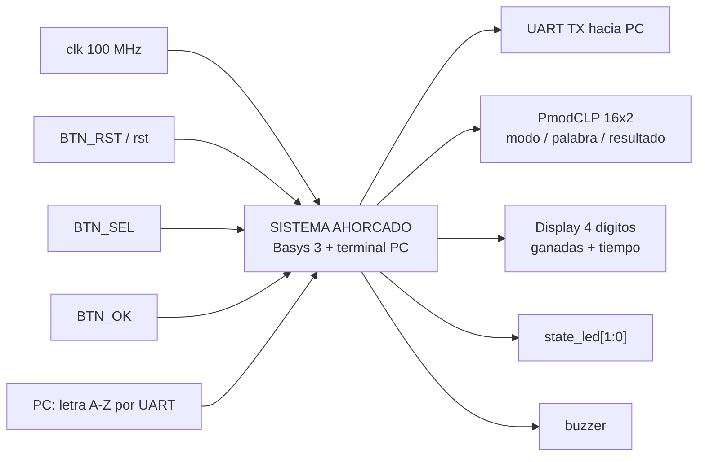

**Nivel 2: bloques funcionales.** La FSM no envía órdenes puntuales a cada bloque: publica `state` y
`modo`, y cada bloque reconoce el estado que le interesa.

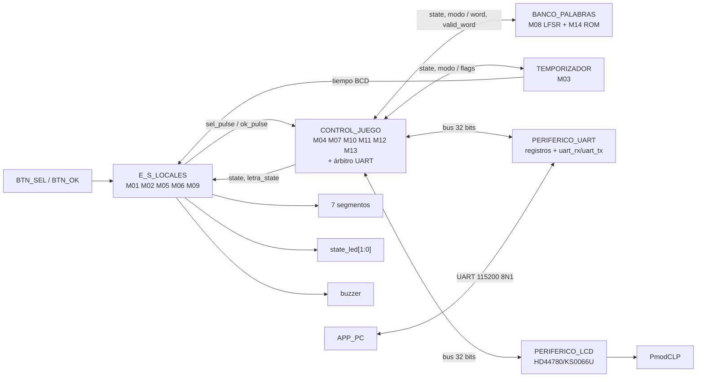

**Nivel 3: módulos implementados** (archivos en `src/design/`).

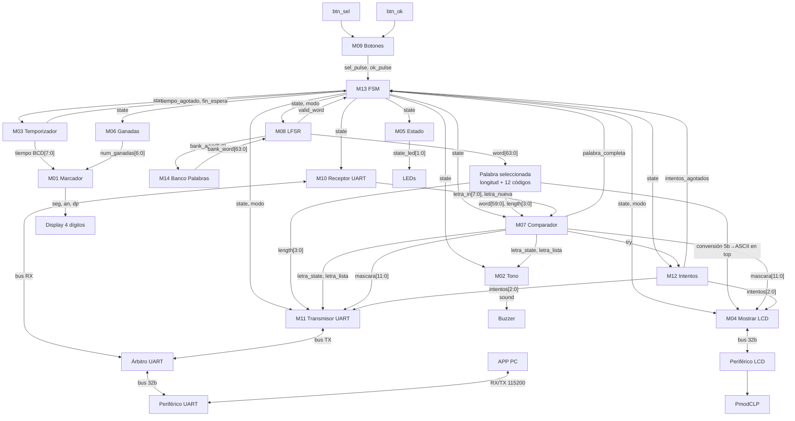

Observaciones de integración:

- `word[63:0]` sale directamente de `lfsr.sv`; `top.sv` hace el *slicing* de la palabra y la
  conversión de los códigos de 5 bits a ASCII para `mostrar_lcd`. `palabra_escogida.sv` existe en el
  repositorio pero no está instanciado.
- El receptor y el transmisor UART no se conectan directamente al periférico: pasan por
  `arbitro_uart.sv`.
- `mostrar_lcd.sv` escribe al periférico LCD por bus; no genera directamente `RS`, `RW`, `E` ni
  `lcd_data`.
- El display es uno solo de cuatro dígitos: AN0/AN1 muestran las partidas ganadas y AN2/AN3 el
  tiempo restante.

**Nivel 4: diseño interno de cada módulo.** Cada módulo (M01–M14, `arbitro_uart`, `periferico_uart`,
`periferico_lcd`) tiene su ficha en [`docs/diseño/modulos/`](../diseño/modulos/) con diagrama
modular, entradas, salidas, funcionamiento y diagrama esquemático detallado. En este informe sus
interfaces se resumen en la sección 5, los periféricos en las secciones 6 y 7, y las máquinas de
estado en la sección 8.

### 4.2 Decisiones de diseño y su justificación

| # | Decisión | Justificación |
|---|---|---|
| D1 | **La FSM principal solo publica `state` y `modo`**; cada módulo decodifica su propio disparo con un detector de flanco sobre `state` (p. ej. entrada a `JUEGO`, entrada a `GANO`/`PERDIO`). | La FSM queda en 5 estados y 70 líneas. No hay pulsos `start`/`show`/`detener` que se puedan desalinear entre módulos, y agregar un consumidor nuevo no obliga a tocar la FSM. |
| D2 | **Un solo estado `PERDIO`** para derrota por intentos y por tiempo. La causa se reconstruye en `transmisor_uart` a partir de `intentos` (si llegó a 6, fue por intentos; si no, por tiempo). | El contador de intentos solo se limpia en `CARGA`, así que su valor sigue intacto durante `PERDIO`. La prioridad coincide con la de la FSM (intentos antes que tiempo). Se ahorra un estado y la lógica de decodificación en 6 módulos. |
| D3 | **Estado `CARGA` explícito** entre `SELECCION` y `JUEGO`. | Da un ciclo seguro para limpiar máscara, letras usadas e intentos, y espera `valid_word` del LFSR, que puede tardar varios ciclos si el valor muestreado cae fuera de rango. |
| D4 | **LFSR de 6 bits de corrida libre, muestreado con rechazo.** En FÁCIL se acepta el valor si está entre 1 y 50; en DIFÍCIL se usan los 5 bits bajos (0–31) como índice a las 32 palabras de 6 o más letras. | La ROM se ordenó para que las direcciones 1–32 sean justamente las palabras de 6 a 12 letras. Así, el modo difícil no necesita filtrar en tiempo de ejecución y cualquier índice de 5 bits es válido. Como el LFSR avanza cada ciclo, un rechazo en FÁCIL se resuelve en unos pocos ciclos (13 de los 63 estados se descartan). |
| D5 | **Tiempos: 60 s en FÁCIL y 45 s en DIFÍCIL.** | Son los valores sugeridos por el enunciado y cumplen que difícil < fácil. Además, el modo difícil tiene palabras más largas (6–12 letras): con 45 s y hasta 12 letras distintas el jugador dispone de ~3,75 s por letra en el peor caso, lo cual es exigente pero jugable con el teclado. En FÁCIL, con palabras de 4–12 letras, 60 s dan margen para un jugador que está aprendiendo. |
| D6 | **Comparación paralela**: un comparador de 5 bits por posición (12 en total). | Revela todas las ocurrencias de una letra en un solo ciclo, como exige el enunciado, sin recorrer la palabra con un contador. |
| D7 | **Máscara con relleno en 1** por encima de la longitud. | `palabra_completa = &mascara` sirve igual para 4 o para 12 letras, sin comparar contra la longitud. |
| D8 | **Registro de letras usadas de 26 bits** (uno por letra A–Z). | Detectar una letra repetida (acertada o fallada) cuesta un solo acceso indexado, y la repetida no gasta intento ni reinicia el temporizador. |
| D9 | **Descarte de letras fuera de partida en `receptor_uart`**: el byte se lee y se limpia `new_rx` siempre, pero `o_valid_w` solo se activa si el byte está en A–Z **y** `state == JUEGO`. | Responde a la pregunta del enunciado sobre qué pasa si llega una letra en la selección de modo o en el resultado: se ignora sin afectar nada, y el periférico no queda trabado con `new_rx` en alto. |
| D10 | **Árbitro con prioridad fija para el receptor** entre los dos maestros del UART. | El receptor pide el bus 2 ciclos cada ~8 680 (un byte) y no tiene memoria para esperar. El transmisor tiene banderas de eventos pendientes y tolera demoras (sección 7.3). |
| D11 | **Transmisor con banderas pendientes y prioridad FIN > LETRA > INICIO.** | Un evento que ocurre mientras se transmite otra trama no se pierde; se envía después. |
| D12 | **`mostrar_lcd` redibuja por cambio de contenido**, no por un pulso de la FSM. Toma una "foto" del contenido al iniciar un envío. | La pantalla siempre termina mostrando el estado más reciente, y una ráfaga nunca mezcla dos mensajes distintos. |
| D13 | **Margen ×3 sobre los tiempos del datasheet** en el periférico LCD. | Con los mínimos del datasheet se perdía el primer carácter de cada mensaje en la tarjeta real (sección 12). |
| D14 | **Conteo del tiempo en BCD.** | El temporizador entrega directamente los dos dígitos al marcador, sin un conversor binario-BCD. |
| D15 | **Toolchain abierto openXC7** y `GNUmakefile` único para simular, sintetizar, programar y abrir la app. | Reproducible en Linux y FreeBSD sin licencias. `make all` deja el sistema listo con un solo comando. |

### 4.3 Codificación del estado global

`state[2:0]` es el contrato público que decodifican los demás módulos:

| Estado | Código | Pantalla LCD | `state_led[1:0]` |
|---|---|---|---|
| `SELECCION` | `000` | `MODO: FACIL` / `MODO: DIFICIL` | `00` |
| `CARGA` | `001` | (sin cambio) | `01` |
| `JUEGO` | `010` | `C__R_       I:5` | `01` |
| `GANO` | `011` | `GANASTE` | `10` |
| `PERDIO` | `100` | `PERDISTE` | `10` |
| no usados | `101`–`111` | — | `00` (vuelven a `SELECCION`) |

### 4.4 Asignación de pines (Basys 3)

| Señal | Pin(es) | Ubicación |
|---|---|---|
| `clk` | W5 | Oscilador 100 MHz |
| `rst` (`BTN_RST`) | U18 | Botón central |
| `btn_sel`, `btn_ok` | N17, P18 | Pmod JC (pulsadores externos) |
| `buzzer` | M18 | Pmod JC |
| `lcd_rs_o`, `lcd_rw_o`, `lcd_e_o` | H1, K2, H2 | Pmod JA |
| `lcd_data_o[7:0]` | J3, L3, M2, N2, K3, M3, M1, N1 | Pmod JXADC |
| `rx_i`, `tx_o` | B18, A18 | Puente USB-UART (FT2232) |
| `seg[6:0]`, `dp`, `an[3:0]` | W7…U7, V7, U2…W4 | Displays de 7 segmentos |
| `state_led[1:0]` | U16, E19 | LD0, LD1 |

---

## 5. Descripción formal de interfaces de módulos

Todos los módulos usan reset **síncrono y activo en alto** (`rst`), conectado a `BTN_RST`. El reset
reinicia todo el sistema, incluido el contador de partidas ganadas.

### M13 — `fsm` (control principal)

| Puerto | Dir. | Ancho | Descripción |
|---|---|---|---|
| `clk`, `rst` | in | 1 | Reloj y reset |
| `i_sel`, `i_ok` | in | 1 | Pulsos filtrados de `BTN_SEL` y `BTN_OK` |
| `i_valid_word` | in | 1 | Palabra lista, desde `lfsr` |
| `i_palabra_completa` | in | 1 | Todas las posiciones reveladas, desde `comparador_letra` |
| `i_intentos_agotados` | in | 1 | Seis fallos, desde `contador_intentos` |
| `i_tiempo_agotado` | in | 1 | Cuenta regresiva en 0, desde `temporizador` |
| `i_fin_espera` | in | 1 | Pasaron los 3 s de resultado, desde `temporizador` |
| `o_state` | out | 3 | Estado global (tabla 4.3) |
| `o_modo` | out | 1 | 0 = FÁCIL, 1 = DIFÍCIL. Solo cambia en `SELECCION` |

### M08 — `lfsr` y `banco_palabras`

| Puerto | Dir. | Ancho | Descripción |
|---|---|---|---|
| `i_state`, `i_modo` | in | 3, 1 | Solo interesa la entrada a `CARGA` |
| `i_bank_word` | in | 64 | Palabra leída de la ROM (combinacional) |
| `o_bank_addr` | out | 6 | Dirección 1–50 hacia la ROM |
| `o_word` | out | 64 | `{longitud[3:0], letra12..letra1}` (5 b por letra) |
| `o_valid_word` | out | 1 | Palabra capturada, hacia la FSM |

`banco_palabras`: `i_bank_addr[5:0]` → `o_bank_word[63:0]`. Las direcciones 1–32 contienen 32
palabras de 6 a 12 letras, y las 33–50 contienen 18 palabras de 4 o 5 letras. En total son 50.

### M07 — `comparador_letra`

| Puerto | Dir. | Ancho | Descripción |
|---|---|---|---|
| `i_letra` | in | 8 | ASCII de la letra recibida |
| `i_letra_nueva` | in | 1 | Pulso de letra válida, desde `receptor_uart` |
| `i_word`, `i_word_length` | in | 60, 4 | Palabra secreta y longitud |
| `i_state` | in | 3 | En `CARGA` limpia máscara y letras usadas |
| `o_letra_state` | out | 2 | `00` fallo, `01` acierto, `10` repetida |
| `o_letra_lista` | out | 1 | Pulso que acompaña a `o_letra_state` |
| `o_mascara` | out | 12 | Posiciones reveladas (bit 0 = primera letra) |
| `o_palabra_completa` | out | 1 | `&o_mascara` |
| `o_try` | out | 1 | Pulso de fallo, hacia `contador_intentos` |

### M12 — `contador_intentos`

`i_try`, `i_state` → `o_intentos[2:0]` (0–6, saturado) y `o_intentos_agotados` (`intentos >= 6`).
Se limpia en `CARGA`.

### M03 — `temporizador`

| Puerto | Dir. | Ancho | Descripción |
|---|---|---|---|
| `i_state`, `modo` | in | 3, 1 | Arranca al entrar a `JUEGO`; se detiene al entrar a `GANO`/`PERDIO` |
| `tiempo` | out | 8 | Tiempo restante en BCD `{decenas, unidades}` |
| `tiempo_agotado` | out | 1 | La cuenta llegó a 0 mientras corría |
| `o_fin_espera` | out | 1 | Tercer segundo dentro de `GANO`/`PERDIO` |

Parámetro `PRESCALER_RECARGA = 99_999_999`. Se reduce en el testbench.

### M10 — `receptor_uart`, M11 — `transmisor_uart`, `arbitro_uart`

| Módulo | Entradas principales | Salidas principales |
|---|---|---|
| `receptor_uart` | `i_rdata[31:0]`, `i_state` | `o_addr`, `o_write_enable`, `o_wdata` (bus); `o_letra[7:0]`, `o_valid_w` |
| `transmisor_uart` | `i_state`, `i_modo`, `i_letra_state`, `i_letra_lista`, `i_intentos`, `i_word_length`, `i_mascara`, `i_rdata`, `i_bus_libre` | `o_addr`, `o_write_enable`, `o_wdata` (bus) |
| `arbitro_uart` | bus del receptor, bus del transmisor, `i_rdata` del periférico | bus hacia el periférico, `o_rx_rdata`, `o_tx_rdata`, `o_tx_bus_libre` |

### M04 — `mostrar_lcd`

| Puerto | Dir. | Ancho | Descripción |
|---|---|---|---|
| `i_state`, `i_modo` | in | 3, 1 | Deciden la pantalla |
| `i_word` | in | 96 | Palabra en ASCII (12 × 8 b) |
| `i_word_length`, `i_mascara`, `i_intentos` | in | 4, 12, 3 | Contenido de la pantalla de juego |
| `i_rdata` | in | 32 | Lectura del periférico LCD (`busy`, `done`) |
| `o_addr`, `o_write_enable`, `o_wdata` | out | 2, 1, 32 | Bus hacia `periferico_lcd` |

### E/S locales

| Módulo | Entradas | Salidas |
|---|---|---|
| M09 `botones` (+ `debounce`) | `btn_ok`, `btn_sel` | `btn_ok_pulse`, `btn_sel_pulse` (1 ciclo) |
| M01 `marcador` | `time_value[7:0]` (BCD), `num_ganadas[6:0]` | `seg[6:0]`, `an[3:0]`, `dp` (activos en bajo) |
| M02 `generador_tono` | `i_state`, `i_letra_state`, `i_letra_lista` | `o_sound` |
| M05 `Estado` | `state` | `state_led[1:0]` |
| M06 `M06_Ganadas` | `state` | `num_ganadas[6:0]` (0–99, saturado) |

### Interfaz estándar de periféricos

| Señal | Dir. | Descripción |
|---|---|---|
| `clk_i` | in | Reloj del sistema |
| `rst_i` | in | Reset **síncrono**, activo en alto |
| `write_enable_i` | in | 1 = escritura del registro en `addr_i` |
| `addr_i[1:0]` | in | Registro interno |
| `wdata_i[31:0]` | in | Dato de escritura |
| `rdata_o[31:0]` | out | Lectura combinacional del registro en `addr_i` |

---

## 6. Periférico LCD

Archivo: [`src/design/periferico_lcd.sv`](../../src/design/periferico_lcd.sv). Parámetro:
`CLK_FREQ_HZ` (100 MHz). Todos los tiempos se derivan de él.

### 6.1 Mapa de registros

| `addr_i` | Registro | Acceso |
|---|---|---|
| `2'b00` (offset `0x00`) | CONTROL/ESTADO | R/W |
| `2'b01` (offset `0x04`) | DATOS | R/W |
| `2'b10`, `2'b11` | — | lectura = 0 |

**Registro 0: CONTROL/ESTADO**

| Bit | Nombre | Acceso | Descripción |
|---|---|---|---|
| 0 | `start` | W1P | Inicia una transacción con `rs` y `data_byte` actuales |
| 1 | `rs` | RW | 0 = comando, 1 = dato (carácter) |
| 2 | `clear` | W1P | *Clear Display* (`0x01`), espera 1,52 ms × 3 |
| 3 | `home` | W1P | *Return Home* (`0x02`), espera 1,52 ms × 3 |
| 7:4 | — | — | Reservados, leen 0 |
| 8 | `busy` | RO | 1 mientras el periférico no esté en reposo (incluye la inicialización) |
| 9 | `done` | RO | Pulso de un ciclo al terminar una operación aceptada |
| 31:10 | — | — | Reservados, leen 0 |

Si en una misma escritura se activan varios bits W1P, la prioridad es `clear` > `home` > `start`.

**Registro 1: DATOS**

| Bits | Nombre | Acceso | Descripción |
|---|---|---|---|
| 7:0 | `data_byte` | RW | ASCII o código de instrucción enviado con `start` |
| 31:8 | — | — | Reservados, leen 0 |

### 6.2 Tiempos implementados (a 100 MHz, con margen ×3)

| Parámetro | Mínimo (datasheet) | Implementado | Ciclos |
|---|---|---|---|
| Espera de encendido | 20 ms | 20 ms | 2 000 000 |
| *Setup* RS/datos | 80 ns | 240 ns | 24 |
| Ancho de pulso E | 230 ns | 1,5 µs | 150 |
| *Function Set* / *Display ON* | 37 µs | 111 µs | 11 100 |
| Carácter / comando normal | 40 µs | 120 µs | 12 000 |
| *Clear* / *Home* | 1,52 ms | 4,56 ms | 456 000 |

### 6.3 Uso desde `mostrar_lcd`

Para escribir un mensaje, `mostrar_lcd` sigue esta secuencia:

1. Espera a que `busy = 0` (fin de la inicialización).
2. Escribe `clear | home` en CONTROL y espera `done`.
3. Por cada carácter: escribe el ASCII en DATOS, escribe `start | rs` en CONTROL y espera `done`.

Las pantallas son `MODO: FACIL`, `MODO: DIFICIL`, `GANASTE`, `PERDISTE` y, en juego, la palabra
con guiones bajos en las posiciones ocultas más el sufijo fijo ` I:n` (intentos restantes) en las
columnas 12–15. La pantalla de juego tiene siempre 16 caracteres, así una palabra de 12 letras nunca
pisa el contador.

---

## 7. Periférico UART y protocolo de aplicación

### 7.1 Mapa de registros del periférico UART

Archivo: [`src/design/periferico_uart.sv`](../../src/design/periferico_uart.sv). Parámetros:
`TICKS_BIT = 868`, `TICKS_X16 = 54`.

| `addr_i` | Registro | Campo | Acceso | Descripción |
|---|---|---|---|---|
| `2'b00` | DATOS 0 (TX) | `DATO[7:0]` | RW | Byte a transmitir |
| `2'b01` | DATOS 1 (RX) | `DATO[7:0]` | RW | Último byte recibido |
| `2'b10` | CONTROL | bit 0 `send` | WC | Escribir 1 inicia la transmisión; el periférico lo baja al terminar |
| `2'b10` | CONTROL | bit 1 `new_rx` | RW | Se pone en 1 al recibir un byte; lo limpia quien lee |
| `2'b11` | — | — | — | Lectura = 0 |

Las direcciones de los dos registros de datos las fija el enunciado. La dirección del control
(`2'b10`) la eligió el equipo. Si en un mismo ciclo llega un byte y se escribe el control, **gana
la recepción**, para no perder el dato recién recibido.

### 7.2 Protocolo de aplicación

**PC → FPGA.** Un byte ASCII en mayúscula (`0x41`–`0x5A`). La app valida la tecla antes de
enviarla y la FPGA vuelve a validarla: cualquier otro byte, o una letra que llega fuera de
`JUEGO`, se descarta sin afectar la partida.

**FPGA → PC.** Tramas binarias de largo variable. El primer byte es una cabecera ASCII imprimible,
para poder leer la trama con un monitor serial durante la depuración:

| Trama | Disparo | Byte 0 | Byte 1 | Byte 2 | Byte 3 | Byte 4 | Largo |
|---|---|---|---|---|---|---|---|
| INICIO | entrada a `JUEGO` | `'I'` `0x49` | `{7'b0, modo}` | `{4'b0, longitud}` | | | 3 |
| LETRA | `o_letra_lista` | `'L'` `0x4C` | `{6'b0, resultado}` | `{5'b0, fallos}` | `mascara[7:0]` | `{4'b0, mascara[11:8]}`* | 5 |
| FIN | entrada a `GANO`/`PERDIO` | `'F'` `0x46` | `{5'b0, causa}` | | | | 2 |

\* Los bits de la máscara por encima de `longitud` vienen en 1 (relleno); la PC solo mira los
primeros `longitud` bits.

| Campo | Codificación |
|---|---|
| `modo` | 0 = FÁCIL, 1 = DIFÍCIL |
| `resultado` | `00` fallo, `01` acierto, `10` repetida |
| `fallos` | intentos fallidos acumulados, 0–6 (la PC calcula `6 - fallos`) |
| `mascara` | bit $i$ = 1 si la posición $i$ está revelada (bit 0 = primera letra) |
| `causa` | `011` ganó, `100` perdió por intentos, `101` perdió por tiempo |

El tiempo restante **no** se transmite, como permite el enunciado.

**Semántica y decisiones.**

- La letra repetida también genera una trama LETRA (con resultado `10`). Si no la generara, la app
  se quedaría esperando una respuesta que nunca llega.
- La trama LETRA no repite la letra. La app aparea las respuestas en orden con una cola FIFO de las
  letras que envió, lo cual es válido porque el enlace preserva el orden.
- El decodificador de la app es una máquina de estados sobre el flujo de bytes: descarta todo lo
  que no sea una cabecera válida cuando no hay trama en curso. Eso resincroniza la app si se abre a
  media partida.

**Ejemplo.** Palabra `CARRO` (5 letras), modo FÁCIL:

```
FPGA→PC  49 00 05            INICIO, fácil, 5 letras        _ _ _ _ _
PC→FPGA  5A                  'Z'
FPGA→PC  4C 00 01 E0 0F      LETRA, fallo, 1 fallo,  máscara 0b1111_1110_0000
PC→FPGA  52                  'R'
FPGA→PC  4C 01 01 EC 0F      LETRA, acierto, máscara 0b1111_1110_1100 → _ _ R R _
PC→FPGA  52                  'R' otra vez
FPGA→PC  4C 02 01 EC 0F      LETRA, repetida, sin penalización
...
FPGA→PC  46 03               FIN, ganó
```

### 7.3 Arbitraje del bus UART

Dentro de CONTROL_JUEGO hay dos maestros para un periférico de un solo puerto: `receptor_uart` y
`transmisor_uart`. El `arbitro_uart` resuelve el acceso así:

- **Leer CONTROL no cuenta como pedir el bus.** En reposo el bus apunta a CONTROL, y ambos maestros
  sondean `send` y `new_rx` a la vez sin estorbarse.
- **El receptor tiene prioridad absoluta.** Pide el bus 2 ciclos por byte recibido (leer `DATOS_RX`
  y limpiar `new_rx`). Mientras tanto, `o_tx_bus_libre = 0` y el transmisor repite su escritura en
  el ciclo siguiente.
- **Escrituras concurrentes a CONTROL.** Como `send` y `new_rx` comparten registro, el árbitro
  reconstruye la palabra escrita: toma el bit del maestro que escribe y conserva el bit del otro
  leyéndolo del periférico en el mismo ciclo. Así, limpiar `new_rx` nunca cancela un `send` en
  curso, y activar `send` nunca borra un `new_rx` pendiente.

---

## 8. Diagramas de estado

### 8.1 FSM principal (M13)

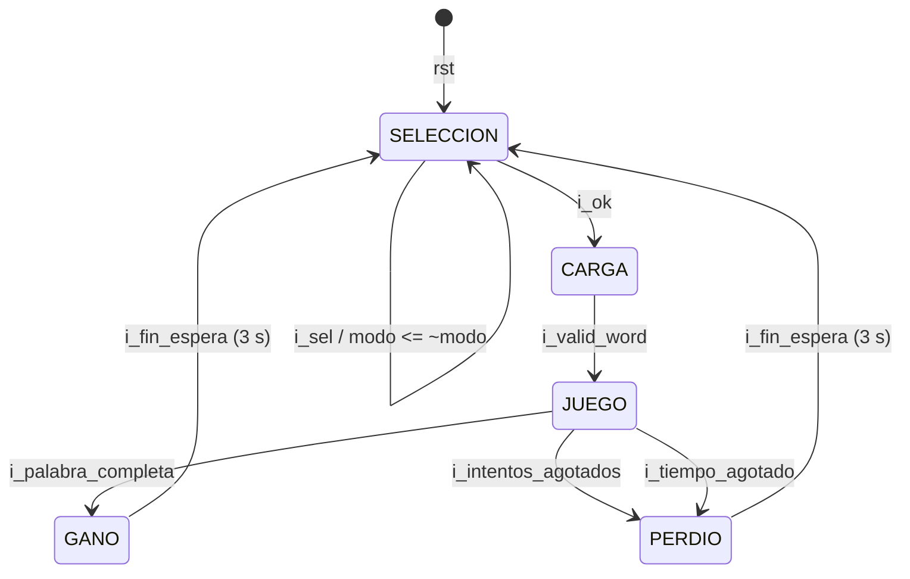

| Estado actual | Condición | Siguiente |
|---|---|---|
| `SELECCION` | `i_ok` | `CARGA` |
| `SELECCION` | `i_sel` | `SELECCION` (conmuta `modo`) |
| `CARGA` | `i_valid_word` | `JUEGO` |
| `JUEGO` | `i_palabra_completa` | `GANO` |
| `JUEGO` | `!i_palabra_completa && i_intentos_agotados` | `PERDIO` |
| `JUEGO` | `!i_palabra_completa && !i_intentos_agotados && i_tiempo_agotado` | `PERDIO` |
| `GANO` / `PERDIO` | `i_fin_espera` | `SELECCION` |
| `101`, `110`, `111` | — | `SELECCION` |
| cualquiera | `rst` | `SELECCION`, `modo = FÁCIL` |

La prioridad en `JUEGO` es palabra completa > intentos > tiempo. Si la última letra acertada
coincide con el último segundo, gana el jugador.

### 8.2 FSM del periférico LCD

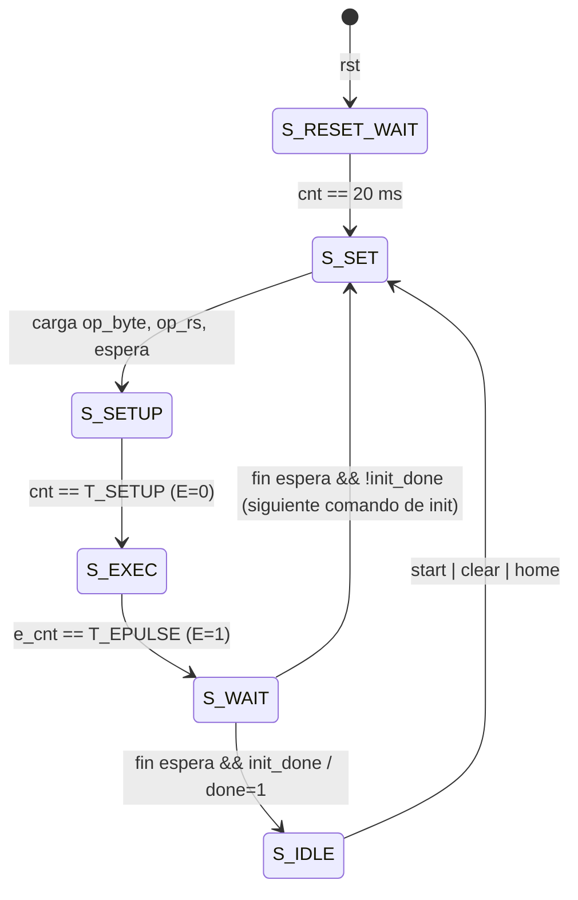

- En `S_SET` se decide el byte: durante la inicialización sale de la tabla (`0x38`, `0x0C`,
  `0x01`); después sale de `pending_op` (`clear` → `0x01`, `home` → `0x02`, `start` →
  `data_byte` con `rs`).
- `busy = (state != S_IDLE)`, así que también vale 1 durante los ~20 ms de inicialización.
- `E = (state == S_EXEC)`. `RS` y `DB` se mantienen estables desde `S_SET` hasta el final de
  `S_WAIT`, lo que garantiza el *setup* y el *hold*.

### 8.3 FSM de `mostrar_lcd` (M04)

```mermaid
stateDiagram-v2
    [*] --> IDLE
    IDLE --> HOME : cambio && state != CARGA && !busy / foto del contenido
    HOME --> HOME : paso 0 escribe clear|home; paso 1 espera done
    HOME --> SEND : done
    SEND --> SEND : paso 0 escribe DATOS
    SEND --> WAIT : paso 1 escribe start|rs
    WAIT --> SEND : done && pos != ultima / pos++
    WAIT --> IDLE : done && pos == ultima
```

`cambio` se activa cuando cambia `state`, cuando cambia `modo` en `SELECCION`, o cuando cambian la
máscara o los intentos en `JUEGO`.

### 8.4 FSM del transmisor (M11) y del receptor (M10)

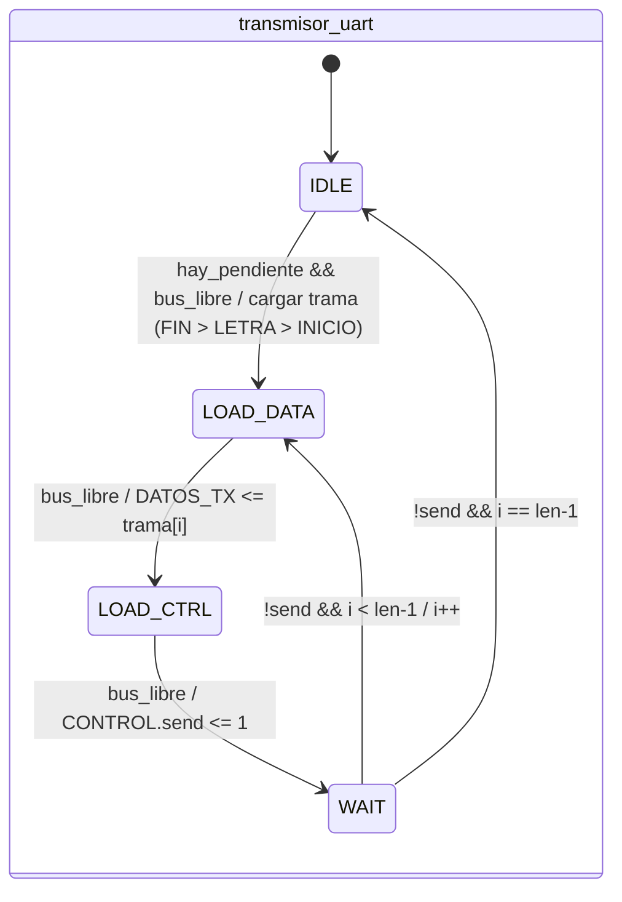

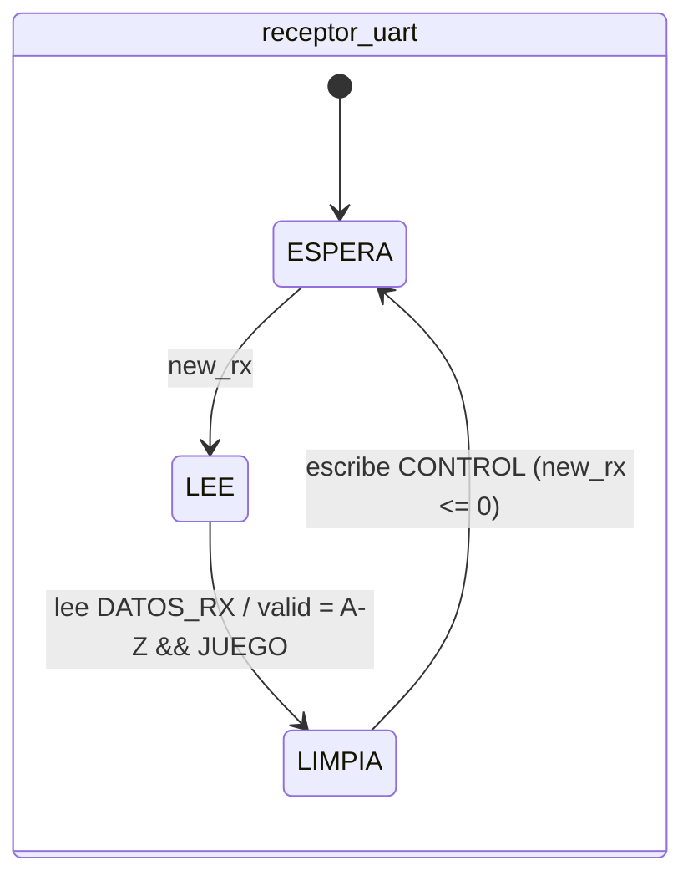

---

## 9. Estrategia de validación

La validación se hizo en tres niveles.

**1. Simulación de módulo con testbenches autoverificables** (`src/sim/tb_*.sv`, Icarus Verilog
12). Cada testbench aplica estímulos, compara las salidas contra el valor esperado con una tarea de
chequeo (`chequear`/`anotar`) y reporta al final `N pruebas, M fallos` o
`=== TODAS LAS PRUEBAS PASARON ===`. **Criterio de pase:** cero fallos. Los módulos con tiempos
largos se parametrizan y se simulan reescalados (preescalador del temporizador, `CLK_FREQ_HZ` del
periférico LCD = 1 MHz, `TICKS_BIT` del UART). Todos se corren juntos con `make test`.

**2. Simulación de integración** (`tb_top.sv`). Instancia el `top` completo, fuerza la palabra
`CARRO` y recorre `SELECCION → CARGA → JUEGO → letra fallida → letras correctas → GANO`,
verificando la máscara, los intentos, la transición de la FSM y el incremento del contador de
partidas ganadas. La letra se inyecta como una trama serial real en `rx_i`, así que el camino
periférico UART → árbitro → receptor → comparador queda cubierto.

**3. Pruebas en la FPGA.**

- *Harnesses* de hardware en `src/fpga/harness/` para probar módulos aislados en la tarjeta:
  temporizador, generador de tono, marcador + intentos + ganadas, `mostrar_lcd` y la cadena UART
  completa (eco de valores conocidos hacia la PC, como pide el enunciado para validar el periférico
  UART).
- Partidas completas en ambos modos con la app de PC.

**4. Aplicación de PC.** `make test-app` corre 23 pruebas `unittest` sin tarjeta: decodificación
de las tres tramas, tramas partidas en varias lecturas, basura antes de la cabecera, apertura a
media trama, filtro A–Z (incluidas tildes y ñ), revelación de varias posiciones, letras repetidas y
reinicio entre partidas.

**5. Verificación estática.** `make synth` falla si yosys infiere algún latch, y el análisis de
timing de nextpnr-xilinx se revisa contra la restricción de 10 ns del XDC.

---

## 10. Resultados

### 10.1 Resumen de simulaciones autoverificables

Resultado de `make test` (Icarus Verilog 12.0), ejecutado sobre la rama `develop`:

| Testbench | Módulo(s) bajo prueba | Verificaciones | Resultado |
|---|---|---:|---|
| `tb_arbitro_uart` | `arbitro_uart` | 16 | ✅ 0 fallos |
| `tb_botones` | `botones`, `debounce` | 9 | ✅ pasa |
| `tb_comparador_letra` | `comparador_letra` | 34 | ✅ 0 fallos |
| `tb_contador_intentos` | `contador_intentos` | 14 | ✅ 0 fallos |
| `tb_fsm` | `fsm` | 23 | ✅ pasa |
| `tb_Ganadas` | `M06_Ganadas` | 7 | ✅ pasa |
| `tb_generador_tono` | `generador_tono` | 18 | ✅ pasa |
| `tb_lfsr` | `lfsr` + `banco_palabras` | 134 | ✅ pasa |
| `tb_periferico_lcd` | `periferico_lcd` | 24 | ✅ 0 fallos |
| `tb_periferico_uart` | `periferico_uart` | 17 | ✅ 0 fallos |
| `tb_receptor_uart` | `receptor_uart` | 26 | ✅ 0 fallos |
| `tb_temporizador` | `temporizador` | 138 | ✅ pasa |
| `tb_transmisor_uart` | `transmisor_uart` | 28 | ✅ 0 fallos |
| `tb_top` | sistema completo | 9 | ✅ 0 fallos |
| **Subtotal** | | **397** | **0 fallos** |
| `tb_Estado` | `Estado` | — | ❌ no compila |
| `tb_marcador` | `marcador` | — | ❌ no compila |
| `tb_mostrar_lcd` | `mostrar_lcd` | — | ❌ no compila |
| `tb_uart_tx` | `uart_tx` | — | ❌ no compila |
| App de PC (`make test-app`) | `protocolo.py`, `partida.py` | 23 | ✅ OK |

### 10.2 Testbenches que no compilan

Los cuatro fallos son del testbench, no del RTL, y la causa de cada uno está identificada:

| Testbench | Error de Icarus | Causa | Corrección |
|---|---|---|---|
| `tb_Estado` | `Unknown module type: M05_Estado` | El módulo se llama `Estado` en `Estado.sv` | Instanciar `Estado` |
| `tb_marcador` | `syntax error` línea 8 | Declara una señal llamada `time`, palabra reservada de Verilog | Renombrar la señal (p. ej. `time_value`) |
| `tb_mostrar_lcd` | `Malformed statement` líneas 300–342 | Referencia `HOME_ENC`/`IDLE_ENC`, nombres de una versión anterior de la FSM interna | Usar `HOME`/`IDLE` |
| `tb_uart_tx` | `Cannot "return" from tasks` | `return` dentro de una `task`, no soportado por Icarus 12 | Reemplazar por `disable` o un `if/else` |

El comportamiento de `Estado` y `marcador` sí se probó en hardware con el *harness*
`top_marcador_intentos_ganadas.sv`. El de `mostrar_lcd` se probó con `top_mostrar_lcd.sv` y de forma
indirecta en `tb_top`. El núcleo `uart_tx` está cubierto indirectamente por `tb_periferico_uart` y
`tb_top`.

### 10.3 Evidencia de simulación (extractos)

**Temporizador** (preescalador reescalado): conteo completo 60 → 00 en FÁCIL y 45 → 00 en
DIFÍCIL, `tiempo_agotado`, espera de 3 s en `GANO`/`PERDIO` y detención al ganar antes de tiempo:

```
OK    [2526000 ns] cuenta facil: 0 s restantes: tiempo=00
OK    [2536000 ns] fin de cuenta: tiempo_agotado: 1
OK    [2756000 ns] GANO: 3er tick_1hz, fin_espera en 1: 1
OK    [2876000 ns] ganar con tiempo de sobra: running se apaga: 0
OK    [2976000 ns] entrar a JUEGO dificil: tiempo inicial: tiempo=45
OK    [4786000 ns] fin de cuenta dificil: tiempo_agotado: 1
=== TODAS LAS PRUEBAS PASARON ===
```

**Transmisor UART:** formato de las tres tramas, causa de la derrota y eventos concurrentes:

```
ok la trama de inicio son tres bytes
ok la trama de letra son cinco bytes
ok la repetida tambien avisa, si no la pc se queda esperando
ok con seis intentos la causa son los intentos
ok con cinco intentos se perdio por tiempo, aunque quedara uno
ok la letra que llega durante la trama de inicio no se pierde
ok con letra y fin a la vez, el fin sale primero
28 pruebas, 0 fallos
```

**Integración (`tb_top`)**, palabra `CARRO` recibida por la línea serial real:

```
OK    [45000 ns] tras rst la fsm arranca en SELECCION
OK    [10486205000 ns] ok confirmado, lfsr valida la palabra forzada y la fsm entra a JUEGO
OK    [10572705000 ns] Z no esta en CARRO, cuenta como intento fallido
OK    [10918505000 ns] con las 4 letras correctas la mascara queda completa
OK    [10918505000 ns] la fsm pasa a GANO
OK    [10918505000 ns] el marcador de partidas ganadas sube a 1
OK    [10918505000 ns] los intentos fallidos no volvieron a subir
9 pruebas, 0 fallos
```

Cada letra se genera bit a bit sobre `rx_i` con el baudaje real (868 ciclos por bit), así que la
prueba ejercita el núcleo RX, el periférico, el árbitro y el receptor tal como en la tarjeta. Las
cuatro letras correctas (`C`, `A`, `R`, `O`) llegan una tras otra y ninguna se pierde: la máscara
queda completa y la cuenta de fallos no se mueve de 1.

#### Formas de onda

Las figuras siguientes salen de los mismos VCD que generan los testbenches autoverificables. Se
exportaron a SVG con [vecdump](https://codeberg.org/mcit39/vecdump) mediante `make dump`, que recorta
el VCD a la ventana de interés con `src/sim/recortar_vcd.py`. Por ejemplo:

```sh
make dump TB=receptor_uart SIGS=clk_tb,rx_data_rdy,o_addr_tb,o_letra_tb,o_valid_w_tb \
          DESDE=82600000 HASTA=82720000 SVG=docs/informe/img/sim_receptor_bus.svg
```

Cómo leerlas:

- El eje horizontal está en **ps** (el *timescale* de Icarus) y empieza en 0 al inicio de cada
  ventana.
- Los buses se muestran en binario.
- Una zona gris indica actividad demasiado densa para la escala (por ejemplo, pulsos de un ciclo en
  una ventana de decenas de µs). Para verla, se incluye una figura ampliada.

**Sistema completo (`tb_top`), recepción y validación de una letra.** Esta es la misma prueba de
integración de la sección 9: la palabra forzada es `CARRO` y la letra `Z` (`0x5A`) llega bit a bit
por `rx_i` a 115 200 baudios. La trama muestra el bit de arranque, los 8 bits LSB primero
(`0,1,0,1,1,0,1,0`) y el bit de parada. Al final de la trama `letra_in` toma el valor `01011010`.

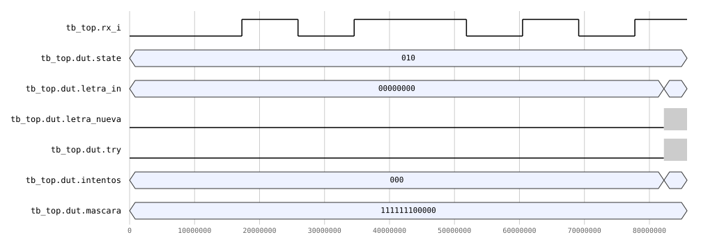

Ampliación del final de la trama anterior. El receptor lee el dato por el árbitro (`rx_bus_addr = 01`)
y limpia `new_rx` escribiendo el control (`rx_bus_we`, `rx_bus_addr = 10`). En ese mismo ciclo
publica `letra_in = 'Z'` con `letra_nueva`. Como `Z` no está en `CARRO`, el comparador genera `try`,
`intentos` pasa de 0 a 1 y `letra_lista` sale con `letra_state = 00` (fallo). La máscara
`111111100000` no cambia: los 7 bits altos son el relleno por encima de la longitud 5.

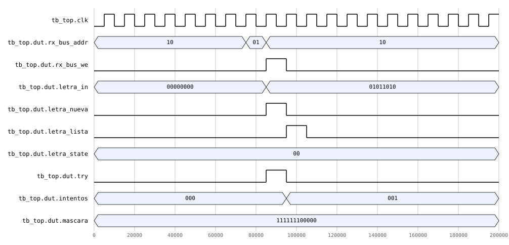

Última letra de la partida. La `O` (`01001111`) revela la posición que faltaba, la máscara queda en
`111111111111` y `palabra_completa` sube. Un ciclo después la FSM pasa de `JUEGO` (`010`) a `GANO`
(`011`), y dos ciclos después `num_ganadas` sube a 1. `intentos` se queda en 1.

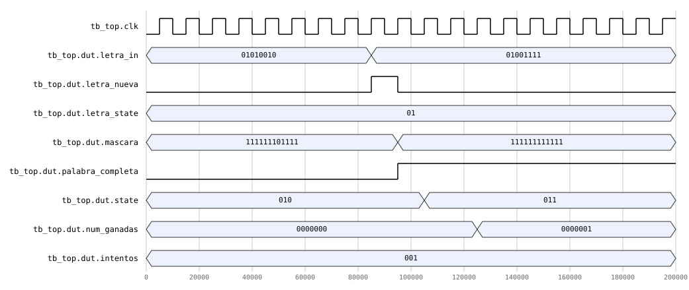

**Receptor UART (M10).** Trama de la letra `A` (`0x41`) sobre la línea serial. Los pulsos de
`rx_data_rdy`, `new_rx` y `o_valid_w` duran un ciclo y aparecen en gris a esta escala.

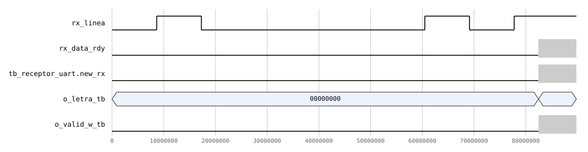

La siguiente ampliación muestra el sondeo del bus. El núcleo pulsa `rx_data_rdy` y el periférico
levanta `new_rx`. `estado` pasa de `ESPERA` (`00`) a `LEE` (`01`), donde se lee el dato
(`o_addr = 01`), y luego a `LIMPIA` (`10`), donde se escribe el control para bajar `new_rx`. En ese
mismo ciclo sale `o_letra = 01000001` con `o_valid_w`.

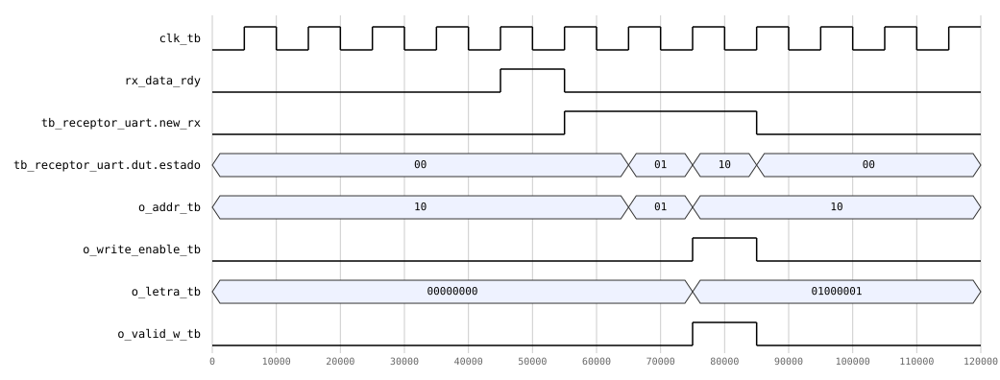

**Comparador de letra (M07).** Se carga `CASA` y se prueban, en orden, un acierto (`A`), un fallo
con pulso de `o_try` (`Z`), dos repetidas (`o_letra_state = 10`, sin `o_try`) y los aciertos que
completan la palabra. Después se recarga la palabra y se repite la secuencia. En cada caso
`o_letra_state` sale junto con `o_letra_lista`, y `o_palabra_completa` sube cuando la máscara llega
a `111111111111`.

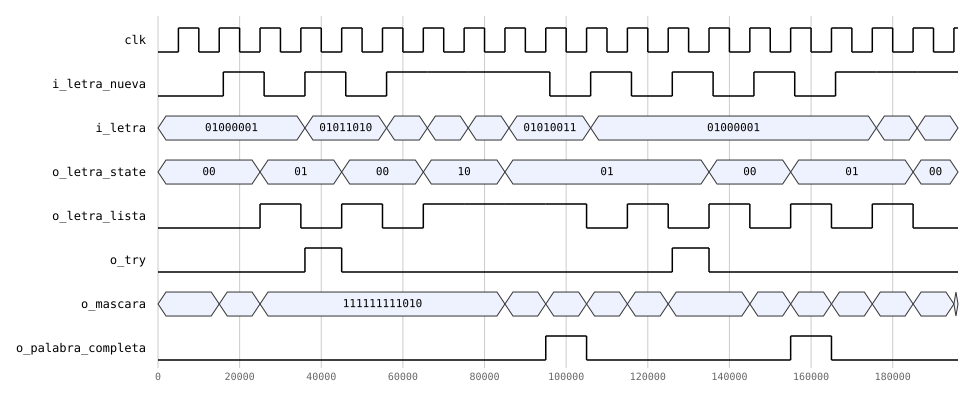

**Transmisor UART (M11).** Al entrar a `JUEGO` se envía la trama de inicio (3 bytes, `cnt_byte`
0–2). Después, un pulso de `i_letra_lista` dispara la trama de letra (5 bytes, `cnt_byte` 0–4). Por
cada byte, la FSM interna recorre `LOAD_DATA` (`01`), donde escribe el dato en la dirección `00`,
`LOAD_CTRL` (`10`), donde escribe `send` en la dirección `10`, y `WAIT` (`11`), donde espera a que el
periférico baje `send`. El modelo del periférico del testbench está reescalado a 20 ciclos por byte.

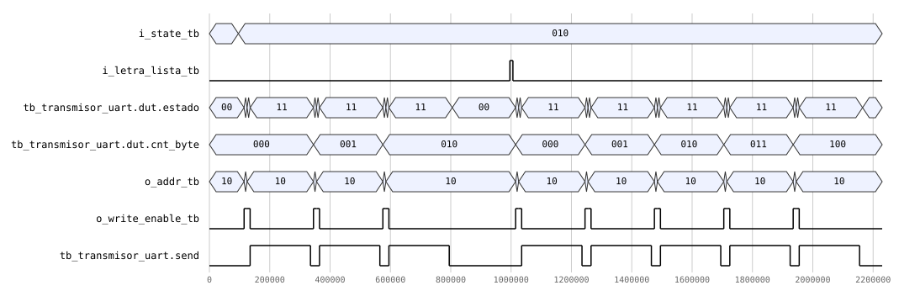

**Periférico LCD.** Escritura del carácter `A` después de la inicialización (simulado con
`CLK_FREQ_HZ = 1 MHz`). En `S_SET` (`001`) se fijan `RS = 1` y el dato `0x41`. `S_SETUP` (`010`)
respeta el tiempo de *setup* antes de `S_EXEC` (`011`), donde sube `E`, y `S_WAIT` (`100`) espera el
tiempo de ejecución. `RW` se mantiene en 0 todo el tiempo.

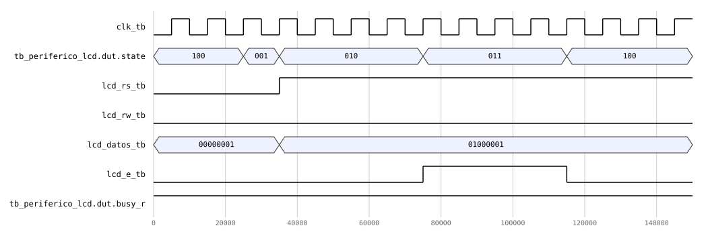

Vista completa de la misma operación. Después del pulso de `E` el periférico espera el tiempo de
ejecución del dato (40 µs × 3 de margen, en la escala reducida). Al terminar sube `done` y baja
`busy` por un ciclo antes de atender la siguiente operación pendiente.

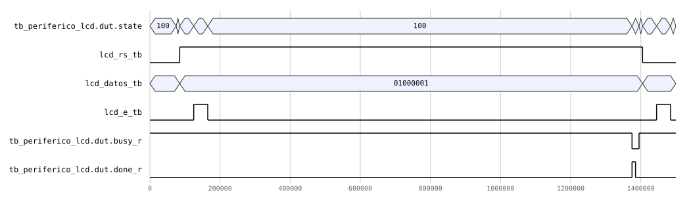

**Temporizador (M03).** Final de una cuenta en FÁCIL con el preescalador reescalado. Con cada
`tick_1hz`, `tiempo` baja de `02` a `01` y a `00`. Al llegar a 0, `running` se apaga y
`tiempo_agotado` sube. Luego el testbench pasa a `GANO` (`011`), y en el tercer `tick_1hz` dentro
del resultado sube `fin_espera`.

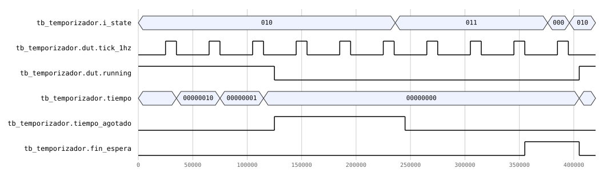

**FSM principal (M13).** En `SELECCION` (`000`), `i_sel` conmuta `o_modo`. Con `i_ok` la FSM pasa a
`CARGA` (`001`), con `i_valid_word` a `JUEGO` (`010`), con `i_palabra_completa` a `GANO` (`011`), y
con `i_fin_espera` vuelve a `SELECCION`.

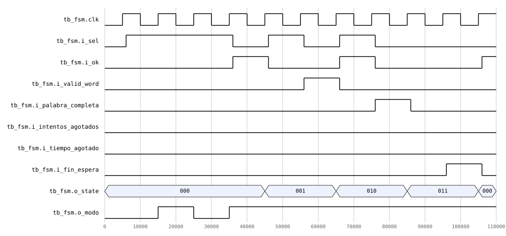

Las dos derrotas llevan al mismo estado `PERDIO` (`100`): primero por `i_intentos_agotados` y luego
por `i_tiempo_agotado`. En ambos casos la FSM regresa a `SELECCION` con `i_fin_espera`.

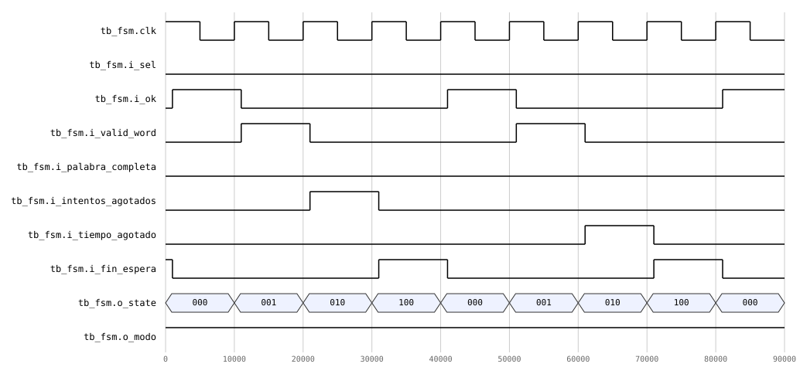

### 10.4 Uso de recursos

Síntesis con `yosys 0.68` (`synth_xilinx -flatten -abc9 -nobram -arch xc7`) sobre el `top` completo:

| Recurso | Usado | Disponible (XC7A35T) | Uso |
|---|---:|---:|---:|
| LUT (LUT2–LUT6) | 942 | 20 800 | 4,5 % |
| Flip-flops (FDRE + FDSE) | 697 | 41 600 | 1,7 % |
| CARRY4 | 131 | 8 150 | 1,6 % |
| BRAM | 0 | 50 | 0 % |
| DSP | 0 | 90 | 0 % |
| BUFG | 1 | 32 | 3,1 % |
| IOB (entradas / salidas) | 5 / 27 | 106 | 30 % |
| **Latches inferidos** | **0** | — | — |

nextpnr-xilinx reporta 2 075 celdas `SLICE_LUTX` después del empaquetado. La diferencia con los
942 LUT lógicos de yosys se debe a que nextpnr cuenta también los LUT de paso (*route-through*) que
inserta para alimentar flip-flops y cadenas de acarreo, más los 167 inversores que yosys lista
aparte. En cualquier caso el uso es bajo.

**Esquemático del netlist sintetizado.** Como verificación cruzada, el `top` también se sintetizó en
Vivado. La figura muestra el esquemático del netlist que genera la herramienta: las entradas están a
la izquierda y los puertos de salida (LCD, 7 segmentos, UART, LED y buzzer) a la derecha. Cada bloque
azul es una instancia del diseño (`u_fsm`, `u_lfsr`, `u_comparador_letra`, `u_mostrar_lcd`,
`u_periferico_lcd`, `u_periferico_uart`, etc.). La jerarquía coincide con el diagrama de nivel 3
(sección 4.1). `banco_palabras` y `arbitro_uart` no aparecen como bloques propios porque son
puramente combinacionales y quedaron integrados en la lógica que los rodea. La figura es vectorial,
así que al abrirla se puede ampliar para leer los nombres de las señales.

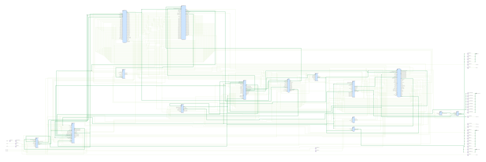

**Distribución aproximada por bloque:**

- La mayor parte de la lógica combinacional está en `mostrar_lcd` (mensajes fijos y la pantalla de
  juego, con multiplexores de 16 posiciones), en la ROM de palabras (plegada a LUT) y en los 12
  comparadores de `comparador_letra`.
- La mayoría de los flip-flops son contadores: el preescalador de 27 bits, los contadores de
  espera del LCD (21 bits), los de *debounce* (2 × 21 bits), los divisores de tono y de duración, el
  refresco de 7 segmentos (18 bits) y los contadores de bit de los núcleos UART. A eso se suman la
  palabra capturada (64 bits), la foto del contenido del LCD y las tramas del transmisor.

### 10.5 Análisis de *timing*

Colocación y ruteo con `nextpnr-xilinx 0.9.3` contra la restricción
`create_clock -period 10.00` (100 MHz):

| Métrica | Valor |
|---|---|
| Período requerido | 10,00 ns (100 MHz) |
| Retardo de la ruta crítica | 7,83 ns |
| **Frecuencia máxima** | **127,70 MHz — PASS** |
| Holgura (WNS) | +2,17 ns |
| Retardo lógico / de ruteo | 1,3 ns / 6,5 ns |

**Ruta crítica:** registro `state[0]` de la FSM → decodificación de la pantalla en `mostrar_lcd`
(multiplexor de los mensajes fijos `f_byte` y la ROM de caracteres) → registro del byte de datos.
El 83 % del retardo es de ruteo, porque `state` tiene un *fan-out* alto (lo decodifican 14 módulos)
y la lógica de destino queda lejos en el dispositivo.

### 10.6 Resultados funcionales en la FPGA

> **Nota para el equipo:** insertar aquí las capturas/fotografías y el enlace al video de la
> demostración (guardarlas en `docs/informe/img/`). Se dejan los espacios y la tabla de verificación
> que se llenó durante las pruebas.

| # | Requisito | Evidencia | Resultado |
|---|---|---|---|
| F1 | Selección de modo con `BTN_SEL`/`BTN_OK` en LCD | `img/lcd_seleccion.jpg` | ☐ |
| F2 | Partida completa en modo FÁCIL (victoria) | `img/partida_facil.jpg` + video | ☐ |
| F3 | Partida completa en modo DIFÍCIL (palabra de 6+ letras) | `img/partida_dificil.jpg` + video | ☐ |
| F4 | Derrota por 6 intentos fallidos | `img/derrota_intentos.jpg` | ☐ |
| F5 | Derrota por tiempo (cuenta llega a 00) | `img/derrota_tiempo.jpg` | ☐ |
| F6 | Revelación simultánea de letra repetida en la palabra | `img/revelacion_multiple.jpg` | ☐ |
| F7 | Letra repetida ignorada (sin gastar intento) | captura de la app | ☐ |
| F8 | Comunicación bidireccional con la app de PC | captura de la terminal | ☐ |
| F9 | Entrada inválida en la app (dígitos, símbolos, ñ) | captura de la terminal | ☐ |
| F10 | Tiempo restante y partidas ganadas en 7 segmentos | `img/7seg.jpg` | ☐ |
| F11 | LED de estado distingue selección / juego / resultado | `img/leds.jpg` | ☐ |
| F12 | Tonos distintos de acierto, fallo y fin | video | ☐ |
| F13 | `BTN_RST` reinicia todo y el contador de ganadas | video | ☐ |
| F14 | Resultado visible al menos 3 s y regreso a selección | video | ☐ |

<!--  -->
<!--  -->
<!--  -->

### 10.7 Simulación post-implementación temporizada

> **Pendiente.** El enunciado pide una simulación post-implementación temporizada que cubra al
> menos la recepción y validación de una letra. El flujo openXC7 no genera un netlist con retardos
> SDF listo para simular, por lo que esta simulación **no se realizó** con el toolchain abierto.
> La alternativa es correr el mismo `tb_top.sv` sobre el netlist temporizado que genera Vivado
> (`write_verilog -mode timesim` + `write_sdf`) e insertar aquí las formas de onda de `rx_i`,
> `letra_nueva`, `mascara` y `o_try`.

---

## 11. Análisis de resultados

**Timing.** El diseño cierra a 100 MHz con 2,17 ns de holgura (21,7 % del período). La ruta
crítica no está en la lógica del juego sino en la **decodificación de la pantalla** del LCD, que
depende directamente de `state`. La foto del contenido (`act_state`) ya evita que la ruta dependa
de la entrada de la FSM, pero `f_last_pos` y la decisión de `cambio` se calculan todavía con
`i_state`. Si el diseño creciera, registrar `state` a la entrada de `mostrar_lcd` cortaría la ruta
a la mitad a costa de un ciclo de latencia, que en la LCD es imperceptible (cada carácter tarda 120
µs). Una iteración anterior de `banco_palabras`, que empaquetaba la palabra con un *part-select*
variable según `i_bank_addr`, **no cerraba timing**. Al cambiarla a empaquetado con índice constante
dentro de un `generate`, la herramienta pliega cada palabra a constantes y la ROM queda como un
multiplexor simple (sección 12).

**Recursos.** Con menos del 5 % de los LUT y menos del 2 % de los flip-flops, el diseño cabe
holgadamente en el XC7A35T. La ROM de 50 palabras de 64 bits (3 200 bits) se implementó en LUT y
no en BRAM: a este tamaño una BRAM de 36 kbit se desperdiciaría casi por completo y agregaría un
ciclo de latencia de lectura. La codificación de 5 bits por letra más la longitud reduce la ROM de
4 800 a 3 200 bits frente a guardar ASCII más longitud.

**Comparación teórico vs. simulado vs. medido.**

| Magnitud | Teórico | Simulado | Observación en hardware |
|---|---|---|---|
| Tiempo por byte UART | 86,8 µs | tramas de 868 ciclos/bit en `tb_top`, sin pérdida | Sin pérdida de letras con la app |
| Tiempo FÁCIL / DIFÍCIL | 60 s / 45 s | 60→00 y 45→00 (reescalado) | Coincide con cronómetro* |
| Espera del resultado | 3 s | 3 `tick_1hz` exactos | ≥ 3 s en LCD* |
| Período de refresco 7 seg | 2,62 ms | — | Sin parpadeo visible |
| Debounce | 10,5 ms | reescalado en `tb_botones` | Un cambio de modo por presión* |
| Espera inicial LCD | ≥ 20 ms | 20 ms | Correcta tras margen ×3 |

\* Completar con las mediciones del equipo en la presentación.

El receptor sobremuestrea con $N_{\times16} = 54$ en vez de 54,25, lo que acorta su bit en un
0,46 %. En 10 bits el desfase acumulado es de ~4,6 % de un bit, lejos del ±50 % en que el muestreo
en el centro dejaría de caer dentro del bit correcto. Por eso no hay errores de recepción ni en
simulación ni en la tarjeta.

**Distribución del LFSR.** Con 6 bits y período 63, en DIFÍCIL los 5 bits bajos toman el valor 0
una sola vez por período y los valores 1–31 dos veces cada uno, porque el estado `000000` está
excluido. Así, la palabra de la dirección 1 (`CIUDAD`) sale con probabilidad 1/63 en vez de 2/63.
En FÁCIL, los estados 51–63 se rechazan y el resto son equiprobables (1/50). El sesgo es pequeño y
se corregiría con un LFSR de más bits cuyo período sea múltiplo de 32.

**Cobertura.** Los módulos de control (FSM, comparador, intentos, temporizador, LFSR, UART) tienen
testbenches con casos de borde: saturación del contador, prioridad de la FSM ante eventos
simultáneos, letra repetida, letra fuera de rango, byte durante una trama en curso, derrota por
tiempo con un intento restante. Los huecos de la verificación automática son los 4 testbenches que
no compilan (sección 10.2) y la simulación post-implementación (sección 10.7).

---

## 12. Problemas encontrados y su solución

| # | Problema | Síntoma | Causa | Solución |
|---|---|---|---|---|
| P1 | **Primer carácter perdido en la LCD** | En la tarjeta (no en simulación) faltaba la primera letra de cada mensaje | Los tiempos mínimos del datasheet no bastaban para el PmodCLP real | Factor `MARGEN_SEGURIDAD = 3` en todos los tiempos, y `mostrar_lcd` espera `done` después del *clear/home* antes de mandar el primer carácter |
| P2 | **Pulsos W1P perdidos en el LCD** | `clear`/`home` ignorados de forma intermitente | Los bits W1P solo valen el ciclo de la escritura, y `S_SET` los leía un ciclo tarde | Registro `pending_op` que guarda la operación en el mismo ciclo en que `S_IDLE` la detecta |
| P3 | **Byte UART que no salía o salía dos veces** | Tramas incompletas o bytes duplicados | El núcleo `uart_tx` tiene una ventana muerta de un bit en la que ignora pulsos cortos de `i_enviar`, y se rearmaba si `send` seguía alto | `send` se mantiene sostenido (semántica WC) y se baja con `listo_tx`, lo que deja un bit de margen |
| P4 | **Colisión de dos maestros en el bus UART** | Limpiar `new_rx` cancelaba un `send` en curso | `send` y `new_rx` comparten el registro CONTROL | `arbitro_uart` reconstruye la palabra de CONTROL conservando el bit del otro maestro |
| P5 | **Causa de derrota perdida (issue #27)** | La app mostraba siempre la misma causa tras unir `PERDIO_INTENTOS` y `PERDIO_TIEMPO` | `i_state` ya no distinguía la causa | La causa se deriva de `i_intentos` al entrar a `PERDIO` (6 → intentos, otro valor → tiempo), con un testbench nuevo |
| P6 | **Derrota inmediata al iniciar la partida siguiente** | Tras perder por tiempo, la partida siguiente terminaba en el primer ciclo | `tiempo_agotado` y `o_fin_espera` quedaban en 1 de la partida anterior | Se limpian también con la entrada a `GANO`/`PERDIO` y con `start` |
| P7 | **Contador de intentos del LCD sin actualizar** | Tras un fallo, el `I:n` no cambiaba | Un fallo no cambia la máscara, que era lo único que disparaba el redibujado | `cambio` incluye `i_intentos != act_intentos` |
| P8 | **App esperando respuesta indefinidamente** | Tras una letra repetida, la app no mostraba nada | No se enviaba trama para la repetida | `comparador_letra` activa `o_letra_lista` también para la repetida y se envía LETRA con resultado `10` |
| P9 | **ROM de palabras sin cerrar timing** | Ruta crítica > 10 ns en la ROM | *Part-select* variable dependiente de `i_bank_addr` sintetizado como lógica | Empaquetado con índice constante en `generate`, que se pliega a constantes |
| P10 | **Bitstream en blanco** | La tarjeta aceptaba el `.bit` sin error pero no hacía nada | `fasm2frames.py` fallaba por `PYTHONPATH` y dejaba un `.frames` vacío | El `GNUmakefile` exporta el entorno, verifica las herramientas antes de empezar (`check-fpga-toolchain`), usa `.DELETE_ON_ERROR` y rechaza un `.frames` vacío |
| P11 | **Conflictos de JTAG** | `openFPGALoader` no detectaba la tarjeta | `hw_server` de Vivado (Linux) o `uftdi` (FreeBSD) tomaban el FT2232 | `make connect` diagnostica el proceso o driver que ocupa la interfaz y sugiere la acción |
| P12 | **Limitaciones de Icarus Verilog** | Errores de compilación | `localparam` con arreglo sin empacar no soportado | Tabla de inicialización del LCD implementada como `function` con `case` |

---

## 13. Análisis crítico

### Logros

- Sistema completo e integrado, con toda la lógica del juego en la FPGA y la PC como terminal
  pura.
- Arquitectura en la que la FSM principal solo publica `state` y `modo`. Resultó fácil de integrar
  y depurar, porque cada módulo es dueño de su propio disparo.
- Periférico LCD propio con inicialización y temporización internas y la interfaz de registros
  pedida, validado en hardware.
- Protocolo binario compacto, resincronizable y documentado, con pruebas unitarias del lado de la
  PC sin necesidad de la tarjeta.
- Cierre de timing con 21 % de holgura, uso de recursos por debajo del 5 % y cero latches.
- Flujo reproducible sin Vivado: `make all` sintetiza, programa y abre la app.

### Limitaciones

- **No se hizo la simulación post-implementación temporizada** que pide el enunciado (sección
  10.7).
- Cuatro testbenches (`Estado`, `marcador`, `mostrar_lcd`, `uart_tx`) no compilan en Icarus por
  errores del propio testbench (sección 10.2).
- El LCD no muestra la causa de la derrota (solo `PERDISTE`), porque la FSM no la distingue. La
  causa sí llega a la PC.
- La palabra secreta no se revela al perder, ni en la LCD ni en la PC.
- `generador_tono` todavía declara el código `PERDIO_TIEMPO = 101`, que la FSM ya no produce. No
  afecta el funcionamiento (la derrota usa `100`, que coincide), pero es código muerto.
- Ligero sesgo del LFSR en el modo difícil (sección 11).

### Mejoras posibles

1. Corregir los cuatro testbenches y agregar la simulación temporizada con el netlist de Vivado.
2. Registrar `state` a la entrada de `mostrar_lcd` para mejorar la holgura de la ruta crítica.
3. Mostrar la palabra y la causa al perder (enviar la palabra en la trama FIN).
4. LFSR de 16 bits o *whitening* para eliminar el sesgo.
5. Agregar aserciones SVA a los testbenches de protocolo (bus UART, handshake `busy`/`done`).

---

## 14. Conclusiones y aprendizaje obtenido

1. **Centralizar el estado en un bus `state` y distribuir la decodificación simplifica la
   integración.** La FSM principal quedó en 5 estados, y todos los errores de integración que
   aparecieron (P5, P6, P7) se resolvieron dentro de un solo módulo, sin tocar la FSM.
2. **La interfaz de registros de 32 bits desacopla el control de los detalles del periférico.**
   `mostrar_lcd` no conoce ningún tiempo del HD44780: solo espera `busy`/`done`. Por eso el margen
   ×3 (P1) se agregó sin tocar el resto del sistema.
3. **La simulación no reemplaza la prueba en hardware.** El problema del primer carácter de la LCD
   (P1) no aparecía en simulación, porque el modelo cumplía exactamente los tiempos del datasheet.
   Tampoco aparecía en simulación el bitstream en blanco (P10).
4. **Los testbenches autoverificables pagan su costo.** Los 397 chequeos automáticos permitieron
   refactorizar la FSM (unir las dos derrotas) y detectar de inmediato sus efectos en el transmisor
   (issue #27). Los testbenches que dejaron de compilar al renombrar señales muestran también que la
   verificación tiene que mantenerse junto con el RTL, idealmente corriendo `make test` antes de cada
   *merge*.
5. **Las decisiones de timing se toman en el RTL.** El cambio del *part-select* variable a un
   índice constante en la ROM (P9) muestra que la forma de describir el hardware determina lo que la
   herramienta puede optimizar.
6. **Cuando hay varios maestros sobre un mismo registro, la semántica de cada bit tiene que estar
   bien definida.** El árbitro (P4) y el `send` sostenido (P3) salieron de entender exactamente qué
   significa WC, W1P y RW en cada bit.

Se cumplieron los objetivos 1 a 5. El objetivo 6 se cumplió en cuanto a timing y latches, y
parcialmente en verificación, por los cuatro testbenches pendientes y la simulación
post-implementación.

---

## 15. Referencias

[1] Digilent, *PmodCLP Reference Manual*. https://digilent.com/reference/_media/pmod:pmod:pmodclp_rm.pdf
(copia local en [`docs/pmodclp_rm.pdf`](../pmodclp_rm.pdf)).

[2] Samsung, *KS0066U 16COM/40SEG Driver & Controller for Dot Matrix LCD*, datasheet.
https://www.lcd-module.de/eng/pdf/zubehoer/ks0066.pdf

[3] Hitachi, *HD44780U (LCD-II) Dot Matrix Liquid Crystal Display Controller/Driver*, datasheet.

[4] Digilent, *Basys 3 FPGA Board Reference Manual*. https://digilent.com/reference/programmable-logic/basys-3/reference-manual

[5] Xilinx, *7 Series FPGAs Configurable Logic Block User Guide* (UG474).

[6] P. P. Chu, *FPGA Prototyping by SystemVerilog Examples: Xilinx MicroBlaze MCS SoC Edition*.
Wiley, 2018 (UART, *debouncing*, multiplexado de 7 segmentos).

[7] Xilinx, *Efficient Shift Registers, LFSR Counters, and Long Pseudo-Random Sequence Generators*
(XAPP052).

[8] openXC7 toolchain. https://github.com/openXC7

[9] J. González-Gómez, R. Coto Calderón, *Proyecto 2 — Ahorcado: juego electrónico FPGA / PC por
enlace serial*, EL3313, TEC, II Semestre 2026.

[10] Documentación de diseño del equipo: [`docs/diseño/diseño.md`](../diseño/diseño.md).
